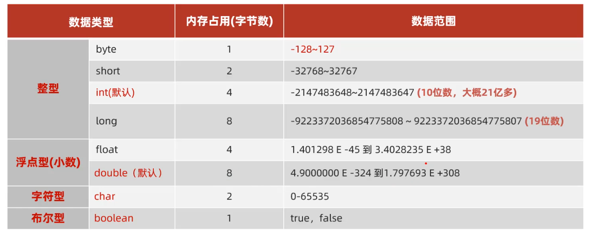
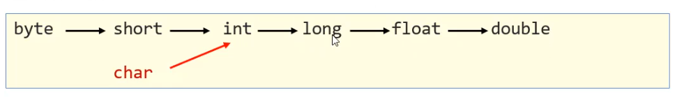
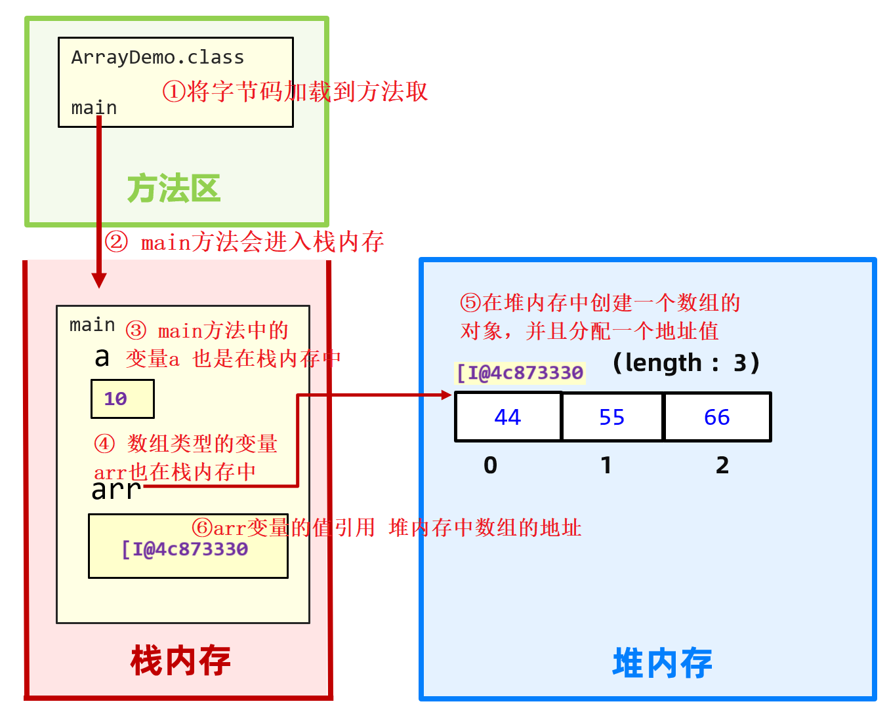
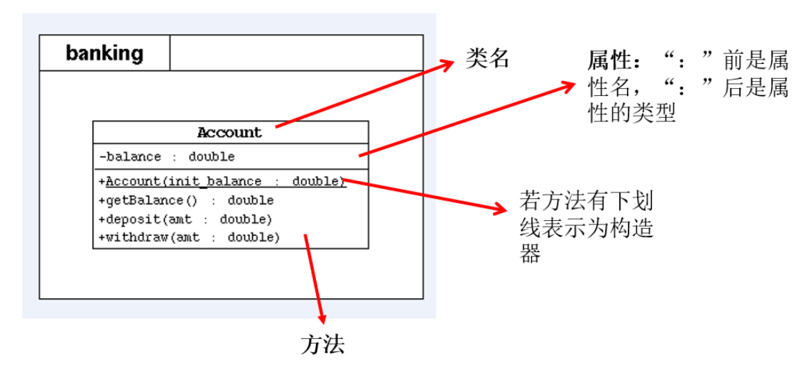
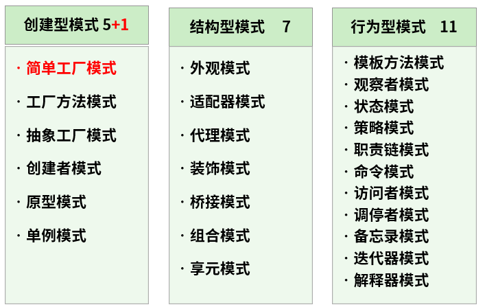
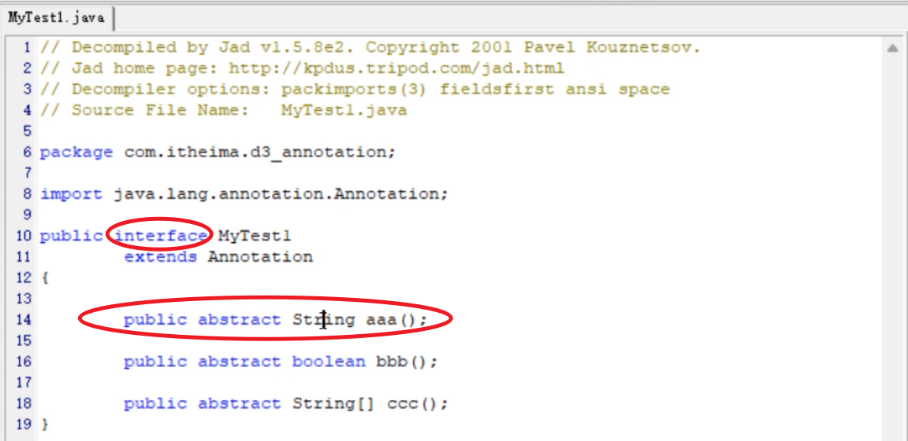

# 第01章_Java概述

## 1. Java概述

### 1.1 简介

Java是`SUN`(Stanford University Network，斯坦福大学网络公司)在1995年推出的一门高级编程语言。

`詹姆斯·高斯林(James Gosling)`先生以“Java 技术之父”而闻名于世。他是Java技术的创始人，他亲手设计了Java语言，并开发了Java编译器和Java虚拟机，使Java成为了世界上最流行的开发语言。

James Gosling于1984年加入Sun公司，并一直服务于Sun公司，直至2010年前后，Sun被Oracle并购而加入Oracle，担任客户端软件集团的首席技术官，2010年4月从Oracle离职。

### 1.2 Java技术体系平台

#### Java SE(Java Standard Edition)标准版

- 支持面向`桌面级应用`（如Windows下的应用程序）的Java平台，即定位个人计算机的应用开发。
- 包括用户界面接口AWT及Swing，网络功能与国际化、图像处理能力以及输入输出支持等
- 此版本以前称为J2SE

#### Java EE(Java Enterprise Edition)企业版

- 为开发企业环境下的应用程序提供的一套解决方案，即定位`在服务器端的Web应用开发`。
- JavaEE是JavaSE的扩展，增加了用于服务器开发的类库。如：Servlet能够延伸服务器的功能，通过请求-响应的模式来处理客户端的请求；JSP是一种可以将Java程序代码内嵌在网页内的技术。
- 版本以前称为J2EE

#### Java ME(Java Micro Edition)小型版

- 支持Java程序运行在`移动终端（手机、机顶盒）上的平台`，即定位在消费性电子产品的应用开发
- JavaME是JavaSE的内伸，精简了JavaSE的核心类库，同时也提供自己的扩展类。增加了适合微小装置的类库：`javax.microedition.io.*`等。
- 此版本以前称为J2ME

### 1.3 Java中的注释类型

#### 1、单行注释

```java
// 注释文字
```

#### 2、多行注释

```java
/*
注释文字
*/
```

#### 3、文档注释(Java特有)

```java
/**
 * ClassName: 
 * Package: 
 * Description:
 *
 * @Author 
 * @Create 
 * @Version
 */
```

文档注释内容可以被JDK提供的工具 javadoc 所解析，生成一套以网页文件形式体现的该程序的说明文档。操作方式如下：

```shell
javadoc -d mydoc -author -version HelloWorld.java
```

### 1.4 常用的DOS命令

DOS（Disk Operating System，磁盘操作系统）是Microsoft公司在Windows之前推出的一个操作系统，是单用户、单任务（即只能执行一个任务）的操作系统。现在被Windows系统取代。对于Java初学者，学习一些DOS命令，会非常有帮助。

> 按下Windows+R键盘，打开运行窗口，输入cmd回车，进入到DOS的操作窗口

**常用指令：**

- `E:`：切换到E盘
- `dir`：列出当前目录下的文件及文件夹
- `cd 目录`：进入指定目录
- `md 目录名`：创建指定目录
- `rd 目录名`：删除指定空目录
- `cls`：清屏
- `exit`：退出命令提示符窗口

## 2. Java开发环境搭建

### 2.1 JDK与JRE


- **JDK**(Java Development Kit)：是Java程序开发工具包，包含`JRE`和开发人员使用的工具。
- **JRE**(Java Runtime Environment)：是Java程序的运行时环境，包含`JVM`和运行时所需要的`核心类库`。

### 2.2 开发步骤

Java程序开发三步骤：**编写**、**编译**、**运行**。

1. 将 Java 代码**编写**到扩展名为`.java`的源文件中
2. 通过 javac.exe 命令对该 java 文件进行**编译**，生成一个或多个字节码文件。即，DOS命令行输入`javac Java源文件名.java`
3. 通过 java.exe 命令对生成的 class 文件进行**运行**。DOS命令行输入 `java 主类名`，从而运行 `主类名.class` 文件。注意主类是指包含main方法的类，main方法是Java程序的入口。

### 2.3 源文件名与类名

**问题1**：源文件名是否必须与类名一致？

答：如果这个类不是public，那么源文件名可以和类名不一致；如果这个类是public，那么要求源文件名必须与类名一致，否则编译报错。我们建议一个源文件只写一个类，便于维护。

**问题2**：一个源文件中是否可以有多个类？

答：一个源文件中可以有多个类，编译后会生成多个`.class`字节码文件，但是一个源文件只能有一个public的类。

## 3. Java核心机制：JVM

### 3.1 Java语言的优缺点

Java从C/C++语言继承了许多成份，甚至可以将Java看成是类C语言发展和衍生的产物。

#### 优点

- **跨平台性**：这是Java的核心优势，通过Java语言编写的应用程序在不同的系统平台上都可以运行，即`Write once, Run Anywhere`。正是由JVM实现了Java的跨平台性。
- **面向对象性**：面向对象编程支持封装、继承、多态等特性，让程序更好达到`高内聚低耦合`的标准。
- **健壮性**：吸收了C/C++语言的优点，但去掉了其影响程序健壮性的部分（如指针、内存的申请与释放等），提供了一个相对安全的内存管理和访问机制。

#### 缺点

- `语法过于复杂、严谨`
- 一般适用于大型网站开发，`整个架构会比较重`
- `并非适用于所有领域`。比如，Objective C、Swift在iOS设备上就有着无可取代的地位。浏览器中的处理几乎完全由JavaScript掌控。Windows程序通常都用C++或C#编写。Java在服务器端编程和跨平台客户端应用领域则很有优势。

### 3.2 JVM简介

**JVM**（Java Virtual Machine，Java虚拟机）：是一个虚拟的计算机，是Java程序的运行环境。JVM具有指令集并使用不同的存储区域，负责执行指令，管理数据、内存、寄存器。

#### 功能1：实现Java程序的跨平台性

#### 功能2：自动内存管理(内存分配、内存回收)

- Java程序在运行过程中，涉及到运算的`数据的分配`、`存储`等都由JVM来完成
- GC的自动回收，提高了内存空间的利用效率，也提高了编程人员的效率，很大程度上`减少了`因为没有释放空间而导致的`内存泄漏`。

# 第02章_Java基本语法

## 1. 变量

### 1.1 关键字（keyword）

关键字一共`50个`，其中`const`和`goto`是`保留字`(reserved word)。

注意：`true`，`false`，`null`不在其中，它们看起来像关键字，其实是字面量，表示特殊的布尔值和空值。

### 1.2 标识符(identifier)

Java中变量、方法、类等要素命名时使用的字符序列，称为标识符。

**标识符的命名规则**：

- 由26个英文字母大小写，`0-9`，`_`或`$`组成  
- 数字不可以开头
- 不可以使用关键字和保留字
- Java中严格区分大小写，长度无限制
- 标识符不能包含空格

**标识符的命名规范建议**:

- 包名：多单词组成时所有字母都小写，即`xxxyyyzzz`，例如`java.lang`、`com.thuwsy.controller`
- 类名、接口名：多单词组成时，所有单词的首字母大写，即`XxxYyyZzz`，例如`PaymentController`
- 变量名、方法名：多单词组成时，第一个单词首字母小写，第二个单词开始每个单词首字母大写，即`xxxYyyZzz`，例如`bookName`、`binarySearch`
- 常量名：所有字母都大写，多单词时每个单词用下划线连接，即`XXX_YYY_ZZZ`，例如`MAX_VALUE`

## 2. 基本数据类型介绍

Java中变量的数据类型分为两大类：

- **基本数据类型**：包括 `整数类型`、`浮点数类型`、`字符类型`、`布尔类型`。 
- **引用数据类型**：包括`数组`、`类`、`接口`、`枚举`、`注解`等。 



### 2.1 整数类型：byte、short、int、long

注1：随便写一个整数或者小数的字面量，它是有默认数据类型的(**整数默认int，小数默认double**)

- 比如23，它默认就为int类型；如果加上后缀L，则为long类型；
- 比如23.8，它默认为double类型；如果加上后缀F，则为float类型;

注2：变量是什么类型，就应该用来装什么类型的数据，否则报错。例如对于`int age = 0;`则赋值语句`age = 9.5`会报错。

**不同进制在Java程序中的书写格式**：

```java
System.out.pirntln('a' + 1); //98
System.out.pirntln(0b01100001); //97，二进制
System.out.pirntln(0141); //97，八进制
System.out.pirntln(0x61); //97，十六进制
```

### 2.2 浮点类型：float、double

浮点型常量有两种表示形式：

- 十进制数形式，如：`5.12`，`512.0f`，`.512` (必须有小数点)
- 科学计数法形式，如：`5.12e2`，`512E2`，`100E-2`
 
**关于浮点型精度的说明**：

- 并不是所有的小数都可以精确地用二进制浮点数表示。例如，二进制浮点数就不能精确地表示0.1、0.01、0.001这样10的负次幂。
- 浮点类型float、double的数据不适合在`不容许舍入误差`的金融计算领域。如果需要`精确`数字计算或保留指定位数的精度，需要使用`BigDecimal类`。

### 2.3 字符类型：char

char型数据用来表示通常意义上的`字符`，它占2个字节。

Java中的所有字符都使用Unicode编码，故一个字符可以存储一个字母，一个汉字，或其他书面语的一个字符。所以char类型是可以进行运算的，因为它都对应有Unicode码，可以看做是一个数值。

### 2.4 布尔类型：boolean

boolean类型数据只有两个值：true、false

注1：不可以使用0或非0的整数替代false和true，这点和C语言不同。

注2：Java虚拟机中没有任何供boolean值专用的字节码指令，Java语言表达所操作的boolean值，在编译之后都使用java虚拟机中的int数据类型来代替：true用1表示，false用0表示。

## 3. 基本数据类型的运算规则

在Java程序中，不同的基本数据类型（只有7种，不包含boolean类型）变量的值经常需要进行相互转换。转换的方式有两种：`自动类型提升`和`强制类型转换`。

### 3.1 自动类型提升

**规则：将取值范围小的类型自动提升为取值范围大的类型**。如图所示：



（1）当把存储范围小的值（常量值、变量的值、表达式计算的结果值）赋值给了存储范围大的变量时，就会进行自动类型提升。

```java
int i = 'A'; // char自动升级为int，其实就是把字符的编码值赋值给i变量了
double d = 10; // int自动升级为double
long num = 1234567; // 右边的整数常量值如果在int范围呢，编译和运行都可以通过，这里涉及到数据类型转换
//byte bigB = 130; // 错误，右边的整数常量值超过byte范围
long bigNum = 12345678912L; // 右边的整数常量值如果超过int范围，必须加L，显式表示long类型，否则编译不通过
```

（2）当存储范围小的数据类型与存储范围大的数据类型变量一起混合运算时，会按照其中最大的类型运算。

```java
int i = 1;
byte b = 1;
double d = 1.0;
double sum = i + b + d; // 混合运算，升级为double
```

（3）当byte,short,char数据类型的变量**进行算术运算**时，**自动升级为int类型处理**。

```java
byte b1 = 1;
byte b2 = 2;
byte b3 = b1 + b2; // 编译报错，b1 + b2自动升级为int

char c1 = '0';
char c2 = 'A';
int i = c1 + c2; // 至少需要使用int类型来接收
System.out.println(c1 + c2); // 113 
```

### 3.2 强制类型转换

**规则：将取值范围大的类型强制转换成取值范围小的类型。**

**转换格式：**

```java
数据类型1 变量名 = (数据类型1) 被强转数据值;
```

注意：当把存储范围大的值强制转换为存储范围小的变量时，可能会`损失精度`或`溢出`。

```java
int i = (int) 3.14; // 损失精度

int i = 200;
byte b = (byte) i; // 溢出
```

### 3.3 基本数据类型与String的运算

（1）任意八种基本数据类型与String类型只能进行连接`+`运算，即进行字符串拼接，且结果一定也是String类型

```java
System.out.println("" + 1 + 2); // 12

int num = 10;
boolean b1 = true;
String s1 = "abc";

String s2 = s1 + num + b1;
System.out.println(s2); // abc10true

//String s3 = num + b1 + s1; // 编译不通过，因为int类型不能与boolean运算
String s4 = num + (b1 + s1); // 编译通过

System.out.println('a'+ 1 + "Hello!"); // 98Hello!
```

（2）String类型不能通过强制类型转换转为其他的类型

```java
String str = "123";
int num = (int) str; // 报错

int num = Integer.parseInt(str); // 正确
```

## 4. 运算符（Operator）

- 算术运算符：`+ - * / % ++ --`
- 赋值运算符：`= += -= *= /= %= >>= <<= >>>= &= |= ^=`
- 比较运算符：`> >= < <= == !=`
- 逻辑运算符：`& | ^ ! && ||`
- 位运算符：`& | ^ ~ << >> >>>`
- 条件运算符：`(条件表达式) ? 结果1 : 结果2`
- Lambda运算符：`->`

### 4.1 算术运算符

- `/`：两个整数相除，结果也是一个整数
- `%`：`a % b`结果的符号与`a`的符号相同
- `++`运算符举例：

```java
int m = 2;
m = m++;
/**
 * 1. 先取m的值“2”放操作数栈
 * 2. m再自增, m=3
 * 3. 再把操作数栈中的"2"赋值给m, m=2
 */
System.out.println(m); // 2
```

### 4.2 赋值运算符

- 赋值运算符`=`支持连续赋值
- 扩展的赋值运算符**隐含了强制类型转换**。例如`a += b;`，底层代码形式为`a = (a的类型) (a + b);`

```java
问题1：下面的代码否有问题？
    byte x = 10;
    byte y = 30;
	x = x + y;  // 这句代码有问题，因为两个byte类型数据相加，会提升为int类型;
	
问题2：下面的代码是否有问题？
	byte x = 10;
	byte y = 30;
	x += y; // 这句代码没有问题，因为这里隐含了强制类型转换
	//x += y; 等价于 x = (byte) (x + y);
```

### 4.3 比较运算符

比较运算符也称为关系运算符，其结果都是boolean型。

- `> < >= <=`：只适用于基本数据类型（除boolean类型）
- `== !=`：适用于基本数据类型和引用数据类型
- 还有一个特殊的比较运算符`instanceof`，可以检查是否是类的对象。例如`"Hello" instanceof String`的结果是`true`

### 4.4 逻辑运算符

逻辑运算符，操作的**都是boolean类型**的变量或常量，而且运算得结果也是boolean类型的值。


### 4.5 位运算符

位运算符的运算过程都是基于二进制的**补码**运算


### 4.6 条件运算符

```java
(条件表达式) ? 结果1 : 结果2
```

### 4.7 运算符优先级

> 注意：上一行中的运算符总是优先于下一行的

1. 括号：`() [] {}`
2. 正负号：`+ -`
3. 单目运算符：`++ -- ~ !`
4. 乘法、除法、求余：`* / %`
5. 加法、减法：`+ -`
6. 移位运算符：`>> << >>>`
7. 比较运算符：`< <= >= > instanceof`
8. 比较运算符：`== !=`
9. 按位与：`&`
10. 按位异或：`^`
11. 按位或：`|`
12. 条件与：`&&`
13. 条件或：`||`
14. 三元运算符：`(条件表达式) ? 结果1 : 结果2`
15. 赋值运算符：`= += -= *= /= %=`
16. 位赋值运算符：`&= |= <<= >>= >>>=`

## 5. 流程控制语句

### 5.1 分支语句

#### if

#### switch

- switch(表达式)中表达式的值必须是下述几种类型之一：`byte`，`short`，`char`，`int`，`枚举`，`String`；
- case子句中的值必须是**常量**，不能是变量名或不确定的表达式值或范围；
- 同一个switch语句，所有case子句中的**常量值互不相同**；
- 正常使用switch的时候，不要忘记写break，否则会出现**穿透现象**。
- default子句是可选的。同时，位置也是灵活的。**当没有匹配的case时，执行default语句**。

### 5.2 循环语句

#### for

#### while

#### do-while

### 5.3 break和continue

**带标签的使用方法**：break或continue语句出现在多层嵌套的循环语句块中时，可以通过标签指明要终止/跳过的是哪一层语句块。注意，标号语句必须紧接在循环的头部，且标号语句不能用在非循环语句的前面。

```java
label1: {   ……        
label2:	     {   ……
label3:			 {   ……
                        break label2;
                        ……
                    }
                }
        } 
```

举例：

```java
class BreakContinueTest2 {
	public static void main(String[] args) {
		l:for(int i = 1;i <= 4;i++){
		
			for(int j = 1;j <= 10;j++){
				if(j % 4 == 0){
					//break l;
					continue l;
				}
				System.out.print(j);
			}
			System.out.println();
		}
	}
}
```

## 6. Scanner类

### 6.1 Scanner简介

使用Scanner类可以从键盘获取不同类型（基本数据类型、String类型）的变量。使用步骤如下：

1. 导包：`import java.util.Scanner;`
2. 创建Scanner类型的对象：`Scanner scan = new Scanner(System.in);`
3. 调用Scanner类的相关方法来获取指定类型的变量，如`next()`、`nextXxx()`
4. 释放资源：`scan.close();`

> 注1：需要根据相应的方法，来输入指定类型的值。如果输入的数据类型与要求的类型不匹配时，会报异常导致程序终止。
>
> 注2：System、String在JDK中的Java.lang包下，lang包不需要我们导包，是默认的包。

### 6.2 Scanner的使用案例

```java
// 1. 导包
import java.util.Scanner;

public class ScannerTest1 {
    public static void main(String[] args) {
        // 2. 创建Scanner的对象，System.in默认代表键盘输入
        Scanner scanner = new Scanner(System.in);
        
        // 3. 根据提示，调用Scanner的方法，获取不同类型的变量
        System.out.print("请输入你的网名：");
        String name = scanner.next();

        System.out.print("请输入你的年龄：");
        int age = scanner.nextInt();

        System.out.print("请输入你的体重：");
        double weight = scanner.nextDouble();

        System.out.print("你是否单身（true/false)：");
        boolean isSingle = scanner.nextBoolean();

        System.out.print("请输入你的性别：");
        char gender = scanner.next().charAt(0);
        
        // 4. 关闭资源
        scanner.close();
    }
}
```

## 7. 随机数

### 7.1 Math类生成随机数

调用`Math.random()`会返回一个`[0,1)`范围内的double型随机值。所以如果想生成`[a,b]`范围内的随机整数，可以使用：

```java
(int)(Math.random() * (b - a + 1)) + a
```

### 7.2 Random类生成随机数

Random类下的`nextInt(n)`方法能生成`0`至`n-1`之间的随机数，不包含`n`。使用方式如下：

```java
public class RandomDemo1 {
    public static void main(String[] args) {
        // 创建一个Random对象，用于生成随机数。
        Random r = new Random();
        // 调用Random提供的功能：nextInt得到随机数。
        for (int i = 1; i <= 20; i++) {
            int data = r.nextInt(10); // 0 - 9
            System.out.println(data);
        }
    }
}
```

如果想生成`[M, N]`之间的随机整数，有两种方案：

```java
// 方案一：
Random r = new Random();
int ans = r.nextInt(N - M + 1) + M;

// 方案二：直接调用r.nextInt(a, b)来生成[a, b)之间的随机整数
ans = r.nextInt(M, N + 1);
```

## 8. 数组

### 8.1 数组简介

数组(Array)，是多个相同类型数据按顺序排列的集合。数组的特点如下：

- 数组本身是`引用数据类型`，而数组中的元素可以是`任何数据类型`，包括基本数据类型和引用数据类型。
- 创建数组对象会在内存中开辟一整块`连续的空间`。占据的空间的大小，取决于数组的长度和数组中元素的类型。
- 数组一旦初始化完成，其长度就是确定的，`无法修改`。
- 可以直接通过下标(索引)的方式访问数组中指定位置的元素，速度很快。
- 数组名中引用的是这块连续空间的首地址。

### 8.2 一维数组

#### 1、声明

```java
int[] arr1; // 推荐
int arr2[]; // 不推荐
```

> 数组的声明需要明确：数组的维度(一个`[]`表示一维)、元素的类型、数组名。
>
> 注意：Java语言中声明数组时不能指定其长度，例如`int a[5];`是非法的

#### 2、静态初始化

如果数组变量的初始化和数组元素的赋值操作同时进行，那就称为静态初始化。静态初始化，本质是**用静态数据（编译时已知）为数组初始化**，此时数组的长度由静态数据的个数决定。

```java
// 方式1
int[] arr1 = new int[]{1, 2, 3};
// 方式2
int[] arr2;
arr2 = new int[]{1, 2, 3};
// 方式3
int[] arr3 = {1, 2, 3}; // 必须在一个语句中完成，不能分成两个语句写
```

#### 3、动态初始化

数组变量的初始化和数组元素的赋值操作分开进行，即为动态初始化。动态初始化中，**只确定了元素的个数**（即数组的长度），而**元素值此时只是默认值**，还并未真正赋自己期望的值。真正期望的数据需要后续单独一个一个赋值。

```java
// 方式1
int[] arr1 = new int[3];
// 方式2
int[] arr2;
arr2 = new int[3];
```

使用动态初始化定义数组时，根据元素类型不同，默认值也有所不同：

- byte、short、char、int、long的默认值是0
- float、double的默认是值0.0
- boolean的默认是是false
- 引用数据类型的默认值是null

#### 4、其他性质

（1）直接打印数组名，并不会打印数组的真实内容

```java
System.out.println(arr2); // [I@4eec7777
```

（2）静态初始化和动态初始化数组的写法是独立的，不可以混用。如下写法是错误的：

```java
int[] arr = new int[3]{30，40, 50};
```

（3）数组的长度可以用 `arr.length` 获取

（4）数组的元素也可以是引用数据类型，此时称为**对象数组**。注意创建对象数组，首先要创建数组对象本身，即确定数组的长度，然后再创建每一个元素对象，如果不创建，数组的元素的默认值就是null。

### 8.3 一维数组内存分析



**举例(多个变量指向同一数组)**：

```java
public static void main(String[] args) {
    int[] arr1 = {11, 22, 33};
    // 把int类型的数组变量arr1赋值给int类型的数组变量arr2
    int[] arr2 = arr1;

    System.out.println(arr1); // [I@4eec7777
    System.out.println(arr2); // [I@4eec7777

    arr2[1] = 99;
    System.out.println(arr1[1]); // 99

    arr2 = null; // 拿到的数组变量中存储的值是null
    System.out.println(arr2); // null
    System.out.println(arr1); // [I@4eec7777
}
```

**总结：**

- 两个变量指向同一个数组时，两个变量记录的是同一个地址值。
- 当一个变量修改数组中的元素时，另一个变量去访问数组中的元素，元素已经被修改过了。
- 如果某个数组变量存储的地址是null，那么该变量将不再指向任何数组对象，此时只能打印出`null`，但无法获得`length`等属性

### 8.4 多维数组

#### 1、声明

Java语言里提供了支持多维数组的语法。二维数组，可以认为其每个元素都是个一维数组。其实，从数组底层的运行机制来看并没有多维数组。

```java
int[][] arr1; // 推荐
int arr2[][]; // 不推荐
int[] arr3[]; // 不推荐
```

面试题：

```java
// 以下x是一维数组，y是二维数组
int[] x, y[];
```

#### 2、静态初始化

```java
// 方式1
int[][] arr = new int[][]{{3,8,2},{2,7},{9,0,1,6}};
```

以上定义了一个名称为arr的二维数组，二维数组中有三个一维数组，其中每一个一维数组中具体元素也都已初始化：

- 第一个一维数组 `arr[0] = {3,8,2};`
- 第二个一维数组 `arr[1] = {2,7};`
- 第三个一维数组 `arr[2] = {9,0,1,6};`

> 获取第三个一维数组的长度：`arr[2].length;`

其他类似方式：

```java
// 方式2
int[][] arr2;
arr = new int[][]{{1,2,3},{4,5,6},{7,8,9,10}};
// 方式3
int[][] arr3 = {{1,2,3},{4,5,6},{7,8,9,10}}; // 必须一句完成
```

#### 3、动态初始化

动态初始化方式分为两种格式：

**格式1：规则二维数组，即每一行的列数是相同的**

```java
// 1. 确定行数和列数
int[][] arr = new int[m][n];
	// m表示这个二维数组有多少个一维数组
	// n表示每一个一维数组的元素有多少个
    // 此时数组的行数和列数已经确定，且元素也都有默认值
// 2. 然后再为元素赋值
```

**格式2：不规则二维数组，即每一行的列数不一样**

```java
// 1. 先确定总行数m
int[][] arr = new int[m][];
    // 此时只是确定了总行数，每一行里面现在是null

// 2. 再确定每一行的列数，每一行都创建一维数组
arr[0] = new int[n1];
arr[1] = new int[n2];
...
    // 此时已经new完的行的元素就有默认值了，没有new的行还是null

// 3. 最后再为元素赋值
```

注意：`int[][] arr = new int[][3];`是非法的。

## 9. Arrays工具类

java.util.Arrays类即为操作数组的工具类，包含了用来操作数组的各种**静态方法**。 

### 9.1 数组转字符串

- `String toString(T[] a)`：将数组a转换为字符串的形式，字符串内容为`[元素1, 元素2, ...]`，其中T可以是基本数据类型或者Object

### 9.2 数组排序

- `void sort(T[] a)`：将a数组按照升序排序(快速排序)
- `void sort(T[] a, int beg, int end)`：将a数组的`[beg, end)`部分升序排序(快速排序)
- `void sort(T[] a, Comparator c)`：将a数组按照比较器指定的顺序进行排序(快速排序)
- `void sort(T[] a, int beg, int end, Comparator c)`：将a数组的`[beg, end)`部分按照比较器指定的顺序进行排序(快速排序)

### 9.3 数组二分查找

- `int binarySearch(T[] a, T key)`：要求数组有序，在数组中查找key是否存在，如果存在则返回其下标，如果不存在则返回负数。注意，如果数组中存在多个相同的key，则返回的下标是未知的。

### 9.4 数组的复制

- `T[] copyOf(T[] original, int newLength)`：根据original原数组复制得到一个长度为newLength的新数组，并返回这个新数组的引用。注意，如果newLength与原数组的长度不同，则会直接截断或者填上默认值。
- `T[] copyOfRange(T[] original, int from, int to)`：复制原数组的`[from,to)`得到一个新数组并返回

### 9.5 比较数组内容是否相同

- `boolean equals(T[] a, T[] a2)`：比较两个数组的长度、元素是否完全相同

### 9.6 填充数组

- `void fill(T[] a, T val)`：将数组a的每个元素赋值为val
- `void fill(T[] a, int beg, int end, T val)`：将数组a的`[beg, end)`中的每个元素赋值为val

### 9.7 批量修改数组内容

- `void setAll(T[] a, IntFunction generator)`：对数组a中的每个元素进行`array[i] = generator.apply(i);`的赋值操作，其中i是索引。

举例：

```java
double[] prices = {99.8, 128, 100};
Arrays.setAll(prices, i -> prices[i] * 10.0);
System.out.println(Arrays.toString(prices)); // [998.0, 1280.0, 1000.0]
```

# 第03章_面向对象编程(基础)

## 1. 面向对象编程概述

### 1.1 简介

类(Class)和对象(Object)是面向对象的核心概念：

- **类**：具有相同特征的事物的抽象描述，是**抽象的**、概念上的定义。
- **对象**：实际存在的该类事物的每个个体，是**具体的**，因而也称为**实例**(instance) 。

类，是一组相关属性和行为的集合，这也是类最基本的两
个成员。成员变量(属性，field)，成员方法(方法，method)。

**补充(匿名对象)**：我们也可以不定义对象的句柄，而直接调用这个对象的方法，这样的对象叫做匿名对象，如`new Person().shout();`我们经常将匿名对象作为实参传递给一个方法调用。

### 1.2 Java面向对象的核心知识

**面向对象的特征：封装、继承、多态、（抽象）**

**Java类的成员：属性、方法、构造器、代码块、内部类**

### 1.3 对象的内存解析

`Student s1 = new Student();`这句代码的底层原理如下：

- `Student s1`表示的是在栈内存中，创建了一个Student类型引用的变量，变量名为s1
- 而`new Student()`会在堆内存中创建一个对象，对象中包含学生的属性名和属性值，同时系统会为这个Student对象分配一个地址值`0x4f3f5b24`
- 接着把对象的地址赋值给栈内存中的变量s1，通过s1记录的地址就可以找到这个对象
- 当执行`s1.name="播妞"`时，其实就是通过s1找到对象的地址，再通过对象找到对象的name属性，再给对象的name属性赋值为`播妞`

直接打印对象名和数组名都会显示`类型@对象的hashCode值`，所以说类、数组都是引用数据类型，引用数据类型的变量中存储的是对象的地址，或者说指向堆中对象的首地址。

> 注：当堆内存中的对象，没有被任何变量引用时，就会被判定为内存中的垃圾。Java存在自动垃圾回收机制，会自动清除掉垃圾对象，程序员不用操心，注意只有在堆内存和方法区中有GC。

## 2. 类的成员之一：成员变量(field)

**成员变量和局部变量的区别**：

- 类中位置不同：成员变量在类中，方法外；而局部变量在方法内。
- 初始化值不同：实例变量有默认值；而局部变量没有默认值，使用之前必须显式赋值。
- 内存位置不同：实例变量在堆内存中；局部变量在栈内存中。
- 作用域不同：实例变量作用域是整个对象；而局部变量作用域是在所归属的大括号中。
- 生命周期不同：实例变量与对象共存亡；而局部变量随着方法的调用而生，随着方法的运行结束而亡。

## 3. 类的成员之二：成员方法(method)

### 3.1 方法声明和调用

```java
[修饰符] 返回值类型 方法名(形参列表) [throws 异常列表] {
    方法体
}
```

Java里的方法不能独立存在，所有的方法必须定义在类里。一个完整的方法包含方法签名和方法体。方法的修饰符有很多，如public、protected、private、static、abstract、native、final、synchronized等。

**注意事项**：

1. 形参不能给初始化值。
2. 如果返回值类型不是void，方法体中必须保证一定有 `return 返回值;` 语句，并且要求该返回值结果的类型与声明的返回值类型一致或兼容。
3. 如果返回值类型为void，方法体中可以没有return语句，如果要用return语句提前结束方法的执行，那么return后面不能跟返回值，直接写`return ;`即可。
4. 如果一个return语句之后的区域必然不可达，那么就不能在该return语句之后写代码，否则会报错：Unreachable code
5. 方法在类中没有先后顺序。
6. 方法不调用就不会执行，调用方法时，传给方法的数据，必须严格匹配方法的参数情况。

### 3.2 方法调用内存分析

- 方法**没有被调用**的时候，都在**方法区**中存储。
- 方法**被调用**的时候，需要进入到**栈内存**中运行。方法每调用一次就会在栈中有一个**入栈**动作，即给当前方法开辟一块独立的栈帧。
- 当方法执行结束后，会释放该栈帧，称为**出栈**，如果方法有返回值，就会把结果返回调用处，如果没有返回值，就直接结束，回到调用处继续执行下一条指令。

### 3.3 方法重载（overload）

方法重载：在同一个类中，允许存在一个以上的同名方法，只要它们的参数列表不同即可(参数列表不同，意味着**参数个数或参数类型不同**)

JVM调用重载方法的规则：

- 先找个数、类型最匹配的
- 再找个数和类型可以兼容的，如果同时多个方法可以兼容将会报错

下面案例中有多个test方法，但是参数列表都不一样，它们都是重载的方法，调用时只需要通过参数来区分即可。

```java
public class MethodOverLoadDemo1 {
    public static void main(String[] args) {
        test();
        test(100);
    }

    public static void test(){
        System.out.println("===test1===");
    }

    public static void test(int a){
        System.out.println("===test2===" + a);
    }

    void test(double a){
    }

    void test(double a, int b){
    }

    void test(int b, double a){
    }

    int test(int a, int b){
        return a + b;
    }
}
```

**面试题**：`println`有一个特殊的重载，参数为`char[]`，从而使得打印`char[]`数组时能够打印其具体内容，如下所示：

```java
int[] arr1 = {1, 2, 3};
System.out.println(arr1); // [I@4eec7777
char[] arr2 = {'a', 'b', 'c', 'd'};
System.out.println(arr2); // abcd
```

### 3.4 可变个数的参数

当定义一个方法时，如果形参的类型可以确定，但是形参的个数不确定，那么可以考虑使用可变个数的形参。格式：`方法名(参数类型 ... 参数名)`

**注意**：

- 可变参数部分指定类型的参数个数是可变多个：0个，1个或多个，也可以传一个数组给它
- 可变个数形参的方法与同名的方法之间，可以彼此构成重载
- 可变参数方法的使用与方法参数部分使用数组是一致的，二者不能同时声明，否则报错。因为**可变参数在方法内部，本质上就是一个数组**。
- 方法的参数部分有可变形参，需要放在形参声明的最后。
- 在一个方法的形参中，最多只能声明一个可变个数的形参。

```java
public class ParamTest{
    public static void main(String[] args) {
        test(); // 0 []
        test(10, 20, 30); // 3 [10, 20, 30]
        int[] arr = new int[]{10, 20, 30, 40};
        test(arr); // 4 [10, 20, 30, 40]
    }

    // 以下方法本质上就是 test(int[] nums)
    public static void test(int ... nums){
        // 可变参数在方法内部，本质上是一个数组
        System.out.println(nums.length);
        System.out.println(Arrays.toString(nums));
    }
}
```

### 3.5 Java中方法的参数传递机制：值传递

Java里方法的参数传递方式只有一种：**值传递**。即将**实际参数值**的副本传入方法内，而参数本身不受影响。

- 形参是基本数据类型：将实参基本数据类型变量中存储的**数据值**复制传递给形参
- 形参是引用数据类型：将实参引用数据类型变量中存储的**地址值**复制传递给形参

举例：数组拷贝

```java
// 注意：int[] arr2 = arr; 这个不是拷贝数组，而是把数组变量赋值给另一个数组变量。
public static int[] copy(int[] arr){
    // 1、创建一个长度一样的整型数组出来。
    int[] arr2 = new int[arr.length];
    // 2、把原数组的元素值对应位置赋值给新数组。
    for (int i = 0; i < arr.length; i++) {
        arr2[i] = arr[i];
    }
    return arr2;
}
```

## 4. 关键字：package、import

### 4.1 package

package，称为包，用于指明该文件中定义的类、接口等结构所在的包。语法格式如下：

```java
package 顶层包名.子包名;
```

- 一个源文件只能有一个声明包的package语句
- package语句作为Java源文件的第一条语句出现。若缺省该语句，则指定为无名包。
- 包名，属于标识符，满足标识符命名的规则和规范（全部小写）
  - 包通常使用所在公司域名的倒置：`com.atguigu.xxx`
  - 取包名时不要使用`java.xxx` 
- 包对应于文件系统的目录，package语句中用`.`来指明包(目录)的层次，每`.`一次就表示一层文件目录
- 同一个包下可以声明多个结构（类、接口），但是不能定义同名的结构（类、接口）；不同的包下可以定义同名的结构（类、接口）。

**JDK中主要的包有**：

- `java.lang`：包含一些Java语言的核心类，如String、Math、Integer、System、Thread
- `java.net`：包含执行与网络相关的操作的类和接口
- `java.io`：包含能提供多种输入/输出功能的类
- `java.util`：包含一些实用工具类，如定义系统特性、接口的集合框架类、使用与日期日历相关的函数
- `java.text`：包含了一些java格式化相关的类
- `java.sql`：包含了java进行JDBC数据库编程的相关类/接口
- `java.awt`：包含了构成抽象窗口工具集的多个类，这些类被用来构建和管理应用程序的图形用户界面(GUI)

### 4.2 import

为了使用定义在其它包中的Java类，需用import语句来显式引入指定包下所需要的类，相当于import语句告诉编译器到哪里去寻找这个类。语法格式如下：

```java
import 包名.类名;
```

**注意事项**：

- import语句，声明在包的声明和类的声明之间。
- 如果需要导入多个类或接口，那么就并列显式多个import语句即可
- 如果使用`a.*`导入结构，表示可以导入a包下的所有的结构。
- 如果导入的类或接口是`java.lang`包下的，或者是当前包下的，则可以省略此import语句。
- 如果已经导入`java.a`包下的类，那么如果需要使用a包的子包下的类的话，仍然需要导入。
- 如果在代码中使用不同包下的同名的类，那么就需要使用类的全类名的方式指明调用的是哪个类。例如 
    ```java
    java.util.Date date1 = null;
    java.sql.Date date2 = new java.sql.Date(666);
    ```
- import static组合使用，可以调用指定类或接口下的静态的属性或方法

## 5. 面向对象特征一：封装(encapsulation)

### 5.1 封装性简介

面向对象的开发原则要遵循**高内聚、低耦合**。高内聚、低耦合是软件工程中的概念，也是UNIX操作系统设计的经典原则。内聚，指一个模块内各个元素彼此结合的紧密程度；耦合指一个软件结构内不同模块之间互连程度的度量。内聚意味着重用和独立，耦合意味着多米诺效应牵一发动全身。

- 高内聚：类的内部数据操作细节自己完成，不允许外部干涉
- 低耦合：仅暴露少量的方法给外部使用，尽量方便外部调用

**封装**：就是把客观事物封装成抽象概念的类，并且类可以把自己的数据和方法只向可信的类或者对象开放，向没必要开放的类或者对象隐藏信息。封装性的设计思想通俗来讲，就是**合理隐藏、合理暴露**。

### 5.2 权限修饰符

实现封装就是控制类或成员的可见性范围，这就需要依赖访问控制修饰符，也称为权限修饰符。每一种权限修饰符能够被访问的范围如下：

|修饰符   |本类内部|本包内|其他包的子类|其他包非子类|
|---------|-------|-----|-----------|-----------|
|private  |√      |×    |×          |×          |
|缺省     |√      |√    |×          |×          |
|protected|√      |√    |√          |×          |
|public   |√      |√    |√          |√          |

**可以修饰的结构**：

- 外部类：只能使用`public`、`缺省`修饰。**因此外部类要跨包使用必须是public**，否则仅限于本包使用。
- 成员变量、成员方法、构造器、成员内部类：`public`、`protected`、`缺省`、`private`

### 5.3 封装性的体现

**（1）成员变量私有化**：我们一般私有化类的成员变量，提供公共的get和set方法来对外暴露获取和修改属性的功能。这样做的好处是：

- 让使用者只能通过事先预定的方法来访问数据，从而可以在该方法里面加入控制逻辑，限制对成员变量的不合理访问。
- 便于内部进行修改，如果其对外可以的访问方式不变的话，外部根本感觉不到它的修改。

**（2）成员方法私有化**：类中不需要对外暴露的方法，也可以进行私有化。

**（3）构造器私有化**：单例模式中将构造器设置为private，从而避免在类的外部创建实例。

**注意**：

- 开发中，一般成员实例变量都习惯使用private修饰，再提供相应的public权限的get/set方法访问。
- 对于final的实例变量，不提供set()方法。
- 对于static final的成员变量，习惯上使用public修饰。

## 6. 类的成员之三：构造器(constructor)

**通过new关键字创建对象**的时候就会执行构造器。构造器的语法如下：

```java
[修饰符] class 类名 {
    [修饰符] 构造器名() {
        // 实例初始化代码
    }
    [修饰符] 构造器名(参数列表) {
        // 实例初始化代码
    }
}
```

**特点**：

- **构造器名必须与它所在的类名必须相同**，它没有返回值，也不能写void，且不能有return语句。
- 构造器的修饰符只能是**权限修饰符**，不能被其他任何修饰。比如，不能被static、final等修饰。
- 构造器是可以重载的。

**注意**：

- 当我们没有显式地声明类中的构造器时，系统会**默认提供一个无参的构造器**，并且该构造器的修饰符默认与类的修饰符相同。
- 当我们显式地定义类的构造器以后，系统就不再提供默认的无参的构造器了。此时如果没有定义无参构造器，建议自己加一个无参构造器。

## 7. 补充

### 7.1 实体类

**实体类仅仅只是用来封装数据用的**，它符合如下标准：

- 类是公共的
- 有一个无参的公共的构造器
- 属性(权限private)有对应的get、set方法

### 7.2 UML类图

UML（Unified Modeling Language，统一建模语言），是用来描述软件模型和架构的图形化语言。在软件开发中，使用UML类图可以更加直观地描述类内部结构以及类之间的关系。

- `+`表示public类型，`-`表示 private 类型，`#`表示protected类型
- 方法的格式: 
    ```java
    权限(+、-)方法名(参数名 : 参数类型) : 返回值类型
    ```
- 斜体表示抽象方法或类




# 第04章_面向对象编程(进阶)

## 1. 关键字：this

### 1.1 this是什么

this在**非static的方法**内部使用，表示调用该方法的对象。this在构造器内部使用，表示该构造器正在初始化的对象。

在底层，哪一个对象调用方法，该方法栈帧中的局部变量表会默认地添加一个this参数，然后**把该对象的地址值传入this**。

this可以调用的结构有：**成员变量、成员方法和构造器**

### 1.2 this调用成员变量/方法

在**实例方法或构造器**中，使用当前类的成员变量或成员方法可以在其前面添加this，只不过我们通常都习惯省略this。

但是，当形参与成员变量同名时，如果需要使用成员变量，必须添加this来表明该变量是类的成员变量。即，我们可以用this来区分`成员变量`和`局部变量`。

> 注意：使用this访问属性和方法时，如果在本类中未找到，**会继续从父类中查找**。

### 1.3 this调用构造器

this可以作为一个类中构造器相互调用的特殊格式：

- `this()`：调用本类的无参构造器
- `this(实参列表)`：调用本类的有参构造器

**注意**：

- 不能出现递归调用。比如，调用自身构造器。
- `this()`和`this(实参列表)`只能**声明在构造器首行**。

```java
public class Student {
    private String name;
    private int age;

    public Student() {

    }
    public Student(String name) {
        this(); // 调用本类无参构造器
        this.name = name;
    }
    public Student(String name,int age){
        this(name); // 调用本类中有一个String参数的构造器
        this.age = age;
    }
}
```

## 2. 面向对象特征二：继承(Inheritance)

### 2.1 继承的语法

通过`extends`关键字，可以声明一个类B继承另外一个类A，定义格式如下：

```java
[修饰符] class 类B extends 类A {
	...
}
```

- 类B，称为子类、派生类(derived class)、SubClass
- 类A，称为父类、超类、基类(base class)、SuperClass

**继承的优点**：

- 减少了代码冗余，提高了代码的复用性。
- 有利于功能的扩展。
- 为多态的使用提供了前提。

### 2.2 继承的特点

**1、子类会继承父类所有的实例变量和实例方法**

- 当子类对象被创建，在堆中给对象申请内存时，子类和父类的实例变量都要分配内存。
- 当子类对象调用方法时，编译器会先在子类模板中看该类是否有这个方法，如果没找到，会继续看它的父类是否声明了这个方法，遵循`从下往上`找的顺序，找到了就停止，一直到根父类都没有找到，就会报编译错误。

**2、子类不能访问父类中私有的成员变量和方法**

子类虽然会继承父类私有(private)的成员变量，但子类不能对继承的私有成员变量进行访问，可以通过继承的get/set方法进行访问。

**3、Java支持多层继承**

```java
class A{}
class B extends A{}
class C extends B{}
```

> 说明：顶层父类是Object类。如果某个类没有extends别的类，则默认继承Object类。

**4、Java类只支持单继承(Java类只能继承一个类)，即不能有多个直接父类**

### 2.3 方法重写(override)

子类可以对从父类中继承来的方法进行改造，我们称为方法的`重写(override、overwrite)`，也称为方法的`覆盖`。

> @Override注解：标注在方法上面，让编译器检测是不是满足重写方法的要求。这个注解就算不写，只要满足要求，也是正确的方法重写。但我们建议保留，这样编译器可以帮助我们检查格式，另外也可以让阅读源代码的程序员清晰的知道这是一个重写的方法。


```java
class A {
    public void print1(){
        System.out.println("111");
    }
    public void print2(){
        System.out.println("222");
    }
}
class B extends A{
    // 以下是方法重写
    @Override 
    public void print1(){
        System.out.println("666");
    }
    // 以下是方法重载
    public void print2(int a) {
        System.out.println("222" + a);
    }
}
```

**方法重写的要求**：

（1）子类重写的方法必须和父类被重写的方法具有相同的`方法名称`、`参数列表`。

（2）子类重写的方法的返回值类型`不能大于`父类被重写的方法的返回值类型。（例如`String < Object`）

> 注意：如果返回值类型是基本数据类型和void，那么必须是相同的

（3）子类重写的方法的访问权限`不能小于`父类被重写的方法的访问权限。（public > protected > 缺省 > private）

> 注意：父类私有方法、静态方法不能被重写；跨包的父类缺省方法也不能被重写

（4）对于编译时异常，子类方法抛出的异常不能大于父类被重写方法的异常。(**对于运行时异常则没有要求**)

**注意：子类与父类中同名同参数的方法必须同时声明为非static的(即为重写)，或者同时声明为static的（不是重写）**。因为static方法是属于类的，子类无法覆盖父类的static方法。

## 3. 关键字：super

### 3.1 super是什么

使用super可以调用父类中的指定操作：

- super可用于访问父类中定义的属性、成员方法
- super可用于在子类构造器中调用父类的构造器

注意：

- 尤其当子父类出现同名成员时，可以用super表明调用的是父类中的成员
- super的追溯不仅限于直接父类

例题：

```java
public class Test {
    public static void main(String args[]) {
        Father f = new Father();
        Son s = new Son();
        System.out.println(f.getInfo()); // atguigu
        System.out.println(s.getInfo()); // atguigu
        s.test(); // atguigu atguigu
        System.out.println("------------");
        s.setInfo("大硅谷");
        System.out.println(f.getInfo()); // atguigu
        System.out.println(s.getInfo()); // 大硅谷
        s.test(); // 大硅谷 大硅谷
    }
}
class Father {
    private String info = "atguigu";
    public void setInfo(String info) {
        this.info = info;
    }
    public String getInfo() {
        return info;
    }
}
class Son extends Father{
    private String info = "尚硅谷";
    public void test() {
        System.out.println(this.getInfo());
        System.out.println(super.getInfo());
    }
}
```

### 3.2 super调用父类方法

- 如果子类没有重写父类的方法，只要权限修饰符允许，在子类中完全可以直接调用父类的方法
- 如果子类重写了父类的方法，在子类中需要通过`super.`才能调用父类被重写的方法，否则默认调用的是子类自己重写的方法

**总结**：

- 不使用`super`和`this`调用方法，则先从**调用者的类**找匹配方法，如果没找到则继续向上追溯，在父类中找匹配方法
- 使用`this`调用方法，则先从**调用者的类**找匹配方法，如果没找到则继续向上追溯，在父类中找匹配方法
- 使用`super`调用方法，则先从**调用者的直接父类**找匹配方法，如果没找到则继续向上追溯

### 3.3 super访问父类属性

- 如果父子类实例变量没有重名，只要权限修饰符允许，在子类中完全可以直接访问父类中声明的实例变量
- 如果子类实例变量和父类实例变量重名，并且父类的该实例变量在子类仍然可见。那么在子类中想要访问父类声明的实例变量就必须使用`super.`，否则默认访问的是子类自己声明的实例变量

**总结**：

- 不使用`super`和`this`访问变量，则先找局部变量，再找**当前执行代码的本类**的成员变量，再向上追溯找父类
- 使用`this`访问变量，则先找**当前执行代码的本类**的成员变量，再向上追溯找父类
- 使用`super`访问变量，则先找**当前执行代码的直接父类**的成员变量，再向上追溯

> 说明：应该避免子类声明和父类重名的成员变量

### 3.4 super调用父类构造器

**规则**：

1. 子类继承父类时，不会继承父类的构造器。只能在子类构造器中通过`super(形参列表)`的方式调用父类指定的构造器。
2. `super(形参列表)`，必须声明在构造器的首行。因此，在构造器的首行，`this(形参列表)`和`super(形参列表)`只能二选一。
3. 如果在子类构造器的首行没有显示调用其他构造器，则它默认调用`super();`，即调用父类中的空参构造器。
4. **因此我们在通过子类的构造器创建对象时，一定会先直接或间接地调用父类的构造器**，所以父类中声明的属性和方法也会加载到内存中。


## 4. 面向对象特征三：多态(Polymorphism)

### 4.1 多态性简介

对象的多态性，指的是父类的引用指向子类的对象。方法的多态性，指的是在运行时才能确定方法的入口地址。注意，**成员变量没有多态性**。

Java引用变量有两个类型：`编译时类型`和`运行时类型`。编译时类型由`声明`该变量时使用的类型决定，运行时类型由`实际赋给该变量的对象`决定。简称：**编译时，看左边；运行时，看右边**。若编译时类型和运行时类型不一致，就出现了多态性。

**多态的使用前提**：

1. 存在继承/实现关系
2. 存在方法的重写
3. 存在父类引用子类对象

举例：

```java
class People {
    public String name = "People";
    public void run() {
        System.out.println("人可以跑");
    }
}
class Teacher extends People{
    public String name = "Teacher";
    @Override
    public void run() {
        System.out.println("老师跑的贼慢");
    }
}
class Student extends People {
    public String name = "Student";
    @Override
    public void run() {
        System.out.println("学生跑的贼快");
    }
}
public class Test {
    public static void main(String[] args) {
        // 对象多态
        // 编译看左边(p1和p2都是People类型，但指向的对象类型不一样)
        People p1 = new Teacher();
        People p2 = new Student();
        // 行为多态
        // 运行看右边(run方法行为不一样)
        p1.run(); // 老师跑的贼慢
        p2.run(); // 学生跑的贼快
        // 成员变量没有多态(多态只有对象多态、行为多态)
        System.out.println(p1.name); // People
        System.out.println(p2.name); // People
    }
}
```

**多态的好处**：变量引用的子类对象不同，执行的方法就不同，实现动态绑定。代码编写更灵活、功能更强大，可维护性和扩展性更好了。

> 开发中，使用父类做方法的形参，是多态使用最多的场合。即使增加了新的子类，方法也无需改变，提高了扩展性，符合开闭原则(即软件系统中的各种组件能在不修改现有代码的基础上，引入新功能)。

**多态的弊端**：一个引用类型变量如果声明为父类的类型，但实际引用的是子类对象，那么该变量就不能再访问子类中添加的属性和方法。

### 4.2 多态的应用场景

#### 1、方法内局部变量的赋值体现多态

```java
public class Test {
    public static void main(String[] args) {
        // 编译看左边父类，只能调用父类声明的方法
        // 运行看右边子类，如果子类重写了方法，一定是执行子类重写的方法体
        People p1 = new Teacher();
        p1.run(); // 老师跑的贼慢
    }
}
```

#### 2、方法的形参声明体现多态

```java
public class Test {
    public static void main(String[] args) {
        Test test = new Test();
        // 形参是父类类型，实参是子类对象
        // 实际引用的对象类型不同，执行的run方法也不同
        test.peopleTest(new Teacher()); // People  老师跑的贼慢
    }
    public void peopleTest(People p) {
        System.out.println(p.name);
        p.run();
    }
}
```

#### 3、方法返回值类型体现多态

```java
public class Test {
    public static void main(String[] args) {
        Test test = new Test();
        People t = test.peopleTest("Teacher");
        t.run(); // 老师跑的贼慢
        System.out.println(t.name); // People
        People s = test.peopleTest("Student");
        s.run(); // 学生跑的贼快
        System.out.println(s.name); // People
    }
    // 返回值类型是父类类型，实际返回的是子类对象
    public People peopleTest(String type) {
        switch (type) {
            case "Teacher" :
                return new Teacher();
            default:
                return new Student();
        }
    }
}
```

### 4.3 向上转型与向下转型

#### 1、简介

一个对象在new的时候创建是哪个类型的对象，它从头至尾都不会变。即这个对象的**运行时类型永远不会变**。但是，把这个对象赋值给不同类型的变量时，这些变量的编译时类型却可能不同。

#### 2、向上转型

向上转型指的是在进行赋值操作时，左边的变量类型是右边的对象/变量类型的父类。注意，**向上转型是自动完成的**。

- 此时，编译时按照左边变量的类型处理，因此只能调用父类中有的变量和方法，不能调用子类特有的变量和方法
- 但是，**运行时，仍然是右边对象本身的类型**，所以执行的方法是子类重写的方法体

#### 3、向下转型

向下转型指的是在进行赋值操作时，左边的变量类型是右边的对象/变量类型的子类。注意，**向下转型需要使用强制类型转化**。

- 此时，编译时按照左边变量的类型处理，就可以调用子类特有的变量和方法了
- 不是所有通过编译的向下转型都是正确的，可能会发生ClassCastException，为了安全，建议通过instanceof关键字进行判断

#### 4、instanceof关键字

为了避免ClassCastException的发生，Java提供了`instanceof`关键字，给引用变量做类型的校验：

```java
// 检验对象a是否是类A的对象，返回值为boolean型
对象a instanceof 类A
```

**说明**：

- 只要用instanceof判断返回true的，那么强转为该类型就一定是安全的，不会报ClassCastException异常。
- 如果对象a属于类A的子类B，那么`a instanceof A`值也为true。
- 使用instanceof时，要求对象a所属的类与类A必须是子类和父类的关系(或者相同类)，否则编译错误。

举例：

```java
Object str = new String("123");
if (str instanceof String) {
    String s = (String) str; // 向下转型
    System.out.println(s);
}
```

### 4.4 经典例题

#### 练习1

```java
class Base {
    int count = 10;
    public void display() {
        System.out.println(this.count);
    }
}

class Sub extends Base {
    int count = 20;
    public void display() {
        System.out.println(this.count);
    }
}

public class Test {
    public static void main(String[] args){
        Sub s = new Sub();
        System.out.println(s.count); // 20
        s.display(); // 20
        Base b = s;
        System.out.println(b == s); // true
        System.out.println(b.count); // 10
        b.display(); // 20
    }
}
```

#### 练习2-1

```java
public class Test {
    public static void main(String[] args) {
        Base base = new Sub();
        base.add(1, 2, 3); // sub_1
    }
}
class Base {
    public void add(int a, int ... arr) {
        System.out.println("base");
    }
}
class Sub extends Base {
    public void add(int a, int[] arr) {
        System.out.println("sub_1");
    }
}
```

**解释：数组与可变参数是冲突的，所以子类的add方法是重写了父类的add方法，因此由多态性调用子类的add方法，所以输出sub_1**

#### 练习2-2

```java
public class Test {
    public static void main(String[] args) {
        Base base = new Sub();
        base.add(1, 2, 3); // sub_1
    }
}
class Base {
    public void add(int a, int... arr) {
        System.out.println("base");
    }
}
class Sub extends Base {
    public void add(int a, int[] arr) {
        System.out.println("sub_1");
    }
    public void add(int a, int b, int c) {
		System.out.println("sub_2");
	}
}
```

**解释：注意子类的三参数的add方法只是与父类的add方法构成重载，并不是重写。而子类的第一个add方法是重写(覆盖)了父类的add方法，因此由多态性调用子类重写的add方法，所以输出sub_1**

#### 练习2-3

```java
public class Test {
    public static void main(String[] args) {
        Base base = new Sub();
        base.add(1, 2, 3); // sub_1
        
        Sub s = (Sub) base;
        s.add(1,2,3); // sub_2
    }
}
class Base {
    public void add(int a, int... arr) {
        System.out.println("base");
    }
}
class Sub extends Base {
    public void add(int a, int[] arr) {
        System.out.println("sub_1");
    }
    public void add(int a, int b, int c) {
		System.out.println("sub_2");
	}
}
```

**解释：对于`s.add(1,2,3);`，此时没有发生多态，于是子类直接调用自己的三参数add方法**。

## 5. Object类

### 5.1 Object类简介

`java.lang.Object`是类层次结构的根类，即所有其它类的父类。

* 所有对象（包括数组）都直接或间接继承这个类。
* 如果一个类没有特别指定父类，那么默认继承Object类。
* Object类中没有声明属性
* Object类提供一个无参构造器

### 5.2 Object类的方法

Object类中包含的方法有11个，这里我们主要关注其中的6个：

#### 1、equals()

```java
public boolean equals(Object obj)
```

其底层实现其实就是`return this == obj;`，即比较两个对象的引用地址是否相同。注意如果我们直接用`==`进行比较时，符号两边的数据类型必须兼容，否则编译出错。所以两个不兼容类的对象，直接用`==`判断会编译出错，但调用`equals()`方法则不会编译出错，而会返回false。

**注意**：当用equals()方法进行比较时，对类File、String、Date及包装类来说，是比较类型及内容而不考虑引用的是否是同一个对象。原因就是在这些类中重写了Object类的equals()方法。

> 因此，equals()方法的主要作用就是给子类去重写。

#### 2、toString()

```java
public String toString() {
        return getClass().getName() + "@" + Integer.toHexString(hashCode());
}
```

调用toString()方法可以返回对象的字符串表示形式，默认的格式是：`包名.对象的运行时类型@哈希值16进制`

**注1**：我们根据`println`的底层实现可以发现，如果`s`是引用类型，则`System.out.println(s);`等价于`System.out.println(s.toString());`

> 因为Java的引用数据类型的变量中存储的实际上是对象的内存地址，但是Java对程序员隐藏内存地址信息，所以不能直接将内存地址显示出来，因此当你打印对象时，JVM帮你调用了对象的toString()。

**注2**：在进行String与其它类型数据的连接操作时，会自动调用toString()方法

```java
Date now = new Date();
System.out.println("now=" + now);  // 相当于
System.out.println("now=" + now.toString()); 
```

**注3**：可以根据需要在用户自定义类型中重写toString()方法。如String类重写了toString()方法，返回字符串的值。

#### 3、clone()

Object类的clone()方法：当某个对象调用这个方法时，这个方法会复制一个一模一样的新对象返回。

```java
// 克隆当前对象，返回一个新对象
protected Object clone()
```

- 想要调用clone()方法，必须让被克隆的类实现Cloneable接口(Cloneable只是一个标记接口，里面没有内容，代表一种规则)。
- 必须重写clone()方法

```java
public class User implements Cloneable{
    private int id;
    private String name;
    private double[] scores;

    @Override
    protected Object clone() throws CloneNotSupportedException {
        return super.clone();
    }
}
public class Test {
    public static void main(String[] args) throws CloneNotSupportedException {
        User u1 = new User();
        User u2 = (User) u1.clone();
    }
}
```

上面演示的克隆方式，是一种浅克隆：**拷贝出的新对象，与原对象中的数据一模一样（引用类型的属性，拷贝的只是地址）**。

还有一种拷贝方式，称之为深克隆：**对象中基本类型的数据直接拷贝；对象中的字符串数据拷贝的还是地址；对象中还包含的其他对象，不会拷贝地址，会创建新对象**。

重写一下`clone()`即可实现深克隆：

```java
protected Object clone() throws CloneNotSupportedException {
    // 先克隆得到一个新对象
    User u = (User) super.clone();
    // 再将新对象中的引用类型数据，再次克隆
    u.scores = u.scores.clone();
    return u;
}
```

#### 4、finalize()

- 当对象被回收时，垃圾回收器会让该对象自动调用其`finalize()`方法。注意永远不要主动调用某个对象的finalize()方法，应该交给系统调用。
- 子类可以重写该方法，目的是在对象被清理之前执行必要的清理操作。比如，在方法内断开相关连接资源。
- 在JDK 9中此方法已经被`标记为过时`的。

#### 5、getClass()

`public final Class<?> getClass()`：获取对象的运行时类型

> 因为Java有多态现象，所以一个引用数据类型的变量的编译时类型与运行时类型可能不一致，因此**如果需要查看这个变量实际指向的对象的类型，需要用getClass()方法**

```java
public static void main(String[] args) {
	Object obj = new Person();
	System.out.println(obj.getClass()); // 运行时类型
}
```

结果：

```java
class com.thuwsy.pojo.Person
```

#### 6、hashCode()

`public int hashCode()`：返回每个对象的hash值。

```java
public static void main(String[] args) {
	System.out.println("AA".hashCode());//2080
    System.out.println("BB".hashCode());//2112
}
```

## 6. 关键字：native

使用native关键字说明这个方法是原生函数，也就是这个方法是用`C/C++`等非Java语言实现的，并且被编译成了DLL，由Java去调用。

- 本地方法是有方法体的，用c语言编写。由于本地方法的方法体源码没有对我们开源，所以我们看不到方法体。
- 在Java中定义一个native方法时，并不提供实现体。

> 调用native方法，可以像调用其他Java方法一样使用，无需关注底层细节，因为JVM会控制调用本地方法的所有细节。


# 第05章_面向对象编程(高级)

## 1. 关键字：static

### 1.1 static简介

**使用范围**：可以用static修饰属性、方法、代码块、内部类

**被修饰后的成员具备以下特点**：

- 随着类的加载而加载
- 优先于对象存在
- 修饰的成员，被所有对象所共享
- 访问权限允许时，可不创建对象，直接被类调用

### 1.2 静态变量

成员变量按照有无static修饰分为两种：**类变量、实例变量**

- 类变量(静态变量)：有static修饰，属于类，在JVM中只有一份，会被类的全部对象共享。只需通过类名就可以访问，即`类名.静态变量`(虽然通过`对象.静态变量`也能访问，但并不推荐)
- 实例变量：无static修饰，属于每个对象。必须通过对象才能访问，即`对象.实例变量`

### 1.3 静态方法

成员方法按照有无static修饰也分为两种：**类方法、实例方法**

- 类方法(静态方法)：有static修饰，属于类。调用时直接用类名调用即可(也可以通过对象来调用，但不推荐)
- 实例方法：无static修饰，属于每个对象。调用时，只能通过对象来调用

**静态方法的特点**：

1. 在static方法内部只能访问类的static修饰的属性或方法，不能访问类的非static的结构。而实例方法中既可以直接访问static结构，也可以直接访问非static结构。
2. **静态方法可以被子类继承，但不能被子类重写**。
3. **静态方法的调用都只看编译时类型**。
4. 因为不需要实例就可以访问static方法，**因此static方法内部不能有this，也不能有super**。如果有重名问题，使用`类名.`进行区别。

例题：

```java
// 以下代码不会有空指针异常，因为是静态变量和方法
public class StaticTest {
    public static void main(String[] args) {
        Demo test = null;
        test.hello(); // hello!
        System.out.println(test.count); // 1
    }
}
class Demo{
    public static int count = 1;
    public static void hello(){
        System.out.println("hello!");
    }
}
```

### 1.4 工具类

如果一个类中的方法全都是静态的，就把这样的类就叫做工具类。工具类的构造器一般都是private，为了防止被使用者创建对象。

### 1.5 main方法

**main()方法有两种理解**：

1. 看作是程序的入口，其格式是固定的
2. 看作是一个普通的方法

#### 1、main()方法作为程序的入口

main()方法如果作为程序的入口，格式是固定的，原因如下：

- JVM本质上调用`类名.main()`，所以必须是public static
- 接收一个String类型的数组参数，因为要用来保存执行Java命令时传递给所运行的类的参数

> 注意：由于main()方法是静态的，所以不能直接访问该类中的非静态成员。如果想访问，需要先new一个该类的实例对象，然后通过对象进行访问。

#### 2、main()方法作为一个普通方法

举例：

```java
public class Test {
    public static void main(String[] args) {
        String[] arr = {"aaa", "bbb", "ccc"};
        Main.main(arr);
    }
}
class Main{
    // 看作是普通方法
    public static void main(String[] args) {
        System.out.println("Main的静态方法main()调用了");
        for (int i = 0; i < args.length; i++)
            System.out.println(args[i]);
    }
}
```

如果我们从Main的main()方法处运行程序，事实上就相当于Java调用了 `Main.main()`，于是会输出：

```
Main的静态方法main()调用了
```

如果我们从Test的main()方法处运行程序，则Java调用了 `Test.main()`，而其中的 `Main.main()` 调用就只被视作为一个普通方法调用，此时会输出：

```
Main的静态方法main()调用了
aaa
bbb
ccc
```

#### 3、命令行参数

**方式1：直接在命令行窗口运行程序并传入参数**

```java
public class CommandPara {
    public static void main(String[] args) {
        for (int i = 0; i < args.length; i++) {
            System.out.println("args[" + i + "] = " + args[i]);
        }
    }
}
```

```java
// 运行程序
java CommandPara "Tom" "Jerry" "Shkstart"
```

```java
// 输出结果
args[0] = Tom
args[1] = Jerry
args[2] = Shkstart
```

**方式2：在IDEA中设置命令行参数**

打开 `Run -> Edit Configurations` 然后配置命令行参数


## 2. 单例(Singleton)设计模式

### 2.1 简介

**设计模式**是在大量的`实践中总结`和`理论化`之后优选的代码结构、编程风格、以及解决问题的思考方式。经典的设计模式共有23种：



> 说明：简单工厂模式并不是23中经典模式的一种，是其中工厂方法模式的简化版。

所谓**类的单例设计模式**，就是采取一定的方法保证在整个的软件系统中，某个类**只能存在一个对象实例**，并且该类只提供一个取得其对象实例的方法。

**单例模式的优点**：由于单例模式只生成一个实例，减少了`系统性能开销`，当一个对象的产生需要比较多的资源时，如读取配置、产生其他依赖对象时，则可以通过在应用启动时直接产生一个单例对象，然后永久驻留内存的方式来解决。

### 2.2 单例模式：饿汉式

```java
public class Singleton {
    // 1.私有化构造器
    private Singleton() {
    }

    // 2.内部提供一个当前类的实例
    // 4.此实例也必须静态化
    private static Singleton single = new Singleton();

    // 3.提供公共的静态的方法，返回当前类的对象
    public static Singleton getInstance() {
        return single;
    }
}
```

- 特点：`立即加载`，即在使用类的时候已经将对象创建完毕。
- 优点：实现起来`简单`；没有多线程安全问题。
- 缺点：当类被加载的时候，会初始化static的实例，静态变量被创建并分配内存空间，从这以后，这个static的实例便一直占着这块内存，直到类被卸载时，静态变量被摧毁，并释放所占有的内存。因此在某些特定条件下会`耗费内存`。

### 2.3 单例模式：懒汉式

```java
public class Singleton {
    // 1.私有化构造器
    private Singleton() {
    }
    // 2.内部提供一个当前类的实例
    // 4.此实例也必须静态化
    private static Singleton single;
    // 3.提供公共的静态的方法，返回当前类的对象
    public static Singleton getInstance() {
        if (single == null) {
            single = new Singleton();
        }
        return single;
    }
}
```

- 特点：`延迟加载`，即在调用静态方法时实例才被创建。
- 优点：实现起来比较简单；当类被加载的时候，static的实例未被创建并分配内存空间，当静态方法第一次被调用时，初始化实例变量，并分配内存，因此在某些特定条件下会`节约内存`。
- 缺点：在多线程环境中，这种实现方法是完全错误的，`线程不安全`，根本不能保证单例的唯一性。在多线程章节，我们会将懒汉式改造成线程安全的实现。

## 3. 类的成员之四：代码块

代码块（也称为初始化块）的作用是初始化类或对象的成员变量。注意，代码的修饰符只能是`static`或`缺省`。

### 3.1 静态代码块

```java
public class MyClass {
    static {
        // 静态代码块
    }
}
```

特点：

1. 随着类的加载而执行。由于类的加载只会执行一次，进而静态代码块也只会执行一次。
2. 静态代码块的执行要先于非静态代码块的执行
3. 静态代码块内部**只能调用静态的结构**（即静态的属性、方法）
4. 如果声明多个静态代码块，则按照声明的先后顺序执行

### 3.2 非静态代码块

```java
public class MyClass {
    {
        // 非静态代码块
    }
}
```

特点：

1. 随着对象的创建而执行，且先于构造器而执行。每创建当前类的一个实例，就会执行一次非静态代码块。
2. 非静态代码块内部可以调用静态的结构（即静态的属性、方法），也可以调用非静态的结构
3. 如果声明多个非静态代码块，则按照声明的先后顺序执行

### 3.3 成员变量的赋值顺序

注意：**静态变量的初始化始终优先于实例变量**，因为静态变量在类被加载到JVM中就进行了初始化，而实例变量是随着对象的创建才会初始化。

成员变量的赋值顺序如下：

1. 第一优先级：默认初始化
2. 第二优先级：显式初始化、多个代码块依次执行。(同一优先级下，按声明的先后顺序执行，例如：显式初始化语句写在代码块后面，则会先执行代码块，再执行显式初始化)
3. 第三优先级：构造器中对成员变量的初始化
4. 第四优先级：程序中手动赋值(如通过`对象.属性`或`对象.方法`的方式)

### 3.4 经典例题

#### 例1

```java
class Root{
    static{
        System.out.println("Root的静态初始化块");
    }
    {
        System.out.println("Root的普通初始化块");
    }
    public Root(){
        System.out.println("Root的无参数的构造器");
    }
}
class Mid extends Root{
    static{
        System.out.println("Mid的静态初始化块");
    }
    {
        System.out.println("Mid的普通初始化块");
    }
    public Mid(){
        System.out.println("Mid的无参数的构造器");
    }
    public Mid(String msg){
        //通过this调用同一类中重载的构造器
        this();
        System.out.println("Mid的带参数构造器，其参数值："
                + msg);
    }
}
class Leaf extends Mid{
    static{
        System.out.println("Leaf的静态初始化块");
    }
    {
        System.out.println("Leaf的普通初始化块");
    }
    public Leaf(){
        //通过super调用父类中有一个字符串参数的构造器
        super("尚硅谷");
        System.out.println("Leaf的构造器");
    }
}
public class Test{
    public static void main(String[] args){
        new Leaf();
        // Root的静态初始化块
        // Mid的静态初始化块
        // Leaf的静态初始化块
        // Root的普通初始化块
        // Root的无参数的构造器
        // Mid的普通初始化块
        // Mid的无参数的构造器
        // Mid的带参数构造器，其参数值：尚硅谷
        // Leaf的普通初始化块
        // Leaf的构造器
    }
}
```

**解释：类加载时先加载父类，简而言之，由父及子、静态先行**。

#### 例2

```java
class Base {
    Base() {
        method(100);
    }
    {
        System.out.println("base");
    }
    public void method(int i) {
        System.out.println("base:" + i);
    }
}
class Sub extends Base {
    Sub() {
        super.method(70);
    }
    {
        System.out.println("sub");
    }
    public void method(int j) {
        System.out.println("sub:" + j);
    }
}
public class Test {
    public static void main(String[] args) {
        Sub s = new Sub();
        // base
        // sub:100
        // sub
        // base:70
    }
}
```

**解释：第二行输出`sub:100`的原因是子类重写(覆盖)了method方法，由多态性会调用子类的method**

## 4. 关键字：final

final表示最终的、不可更改的，可以用来修饰：类、方法、变量。

### 4.1 final修饰类

final修饰类：表示这个类不能被继承，即没有子类。

> 例如：String、System、StringBuffer、StringBuilder等，都被final修饰。

### 4.2 final修饰方法

final修饰方法：表示这个方法不能被子类重写。

> 例如：Object类中的getClass()就被final修饰。

### 4.3 final修饰变量

final修饰某个变量（成员变量或局部变量），一旦赋值，它的值就不能被修改，即常量，常量建议名称全部大写，多个单词用下划线连接。

**final修饰成员变量**：可以显式赋值、或在代码块中赋值、实例变量还可以在构造器中赋值。一旦赋值，它的值就不能被修改。

```java
public final class Test {
    public final int ID;

    public Test() {
        ID = 1; // 可在构造器中给final修饰的实例变量赋值
    }
    public Test(int num) {
        ID = num; // 可在构造器中给final修饰的实例变量赋值
    }

    public static void main(String[] args) {
        Test t1 = new Test();
        System.out.println(t1.ID);
        Test t2 = new Test(100);
        System.out.println(t2.ID);
    }
}
```

**final修饰局部变量**：一旦赋值，它的值就不能被修改。

- 对于方法内声明的局部变量，在调用局部变量前，一定需要赋值。
- 对于方法的形参，在调用此方法时，就会给形参进行赋值。所以方法内不能再对它进行赋值。

```java
public void func(final int arg) {
    //arg = 0; // 报错

    final int tmp;
    tmp = 1;
    //tmp++; // 报错

    final int[] arr = {10, 20, 30};
    arr[0] = 666; // 正确，因为引用类型的变量存储的是地址值，只要地址值不被修改即可
    //arr = null; // 报错
}
```

**全局常量**：被`static final`修饰的成员变量，称之为全局常量。通常都用以下格式声明：

```java
public static final String COUNTRY_NAME = "中国";
```

全局常量通常用于记录系统的配置信息，使代码可读性更好，而且性能也很好，因为程序编译后，全局常量会被`宏替换`：出现全局常量的地方全部会被替换成其记住的字面量，这样可以保证使用全局常量和直接用字面量的性能是一样的。

## 5. 关键字：abstract

### 5.1 抽象类和抽象方法

关键字abstract，就是抽象的意思，它**只能修饰类或修饰成员方法**。抽象类的主要作用，就是为了更好地支持多态。

- **抽象类**：被abstract修饰的类
- **抽象方法**：被abstract修饰的方法（不允许有方法体，只能有方法签名）

抽象类的语法格式：

```java
[权限修饰符] abstract class 类名 [extends 父类] {
    
}
```

抽象方法的语法格式：

```java
[其他修饰符] abstract 返回值类型 方法名(形参列表);
```

### 5.2 注意事项

（1）抽象类**不能创建对象**，如果创建，编译无法通过而报错。只能创建其非抽象子类的对象。

> 理解：假设创建了抽象类的对象，调用抽象的方法，而抽象方法没有具体的方法体，没有意义。因此，抽象类是用来被继承的。

（2）抽象类中**有构造器**，是供子类创建对象时，初始化父类成员变量使用的。类该有的成员（成员变量、方法、构造器）抽象类都可以有。

> 理解：子类的构造器中，有默认的`super()`或手动的`super(实参列表)`，需要访问父类构造器。

（3）抽象类中可以没有抽象方法。但是，有抽象方法的类，必须是抽象类。

> 理解：未包含抽象方法的抽象类，目的就是不想让调用者创建该类对象，通常用于某些特殊的类结构设计。

（4）抽象类的子类，必须重写抽象父类中**所有的**抽象方法，否则，编译无法通过而报错，除非该子类也是抽象类。注意，子类对抽象方法的重写，也可以称作**实现该抽象方法**。

> 理解：假设不重写所有抽象方法，则类中可能包含抽象方法。那么创建对象后，调用抽象的方法，没有意义。

**注意**：

- 不能用abstract修饰变量、代码块、构造器；
- 不能用abstract修饰私有方法、静态方法、final的方法、final的类
  > 理解：
  > 1.私有方法不能重写
  > 2.避免静态方法使用类进行调用
  > 3.final的方法不能被重写
  > 4.final修饰的类不能有子类

### 5.3 模板方法设计模式(TemplateMethod)

抽象类体现的就是一种模板模式的设计，抽象类作为多个子类的通用模板，子类在抽象类的基础上进行扩展、改造，但子类总体上会保留抽象类的行为方式。

**步骤**：

1. 定义一个抽象类，把子类中相同的代码写成一个模板方法，建议使用final关键字修饰模板方法。
2. 把模板方法中不能确定的代码写成抽象方法，并在模板方法中调用。
3. 子类继承抽象类，只需要重写父类抽象方法就可以了。

## 6. 接口(interface)

### 6.1 接口简介

接口就是规范，定义的是一组规则。定义接口与定义类方式相似，但是使用`interface`关键字，它也会被编译成`.class`文件，但一定要明确它并不是类，而是另外一种引用数据类型。

> **引用数据类型：数组，类，枚举，接口，注解**

**在JDK8之前**，接口中只允许出现：

（1）公共的静态常量：其中`public static final`可以省略

（2）公共的抽象方法：其中`public abstract`可以省略

**在JDK8时**，接口中还允许出现`默认方法`和`静态方法`：

（3）公共的默认方法：其中public可以省略，建议保留，但是default不能省略。建议格式`public default`

（4）公共的静态方法：其中public可以省略，建议保留，但是static不能省略。建议格式`public static`

**在JDK9时**，接口中还允许出现：

（5）私有方法：必须用`private`修饰

### 6.2 接口的使用

#### 1、类实现接口

接口**不能创建对象**，但是可以被类实现，该类称为接口的实现类。实现的动作类似继承，格式相仿，只是关键字不同，实现使用`implements`关键字。

```java
public class 实现类 extends 父类 implements 接口1, 接口2 {
    // 重写接口中抽象方法【必须】，当然如果实现类是抽象类，那么可以不重写
  	// 重写接口中默认方法【可选】
}
```

#### 2、类可以实现多个接口

一个类只能继承一个父类，但可以同时实现多个接口，从而一定程度上就弥补了Java类单继承的局限性。

#### 3、接口可以继承多个接口

一个接口能继承另一个或者多个接口，接口的继承也使用`extends`关键字，子接口继承父接口的方法。例如

```java
interface A {}
interface B {}
interface C extends A, B {}
```

#### 4、接口的多态引用

实现类实现接口，类似于子类继承父类，因此，接口类型的变量与实现类的对象之间，也可以构成多态引用。

```java
public class Test {
    public static void main(String[] args) {
        People people = new People();
        // 1. 创建接口实现类的对象
        Run run = new Run();
        people.say(run);
        // 2. 创建接口实现类的匿名对象
        people.say(new Run());
        // 3. 创建接口匿名实现类的对象
        Property p = new Property() {
            @Override
            public void show() {
                System.out.println("我还会游泳");
            }
        };
        people.say(p);
        // 4. 创建接口匿名实现类的匿名对象
        people.say(new Property() {
            @Override
            public void show() {
                System.out.println("我还会飞");
            }
        });
    }
}
class People {
    public void say(Property prop) { // 多态：Property prop = new Run();
        prop.show();
        System.out.println("---------------");
    }
}
interface Property {
    void show();
}
class Run implements Property {
    @Override
    public void show() {
        System.out.println("我会跑步");
    }
}
```

**注意**：如果类A继承了类B，并实现了接口C，则创建 `B obj = new A();` 后，`obj` 无法直接调用 `A` 中实现的接口方法，因为编译时类型是 `B`。此时我们仍然可以用 `obj instanceof C` 来判断 `obj` 是否是接口类型或其实现类，然后返回true，就可以强制类型转换 `C tmp = (C) obj;` ，然后调用独有的接口方法。

#### 5、接口的静态成员

接口不能直接创建对象，但是**可以通过接口名直接调用接口的静态方法和静态常量**。

**注意**：

- 接口的静态常量还可以被其实现类调用
- 但是**接口的静态方法无法被实现类调用**

#### 6、接口的默认方法

**接口的默认方法只能被实现类的对象调用**。接口中声明的默认方法可以被实现类继承，实现类在没有重写此方法的情况下，默认调用接口中声明的默认方法；如果实现类重写了该方法，则调用的是自己重写的方法。注意类重写默认方法时，不能写default，因为default只用于在接口中表示默认方法。

#### 7、接口的私有方法

接口的私有方法只能在本接口中访问，所以只能被本接口中的默认方法或私有方法调用。

### 6.3 接口中的冲突问题

#### 1、默认方法冲突

**（1）类优先原则**：当一个类，既继承一个父类，又实现若干个接口时，如果父类中的成员方法与接口中的默认方法的方法签名相同，假如子类没有重写该方法，则**子类默认会执行父类的成员方法**。

实现类中可以通过`接口名.super.方法名`的方式选择保留哪个接口的默认方法；可以通过`super.方法名`的方式选择保留父类的方法。

```java
interface Friend {
    default void date(){
        System.out.println("吃喝玩乐");
    }
}
class Father {
    public void date(){
        System.out.println("爸爸约吃饭");
    }
}
class Son extends Father implements Friend {
    @Override
    public void date() {
        //(1)不重写默认保留父类的
        //(2)保留父类的
//        super.date();
        //(3)保留父接口的
//        Friend.super.date();
        //(4)完全重写
        System.out.println("跟康师傅学Java");
    }
}
public class Test {
    public static void main(String[] args) {
        Son s = new Son();
        s.date();
    }
}
```

**（2）接口冲突**

- 当一个类同时实现了多个父接口，而多个父接口中包含方法签名相同的默认方法时，产生接口冲突。此时**实现类必须重写该默认方法**，且不能有default关键字(因为是在类中)
- 当一个子接口同时继承了多个接口，而多个父接口中包含方法签名相同的默认方法时，也产生接口冲突。此时**子接口必须重写冲突的默认方法**，default关键字需要保留(因为是在接口中)

#### 2、常量冲突

- 当子类继承父类又实现父接口，而父类中存在与父接口常量同名的成员变量，并且该成员变量名在子类中仍然可见。
- 当子类同时实现多个接口，而多个接口存在同名常量。

此时在子类中想要引用父类或父接口的同名的常量或成员变量时，必须用`接口名.super.属性名`和`super.属性名`加以区分。

```java
class SuperClass {
    int x = 1;
}
interface SuperInterface {
    int x = 2;
    int y = 2;
}
interface MotherInterface {
    int x = 3;
}
class SubClass extends SuperClass implements SuperInterface, MotherInterface {
    public void method(){
//      System.out.println("x = " + x);//模糊不清
        System.out.println("super.x = " + super.x);
        System.out.println("SuperInterface.x = " + SuperInterface.x);
        System.out.println("MotherInterface.x = " + MotherInterface.x);
        System.out.println("y = " + y); // 没有重名问题，可以直接访问
    }
}
```

## 7. 类的成员之五：内部类(InnerClass)

### 7.1 简介

将一个类A定义在另一个类B里面，里面的那个类A就称为`内部类（InnerClass）`，类B则称为`外部类（OuterClass）`。

**内部类的作用**：当一个事物A的内部，还有一个部分需要一个完整的结构B进行描述，而这个内部的完整的结构B又只为外部事物A提供服务，不在其他地方单独使用，那么整个内部的完整结构B最好使用内部类。

根据内部类声明的位置，我们可以将内部类分为：

- **成员内部类**：全称是`非静态成员内部类`
- **静态内部类**：全称是`静态成员内部类`
- **局部内部类**：全称是`非匿名局部内部类`
- **匿名内部类**：全称是`匿名局部内部类`

### 7.2 成员内部类

#### 1、特点

```java
public class 外部类 {
    [修饰符] class 内部类 {

    }
}
```

（1）成员内部类一方面作为`外部类的成员`，具有以下特点：

- 与外部类不同，成员内部类还能声明为private或protected
- 可以调用外部类的结构(包括private修饰的结构)

（2）成员内部类另一方面作为`类`，具有以下特点：

- 可以在内部定义属性、方法、构造器、代码块、内部类等结构
- 可以继承自己想要继承的父类，实现自己想要实现的父接口，和外部类的父类和父接口无关
- 可以声明为abstract，因此可以被其它的内部类继承
- 可以声明为final，表示不能被继承

#### 2、创建成员内部类的对象

```java
public class Person {
    private String name = "Tom";
    private int age = 22;
    class Bird {
        String name = "小鸟";
        public void eat() {
            System.out.println("鸟吃虫子");
        }
        public void show(String name) {
            System.out.println("age=" + age); // 省略了Person.this
            System.out.println("name=" + name);
            System.out.println("name=" + this.name);
            System.out.println("name=" + Person.this.name);
        }
    }
}
```

创建成员内部类的对象，有以下两种方式：

```java
public static void main(String[] args) {
    // 方式1
    Person person = new Person();
    Person.Bird bird1 = person.new Bird();
    // 方式2
    Person.Bird bird2 = new Person().new Bird();
    // 调用方法
    bird2.show("666"); // 22 666 小鸟 Tom
}
```

**注意**：

- 成员内部类中，可以通过`外部类名.this.实例成员`来访问当前外部类的实例成员，可以通过`外部类名.静态成员`来访问当前外部类的静态成员
- 外部类中，可以通过`内部类.静态成员`来访问成员内部类的静态成员，可以通过`内部类对象.实例成员`来访问成员内部类的实例成员

### 7.3 静态内部类

#### 1、特点

```java
public class 外部类 {
    [修饰符] static class 内部类 {

    }
}
```

静态内部类的大部分特点与成员内部类相同，只不过在静态内部类中**无法访问外部类的非static成员**。

#### 2、创建静态内部类的对象

```java
public class Person {
    private String name = "Tom";
    private int age = 22;
    static class Dog {
        private static int id1 = 1;
        private int id2 = 2;
        public void eat() {
            System.out.println("狗吃骨头");
        }
    }
    public void func() {
        System.out.println(Dog.id1);
        System.out.println(new Dog().id2);
    }
}
```

创建静态内部类的对象的方式如下：

```java
public static void main(String[] args) {
    // 创建静态内部类的对象
    Person.Dog dog = new Person.Dog();
    dog.eat();
    // 调用func()
    new Person().func(); // 1 2
}
```

**注意**：

- 静态内部类中，可以通过`外部类名.静态成员`来访问当前外部类的静态成员
- 外部类中，可以通过`内部类.静态成员`来访问静态内部类的静态成员，可以通过`内部类对象.实例成员`来访问静态内部类的实例成员

### 7.4 局部内部类

```java
public class 外部类 {
    [修饰符] 返回值类型 方法名(形参列表) {
        [final/abstract] class 内部类 {

        }
    }
}
```

非匿名的局部内部类是定义在在方法中、代码块中、构造器等执行体中的类，和局部变量一样，只能在方法中有效。一般在开发中较少使用。

### 7.5 匿名内部类

#### 1、特点

匿名内部类的格式如下：

```java
new 父类/接口(参数) {
    @Override
    重写父类/接口的方法
};
```

**匿名内部类本质就是一个子类，并会立即创建出一个子类对象**。也就是说`new A() {}`实际创建的是`A`的一个**匿名子类的对象**。

> 注意，匿名内部类在编写代码时没有名字，编译后会自动为匿名内部类生产字节码，字节码的名称会以`外部类$1.class`的方法命名。

#### 2、使用场景

**匿名内部类最主要的作用是：简化了创建子类对象、实现类对象的书写格式**。在调用方法时，当方法的形参是一个接口或者抽象类，为了简化代码书写，可以直接传递匿名内部类对象给方法，这样就可以少写一个类。

举例：

```java
public class Test {
    public static void main(String[] args) {
        go(new Crying() {
            @Override
            public void cry() {
                System.out.println("汪汪汪");
            }
        });
    }
    public static void go(Crying s) {
        s.cry();
    }
}
interface Crying {
    void cry();
}
```

## 8. 枚举类

### 8.1 简介

枚举类型本质上也是一种类，只不过是这个类的对象是有限的、固定的几个，不能让用户随意创建。开发中，当需要定义一组常量时，强烈建议使用枚举类。注意，**若枚举只有一个对象, 则可以作为一种单例模式的实现方式**，例如：

```java
public enum C {
    X; // 单例
}
```

使用`enum`关键字可以定义枚举类，格式如下：

```java
[修饰符] enum 枚举类名 {
    常量对象列表;
    其他成员/方法;
}
```

**注意事项**：

* 枚举类的常量对象列表必须在枚举类的首行，因为是常量，所以建议大写。列出的枚举常量对象，系统会自动添加`public static final`修饰。
* 枚举类的构造器都是私有的（写不写都只能是私有的），因此，枚举类对外不能创建对象。
* 编译器给枚举类**默认提供的是private的无参构造**，如果枚举类需要的是无参构造，就不需要声明，写常量对象列表时也不用加参数。
* 如果枚举类需要的是有参构造，需要手动定义，有参构造的private可以省略，调用有参构造只需在常量对象名后面加`(实参列表)`即可。
* 枚举类默认继承的是java.lang.Enum类，因此**不能再继承其他的类**。
* **枚举类是最终类，不可以被继承**。
* JDK5.0之后switch，提供支持枚举类型，case后面可以写枚举常量名，无需添加枚举类作为限定。

### 8.2 enum中常用方法

- `String toString()`：默认返回当前枚举常量的名称，可以手动重写该方法
- `String name()`：返回当前枚举常量的名称
- `static 枚举类型[] values()`：返回所有枚举类型对象的数组
- `static 枚举类型 valueOf(String str)`：返回当前枚举类中名称为str的枚举类对象，如果不存在，则产生运行时异常
- `int ordinal()`：返回当前枚举常量的索引，默认从0开始

举例：

```java
public enum SeasonEnum {
    SPRING("春天", "春风又绿江南岸"),
    SUMMER("夏天", "映日荷花别样红"),
    AUTUMN("秋天", "秋水共长天一色"),
    WINTER("冬天", "窗含西岭千秋雪");

    private String seasonName;
    private String seasonDesc;

    private SeasonEnum(String seasonName, String seasonDesc) {
        this.seasonName = seasonName;
        this.seasonDesc = seasonDesc;
    }
    public String getSeasonName() {
        return seasonName;
    }
    public String getSeasonDesc() {
        return seasonDesc;
    }
}
```

```java
public class SeasonTest {
    public static void main(String[] args) {
        // 想要获取枚举类中的枚举项，需要用类名调用
        SeasonEnum s = SeasonEnum.SPRING;
        // 1. toString()
        System.out.println(s); // SPRING
        // 2. name()
        System.out.println(SeasonEnum.SUMMER.name()); // SUMMER
        // 3. values()
        SeasonEnum[] arr = SeasonEnum.values();
        System.out.println(Arrays.toString(arr)); // [SPRING, SUMMER, AUTUMN, WINTER]
        // 4. valueOf(str)
        SeasonEnum obj = SeasonEnum.valueOf("AUTUMN");
        System.out.println(obj); // AUTUMN
        // 5. ordinal()
        System.out.println(SeasonEnum.WINTER.ordinal()); // 3
    }
}
```

### 8.3 实现接口的枚举类

和普通Java类一样，枚举类可以实现一个或多个接口。

**方式1**：若每个枚举值在调用实现的接口方法呈现相同的行为方式，则只要统一实现该方法即可

```java
public class Test {
    public static void main(String[] args) {
        Status.WIN.show(); // 游戏结束！
        Status.LOSE.show(); // 游戏结束！
    }
}
interface Show {
    void show();
}
enum Status implements Show {
    WIN, LOSE;
    @Override
    public void show() {
        System.out.println("游戏结束！");
    }
}
```

**方式2**：若需要每个枚举值在调用实现的接口方法呈现出不同的行为方式，则可以让每个枚举值分别来实现该方法

```java
public class Test {
    public static void main(String[] args) {
        Status.WIN.show(); // 游戏胜利！
        Status.LOSE.show(); // 游戏失败！
    }
}
interface Show {
    void show();
}
enum Status implements Show {
    WIN() {
        @Override
        public void show() {
            System.out.println("游戏胜利！");
        }
    }, LOSE() {
        @Override
        public void show() {
            System.out.println("游戏失败！");
        }
    };
}
```

**抽象枚举**：枚举类中也可以直接定义抽象方法，不过必须让每个枚举值来实现该方法。

```java
public class Test {
    public static void main(String[] args) {
        Status.WIN.show(); // 游戏胜利！
        Status.LOSE.show(); // 游戏失败！
    }
}
enum Status {
    WIN() {
        @Override
        public void show() {
            System.out.println("游戏胜利！");
        }
    }, LOSE() {
        @Override
        public void show() {
            System.out.println("游戏失败！");
        }
    };
    public abstract void show();
}
```

### 8.4 枚举的应用场景

**枚举一般表示一组信息，然后作为参数进行传输**。

如果选择定义一个一个的常量来表示一组信息，并作为参数传输，则参数值不受约束；但如果选择定义枚举表示一组信息，并作为参数传输，则代码可读性好，参数值得到了约束，对使用者更友好。

```java
enum Constant{
    BOY, GIRL;
}
public class Test{
    public static void main(String[] args){
        //调用方法，传递男生
        provideInfo(Constant.BOY);
    }
    
    public static void provideInfo(Constant c) {
        switch(c) {
            case BOY:
                System.out.println("展示一些信息给男生看");
                break;
            case GIRL:
                System.out.println("展示一些信息给女生看");
                break;
        }
    }
}
```

## 9. 注解(Annotation)

### 9.1 简介

注解（Annotation）是从`JDK5.0`开始引入，以`@注解名`在代码中存在，它是代码中的特殊标记，作用是让其他程序根据注解信息决定怎么执行该程序。注解可以在类编译、运行时进行加载，体现不同的功能。

注意，注解与注释是不同的：

- 注释是给程序员看的
- 注解是可以被编译器或其他程序读取的

### 9.2 常见的注解

#### 1、JDK内置的三个基本注解

`@Override`：用于检测被标记的方法为有效的重写方法，如果不是，则报编译错误。它只能标记在方法上。它会被编译器程序读取。

`@Deprecated`：用于表示被标记的数据已经过时。它会被编译器程序读取。

`@SuppressWarnings`：用于抑制编译警告，当我们不希望看到警告信息的时候，可以使用该注解来抑制警告信息。它会被编译器程序读取。

#### 2、生成文档相关的注解

```java
/**
 * @author 标明开发该类模块的作者，多个作者之间使用逗号分割
 * @version 标明该类模块的版本
 * @see 参考转向，也就是相关主题
 * @since 从哪个版本开始增加的
 * @param 对方法中某参数的说明，如果没有参数就不能写
 * @return 对方法返回值的说明，如果方法的返回值类型是void就不能写
 * @exception 对方法可能抛出的异常进行说明，如果方法没有用throws显式抛出异常就不能写
 */
```

#### 3、JavaEE相关注解

> JavaEE中会大量使用注解，我们后续会慢慢学习

### 9.3 元注解

元注解：对现有的注解进行解释说明的注解。JDK1.5在java.lang.annotation包定义了4个标准的meta-annotation类型，它们被用来提供对其它annotation类型作说明。

#### 1、@Target

用于约束自定义注解只能在哪些地方使用，例如`@Target(ElementType.TYPE)`。可以通过枚举类型ElementType的常量对象来指定：

- TYPE：类，接口
- FIELD：成员变量
- METHOD：成员方法
- PARAMETER：方法参数
- CONSTRUCTOR：构造器
- LOCAL_VARIABLE：局部变量

#### 2、@Retention

用于描述注解的生命周期，例如`@Retention(RetentionPolicy.RUNTIME)`。可以通过枚举类型RetentionPolicy的3个常量对象来指定：

- SOURCE：注解只作用在源码阶段，生成的字节码文件中不存在
- CLASS（默认值）：注解保留到字节码文件阶段，运行阶段不存在
- RUNTIME（开发常用）：注解一直保留到运行阶段，**注意只有RUNTIME生命周期的注解才能被反射读取到**

#### 3、@Documented

表明这个注解应该被javadoc工具记录

#### 4、@Inherited

允许子类继承父类中的注解

### 9.4 自定义注解

#### 1、创建自定义注解

```java
[元注解]
public @interface 注解名 {
    属性类型 属性名() [default 默认值];
    ...
}
```

**注解的本质**：通过对注解的字节码反编译后，我们会发现

- MyTest1注解**本质上是接口**，且继承了Annotation接口
- MyTest1**注解中的属性本质上是抽象方法**
- `@MyTest1`实际上是作为MyTest1接口的实现类对象
- `@MyTest1(aaa="孙悟空", bbb=false, ccc={"Python","前端","Java"})`里面的属性值，可以通过调用aaa()、bbb()、ccc()方法获取到



**注意事项**：

- 自定义注解可以通过四个元注解@Retention, @Target, @Inherited, @Documented来进行说明。
- 注解的成员以**无参数有返回值类型的抽象方法的形式**来声明，我们又称为配置参数。返回值类型只能是八种基本数据类型、String类型、Class类型、enum类型、Annotation类型、以上所有类型的数组。
- 可以使用default关键字为抽象方法指定默认返回值。
- **对于注解中的抽象方法，如果没有default默认返回值，则使用时必须指定返回值**。格式是`方法名 = 返回值`，如果只有一个抽象方法需要赋值，且方法名为`value`，可以省略`value=`，所以如果注解只有一个抽象方法成员，建议使用方法名value。

举例：

```java
@Inherited
@Target(ElementType.TYPE)
@Retention(RetentionPolicy.RUNTIME)
public @interface Table {
    String value();
}
```

```java
@Inherited
@Target(ElementType.FIELD)
@Retention(RetentionPolicy.RUNTIME)
public @interface Column {
    String columnName();
    String columnType();
}
```

#### 2、使用自定义注解

```java
@Table("t_stu")
public class Student {
    @Column(columnName = "sid", columnType = "int")
    private int id;
    @Column(columnName = "sname", columnType = "varchar(20)")
    private String name;
}
```

#### 3、解析自定义注解

自定义注解必须配上注解的信息处理流程才有意义。我们自己定义的注解，**只能使用反射的代码读取**，所以自定义注解的生命周期必须是`RetentionPolicy.RUNTIME`。

注解在哪个成分上，我们就先拿哪个成分对象：

- 比如注解作用成员方法，则要获得该成员方法对应的Method对象，再来拿上面的注解
- 比如注解作用在类上，则要获得该类的Class对象，再来拿上面的注解
- 比如注解作用在成员变量上，则要获得该成员变量对应的Field对象，再来拿上面的注解

**与注解解析相关的接口有以下两个**：

（1）Annotation：是注解的顶级接口，所有的注解都**继承**了Annotation接口

（2）AnnotatedElement：该接口定义了与注解解析相关的方法：

- `Annotation[] getDeclaredAnnotations()`：获得当前对象上标注的所有注解，返回注解数组
- `T getDeclaredAnnotation(Class<T> annotationClass)`：根据注解的类型获取对应的注解对象
- `boolean isAnnotationPresent(Class<? extends Annotation> annotationClass)`：判断当前对象是否使用了指定的注解，如果使用了则返回true，否则返回false

> 注意：所有的类成分如Class, Method, Field, Constructor**都实现了AnnotatedElement接口**，因此它们都拥有解析注解的能力。

```java
public static void main(String[] args) {
    // 获取Class对象
    Class studentClass = Student.class;
    // 获取类上的注解
    Table tableAnnotation = (Table) studentClass.getDeclaredAnnotation(Table.class);
    if (tableAnnotation != null) {
        // 调用注解中的方法获取对应的值
        String tableName = tableAnnotation.value();
        System.out.println("tableName=" + tableName);
    }

    // 获取Field对象
    Field[] declaredFields = studentClass.getDeclaredFields();
    HashMap<String, String> map = new HashMap<>();
    for (Field declaredField : declaredFields) {
        // 获取每个成员变量上的注解
        Column column = declaredField.getDeclaredAnnotation(Column.class);
        if (column != null) {
            // 调用注解中的方法获取对应的值
            map.put(column.columnName(), column.columnType());
        }
    }
    System.out.println(map);
}
```

## 10. JUnit单元测试

### 10.1 简介

JUnit是一个测试框架，供Java开发人员编写单元测试之用。JUnit测试是程序员测试，即所谓**白盒测试**，因为程序员知道被测试的软件如何完成功能和完成什么样的功能。

要使用JUnit，必须在项目的编译路径中`引入JUnit的库`，即相关的`.class`文件组成的jar包。jar包就是一个压缩包，压缩包都是开发好的第三方（Oracle公司第一方，我们自己是第二方，其他都是第三方）工具类，都是以class文件形式存在的。

我们使用Maven，只需引入以下依赖即可：

```xml
<dependency>
    <groupId>org.junit.jupiter</groupId>
    <artifactId>junit-jupiter-api</artifactId>
    <version>5.3.1</version>
    <scope>test</scope>
</dependency>
```

### 10.2 @Test基本使用

@Test标记的测试方法必须满足如下要求：

- 所在的类必须是public的，非抽象的，包含唯一的无参构造器
- @Test标记的方法本身必须是public，非抽象的，非静态的，void无返回值，无参数的


```java
public class MyJavaTest {
    @Test
    public void test01() {
        System.out.println("test01");
    }
    @Test
    public void test02() {
        System.out.println("test02");
    }
}
```

> 注意：在每个测试方法处运行，只会执行该测试方法；在测试类处运行，会执行该类的所有测试方法。

### 10.3 设置执行JUnit用例时支持控制台输入

默认情况下，在单元测试方法中使用Scanner时，并不能实现控制台数据的输入。需要做如下设置：在`idea64.exe.vmoptions配置文件`中加入下面一行设置，重启idea后生效：

```properties
-Deditable.java.test.console=true
```

注意，上述配置文件所在的位置为：


**如果上述位置设置不成功，需要继续修改如下位置**：

- 修改位置1：IDEA安装目录的bin目录（例如：`D:\develop_tools\IDEA\IntelliJ IDEA 2022.1.2\bin`）下的`idea64.exe.vmoptions`文件。 
- 修改位置2：C盘的用户目录`C:\Users\用户名\AppData\Roaming\JetBrains\IntelliJIdea2022.1`下的`idea64.exe.vmoptions`文件。

### 10.4 定义test测试方法模板

选中自定义的模板组，点击`+`并选择`1. Live Template`来定义模板。


### 10.5 断言机制

在单元测试中，我们可以使用断言机制。**所谓断言，就是程序员可以预测程序的运行结果，检查程序的运行结果是否与预期一致**。例如

```java
@Test
public void test03() {
    int num = 11 * 11;
    /**
     * 使用断言机制，预测num的结果
     * - 第1个参数：预期的结果
     * - 第2个参数：实际测试的结果
     * - 第3个参数：输出的错误信息
     */
    Assertions.assertEquals(100, num, "没有得到100");
}
```

运行测试方法，结果如下所示，表示我们预期值与实际值不一致：

```
org.opentest4j.AssertionFailedError: 没有得到100 ==> 
Expected :100
Actual   :121
```

## 11. 包装类

### 11.1 简介

Java针对八种基本数据类型定义了相应的引用类型：包装类。有了类的特点，就可以调用类中的方法，Java才是真正的面向对象。

- byte的包装类是Byte
- short的包装类是Short
- int的包装类是**Integer**
- long的包装类是Long
- float的包装类是Float
- double的包装类是Double
- boolean的包装类是Boolean
- char的包装类是**Character**

> 其中，前6个包装类：Byte, Short, Integer, Long, Float, Double的**父类是Number**

### 11.2 包装类与基本数据类型间的转换

#### 1、装箱

装箱，指的是把基本数据类型转为包装类对象。通过调用包装类的静态方法`valueOf()`：

```java
// static Integer valueOf(int i);
Integer num = Integer.valueOf(123);
```

#### 2、拆箱

拆箱，指的是把包装类对象转为基本数据类型。通过调用包装类对象的`xxxValue()`方法：

```java
// int intValue();
int i = num.intValue();
```

#### 3、自动装箱与自动拆箱

由于我们经常要做基本类型与包装类之间的转换，从JDK5.0开始，基本类型与包装类的装箱、拆箱动作可以自动完成。例如：

```java
Integer i = 4; // 自动装箱，底层调用了valueOf方法
int ii = i; // 自动拆箱，底层调用了xxxValue方法
i = i + 5; 
// 等号右边：将i对象转成基本数据类型(自动拆箱)，即 i.intValue() + 5;
// 加法运算完成后，再次自动装箱，把基本数据类型转成引用数据类型。
```

> 注意：只有与自己对应的类型之间才能实现自动装箱与拆箱。

### 11.3 包装类转换为String

包装类/基本数据类型，转换为String，有以下三种方式：

#### 方式1：使用包装类的toString()方法

- `static String toString(int i)`：包装类的静态toString()方法，用于将基本数据类型转化为String
- `String toString()`：包装类的非静态toString()方法，用于将包装类对象转化为String

```java
// 静态toString()
String s1 = Integer.toString(10);
// 非静态toString()
Integer num = 20;
String s2 = num.toString();
```

#### 方式2：使用String的valueOf()方法

- `static String valueOf(int i)`：String提供的静态方法valueOf()，用于将基本数据类型/包装类转化为String

```java
// 基本数据类型转化为String
String s1 = String.valueOf(10);
// 包装类转化为String(隐含了自动拆箱)
Integer num = 20;
String s2 = String.valueOf(num);
```

#### 方式3：使用字符串拼接

直接将基本数据类型/包装类与空字符串拼接，即可转化为String

```java
// 基本数据类型转化为String
String s1 = 10 + "";
// 包装类转化为String(隐含了自动拆箱)
Integer num = 20;
String s2 = num + "";
```

### 11.4 String转换为包装类

#### 方式1：使用包装类的parseXxx()方法

- `static int parseInt(String s)`：使用包装类的静态方法parseXxx()，可以将String转换为对应的基本数据类型

> 注意：除了Character类之外，其他所有包装类都具有parseXxx()静态方法

```java
// String转化为基本数据类型
int i = Integer.parseInt("123");
// String转化为包装类(隐含了自动装箱)
Integer obj = Integer.parseInt("456");
```

注意：如果字符串参数的内容无法正确转换为对应的基本类型，则会抛出`java.lang.NumberFormatException`异常。

#### 方式2：使用包装类的valueOf()方法

- `static Integer valueOf(String s)`：使用包装类的静态方法valueOf()，可以将String转换为对应的包装类

```java
// String转化为基本数据类型(隐含了自动拆箱)
int i = Integer.valueOf("123");
// String转化为包装类
Integer obj = Integer.valueOf("456");
```

### 11.5 包装类的其它常用API

#### 1、数据类型的最大最小值

```java
Integer.MAX_VALUE
Integer.MIN_VALUE
    
Long.MAX_VALUE
Long.MIN_VALUE
    
Double.MAX_VALUE
Double.MIN_VALUE
```

#### 2、字符转大小写

```java
Character.toUpperCase('x');
Character.toLowerCase('X');
```

#### 3、整数转进制

```java
Integer.toBinaryString(int i); // 转为二进制显示的String
Integer.toOctalString(int i); // 转为八进制显示的String
Integer.toHexString(int i); // 转为十六进制显示的String
```

#### 4、比较大小

- `static int compare(int x, int y)`：包装类的静态方法`compare()`。如果`x < y`则返回负数；如果`x > y`则返回正数；如果`x == y`则返回0
- `int compareTo(Integer anotherInteger)`：包装类的非静态方法`compareTo()`。底层实际调用了上述`compare()`，其中x是当前对象对应的值，y是参数anotherInteger对应的值。

举例：

```java
System.out.println(Double.compare(12.0, 12.0)); // 0
System.out.println(Double.compare(12.0, 12.1)); // -1
Integer num = 10;
System.out.println(num.compareTo(5)); // 1
```

### 11.6 包装类的特点

#### 1、包装类具有缓存对象

| 包装类    | 缓存对象    |
| --------- | ----------- |
| Byte      | -128~127    |
| Short     | -128~127    |
| Integer   | -128~127    |
| Long      | -128~127    |
| Float     | 没有        |
| Double    | 没有        |
| Character | 0~127       |
| Boolean   | true和false |

以Integer为例，如果调用的是`valueOf()`方法，根据它的底层原理：

- 当int数值在`-128~127`的范围内时，会从常量池中一个固定长度为256的数组中去找对应的Integer对象并返回其引用。
- 若int数值不在`-128~127`这个范围内，则会new一个新的Integer对象。

源码如下：

```java
public static Integer valueOf(int i) {
    if (i >= IntegerCache.low && i <= IntegerCache.high)
        return IntegerCache.cache[i + (-IntegerCache.low)];
    return new Integer(i);
}
```

例题：

```java
Integer a = 1;
Integer b = 1;
System.out.println(a == b); // true

Integer i = 128;
Integer j = 128;
System.out.println(i == j); // false

Integer m = new Integer(1); // 新new的在堆中，因为并没有调用valueOf()方法
Integer n = 1; // 这个用的是缓存的常量对象，在方法区
System.out.println(m == n); // false

Integer x = new Integer(1); // 新new的在堆中
Integer y = new Integer(1); // 新new的在堆中
System.out.println(x == y); // false

Double d1 = 1.0; // Double没有缓存对象，每一个都是新new的
Double d2 = 1.0; // Double没有缓存对象，每一个都是新new的
System.out.println(d1==d2); // false
```

#### 2、类型转换问题

当包装类与基本数据类型进行`==`比较时，会将包装类自动拆箱为基本数据类型进行比较。

> 注意：如果两个包装类(不是同类型的)进行`==`比较，会直接编译报错

例题：

```java
Integer i = 1000;
double j = 1000;
System.out.println(i == j); //true  
// i自动拆箱为int，然后根据基本数据类型“自动类型转换”规则，转为double比较
```

```java
Integer i = 1000;
int j = 1000;
System.out.println(i == j); //true 
// i会自动拆箱，按照基本数据类型进行比较
```

```java
Integer i = 1;
Double d = 1.0
System.out.println(i == d); //编译报错
```

#### 3、包装类对象不可变

Integer等包装类对象是不可变对象，即一旦修改就变成了新对象。例如：

```java
Integer b = 0;
b += 10;
```

> 解释：`b += 10;`就等价于`b = b + 10;`此时右边的`b + 10`根据自动拆箱计算得到结果为10，然后再进行自动装箱，即等价于`b = Integer.valueOf(10);`所以此时b指向常量池中值为10的Integer对象。

**例1**：

```java
public static void main(String[] args) {
    Integer a = 0;
    a += 10;
    Integer b = 10;
    System.out.println(a == b); // true

    Integer c = 128;
    Integer d = c;
    c += 10;
    Integer e = 138;
    System.out.println(d); // 128
    System.out.println(c); // 138
    System.out.println(c == e); // false
}
```

**例2**：

```java
public class TestExam {
	public static void main(String[] args) {
		int i = 1;
		Integer j = new Integer(2);
		Circle c = new Circle();
		change(i, j, c);
		System.out.println("i = " + i); // 1
		System.out.println("j = " + j); // 2
		System.out.println("c.radius = " + c.radius); // 10.0
	}
	
	public static void change(int a ,Integer b, Circle c){
		a += 10;
		b += 10;
		c.radius += 10;
	}
}
class Circle{
	double radius;
}
```

**例3**：如下两个题目输出结果相同吗？

```java
Object o1 = true ? new Integer(1) : new Double(2.0);
System.out.println(o1); // 1.0
// 三元运算符需要两个表达式类型兼容，赋值时会提升到同一个类型
```

> 字节码文件反编译后，上述代码等价于`Object o1 = (double) new Integer(1);`

```java
Object o2;
if (true)
    o2 = new Integer(1);
else
    o2 = new Double(2.0);
System.out.println(o2); // 1
```

> 字节码文件反编译后，上述代码等价于`Object o2 = new Integer(1);`
