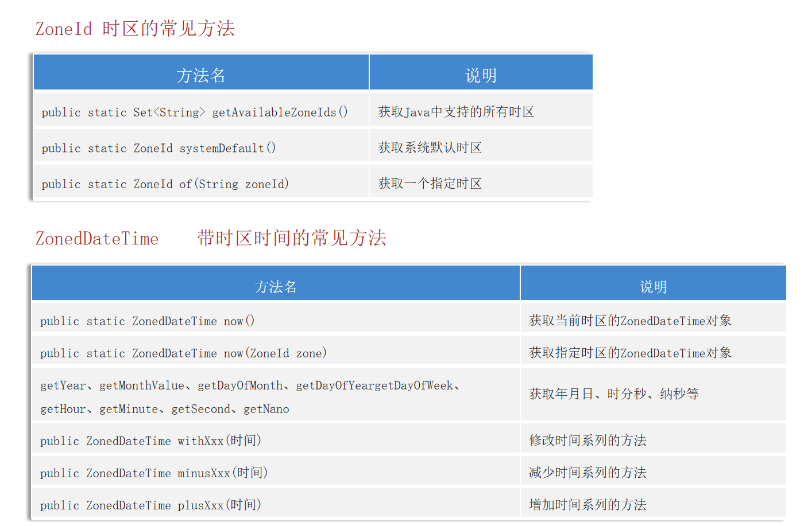
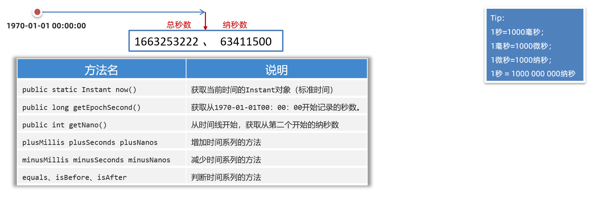
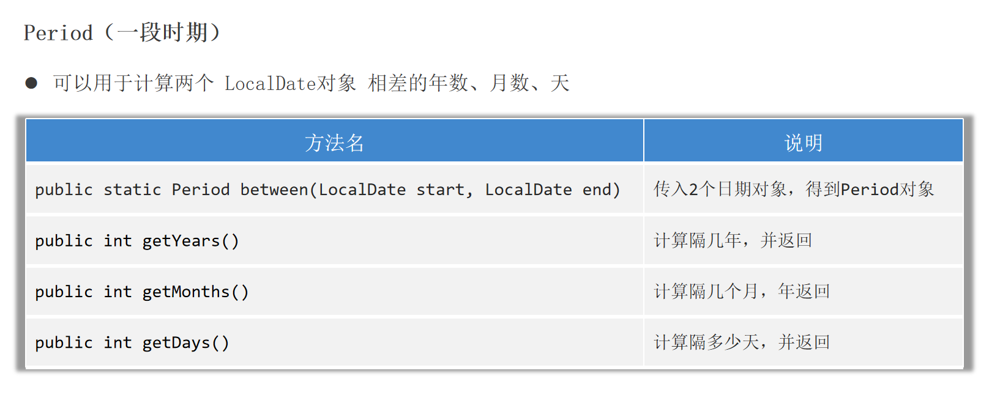

# 第06章_异常处理

## 1. Java异常体系

### 1.1 异常概述

**异常**指的是程序在执行过程中，出现的非正常情况，如果不处理最终会导致JVM的非正常停止。Java中把不同的异常用不同的类表示，一旦发生某种异常，就**创建该异常类型的对象并抛出**(throw)。

### 1.2 Throwable

`java.lang.Throwable`类是Java程序执行过程中发生的异常事件对应的类的**根父类**。有以下几个常用API：

- `void printStackTrace()`：打印异常的详细信息：包括异常的类型、原因、出现位置。开发调试阶段经常使用这个API。
- `String getMessage()`：获取发生异常的字符串信息。在自定义异常的有参构造器中的String参数，就可以使用该API获取到。

### 1.3 Error和Exception

Throwable有两大子类：Error和Exception。

**Error**指的是Java虚拟机无法解决的严重问题，一般不编写针对性的代码进行处理。例如`StackOverflowError`、`OutOfMemoryError`

**Exception**指的是其它因编程错误或偶然的外在因素导致的一般性问题，需要使用针对性的代码进行处理，使程序继续运行。

> 说明：无论是Error还是Exception，还有很多子类，异常的类型非常丰富。本章讨论的异常处理，针对的是**Exception**。

### 1.4 编译时异常和运行时异常

Java程序的执行分为编译时过程和运行时过程。因此，根据异常可能出现的阶段，可以**将异常类Exception分为编译时异常和运行时异常**。

#### 1、编译时异常

编译时异常，又称为受检异常（checked异常）。在代码编译阶段，编译器就能明确警示当前代码`可能发生（不是一定发生）`异常，并`明确督促`程序员提前编写处理它的代码。如果程序员`没有编写`对应的异常处理代码，则编译器就会直接判定编译失败，从而不能生成字节码文件。

通常，这类异常的发生不是由程序员的代码引起的。常见的编译时异常有：

- FileNotFoundException
- ClassNotFoundException
- IOException

#### 2、运行时异常

运行时异常（runtime异常），又称为非受检异常（unchecked异常）。在代码编译阶段，编译器完全不做任何检查，无论该异常是否会发生，编译器都不给出任何提示。只有等代码运行起来并确实发生了该异常，它才能被发现。

通常，这类异常是由程序员的代码编写不当引起的，只要稍加判断，或者细心检查就可以避免。常见的运行时异常有：

- ArrayIndexOutOfBoundsException
- ClassCastException
- NullPointerException
- NumberFormatException
- InputMismatchException
- ArithmeticException

**说明**：Java中使用**RuntimeException代表运行时异常**，该类及其子类都是运行时异常。

### 1.5 异常处理方式

Java程序的执行过程中如出现异常，会生成一个异常类对象，该异常对象将被提交给Java运行时系统，这个过程称为`抛出(throw)异常`。除此之外，另一种生成异常的方式就是程序员显式地使用`throw + 异常类对象`主动抛出异常对象。

如果一个方法内抛出异常，该异常对象会被抛给调用者方法中处理。**处理方式有两种**：

- 一种方式是通过`throws`继续抛给这个调用方法的上层方法，这个过程可以一直继续下去
- 另一种方式是直接通过`try-catch-finally`捕获异常并进行处理。

注意：如果一个异常一直被抛到main()方法，并且main()也不进行`try-catch-finally`捕获处理，那么程序将运行终止。

说明：**编译时异常要求必须显式地选择上述两种方法之一来处理，而运行时异常可以不处理，此时默认将异常不断抛给上层方法**。

## 2. 异常处理方式一：捕获异常

### 2.1 try-catch-finally

```java
try {
    // 可能产生异常的代码
} catch (异常类型1 e) {
    // 当产生异常类型1时的处理措施
} catch (异常类型2 e) {
    // 当产生异常类型2时的处理措施
} finally {
    // 无论是否发生异常，都必须执行的语句
}
```

当某段代码可能发生异常，不管这个异常是编译时异常还是运行时异常，我们都可以使用try块将它括起来，并在try块下面编写catch分支尝试捕获对应的异常对象。

- 如果在程序运行时，try块中的代码没有发生异常，那么catch所有的分支都不执行。
- 如果在程序运行时，try块中的代码发生了异常，根据异常对象的类型，将从上到下选择第一个匹配的catch分支执行。此时try中发生异常的语句下面的代码将不执行，而整个try...catch之后的代码可以继续运行。
- 如果在程序运行时，try块中的代码发生了异常，但是所有catch分支都无法匹配（捕获）这个异常，那么JVM将会终止当前方法的执行，并把异常对象抛给调用者。如果调用者不处理，程序就挂了。

**注意事项**：

- try中声明的局部变量，出了try结构之后，就不可以使用了
- 如果有多个catch分支，并且多个异常类型有父子类关系，必须保证小的子异常类型在上，大的父异常类型在下。否则会报错。
- `try-catch-finally`结构是可以嵌套使用的

**catch块中常用的处理措施有**：

- `throw new RuntimeException(e);`将编译时异常转化为运行时异常抛出
- `e.printStackTrace();`打印异常的详细信息
- 获取异常的描述信息`e.getMessage()`，进行自定义处理

### 2.2 finally的深入理解

因为异常会引发程序跳转，从而导致有些语句执行不到。而程序中有一些特定的代码无论异常是否发生，都`需要执行`。例如，数据库连接、输入流输出流、Socket连接、Lock锁的关闭等，这样的代码通常就会放到finally块中。所以，我们通常将一定要被执行的代码声明在finally中。

> 唯一的例外，在try块中使用`System.exit(0)`来终止当前正在运行的Java虚拟机，则finally中的代码就不会执行。

注1：不论在try代码块中是否发生了异常事件，catch语句是否执行，catch语句是否有异常，catch语句中是否有return，finally块中的语句都会被执行。

注2：finally语句和catch语句都是可选的，但finally不能单独使用。

**例题1**

```java
public class FinallyTest1 {
    public static void main(String[] args) {
        int result = test("12"); // test结束
        System.out.println(result); // 1
    }
    public static int test(String str){
        try{
            Integer.parseInt(str);
            return 1;
        }catch(NumberFormatException e){
            return -1;
        }finally{
            System.out.println("test结束");
        }
    }
}
```

**例题2**

```java
public class FinallyTest2 {
    public static void main(String[] args) {
        int result = test("a"); // test结束
        System.out.println(result); // -1
    }
    public static int test(String str) {
        try {
            Integer.parseInt(str);
            return 1;
        } catch (NumberFormatException e) {
            return -1;
        } finally {
            System.out.println("test结束");
        }
    }
}
```

**例题3**

```java
public class FinallyTest3 {
    public static void main(String[] args) {
        int result = test("a"); // test结束
        System.out.println(result); // 0
    }
    public static int test(String str) {
        try {
            Integer.parseInt(str);
            return 1;
        } catch (NumberFormatException e) {
            return -1;
        } finally {
            System.out.println("test结束");
            return 0;
        }
    }
}
```

**例题4**

```java
public class FinallyTest4 {
    public static void main(String[] args) {
        int result = test(10); // test结束
        System.out.println(result); // 11
    }
    public static int test(int num) {
        try {
            return num;
        } catch (NumberFormatException e) {
            return num--;
        } finally {
            System.out.println("test结束");
            return ++num;
        }
    }
}
```

**例题5**

```java
public class FinallyTest5 {
    public static void main(String[] args) {
        int result = test(10); // test结束
        System.out.println(result); // 10
    }
    public static int test(int num) {
        try {
            return num;
        } catch (NumberFormatException e) {
            return num--;
        } finally {
            System.out.println("test结束");
            ++num;
        }
    }
}
```

解释：方法栈帧中有操作数栈和局部变量表，进入try语句后，将局部变量表中值为10的num放入临时的操作数栈中准备return，此时执行finally语句，将局部变量表中的num值++变为11，但操作数栈中的值并未改变，然后return返回，将10赋值给result。

### 2.3 try-with-resource

#### 1、try-catch-finally的缺点

finally的一个很重要的应用场景就是完成对资源的释放，JDK7之前基本也都是通过finally来释放一些流资源，但其缺点是代码太长、臃肿。如下所示：

```java
@Test
public void test01() {
    FileWriter fw = null;
    BufferedWriter bw = null;
    try {
        fw = new FileWriter("d:/1.txt");
        bw = new BufferedWriter(fw);

        bw.write("hello");
    } catch (IOException e) {
        e.printStackTrace();
    } finally {
        try {
            if (bw != null) {
                bw.close();
            }
        } catch (IOException e) {
            e.printStackTrace();
        }
        try {
            if (fw != null) {
                fw.close();
            }
        } catch (IOException e) {
            e.printStackTrace();
        }
    }
}
```

#### 2、try-with-resource

**JDK7开始提供了更简单的资源释放方案：try-with-resource**，格式如下：

```java
try (
    定义资源1;
    定义资源2;
) {
    可能出现异常的代码;
} catch (异常类型 e) {
    异常的处理代码;
}
```

这种方案能使得资源使用完毕后，自动调用其`close()`方法，完成对资源的释放。注意：

- try后的`()`内只能定义资源，否则报错
- 写到`try()`中的资源类的变量默认是final声明的，不能修改
- 资源指的是直接或间接**实现了AutoCloseable接口的类**，比如

```java
public abstract class InputStream implements Closeable {}
public abstract class OutputStream implements Closeable, Flushable {}
public interface Closeable extends AutoCloseable {}
```

举例：

```java
public static void main(String[] args)  {
    try (
        InputStream is = new FileInputStream("D:/resource/meinv.png");
        OutputStream os = new FileOutputStream("C:/data/meinv.png");
    ){
        byte[] buffer = new byte[1024]; 
        int len;
        while ((len = is.read(buffer)) != -1){
            os.write(buffer, 0, len);
        }
        System.out.println("复制完成！！");
    } catch (Exception e) {
        e.printStackTrace();
    }
}
```

#### 3、JDK9的新特性

从JDK9开始，try的前面就可以定义资源，try后面的`()`中可以直接引用资源的名称。在try代码执行完毕后，资源就会自动释放掉，所以同样无需写finally。注意资源必须是final的，不可再被赋值。格式如下：

```java
A a = new A();
B b = new B();
try (a; b) {
    可能出现异常的代码;
} catch (异常类型 e) {
    异常的处理代码;
}
```

举例：

```java
@Test
public void test04() {
    InputStreamReader reader = new InputStreamReader(System.in);
    OutputStreamWriter writer = new OutputStreamWriter(System.out);
    try (reader; writer) {
        // reader是final的，不可再被赋值
        // reader = null; // 报错
    } catch (IOException e) {
        e.printStackTrace();
    }
}
```

## 3. 异常处理方式二：声明抛出异常类型

### 3.1 throws

如果在编写方法体的代码时，某句代码可能发生某个`编译时异常`，不处理编译不通过，但是在当前方法体中可能不适合处理该异常，那么此方法就可以**显式地声明抛出异常类型**，表明该方法将不对这些异常进行处理，而由该方法的调用者负责处理。

具体方式是，在方法签名中使用`throws`语句声明抛出异常的列表，throws后面的异常类型是方法中产生的异常类型或其父类：

```java
修饰符 返回值类型 方法名(参数) throws 异常类型1, 异常类型2 {

}	
```

举例：

```java
public class TestThrowsCheckedException {
    public static void main(String[] args) {
        System.out.println("上课.....");
        try {
            afterClass(); //换到这里处理异常
        } catch (InterruptedException e) {
            e.printStackTrace();
            System.out.println("准备提前上课");
        }
        System.out.println("上课.....");
    }

    public static void afterClass() throws InterruptedException {
        for(int i=10; i>=1; i--){
            Thread.sleep(1000); //本来应该在这里处理异常，但我们显式声明抛出
            System.out.println("距离上课还有：" + i + "分钟");
        }
    }
}
```

### 3.2 throws的理解

throws后面基本都是写**编译时异常**，虽然也可以写运行时异常，但对于运行时异常来说，写或不写对于编译器和程序执行来说都没有任何区别。

事实上，**throws并没有真正处理异常**，因为它只是将可能出现的异常抛给了此方法的调用者，此调用者仍需考虑如何处理相关异常。throws对程序员而言，最大的意义就是可以让编译通过。

## 4. 异常处理方式的选择

**对于运行时异常，我们无需处理**。运行时异常就是RuntimeException及其子类，这类异常即使我们不进行处理，也能编译通过，而在运行时会交给JVM捕获。运行时异常极为普遍，若进行处理会对程序的可读性和运行效率产生严重影响。

**对于编译时异常，我们必须处理，否则编译不通过**。主要有以下原则：

- 如果父类被重写的方法没有throws异常类型，则子类重写的方法中如果出现异常，只能使用`try-catch-finally`进行处理，无法使用throws
- 如果我们定义的方法a中，调用了b、c、d等其他方法，通常在b、c、d中的异常选择使用throws，而在方法a中使用`try-catch-finally`统一处理
- 涉及到资源的使用（流、数据库连接、网络连接等），最终一定要考虑使用`try-catch-finally`处理，否则一旦因出现异常而导致资源没有释放，就发生了内存泄漏

> 说明：Exception是一切编译时异常和运行时异常的父类，所以开发中为了简化代码，一般直接抛出和捕获Exception即可。

## 5. 手动抛出异常对象：throw

### 5.1 生成异常对象的两种方式

Java中异常对象的生成有两种方式：

- 由虚拟机**自动生成**：程序运行过程中，虚拟机检测到程序发生了问题，那么针对当前代码，就会在后台自动创建一个对应异常类的实例对象并抛出。
- 由开发人员**手动创建**：通过`new 异常类型(参数);`可以创建一个异常对象，如果它不抛出就对程序没有任何影响，和创建一个普通对象一样，但是一旦使用`throw`抛出，就会对程序运行产生影响了。在实际开发中，如果出现不满足具体场景的代码问题，我们就有必要手动抛出一个指定类型的异常对象。

### 5.2 throw

```java
throw new 异常类型(参数);
```

throw语句抛出异常对象，就和JVM执行到某个异常语句自动创建和抛出异常对象一样。

- `throw`的异常必须是Throwable或其子类的实例
- 如果是运行时异常类型对象，编译器不会提示
- 如果是编译时异常类型对象，同样需要使用`throws`或者`try-catch`处理，否则编译不通过

**注意事项**：

- throw语句会导致程序执行流程被改变，throw语句是明确抛出一个异常对象，因此它**下面的代码将不会执行**。
- 如果当前方法没有`try-catch`处理这个异常对象，throw语句就会**代替return语句提前终止当前方法的执行**，并返回一个异常对象给调用者。

举例：

```java
public class MyTest {
    public static void main(String[] args) {
        try {
            new Student().register(-1);
        } catch (Exception e) {
            e.printStackTrace();
        }
    }
}
class Student {
    public void register(int id) throws Exception {
        if (id >= 0)
            System.out.println("ok");
        else
            throw new Exception("id非法");
    }
}
```

## 6. 自定义异常

**自定义异常类的步骤**：

1. 继承一个异常类型。如果是要自定义编译时异常，则继承`Exception`；如果是要自定义运行时异常，则继承`RuntimeException`
2. 提供至少两个构造器：一个是无参构造，一个是`(String message)`构造器
3. 自定义异常类需要提供一个全局常量`serialVersionUID`

举例：

```java
public class BelowZeorException extends Exception {
    static final long serialVersionUID = -33234524229948L;
    public BelowZeorException() {
        super();
    }
    public BelowZeorException(String message) {
        super(message);
    }
}
```

**注意事项**：

- 自定义的异常对象只能通过throw手动抛出
- 自定义异常最重要的是异常类的名字和message属性。当异常出现时，可以见名知义，根据名字判断异常类型。比如：`TeamException("成员已满，无法添加");`

# 第07章_多线程

## 1. 基本概念

### 1.1 抢占式调度

`优先级高`的线程会以`较大的概率`优先抢占使用CPU，如果线程的优先级相同，那么会随机选择一个。Java使用的就是这种抢占式调度。

### 1.2 单核和多核CPU

单核CPU在一个时间单元内，只能执行一个线程的任务。多核CPU的效率理论上是单核的倍数，但实际上还会有两方面的限制：

- 其他资源的限制：例如，4核CPU的计算机对应的内存、cache、寄存器等并没有同步扩充4倍。
- 多核CPU之间的协调管理也会有一定损耗：例如，为了线程安全性会考虑任务同步。

### 1.3 并发与并行

**并发**(concurrent)指的是在一段时间内宏观上有多个程序同时运行，但在微观上这些程序是分时交替执行的。比如在单核CPU系统中，每一时刻只能执行一个线程，所以多个程序一定是并发执行的。

**并行**(parallel)指的是在一段时间内确实同时运行多个程序。在多核CPU系统上，将多个程序分配到多个CPU上，就能实现多任务的并行执行。

> **所以多线程既会并行执行也会并发执行**。（除非运行的线程数都不超过CPU核心，那么只会并行执行）

### 1.4 进程、线程、管程

- 进程：在系统中运行的一个应用程序，每个进程都有它自己的内存空间和系统资源
- 线程：也被称为轻量级进程，在同一个进程内会有1个或多个线程，是大多数操作系统进行时序调度的基本单元
- 管程：Monitor（监视器），也就是锁。Monitor其实是一种同步机制，它的义务是保证同一时间只有一个线程可以访问被保护的数据和代码。JVM中同步是基于进入和退出监视器（Monitor管程对象）来实现的。

## 2. 创建线程的三种方式

### 2.1 概述

JVM允许运行多个线程，`java.lang.Thread`类代表**线程**，所有的线程对象都必须是Thread类或其子类的实例。

**说明**：

- 每个线程都是通过某个特定Thread对象的run()方法来完成操作的，因此把run()方法体称为`线程执行体`。
- 要想实现多线程，必须在主线程中创建新的线程对象。
- 必须通过该Thread对象的start()方法来启动这个线程，而非直接调用run()。如果自己手动直接调用run()方法，那么就只是调用普通方法，没有启动多线程模式。**而`start()`方法底层会调用操作系统提供的API来创建一个新线程**。
- 启动线程后，`run()`方法是由JVM调用的，调用的时机、执行的过程控制都由操作系统的CPU调度决定。
- 一个线程对象只能调用一次`start()`方法启动，如果重复调用了，将抛出异常`IllegalThreadStateException`

### 2.2 方式1：继承Thread类

1. 定义Thread类的子类，并重写该类的`run()`方法，该`run()`方法的方法体就代表了线程需要完成的任务
2. 创建当前Thread子类的实例，即创建线程对象
3. 调用线程对象的`start()`方法，其作用是启动该线程，并调用当前线程的`run()`方法

```java
// 自定义线程类
public class MyThread extends Thread {
    public MyThread() {}
    public MyThread(String name) {
        // 调用父类的String参数的构造器，用于指定线程名称
        super(name);
    }

    @Override // 重写run方法，完成该线程执行的逻辑
    public void run() {
        for (int i = 0; i < 10; i++) {
            System.out.println(getName() + ":" + i);
        }
    }
}
```

```java
public class MyTest {
    public static void main(String[] args) {
        MyThread thread1 = new MyThread(); // 创建线程对象1
        thread1.start(); // 启动子线程1

        MyThread thread2 = new MyThread("子线程2"); // 创建线程对象2
        thread2.start(); // 启动子线程2

        for (int i = 0; i < 10; i++) {
            // main线程打印信息
            System.out.println(Thread.currentThread().getName() + ":" + i);
        }
    }
}
```

### 2.3 方式2：实现Runnable接口

1. 定义Runnable接口的实现类，并重写该接口的`run()`方法，该`run()`方法的方法体同样是该线程的线程执行体。
2. 创建Runnable实现类的实例，并以此实例作为Thread构造器的target参数(target参数是Runnable类型)来创建Thread对象，该Thread对象才是真正的线程对象。
3. 调用线程对象的`start()`方法，其作用是启动线程，并调用当前Thread对象的`run()`方法，在该方法中实际上真正调用的是`target.run();`

```java
public class MyRunnable implements Runnable{
    @Override
    public void run() {
        for (int i = 0; i < 10; i++) {
            System.out.println(Thread.currentThread().getName() + ":" + i);
        }
    }
}
```

```java
public class MyTest {
    public static void main(String[] args) {
        MyRunnable runnable = new MyRunnable();
        Thread thread = new Thread(runnable, "线程1");
        thread.start();
        for (int i = 0; i < 10; i++) {
            System.out.println("main:" + i);
        }
    }
}
```

注意：Runnable对象仅仅作为Thread对象的target，Runnable实现类里包含的`run()`方法仅作为线程执行体。而实际的线程对象依然是Thread实例，只是该Thread线程负责执行其target的`run()`方法。

说明：Runnable是一个函数式接口，所以我们经常通过Lambda表达式来创建并执行子线程：

```java
public class MyTest {
    public static void main(String[] args) throws Exception {
        new Thread(() -> {
            for (int i = 0; i < 10; i++) {
                System.out.println(Thread.currentThread().getName()+i);
            }
        }).start();

        for (int i = 0; i < 10; i++) {
            System.out.println(Thread.currentThread().getName()+i);
        }
    }
}
```

### 2.4 方式3：实现Callable接口

> 这种方式最大的优点是线程执行完可以有返回值

1. 定义一个Callable接口的实现类，重写`call()`方法。泛型即为`call()`方法的返回值类型。
2. 创建Callable实现类的对象
3. 创建FutureTask类的对象，将Callable对象传递给FutureTask
4. 创建Thread对象，将FutureTask对象传递给Thread
5. 调用Thread的`start()`方法启动线程，启动后会自动执行`call()`方法。等`call()`方法执行完之后，会自动将返回值结果封装到FutrueTask对象中。
6. 调用FutrueTask对象的`get()`方法获取返回结果

```java
public class MyCallable implements Callable<String> {
    @Override
    public String call() throws Exception {
        System.out.println(Thread.currentThread().getName() + "开始执行了");
        return "执行完毕!结果666!";
    }
}
```

```java
public class MyTest {
    public static void main(String[] args) throws Exception {
        MyCallable callable = new MyCallable();
        FutureTask<String> futureTask = new FutureTask<>(callable);
        new Thread(futureTask).start();

        String ans = futureTask.get();
        System.out.println(ans);
    }
}
```

#### 1、Callable接口

`Callable<V>`接口源码如下：

```java
@FunctionalInterface // 函数式接口
public interface Callable<V> {
    V call() throws Exception;
}
```

注意，Thread类的构造器中并没有Callable类型的参数，所以还需要使用FutureTask。

#### 2、Future接口

`Future<V>`接口定义了操作异步任务执行一些方法，如获取异步任务的执行结果、取消异步任务的执行、判断任务是否被取消、判断任务执行是否完毕等。它是主线程跟踪其他线程结果的一种方式。其核心API有：

- `V get()`：返回任务的执行结果。如果任务尚未完成，则会阻塞等待。
- `V get(long timeout, TimeUnit unit)`：返回任务的执行结果。如果任务尚未完成，则至多等待时间为timeout，单位是unit
- `boolean isDone()`：如果任务已完成，则返回true
- `boolean cancel(boolean mayInterruptIfRunning)`：如果任务尚未启动，则停止任务；如果任务已经启动，则当参数为true时停止任务
- `boolean isCancelled()`：如果任务在正常完成前被停止了，则返回true

#### 3、FutureTask类

`FutureTask<V>`类实现了`RunnableFuture<V>`接口，该接口的源码如下：

```java
public interface RunnableFuture<V> extends Runnable, Future<V> {
    void run();
}
```

因此，FutureTask既是一个Runnable，又是一个Future。所以它既可以作为Runnable被线程执行，又可以作为Future得到Callable的返回值。

FutureTask有以下两种构造器：

- `FutureTask(Callable<V> callable)`：执行的任务就是`call()`的方法体，保存的结果就是`call()`的返回值
- `FutureTask(Runnable runnable, V result)`：执行的任务就是`run()`的方法体，保存的结果就是参数result


## 3. Thread类的常用API

### 3.1 构造器

- `Thread()`
- `Thread(String name)`：指定线程名称
- `Thread(Runnable target)`：指定target，即线程执行体所在的Runnable对象
- `Thread(Runnable target, String name)`：指定target和线程名称

### 3.2 基础API

- `void run()`
- `void start()`
- `String getName()`：获取当前线程名称
- `void setName(String name)`：设置该线程名称
- `static Thread currentThread()`：返回当前正在执行的线程对象的引用
- `static void sleep(long millis)`：**使当前正在执行的线程**睡眠(暂停)指定的毫秒数

### 3.3 核心API

- `void join()`：等待该线程完成。例如，在线程a中调用`b.join()`，则线程a进入阻塞状态，等待线程b执行完成后，线程a才会解除阻塞继续运行。
- `void join(long millis)`：等待该线程完成，最多等待millis毫秒。到了该时间后，将不再等待。
- `void join(long millis, int nanos)`：等待该线程完成，最多等待`millis毫秒 + nanos纳秒`
- `boolean isAlive()`：判断线程是否处于活动状态。活动状态，指的是线程已经启动且尚未终止。 
- `static void yield()`：尝试让当前线程释放CPU的占有权，让系统的线程调度器重新调度一次（当然也有可能重新调度后仍然执行该线程）

以下三个API均`已过时`，了解即可：

- `void stop()`：强行结束该线程，直接进入死亡状态。该方法已过时，不建议使用。
- `void suspend()`：暂停该线程，但不会释放任何锁资源。该方法已过时，不建议使用。
- `void resume()`：唤醒上述因`suspend()`而睡眠的线程。该方法已过时，不建议使用。

### 3.4 优先级相关API

每个线程都有一定的优先级，同优先级的线程组成先进先出队列（先到先服务），使用分时调度策略。优先级高的线程采用抢占式策略，获得较多的执行机会。每个线程默认的优先级都与创建它的父线程具有相同的优先级。

Thread类有三个优先级常量：

- `Thread.MAX_PRIORITY` 值为10，是最高优先级
- `Thread.MIN_PRIORITY` 值为1，是最低优先级
- `Thread.NORM_PRIORITY` 值为5，是普通优先级。默认情况下main线程具有普通优先级。

优先级相关API：

- `int getPriority()`：返回该线程的优先级
- `void setPriority(int newPriority)`：设置该线程的优先级，范围必须是`[1, 10]`之间的整数

### 3.5 守护线程相关API

守护线程，就是在后台运行的、为其他线程提供服务的线程。例如，JVM的垃圾回收线程就是守护线程。注意，**如果主线程结束，但用户线程还在执行，则JVM存活；但如果所有用户线程都结束了，只有守护线程还存活，则JVM会直接结束**。

- `void setDaemon(boolean on)`：如果参数on的值为true，就表示将该线程设置为守护线程。注意，必须在线程`start()`之前设置，否则会报异常。
- `boolean isDaemon()`：判断该线程是否是守护线程。

## 4. 线程的生命周期

### 4.1 线程的6种状态

在java.lang.Thread类的内部枚举类State中定义了线程的6种状态：

```java
public enum State {
	NEW,
	RUNNABLE,
	BLOCKED,
	WAITING,
	TIMED_WAITING,
	TERMINATED;
}
```

- `NEW（新建）`：线程刚被创建(new)，但是并未启动，即还没调用`start()`方法。
- `RUNNABLE（可运行）`：线程`start()`之后就进入可运行状态，但真正的执行时机由OS调度，并不由JVM控制。
- `TERMINATED（终止）`：表明此线程已经结束生命周期（执行完毕或者遇到异常）。
- `BLOCKED（锁阻塞）`：因等待一个锁对象而阻塞的线程处于这种状态。获取到对应的锁对象后，该线程就进入RUNNABLE状态。
- `WAITING（无限等待）`：一个正在无限期等待另一个线程执行一个特别的（唤醒）动作的线程处于这一状态。
- `TIMED_WAITING（计时等待）`：一个正在限时等待另一个线程执行一个特别的（唤醒）动作的线程处于这一状态。

### 4.2 阻塞状态详解

Java中将阻塞状态细分为`锁阻塞`、`无限等待`、`计时等待`这三种。我们详细讨论一下`WAITING`和`TIMED_WAITING`。

当前线程执行过程中遇到Object类的`wait()`，Condition类的`await()`，Thread类的`join()`，LockSupport类的`park()`方法，并且在调用这些方法时**没有指定时间**，那么当前线程会进入`WAITING`状态，直到被唤醒。

- 通过Object类的`wait()`进入WAITING状态的要由Object的`notify()/notifyAll()`唤醒
- 通过Condition的`await()`进入WAITING状态的要由Condition的`signal()`唤醒
- 通过LockSupport类的`park()`方法进入WAITING状态的要由LockSupport类的`unpark()`唤醒
- 通过Thread类的`join()`进入WAITING状态，只有调用`join()`方法的线程对象结束才能让当前线程恢复

当前线程执行过程中遇到Object类的`wait()`，Condition类的`await()`，Thread类的`sleep()`或`join()`，LockSupport类的`park()`方法，并且在调用这些方法时**设置了时间**，那么当前线程会进入`TIMED_WAITING`，直到时间到或被唤醒。

**注意**：当从`WAITING`或`TIMED_WAITING`状态被唤醒（或时间到）后恢复，会首先获取锁对象，获取成功则转为`RUNNABLE`，否则就转为`BLOCKED`


### 4.3 JDK1.5之前的线程状态

在JDK1.5之前，线程的状态有所不同，只有5种状态：

- 新建（New）
- 就绪（Runnable）
- 运行（Running）
- 阻塞（Blocked）
- 死亡（Dead）

## 5. 线程同步

### 5.1 线程同步简介

当多个线程访问**同一共享资源**时，若多个线程`只有读操作`，那么不会发生线程安全问题；但是如果多个线程中对资源有`读和写`的操作，就容易出现线程安全问题。

要解决多线程并发访问一个资源的安全性问题，Java中提供了**同步机制**(synchronized)来解决。同步机制的原理，其实就相当于给某段代码**加锁**，任何线程想要执行这段代码，都要先获得锁，我们称它为**同步锁**（也称为同步监视器、管程、monitor）。

Java对象保存在堆中，有三部分结构：对象头、实例数据、对齐填充。当某个线程获取了`同步锁对象`后，该同步锁对象的对象头中就会**记录这个线程的ID**，这样别的线程试图获取该同步锁对象时，就只能阻塞等待。

实现线程同步，可以采用三种方式：同步代码块、同步方法、Lock锁。注意，线程同步确实解决了线程安全问题，但是加锁的代码实际上是串行执行的，一定程度上意味着降低了效率。

### 5.2 方式1：同步代码块

**同步代码块**：synchronized关键字可以用于某个区块前面，表示只对这个区块的资源实行互斥访问。格式如下：

```java
synchronized (同步监视器) {
     需要同步操作的代码
}
```

**说明**：

- 需要被同步的代码，就是操作共享数据的代码，被synchronized包裹以后，就使得一个线程在操作这些代码的过程中，其它线程必须等待。
- 同步监视器，俗称锁（同步锁），只有获取了该锁的线程，才能执行同步代码块中的代码。
- 同步监视器可以使用任何一个类的对象充当，但是要保证需要同步的多个线程必须**共用同一个同步监视器对象**。一般在实例方法中推荐使用`this`作为同步监视器，而在静态方法中推荐使用`当前类.class`作为同步监视器。

举例：案例场景，三个售票窗口售卖100张票

```java
public class Ticket implements Runnable {
    private static int num = 100;

    @Override
    public void run() {
        while (true) {
            synchronized (this) {
                if (num > 0) {
                    String s = Thread.currentThread().getName();
                    System.out.println(s + "取票" + num);
                    num--;
                } else {
                    break;
                }
            }
            try {
                Thread.sleep(300);
            } catch (InterruptedException e) {
                throw new RuntimeException(e);
            }
        }
    }
}
```

```java
public class MyTest {
    public static void main(String[] args) throws Exception {
        Ticket ticket = new Ticket();
        new Thread(ticket).start();
        new Thread(ticket).start();
        new Thread(ticket).start();
    }
}
```

### 5.3 方式2：同步方法

**同步方法**：synchronized关键字直接修饰方法，表示同一时刻只有一个线程能进入这个方法，其他线程在外面等待。格式如下：

```java
[修饰符] synchronized 返回值类型 方法名(形参列表) {
    需要同步操作的代码
}
```

**说明**：synchronized修饰的实例方法，默认同步监视器是`this`；而synchronized修饰的静态方法，默认同步监视器是`当前类.class`

举例：

```java
public class Ticket implements Runnable {
    private static int num = 100;

    @Override
    public void run() {
        while (sell()) {
            try {
                Thread.sleep(300);
            } catch (InterruptedException e) {
                throw new RuntimeException(e);
            }
        }
    }

    private synchronized boolean sell() {
        if (num > 0) {
            String s = Thread.currentThread().getName();
            System.out.println(s + "取票" + num);
            num--;
            return true;
        }
        return false;
    }
}
```

```java
public class MyTest {
    public static void main(String[] args) throws Exception {
        Ticket ticket = new Ticket();
        new Thread(ticket).start();
        new Thread(ticket).start();
        new Thread(ticket).start();
    }
}
```

### 5.4 方式3：Lock锁

Lock是一个接口，可以创建它的实现类对象来作为同步锁。Lock接口的一个比较常用的实现类是`ReentrantLock`（可重入锁），可以用它来显式加锁、释放锁。

- `void lock()`：加同步锁
- `void unlock()`：释放同步锁

举例：

```java
public class Ticket implements Runnable {
    private static int num = 100;
    // 1. 创建Lock的实例，需要确保多个线程共用同一个Lock实例
    private static final ReentrantLock LOCK = new ReentrantLock();

    @Override
    public void run() {
        while (true) {
            try {
                // 2. 加锁
                LOCK.lock();
                if (num > 0) {
                    String s = Thread.currentThread().getName();
                    System.out.println(s + "取票" + num);
                    num--;
                } else {
                    break;
                }
            } catch (Exception e) {
                throw new RuntimeException(e);
            } finally {
                // 3. 解锁(在finally中解锁，确保出现异常也能释放锁资源)
                LOCK.unlock();
            }
            
            try {
                Thread.sleep(300);
            } catch (InterruptedException e) {
                throw new RuntimeException(e);
            }
        }
    }
}
```

```java
public class MyTest {
    public static void main(String[] args) throws Exception {
        Ticket ticket = new Ticket();
        new Thread(ticket).start();
        new Thread(ticket).start();
        new Thread(ticket).start();
    }
}
```

### 5.5 synchronized与Lock的对比

1. Lock是显式锁（需要手动加锁、解锁），而synchronized是隐式锁，出了作用域、遇到异常等自动解锁
2. Lock只有代码块锁，synchronized有代码块锁和方法锁
3. 使用Lock锁，JVM将花费较少的时间来调度线程，性能更好。并且具有更好的扩展性（提供更多的子类），更体现面向对象。
4. Lock锁可以对读不加锁而只对写加锁，但synchronized不可以
5. Lock锁可以有多种获取锁的方式，可以从sleep的线程中抢到锁，但synchronized不可以
6. Lock可以让等待锁的线程响应中断，而synchronized却不行。使用synchronized时，等待的线程会一直等待下去，不能够响应中断。
7. 通过Lock可以知道有没有成功获取锁，而synchronized却无法办到

> 开发中建议处理线程安全问题优先使用顺序为：Lock > 同步代码块 > 同步方法

### 5.6 单例模式的线程安全问题

#### 1、饿汉式

**饿汉式不会有线程安全问题**，因为饿汉式在类初始化时就直接创建单例对象，而类初始化过程是没有线程安全问题的。如下是两种饿汉式单例模式的实现方式：

**方式一**：

```java
public class HungrySingle {
    private static HungrySingle INSTANCE = new HungrySingle(); 
    private HungrySingle(){}
    public static HungrySingle getInstance(){
        return INSTANCE;
    }
}
```

**方式二**：使用枚举类

```java
public enum HungryOne{
    INSTANCE;
}
```

#### 2、懒汉式

我们之前的**懒汉式单例模式的实现方式会存在线程安全问题**，因为是在第一次调用getInstance()方法时才创建对象。我们有以下两种方式来解决：

**方式一**：使用同步锁

```java
public class LazyOne {
    private static LazyOne instance;
    private LazyOne(){}
    public static synchronized LazyOne getInstance() {
        if (instance == null) {
            instance = new LazyOne();
        }
        return instance;
    }
}
```

**方式二**：使用静态内部类

```java
public class LazySingle {
    private LazySingle() {}
    public static LazySingle getInstance() {
        return Inner.INSTANCE;
    }
    private static class Inner {
        static final LazySingle INSTANCE = new LazySingle();
    }
}
```

内部类只有在外部类被调用才加载，然后产生INSTANCE实例，无需加锁。这是最好的单例模式。当然，此时的内部类也可以用enum定义。

## 6. 线程间通信

### 6.1 等待唤醒机制

当我们需要多个线程来共同完成一件任务，并且我们希望它们`有规律地执行`，那么多线程之间需要一些通信机制，来协调它们的工作。**等待唤醒机制**就是多个线程间的一种`协作机制`。

在一个线程满足某个条件时，就进入等待状态`wait()`，等待其他线程执行完他们的指定代码过后再将其唤醒`notify()`；或可以指定wait的时间，等时间到了自动唤醒`wait(time)`；在有多个线程进行等待时，如果需要，可以使用`notifyAll()`来唤醒所有的等待线程。`wait/notify`就是线程间的`等待唤醒机制`。

在Object类中提供了以下API：

- `void wait()`：使当前线程进入阻塞状态，保存到`wait set`中，并且会释放持有的锁对象。此时的线程状态是WAITING，不再会浪费CPU资源，需要等待另一个线程notify唤醒，在这个锁对象上等待的线程才能重新进入调度队列`ready queue`。
- `void wait(long timeoutMillis)`：与`wait()`类似，只不过此时的线程状态是`TIMED_WAITING`，如果等待时间到了timeoutMillis毫秒还没有被别的线程唤醒，就会自动唤醒。
- `void wait(long timeoutMillis, int nanos)`：与上述API类似，等待时间为`timeoutMillis毫秒 + nanos纳秒`
- `void notify()`：选取当前锁对象的`wait set`中优先级最高的一个线程唤醒(如果优先级相同，则随机唤醒一个)。被唤醒的线程需要先尝试获取该锁对象，然后才能从当初调用`wait()`的位置继续向下执行；如果未能获取锁对象，则会进入`BLOCKED`状态。
- `void notifyAll()`：唤醒当前锁对象的`wait set`中的全部线程。它们被唤醒后同样需要先竞争获取该锁对象。

> 注1：`wait(time)`超时后自动唤醒，同样需要先获取锁对象。
>
> 注2：很显然被唤醒后的线程也不一定能立即恢复执行。如果能获取锁对象，则变为RUNNABLE状态；否则，就变为BLOCKED状态（这种情况也称为虚假唤醒）。

**注意事项**：

- 上述方法的使用，必须是在同步代码块或同步方法中，因为必须要**通过锁对象调用这些方法**。Lock则需要配合Condition实现线程间通信。
- 上述方法的调用者必须是同步监视器。同一锁对象通过`notify()`唤醒的线程，只能是这一锁对象当初调用`wait()`后睡眠的线程。


**举例**：两个线程交替打印数字1到100

```java
public class PrintNumber implements Runnable{
    private static int num = 1;

    @Override
    public void run() {
        while (true) {
            synchronized (this) {
                this.notify(); // 唤醒另一个线程
                if (num <= 100) {
                    String str = Thread.currentThread().getName();
                    System.out.println(str + "打印" + num);
                    num++;
                    try {
                        // 进入等待状态，并且会释放锁
                        wait();
                    } catch (InterruptedException e) {
                        throw new RuntimeException(e);
                    }
                } else {
                    break;
                }
            }
        }
    }
}
```

```java
public class MyTest {
    public static void main(String[] args) throws Exception {
        PrintNumber print = new PrintNumber();
        new Thread(print).start();
        new Thread(print).start();
    }
}
```

### 6.2 生产者与消费者问题

等待唤醒机制可以解决经典的生产者与消费者问题（也称为有限缓冲区问题），该问题描述了多个`共享固定大小缓冲区的线程`（即所谓的生产者和消费者）在实际运行时会发生的问题。

生产者的主要作用是生成一定量的数据放到缓冲区中，然后重复此过程。消费者则在缓冲区消耗这些数据。**该问题的关键就是要保证生产者不会在缓冲区满时加入数据，消费者也不会在缓冲区空时消耗数据**。

**案例场景**：

生产者(Producer)将产品交给店员(Clerk)，而消费者(Consumer)从店员处取走产品，店员一次只能持有固定数量的产品(至多20个)。

**生产者与消费者问题中隐含了两个问题**：

- 线程安全问题：因为生产者与消费者共享数据缓冲区，所以会有线程安全问题。
- 线程的协调工作问题：要解决该问题，就必须让生产者线程在缓冲区满时等待(wait)，暂停进入阻塞状态，等到下次消费者消耗了缓冲区中的数据时，通知(notify)正在等待的线程恢复到就绪状态，重新开始往缓冲区添加数据。同样，消费者线程在缓冲区空时等待(wait)，暂停进入阻塞状态，等到生产者往缓冲区添加数据之后，再通知(notify)正在等待的线程恢复到就绪状态。通过这样的**线程间通信机制**来解决此类问题。

**代码实现**：

```java
enum Mutex {
    MUTEX;
}
class Clerk {
    public static int productNum = 0;
}
class Producer implements Runnable {
    @Override
    public void run() {
        while (true) {
            synchronized (Mutex.MUTEX) {
                addProduct();
            }
        }
    }
    private void addProduct() {
        while (Clerk.productNum >= 20) {
            try {
                Mutex.MUTEX.wait();
            } catch (InterruptedException e) {
                throw new RuntimeException(e);
            }
        }
        System.out.println("生产产品" + (++Clerk.productNum));
        Mutex.MUTEX.notify();
    }
}
class Consumer implements Runnable {
    @Override
    public void run() {
        while (true) {
            synchronized (Mutex.MUTEX) {
                delProduct();
            }
        }
    }
    private void delProduct() {
        while (Clerk.productNum <= 0) {
            try {
                Mutex.MUTEX.wait();
            } catch (InterruptedException e) {
                throw new RuntimeException(e);
            }
        }
        System.out.println("消费产品" + (Clerk.productNum--));
        Mutex.MUTEX.notify();
    }
}
public class ProducerConsumerTest {
    public static void main(String[] args) {
        new Thread(new Producer()).start();
        new Thread(new Consumer()).start();
    }
}
```

### 6.3 区分sleep()和wait()

**相同点**：一旦执行，都会使得当前线程结束执行状态，释放CPU资源，进入阻塞状态。

**不同点**：

1. 方法所属的类不同：`sleep()`在Thread中定义；而`wait()`在Object中定义
2. 使用范围不同：`sleep()`可以在任何需要使用的位置被调用；而`wait()`必须使用在同步代码块或同步方法中
3. **`sleep()`不会释放锁对象；而`wait()`会释放锁对象**
4. `sleep()`进入的阻塞状态是`TIMED_WAITING`，在指定时间一到就结束阻塞，变为`RUNNABLE`状态；而`wait()`进入的阻塞状态是`WAITING`，`wait(time)`进入的阻塞状态是`TIMED_WAITING`，被唤醒后需要先竞争锁，如果未获取到锁则会进入`BLOCKED`状态

### 6.4 释放锁的时机

任何线程进入同步代码块、同步方法之前，必须先获得同步监视器，而**释放锁的时机有以下几种**：

- 当前线程的同步方法、同步代码块执行结束。
- 当前线程在同步代码块、同步方法中遇到break、return终止了该代码块、该方法的继续执行。
- 当前线程在同步代码块、同步方法中出现了未处理的错误，导致当前线程异常结束。
- 当前线程在同步代码块、同步方法中执行了锁对象的`wait()`方法，使得当前线程被挂起并释放锁。

**注意，以下操作并不会释放锁**：

- 线程执行同步代码块或同步方法时，程序调用`Thread.sleep()`、`Thread.yield()`方法暂停当前线程的执行。
- 线程执行同步代码块时，其他线程调用了该线程的`suspend()`方法将该该线程挂起，该线程不会释放锁。

## 7. 线程池

### 7.1 线程池简介

如果并发的线程数量很多，频繁创建线程就会大大降低系统的效率，因为创建线程和销毁线程的开销是很大的。

**线程池就是一个可以复用线程的技术**。在线程池中会提前创建好多个线程，使用时可以直接获取，使用完后就直接放回池中。这样就可以避免频繁创建、销毁线程，实现重复利用。


Java提供了代表线程池的接口`ExecutorService`，创建线程池主要有以下两种方式：

- 使用ExecutorService接口的实现类ThreadPoolExecutor来创建一个线程池对象
- 使用工具类Executors的静态方法来创建不同特点的线程池对象

### 7.2 创建线程池的方式一

使用实现类ThreadPoolExecutor的构造器，可以创建自定义的线程池对象：

```java
ThreadPoolExecutor(int corePoolSize,
                   int maximumPoolSize,
                   long keepAliveTime,
                   TimeUnit unit,
                   BlockingQueue<Runnable> workQueue,
                   ThreadFactory threadFactory,
                   RejectedExecutionHandler handler)
```

- `corePoolSize`：指定线程池的核心线程数量
- `maximumPoolSize`：指定线程池的最大线程数量（即核心线程数+临时线程数）
- `keepAliveTime`：指定临时线程的存活时间，即如果临时线程经过该时长都没有执行任务，就将其销毁
- `unit`：指定临时线程存活时间的单位（秒、分、时、天）
- `workQueue`：指定线程池的任务队列
- `threadFactory`：指定线程池的线程工厂
- `handler`：指定线程池的新任务拒绝策略

**注意**：

- 临时线程的创建时机：新任务提交时发现所有核心线程都在忙，任务队列也满了，并且还可以创建临时线程，此时才会创建临时线程
- 任务拒绝的时机：所有核心线程和临时线程都在忙，任务队列也满了，此时新的任务过来就会触发新任务拒绝策略

**说明**：

（1）对于计算密集型任务，核心线程数量推荐配置为`CPU核数+1`；对于IO密集型任务，核心线程数量推荐配置为`CPU核数*2`

（2）参数`unit`一般用枚举类TimeUnit指定，例如`TimeUnit.SECONDS`

（3）任务队列`workQueue`可以使用比较常用的阻塞队列`new ArrayBlockingQueue<>(capacity)`，其中capacity表示任务队列的长度

（4）线程工厂`threadFactory`可以使用`Executors.defaultThreadFactory()`

（5）新任务拒绝策略一般有以下几种：

- `new ThreadPoolExecutor.AbortPolicy()`：丢弃新任务并抛出RejectedExecutionException异常，这是默认的策略
- `new ThreadPoolExecutor.DiscardPolicy()`：丢弃新任务，但不抛出异常。不推荐使用这种策略。
- `new ThreadPoolExecutor.DiscardOldestPolicy()`：丢弃队列中等待最久的任务，然后把新任务加入队列中
- `new ThreadPoolExecutor.CallerRunsPolicy()`：由创建线程池的线程（一般都是主线程）直接负责调用新任务的`run()`方法，即绕过线程池直接执行

### 7.3 创建线程池的方式二

使用工具类Executors的静态方法可以创建不同特点的线程池对象。常用API如下：

- `static ExecutorService newFixedThreadPool(int nThreads)`：创建固定线程数量的线程池，如果某个线程因为执行异常而结束，那么线程池会补充一个新线程替代它。
- `static ExecutorService newSingleThreadExecutor()`：创建只有一个线程的线程池对象，如果该线程出现异常而结束，那么线程池会补充一个新线程。
- `static ExecutorService newCachedThreadPool()`：线程数量随着任务增加而增加，如果线程任务执行完毕且空闲了60s则会被回收掉。
- `static ScheduledExecutorService newScheduledThreadPool(int corePoolSize)`：创建一个线程池，可以实现在一定的延迟后运行任务，或者定期执行任务。

> 事实上，这些方法的底层，都是通过线程池的实现类ThreadPoolExecutor创建的线程池对象

**注意**：大型并发系统环境下，使用Executors创建线程池，会有极大的风险。阿里开发手册中严禁使用Executors创建线程池，原因是：

- `FixedThreadPool`和`SingleThreadPool`，允许的任务队列长度为`Integer.MAX_VALUE`，可能会堆积大量的任务请求，从而导致OOM
- `CachedThreadPool`和`ScheduledThreadPool`，允许创建的线程数量为`Integer.MAX_VALUE`，可能会创建大量的线程，从而导致OOM

### 7.4 线程池执行Runnable任务

**线程池的常用API如下**：

- `void shutdown()`：关闭线程池（需要等待全部任务执行完成后再关闭）
- `List<Runnable> shutdownNow()`：立即关闭线程池，停止正在执行的任务，并返回队列中未执行的任务
- `void execute(Runnable command)`：执行Runnable任务
- `Future<T> submit(Callable<T> task)`：执行Callable任务，返回未来任务对象（用于获取线程的返回结果）

**线程池执行Runnable任务**，就需要使用`execute()`方法。举例如下：

```java
public class RunnableTask implements Runnable {
    @Override
    public void run() {
        String name = Thread.currentThread().getName();
        System.out.println(name + "==> 666");
        try {
            Thread.sleep(Integer.MAX_VALUE);
        } catch (InterruptedException e) {
            throw new RuntimeException(e);
        }
    }
}
```

```java
public class ThreadPoolTest {
    public static void main(String[] args) {
        ThreadPoolExecutor pool = new ThreadPoolExecutor(3, 5, 100,
                TimeUnit.SECONDS,
                new ArrayBlockingQueue<>(4), // 长度为4的任务队列
                Executors.defaultThreadFactory(), // 默认的线程工厂
                new ThreadPoolExecutor.AbortPolicy());
        Runnable task = new RunnableTask();

        pool.execute(task);
        pool.execute(task);
        pool.execute(task);
        // 核心线程已满，下面4个任务进入任务队列等待
        pool.execute(task);
        pool.execute(task);
        pool.execute(task);
        pool.execute(task);
        // 任务队列已满，下面2个任务由新创建的临时线程处理
        pool.execute(task);
        pool.execute(task);
        // 核心线程、临时线程、任务队列都满了，新任务将被拒绝
        pool.execute(task);
    }
}
```

### 7.5 线程池执行Callable任务

**线程池执行Callable任务**，就需要使用`submit()`方法。举例如下：

```java
public class CallableTask implements Callable<String> {
    private int n;
    public CallableTask(int n) {
        this.n = n;
    }
    @Override
    public String call() throws Exception {
        Thread.sleep(2000);
        String name = Thread.currentThread().getName();
        return name + "哈哈" + n;
    }
}
```

```java
public class ThreadPoolTest {
    public static void main(String[] args) throws Exception {
        ThreadPoolExecutor pool = new ThreadPoolExecutor(3, 5, 100,
                TimeUnit.SECONDS,
                new ArrayBlockingQueue<>(4), // 长度为4的任务队列
                Executors.defaultThreadFactory(), // 默认的线程工厂
                new ThreadPoolExecutor.AbortPolicy());

        Future<String> f1 = pool.submit(new CallableTask(100));
        Future<String> f2 = pool.submit(new CallableTask(100));
        Future<String> f3 = pool.submit(new CallableTask(100));
        Future<String> f4 = pool.submit(new CallableTask(100));

        System.out.println(f1.get());
        System.out.println(f2.get());
        System.out.println(f3.get());
        System.out.println(f4.get());
    }
}
```


# 第08章_常用类和API

## 1. String

### 1.1 String的基本性质

String表示字符串，使用一对双引号引起来表示。所有Java的字符串字面值，也都是字符串对象。有以下两种定义方式：

- `String s1 = "wsy";`
- `String s2 = new String("wsy");`

（1）String类是final修饰的，所以**不可以被继承**

（2）String类实现了Serializable接口，表示字符串时支持序列化的

（3）String类实现了Comparable接口，表示字符串可以比较大小

### 1.2 String内部存储结构

JDK8时String对象的字符内容是存储在一个字符数组中的：`private final char[] value;`

- private意味着外面无法直接获取字符数组，而且String没有提供value的get和set方法。
- String没有提供方法来修改value数组某个元素值
- final意味着字符数组的引用不可改变
- 因此，String代表着不可变的字符序列。即，一旦对字符串进行修改，就会产生新对象。

String在jdk8及以前内部使用`private final char[] value;`来存储字符串数据。在jdk9时，改为使用`private final byte[] value;`来存储字符串数据。**原因如下**：

数据表明字符串在堆中占了主要部分，而大多数字符串中只包含占用1个字节的拉丁字符，所以使用char数组(一个char占用2个字节)过于浪费。因此将String的内部存储结构改成了使用byte数组的方式，并且额外增加一个属性`coder`作为编码标志，编码标志就代表编码的方式：

- 如果该字符串中全部都是拉丁字符，则编码标志就会指示byte数组中一个字节就代表一个字符
- 如果该字符串中有的字符需要2个字节来存储，则编码标志就会指示byte数组中每两个字节代表一个字符

> 除此之外，基于String的数据结构，例如StringBuffer和StringBuilder的内部存储结构也同样使用byte数组了。

### 1.3 String的不可变性

String代表不可变的字符序列：

- 当对字符串重新赋值时，需要重写指定内存区域赋值，不能使用原有的value进行赋值
- 当对现有的字符串进行连接操作时，也需要重新指定内存区域赋值，不能使用原有的value进行赋值
- 当调用String的replace()方法修改指定字符或字符串时，也需要重新指定内存区域赋值，不能使用原有的value进行赋值
- 调用字符串的`concat(xxx)`进行拼接。不管是常量调用此方法，还是变量调用，同样不管参数是常量还是变量，总之，调用完`concat()`方法都返回一个新new的对象。

注意：通过字面量的方式（区别于new）给一个字符串赋值，此时的字符串值声明在**字符串常量池**中。

**字符串常量池是不会存储相同内容的字符串的**

字符串常量池是一个固定大小的Hashtable，默认大小长度是60013。如果放进字符串常量池的String非常多，就会造成Hash冲突严重，从而导致链表会很长，导致调用`String.intern()`时性能会大幅下降。

> 说明：字符串拼接的详细细节，可以参考JVM笔记

### 1.4 String的内存分配

在Java语言中有8种基本数据类型和一种比较特殊的类型String。这些类型在程序中都会频繁用到，所以为了使它们在运行过程中速度更快、更节省内存，都提供了一种常量池的概念。

常量池就类似一个Java系统级别提供的缓存。8种基本数据类型的常量池都是系统协调的，String类型的常量池比较特殊，它的主要使用方法有两种：

- 直接使用双引号声明出来的String对象会直接存储在常量池中
- 通过String对象调用intern()方法，返回的就是常量池中字符串的地址

> 从Java7开始，字符串常量池的位置调整到堆中

### 1.5 String的常用API

#### 1、构造器

* `String()`：其内容是空字符串
* `String(String s)`
* `String(char[] value)`：通过字符数组来构造新的String
* `String(char[] value, int offset, int count) `：通过字符数组的一部分`[offset, offset + count)`来构造新的String
* `String(byte[] bytes)`：通过使用平台的**默认字符集**解码当前参数中的字节数组来构造新的String
* `String(byte[] bytes, String charsetName)`：通过使用指定的字符集解码当前参数中的字节数组来构造新的String。

举例：

```java
//字面量定义方式：字符串常量对象
String str = "hello";

//构造器定义方式
String str1 = new String();
String str2 = new String("hello");

char chars[] = {'a', 'b', 'c', 'd', 'e'};     
String str3 = new String(chars);
String str4 = new String(chars, 0, 3);

byte bytes[] = {97, 98, 99};     
String str5 = new String(bytes);
String str6 = new String(bytes, "GBK");
```

#### 2、String与字符/字节数组的转换

（1）字符数组转换为String

- 使用String类的构造器
- `static String valueOf(char data[])`：静态方法，和构造器类似
- `static String copyValueOf(char data[])`：同上
- `static String valueOf(char data[], int offset, int count)`：静态方法，和构造器类似
- `static String copyValueOf(char data[], int offset, int count)`：同上

（2）字节数组转换为String：使用String类的构造器

（3）String转换为字符数组：

- `char[] toCharArray()`
- `void getChars(int srcBegin, int srcEnd, char dst[], int dstBegin)`：将指定索引范围内的内容保存到指定字符数组中

（4）String转换为字节数组：

- `byte[] getBytes()`：使用平台默认的字符集将此String编码为byte序列
- `byte[] getBytes(String charsetName)`：使用指定的字符集将此String编码为byte序列

#### 3、基本API

- `boolean isEmpty()`：字符串是否为空
- `int length()`：返回字符串的长度，即字符的个数
- `char charAt(int index)`：返回index位置的字符
- `String concat(String str)`：拼接字符串
- `boolean equals(Object obj)`：比较字符串内容是否相同，区分大小写
- `boolean equalsIgnoreCase(String s)`：比较字符串内容是否相同，不区分大小写
- `int compareTo(String s)`：按照Unicode编码值比较字符串大小，区分大小写
- `int compareToIgnoreCase(String s)`：按照Unicode编码值比较字符串大小，不区分大小写
- `String toLowerCase()`：字母转为小写
- `String toUpperCase()`：字母转为大写
- `String trim()`：去掉字符串前后的空白符
- `String intern()`：返回该字符串内容在字符串常量池中的引用
- `String[] split(String regex)`：把字符串按照regex内容分割，并返回分割后的字符串数组。其中regex可以是正则表达式。

#### 4、字符串查找

- `boolean contains(CharSequence s)`：是否包含字符串s
- `int indexOf(String str)`：从前往后找当前字符串中的str，如果有则返回首次找到的下标，否则返回-1
- `int indexOf(String str, int fromIndex)`：从指定索引开始找str
- `int lastIndexOf(String str)`：从后往前找当前字符串中的str，如果有则返回首次找到的下标，否则返回-1
- `int lastIndexOf(String str, int fromIndex)`：从指定索引开始反向找str

#### 5、字符串截取

- `String substring(int beg)`：返回从beg开始截取到最后的字符串
- `String substring(int beg, int end)`：返回截取`[beg, end)`的字符串

#### 6、开头与结尾

- `boolean startsWith(String prefix)`：判断此字符串是否以指定的前缀开头
- `boolean startsWith(String prefix, int toffset)`：判断此字符串从索引toffset开始的子字符串，是否以指定的前缀开头
- `boolean endsWith(String suffix)`：判断此字符串是否以指定的后缀结尾

#### 7、替换

- `String replace(char oldChar, char newChar)`：返回一个新的字符串，它将原字符串的所有字符oldChar替换为newChar
- `String replace(CharSequence target, CharSequence replacement)`：将原字符串的所有target子字符串，替换为replacement
- `String replaceAll(String regex, String replacement)`：使用给定的replacement替换此字符串所有匹配给定的正则表达式的子字符串
- `String replaceFirst(String regex, String replacement)`：使用给定的replacement替换此字符串匹配给定的正则表达式的第一个子字符串

## 2. StringBuffer、StringBuilder

### 2.1 简介

String对象是不可变对象，虽然可以共享常量对象，但是对于频繁字符串的修改和拼接操作，效率极低，空间消耗也比较高。

而StringBuffer与StringBuilder是可变的字符序列，jdk8及之前底层使用`char[]`，jdk9及之后底层使用`byte[]`。两者功能类似，区别在于**StringBuffer是线程安全的、效率低，而StringBuilder线程不安全、效率高**。

对StringBuffer和StringBuilder的字符串内容进行增删，不会产生新的对象，因此称为`可变的字符序列`。

**说明**：

- 如果开发中需要频繁的针对于字符串进行增、删、改等操作，建议使用StringBuffer或StringBuilder替换String。
- 如果开发中，不涉及到线程安全问题，建议使用StringBuilder。
- 对于StringBuilder和StringBuffer，如果开发中大体确定要操作的字符的个数，建议使用有参构造器`StringBuffer(int capacity)`直接指定底层value数组的大小，从而可以避免底层多次扩容操作，性能更高。

### 2.2 底层原理

StringBuilder和StringBuffer底层原理相同，我们以其中之一为例：

```java
String s = new String("abc");
StringBuilder sb = new StringBuilder("abc");
```

- 对于String而言，其底层创建的`byte[]`数组value长度固定为3，用于存储`'a' 'b' 'c'`，且被final修饰
- 对于StringBuilder而言，其底层创建的`byte[]`数组value**长度默认为`16 + "abc".length()`**，并且该数组没有被final修饰。除此之外，StringBuilder还有一个属性`int count;`用于记录**实际存储的字符个数**。

所以如果我们调用append()方法添加`"de"`，其底层就相当于做了`value[3] = 'd', value[4] = 'e';`并增加了属性count的值。因此其增删操作的性能比String高得多。

**注意**：如果添加字符串后其长度超过了底层数组的初始长度，则会进行扩容，默认扩容的长度为原长度的2倍再加2，(假如扩容后的长度仍不够，则会直接将长度设置为添加字符串后实际的长度)，扩容完成后，将底层的value数组指向新扩容的数组，然后进行逐一复制byte，因此，**本质上从来没有创建新的StringBuilder对象，只不过是其底层数组改变了指向而已，所以StringBuilder是可变的字符序列**。

**例题**：

```java
String str = null;
StringBuffer sb = new StringBuffer();
sb.append(str);
System.out.println(sb.length()); // 4
System.out.println(sb); // null

StringBuffer sb1 = new StringBuffer(str); // 空指针异常
```

- 根据底层源码，当调用`append(String str)`时，如果str是null，则会拼接一个内容为`"null"`的字符串
- 而调用构造器`StringBuffer(str)`时，为了确定底层value数组的长度，会首先获取str的长度，即调用`str.length()`，此时由于str为空，会直接报空指针异常

### 2.3 常用API

StringBuilder、StringBuffer的API是完全一致的，并且很多方法与String相同。

#### 1、构造器

- `StringBuffer()`：底层value数组的默认长度为16
- `StringBuffer(int capacity)`：指定底层value数组的长度为capacity
- `StringBuffer(String str)`：创建一个指定字符串内容的StringBuffer对象，其底层value数组的默认长度为`16 + str.length()`

#### 2、增删改查API

- `StringBuffer append(T obj)`：提供了很多重载的append()方法，用于进行字符串追加方式的拼接
- `StringBuffer insert(int offset, T obj)`：提供了很多重载的insert()方法，用于在索引offset处插入obj
- `StringBuffer delete(int start, int end)`：删除`[start, end)`之间的字符
- `StringBuffer deleteCharAt(int index)`：删除index索引处的字符
- `StringBuffer replace(int start, int end, String str)`：替换`[start; end)`范围的字符序列为str
- `void setCharAt(int index, char ch)`：将索引index处的字符替换为ch
- `StringBuffer reverse()`：反转
- `char charAt(int index)`：返回index处的字符

**注意**：如上返回值为StringBuffer的API支持`方法链操作`，因为其底层返回的就是`this`，例如：

```java
public StringBuilder append(String str) {
    super.append(str);
    return this;
}
```

#### 3、其他核心API

- `String toString()`：转换为String
- `int length()`：返回字符数据的长度，即字符的个数
- `void setLength(int newLength)`：设置当前字符序列长度为newLength，如果newLength比原有字符串的长度大，则新的位置默认由`'\0'`填充
- `String substring(int start)`：截取当前字符序列，从start开始到最后
- `String substring(int start, int end)`：截取当前字符序列`[start, end)`
- `int indexOf(String str)`：从前往后查询str首次出现的下标
- `int indexOf(String str, int fromIndex)`：从fromIndex开始从前往后查询str首次出现的下标
- `int lastIndexOf(String str)`：从后往前查询str首次出现的下标
- `int lastIndexOf(String str, int fromIndex)`：从fromIndex开始从后往前查询str首次出现的下标

### 2.4 补充：StringJoiner类

StringJoiner类是JDK8开始才有的，它也是一个用来操作字符串的可变字符序列。其优点是能提高字符串的操作效率，并且在某些场景下代码会更简洁，StringJoiner号称是拼接神器。

**构造器**：

- `StringJoiner(CharSequence delimiter)`：创建一个StringJoiner对象，其拼接时使用的间隔符号为delimiter
- `StringJoiner(CharSequence delimiter, CharSequence prefix, CharSequence suffix)`：创建一个StringJoiner对象，其前缀为prefix，后缀为suffix，拼接时使用的间隔符号为delimiter

**常用API**：

- `StringJoiner add(CharSequence newElement)`：拼接字符串，返回对象本身
- `int length()`：返回字符的个数
- `String toString()`：转换为String

举例：

```java
StringJoiner s = new StringJoiner(", ", "[", "]");
s.add("cpp");
s.add("java");
s.add("python");
System.out.println(s); // [cpp, java, python]
```

## 3. Java比较器

引用数据类型是不能直接使用比较运算符来比较大小的，但我们在需要排序的场景都需要进行对象之间的比较。所以Java提供以下两种方式：

- java.lang.Comparable：只要一个类实现了该接口，就具有了比较大小的规则
- java.util.Comparator：有些方法(如排序)额外提供了一个比较器参数，就是用于临时指定所需的比较大小的规则

### 3.1 Comparable

#### 1、简介

`Comparable<T>`是一个接口，实现了该接口的类，就可以按照这种规则比较大小（也称为`自然排序`）。其源码如下：

```java
public interface Comparable<T> {
    public int compareTo(T obj);
}
```

两个对象通过`compareTo()`的返回值来比较大小，**默认的升序规则约定**为：

- 如果认为左边的对象小于右边的对象，则返回负数
- 如果认为左边的对象大于右边的对象，则返回正数
- 如果认为左边的对象等于右边的对象，则返回0

> 说明：在这里，左边的对象就是this，右边的对象就是形参obj

#### 2、特点

对于实现了Comparable接口的对象的集合(或数组)，可以直接使用`Collections.sort()`或`Arrays.sort()`进行排序。

对于实现了Comparable接口的对象，可以直接成为有序集合中的元素、或者有序映射中的键，而无需额外指定比较器。

> **注意**：类的`compareTo()`方法最好与`equals()`方法保持一致，也就是`equals()`返回true当且仅当`compareTo()`返回0

很多类都实现了Comparable接口，例如：

- String：按照字符串中字符的Unicode值进行比较
- Character：按照字符的Unicode值来进行比较
- 数值类型对应的包装类以及BigInteger、BigDecimal：按照它们对应的数值大小进行比较
- Boolean：true对应的包装类实例大于false对应的包装类实例
- Date、Time等：后面的日期时间比前面的日期时间大

> 说明：这些类默认都是从小到大的升序规则

#### 3、代码演示

> 需求：Student类按照年龄的升序进行排序

```java
@Data
@NoArgsConstructor
@AllArgsConstructor
public class Student implements Comparable<Student> {
    private String name;
    private double height;
    private int age;

    @Override
    public int compareTo(Student o) {
        return this.age - o.age; // 按照年龄升序排列
        // return o.age - this.age; // 按照年龄的降序排列
    }
}
```

```java
public class ComparableTest {
    public static void main(String[] args) {
        List<Student> list = new ArrayList<>();
        list.add(new Student("张三", 169.5, 28));
        list.add(new Student("李四", 178.5, 24));
        list.add(new Student("王五", 178.5, 18));
        list.add(new Student("赵六", 163.5, 18));
        // 直接进行排序即可，比较大小的规则已经在Student类中指定
        Collections.sort(list);
        System.out.println(list);
    }
}
```

### 3.2 Comparator

#### 1、简介

`Comparator<T>`是一个函数式接口，称为比较器（也称为`定制排序`），它的抽象方法是`int compare(T o1, T o2);`**默认的升序规则约定**为：

- 如果认为左边的对象小于右边的对象，则返回负数
- 如果认为左边的对象大于右边的对象，则返回正数
- 如果认为左边的对象等于右边的对象，则返回0

> 说明：在这里，左边的对象就是o1，右边的对象就是o2

Java中的很多方法都额外提供了一个比较器参数，就是用于临时指定排序规则。例如：

- `Collections.sort(List<T> list, Comparator<? super T> c)`
- `Arrays.sort(T[] a, Comparator<? super T> c)`

#### 2、代码演示

> 需求：Student类的比较规则之前已定义(按年龄升序)，但我们此时希望按身高降序来对Student对象进行排序。

```java
public class ComparatorTest {
    public static void main(String[] args) {
        List<Student> list = new ArrayList<>();
        list.add(new Student("张三", 169.5, 28));
        list.add(new Student("李四", 178.5, 24));
        list.add(new Student("王五", 178.5, 18));
        list.add(new Student("赵六", 163.5, 18));
        // 使用比较器，临时指定排序规则
        Collections.sort(list, new Comparator<Student>() {
            @Override
            public int compare(Student o1, Student o2) {
                // 按照身高降序
                return Double.compare(o2.getHeight(), o1.getHeight());
            }
        });
        System.out.println(list);
    }
}
```

## 4. 系统相关类

### 4.1 System

java.lang.System类代表系统，系统级的很多属性和控制方法都放置在该类的内部。

该类的构造器是private的，所以无法创建该类的对象。其内部的成员变量和成员方法都是`static`的，所以可以很方便地进行调用，是一个工具类。

#### 1、成员变量

System类内部包含`in`、`out`和`err`三个成员变量，分别代表标准输入流(键盘输入)，标准输出流(显示器)和标准错误流(显示器)。

#### 2、成员方法

- `static native long currentTimeMillis()`：返回时间戳，即从GMT时间(格林威治时间)1970年1月1日0时0分0秒到当前时间的毫秒数。
- `static void exit(int status)`：终止当前运行的Java虚拟机。其中status的值为0表示正常退出，非0表示异常退出。这个方法本质上调用了Runtime类的exit()方法。
- `static void gc()`：请求系统进行垃圾回收。至于系统是否立即进行垃圾回收，则要取决于垃圾回收算法的实现和系统执行时的情况。
- `static String getProperty(String key)`：获取系统中属性名为key的属性对应的值。系统中常见的key有：
  - `java.version`：Java运行时环境版本
  - `java.home`：Java安装目录
  - `os.name`：操作系统名称
  - `os.version`：操作系统版本
  - `user.name`：用户的账户名称
  - `user.home`：用户的主目录
  - `user.dir`：用户的当前工作目录
- `static native void arraycopy(Object src, int srcPos, Object dest, int destPos, int length)`：从指定源数组的指定位置开始复制一个数组

### 4.2 Runtime

java.lang.Runtime类代表程序所在的运行环境，是一个单例类。这个类可以用来获取JVM的一些信息，也可以用这个类去执行其他的程序。

常用API：

- `static Runtime getRuntime()`：返回与当前Java应用程序关联的运行时对象
- `void exit(int status)`：终止当前运行的Java虚拟机。其中status的值为0表示正常退出，非0表示异常退出。
- `int availableProcessors()`：返回Java虚拟机能够使用的处理器数
- `long totalMemory()`：返回Java虚拟机中的内存总量
- `long freeMemory()`：返回Java虚拟机中的可用内存量
- `Process exec(String command)`：启动某个程序，并返回代表该程序的对象。其中字符串command是可执行文件的路径。

## 5. 数学相关类

### 5.1 Math

java.lang.Math类是一个工具类，里面提供的都是对数据进行操作的一些静态方法。以下`T`可以是double、float、int、long

- `static T abs(T a)`：绝对值
- `static T max(T a, T b)`：两个参数的较大值
- `static T min(T a, T b)`：两个参数的较小值
- `static double random()`：返回`[0.0, 1.0)`中的一个随机数
- `static double pow(double a, double b)`：返回a的b次幂
- `static double sqrt(double a)`：返回a的平方根
- `static double ceil(double a)`：向上取整
- `static double floor(double a)`：向下取整
- `static long round(double a)`：四舍五入
- `static int round(float a)`：四舍五入
- 圆周率：`Math.PI`
- 三角函数：`acos(), asin(), atan(), cos(), sin(), tan()`参数和返回值均为double

注意：

```java
Math.round(12.5); // 13
Math.round(-12.5); // -12
```

### 5.2 BigInteger

Integer能存储的最大整数值为`2^31-1`，Long能存储的最大整数值为`2^63-1`，所以它们表示的整数都是有上限的。而java.math.BigInteger类可以表示`不可变的任意精度的整数`，因为其底层使用一个`int[]`数组来表示一个大数。

- `BigInteger(String val)`：构造器，根据字符串内容中表示的整数值，构建BigInteger对象
- `BigInteger add(BigInteger val)`：加法
- `BigInteger subtract(BigInteger val)`：减法
- `BigInteger multiply(BigInteger val)`：乘法
- `BigInteger divide(BigInteger val)`：除法，整数相除只保留整数部分
- `BigInteger remainder(BigInteger val)`：模余，即返回`this % val`的结果
- `BigInteger[] divideAndRemainder(BigInteger val)`：返回一个数组，第一个元素是商(即`this / val`)，第二个元素是余数(即`this % val`)
- `BigInteger pow(int exponent)`：幂运算，即返回`this`的`exponent`次方
- `BigInteger abs()`：绝对值

> 注意：对于两个BigInteger，绝对不能使用`+`之类的运算符直接计算。

### 5.3 BigDecimal

一般的Float类和Double类可以用来做科学计算或工程计算，但在商业计算中，要求数字精度比较高，所以需要使用java.math.BigDecimal类。BigDecimal类支持`不可变的、任意精度的有符号十进制定点数`。

BigDecimal能进行精确计算的原因是，其底层维护了膨胀值、标度、精度等属性，在进行计算时会将小数膨胀为整数，从而保证了计算的精确性。注意，BigDecimal底层会使用BigInteger自动帮我们保证整数不会越界。

#### 1、创建BigDecimal对象

创建BigDecimal对象有以下两种方式：

- `BigDecimal(String val)`：构造器，根据字符串内容中表示的小数，构建BigDecimal对象
- `static BigDecimal valueOf(double val)`：使用静态方法`valueOf()`构建BigDecimal对象

**注意**：还有一个构造器`BigDecimal(double val)`严禁使用，因为它会损失精度。而以上两种方式创建的BigDecimal对象，都能保证浮点数的精确计算。

#### 2、常用API

- `BigDecimal add(BigDecimal b)`：加法
- `BigDecimal subtract(BigDecimal b)`：减法
- `BigDecimal multiply(BigDecimal b)`：乘法
- `BigDecimal divide(BigDecimal b)`：除法，如果除法结果无法精确表示，则会运行报错
- `BigDecimal divide(BigDecimal b, int scale, RoundingMode mode)`：除法，scale表示保留小数点后的位数，mode表示舍入模式
- `double doubleValue()`：转换为double
- `int compareTo(BigDecimal val)`：比较大小

**注意**：两个BigDecimal对象的等值比较，必须使用`compareTo()`方法，严禁使用`equals()`方法。因为`equals()`方法还会比较对象的标度值，例如`1.0`和`1.00`调用`equals()`方法会返回false；而`compareTo()`方法会忽略标度值。

举例：

```java
BigDecimal d1 = new BigDecimal("0.1");
BigDecimal d2 = BigDecimal.valueOf(0.3);
// BigDecimal d3 = d1.divide(d2); // 运行报错
BigDecimal d3 = d1.divide(d2, 2, RoundingMode.HALF_UP); // 0.33
```

> 说明：`RoundingMode.HALF_UP`表示采用四舍五入

### 5.4 Random

java.util.Random类用于产生随机数，常用API如下：

- `boolean nextBoolean()`：返回下一个伪随机数，它是取自此随机数生成器序列的均匀分布的boolean值
- `double nextDouble()`：返回下一个伪随机数，它是取自此随机数生成器序列、在`[0.0, 1.0)`之间均匀分布的double值
- `float nextFloat()`：返回下一个伪随机数，它是取自此随机数生成器序列、在`[0.0, 1.0)`之间均匀分布的float值
- `long nextLong()`：返回下一个伪随机数，它是取自此随机数生成器序列的均匀分布的long值
- `int nextInt()`：返回下一个伪随机数，它是取自此随机数生成器序列的均匀分布的int值
- `int nextInt(int n)`：返回下一个伪随机数，它是取自此随机数生成器序列、在`[0, n)`之间均匀分布的int值
- `void nextBytes(byte[] bytes)`：生成随机字节并将其置于用户提供的`byte[]`数组中
- `double nextGaussian()`：返回下一个伪随机数，它是取自此随机数生成器序列的高斯(正态)分布的double值，其平均值是`0.0`，标准差是`1.0`

### 5.5 Objects

Objects是一个工具类，提供了很多操作对象的静态方法。

- `static boolean equals(Object a, Object b)`：更安全地比较两个对象，即使其中一个是null也不会有空指针异常。其源码为`return (a == b) || (a != null && a.equals(b));`
- `static boolean isNull(Object obj)`：底层源码就是`return obj == null;`
- `static boolean nonNull(Object obj)`：底层源码就是`return obj != null;`

## 6. 日期时间API（JDK8之前）

### 6.1 Date

java.util.Date类**记录的是时间戳(以毫秒为单位)**，即从GMT时间(格林威治时间)1970年1月1日0时0分0秒到当前时间的毫秒数。与`System.currentTimeMillis()`作用类似。

**构造器**：

- `Date()`：创建一个代表当前时间的Date对象
- `Date(long date)`：根据时间毫秒值，创建一个对应的Date对象

**常用API**：

- `long getTime()`：返回Date对象所表示的时间毫秒值
- `void setTime(long time)`：设置Date对象所表示的时间毫秒值

举例：

```java
Date d = new Date();
System.out.println(d); // Sun Nov 26 14:34:12 CST 2023
System.out.println(d.getTime()); // 1700980452418
d.setTime(1000);
System.out.println(d); // Thu Jan 01 08:00:01 CST 1970
```

> 注意：还有一个Date类为java.sql.Date，它对应着数据库中的date类型。

### 6.2 SimpleDateFormat

java.text.SimpleDateFormat类是简单日期格式化器，主要作用有：

- 日期格式化：将Date对象（或时间毫秒值）转换为指定格式的日期时间字符串
- 日期解析：将指定格式的日期时间字符串转换为Date对象

#### 1、构造器

- `SimpleDateFormat(String pattern)`：创建简单日期格式化对象，并封装日期时间的格式

构造器参数pattern代表的就是日期时间格式：

- 例如我们想要的日期格式为`"2022年12月12日"`，传递的pattern参数就应该是`"yyyy年MM月dd日"`
- 例如我们想要的日期格式为`"2022-12-12 12:12:12"`，传递的pattern参数就应该是`"yyyy-MM-dd HH:mm:ss"`

**详细规则如下**：

- `yyyy`表示`年`
- `MM`表示`月`
- `dd`表示`日`
- `HH`表示`时`
- `mm`表示`分`
- `ss`表示`秒`
- `SSS`表示`毫秒`
- `EEE`表示`星期几`
- `a`表示`上午/下午`

#### 2、常用API

- `String format(Date date)`：将Date对象格式化为日期时间字符串
- `String format(Object time)`：将时间毫秒值格式化为日期时间字符串
- `Date parse(String source)`：将日期时间字符串解析为Date对象

举例：

```java
// ***日期格式化演示***
// 1. 创建日期对象
Date date1 = new Date();
// 2. 创建简单日期格式化器
SimpleDateFormat sdf1 = new SimpleDateFormat("yyyy年MM月dd日 HH:mm:ss EEE a");
// 3. 日期格式化
String str1 = sdf1.format(date1);
System.out.println(date1); // Sun Nov 26 15:02:59 CST 2023
System.out.println(str1); // 2023年11月26日 15:02:59 周日 下午

// ***日期解析演示***
// 1. 创建日期时间字符串
String str2 = "2020-12-12 12:12:12";
// 2. 创建对应的格式化器
SimpleDateFormat sdf2 = new SimpleDateFormat("yyyy-MM-dd HH:mm:ss");
// 3. 日期解析
Date date2 = sdf2.parse(str2);
System.out.println(date2); // Sat Dec 12 12:12:12 CST 2020
```

### 6.3 Calendar

java.util.Calendar类表示**日历**，它提供了一些比Date类更方便的API，可以单独获取或修改年、月、日、时、分、秒等。

**常用属性**：

- `Calendar.YEAR`：年
- `Calendar.MONTH`：月，注意它是从0开始计数的，即0代表一月
- `Calendar.DATE`：日
- `Calendar.HOUR`：时
- `Calendar.MINUTE`：分
- `Calendar.SECOND`：秒
- `Calendar.DAY_OF_YEAR`：一年中的第几天

**常用API**：

- `static Calendar getInstance()`：获取当前时间的日历对象
- `int get(int field)`：获取日历中的某个信息
- `Date getTime()`：返回对应的Date对象
- `long getTimeInMillis()`：返回对应的时间毫秒值
- `void set(int field, int value)`：将日历的某个属性field修改其值为value
- `void add(int field, int amount)`：将日历的某个属性field增加值amount，其中amount可以是负数

举例：

```java
Calendar now = Calendar.getInstance();
System.out.println(now.getTime()); // Sun Nov 26 15:25:50 CST 2023

now.set(Calendar.MONTH, 0);
System.out.println(now.get(Calendar.MONTH)); // 0
System.out.println(now.get(Calendar.DAY_OF_YEAR)); // 26

now.add(Calendar.DAY_OF_YEAR, 100); 
System.out.println(now.getTime()); // Sat May 06 15:25:50 CST 2023
```

## 7. 日期时间API（JDK8）

### 7.1 日期、时间、日期时间

#### 1、简介

JDK8之前传统的时间API使用不方便，且都是可变对象（修改后会丢失原来的时间星系），线程不安全，只能精确到毫秒。而JDK8开始新增的时间API使用更方便，且都是不可变对象（修改后会返回新的时间对象），线程安全，能够精确到毫秒、纳秒。

JDK8新增的日期类分得更细致一些，比如表示年月日用LocalDate类、表示时间秒用LocalTime类、而表示年月日时分秒用LocalDateTime类等；除了这些类还提供了对时区、时间间隔进行操作的类等。


#### 2、创建对象

表示日期、时间、日期时间的类，分别是LocalDate、LocalTime、LocalDateTime。这三个类的用法套路基本都是一样的。它们都是不可变对象，进行修改时会获取新对象。


#### 3、LocalDate


```java
public class Test1_LocalDate {
    public static void main(String[] args) {
        // 0、获取本地日期对象(不可变对象)
        LocalDate ld = LocalDate.now();
        System.out.println(ld); // "2023-07-05"

        // 1、获取日期对象中的信息
        int month = ld.getMonthValue(); // 月
        int dayOfYear = ld.getDayOfYear();  // 一年中的第几天
        int dayOfWeek = ld.getDayOfWeek().getValue(); // 星期几

        // 2、直接修改某个信息
        LocalDate ld2 = ld.withYear(2099);

        // 3、把某个信息加多少
        LocalDate ld3 = ld.plusYears(2);

        // 4、获取指定日期的LocalDate对象(参数：年，月，日)
        LocalDate ld4 = LocalDate.of(2099, 12, 11);

        // 5、判断2个日期对象，是否相等，在前还是在后
        System.out.println(ld4.isBefore(ld));// false
    }
}
```

#### 4、LocalTime


```java
public class Test2_LocalTime {
    public static void main(String[] args) {
        // 0、获取本地时间对象(不可变对象)
        LocalTime lt = LocalTime.now(); // 时 分 秒 纳秒
        System.out.println(lt); // "15:47:23.437787500"

        // 1、获取时间中的信息
        int nano = lt.getNano(); //纳秒

        // 2、修改时间
        // 3、加多少
        // 4、减多少
        // 5、获取指定时间的LocalTime对象(参数：时,分,秒(,纳秒))
        LocalTime lt2 = LocalTime.of(12, 12, 12);
        // 6、判断2个时间对象，是否相等，在前还是在后
    }
}
```

#### 5、LocalDateTime


```java
public class Test3_LocalDateTime {
    public static void main(String[] args) {
        // 0、获取本地日期和时间对象(不可变对象)
        LocalDateTime ldt = LocalDateTime.now(); // 年 月 日 时 分 秒 纳秒
        System.out.println(ldt); // "2023-07-05T15:50:55.288620200"

        // 1、可以获取日期和时间的全部信息
        // 2、修改日期时间信息
        // 3、加多少
        // 4、减多少
        // 5、获取指定日期和时间的LocalDateTime对象(参数：年,月,日,时,分,秒(,纳秒))
        // 6、判断2个日期时间对象，是否相等，在前还是在后
        // 7、可以把LocalDateTime转换成LocalDate和LocalTime
        // public LocalDate toLocalDate()
        // public LocalTime toLocalTime()
        // public static LocalDateTime of(LocalDate date, LocalTime time)
        LocalDate ld = ldt.toLocalDate();
        LocalTime lt = ldt.toLocalTime();
        LocalDateTime ldt2 = LocalDateTime.of(ld, lt);
    }
}
```

### 7.2 时区

代表时区的两个类分别是ZoneId和ZonedDateTime





```java
public class Test4_ZoneId_ZonedDateTime {
    public static void main(String[] args) {
        // 目标：了解时区和带时区的时间。
        // 1、ZoneId的常见方法：
        // public static ZoneId systemDefault(): 获取系统默认的时区
        ZoneId zoneId = ZoneId.systemDefault();
        System.out.println(zoneId.getId());
        System.out.println(zoneId);

        // public static Set<String> getAvailableZoneIds(): 获取Java支持的全部时区Id
        System.out.println(ZoneId.getAvailableZoneIds());

        // public static ZoneId of(String zoneId) : 把某个时区id封装成ZoneId对象。
        ZoneId zoneId1 = ZoneId.of("America/New_York");

        // 2、ZonedDateTime：带时区的时间。
        // public static ZonedDateTime now(ZoneId zone): 获取某个时区的ZonedDateTime对象。
        ZonedDateTime now = ZonedDateTime.now(zoneId1);
        System.out.println(now);

        // 世界标准时间了
        ZonedDateTime now1 = ZonedDateTime.now(Clock.systemUTC());
        System.out.println(now1);

        // public static ZonedDateTime now()：获取系统默认时区的ZonedDateTime对象
        ZonedDateTime now2 = ZonedDateTime.now();
        System.out.println(now2);

        // Calendar instance = Calendar.getInstance(TimeZone.getTimeZone(zoneId1));
    }
}
```

### 7.3 Instant

通过获取Instant的对象可以拿到此刻的时间戳，该时间由两部分组成：从`1970-01-01 00:00:00`开始走到此刻的总秒数+不够1秒的纳秒数。

该类提供的方法如下图所示，可以用来获取当前时间，也可以对时间进行加、减、获取等操作。



**作用：可以用来记录代码的执行时间，或用于记录用户操作某个事件的时间点**。传统的Date类，只能精确到毫秒，并且是可变对象；新增的Instant类，可以精确到纳秒，并且是不可变对象，推荐用Instant代替Date。

```java
public class Test5_Instant {
    public static void main(String[] args) {
       // 1、创建Instant的对象，获取此刻时间信息
        Instant now = Instant.now(); // 不可变对象

        // 2、获取总秒数
        long second = now.getEpochSecond();
        System.out.println(second);

        // 3、不够1秒的纳秒数
        int nano = now.getNano();
        System.out.println(nano);

        System.out.println(now);

        Instant instant = now.plusNanos(111);

        // Instant对象的作用：做代码的性能分析，或者记录用户的操作时间点
        Instant now1 = Instant.now();
        // 代码执行。。。。
        Instant now2 = Instant.now();

        LocalDateTime l = LocalDateTime.now();
    }
}
```

### 7.4 DateTimeFormater

DateTimeFormater是日期格式化器，可以对日期进行格式化和解析，它代替了原来的SimpleDateFormat类。


```java
public class Test6_DateTimeFormatter {
    public static void main(String[] args) {
        // 1、创建一个日期时间格式化器对象出来。
        DateTimeFormatter formatter = DateTimeFormatter.ofPattern("yyyy年MM月dd日 HH:mm:ss");

        // 2、对时间进行格式化
        LocalDateTime now = LocalDateTime.now();
        System.out.println(now);

        String rs = formatter.format(now); // 正向格式化
        System.out.println(rs);

        // 3、格式化时间，其实还有一种方案。
        String rs2 = now.format(formatter); // 反向格式化
        System.out.println(rs2);

        // 4、解析时间：解析时间一般使用LocalDateTime提供的解析方法来解析。
        String dateStr = "2029年12月12日 12:12:11";
        LocalDateTime ldt = LocalDateTime.parse(dateStr, formatter);
        System.out.println(ldt);
    }
}
```

### 7.5 Period

除以了上新增的类，JDK8还补充了两个类，一个叫Period类、一个叫Duration类。其中Period用来计算日期间隔（年、月、日），Duration用来计算时间间隔（时、分、秒、纳秒）。



**注意：Period只能计算两个LocalDate对象之间的间隔**

```java
public class Test7_Period {
    public static void main(String[] args) {
        LocalDate start = LocalDate.of(2029, 8, 10);
        LocalDate end = LocalDate.of(2029, 12, 15);

        // 1、创建Period对象，封装两个日期对象。
        Period period = Period.between(start, end);

        // 2、通过period对象获取两个日期对象相差的信息。
        System.out.println(period.getYears());
        System.out.println(period.getMonths());
        System.out.println(period.getDays());
    }
}
```

### 7.6 Duration类

Duration类用来表示两个时间对象的时间间隔。**可以用于计算两个时间对象相差的天数、小时数、分数、秒数、纳秒数；支持LocalTime、LocalDateTime、Instant等时间**


```java
public class Test8_Duration {
    public static void main(String[] args) {
        LocalDateTime start = LocalDateTime.of(2025, 11, 11, 11, 10, 10);
        LocalDateTime end = LocalDateTime.of(2025, 11, 11, 11, 11, 11);
        // 1、得到Duration对象
        Duration duration = Duration.between(start, end);

        // 2、获取两个时间对象间隔的信息
        System.out.println(duration.toDays());// 间隔多少天
        System.out.println(duration.toHours());// 间隔多少小时
        System.out.println(duration.toMinutes());// 间隔多少分
        System.out.println(duration.toSeconds());// 间隔多少秒
        System.out.println(duration.toMillis());// 间隔多少毫秒
        System.out.println(duration.toNanos());// 间隔多少纳秒

    }
}
```

## 8. 正则表达式

**正则表达式其实是由一些特殊的符号组成的，它代表的是某种规则。**

> 正则表达式的作用1：用来校验字符串数据是否合法
>
> 正则表达式的作用2：可以从一段文本中查找满足要求的内容

### 8.1 正则表达式书写规则

正则表达式可以简化校验数据的代码书写，我们使用String类的一个方法进行举例：

```java
// 判断字符串是否匹配正则表达式，匹配则返回true，不匹配返回false
public boolean matches(String regex)
```


我们将这些规则，在代码中演示一下

```java
public class RegexTest2 {
    public static void main(String[] args) {
        // 1、字符类(只能匹配单个字符)
        System.out.println("a".matches("[abc]"));    // [abc]只能匹配a、b、c
        System.out.println("e".matches("[abcd]")); // false

        System.out.println("d".matches("[^abc]"));   // [^abc] 不能是abc
        System.out.println("a".matches("[^abc]"));  // false

        System.out.println("b".matches("[a-zA-Z]")); // [a-zA-Z] 只能是a-z A-Z的字符
        System.out.println("2".matches("[a-zA-Z]")); // false

        System.out.println("k".matches("[a-z&&[^bc]]")); // a到z，除了b和c
        System.out.println("b".matches("[a-z&&[^bc]]")); // false

        System.out.println("ab".matches("[a-zA-Z0-9]")); // false 注意：以上带 [内容] 的规则都只能用于匹配单个字符

        // 2、预定义字符(只能匹配单个字符)  .  \d  \D   \s  \S  \w  \W
        System.out.println("徐".matches(".")); // .可以匹配任意字符
        System.out.println("徐徐".matches(".")); // false

        System.out.println("3".matches("\\d"));  // \d: 0-9
        System.out.println("a".matches("\\d"));  //false

        System.out.println(" ".matches("\\s"));   // \s: 代表一个空白字符
        System.out.println("a".matches("\\s")); // false

        System.out.println("a".matches("\\S"));  // \S: 代表一个非空白字符
        System.out.println(" ".matches("\\S")); // false

        System.out.println("a".matches("\\w"));  // \w: [a-zA-Z_0-9]
        System.out.println("_".matches("\\w")); // true
        System.out.println("徐".matches("\\w")); // false

        System.out.println("徐".matches("\\W"));  // [^\w]不能是a-zA-Z_0-9
        System.out.println("a".matches("\\W"));  // false

        System.out.println("23232".matches("\\d")); // false 注意：以上预定义字符都只能匹配单个字符。

        // 3、数量词： ?   *   +   {n}   {n, }  {n, m}
        System.out.println("a".matches("\\w?"));   // ? 代表0次或1次
        System.out.println("".matches("\\w?"));    // true
        System.out.println("abc".matches("\\w?")); // false

        System.out.println("abc12".matches("\\w*"));   // * 代表0次或多次
        System.out.println("".matches("\\w*"));        // true
        System.out.println("abc12张".matches("\\w*")); // false

        System.out.println("abc12".matches("\\w+"));   // + 代表1次或多次
        System.out.println("".matches("\\w+"));       // false
        System.out.println("abc12张".matches("\\w+")); // false

        System.out.println("a3c".matches("\\w{3}"));   // {3} 代表要正好是n次
        System.out.println("abcd".matches("\\w{3}"));  // false
        System.out.println("abcd".matches("\\w{3,}"));     // {3,} 代表是>=3次
        System.out.println("ab".matches("\\w{3,}"));     // false
        System.out.println("abcde徐".matches("\\w{3,}"));     // false
        System.out.println("abc232d".matches("\\w{3,9}"));     // {3, 9} 代表是大于等于3次，小于等于9次

        // 4、其他几个常用的符号：(?i)忽略大小写  |或  ()分组
        System.out.println("abc".matches("(?i)abc")); // true
        System.out.println("ABC".matches("(?i)abc")); // true
        System.out.println("aBc".matches("a((?i)b)c")); // true
        System.out.println("ABc".matches("a((?i)b)c")); // false

        // 需求1：要求要么是3个小写字母，要么是3个数字。
        System.out.println("abc".matches("[a-z]{3}|\\d{3}")); // true
        System.out.println("ABC".matches("[a-z]{3}|\\d{3}")); // false
        System.out.println("123".matches("[a-z]{3}|\\d{3}")); // true
        System.out.println("A12".matches("[a-z]{3}|\\d{3}")); // false

        // 需求2：必须是"我爱"开头，中间可以是至少一个"编程"，最后至少是1个"666"
        System.out.println("我爱编程编程666666".matches("我爱(编程)+(666)+")); // true
        System.out.println("我爱编程编程66666".matches("我爱(编程)+(666)+")); // false
    }
}
```

### 8.2 正则表达式应用案例

- 正则表达式校验手机号码

```java
public class RegexTest3 {
    public static void main(String[] args) {
        checkPhone();
    }

    public static void checkPhone(){
        while (true) {
            System.out.println("请您输入您的电话号码(手机|座机): ");
            Scanner sc = new Scanner(System.in);
            String phone = sc.nextLine(); // 接收用户输入的一行数据
            // 18676769999  010-3424242424 0104644535
            if(phone.matches("(1[3-9]\\d{9})|(0\\d{2,7}-?[1-9]\\d{4,19})")){
                System.out.println("您输入的号码格式正确~~~");
                break;
            }else {
                System.out.println("您输入的号码格式不正确~~~");
            }
        }
    }
}
```

- 使用正则表达式校验邮箱是否正确

```java
public class RegexTest3 {
    public static void main(String[] args) {
        checkEmail();
    }

    public static void checkEmail(){
        while (true) {
            System.out.println("请您输入您的邮箱： ");
            Scanner sc = new Scanner(System.in);
            String email = sc.nextLine();
            /**
             * dlei0009@163.com
             * 25143242@qq.com
             * itheima@itcast.com.cn
             */
            if(email.matches("\\w{2,}@\\w{2,20}(\\.\\w{2,10}){1,2}")){
                System.out.println("您输入的邮箱格式正确~~~");
                break;
            }else {
                System.out.println("您输入的邮箱格式不正确~~~");
            }
        }
    }
}
```

### 8.3 正则表达式信息爬取

前面已经介绍了正则表达式的作用之一：用来校验数据格式的正确性。接下来我们介绍**正则表达式的第二个作用：在一段文本中查找满足要求的内容**。

案例需求如下


```java
public class RegexTest4 {
    public static void main(String[] args) {
        method1();
    }

    // 需求1：从以下内容中爬取出，手机，邮箱，座机、400电话等信息。
    public static void method1(){
        String data = " 来黑马程序员学习Java，\n" +
                "        电话：1866668888，18699997777\n" +
                "        或者联系邮箱：boniu@itcast.cn，\n" +
                "        座机电话：01036517895，010-98951256\n" +
                "        邮箱：bozai@itcast.cn，\n" +
                "        邮箱：dlei0009@163.com，\n" +
                "        热线电话：400-618-9090 ，400-618-4000，4006184000，4006189090";
        // 1、定义爬取规则
        String regex = "(1[3-9]\\d{9})|(0\\d{2,7}-?[1-9]\\d{4,19})|(\\w{2,}@\\w{2,20}(\\.\\w{2,10}){1,2})"
                + "|(400-?\\d{3,7}-?\\d{3,7})";
        // 2、把正则表达式封装成一个Pattern对象
        Pattern pattern = Pattern.compile(regex);
        // 3、通过pattern对象去获取查找内容的匹配器对象。
        Matcher matcher = pattern.matcher(data);
        // 4、定义一个循环开始爬取信息
        while (matcher.find()){
            String rs = matcher.group(); // 获取到了找到的内容了。
            System.out.println(rs);
        }
    }
}
```

### 8.4 正则表达式搜索、替换

正则表达式还具有替换、分割的功能，需要结合Stirng类中的方法使用：

- `String replaceAll(String regex, String replacement)`：使用给定的replacement替换此字符串所有匹配给定的正则表达式的子字符串
- `String[] split(String regex)`：把字符串按照regex内容分割，并返回分割后的字符串数组。其中regex可以是正则表达式。

```java
public class RegexTest5 {
    public static void main(String[] args) {
        // 需求1：请把下面字符串中的不是汉字的部分替换为 “-”
        String s1 = "古力娜扎ai8888迪丽热巴999aa5566马尔扎哈fbbfsfs42425卡尔扎巴";
        System.out.println(s1.replaceAll("\\w+", "-"));
        
        // 需求2(拓展)：某语音系统，收到一个口吃的人说的“我我我喜欢编编编编编编编编编编编编程程程！”，需要优化成“我喜欢编程！”。
        // (.)表示匹配一组相同的字符
        // \\1表示为这一组声明组号为1号
        // $1表示第1组代表的那个字符
        String s2 = "我我我喜欢编编编编编编编编编编编编程程程";
        System.out.println(s2.replaceAll("(.)\\1+", "$1"));

        // 需求3：请把下面字符串中的人名取出来，使用切割来做
        String s3 = "古力娜扎ai8888迪丽热巴999aa5566马尔扎哈fbbfsfs42425卡尔扎巴";
        String[] names = s3.split("\\w+");
        System.out.println(Arrays.toString(names));
    }
}
```

# 第09章_集合

## 1. Java集合框架概述

Java集合可分为Collection和Map两大体系。

### 1.1 Collection接口

Collection接口也称为`单列数据集合`，它继承了**Iterable接口**。Collection接口有以下三大子接口：

#### 1、List子接口

List子接口：元素有序、可重复、有索引。有以下子接口/实现类：

- ArrayList类
- LinkedList类
- Vector类（Vector还有一个著名的子类Stack，不过现在Vector和Stack均已过时）

#### 2、Set子接口

Set子接口：元素无序、不重复、无索引。有以下子接口/实现类：

- HashSet类
- LinkedHashSet类：它继承了HashSet，其底层可以记录元素添加时的先后顺序，但底层的元素位置仍是无序的
- SortedSet接口：它有一个实现类**TreeSet**，其元素是默认升序排序的

#### 3、Queue子接口

Queue子接口：定义了队列数据结构的操作方式。有以下子接口/实现类：

- PriorityQueue类
- Deque接口：定义了双端队列数据结构的操作方式，它有以下两个实现类：
  - ArrayDeque类
  - LinkedList类：注意，它既实现了List接口，也实现了Deque接口

### 1.2 Map接口

Map接口存储具有映射关系"key-value"对的集合，也称`双列数据集合`。其特征由key决定：元素无序、不重复、无索引。有以下子接口/实现类：

- HashMap类
- LinkedHashMap类：它继承了HashMap
- SortedMap接口：它有一个实现类**TreeMap**
- Hashtable类：它有一个著名的子类**Properties**

## 2. Collection

要求：向集合中添加元素时，元素所属的类需要重写一些方法(equals、hashCode、比较器)，因为Collection中contains()、remove()等方法需要根据以下规则判断两个元素是否相等：

- 对于List集合：`equals()`返回true则认为两个元素相等
- 对于HashSet和LinkedHashSet：`hashCode()`相等，且`equals()`返回true则认为两个元素相等
- 对于TreeSet：比较器返回0则认为两个元素相等

### 2.1 添加

- `boolean add(E e)`：添加元素
- `boolean addAll(Collection e)`：将集合e中的所有元素拷贝添加到当前集合中

### 2.2 判断

- `boolean isEmpty()`：判断当前集合是否为空
- `boolean contains(Object obj)`：判断当前集合中是否含有与obj相等的元素
- `boolean containsAll(Collection e)`：判断集合e中的元素是否在当前集合中都存在
- `boolean equals(Object o)`：判断当前集合与obj是否相等

### 2.3 删除

- `void clear()`：清空集合
- `boolean remove(Object obj)`：从当前集合中删除第一个与obj相等的元素
- `boolean removeAll(Collection coll)`：从当前集合中删除所有与coll集合中相同的元素。
- `boolean retainAll(Collection coll)`：从当前集合中删除两个集合中不同的元素，使得当前集合仅保留与coll集合中的元素相同的元素，即当前集合中仅保留两个集合的交集
- `boolean removeIf(Predicate filter)`：从当前集合中删除断言为true的元素

### 2.4 其它

- `int size()`：返回集合中的元素个数
- `Object[] toArray()`：返回包含当前集合中所有元素的Object数组
- `T[] toArray(T[] a)`：返回包含当前集合中所有元素的数组，数组中的元素都是T类型。常见用法：`String[] arr = c.toArray(new String[c.size()]);`
- `Iterator<E> iterator()`：返回集合的迭代器对象

**补充：将数组转化成集合，可以调用工具类Arrays中的asList方法**

```java
String[] arr = {"AA", "BB", "CC"};
List<String> list = Arrays.asList(arr);
```

**注意**：`List<T> Arrays.asList(T ... arr)`方法返回的List集合，既不是ArrayList实例，也不是Vector实例，而是一个**固定长度**的List集合，其长度无法被修改。

例题：

```java
@Test
public void test1() {
    Integer[] arr = {1, 2, 3};
    List<Integer> list = Arrays.asList(arr);
    System.out.println(list.size()); // 3
    System.out.println(list); // [1, 2, 3]

    int[] arr1 = {1, 2, 3};
    List<int[]> list1 = Arrays.asList(arr1);
    System.out.println(list1.size()); // 1
    System.out.println(list1); // [[I@77f03bb1]
}
```

## 3. Iterator接口

### 3.1 简介

Collection接口继承了Iterable接口，该接口中主要有以下方法：

- `Iterator<T> iterator()`：用于返回一个Iterator迭代器对象
- `void forEach(Consumer action)`：用于遍历集合

`Iterator`就是迭代器接口，主要用于遍历集合中的元素(注意**数组没有迭代器**)。

**注意：集合对象每次调用`iterator()`方法都会得到一个全新的迭代器对象，默认游标在集合的第一个元素之前**。

**Iterator接口的常用方法**：

- `E next()`: 先将迭代器后移，然后返回此时迭代器指向的元素。
- `boolean hasNext()`: 判断迭代器指向的位置的下一个位置的元素是否存在
- `void remove()`：从集合中删除此迭代器返回的最后一个元素(即之前调用`next()`返回的最后一个元素)

**注1**：在调用`it.next()`方法之前建议调用`it.hasNext()`进行检测判断。若不调用，且下一条记录无效，直接调用`it.next()`会抛出NoSuchElementException异常。

**注2**：在调用`it.remove()`前必须调用`it.next()`

### 3.2 迭代器的执行原理

Iterator迭代器对象在遍历集合时，内部采用指针的方式来跟踪集合中的元素，如图所示：


### 3.3 Collection批量删除元素

#### 方式1：使用迭代器

可以使用迭代器的`remove()`方法批量删除集合中指定条件的元素：

```java
List<String> list = new ArrayList<>();
list.add("Tom");
list.add("Alice");
list.add("hoho");
list.add("haha");

Iterator<String> iter = list.iterator();
while (iter.hasNext()) {
    String str = iter.next();
    if (str.contains("o")) {
        iter.remove();
    }
}
System.out.println(list); // [Alice, haha]
```

**注意事项**：

- Iterator可以删除集合的元素，但是遍历过程中只能通过迭代器对象的`remove()`方法进行删除，**不能用集合的方法修改基础集合**，否则迭代器的行为将会是未定义的。
- 如果还未调用`next()`或在上一次调用`next()`方法之后已经调用了`remove()`方法，再调用`remove()`都会报IllegalStateException。

#### 方式2：使用Lambda表达式

使用Collection接口的`removeIf()`方法结合Lambda表达式，即可实现批量条件删除：

```java
List<String> list = new ArrayList<>();
list.add("Tom");
list.add("Alice");
list.add("hoho");
list.add("haha");

list.removeIf(str -> str.contains("o"));
System.out.println(list); // [Alice, haha]
```

### 3.4 Collection的遍历方式

#### 方式1：迭代器遍历

```java
List<String> list = new ArrayList<>();
list.add("Tom");
list.add("Alice");
list.add("hoho");
list.add("haha");

// 1. 先获取迭代器对象
Iterator<String> iter = list.iterator();
// 2. 迭代器遍历
while (iter.hasNext()) {
    String str = iter.next();
    System.out.println(str);
}
```

#### 方式2：增强for循环

增强for循环可以用来遍历**数组和集合**。

**注意事项**：

- 增强for循环的执行过程中，是将集合或数组中的元素依次**赋值给临时变量**的。所以循环体中对临时变量的修改，往往不会导致原有集合或数组中元素的修改（例如基本数据类型、String）。
- 对于集合的遍历，增强for的底层其实是调用了Iterator迭代器。对于数组的遍历则不是，因为数组没有迭代器。

**练习**：

```java
public static void main(String[] args) {
    String[] str = new String[5];
    for (String myStr : str) {
        myStr = "atguigu";
        System.out.println(myStr); // atguigu
    }
    for (int i = 0; i < str.length; i++) {
        System.out.println(str[i]); // null
    }
}
```

#### 方式3：Lambda表达式遍历

使用Collection接口从Iterable接口继承来的`forEach()`方法结合Lambda表达式可以对集合进行遍历

- `void forEach(Consumer action)`

```java
List<String> list = new ArrayList<>();
list.add("Tom");
list.add("Alice");
list.add("hoho");
list.add("haha");

list.forEach(str -> System.out.println(str));
```

## 4. Collection子接口1：List

### 4.1 List接口方法

List集合的特点是：元素有序、可重复、有索引。List除了从Collection继承的方法外，还添加了一些`根据索引`来操作集合元素的方法。

因此，List的遍历方式除了Collection的三种遍历方式以外，还可以通过普通的for循环利用索引来遍历。

#### 1、插入元素

- `void add(int index, E ele)`：在index位置插入元素ele
- `boolean addAll(int index, Collection c)`：从index位置开始将c中的所有元素添加进来

#### 2、获取元素

- `E get(int index)`：获取指定index位置的元素
- `List<E> subList(int fromIndex, int toIndex)`：返回`[fromIndex, toIndex)`位置的子集合

#### 3、查找元素

- `int indexOf(Object o)`：返回o在集合中首次出现的位置，如果集合不包含元素o，则返回-1
- `int lastIndexOf(Object o)`：返回o在集合中末次出现的位置，如果集合不包含元素o，则返回-1

#### 4、修改或删除元素

- `E set(int index, E element)`：修改指定index位置的元素为element，返回被修改的元素
- `E remove(int index)`：删除指定index位置的元素，返回被删除的元素
- `void replaceAll(UnaryOperator<E> operator)`：将所有元素根据指定的操作进行替换

#### 5、创建List

- `static List<E> copyOf(Collection coll)`：复制集合coll中的元素，得到一个**不可修改**的List集合
- `static List<E> of(E... elements)`：根据可变形参，得到一个**不可修改**的List集合

#### 6、排序

- `void sort(Comparator c)`：排序。若参数为null，则自然排序（要求元素类必须实现Comparable接口）。


### 4.2 List实现类之一：ArrayList

ArrayList是List接口的`主要实现类`。ArrayList是线程不安全的、效率高。ArrayList底层是基于数组实现的。

**ArrayList的构造器**：

```java
ArrayList() // 空参构造器
ArrayList(int initialCapacity) // 直接指定底层数组的容量
ArrayList(Collection<? extends E> c) // 用另一个集合中的元素来初始化
```

### 4.3 List实现类之二：LinkedList

LinkedList集合线程不安全，底层是基于双向链表实现的。特点：查询慢，增删相对较快，对首尾元素进行增删改查的速度是极快的。

**LinkedList的构造器**：

```java
LinkedList()
LinkedList(Collection<? extends E> c)
```

### 4.4 List实现类之三：Vector

Vector是一个古老的集合，已经过时，其效率太低。底层实现基本与ArrayList相同，区别之处在于Vector是`线程安全`的，所以效率很低，而且还有很多冗余的方法。

## 5. Collection子接口2：Set

### 5.1 Set接口概述

Set集合的特点是：元素无序、不重复、无索引。**注意Set集合不允许包含相同的元素，如果试图把一个相同的元素加入同一个Set集合中，则添加操作失败，只会保留之前的元素**。Set接口相较于Collection接口基本没有提供额外的方法，只额外提供了以下两个创建Set的方法：

- `static Set<E> copyOf(Collection coll)`：复制集合coll中的元素，得到一个**不可修改**的Set集合
- `static Set<E> of(E... elements)`：根据可变形参，得到一个**不可修改**的Set集合

### 5.2 Set实现类之一：HashSet

#### 1、HashSet概述

HashSet是Set接口的主要实现类，它是线程不安全的。

**HashSet和LinkedHashSet集合判断两个元素相等的标准：两个对象通过 `hashCode()` 方法得到的哈希值相等，并且两个对象的 `equals() `方法返回值为true**。

因此，对于存放在HashSet和LinkedHashSet容器中的对象，**对应的类一定要重写`hashCode()`和`equals()`方法**，并且要保证两个方法的一致性，即equals返回true的两个对象hashCode必须相同。

**说明**：为了保证equals和hashCode的一致性，对象中用作equals()方法比较的Field，都应该用来计算hashCode值。开发中直接调用IDEA里的快捷键自动重写equals()和hashCode()方法即可。

**HashSet的构造器**：

```java
HashSet()
HashSet(Collection<? extends E> c)
HashSet(int initialCapacity) // 一般不使用
HashSet(int initialCapacity, float loadFactor) // 一般不使用
```

#### 2、HashSet底层原理

**哈希值**：就是一个int类型的数值，Java中每个对象都有一个哈希值；Java中的所有对象，都可以调用Obejct类提供的`hashCode()`方法，返回该对象自己的哈希值。

- 同一个对象多次调用`hashCode()`方法返回的哈希值是相同的。
- 不同的对象，它们的哈希值一般不相同，但也有可能会相同(哈希碰撞)。

**HashSet集合底层原理**

HashSet集合底层其实就是由HashMap实现的，而HashMap是基于哈希表实现的，哈希表是一种增删改查性能都较好的数据结构。哈希表的实现根据JDK版本的不同也是有区别的

- JDK7：哈希表 = 数组 + 单向链表
- JDK8：哈希表 = 数组 + 单向链表 + 红黑树

### 5.3 Set实现类之二：LinkedHashSet

LinkedHashSet是HashSet的子类，也是线程不安全的，底层是由LinkedHashMap实现的，而LinkedHashMap依然是基于哈希表(数组、单向链表、红黑树)实现的，但同时还使用`双向链表`维护元素添加时的先后顺序。LinkedHashSet`插入性能略低`于HashSet，但在按照添加元素时的顺序遍历访问全部元素时有很好的性能。

**LinkedHashSet的构造器**：与HashSet类似

**练习**：

```java
public class MyTest {
    public static void main(String[] args) {
        HashSet set = new HashSet();
        Person p1 = new Person(1001,"AA");
        Person p2 = new Person(1002,"BB");

        set.add(p1);
        set.add(p2);
        p1.name = "CC";
        set.remove(p1);
        System.out.println(set); // 2个元素
        set.add(new Person(1001,"CC"));
        System.out.println(set); // 3个元素

        set.add(new Person(1001,"AA"));
        System.out.println(set); // 4个元素
    }
}
class Person {
    public int id;
    public String name;
    public Person() {
    }
    public Person(int id, String name) {
        this.id = id;
        this.name = name;
    }
    @Override
    public boolean equals(Object o) {
        if (this == o) return true;
        if (o == null || getClass() != o.getClass()) return false;
        Person person = (Person) o;
        return id == person.id && Objects.equals(name, person.name);
    }
    @Override
    public int hashCode() {
        return Objects.hash(id, name);
    }
    @Override
    public String toString() {
        return "Person{" +
                "id=" + id +
                ", name='" + name + '\'' +
                '}';
    }
}
```

解释：将p1加入HashSet时，用的hashCode是"AA"生成的，记为h1，哈希表中将该元素和h1封装成Entry对象e1后存入。改成"CC"后p1对象的hashCode发生了变化，记为h2，所以remove的时候拿着h2自然无法将e1删除，因为其内部hash属性值是h1。同理，再添加哈希值为h2的元素时也不会产生冲突。最后添加哈希值为h1的元素，与e1产生了Hash冲突，此时调用equals方法发现两者不同，哈希表中的是"CC"，新添加的是"AA"，于是添加成功。


### 5.4 Set实现类之三：TreeSet

TreeSet集合线程不安全，其元素默认是升序排序的。其底层是由TreeMap实现的，而TreeMap底层是由红黑树实现的。

**注意**：

- 对于TreeSet集合而言，它判断`两个对象是否相等的唯一标准`是：两个对象通过`compareTo(Object obj)或compare(Object o1,Object o2)`方法比较返回值，返回值为0，则认为两个对象相等。因此，hashCode()和equals()方法可以无需重写。
- 添加到TreeSet中的元素必须是同一个类型的对象，否则会报ClassCastException

**TreeSet必须至少实现两种排序方法之一**：`自然排序`和`定制排序`。对于定制排序，可以通过调用TreeSet集合的有参构造器来设置Comparator。

**TreeSet的构造器**：

```java
TreeSet()
TreeSet(Comparator<? super E> comparator)
TreeSet(Collection<? extends E> c)
```

**TreeSet额外提供的方法**：

- `E first()`：返回第一个元素
- `E last()`：返回最后一个元素


## 6. Collection子接口3：Queue

### 6.1 Queue接口方法

- `boolean offer(E e)`：队尾添加元素e，成功返回true，失败返回false
- `E poll()`：返回并删除队首元素
- `E peek()`：返回队首元素

> 说明：Queue还提供了三个方法，`add(e)`, `remove()`, `element()`，这三个方法分别与上述三个方法作用相同，只不过会在失败时抛异常。

### 6.2 Queue的实现类：PriorityQueue

PriorityQueue是优先级队列，底层采用堆这种数据结构（实际上就是使用一个数组`Object[]`实现的，堆顶元素就是索引为0的元素）。默认情况下创建的是一个**小根堆**(即根元素最小)，如果想指定排序规则，需要在构造器中传入一个比较器参数。

**构造器**

- `PriorityQueue()`：无参空构造器，默认小根堆
- `PriorityQueue(Comparator<? super E> comparator)`：传入一个比较器指定排序规则

举例：

```java
Queue<Integer> q1 = new PriorityQueue<>(); // 小根堆
Queue<Integer> q2 = new PriorityQueue<>((o1, o2) -> o2 - o1); // 大根堆
```

**常用API**：

- `boolean offer(E e)`：将e加入优先级队列，成功返回true，失败返回false
- `E poll()`：返回并弹出堆顶元素
- `E peek()`：返回堆顶元素

### 6.3 Queue的子接口：Deque

Deque提供了以下三类核心API

#### 1、作为双端队列的API

- `boolean offerFirst(E e)`：队首插入元素
- `boolean offerLast(E e)`：队尾插入元素
- `E pollFirst()`：返回并删除队首元素
- `E pollLast()`：返回并删除队尾元素
- `E peekFirst()`：返回队首元素
- `E peekLast()`：返回队尾元素

> 说明：Deque还提供了六个方法`addFirst(e)`, `addLast(e)`, `removeFirst()`, `removeLast()`, `getFirst()`, `getLast()`，其作用分别与上述六个方法相同，只不过会在失败时抛异常。

#### 2、作为栈的API

- `void push(E e)`：入栈
- `E pop()`：出栈，并返回弹出的元素
- `E peek()`：返回栈顶元素

> 注意：栈顶，其实就是队首

#### 3、作为队列的API

同Queue接口提供的方法

### 6.4 Deque的实现类之一：ArrayDeque

ArrayDeque是Deque的数组实现，同样可用作双端队列、栈、队列。其底层是用一个循环数组实现的，能保证对头尾元素的高效操作：


用一个`Object[]`数组存储数据，head属性表示队首，tail属性表示队尾，从head开始往右一直到tail是队列中的元素。

> 如果将ArrayDeque用作栈，则head表示栈顶。

### 6.5 Deque的实现类之二：LinkedList

LinkedList是Deque的链表实现，同样可用作双端队列、栈、队列。除此以外，它也实现了List接口，所以还能用作列表。

LinkedList底层用first属性表示首节点（即队首、栈顶），用last属性表示尾节点（即队尾）

## 7. Map

### 7.1 Map接口概述

Map集合称为双列集合，打印格式为：`{key1=value1, key2=value2, key3=value3, ...}`，一次需要存一对数据做为一个元素。Map集合的每个元素`key=value`是一个Entry对象，Map集合也被叫做键值对集合。

Map集合的所有键是不允许重复的，但值可以重复，每一个键只能找到自己对应的值。Map系列集合的特点都是由键决定的：无序、不重复、无索引。**注意如果试图把一个相同的key加入同一个Map集合中，则会直接用新的value替换之前元素的value**。

因此，对于value所属的类，需要重写`equals()`方法。而对于key所属的类，对HashMap来说需要重写`hashCode()`和`equals()`方法，对TreeMap来说需要给出比较器。

### 7.2 Map接口方法

#### 1、添加或修改

- `V put(K key, V value)`：将指定key-value添加到当前map对象中，添加成功则返回null。如果key已经存在，则直接替换对应的value值，然后返回原来的value。
- `void putAll(Map m)`：将m中的所有key-value对存放到当前map中

#### 2、删除

- `V remove(Object key)`：移除指定key的key-value对，并返回value
- `boolean remove(Object key, Object value)`：移除指定的key-value对
- `void clear()`：清空

#### 3、查找

- `V get(Object key)`：获取指定key对应的value
- `V getOrDefault(Object key, V defaultValue)`：获取指定key对应的value，若没有该key，则返回defaultValue
- `boolean containsKey(Object key)`：是否包含指定的key
- `boolean containsValue(Object value)`：是否包含指定的value

#### 4、元视图操作

- `Set<K> keySet()`：返回所有key构成的Set集合
- `Collection<V> values()`：返回所有value构成的Collection集合
- `Set<Map.Entry<K, V>> entrySet()`：返回所有key-value对(Entry对象)构成的Set集合

#### 5、基础API

- `int size()`：返回map中key-value对的个数
- `boolean isEmpty()`：判断当前map是否为空
- `void forEach(BiConsumer action)`：遍历

#### 6、创建Map或Entry

- `static Map<K, V> copyOf(Map map)`：复制map中的元素，得到一个**不可修改**的Map集合
- `static Map<K, V> ofEntries(Entry... entries)`：根据可变形参，得到一个**不可修改**的Map集合
- `static Entry<K, V> entry(K k, V v)`：创建一个**不可修改**的Entry对象

#### 7、Entry接口

Entry接口定义在Map接口内部，有以下一些常用API

```java
    interface Entry<K, V> {
        K getKey(); // 获取key
        V getValue(); // 获取value
        V setValue(V value); // 修改value值
        ...
    }
```

### 7.3 Map的遍历方式

注意Map没有迭代器，所以无法直接通过迭代器遍历。

#### 方式1：获取keySet后遍历

```java
Map<String, Double> map = new HashMap<>();
map.put("张三", 178.5);
map.put("李四", 180.0);
map.put("王五", 168.3);
// 1、获取Map集合的全部键
Set<String> keys = map.keySet();
for (String key : keys) {
    // 2、根据键获取对应的值
    double val = map.get(key);
    System.out.println(key + "->" + val);
}
```

#### 方式2：获取entrySet集合后遍历

```java
Map<String, Double> map = new HashMap<>();
map.put("张三", 178.5);
map.put("李四", 180.0);
map.put("王五", 168.3);
// 1、获取Map集合的全部键值对对象
Set<Map.Entry<String, Double>> entries = map.entrySet();
for (Map.Entry<String, Double> entry : entries) {
    // 2. 获取键和值
    String key = entry.getKey();
    Double val = entry.getValue();
    System.out.println(key + "->" + val);
}
```

#### 方式3：Lambda表达式遍历

使用Map接口的默认方法`forEach()`结合lambda表达式来遍历。`forEach()`方法的参数是一个函数式接口BiConsumer。

```java
Map<String, Double> map = new HashMap<>();
map.put("张三", 178.5);
map.put("李四", 180.0);
map.put("王五", 168.3);

map.forEach((k, v) -> System.out.println(k + "->" + v));
```

### 7.4 Map实现类之一：HashMap

HashMap是Map接口的主要实现类，它是线程不安全的。允许添加null键和null值。HashMap底层是基于哈希表实现的，只不过HashMap计算hashCode时只依赖Entry对象的键，而不依赖Entry对象的值。

**HashMap的构造器**：

```java
HashMap()
HashMap(Map<? extends K, ? extends V> m)
HashMap(int initialCapacity) // 一般不使用
HashMap(int initialCapacity, float loadFactor) // 一般不使用
```

### 7.5 Map实现类之二：LinkedHashMap

LinkedHashMap是HashMap的子类，也是线程不安全的，其底层数据结构依然是基于哈希表实现的，只是每个键值对元素又额外的多了一个双向链表来记录添加元素的先后顺序。

**LinkedHashMap的构造器**：与HashMap类似

### 7.6 Map实现类之三：TreeMap

TreeMap集合线程不安全，底层是基于红黑树实现的排序(按照键的大小默认升序排序，只能对键排序)。

**注意**：

- 对于TreeMap集合而言，它判断`两个key是否相等的唯一标准`是：两个key通过`compareTo(Object obj)或compare(Object o1,Object o2)`方法比较返回值，返回值为0，则认为相等。
- 添加到TreeMap中的key必须是同一个类型的对象，否则会报ClassCastException异常

**TreeMap的键必须至少实现两种排序方法之一**：`自然排序`和`定制排序`。对于定制排序，可以通过调用TreeMap集合的有参构造器来设置Comparator对象。

**TreeMap的构造器**：

```java
TreeMap()
TreeMap(Comparator<? super K> comparator)
TreeMap(Map<? extends K, ? extends V> m)
```

### 7.7 Map实现类之四：Hashtable

Hashtable是Map接口的古老实现类，线程安全、效率低。实现原理与HashMap类似，底层使用古老的哈希表，即数组+单向链表。注意Hashtable不可以添加null的key或value值。

### 7.8 Map实现类之五：Properties

#### 1、简介

Properties类是Hashtable的子类，它是用来代表属性文件的，通过Properties可以读写属性文件里的内容。Properties中要求key和value都是**字符串类型**。存取数据时，建议使用该集合提供的特有API。

**属性文件**：后缀为`.properties`的文件，称之为属性文件，它可以很方便的存储一些键值对数据，经常作为配置文件使用。

- 属性文件里面的每一行都是一个键值对，键和值中间用`=`隔开，每一行末尾不要加空格、分号等字符。比如 `admin=123456`
- `#`表示这行是注释信息
- 键不能重复，值可以重复

#### 2、读取属性文件中的键值对

- `void load(InputStream is)`：通过字节输入流，读取属性文件里的键值对数据
- `void load(Reader reader)`：通过字符输入流，读取属性文件里的键值对数据。(建议使用)
- `String getProperty(String key)`：根据键获取值(等效于`get()`方法)
- `Set<String> stringPropertyNames()`：获取全部键的集合(等效于`keySet()`方法)

使用Properties读取属性文件的步骤如下：

1. 创建一个空的Properties对象
2. 调用`load()`方法加载属性文件中的键值对数据到当前Properties对象中
3. 调用`getProperty()`方法根据键取值

举例：

```java
public static void main(String[] args) throws IOException {
    // 1. 创建一个空的Properties对象
    Properties prop = new Properties();
    // 2. 加载属性文件中的键值对数据到当前Properties对象中
    prop.load(new FileReader("E:\\application.properties"));
    // 3. 根据键取值
    Set<String> keys = prop.stringPropertyNames();
    for (String key : keys) {
        String val = prop.getProperty(key);
        System.out.println(key + "->" + val);
    }
}
```

#### 3、向属性文件中写入键值对

- `Object setProperty(String key, String value)`：保存键值对数据到Properties对象中去
- `void store(OutputStream os, String comments)`：把键值对数据，通过字节输出流写出到属性文件里去
- `void store(Writer w, String comments)`：把键值对数据，通过字符输出流写出到属性文件里去(建议使用)

使用Properties向属性文件中写入键值对的步骤如下：

1. 创建一个空的Properties对象
2. 调用`setProperty()`存储一些键值对数据
3. 调用`store()`将Properties对象的键和值写到属性文件中。注意，`store()`方法的第二个参数指的是注释，必须要传参。

举例：

```java
public static void main(String[] args) throws IOException {
    // 1. 创建一个空的Properties对象
    Properties prop = new Properties();
    // 2. 存储一些键值对数据
    prop.setProperty("server.port", "8888");
    prop.setProperty("name", "wsy");
    // 3. 将Properties对象的键和值写到属性文件中
    prop.store(new FileWriter("E:\\application.properties"),
            "保存配置文件!");
}
```

## 8. Collections工具类

Arrays是操作数组的工具类，而Collections是一个操作Collection和Map集合的工具类。以下方法均为静态方法，为了简便我们省略`static`关键字。

### 8.1 改变元素顺序

- `void sort(List list)`：根据元素的自然顺序对指定list集合元素按升序排序
- `void sort(List list, Comparator c)`：根据比较器c对list集合元素进行排序
- `void shuffle(List list)`：对list中元素进行随机打乱
- `void reverse(List list)`：反转list中元素的顺序
- `void swap(List list, int i, int j)`：将指定list集合中的i处元素和j处元素进行交换

### 8.2 查找

- `T max(Collection coll)`：根据元素的自然顺序，返回给定集合中的最大元素。同理还有`min()`方法。
- `T max(Collection coll, Comparator c)`：根据比较器c返回集合中的最大元素。同理还有`min()`方法。
- `int binarySearch(List list, T key)`：在有序的list集合中二分查找与key相同元素的下标。如果未能找到，则返回一个负数；如果有多个与key相同的元素，不能保证会返回哪一个下标。
- `int binarySearch(List list, T key, Comparator c)`：list集合需要按比较器c的规则有序，进行二分查找
- `int frequency(Collection c, Object o)`：返回集合中指定元素的出现次数

### 8.3 批量添加和替换

- `boolean addAll(Collection c, T... elements)`：将所有指定元素添加到指定集合c中
- `boolean replaceAll(List<T> list, T oldVal, T newVal)`：使用newVal替换list集合中的所有oldVal

### 8.4 复制集合

- `void copy(List dest, List src)`：将src中的内容复制到dest中，注意dest的大小不能小于src的大小。
- `Collection unmodifiableCollection(Collection c)`：根据c复制得到一个**不可修改**的集合对象。Collections工具类还提供了许多其他`unmodifiableXxx()`，作用都类似。

### 8.5 得到线程同步的集合

Collections工具类中提供了多个`synchronizedXxx()`方法，可以根据指定集合得到一个新的线程同步的集合，从而解决线程安全问题：

- `Collection<T> synchronizedCollection(Collection<T> c)`
- `List<T> synchronizedList(List<T> list)`
- `Set<T> synchronizedSet(Set<T> s)`
- `SortedSet<T> synchronizedSortedSet(SortedSet<T> s)`
- `NavigableSet<T> synchronizedNavigableSet(NavigableSet<T> s)`
- `Map<K,V> synchronizedMap(Map<K,V> m)`
- `SortedMap<K,V> synchronizedSortedMap(SortedMap<K,V> m)`
- `NavigableMap<K,V> synchronizedNavigableMap(NavigableMap<K,V> m)`

举例：

```java
List<Integer> list1 = new ArrayList<>();
List<Integer> list2 = Collections.synchronizedList(list1);
// 返回的list2就是线程安全的
```
