# 第01章_Java概述

## 1. Java概述

### 1.1 简介

Java是`SUN`(Stanford University Network，斯坦福大学网络公司)在1995年推出的一门高级编程语言。

`詹姆斯·高斯林(James Gosling)`先生以“Java 技术之父”而闻名于世。他是Java技术的创始人，他亲手设计了Java语言，并开发了Java编译器和Java虚拟机，使Java成为了世界上最流行的开发语言。

James Gosling于1984年加入Sun公司，并一直服务于Sun公司，直至2010年前后，Sun被Oracle并购而加入Oracle，担任客户端软件集团的首席技术官，2010年4月从Oracle离职。

### 1.2 Java技术体系平台

#### Java SE(Java Standard Edition)标准版

- 支持面向`桌面级应用`（如Windows下的应用程序）的Java平台，即定位个人计算机的应用开发。
- 包括用户界面接口AWT及Swing，网络功能与国际化、图像处理能力以及输入输出支持等
- 此版本以前称为J2SE

#### Java EE(Java Enterprise Edition)企业版

- 为开发企业环境下的应用程序提供的一套解决方案，即定位`在服务器端的Web应用开发`。
- JavaEE是JavaSE的扩展，增加了用于服务器开发的类库。如：Servlet能够延伸服务器的功能，通过请求-响应的模式来处理客户端的请求；JSP是一种可以将Java程序代码内嵌在网页内的技术。
- 版本以前称为J2EE

#### Java ME(Java Micro Edition)小型版

- 支持Java程序运行在`移动终端（手机、机顶盒）上的平台`，即定位在消费性电子产品的应用开发
- JavaME是JavaSE的内伸，精简了JavaSE的核心类库，同时也提供自己的扩展类。增加了适合微小装置的类库：`javax.microedition.io.*`等。
- 此版本以前称为J2ME

### 1.3 Java中的注释类型

#### 1、单行注释

```java
// 注释文字
```

#### 2、多行注释

```java
/*
注释文字
*/
```

#### 3、文档注释(Java特有)

```java
/**
 * ClassName: 
 * Package: 
 * Description:
 *
 * @Author 
 * @Create 
 * @Version
 */
```

文档注释内容可以被JDK提供的工具 javadoc 所解析，生成一套以网页文件形式体现的该程序的说明文档。操作方式如下：

```shell
javadoc -d mydoc -author -version HelloWorld.java
```

### 1.4 常用的DOS命令

DOS（Disk Operating System，磁盘操作系统）是Microsoft公司在Windows之前推出的一个操作系统，是单用户、单任务（即只能执行一个任务）的操作系统。现在被Windows系统取代。对于Java初学者，学习一些DOS命令，会非常有帮助。

> 按下Windows+R键盘，打开运行窗口，输入cmd回车，进入到DOS的操作窗口

**常用指令：**

- `E:`：切换到E盘
- `dir`：列出当前目录下的文件及文件夹
- `cd 目录`：进入指定目录
- `md 目录名`：创建指定目录
- `rd 目录名`：删除指定空目录
- `cls`：清屏
- `exit`：退出命令提示符窗口

## 2. Java开发环境搭建

### 2.1 JDK与JRE


- **JDK**(Java Development Kit)：是Java程序开发工具包，包含`JRE`和开发人员使用的工具。
- **JRE**(Java Runtime Environment)：是Java程序的运行时环境，包含`JVM`和运行时所需要的`核心类库`。

### 2.2 开发步骤

Java程序开发三步骤：**编写**、**编译**、**运行**。

1. 将 Java 代码**编写**到扩展名为`.java`的源文件中
2. 通过 javac.exe 命令对该 java 文件进行**编译**，生成一个或多个字节码文件。即，DOS命令行输入`javac Java源文件名.java`
3. 通过 java.exe 命令对生成的 class 文件进行**运行**。DOS命令行输入 `java 主类名`，从而运行 `主类名.class` 文件。注意主类是指包含main方法的类，main方法是Java程序的入口。

### 2.3 源文件名与类名

**问题1**：源文件名是否必须与类名一致？

答：如果这个类不是public，那么源文件名可以和类名不一致；如果这个类是public，那么要求源文件名必须与类名一致，否则编译报错。我们建议一个源文件只写一个类，便于维护。

**问题2**：一个源文件中是否可以有多个类？

答：一个源文件中可以有多个类，编译后会生成多个`.class`字节码文件，但是一个源文件只能有一个public的类。

## 3. Java核心机制：JVM

### 3.1 Java语言的优缺点

Java从C/C++语言继承了许多成份，甚至可以将Java看成是类C语言发展和衍生的产物。

#### 优点

- **跨平台性**：这是Java的核心优势，通过Java语言编写的应用程序在不同的系统平台上都可以运行，即`Write once, Run Anywhere`。正是由JVM实现了Java的跨平台性。
- **面向对象性**：面向对象编程支持封装、继承、多态等特性，让程序更好达到`高内聚低耦合`的标准。
- **健壮性**：吸收了C/C++语言的优点，但去掉了其影响程序健壮性的部分（如指针、内存的申请与释放等），提供了一个相对安全的内存管理和访问机制。

#### 缺点

- `语法过于复杂、严谨`
- 一般适用于大型网站开发，`整个架构会比较重`
- `并非适用于所有领域`。比如，Objective C、Swift在iOS设备上就有着无可取代的地位。浏览器中的处理几乎完全由JavaScript掌控。Windows程序通常都用C++或C#编写。Java在服务器端编程和跨平台客户端应用领域则很有优势。

### 3.2 JVM简介

**JVM**（Java Virtual Machine，Java虚拟机）：是一个虚拟的计算机，是Java程序的运行环境。JVM具有指令集并使用不同的存储区域，负责执行指令，管理数据、内存、寄存器。

#### 功能1：实现Java程序的跨平台性

#### 功能2：自动内存管理(内存分配、内存回收)

- Java程序在运行过程中，涉及到运算的`数据的分配`、`存储`等都由JVM来完成
- GC的自动回收，提高了内存空间的利用效率，也提高了编程人员的效率，很大程度上`减少了`因为没有释放空间而导致的`内存泄漏`。

# 第02章_Java基本语法

## 1. 变量

### 1.1 关键字（keyword）

关键字一共`50个`，其中`const`和`goto`是`保留字`(reserved word)。

注意：`true`，`false`，`null`不在其中，它们看起来像关键字，其实是字面量，表示特殊的布尔值和空值。

### 1.2 标识符(identifier)

Java中变量、方法、类等要素命名时使用的字符序列，称为标识符。

**标识符的命名规则**：

- 由26个英文字母大小写，`0-9`，`_`或`$`组成  
- 数字不可以开头
- 不可以使用关键字和保留字
- Java中严格区分大小写，长度无限制
- 标识符不能包含空格

**标识符的命名规范建议**:

- 包名：多单词组成时所有字母都小写，即`xxxyyyzzz`，例如`java.lang`、`com.thuwsy.controller`
- 类名、接口名：多单词组成时，所有单词的首字母大写，即`XxxYyyZzz`，例如`PaymentController`
- 变量名、方法名：多单词组成时，第一个单词首字母小写，第二个单词开始每个单词首字母大写，即`xxxYyyZzz`，例如`bookName`、`binarySearch`
- 常量名：所有字母都大写，多单词时每个单词用下划线连接，即`XXX_YYY_ZZZ`，例如`MAX_VALUE`

## 2. 基本数据类型介绍

Java中变量的数据类型分为两大类：

- **基本数据类型**：包括 `整数类型`、`浮点数类型`、`字符类型`、`布尔类型`。 
- **引用数据类型**：包括`数组`、`类`、`接口`、`枚举`、`注解`等。 


### 2.1 整数类型：byte、short、int、long

注1：随便写一个整数或者小数的字面量，它是有默认数据类型的(**整数默认int，小数默认double**)

- 比如23，它默认就为int类型；如果加上后缀L，则为long类型；
- 比如23.8，它默认为double类型；如果加上后缀F，则为float类型;

注2：变量是什么类型，就应该用来装什么类型的数据，否则报错。例如对于`int age = 0;`则赋值语句`age = 9.5`会报错。

**不同进制在Java程序中的书写格式**：

```java
System.out.pirntln('a' + 1); //98
System.out.pirntln(0b01100001); //97，二进制
System.out.pirntln(0141); //97，八进制
System.out.pirntln(0x61); //97，十六进制
```

### 2.2 浮点类型：float、double

浮点型常量有两种表示形式：

- 十进制数形式，如：`5.12`，`512.0f`，`.512` (必须有小数点)
- 科学计数法形式，如：`5.12e2`，`512E2`，`100E-2`

**关于浮点型精度的说明**：

- 并不是所有的小数都可以精确地用二进制浮点数表示。例如，二进制浮点数就不能精确地表示0.1、0.01、0.001这样10的负次幂。
- 浮点类型float、double的数据不适合在`不容许舍入误差`的金融计算领域。如果需要`精确`数字计算或保留指定位数的精度，需要使用`BigDecimal类`。

### 2.3 字符类型：char

char型数据用来表示通常意义上的`字符`，它占2个字节。

Java中的所有字符都使用Unicode编码，故一个字符可以存储一个字母，一个汉字，或其他书面语的一个字符。所以char类型是可以进行运算的，因为它都对应有Unicode码，可以看做是一个数值。

### 2.4 布尔类型：boolean

boolean类型数据只有两个值：true、false

注1：不可以使用0或非0的整数替代false和true，这点和C语言不同。

注2：Java虚拟机中没有任何供boolean值专用的字节码指令，Java语言表达所操作的boolean值，在编译之后都使用java虚拟机中的int数据类型来代替：true用1表示，false用0表示。

## 3. 基本数据类型的运算规则

在Java程序中，不同的基本数据类型（只有7种，不包含boolean类型）变量的值经常需要进行相互转换。转换的方式有两种：`自动类型提升`和`强制类型转换`。

### 3.1 自动类型提升

**规则：将取值范围小的类型自动提升为取值范围大的类型**。如图所示：

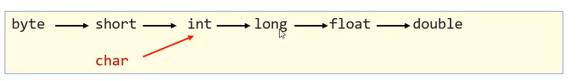

（1）当把存储范围小的值（常量值、变量的值、表达式计算的结果值）赋值给了存储范围大的变量时，就会进行自动类型提升。

```java
int i = 'A'; // char自动升级为int，其实就是把字符的编码值赋值给i变量了
double d = 10; // int自动升级为double
long num = 1234567; // 右边的整数常量值如果在int范围呢，编译和运行都可以通过，这里涉及到数据类型转换
//byte bigB = 130; // 错误，右边的整数常量值超过byte范围
long bigNum = 12345678912L; // 右边的整数常量值如果超过int范围，必须加L，显式表示long类型，否则编译不通过
```

（2）当存储范围小的数据类型与存储范围大的数据类型变量一起混合运算时，会按照其中最大的类型运算。

```java
int i = 1;
byte b = 1;
double d = 1.0;
double sum = i + b + d; // 混合运算，升级为double
```

（3）当byte,short,char数据类型的变量**进行算术运算**时，**自动升级为int类型处理**。

```java
byte b1 = 1;
byte b2 = 2;
byte b3 = b1 + b2; // 编译报错，b1 + b2自动升级为int

char c1 = '0';
char c2 = 'A';
int i = c1 + c2; // 至少需要使用int类型来接收
System.out.println(c1 + c2); // 113 
```

### 3.2 强制类型转换

**规则：将取值范围大的类型强制转换成取值范围小的类型。**

**转换格式：**

```java
数据类型1 变量名 = (数据类型1) 被强转数据值;
```

注意：当把存储范围大的值强制转换为存储范围小的变量时，可能会`损失精度`或`溢出`。

```java
int i = (int) 3.14; // 损失精度

int i = 200;
byte b = (byte) i; // 溢出
```

### 3.3 基本数据类型与String的运算

（1）任意八种基本数据类型与String类型只能进行连接`+`运算，即进行字符串拼接，且结果一定也是String类型

```java
System.out.println("" + 1 + 2); // 12

int num = 10;
boolean b1 = true;
String s1 = "abc";

String s2 = s1 + num + b1;
System.out.println(s2); // abc10true

//String s3 = num + b1 + s1; // 编译不通过，因为int类型不能与boolean运算
String s4 = num + (b1 + s1); // 编译通过

System.out.println('a'+ 1 + "Hello!"); // 98Hello!
```

（2）String类型不能通过强制类型转换转为其他的类型

```java
String str = "123";
int num = (int) str; // 报错

int num = Integer.parseInt(str); // 正确
```

## 4. 运算符（Operator）

- 算术运算符：`+ - * / % ++ --`
- 赋值运算符：`= += -= *= /= %= >>= <<= >>>= &= |= ^=`
- 比较运算符：`> >= < <= == !=`
- 逻辑运算符：`& | ^ ! && ||`
- 位运算符：`& | ^ ~ << >> >>>`
- 条件运算符：`(条件表达式) ? 结果1 : 结果2`
- Lambda运算符：`->`

### 4.1 算术运算符

- `/`：两个整数相除，结果也是一个整数
- `%`：`a % b`结果的符号与`a`的符号相同
- `++`运算符举例：

```java
int m = 2;
m = m++;
/**
 * 1. 先取m的值“2”放操作数栈
 * 2. m再自增, m=3
 * 3. 再把操作数栈中的"2"赋值给m, m=2
 */
System.out.println(m); // 2
```

### 4.2 赋值运算符

- 赋值运算符`=`支持连续赋值
- 扩展的赋值运算符**隐含了强制类型转换**。例如`a += b;`，底层代码形式为`a = (a的类型) (a + b);`

```java
问题1：下面的代码否有问题？
    byte x = 10;
    byte y = 30;
	x = x + y;  // 这句代码有问题，因为两个byte类型数据相加，会提升为int类型;
	
问题2：下面的代码是否有问题？
	byte x = 10;
	byte y = 30;
	x += y; // 这句代码没有问题，因为这里隐含了强制类型转换
	//x += y; 等价于 x = (byte) (x + y);
```

### 4.3 比较运算符

比较运算符也称为关系运算符，其结果都是boolean型。

- `> < >= <=`：只适用于基本数据类型（除boolean类型）
- `== !=`：适用于基本数据类型和引用数据类型
- 还有一个特殊的比较运算符`instanceof`，可以检查是否是类的对象。例如`"Hello" instanceof String`的结果是`true`

### 4.4 逻辑运算符

逻辑运算符，操作的**都是boolean类型**的变量或常量，而且运算得结果也是boolean类型的值。

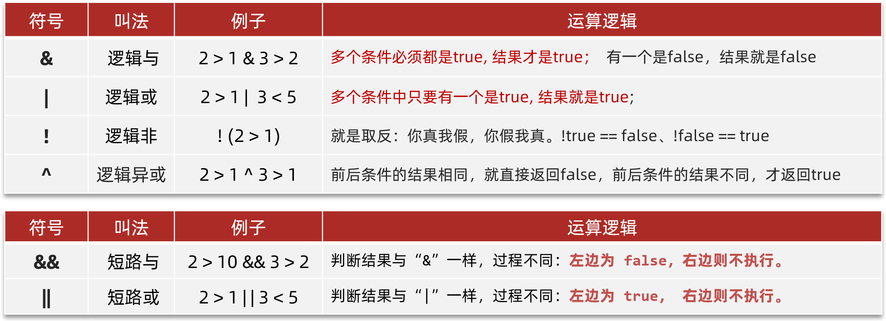

### 4.5 位运算符

位运算符的运算过程都是基于二进制的**补码**运算


### 4.6 条件运算符

```java
(条件表达式) ? 结果1 : 结果2
```

### 4.7 运算符优先级

> 注意：上一行中的运算符总是优先于下一行的

1. 括号：`() [] {}`
2. 正负号：`+ -`
3. 单目运算符：`++ -- ~ !`
4. 乘法、除法、求余：`* / %`
5. 加法、减法：`+ -`
6. 移位运算符：`>> << >>>`
7. 比较运算符：`< <= >= > instanceof`
8. 比较运算符：`== !=`
9. 按位与：`&`
10. 按位异或：`^`
11. 按位或：`|`
12. 条件与：`&&`
13. 条件或：`||`
14. 三元运算符：`(条件表达式) ? 结果1 : 结果2`
15. 赋值运算符：`= += -= *= /= %=`
16. 位赋值运算符：`&= |= <<= >>= >>>=`

## 5. 流程控制语句

### 5.1 分支语句

#### if

#### switch

- switch(表达式)中表达式的值必须是下述几种类型之一：`byte`，`short`，`char`，`int`，`枚举`，`String`；
- case子句中的值必须是**常量**，不能是变量名或不确定的表达式值或范围；
- 同一个switch语句，所有case子句中的**常量值互不相同**；
- 正常使用switch的时候，不要忘记写break，否则会出现**穿透现象**。
- default子句是可选的。同时，位置也是灵活的。**当没有匹配的case时，执行default语句**。

### 5.2 循环语句

#### for

#### while

#### do-while

### 5.3 break和continue

**带标签的使用方法**：break或continue语句出现在多层嵌套的循环语句块中时，可以通过标签指明要终止/跳过的是哪一层语句块。注意，标号语句必须紧接在循环的头部，且标号语句不能用在非循环语句的前面。

```java
label1: {   ……        
label2:	     {   ……
label3:			 {   ……
                        break label2;
                        ……
                    }
                }
        } 
```

举例：

```java
class BreakContinueTest2 {
	public static void main(String[] args) {
		l:for(int i = 1;i <= 4;i++){
		
			for(int j = 1;j <= 10;j++){
				if(j % 4 == 0){
					//break l;
					continue l;
				}
				System.out.print(j);
			}
			System.out.println();
		}
	}
}
```

## 6. Scanner类

### 6.1 Scanner简介

使用Scanner类可以从键盘获取不同类型（基本数据类型、String类型）的变量。使用步骤如下：

1. 导包：`import java.util.Scanner;`
2. 创建Scanner类型的对象：`Scanner scan = new Scanner(System.in);`
3. 调用Scanner类的相关方法来获取指定类型的变量，如`next()`、`nextXxx()`
4. 释放资源：`scan.close();`

> 注1：需要根据相应的方法，来输入指定类型的值。如果输入的数据类型与要求的类型不匹配时，会报异常导致程序终止。
>
> 注2：System、String在JDK中的Java.lang包下，lang包不需要我们导包，是默认的包。

### 6.2 Scanner的使用案例

```java
// 1. 导包
import java.util.Scanner;

public class ScannerTest1 {
    public static void main(String[] args) {
        // 2. 创建Scanner的对象，System.in默认代表键盘输入
        Scanner scanner = new Scanner(System.in);
        
        // 3. 根据提示，调用Scanner的方法，获取不同类型的变量
        System.out.print("请输入你的网名：");
        String name = scanner.next();

        System.out.print("请输入你的年龄：");
        int age = scanner.nextInt();

        System.out.print("请输入你的体重：");
        double weight = scanner.nextDouble();

        System.out.print("你是否单身（true/false)：");
        boolean isSingle = scanner.nextBoolean();

        System.out.print("请输入你的性别：");
        char gender = scanner.next().charAt(0);
        
        // 4. 关闭资源
        scanner.close();
    }
}
```

## 7. 随机数

### 7.1 Math类生成随机数

调用`Math.random()`会返回一个`[0,1)`范围内的double型随机值。所以如果想生成`[a,b]`范围内的随机整数，可以使用：

```java
(int)(Math.random() * (b - a + 1)) + a
```

### 7.2 Random类生成随机数

Random类下的`nextInt(n)`方法能生成`0`至`n-1`之间的随机数，不包含`n`。使用方式如下：

```java
public class RandomDemo1 {
    public static void main(String[] args) {
        // 创建一个Random对象，用于生成随机数。
        Random r = new Random();
        // 调用Random提供的功能：nextInt得到随机数。
        for (int i = 1; i <= 20; i++) {
            int data = r.nextInt(10); // 0 - 9
            System.out.println(data);
        }
    }
}
```

如果想生成`[M, N]`之间的随机整数，有两种方案：

```java
// 方案一：
Random r = new Random();
int ans = r.nextInt(N - M + 1) + M;

// 方案二：直接调用r.nextInt(a, b)来生成[a, b)之间的随机整数
ans = r.nextInt(M, N + 1);
```

## 8. 数组

### 8.1 数组简介

数组(Array)，是多个相同类型数据按顺序排列的集合。数组的特点如下：

- 数组本身是`引用数据类型`，而数组中的元素可以是`任何数据类型`，包括基本数据类型和引用数据类型。
- 创建数组对象会在内存中开辟一整块`连续的空间`。占据的空间的大小，取决于数组的长度和数组中元素的类型。
- 数组一旦初始化完成，其长度就是确定的，`无法修改`。
- 可以直接通过下标(索引)的方式访问数组中指定位置的元素，速度很快。
- 数组名中引用的是这块连续空间的首地址。

### 8.2 一维数组

#### 1、声明

```java
int[] arr1; // 推荐
int arr2[]; // 不推荐
```

> 数组的声明需要明确：数组的维度(一个`[]`表示一维)、元素的类型、数组名。
>
> 注意：Java语言中声明数组时不能指定其长度，例如`int a[5];`是非法的

#### 2、静态初始化

如果数组变量的初始化和数组元素的赋值操作同时进行，那就称为静态初始化。静态初始化，本质是**用静态数据（编译时已知）为数组初始化**，此时数组的长度由静态数据的个数决定。

```java
// 方式1
int[] arr1 = new int[]{1, 2, 3};
// 方式2
int[] arr2;
arr2 = new int[]{1, 2, 3};
// 方式3
int[] arr3 = {1, 2, 3}; // 必须在一个语句中完成，不能分成两个语句写
```

#### 3、动态初始化

数组变量的初始化和数组元素的赋值操作分开进行，即为动态初始化。动态初始化中，**只确定了元素的个数**（即数组的长度），而**元素值此时只是默认值**，还并未真正赋自己期望的值。真正期望的数据需要后续单独一个一个赋值。

```java
// 方式1
int[] arr1 = new int[3];
// 方式2
int[] arr2;
arr2 = new int[3];
```

使用动态初始化定义数组时，根据元素类型不同，默认值也有所不同：

- byte、short、char、int、long的默认值是0
- float、double的默认是值0.0
- boolean的默认是是false
- 引用数据类型的默认值是null

#### 4、其他性质

（1）直接打印数组名，并不会打印数组的真实内容

```java
System.out.println(arr2); // [I@4eec7777
```

（2）静态初始化和动态初始化数组的写法是独立的，不可以混用。如下写法是错误的：

```java
int[] arr = new int[3]{30，40, 50};
```

（3）数组的长度可以用 `arr.length` 获取

（4）数组的元素也可以是引用数据类型，此时称为**对象数组**。注意创建对象数组，首先要创建数组对象本身，即确定数组的长度，然后再创建每一个元素对象，如果不创建，数组的元素的默认值就是null。

### 8.3 一维数组内存分析

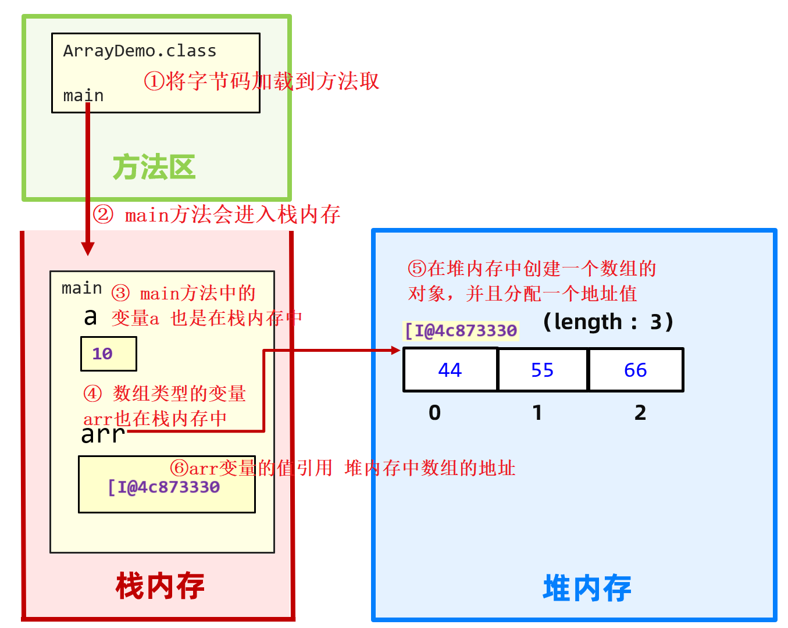

**举例(多个变量指向同一数组)**：

```java
public static void main(String[] args) {
    int[] arr1 = {11, 22, 33};
    // 把int类型的数组变量arr1赋值给int类型的数组变量arr2
    int[] arr2 = arr1;

    System.out.println(arr1); // [I@4eec7777
    System.out.println(arr2); // [I@4eec7777

    arr2[1] = 99;
    System.out.println(arr1[1]); // 99

    arr2 = null; // 拿到的数组变量中存储的值是null
    System.out.println(arr2); // null
    System.out.println(arr1); // [I@4eec7777
}
```

**总结：**

- 两个变量指向同一个数组时，两个变量记录的是同一个地址值。
- 当一个变量修改数组中的元素时，另一个变量去访问数组中的元素，元素已经被修改过了。
- 如果某个数组变量存储的地址是null，那么该变量将不再指向任何数组对象，此时只能打印出`null`，但无法获得`length`等属性

### 8.4 多维数组

#### 1、声明

Java语言里提供了支持多维数组的语法。二维数组，可以认为其每个元素都是个一维数组。其实，从数组底层的运行机制来看并没有多维数组。

```java
int[][] arr1; // 推荐
int arr2[][]; // 不推荐
int[] arr3[]; // 不推荐
```

面试题：

```java
// 以下x是一维数组，y是二维数组
int[] x, y[];
```

#### 2、静态初始化

```java
// 方式1
int[][] arr = new int[][]{{3,8,2},{2,7},{9,0,1,6}};
```

以上定义了一个名称为arr的二维数组，二维数组中有三个一维数组，其中每一个一维数组中具体元素也都已初始化：

- 第一个一维数组 `arr[0] = {3,8,2};`
- 第二个一维数组 `arr[1] = {2,7};`
- 第三个一维数组 `arr[2] = {9,0,1,6};`

> 获取第三个一维数组的长度：`arr[2].length;`

其他类似方式：

```java
// 方式2
int[][] arr2;
arr = new int[][]{{1,2,3},{4,5,6},{7,8,9,10}};
// 方式3
int[][] arr3 = {{1,2,3},{4,5,6},{7,8,9,10}}; // 必须一句完成
```

#### 3、动态初始化

动态初始化方式分为两种格式：

**格式1：规则二维数组，即每一行的列数是相同的**

```java
// 1. 确定行数和列数
int[][] arr = new int[m][n];
	// m表示这个二维数组有多少个一维数组
	// n表示每一个一维数组的元素有多少个
    // 此时数组的行数和列数已经确定，且元素也都有默认值
// 2. 然后再为元素赋值
```

**格式2：不规则二维数组，即每一行的列数不一样**

```java
// 1. 先确定总行数m
int[][] arr = new int[m][];
    // 此时只是确定了总行数，每一行里面现在是null

// 2. 再确定每一行的列数，每一行都创建一维数组
arr[0] = new int[n1];
arr[1] = new int[n2];
...
    // 此时已经new完的行的元素就有默认值了，没有new的行还是null

// 3. 最后再为元素赋值
```

注意：`int[][] arr = new int[][3];`是非法的。

## 9. Arrays工具类

java.util.Arrays类即为操作数组的工具类，包含了用来操作数组的各种**静态方法**。 

### 9.1 数组转字符串

- `String toString(T[] a)`：将数组a转换为字符串的形式，字符串内容为`[元素1, 元素2, ...]`，其中T可以是基本数据类型或者Object

### 9.2 数组排序

- `void sort(T[] a)`：将a数组按照升序排序(快速排序)
- `void sort(T[] a, int beg, int end)`：将a数组的`[beg, end)`部分升序排序(快速排序)
- `void sort(T[] a, Comparator c)`：将a数组按照比较器指定的顺序进行排序(快速排序)
- `void sort(T[] a, int beg, int end, Comparator c)`：将a数组的`[beg, end)`部分按照比较器指定的顺序进行排序(快速排序)

### 9.3 数组二分查找

- `int binarySearch(T[] a, T key)`：要求数组有序，在数组中查找key是否存在，如果存在则返回其下标，如果不存在则返回负数。注意，如果数组中存在多个相同的key，则返回的下标是未知的。

### 9.4 数组的复制

- `T[] copyOf(T[] original, int newLength)`：根据original原数组复制得到一个长度为newLength的新数组，并返回这个新数组的引用。注意，如果newLength与原数组的长度不同，则会直接截断或者填上默认值。
- `T[] copyOfRange(T[] original, int from, int to)`：复制原数组的`[from,to)`得到一个新数组并返回

### 9.5 比较数组内容是否相同

- `boolean equals(T[] a, T[] a2)`：比较两个数组的长度、元素是否完全相同

### 9.6 填充数组

- `void fill(T[] a, T val)`：将数组a的每个元素赋值为val
- `void fill(T[] a, int beg, int end, T val)`：将数组a的`[beg, end)`中的每个元素赋值为val

### 9.7 批量修改数组内容

- `void setAll(T[] a, IntFunction generator)`：对数组a中的每个元素进行`array[i] = generator.apply(i);`的赋值操作，其中i是索引。

举例：

```java
double[] prices = {99.8, 128, 100};
Arrays.setAll(prices, i -> prices[i] * 10.0);
System.out.println(Arrays.toString(prices)); // [998.0, 1280.0, 1000.0]
```

# 第03章_面向对象编程(基础)

## 1. 面向对象编程概述

### 1.1 简介

类(Class)和对象(Object)是面向对象的核心概念：

- **类**：具有相同特征的事物的抽象描述，是**抽象的**、概念上的定义。
- **对象**：实际存在的该类事物的每个个体，是**具体的**，因而也称为**实例**(instance) 。

类，是一组相关属性和行为的集合，这也是类最基本的两
个成员。成员变量(属性，field)，成员方法(方法，method)。

**补充(匿名对象)**：我们也可以不定义对象的句柄，而直接调用这个对象的方法，这样的对象叫做匿名对象，如`new Person().shout();`我们经常将匿名对象作为实参传递给一个方法调用。

### 1.2 Java面向对象的核心知识

**面向对象的特征：封装、继承、多态、（抽象）**

**Java类的成员：属性、方法、构造器、代码块、内部类**

### 1.3 对象的内存解析

`Student s1 = new Student();`这句代码的底层原理如下：

- `Student s1`表示的是在栈内存中，创建了一个Student类型引用的变量，变量名为s1
- 而`new Student()`会在堆内存中创建一个对象，对象中包含学生的属性名和属性值，同时系统会为这个Student对象分配一个地址值`0x4f3f5b24`
- 接着把对象的地址赋值给栈内存中的变量s1，通过s1记录的地址就可以找到这个对象
- 当执行`s1.name="播妞"`时，其实就是通过s1找到对象的地址，再通过对象找到对象的name属性，再给对象的name属性赋值为`播妞`

直接打印对象名和数组名都会显示`类型@对象的hashCode值`，所以说类、数组都是引用数据类型，引用数据类型的变量中存储的是对象的地址，或者说指向堆中对象的首地址。

> 注：当堆内存中的对象，没有被任何变量引用时，就会被判定为内存中的垃圾。Java存在自动垃圾回收机制，会自动清除掉垃圾对象，程序员不用操心，注意只有在堆内存和方法区中有GC。

## 2. 类的成员之一：成员变量(field)

**成员变量和局部变量的区别**：

- 类中位置不同：成员变量在类中，方法外；而局部变量在方法内。
- 初始化值不同：实例变量有默认值；而局部变量没有默认值，使用之前必须显式赋值。
- 内存位置不同：实例变量在堆内存中；局部变量在栈内存中。
- 作用域不同：实例变量作用域是整个对象；而局部变量作用域是在所归属的大括号中。
- 生命周期不同：实例变量与对象共存亡；而局部变量随着方法的调用而生，随着方法的运行结束而亡。

## 3. 类的成员之二：成员方法(method)

### 3.1 方法声明和调用

```java
[修饰符] 返回值类型 方法名(形参列表) [throws 异常列表] {
    方法体
}
```

Java里的方法不能独立存在，所有的方法必须定义在类里。一个完整的方法包含方法签名和方法体。方法的修饰符有很多，如public、protected、private、static、abstract、native、final、synchronized等。

**注意事项**：

1. 形参不能给初始化值。
2. 如果返回值类型不是void，方法体中必须保证一定有 `return 返回值;` 语句，并且要求该返回值结果的类型与声明的返回值类型一致或兼容。
3. 如果返回值类型为void，方法体中可以没有return语句，如果要用return语句提前结束方法的执行，那么return后面不能跟返回值，直接写`return ;`即可。
4. 如果一个return语句之后的区域必然不可达，那么就不能在该return语句之后写代码，否则会报错：Unreachable code
5. 方法在类中没有先后顺序。
6. 方法不调用就不会执行，调用方法时，传给方法的数据，必须严格匹配方法的参数情况。

### 3.2 方法调用内存分析

- 方法**没有被调用**的时候，都在**方法区**中存储。
- 方法**被调用**的时候，需要进入到**栈内存**中运行。方法每调用一次就会在栈中有一个**入栈**动作，即给当前方法开辟一块独立的栈帧。
- 当方法执行结束后，会释放该栈帧，称为**出栈**，如果方法有返回值，就会把结果返回调用处，如果没有返回值，就直接结束，回到调用处继续执行下一条指令。

### 3.3 方法重载（overload）

方法重载：在同一个类中，允许存在一个以上的同名方法，只要它们的参数列表不同即可(参数列表不同，意味着**参数个数或参数类型不同**)

JVM调用重载方法的规则：

- 先找个数、类型最匹配的
- 再找个数和类型可以兼容的，如果同时多个方法可以兼容将会报错

下面案例中有多个test方法，但是参数列表都不一样，它们都是重载的方法，调用时只需要通过参数来区分即可。

```java
public class MethodOverLoadDemo1 {
    public static void main(String[] args) {
        test();
        test(100);
    }

    public static void test(){
        System.out.println("===test1===");
    }

    public static void test(int a){
        System.out.println("===test2===" + a);
    }

    void test(double a){
    }

    void test(double a, int b){
    }

    void test(int b, double a){
    }

    int test(int a, int b){
        return a + b;
    }
}
```

**面试题**：`println`有一个特殊的重载，参数为`char[]`，从而使得打印`char[]`数组时能够打印其具体内容，如下所示：

```java
int[] arr1 = {1, 2, 3};
System.out.println(arr1); // [I@4eec7777
char[] arr2 = {'a', 'b', 'c', 'd'};
System.out.println(arr2); // abcd
```

### 3.4 可变个数的参数

当定义一个方法时，如果形参的类型可以确定，但是形参的个数不确定，那么可以考虑使用可变个数的形参。格式：`方法名(参数类型 ... 参数名)`

**注意**：

- 可变参数部分指定类型的参数个数是可变多个：0个，1个或多个，也可以传一个数组给它
- 可变个数形参的方法与同名的方法之间，可以彼此构成重载
- 可变参数方法的使用与方法参数部分使用数组是一致的，二者不能同时声明，否则报错。因为**可变参数在方法内部，本质上就是一个数组**。
- 方法的参数部分有可变形参，需要放在形参声明的最后。
- 在一个方法的形参中，最多只能声明一个可变个数的形参。

```java
public class ParamTest{
    public static void main(String[] args) {
        test(); // 0 []
        test(10, 20, 30); // 3 [10, 20, 30]
        int[] arr = new int[]{10, 20, 30, 40};
        test(arr); // 4 [10, 20, 30, 40]
    }

    // 以下方法本质上就是 test(int[] nums)
    public static void test(int ... nums){
        // 可变参数在方法内部，本质上是一个数组
        System.out.println(nums.length);
        System.out.println(Arrays.toString(nums));
    }
}
```

### 3.5 Java中方法的参数传递机制：值传递

Java里方法的参数传递方式只有一种：**值传递**。即将**实际参数值**的副本传入方法内，而参数本身不受影响。

- 形参是基本数据类型：将实参基本数据类型变量中存储的**数据值**复制传递给形参
- 形参是引用数据类型：将实参引用数据类型变量中存储的**地址值**复制传递给形参

举例：数组拷贝

```java
// 注意：int[] arr2 = arr; 这个不是拷贝数组，而是把数组变量赋值给另一个数组变量。
public static int[] copy(int[] arr){
    // 1、创建一个长度一样的整型数组出来。
    int[] arr2 = new int[arr.length];
    // 2、把原数组的元素值对应位置赋值给新数组。
    for (int i = 0; i < arr.length; i++) {
        arr2[i] = arr[i];
    }
    return arr2;
}
```

## 4. 关键字：package、import

### 4.1 package

package，称为包，用于指明该文件中定义的类、接口等结构所在的包。语法格式如下：

```java
package 顶层包名.子包名;
```

- 一个源文件只能有一个声明包的package语句
- package语句作为Java源文件的第一条语句出现。若缺省该语句，则指定为无名包。
- 包名，属于标识符，满足标识符命名的规则和规范（全部小写）
  - 包通常使用所在公司域名的倒置：`com.atguigu.xxx`
  - 取包名时不要使用`java.xxx` 
- 包对应于文件系统的目录，package语句中用`.`来指明包(目录)的层次，每`.`一次就表示一层文件目录
- 同一个包下可以声明多个结构（类、接口），但是不能定义同名的结构（类、接口）；不同的包下可以定义同名的结构（类、接口）。

**JDK中主要的包有**：

- `java.lang`：包含一些Java语言的核心类，如String、Math、Integer、System、Thread
- `java.net`：包含执行与网络相关的操作的类和接口
- `java.io`：包含能提供多种输入/输出功能的类
- `java.util`：包含一些实用工具类，如定义系统特性、接口的集合框架类、使用与日期日历相关的函数
- `java.text`：包含了一些java格式化相关的类
- `java.sql`：包含了java进行JDBC数据库编程的相关类/接口
- `java.awt`：包含了构成抽象窗口工具集的多个类，这些类被用来构建和管理应用程序的图形用户界面(GUI)

### 4.2 import

为了使用定义在其它包中的Java类，需用import语句来显式引入指定包下所需要的类，相当于import语句告诉编译器到哪里去寻找这个类。语法格式如下：

```java
import 包名.类名;
```

**注意事项**：

- import语句，声明在包的声明和类的声明之间。
- 如果需要导入多个类或接口，那么就并列显式多个import语句即可
- 如果使用`a.*`导入结构，表示可以导入a包下的所有的结构。
- 如果导入的类或接口是`java.lang`包下的，或者是当前包下的，则可以省略此import语句。
- 如果已经导入`java.a`包下的类，那么如果需要使用a包的子包下的类的话，仍然需要导入。
- 如果在代码中使用不同包下的同名的类，那么就需要使用类的全类名的方式指明调用的是哪个类。例如 
    ```java
    java.util.Date date1 = null;
    java.sql.Date date2 = new java.sql.Date(666);
    ```
- import static组合使用，可以调用指定类或接口下的静态的属性或方法

## 5. 面向对象特征一：封装(encapsulation)

### 5.1 封装性简介

面向对象的开发原则要遵循**高内聚、低耦合**。高内聚、低耦合是软件工程中的概念，也是UNIX操作系统设计的经典原则。内聚，指一个模块内各个元素彼此结合的紧密程度；耦合指一个软件结构内不同模块之间互连程度的度量。内聚意味着重用和独立，耦合意味着多米诺效应牵一发动全身。

- 高内聚：类的内部数据操作细节自己完成，不允许外部干涉
- 低耦合：仅暴露少量的方法给外部使用，尽量方便外部调用

**封装**：就是把客观事物封装成抽象概念的类，并且类可以把自己的数据和方法只向可信的类或者对象开放，向没必要开放的类或者对象隐藏信息。封装性的设计思想通俗来讲，就是**合理隐藏、合理暴露**。

### 5.2 权限修饰符

实现封装就是控制类或成员的可见性范围，这就需要依赖访问控制修饰符，也称为权限修饰符。每一种权限修饰符能够被访问的范围如下：

|修饰符   |本类内部|本包内|其他包的子类|其他包非子类|
|---------|-------|-----|-----------|-----------|
|private  |√      |×    |×          |×          |
|缺省     |√      |√    |×          |×          |
|protected|√      |√    |√          |×          |
|public   |√      |√    |√          |√          |

**可以修饰的结构**：

- 外部类：只能使用`public`、`缺省`修饰。**因此外部类要跨包使用必须是public**，否则仅限于本包使用。
- 成员变量、成员方法、构造器、成员内部类：`public`、`protected`、`缺省`、`private`

### 5.3 封装性的体现

**（1）成员变量私有化**：我们一般私有化类的成员变量，提供公共的get和set方法来对外暴露获取和修改属性的功能。这样做的好处是：

- 让使用者只能通过事先预定的方法来访问数据，从而可以在该方法里面加入控制逻辑，限制对成员变量的不合理访问。
- 便于内部进行修改，如果其对外可以的访问方式不变的话，外部根本感觉不到它的修改。

**（2）成员方法私有化**：类中不需要对外暴露的方法，也可以进行私有化。

**（3）构造器私有化**：单例模式中将构造器设置为private，从而避免在类的外部创建实例。

**注意**：

- 开发中，一般成员实例变量都习惯使用private修饰，再提供相应的public权限的get/set方法访问。
- 对于final的实例变量，不提供set()方法。
- 对于static final的成员变量，习惯上使用public修饰。

## 6. 类的成员之三：构造器(constructor)

**通过new关键字创建对象**的时候就会执行构造器。构造器的语法如下：

```java
[修饰符] class 类名 {
    [修饰符] 构造器名() {
        // 实例初始化代码
    }
    [修饰符] 构造器名(参数列表) {
        // 实例初始化代码
    }
}
```

**特点**：

- **构造器名必须与它所在的类名必须相同**，它没有返回值，也不能写void，且不能有return语句。
- 构造器的修饰符只能是**权限修饰符**，不能被其他任何修饰。比如，不能被static、final等修饰。
- 构造器是可以重载的。

**注意**：

- 当我们没有显式地声明类中的构造器时，系统会**默认提供一个无参的构造器**，并且该构造器的修饰符默认与类的修饰符相同。
- 当我们显式地定义类的构造器以后，系统就不再提供默认的无参的构造器了。此时如果没有定义无参构造器，建议自己加一个无参构造器。

## 7. 补充

### 7.1 实体类

**实体类仅仅只是用来封装数据用的**，它符合如下标准：

- 类是公共的
- 有一个无参的公共的构造器
- 属性(权限private)有对应的get、set方法

### 7.2 UML类图

UML（Unified Modeling Language，统一建模语言），是用来描述软件模型和架构的图形化语言。在软件开发中，使用UML类图可以更加直观地描述类内部结构以及类之间的关系。

- `+`表示public类型，`-`表示 private 类型，`#`表示protected类型
- 方法的格式: 
    ```java
    权限(+、-)方法名(参数名 : 参数类型) : 返回值类型
    ```
- 斜体表示抽象方法或类

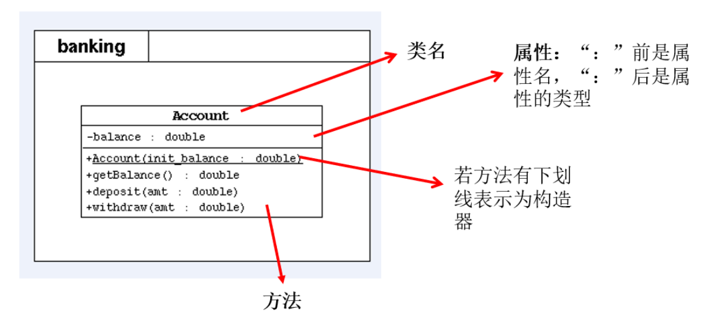


# 第04章_面向对象编程(进阶)

## 1. 关键字：this

### 1.1 this是什么

this在**非static的方法**内部使用，表示调用该方法的对象。this在构造器内部使用，表示该构造器正在初始化的对象。

在底层，哪一个对象调用方法，该方法栈帧中的局部变量表会默认地添加一个this参数，然后**把该对象的地址值传入this**。

this可以调用的结构有：**成员变量、成员方法和构造器**

### 1.2 this调用成员变量/方法

在**实例方法或构造器**中，使用当前类的成员变量或成员方法可以在其前面添加this，只不过我们通常都习惯省略this。

但是，当形参与成员变量同名时，如果需要使用成员变量，必须添加this来表明该变量是类的成员变量。即，我们可以用this来区分`成员变量`和`局部变量`。

> 注意：使用this访问属性和方法时，如果在本类中未找到，**会继续从父类中查找**。

### 1.3 this调用构造器

this可以作为一个类中构造器相互调用的特殊格式：

- `this()`：调用本类的无参构造器
- `this(实参列表)`：调用本类的有参构造器

**注意**：

- 不能出现递归调用。比如，调用自身构造器。
- `this()`和`this(实参列表)`只能**声明在构造器首行**。

```java
public class Student {
    private String name;
    private int age;

    public Student() {

    }
    public Student(String name) {
        this(); // 调用本类无参构造器
        this.name = name;
    }
    public Student(String name,int age){
        this(name); // 调用本类中有一个String参数的构造器
        this.age = age;
    }
}
```

## 2. 面向对象特征二：继承(Inheritance)

### 2.1 继承的语法

通过`extends`关键字，可以声明一个类B继承另外一个类A，定义格式如下：

```java
[修饰符] class 类B extends 类A {
	...
}
```

- 类B，称为子类、派生类(derived class)、SubClass
- 类A，称为父类、超类、基类(base class)、SuperClass

**继承的优点**：

- 减少了代码冗余，提高了代码的复用性。
- 有利于功能的扩展。
- 为多态的使用提供了前提。

### 2.2 继承的特点

**1、子类会继承父类所有的实例变量和实例方法**

- 当子类对象被创建，在堆中给对象申请内存时，子类和父类的实例变量都要分配内存。
- 当子类对象调用方法时，编译器会先在子类模板中看该类是否有这个方法，如果没找到，会继续看它的父类是否声明了这个方法，遵循`从下往上`找的顺序，找到了就停止，一直到根父类都没有找到，就会报编译错误。

**2、子类不能访问父类中私有的成员变量和方法**

子类虽然会继承父类私有(private)的成员变量，但子类不能对继承的私有成员变量进行访问，可以通过继承的get/set方法进行访问。

**3、Java支持多层继承**

```java
class A{}
class B extends A{}
class C extends B{}
```

> 说明：顶层父类是Object类。如果某个类没有extends别的类，则默认继承Object类。

**4、Java类只支持单继承(Java类只能继承一个类)，即不能有多个直接父类**

### 2.3 方法重写(override)

子类可以对从父类中继承来的方法进行改造，我们称为方法的`重写(override、overwrite)`，也称为方法的`覆盖`。

> @Override注解：标注在方法上面，让编译器检测是不是满足重写方法的要求。这个注解就算不写，只要满足要求，也是正确的方法重写。但我们建议保留，这样编译器可以帮助我们检查格式，另外也可以让阅读源代码的程序员清晰的知道这是一个重写的方法。


```java
class A {
    public void print1(){
        System.out.println("111");
    }
    public void print2(){
        System.out.println("222");
    }
}
class B extends A{
    // 以下是方法重写
    @Override 
    public void print1(){
        System.out.println("666");
    }
    // 以下是方法重载
    public void print2(int a) {
        System.out.println("222" + a);
    }
}
```

**方法重写的要求**：

（1）子类重写的方法必须和父类被重写的方法具有相同的`方法名称`、`参数列表`。

（2）子类重写的方法的返回值类型`不能大于`父类被重写的方法的返回值类型。（例如`String < Object`）

> 注意：如果返回值类型是基本数据类型和void，那么必须是相同的

（3）子类重写的方法的访问权限`不能小于`父类被重写的方法的访问权限。（public > protected > 缺省 > private）

> 注意：父类私有方法、静态方法不能被重写；跨包的父类缺省方法也不能被重写

（4）对于编译时异常，子类方法抛出的异常不能大于父类被重写方法的异常。(**对于运行时异常则没有要求**)

**注意：子类与父类中同名同参数的方法必须同时声明为非static的(即为重写)，或者同时声明为static的（不是重写）**。因为static方法是属于类的，子类无法覆盖父类的static方法。

## 3. 关键字：super

### 3.1 super是什么

使用super可以调用父类中的指定操作：

- super可用于访问父类中定义的属性、成员方法
- super可用于在子类构造器中调用父类的构造器

注意：

- 尤其当子父类出现同名成员时，可以用super表明调用的是父类中的成员
- super的追溯不仅限于直接父类

例题：

```java
public class Test {
    public static void main(String args[]) {
        Father f = new Father();
        Son s = new Son();
        System.out.println(f.getInfo()); // atguigu
        System.out.println(s.getInfo()); // atguigu
        s.test(); // atguigu atguigu
        System.out.println("------------");
        s.setInfo("大硅谷");
        System.out.println(f.getInfo()); // atguigu
        System.out.println(s.getInfo()); // 大硅谷
        s.test(); // 大硅谷 大硅谷
    }
}
class Father {
    private String info = "atguigu";
    public void setInfo(String info) {
        this.info = info;
    }
    public String getInfo() {
        return info;
    }
}
class Son extends Father{
    private String info = "尚硅谷";
    public void test() {
        System.out.println(this.getInfo());
        System.out.println(super.getInfo());
    }
}
```

### 3.2 super调用父类方法

- 如果子类没有重写父类的方法，只要权限修饰符允许，在子类中完全可以直接调用父类的方法
- 如果子类重写了父类的方法，在子类中需要通过`super.`才能调用父类被重写的方法，否则默认调用的是子类自己重写的方法

**总结**：

- 不使用`super`和`this`调用方法，则先从**调用者的类**找匹配方法，如果没找到则继续向上追溯，在父类中找匹配方法
- 使用`this`调用方法，则先从**调用者的类**找匹配方法，如果没找到则继续向上追溯，在父类中找匹配方法
- 使用`super`调用方法，则先从**调用者的直接父类**找匹配方法，如果没找到则继续向上追溯

### 3.3 super访问父类属性

- 如果父子类实例变量没有重名，只要权限修饰符允许，在子类中完全可以直接访问父类中声明的实例变量
- 如果子类实例变量和父类实例变量重名，并且父类的该实例变量在子类仍然可见。那么在子类中想要访问父类声明的实例变量就必须使用`super.`，否则默认访问的是子类自己声明的实例变量

**总结**：

- 不使用`super`和`this`访问变量，则先找局部变量，再找**当前执行代码的本类**的成员变量，再向上追溯找父类
- 使用`this`访问变量，则先找**当前执行代码的本类**的成员变量，再向上追溯找父类
- 使用`super`访问变量，则先找**当前执行代码的直接父类**的成员变量，再向上追溯

> 说明：应该避免子类声明和父类重名的成员变量

### 3.4 super调用父类构造器

**规则**：

1. 子类继承父类时，不会继承父类的构造器。只能在子类构造器中通过`super(形参列表)`的方式调用父类指定的构造器。
2. `super(形参列表)`，必须声明在构造器的首行。因此，在构造器的首行，`this(形参列表)`和`super(形参列表)`只能二选一。
3. 如果在子类构造器的首行没有显示调用其他构造器，则它默认调用`super();`，即调用父类中的空参构造器。
4. **因此我们在通过子类的构造器创建对象时，一定会先直接或间接地调用父类的构造器**，所以父类中声明的属性和方法也会加载到内存中。


## 4. 面向对象特征三：多态(Polymorphism)

### 4.1 多态性简介

对象的多态性，指的是父类的引用指向子类的对象。方法的多态性，指的是在运行时才能确定方法的入口地址。注意，**成员变量没有多态性**。

Java引用变量有两个类型：`编译时类型`和`运行时类型`。编译时类型由`声明`该变量时使用的类型决定，运行时类型由`实际赋给该变量的对象`决定。简称：**编译时，看左边；运行时，看右边**。若编译时类型和运行时类型不一致，就出现了多态性。

**多态的使用前提**：

1. 存在继承/实现关系
2. 存在方法的重写
3. 存在父类引用子类对象

举例：

```java
class People {
    public String name = "People";
    public void run() {
        System.out.println("人可以跑");
    }
}
class Teacher extends People{
    public String name = "Teacher";
    @Override
    public void run() {
        System.out.println("老师跑的贼慢");
    }
}
class Student extends People {
    public String name = "Student";
    @Override
    public void run() {
        System.out.println("学生跑的贼快");
    }
}
public class Test {
    public static void main(String[] args) {
        // 对象多态
        // 编译看左边(p1和p2都是People类型，但指向的对象类型不一样)
        People p1 = new Teacher();
        People p2 = new Student();
        // 行为多态
        // 运行看右边(run方法行为不一样)
        p1.run(); // 老师跑的贼慢
        p2.run(); // 学生跑的贼快
        // 成员变量没有多态(多态只有对象多态、行为多态)
        System.out.println(p1.name); // People
        System.out.println(p2.name); // People
    }
}
```

**多态的好处**：变量引用的子类对象不同，执行的方法就不同，实现动态绑定。代码编写更灵活、功能更强大，可维护性和扩展性更好了。

> 开发中，使用父类做方法的形参，是多态使用最多的场合。即使增加了新的子类，方法也无需改变，提高了扩展性，符合开闭原则(即软件系统中的各种组件能在不修改现有代码的基础上，引入新功能)。

**多态的弊端**：一个引用类型变量如果声明为父类的类型，但实际引用的是子类对象，那么该变量就不能再访问子类中添加的属性和方法。

### 4.2 多态的应用场景

#### 1、方法内局部变量的赋值体现多态

```java
public class Test {
    public static void main(String[] args) {
        // 编译看左边父类，只能调用父类声明的方法
        // 运行看右边子类，如果子类重写了方法，一定是执行子类重写的方法体
        People p1 = new Teacher();
        p1.run(); // 老师跑的贼慢
    }
}
```

#### 2、方法的形参声明体现多态

```java
public class Test {
    public static void main(String[] args) {
        Test test = new Test();
        // 形参是父类类型，实参是子类对象
        // 实际引用的对象类型不同，执行的run方法也不同
        test.peopleTest(new Teacher()); // People  老师跑的贼慢
    }
    public void peopleTest(People p) {
        System.out.println(p.name);
        p.run();
    }
}
```

#### 3、方法返回值类型体现多态

```java
public class Test {
    public static void main(String[] args) {
        Test test = new Test();
        People t = test.peopleTest("Teacher");
        t.run(); // 老师跑的贼慢
        System.out.println(t.name); // People
        People s = test.peopleTest("Student");
        s.run(); // 学生跑的贼快
        System.out.println(s.name); // People
    }
    // 返回值类型是父类类型，实际返回的是子类对象
    public People peopleTest(String type) {
        switch (type) {
            case "Teacher" :
                return new Teacher();
            default:
                return new Student();
        }
    }
}
```

### 4.3 向上转型与向下转型

#### 1、简介

一个对象在new的时候创建是哪个类型的对象，它从头至尾都不会变。即这个对象的**运行时类型永远不会变**。但是，把这个对象赋值给不同类型的变量时，这些变量的编译时类型却可能不同。

#### 2、向上转型

向上转型指的是在进行赋值操作时，左边的变量类型是右边的对象/变量类型的父类。注意，**向上转型是自动完成的**。

- 此时，编译时按照左边变量的类型处理，因此只能调用父类中有的变量和方法，不能调用子类特有的变量和方法
- 但是，**运行时，仍然是右边对象本身的类型**，所以执行的方法是子类重写的方法体

#### 3、向下转型

向下转型指的是在进行赋值操作时，左边的变量类型是右边的对象/变量类型的子类。注意，**向下转型需要使用强制类型转化**。

- 此时，编译时按照左边变量的类型处理，就可以调用子类特有的变量和方法了
- 不是所有通过编译的向下转型都是正确的，可能会发生ClassCastException，为了安全，建议通过instanceof关键字进行判断

#### 4、instanceof关键字

为了避免ClassCastException的发生，Java提供了`instanceof`关键字，给引用变量做类型的校验：

```java
// 检验对象a是否是类A的对象，返回值为boolean型
对象a instanceof 类A
```

**说明**：

- 只要用instanceof判断返回true的，那么强转为该类型就一定是安全的，不会报ClassCastException异常。
- 如果对象a属于类A的子类B，那么`a instanceof A`值也为true。
- 使用instanceof时，要求对象a所属的类与类A必须是子类和父类的关系(或者相同类)，否则编译错误。

举例：

```java
Object str = new String("123");
if (str instanceof String) {
    String s = (String) str; // 向下转型
    System.out.println(s);
}
```

### 4.4 经典例题

#### 练习1

```java
class Base {
    int count = 10;
    public void display() {
        System.out.println(this.count);
    }
}

class Sub extends Base {
    int count = 20;
    public void display() {
        System.out.println(this.count);
    }
}

public class Test {
    public static void main(String[] args){
        Sub s = new Sub();
        System.out.println(s.count); // 20
        s.display(); // 20
        Base b = s;
        System.out.println(b == s); // true
        System.out.println(b.count); // 10
        b.display(); // 20
    }
}
```

#### 练习2-1

```java
public class Test {
    public static void main(String[] args) {
        Base base = new Sub();
        base.add(1, 2, 3); // sub_1
    }
}
class Base {
    public void add(int a, int ... arr) {
        System.out.println("base");
    }
}
class Sub extends Base {
    public void add(int a, int[] arr) {
        System.out.println("sub_1");
    }
}
```

**解释：数组与可变参数是冲突的，所以子类的add方法是重写了父类的add方法，因此由多态性调用子类的add方法，所以输出sub_1**

#### 练习2-2

```java
public class Test {
    public static void main(String[] args) {
        Base base = new Sub();
        base.add(1, 2, 3); // sub_1
    }
}
class Base {
    public void add(int a, int... arr) {
        System.out.println("base");
    }
}
class Sub extends Base {
    public void add(int a, int[] arr) {
        System.out.println("sub_1");
    }
    public void add(int a, int b, int c) {
		System.out.println("sub_2");
	}
}
```

**解释：注意子类的三参数的add方法只是与父类的add方法构成重载，并不是重写。而子类的第一个add方法是重写(覆盖)了父类的add方法，因此由多态性调用子类重写的add方法，所以输出sub_1**

#### 练习2-3

```java
public class Test {
    public static void main(String[] args) {
        Base base = new Sub();
        base.add(1, 2, 3); // sub_1
        
        Sub s = (Sub) base;
        s.add(1,2,3); // sub_2
    }
}
class Base {
    public void add(int a, int... arr) {
        System.out.println("base");
    }
}
class Sub extends Base {
    public void add(int a, int[] arr) {
        System.out.println("sub_1");
    }
    public void add(int a, int b, int c) {
		System.out.println("sub_2");
	}
}
```

**解释：对于`s.add(1,2,3);`，此时没有发生多态，于是子类直接调用自己的三参数add方法**。

## 5. Object类

### 5.1 Object类简介

`java.lang.Object`是类层次结构的根类，即所有其它类的父类。

* 所有对象（包括数组）都直接或间接继承这个类。
* 如果一个类没有特别指定父类，那么默认继承Object类。
* Object类中没有声明属性
* Object类提供一个无参构造器

### 5.2 Object类的方法

Object类中包含的方法有11个，这里我们主要关注其中的6个：

#### 1、equals()

```java
public boolean equals(Object obj)
```

其底层实现其实就是`return this == obj;`，即比较两个对象的引用地址是否相同。注意如果我们直接用`==`进行比较时，符号两边的数据类型必须兼容，否则编译出错。所以两个不兼容类的对象，直接用`==`判断会编译出错，但调用`equals()`方法则不会编译出错，而会返回false。

**注意**：当用equals()方法进行比较时，对类File、String、Date及包装类来说，是比较类型及内容而不考虑引用的是否是同一个对象。原因就是在这些类中重写了Object类的equals()方法。

> 因此，equals()方法的主要作用就是给子类去重写。

#### 2、toString()

```java
public String toString() {
        return getClass().getName() + "@" + Integer.toHexString(hashCode());
}
```

调用toString()方法可以返回对象的字符串表示形式，默认的格式是：`包名.对象的运行时类型@哈希值16进制`

**注1**：我们根据`println`的底层实现可以发现，如果`s`是引用类型，则`System.out.println(s);`等价于`System.out.println(s.toString());`

> 因为Java的引用数据类型的变量中存储的实际上是对象的内存地址，但是Java对程序员隐藏内存地址信息，所以不能直接将内存地址显示出来，因此当你打印对象时，JVM帮你调用了对象的toString()。

**注2**：在进行String与其它类型数据的连接操作时，会自动调用toString()方法

```java
Date now = new Date();
System.out.println("now=" + now);  // 相当于
System.out.println("now=" + now.toString()); 
```

**注3**：可以根据需要在用户自定义类型中重写toString()方法。如String类重写了toString()方法，返回字符串的值。

#### 3、clone()

Object类的clone()方法：当某个对象调用这个方法时，这个方法会复制一个一模一样的新对象返回。

```java
// 克隆当前对象，返回一个新对象
protected Object clone()
```

- 想要调用clone()方法，必须让被克隆的类实现Cloneable接口(Cloneable只是一个标记接口，里面没有内容，代表一种规则)。
- 必须重写clone()方法

```java
public class User implements Cloneable{
    private int id;
    private String name;
    private double[] scores;

    @Override
    protected Object clone() throws CloneNotSupportedException {
        return super.clone();
    }
}
public class Test {
    public static void main(String[] args) throws CloneNotSupportedException {
        User u1 = new User();
        User u2 = (User) u1.clone();
    }
}
```

上面演示的克隆方式，是一种浅克隆：**拷贝出的新对象，与原对象中的数据一模一样（引用类型的属性，拷贝的只是地址）**。

还有一种拷贝方式，称之为深克隆：**对象中基本类型的数据直接拷贝；对象中的字符串数据拷贝的还是地址；对象中还包含的其他对象，不会拷贝地址，会创建新对象**。

重写一下`clone()`即可实现深克隆：

```java
protected Object clone() throws CloneNotSupportedException {
    // 先克隆得到一个新对象
    User u = (User) super.clone();
    // 再将新对象中的引用类型数据，再次克隆
    u.scores = u.scores.clone();
    return u;
}
```

#### 4、finalize()

- 当对象被回收时，垃圾回收器会让该对象自动调用其`finalize()`方法。注意永远不要主动调用某个对象的finalize()方法，应该交给系统调用。
- 子类可以重写该方法，目的是在对象被清理之前执行必要的清理操作。比如，在方法内断开相关连接资源。
- 在JDK 9中此方法已经被`标记为过时`的。

#### 5、getClass()

`public final Class<?> getClass()`：获取对象的运行时类型

> 因为Java有多态现象，所以一个引用数据类型的变量的编译时类型与运行时类型可能不一致，因此**如果需要查看这个变量实际指向的对象的类型，需要用getClass()方法**

```java
public static void main(String[] args) {
	Object obj = new Person();
	System.out.println(obj.getClass()); // 运行时类型
}
```

结果：

```java
class com.thuwsy.pojo.Person
```

#### 6、hashCode()

`public int hashCode()`：返回每个对象的hash值。

```java
public static void main(String[] args) {
	System.out.println("AA".hashCode());//2080
    System.out.println("BB".hashCode());//2112
}
```

## 6. 关键字：native

使用native关键字说明这个方法是原生函数，也就是这个方法是用`C/C++`等非Java语言实现的，并且被编译成了DLL，由Java去调用。

- 本地方法是有方法体的，用c语言编写。由于本地方法的方法体源码没有对我们开源，所以我们看不到方法体。
- 在Java中定义一个native方法时，并不提供实现体。

> 调用native方法，可以像调用其他Java方法一样使用，无需关注底层细节，因为JVM会控制调用本地方法的所有细节。


# 第05章_面向对象编程(高级)

## 1. 关键字：static

### 1.1 static简介

**使用范围**：可以用static修饰属性、方法、代码块、内部类

**被修饰后的成员具备以下特点**：

- 随着类的加载而加载
- 优先于对象存在
- 修饰的成员，被所有对象所共享
- 访问权限允许时，可不创建对象，直接被类调用

### 1.2 静态变量

成员变量按照有无static修饰分为两种：**类变量、实例变量**

- 类变量(静态变量)：有static修饰，属于类，在JVM中只有一份，会被类的全部对象共享。只需通过类名就可以访问，即`类名.静态变量`(虽然通过`对象.静态变量`也能访问，但并不推荐)
- 实例变量：无static修饰，属于每个对象。必须通过对象才能访问，即`对象.实例变量`

### 1.3 静态方法

成员方法按照有无static修饰也分为两种：**类方法、实例方法**

- 类方法(静态方法)：有static修饰，属于类。调用时直接用类名调用即可(也可以通过对象来调用，但不推荐)
- 实例方法：无static修饰，属于每个对象。调用时，只能通过对象来调用

**静态方法的特点**：

1. 在static方法内部只能访问类的static修饰的属性或方法，不能访问类的非static的结构。而实例方法中既可以直接访问static结构，也可以直接访问非static结构。
2. **静态方法可以被子类继承，但不能被子类重写**。
3. **静态方法的调用都只看编译时类型**。
4. 因为不需要实例就可以访问static方法，**因此static方法内部不能有this，也不能有super**。如果有重名问题，使用`类名.`进行区别。

例题：

```java
// 以下代码不会有空指针异常，因为是静态变量和方法
public class StaticTest {
    public static void main(String[] args) {
        Demo test = null;
        test.hello(); // hello!
        System.out.println(test.count); // 1
    }
}
class Demo{
    public static int count = 1;
    public static void hello(){
        System.out.println("hello!");
    }
}
```

### 1.4 工具类

如果一个类中的方法全都是静态的，就把这样的类就叫做工具类。工具类的构造器一般都是private，为了防止被使用者创建对象。

### 1.5 main方法

**main()方法有两种理解**：

1. 看作是程序的入口，其格式是固定的
2. 看作是一个普通的方法

#### 1、main()方法作为程序的入口

main()方法如果作为程序的入口，格式是固定的，原因如下：

- JVM本质上调用`类名.main()`，所以必须是public static
- 接收一个String类型的数组参数，因为要用来保存执行Java命令时传递给所运行的类的参数

> 注意：由于main()方法是静态的，所以不能直接访问该类中的非静态成员。如果想访问，需要先new一个该类的实例对象，然后通过对象进行访问。

#### 2、main()方法作为一个普通方法

举例：

```java
public class Test {
    public static void main(String[] args) {
        String[] arr = {"aaa", "bbb", "ccc"};
        Main.main(arr);
    }
}
class Main{
    // 看作是普通方法
    public static void main(String[] args) {
        System.out.println("Main的静态方法main()调用了");
        for (int i = 0; i < args.length; i++)
            System.out.println(args[i]);
    }
}
```

如果我们从Main的main()方法处运行程序，事实上就相当于Java调用了 `Main.main()`，于是会输出：

```
Main的静态方法main()调用了
```

如果我们从Test的main()方法处运行程序，则Java调用了 `Test.main()`，而其中的 `Main.main()` 调用就只被视作为一个普通方法调用，此时会输出：

```
Main的静态方法main()调用了
aaa
bbb
ccc
```

#### 3、命令行参数

**方式1：直接在命令行窗口运行程序并传入参数**

```java
public class CommandPara {
    public static void main(String[] args) {
        for (int i = 0; i < args.length; i++) {
            System.out.println("args[" + i + "] = " + args[i]);
        }
    }
}
```

```java
// 运行程序
java CommandPara "Tom" "Jerry" "Shkstart"
```

```java
// 输出结果
args[0] = Tom
args[1] = Jerry
args[2] = Shkstart
```

**方式2：在IDEA中设置命令行参数**

打开 `Run -> Edit Configurations` 然后配置命令行参数


## 2. 单例(Singleton)设计模式

### 2.1 简介

**设计模式**是在大量的`实践中总结`和`理论化`之后优选的代码结构、编程风格、以及解决问题的思考方式。经典的设计模式共有23种：


> 说明：简单工厂模式并不是23中经典模式的一种，是其中工厂方法模式的简化版。

所谓**类的单例设计模式**，就是采取一定的方法保证在整个的软件系统中，某个类**只能存在一个对象实例**，并且该类只提供一个取得其对象实例的方法。

**单例模式的优点**：由于单例模式只生成一个实例，减少了`系统性能开销`，当一个对象的产生需要比较多的资源时，如读取配置、产生其他依赖对象时，则可以通过在应用启动时直接产生一个单例对象，然后永久驻留内存的方式来解决。

### 2.2 单例模式：饿汉式

```java
public class Singleton {
    // 1.私有化构造器
    private Singleton() {
    }

    // 2.内部提供一个当前类的实例
    // 4.此实例也必须静态化
    private static Singleton single = new Singleton();

    // 3.提供公共的静态的方法，返回当前类的对象
    public static Singleton getInstance() {
        return single;
    }
}
```

- 特点：`立即加载`，即在使用类的时候已经将对象创建完毕。
- 优点：实现起来`简单`；没有多线程安全问题。
- 缺点：当类被加载的时候，会初始化static的实例，静态变量被创建并分配内存空间，从这以后，这个static的实例便一直占着这块内存，直到类被卸载时，静态变量被摧毁，并释放所占有的内存。因此在某些特定条件下会`耗费内存`。

### 2.3 单例模式：懒汉式

```java
public class Singleton {
    // 1.私有化构造器
    private Singleton() {
    }
    // 2.内部提供一个当前类的实例
    // 4.此实例也必须静态化
    private static Singleton single;
    // 3.提供公共的静态的方法，返回当前类的对象
    public static Singleton getInstance() {
        if (single == null) {
            single = new Singleton();
        }
        return single;
    }
}
```

- 特点：`延迟加载`，即在调用静态方法时实例才被创建。
- 优点：实现起来比较简单；当类被加载的时候，static的实例未被创建并分配内存空间，当静态方法第一次被调用时，初始化实例变量，并分配内存，因此在某些特定条件下会`节约内存`。
- 缺点：在多线程环境中，这种实现方法是完全错误的，`线程不安全`，根本不能保证单例的唯一性。在多线程章节，我们会将懒汉式改造成线程安全的实现。

## 3. 类的成员之四：代码块

代码块（也称为初始化块）的作用是初始化类或对象的成员变量。注意，代码的修饰符只能是`static`或`缺省`。

### 3.1 静态代码块

```java
public class MyClass {
    static {
        // 静态代码块
    }
}
```

特点：

1. 随着类的加载而执行。由于类的加载只会执行一次，进而静态代码块也只会执行一次。
2. 静态代码块的执行要先于非静态代码块的执行
3. 静态代码块内部**只能调用静态的结构**（即静态的属性、方法）
4. 如果声明多个静态代码块，则按照声明的先后顺序执行

### 3.2 非静态代码块

```java
public class MyClass {
    {
        // 非静态代码块
    }
}
```

特点：

1. 随着对象的创建而执行，且先于构造器而执行。每创建当前类的一个实例，就会执行一次非静态代码块。
2. 非静态代码块内部可以调用静态的结构（即静态的属性、方法），也可以调用非静态的结构
3. 如果声明多个非静态代码块，则按照声明的先后顺序执行

### 3.3 成员变量的赋值顺序

注意：**静态变量的初始化始终优先于实例变量**，因为静态变量在类被加载到JVM中就进行了初始化，而实例变量是随着对象的创建才会初始化。

成员变量的赋值顺序如下：

1. 第一优先级：默认初始化
2. 第二优先级：显式初始化、多个代码块依次执行。(同一优先级下，按声明的先后顺序执行，例如：显式初始化语句写在代码块后面，则会先执行代码块，再执行显式初始化)
3. 第三优先级：构造器中对成员变量的初始化
4. 第四优先级：程序中手动赋值(如通过`对象.属性`或`对象.方法`的方式)

### 3.4 经典例题

#### 例1

```java
class Root{
    static{
        System.out.println("Root的静态初始化块");
    }
    {
        System.out.println("Root的普通初始化块");
    }
    public Root(){
        System.out.println("Root的无参数的构造器");
    }
}
class Mid extends Root{
    static{
        System.out.println("Mid的静态初始化块");
    }
    {
        System.out.println("Mid的普通初始化块");
    }
    public Mid(){
        System.out.println("Mid的无参数的构造器");
    }
    public Mid(String msg){
        //通过this调用同一类中重载的构造器
        this();
        System.out.println("Mid的带参数构造器，其参数值："
                + msg);
    }
}
class Leaf extends Mid{
    static{
        System.out.println("Leaf的静态初始化块");
    }
    {
        System.out.println("Leaf的普通初始化块");
    }
    public Leaf(){
        //通过super调用父类中有一个字符串参数的构造器
        super("尚硅谷");
        System.out.println("Leaf的构造器");
    }
}
public class Test{
    public static void main(String[] args){
        new Leaf();
        // Root的静态初始化块
        // Mid的静态初始化块
        // Leaf的静态初始化块
        // Root的普通初始化块
        // Root的无参数的构造器
        // Mid的普通初始化块
        // Mid的无参数的构造器
        // Mid的带参数构造器，其参数值：尚硅谷
        // Leaf的普通初始化块
        // Leaf的构造器
    }
}
```

**解释：类加载时先加载父类，简而言之，由父及子、静态先行**。

#### 例2

```java
class Base {
    Base() {
        method(100);
    }
    {
        System.out.println("base");
    }
    public void method(int i) {
        System.out.println("base:" + i);
    }
}
class Sub extends Base {
    Sub() {
        super.method(70);
    }
    {
        System.out.println("sub");
    }
    public void method(int j) {
        System.out.println("sub:" + j);
    }
}
public class Test {
    public static void main(String[] args) {
        Sub s = new Sub();
        // base
        // sub:100
        // sub
        // base:70
    }
}
```

**解释：第二行输出`sub:100`的原因是子类重写(覆盖)了method方法，由多态性会调用子类的method**

## 4. 关键字：final

final表示最终的、不可更改的，可以用来修饰：类、方法、变量。

### 4.1 final修饰类

final修饰类：表示这个类不能被继承，即没有子类。

> 例如：String、System、StringBuffer、StringBuilder等，都被final修饰。

### 4.2 final修饰方法

final修饰方法：表示这个方法不能被子类重写。

> 例如：Object类中的getClass()就被final修饰。

### 4.3 final修饰变量

final修饰某个变量（成员变量或局部变量），一旦赋值，它的值就不能被修改，即常量，常量建议名称全部大写，多个单词用下划线连接。

**final修饰成员变量**：可以显式赋值、或在代码块中赋值、实例变量还可以在构造器中赋值。一旦赋值，它的值就不能被修改。

```java
public final class Test {
    public final int ID;

    public Test() {
        ID = 1; // 可在构造器中给final修饰的实例变量赋值
    }
    public Test(int num) {
        ID = num; // 可在构造器中给final修饰的实例变量赋值
    }

    public static void main(String[] args) {
        Test t1 = new Test();
        System.out.println(t1.ID);
        Test t2 = new Test(100);
        System.out.println(t2.ID);
    }
}
```

**final修饰局部变量**：一旦赋值，它的值就不能被修改。

- 对于方法内声明的局部变量，在调用局部变量前，一定需要赋值。
- 对于方法的形参，在调用此方法时，就会给形参进行赋值。所以方法内不能再对它进行赋值。

```java
public void func(final int arg) {
    //arg = 0; // 报错

    final int tmp;
    tmp = 1;
    //tmp++; // 报错

    final int[] arr = {10, 20, 30};
    arr[0] = 666; // 正确，因为引用类型的变量存储的是地址值，只要地址值不被修改即可
    //arr = null; // 报错
}
```

**全局常量**：被`static final`修饰的成员变量，称之为全局常量。通常都用以下格式声明：

```java
public static final String COUNTRY_NAME = "中国";
```

全局常量通常用于记录系统的配置信息，使代码可读性更好，而且性能也很好，因为程序编译后，全局常量会被`宏替换`：出现全局常量的地方全部会被替换成其记住的字面量，这样可以保证使用全局常量和直接用字面量的性能是一样的。

## 5. 关键字：abstract

### 5.1 抽象类和抽象方法

关键字abstract，就是抽象的意思，它**只能修饰类或修饰成员方法**。抽象类的主要作用，就是为了更好地支持多态。

- **抽象类**：被abstract修饰的类
- **抽象方法**：被abstract修饰的方法（不允许有方法体，只能有方法签名）

抽象类的语法格式：

```java
[权限修饰符] abstract class 类名 [extends 父类] {
    
}
```

抽象方法的语法格式：

```java
[其他修饰符] abstract 返回值类型 方法名(形参列表);
```

### 5.2 注意事项

（1）抽象类**不能创建对象**，如果创建，编译无法通过而报错。只能创建其非抽象子类的对象。

> 理解：假设创建了抽象类的对象，调用抽象的方法，而抽象方法没有具体的方法体，没有意义。因此，抽象类是用来被继承的。

（2）抽象类中**有构造器**，是供子类创建对象时，初始化父类成员变量使用的。类该有的成员（成员变量、方法、构造器）抽象类都可以有。

> 理解：子类的构造器中，有默认的`super()`或手动的`super(实参列表)`，需要访问父类构造器。

（3）抽象类中可以没有抽象方法。但是，有抽象方法的类，必须是抽象类。

> 理解：未包含抽象方法的抽象类，目的就是不想让调用者创建该类对象，通常用于某些特殊的类结构设计。

（4）抽象类的子类，必须重写抽象父类中**所有的**抽象方法，否则，编译无法通过而报错，除非该子类也是抽象类。注意，子类对抽象方法的重写，也可以称作**实现该抽象方法**。

> 理解：假设不重写所有抽象方法，则类中可能包含抽象方法。那么创建对象后，调用抽象的方法，没有意义。

**注意**：

- 不能用abstract修饰变量、代码块、构造器；
- 不能用abstract修饰私有方法、静态方法、final的方法、final的类
  > 理解：
  > 1.私有方法不能重写
  > 2.避免静态方法使用类进行调用
  > 3.final的方法不能被重写
  > 4.final修饰的类不能有子类

### 5.3 模板方法设计模式(TemplateMethod)

抽象类体现的就是一种模板模式的设计，抽象类作为多个子类的通用模板，子类在抽象类的基础上进行扩展、改造，但子类总体上会保留抽象类的行为方式。

**步骤**：

1. 定义一个抽象类，把子类中相同的代码写成一个模板方法，建议使用final关键字修饰模板方法。
2. 把模板方法中不能确定的代码写成抽象方法，并在模板方法中调用。
3. 子类继承抽象类，只需要重写父类抽象方法就可以了。

## 6. 接口(interface)

### 6.1 接口简介

接口就是规范，定义的是一组规则。定义接口与定义类方式相似，但是使用`interface`关键字，它也会被编译成`.class`文件，但一定要明确它并不是类，而是另外一种引用数据类型。

> **引用数据类型：数组，类，枚举，接口，注解**

**在JDK8之前**，接口中只允许出现：

（1）公共的静态常量：其中`public static final`可以省略

（2）公共的抽象方法：其中`public abstract`可以省略

**在JDK8时**，接口中还允许出现`默认方法`和`静态方法`：

（3）公共的默认方法：其中public可以省略，建议保留，但是default不能省略。建议格式`public default`

（4）公共的静态方法：其中public可以省略，建议保留，但是static不能省略。建议格式`public static`

**在JDK9时**，接口中还允许出现：

（5）私有方法：必须用`private`修饰

### 6.2 接口的使用

#### 1、类实现接口

接口**不能创建对象**，但是可以被类实现，该类称为接口的实现类。实现的动作类似继承，格式相仿，只是关键字不同，实现使用`implements`关键字。

```java
public class 实现类 extends 父类 implements 接口1, 接口2 {
    // 重写接口中抽象方法【必须】，当然如果实现类是抽象类，那么可以不重写
  	// 重写接口中默认方法【可选】
}
```

#### 2、类可以实现多个接口

一个类只能继承一个父类，但可以同时实现多个接口，从而一定程度上就弥补了Java类单继承的局限性。

#### 3、接口可以继承多个接口

一个接口能继承另一个或者多个接口，接口的继承也使用`extends`关键字，子接口继承父接口的方法。例如

```java
interface A {}
interface B {}
interface C extends A, B {}
```

#### 4、接口的多态引用

实现类实现接口，类似于子类继承父类，因此，接口类型的变量与实现类的对象之间，也可以构成多态引用。

```java
public class Test {
    public static void main(String[] args) {
        People people = new People();
        // 1. 创建接口实现类的对象
        Run run = new Run();
        people.say(run);
        // 2. 创建接口实现类的匿名对象
        people.say(new Run());
        // 3. 创建接口匿名实现类的对象
        Property p = new Property() {
            @Override
            public void show() {
                System.out.println("我还会游泳");
            }
        };
        people.say(p);
        // 4. 创建接口匿名实现类的匿名对象
        people.say(new Property() {
            @Override
            public void show() {
                System.out.println("我还会飞");
            }
        });
    }
}
class People {
    public void say(Property prop) { // 多态：Property prop = new Run();
        prop.show();
        System.out.println("---------------");
    }
}
interface Property {
    void show();
}
class Run implements Property {
    @Override
    public void show() {
        System.out.println("我会跑步");
    }
}
```

**注意**：如果类A继承了类B，并实现了接口C，则创建 `B obj = new A();` 后，`obj` 无法直接调用 `A` 中实现的接口方法，因为编译时类型是 `B`。此时我们仍然可以用 `obj instanceof C` 来判断 `obj` 是否是接口类型或其实现类，然后返回true，就可以强制类型转换 `C tmp = (C) obj;` ，然后调用独有的接口方法。

#### 5、接口的静态成员

接口不能直接创建对象，但是**可以通过接口名直接调用接口的静态方法和静态常量**。

**注意**：

- 接口的静态常量还可以被其实现类调用
- 但是**接口的静态方法无法被实现类调用**

#### 6、接口的默认方法

**接口的默认方法只能被实现类的对象调用**。接口中声明的默认方法可以被实现类继承，实现类在没有重写此方法的情况下，默认调用接口中声明的默认方法；如果实现类重写了该方法，则调用的是自己重写的方法。注意类重写默认方法时，不能写default，因为default只用于在接口中表示默认方法。

#### 7、接口的私有方法

接口的私有方法只能在本接口中访问，所以只能被本接口中的默认方法或私有方法调用。

### 6.3 接口中的冲突问题

#### 1、默认方法冲突

**（1）类优先原则**：当一个类，既继承一个父类，又实现若干个接口时，如果父类中的成员方法与接口中的默认方法的方法签名相同，假如子类没有重写该方法，则**子类默认会执行父类的成员方法**。

实现类中可以通过`接口名.super.方法名`的方式选择保留哪个接口的默认方法；可以通过`super.方法名`的方式选择保留父类的方法。

```java
interface Friend {
    default void date(){
        System.out.println("吃喝玩乐");
    }
}
class Father {
    public void date(){
        System.out.println("爸爸约吃饭");
    }
}
class Son extends Father implements Friend {
    @Override
    public void date() {
        //(1)不重写默认保留父类的
        //(2)保留父类的
//        super.date();
        //(3)保留父接口的
//        Friend.super.date();
        //(4)完全重写
        System.out.println("跟康师傅学Java");
    }
}
public class Test {
    public static void main(String[] args) {
        Son s = new Son();
        s.date();
    }
}
```

**（2）接口冲突**

- 当一个类同时实现了多个父接口，而多个父接口中包含方法签名相同的默认方法时，产生接口冲突。此时**实现类必须重写该默认方法**，且不能有default关键字(因为是在类中)
- 当一个子接口同时继承了多个接口，而多个父接口中包含方法签名相同的默认方法时，也产生接口冲突。此时**子接口必须重写冲突的默认方法**，default关键字需要保留(因为是在接口中)

#### 2、常量冲突

- 当子类继承父类又实现父接口，而父类中存在与父接口常量同名的成员变量，并且该成员变量名在子类中仍然可见。
- 当子类同时实现多个接口，而多个接口存在同名常量。

此时在子类中想要引用父类或父接口的同名的常量或成员变量时，必须用`接口名.super.属性名`和`super.属性名`加以区分。

```java
class SuperClass {
    int x = 1;
}
interface SuperInterface {
    int x = 2;
    int y = 2;
}
interface MotherInterface {
    int x = 3;
}
class SubClass extends SuperClass implements SuperInterface, MotherInterface {
    public void method(){
//      System.out.println("x = " + x);//模糊不清
        System.out.println("super.x = " + super.x);
        System.out.println("SuperInterface.x = " + SuperInterface.x);
        System.out.println("MotherInterface.x = " + MotherInterface.x);
        System.out.println("y = " + y); // 没有重名问题，可以直接访问
    }
}
```

## 7. 类的成员之五：内部类(InnerClass)

### 7.1 简介

将一个类A定义在另一个类B里面，里面的那个类A就称为`内部类（InnerClass）`，类B则称为`外部类（OuterClass）`。

**内部类的作用**：当一个事物A的内部，还有一个部分需要一个完整的结构B进行描述，而这个内部的完整的结构B又只为外部事物A提供服务，不在其他地方单独使用，那么整个内部的完整结构B最好使用内部类。

根据内部类声明的位置，我们可以将内部类分为：

- **成员内部类**：全称是`非静态成员内部类`
- **静态内部类**：全称是`静态成员内部类`
- **局部内部类**：全称是`非匿名局部内部类`
- **匿名内部类**：全称是`匿名局部内部类`

### 7.2 成员内部类

#### 1、特点

```java
public class 外部类 {
    [修饰符] class 内部类 {

    }
}
```

（1）成员内部类一方面作为`外部类的成员`，具有以下特点：

- 与外部类不同，成员内部类还能声明为private或protected
- 可以调用外部类的结构(包括private修饰的结构)

（2）成员内部类另一方面作为`类`，具有以下特点：

- 可以在内部定义属性、方法、构造器、代码块、内部类等结构
- 可以继承自己想要继承的父类，实现自己想要实现的父接口，和外部类的父类和父接口无关
- 可以声明为abstract，因此可以被其它的内部类继承
- 可以声明为final，表示不能被继承

#### 2、创建成员内部类的对象

```java
public class Person {
    private String name = "Tom";
    private int age = 22;
    class Bird {
        String name = "小鸟";
        public void eat() {
            System.out.println("鸟吃虫子");
        }
        public void show(String name) {
            System.out.println("age=" + age); // 省略了Person.this
            System.out.println("name=" + name);
            System.out.println("name=" + this.name);
            System.out.println("name=" + Person.this.name);
        }
    }
}
```

创建成员内部类的对象，有以下两种方式：

```java
public static void main(String[] args) {
    // 方式1
    Person person = new Person();
    Person.Bird bird1 = person.new Bird();
    // 方式2
    Person.Bird bird2 = new Person().new Bird();
    // 调用方法
    bird2.show("666"); // 22 666 小鸟 Tom
}
```

**注意**：

- 成员内部类中，可以通过`外部类名.this.实例成员`来访问当前外部类的实例成员，可以通过`外部类名.静态成员`来访问当前外部类的静态成员
- 外部类中，可以通过`内部类.静态成员`来访问成员内部类的静态成员，可以通过`内部类对象.实例成员`来访问成员内部类的实例成员

### 7.3 静态内部类

#### 1、特点

```java
public class 外部类 {
    [修饰符] static class 内部类 {

    }
}
```

静态内部类的大部分特点与成员内部类相同，只不过在静态内部类中**无法访问外部类的非static成员**。

#### 2、创建静态内部类的对象

```java
public class Person {
    private String name = "Tom";
    private int age = 22;
    static class Dog {
        private static int id1 = 1;
        private int id2 = 2;
        public void eat() {
            System.out.println("狗吃骨头");
        }
    }
    public void func() {
        System.out.println(Dog.id1);
        System.out.println(new Dog().id2);
    }
}
```

创建静态内部类的对象的方式如下：

```java
public static void main(String[] args) {
    // 创建静态内部类的对象
    Person.Dog dog = new Person.Dog();
    dog.eat();
    // 调用func()
    new Person().func(); // 1 2
}
```

**注意**：

- 静态内部类中，可以通过`外部类名.静态成员`来访问当前外部类的静态成员
- 外部类中，可以通过`内部类.静态成员`来访问静态内部类的静态成员，可以通过`内部类对象.实例成员`来访问静态内部类的实例成员

### 7.4 局部内部类

```java
public class 外部类 {
    [修饰符] 返回值类型 方法名(形参列表) {
        [final/abstract] class 内部类 {

        }
    }
}
```

非匿名的局部内部类是定义在在方法中、代码块中、构造器等执行体中的类，和局部变量一样，只能在方法中有效。一般在开发中较少使用。

### 7.5 匿名内部类

#### 1、特点

匿名内部类的格式如下：

```java
new 父类/接口(参数) {
    @Override
    重写父类/接口的方法
};
```

**匿名内部类本质就是一个子类，并会立即创建出一个子类对象**。也就是说`new A() {}`实际创建的是`A`的一个**匿名子类的对象**。

> 注意，匿名内部类在编写代码时没有名字，编译后会自动为匿名内部类生产字节码，字节码的名称会以`外部类$1.class`的方法命名。

#### 2、使用场景

**匿名内部类最主要的作用是：简化了创建子类对象、实现类对象的书写格式**。在调用方法时，当方法的形参是一个接口或者抽象类，为了简化代码书写，可以直接传递匿名内部类对象给方法，这样就可以少写一个类。

举例：

```java
public class Test {
    public static void main(String[] args) {
        go(new Crying() {
            @Override
            public void cry() {
                System.out.println("汪汪汪");
            }
        });
    }
    public static void go(Crying s) {
        s.cry();
    }
}
interface Crying {
    void cry();
}
```

## 8. 枚举类

### 8.1 简介

枚举类型本质上也是一种类，只不过是这个类的对象是有限的、固定的几个，不能让用户随意创建。开发中，当需要定义一组常量时，强烈建议使用枚举类。注意，**若枚举只有一个对象, 则可以作为一种单例模式的实现方式**，例如：

```java
public enum C {
    X; // 单例
}
```

使用`enum`关键字可以定义枚举类，格式如下：

```java
[修饰符] enum 枚举类名 {
    常量对象列表;
    其他成员/方法;
}
```

**注意事项**：

* 枚举类的常量对象列表必须在枚举类的首行，因为是常量，所以建议大写。列出的枚举常量对象，系统会自动添加`public static final`修饰。
* 枚举类的构造器都是私有的（写不写都只能是私有的），因此，枚举类对外不能创建对象。
* 编译器给枚举类**默认提供的是private的无参构造**，如果枚举类需要的是无参构造，就不需要声明，写常量对象列表时也不用加参数。
* 如果枚举类需要的是有参构造，需要手动定义，有参构造的private可以省略，调用有参构造只需在常量对象名后面加`(实参列表)`即可。
* 枚举类默认继承的是java.lang.Enum类，因此**不能再继承其他的类**。
* **枚举类是最终类，不可以被继承**。
* JDK5.0之后switch，提供支持枚举类型，case后面可以写枚举常量名，无需添加枚举类作为限定。

### 8.2 enum中常用方法

- `String toString()`：默认返回当前枚举常量的名称，可以手动重写该方法
- `String name()`：返回当前枚举常量的名称
- `static 枚举类型[] values()`：返回所有枚举类型对象的数组
- `static 枚举类型 valueOf(String str)`：返回当前枚举类中名称为str的枚举类对象，如果不存在，则产生运行时异常
- `int ordinal()`：返回当前枚举常量的索引，默认从0开始

举例：

```java
public enum SeasonEnum {
    SPRING("春天", "春风又绿江南岸"),
    SUMMER("夏天", "映日荷花别样红"),
    AUTUMN("秋天", "秋水共长天一色"),
    WINTER("冬天", "窗含西岭千秋雪");

    private String seasonName;
    private String seasonDesc;

    private SeasonEnum(String seasonName, String seasonDesc) {
        this.seasonName = seasonName;
        this.seasonDesc = seasonDesc;
    }
    public String getSeasonName() {
        return seasonName;
    }
    public String getSeasonDesc() {
        return seasonDesc;
    }
}
```

```java
public class SeasonTest {
    public static void main(String[] args) {
        // 想要获取枚举类中的枚举项，需要用类名调用
        SeasonEnum s = SeasonEnum.SPRING;
        // 1. toString()
        System.out.println(s); // SPRING
        // 2. name()
        System.out.println(SeasonEnum.SUMMER.name()); // SUMMER
        // 3. values()
        SeasonEnum[] arr = SeasonEnum.values();
        System.out.println(Arrays.toString(arr)); // [SPRING, SUMMER, AUTUMN, WINTER]
        // 4. valueOf(str)
        SeasonEnum obj = SeasonEnum.valueOf("AUTUMN");
        System.out.println(obj); // AUTUMN
        // 5. ordinal()
        System.out.println(SeasonEnum.WINTER.ordinal()); // 3
    }
}
```

### 8.3 实现接口的枚举类

和普通Java类一样，枚举类可以实现一个或多个接口。

**方式1**：若每个枚举值在调用实现的接口方法呈现相同的行为方式，则只要统一实现该方法即可

```java
public class Test {
    public static void main(String[] args) {
        Status.WIN.show(); // 游戏结束！
        Status.LOSE.show(); // 游戏结束！
    }
}
interface Show {
    void show();
}
enum Status implements Show {
    WIN, LOSE;
    @Override
    public void show() {
        System.out.println("游戏结束！");
    }
}
```

**方式2**：若需要每个枚举值在调用实现的接口方法呈现出不同的行为方式，则可以让每个枚举值分别来实现该方法

```java
public class Test {
    public static void main(String[] args) {
        Status.WIN.show(); // 游戏胜利！
        Status.LOSE.show(); // 游戏失败！
    }
}
interface Show {
    void show();
}
enum Status implements Show {
    WIN() {
        @Override
        public void show() {
            System.out.println("游戏胜利！");
        }
    }, LOSE() {
        @Override
        public void show() {
            System.out.println("游戏失败！");
        }
    };
}
```

**抽象枚举**：枚举类中也可以直接定义抽象方法，不过必须让每个枚举值来实现该方法。

```java
public class Test {
    public static void main(String[] args) {
        Status.WIN.show(); // 游戏胜利！
        Status.LOSE.show(); // 游戏失败！
    }
}
enum Status {
    WIN() {
        @Override
        public void show() {
            System.out.println("游戏胜利！");
        }
    }, LOSE() {
        @Override
        public void show() {
            System.out.println("游戏失败！");
        }
    };
    public abstract void show();
}
```

### 8.4 枚举的应用场景

**枚举一般表示一组信息，然后作为参数进行传输**。

如果选择定义一个一个的常量来表示一组信息，并作为参数传输，则参数值不受约束；但如果选择定义枚举表示一组信息，并作为参数传输，则代码可读性好，参数值得到了约束，对使用者更友好。

```java
enum Constant{
    BOY, GIRL;
}
public class Test{
    public static void main(String[] args){
        //调用方法，传递男生
        provideInfo(Constant.BOY);
    }
    
    public static void provideInfo(Constant c) {
        switch(c) {
            case BOY:
                System.out.println("展示一些信息给男生看");
                break;
            case GIRL:
                System.out.println("展示一些信息给女生看");
                break;
        }
    }
}
```

## 9. 注解(Annotation)

### 9.1 简介

注解（Annotation）是从`JDK5.0`开始引入，以`@注解名`在代码中存在，它是代码中的特殊标记，作用是让其他程序根据注解信息决定怎么执行该程序。注解可以在类编译、运行时进行加载，体现不同的功能。

注意，注解与注释是不同的：

- 注释是给程序员看的
- 注解是可以被编译器或其他程序读取的

### 9.2 常见的注解

#### 1、JDK内置的三个基本注解

`@Override`：用于检测被标记的方法为有效的重写方法，如果不是，则报编译错误。它只能标记在方法上。它会被编译器程序读取。

`@Deprecated`：用于表示被标记的数据已经过时。它会被编译器程序读取。

`@SuppressWarnings`：用于抑制编译警告，当我们不希望看到警告信息的时候，可以使用该注解来抑制警告信息。它会被编译器程序读取。

#### 2、生成文档相关的注解

```java
/**
 * @author 标明开发该类模块的作者，多个作者之间使用逗号分割
 * @version 标明该类模块的版本
 * @see 参考转向，也就是相关主题
 * @since 从哪个版本开始增加的
 * @param 对方法中某参数的说明，如果没有参数就不能写
 * @return 对方法返回值的说明，如果方法的返回值类型是void就不能写
 * @exception 对方法可能抛出的异常进行说明，如果方法没有用throws显式抛出异常就不能写
 */
```

#### 3、JavaEE相关注解

> JavaEE中会大量使用注解，我们后续会慢慢学习

### 9.3 元注解

元注解：对现有的注解进行解释说明的注解。JDK1.5在java.lang.annotation包定义了4个标准的meta-annotation类型，它们被用来提供对其它annotation类型作说明。

#### 1、@Target

用于约束自定义注解只能在哪些地方使用，例如`@Target(ElementType.TYPE)`。可以通过枚举类型ElementType的常量对象来指定：

- TYPE：类，接口
- FIELD：成员变量
- METHOD：成员方法
- PARAMETER：方法参数
- CONSTRUCTOR：构造器
- LOCAL_VARIABLE：局部变量

#### 2、@Retention

用于描述注解的生命周期，例如`@Retention(RetentionPolicy.RUNTIME)`。可以通过枚举类型RetentionPolicy的3个常量对象来指定：

- SOURCE：注解只作用在源码阶段，生成的字节码文件中不存在
- CLASS（默认值）：注解保留到字节码文件阶段，运行阶段不存在
- RUNTIME（开发常用）：注解一直保留到运行阶段，**注意只有RUNTIME生命周期的注解才能被反射读取到**

#### 3、@Documented

表明这个注解应该被javadoc工具记录

#### 4、@Inherited

允许子类继承父类中的注解

### 9.4 自定义注解

#### 1、创建自定义注解

```java
[元注解]
public @interface 注解名 {
    属性类型 属性名() [default 默认值];
    ...
}
```

**注解的本质**：通过对注解的字节码反编译后，我们会发现

- MyTest1注解**本质上是接口**，且继承了Annotation接口
- MyTest1**注解中的属性本质上是抽象方法**
- `@MyTest1`实际上是作为MyTest1接口的实现类对象
- `@MyTest1(aaa="孙悟空", bbb=false, ccc={"Python","前端","Java"})`里面的属性值，可以通过调用aaa()、bbb()、ccc()方法获取到

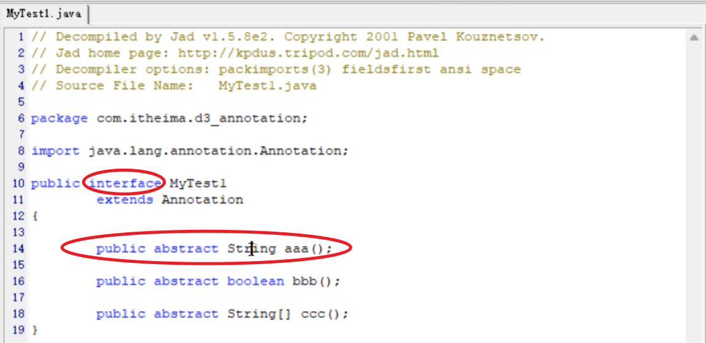

**注意事项**：

- 自定义注解可以通过四个元注解@Retention, @Target, @Inherited, @Documented来进行说明。
- 注解的成员以**无参数有返回值类型的抽象方法的形式**来声明，我们又称为配置参数。返回值类型只能是八种基本数据类型、String类型、Class类型、enum类型、Annotation类型、以上所有类型的数组。
- 可以使用default关键字为抽象方法指定默认返回值。
- **对于注解中的抽象方法，如果没有default默认返回值，则使用时必须指定返回值**。格式是`方法名 = 返回值`，如果只有一个抽象方法需要赋值，且方法名为`value`，可以省略`value=`，所以如果注解只有一个抽象方法成员，建议使用方法名value。

举例：

```java
@Inherited
@Target(ElementType.TYPE)
@Retention(RetentionPolicy.RUNTIME)
public @interface Table {
    String value();
}
```

```java
@Inherited
@Target(ElementType.FIELD)
@Retention(RetentionPolicy.RUNTIME)
public @interface Column {
    String columnName();
    String columnType();
}
```

#### 2、使用自定义注解

```java
@Table("t_stu")
public class Student {
    @Column(columnName = "sid", columnType = "int")
    private int id;
    @Column(columnName = "sname", columnType = "varchar(20)")
    private String name;
}
```

#### 3、解析自定义注解

自定义注解必须配上注解的信息处理流程才有意义。我们自己定义的注解，**只能使用反射的代码读取**，所以自定义注解的生命周期必须是`RetentionPolicy.RUNTIME`。

注解在哪个成分上，我们就先拿哪个成分对象：

- 比如注解作用成员方法，则要获得该成员方法对应的Method对象，再来拿上面的注解
- 比如注解作用在类上，则要获得该类的Class对象，再来拿上面的注解
- 比如注解作用在成员变量上，则要获得该成员变量对应的Field对象，再来拿上面的注解

**与注解解析相关的接口有以下两个**：

（1）Annotation：是注解的顶级接口，所有的注解都**继承**了Annotation接口

（2）AnnotatedElement：该接口定义了与注解解析相关的方法：

- `Annotation[] getDeclaredAnnotations()`：获得当前对象上标注的所有注解，返回注解数组
- `T getDeclaredAnnotation(Class<T> annotationClass)`：根据注解的类型获取对应的注解对象
- `boolean isAnnotationPresent(Class<? extends Annotation> annotationClass)`：判断当前对象是否使用了指定的注解，如果使用了则返回true，否则返回false

> 注意：所有的类成分如Class, Method, Field, Constructor**都实现了AnnotatedElement接口**，因此它们都拥有解析注解的能力。

```java
public static void main(String[] args) {
    // 获取Class对象
    Class studentClass = Student.class;
    // 获取类上的注解
    Table tableAnnotation = (Table) studentClass.getDeclaredAnnotation(Table.class);
    if (tableAnnotation != null) {
        // 调用注解中的方法获取对应的值
        String tableName = tableAnnotation.value();
        System.out.println("tableName=" + tableName);
    }

    // 获取Field对象
    Field[] declaredFields = studentClass.getDeclaredFields();
    HashMap<String, String> map = new HashMap<>();
    for (Field declaredField : declaredFields) {
        // 获取每个成员变量上的注解
        Column column = declaredField.getDeclaredAnnotation(Column.class);
        if (column != null) {
            // 调用注解中的方法获取对应的值
            map.put(column.columnName(), column.columnType());
        }
    }
    System.out.println(map);
}
```

## 10. JUnit单元测试

### 10.1 简介

JUnit是一个测试框架，供Java开发人员编写单元测试之用。JUnit测试是程序员测试，即所谓**白盒测试**，因为程序员知道被测试的软件如何完成功能和完成什么样的功能。

要使用JUnit，必须在项目的编译路径中`引入JUnit的库`，即相关的`.class`文件组成的jar包。jar包就是一个压缩包，压缩包都是开发好的第三方（Oracle公司第一方，我们自己是第二方，其他都是第三方）工具类，都是以class文件形式存在的。

我们使用Maven，只需引入以下依赖即可：

```xml
<dependency>
    <groupId>org.junit.jupiter</groupId>
    <artifactId>junit-jupiter-api</artifactId>
    <version>5.3.1</version>
    <scope>test</scope>
</dependency>
```

### 10.2 @Test基本使用

@Test标记的测试方法必须满足如下要求：

- 所在的类必须是public的，非抽象的，包含唯一的无参构造器
- @Test标记的方法本身必须是public，非抽象的，非静态的，void无返回值，无参数的


```java
public class MyJavaTest {
    @Test
    public void test01() {
        System.out.println("test01");
    }
    @Test
    public void test02() {
        System.out.println("test02");
    }
}
```

> 注意：在每个测试方法处运行，只会执行该测试方法；在测试类处运行，会执行该类的所有测试方法。

### 10.3 设置执行JUnit用例时支持控制台输入

默认情况下，在单元测试方法中使用Scanner时，并不能实现控制台数据的输入。需要做如下设置：在`idea64.exe.vmoptions配置文件`中加入下面一行设置，重启idea后生效：

```properties
-Deditable.java.test.console=true
```

注意，上述配置文件所在的位置为：


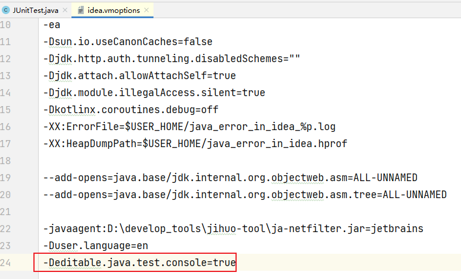

**如果上述位置设置不成功，需要继续修改如下位置**：

- 修改位置1：IDEA安装目录的bin目录（例如：`D:\develop_tools\IDEA\IntelliJ IDEA 2022.1.2\bin`）下的`idea64.exe.vmoptions`文件。 
- 修改位置2：C盘的用户目录`C:\Users\用户名\AppData\Roaming\JetBrains\IntelliJIdea2022.1`下的`idea64.exe.vmoptions`文件。

### 10.4 定义test测试方法模板

选中自定义的模板组，点击`+`并选择`1. Live Template`来定义模板。

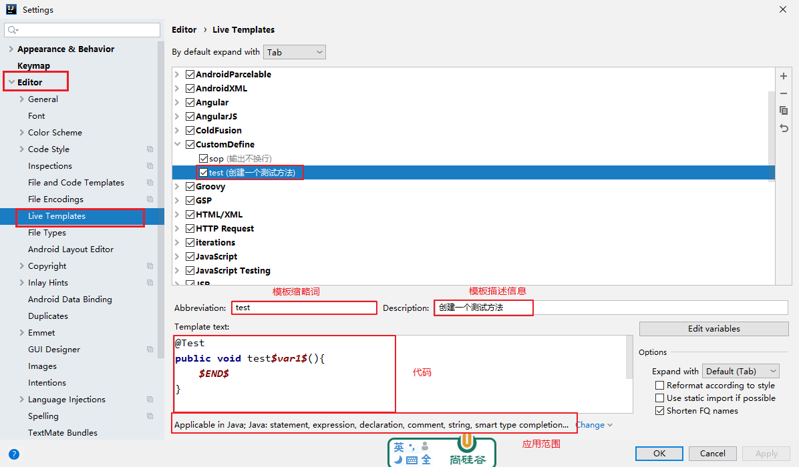

### 10.5 断言机制

在单元测试中，我们可以使用断言机制。**所谓断言，就是程序员可以预测程序的运行结果，检查程序的运行结果是否与预期一致**。例如

```java
@Test
public void test03() {
    int num = 11 * 11;
    /**
     * 使用断言机制，预测num的结果
     * - 第1个参数：预期的结果
     * - 第2个参数：实际测试的结果
     * - 第3个参数：输出的错误信息
     */
    Assertions.assertEquals(100, num, "没有得到100");
}
```

运行测试方法，结果如下所示，表示我们预期值与实际值不一致：

```
org.opentest4j.AssertionFailedError: 没有得到100 ==> 
Expected :100
Actual   :121
```

## 11. 包装类

### 11.1 简介

Java针对八种基本数据类型定义了相应的引用类型：包装类。有了类的特点，就可以调用类中的方法，Java才是真正的面向对象。

- byte的包装类是Byte
- short的包装类是Short
- int的包装类是**Integer**
- long的包装类是Long
- float的包装类是Float
- double的包装类是Double
- boolean的包装类是Boolean
- char的包装类是**Character**

> 其中，前6个包装类：Byte, Short, Integer, Long, Float, Double的**父类是Number**

### 11.2 包装类与基本数据类型间的转换

#### 1、装箱

装箱，指的是把基本数据类型转为包装类对象。通过调用包装类的静态方法`valueOf()`：

```java
// static Integer valueOf(int i);
Integer num = Integer.valueOf(123);
```

#### 2、拆箱

拆箱，指的是把包装类对象转为基本数据类型。通过调用包装类对象的`xxxValue()`方法：

```java
// int intValue();
int i = num.intValue();
```

#### 3、自动装箱与自动拆箱

由于我们经常要做基本类型与包装类之间的转换，从JDK5.0开始，基本类型与包装类的装箱、拆箱动作可以自动完成。例如：

```java
Integer i = 4; // 自动装箱，底层调用了valueOf方法
int ii = i; // 自动拆箱，底层调用了xxxValue方法
i = i + 5; 
// 等号右边：将i对象转成基本数据类型(自动拆箱)，即 i.intValue() + 5;
// 加法运算完成后，再次自动装箱，把基本数据类型转成引用数据类型。
```

> 注意：只有与自己对应的类型之间才能实现自动装箱与拆箱。

### 11.3 包装类转换为String

包装类/基本数据类型，转换为String，有以下三种方式：

#### 方式1：使用包装类的toString()方法

- `static String toString(int i)`：包装类的静态toString()方法，用于将基本数据类型转化为String
- `String toString()`：包装类的非静态toString()方法，用于将包装类对象转化为String

```java
// 静态toString()
String s1 = Integer.toString(10);
// 非静态toString()
Integer num = 20;
String s2 = num.toString();
```

#### 方式2：使用String的valueOf()方法

- `static String valueOf(int i)`：String提供的静态方法valueOf()，用于将基本数据类型/包装类转化为String

```java
// 基本数据类型转化为String
String s1 = String.valueOf(10);
// 包装类转化为String(隐含了自动拆箱)
Integer num = 20;
String s2 = String.valueOf(num);
```

#### 方式3：使用字符串拼接

直接将基本数据类型/包装类与空字符串拼接，即可转化为String

```java
// 基本数据类型转化为String
String s1 = 10 + "";
// 包装类转化为String(隐含了自动拆箱)
Integer num = 20;
String s2 = num + "";
```

### 11.4 String转换为包装类

#### 方式1：使用包装类的parseXxx()方法

- `static int parseInt(String s)`：使用包装类的静态方法parseXxx()，可以将String转换为对应的基本数据类型

> 注意：除了Character类之外，其他所有包装类都具有parseXxx()静态方法

```java
// String转化为基本数据类型
int i = Integer.parseInt("123");
// String转化为包装类(隐含了自动装箱)
Integer obj = Integer.parseInt("456");
```

注意：如果字符串参数的内容无法正确转换为对应的基本类型，则会抛出`java.lang.NumberFormatException`异常。

#### 方式2：使用包装类的valueOf()方法

- `static Integer valueOf(String s)`：使用包装类的静态方法valueOf()，可以将String转换为对应的包装类

```java
// String转化为基本数据类型(隐含了自动拆箱)
int i = Integer.valueOf("123");
// String转化为包装类
Integer obj = Integer.valueOf("456");
```

### 11.5 包装类的其它常用API

#### 1、数据类型的最大最小值

```java
Integer.MAX_VALUE
Integer.MIN_VALUE
    
Long.MAX_VALUE
Long.MIN_VALUE
    
Double.MAX_VALUE
Double.MIN_VALUE
```

#### 2、字符转大小写

```java
Character.toUpperCase('x');
Character.toLowerCase('X');
```

#### 3、整数转进制

```java
Integer.toBinaryString(int i); // 转为二进制显示的String
Integer.toOctalString(int i); // 转为八进制显示的String
Integer.toHexString(int i); // 转为十六进制显示的String
```

#### 4、比较大小

- `static int compare(int x, int y)`：包装类的静态方法`compare()`。如果`x < y`则返回负数；如果`x > y`则返回正数；如果`x == y`则返回0
- `int compareTo(Integer anotherInteger)`：包装类的非静态方法`compareTo()`。底层实际调用了上述`compare()`，其中x是当前对象对应的值，y是参数anotherInteger对应的值。

举例：

```java
System.out.println(Double.compare(12.0, 12.0)); // 0
System.out.println(Double.compare(12.0, 12.1)); // -1
Integer num = 10;
System.out.println(num.compareTo(5)); // 1
```

### 11.6 包装类的特点

#### 1、包装类具有缓存对象

| 包装类    | 缓存对象    |
| --------- | ----------- |
| Byte      | -128~127    |
| Short     | -128~127    |
| Integer   | -128~127    |
| Long      | -128~127    |
| Float     | 没有        |
| Double    | 没有        |
| Character | 0~127       |
| Boolean   | true和false |

以Integer为例，如果调用的是`valueOf()`方法，根据它的底层原理：

- 当int数值在`-128~127`的范围内时，会从常量池中一个固定长度为256的数组中去找对应的Integer对象并返回其引用。
- 若int数值不在`-128~127`这个范围内，则会new一个新的Integer对象。

源码如下：

```java
public static Integer valueOf(int i) {
    if (i >= IntegerCache.low && i <= IntegerCache.high)
        return IntegerCache.cache[i + (-IntegerCache.low)];
    return new Integer(i);
}
```

例题：

```java
Integer a = 1;
Integer b = 1;
System.out.println(a == b); // true

Integer i = 128;
Integer j = 128;
System.out.println(i == j); // false

Integer m = new Integer(1); // 新new的在堆中，因为并没有调用valueOf()方法
Integer n = 1; // 这个用的是缓存的常量对象，在方法区
System.out.println(m == n); // false

Integer x = new Integer(1); // 新new的在堆中
Integer y = new Integer(1); // 新new的在堆中
System.out.println(x == y); // false

Double d1 = 1.0; // Double没有缓存对象，每一个都是新new的
Double d2 = 1.0; // Double没有缓存对象，每一个都是新new的
System.out.println(d1==d2); // false
```

#### 2、类型转换问题

当包装类与基本数据类型进行`==`比较时，会将包装类自动拆箱为基本数据类型进行比较。

> 注意：如果两个包装类(不是同类型的)进行`==`比较，会直接编译报错

例题：

```java
Integer i = 1000;
double j = 1000;
System.out.println(i == j); //true  
// i自动拆箱为int，然后根据基本数据类型“自动类型转换”规则，转为double比较
```

```java
Integer i = 1000;
int j = 1000;
System.out.println(i == j); //true 
// i会自动拆箱，按照基本数据类型进行比较
```

```java
Integer i = 1;
Double d = 1.0
System.out.println(i == d); //编译报错
```

#### 3、包装类对象不可变

Integer等包装类对象是不可变对象，即一旦修改就变成了新对象。例如：

```java
Integer b = 0;
b += 10;
```

> 解释：`b += 10;`就等价于`b = b + 10;`此时右边的`b + 10`根据自动拆箱计算得到结果为10，然后再进行自动装箱，即等价于`b = Integer.valueOf(10);`所以此时b指向常量池中值为10的Integer对象。

**例1**：

```java
public static void main(String[] args) {
    Integer a = 0;
    a += 10;
    Integer b = 10;
    System.out.println(a == b); // true

    Integer c = 128;
    Integer d = c;
    c += 10;
    Integer e = 138;
    System.out.println(d); // 128
    System.out.println(c); // 138
    System.out.println(c == e); // false
}
```

**例2**：

```java
public class TestExam {
	public static void main(String[] args) {
		int i = 1;
		Integer j = new Integer(2);
		Circle c = new Circle();
		change(i, j, c);
		System.out.println("i = " + i); // 1
		System.out.println("j = " + j); // 2
		System.out.println("c.radius = " + c.radius); // 10.0
	}
	
	public static void change(int a ,Integer b, Circle c){
		a += 10;
		b += 10;
		c.radius += 10;
	}
}
class Circle{
	double radius;
}
```

**例3**：如下两个题目输出结果相同吗？

```java
Object o1 = true ? new Integer(1) : new Double(2.0);
System.out.println(o1); // 1.0
// 三元运算符需要两个表达式类型兼容，赋值时会提升到同一个类型
```

> 字节码文件反编译后，上述代码等价于`Object o1 = (double) new Integer(1);`

```java
Object o2;
if (true)
    o2 = new Integer(1);
else
    o2 = new Double(2.0);
System.out.println(o2); // 1
```

> 字节码文件反编译后，上述代码等价于`Object o2 = new Integer(1);`


# 第06章_异常处理

## 1. Java异常体系

### 1.1 异常概述

**异常**指的是程序在执行过程中，出现的非正常情况，如果不处理最终会导致JVM的非正常停止。Java中把不同的异常用不同的类表示，一旦发生某种异常，就**创建该异常类型的对象并抛出**(throw)。

### 1.2 Throwable

`java.lang.Throwable`类是Java程序执行过程中发生的异常事件对应的类的**根父类**。有以下几个常用API：

- `void printStackTrace()`：打印异常的详细信息：包括异常的类型、原因、出现位置。开发调试阶段经常使用这个API。
- `String getMessage()`：获取发生异常的字符串信息。在自定义异常的有参构造器中的String参数，就可以使用该API获取到。

### 1.3 Error和Exception

Throwable有两大子类：Error和Exception。

**Error**指的是Java虚拟机无法解决的严重问题，一般不编写针对性的代码进行处理。例如`StackOverflowError`、`OutOfMemoryError`

**Exception**指的是其它因编程错误或偶然的外在因素导致的一般性问题，需要使用针对性的代码进行处理，使程序继续运行。

> 说明：无论是Error还是Exception，还有很多子类，异常的类型非常丰富。本章讨论的异常处理，针对的是**Exception**。

### 1.4 编译时异常和运行时异常

Java程序的执行分为编译时过程和运行时过程。因此，根据异常可能出现的阶段，可以**将异常类Exception分为编译时异常和运行时异常**。

#### 1、编译时异常

编译时异常，又称为受检异常（checked异常）。在代码编译阶段，编译器就能明确警示当前代码`可能发生（不是一定发生）`异常，并`明确督促`程序员提前编写处理它的代码。如果程序员`没有编写`对应的异常处理代码，则编译器就会直接判定编译失败，从而不能生成字节码文件。

通常，这类异常的发生不是由程序员的代码引起的。常见的编译时异常有：

- FileNotFoundException
- ClassNotFoundException
- IOException

#### 2、运行时异常

运行时异常（runtime异常），又称为非受检异常（unchecked异常）。在代码编译阶段，编译器完全不做任何检查，无论该异常是否会发生，编译器都不给出任何提示。只有等代码运行起来并确实发生了该异常，它才能被发现。

通常，这类异常是由程序员的代码编写不当引起的，只要稍加判断，或者细心检查就可以避免。常见的运行时异常有：

- ArrayIndexOutOfBoundsException
- ClassCastException
- NullPointerException
- NumberFormatException
- InputMismatchException
- ArithmeticException

**说明**：Java中使用**RuntimeException代表运行时异常**，该类及其子类都是运行时异常。

### 1.5 异常处理方式

Java程序的执行过程中如出现异常，会生成一个异常类对象，该异常对象将被提交给Java运行时系统，这个过程称为`抛出(throw)异常`。除此之外，另一种生成异常的方式就是程序员显式地使用`throw + 异常类对象`主动抛出异常对象。

如果一个方法内抛出异常，该异常对象会被抛给调用者方法中处理。**处理方式有两种**：

- 一种方式是通过`throws`继续抛给这个调用方法的上层方法，这个过程可以一直继续下去
- 另一种方式是直接通过`try-catch-finally`捕获异常并进行处理。

注意：如果一个异常一直被抛到main()方法，并且main()也不进行`try-catch-finally`捕获处理，那么程序将运行终止。

说明：**编译时异常要求必须显式地选择上述两种方法之一来处理，而运行时异常可以不处理，此时默认将异常不断抛给上层方法**。

## 2. 异常处理方式一：捕获异常

### 2.1 try-catch-finally

```java
try {
    // 可能产生异常的代码
} catch (异常类型1 e) {
    // 当产生异常类型1时的处理措施
} catch (异常类型2 e) {
    // 当产生异常类型2时的处理措施
} finally {
    // 无论是否发生异常，都必须执行的语句
}
```

当某段代码可能发生异常，不管这个异常是编译时异常还是运行时异常，我们都可以使用try块将它括起来，并在try块下面编写catch分支尝试捕获对应的异常对象。

- 如果在程序运行时，try块中的代码没有发生异常，那么catch所有的分支都不执行。
- 如果在程序运行时，try块中的代码发生了异常，根据异常对象的类型，将从上到下选择第一个匹配的catch分支执行。此时try中发生异常的语句下面的代码将不执行，而整个try...catch之后的代码可以继续运行。
- 如果在程序运行时，try块中的代码发生了异常，但是所有catch分支都无法匹配（捕获）这个异常，那么JVM将会终止当前方法的执行，并把异常对象抛给调用者。如果调用者不处理，程序就挂了。

**注意事项**：

- try中声明的局部变量，出了try结构之后，就不可以使用了
- 如果有多个catch分支，并且多个异常类型有父子类关系，必须保证小的子异常类型在上，大的父异常类型在下。否则会报错。
- `try-catch-finally`结构是可以嵌套使用的

**catch块中常用的处理措施有**：

- `throw new RuntimeException(e);`将编译时异常转化为运行时异常抛出
- `e.printStackTrace();`打印异常的详细信息
- 获取异常的描述信息`e.getMessage()`，进行自定义处理

### 2.2 finally的深入理解

因为异常会引发程序跳转，从而导致有些语句执行不到。而程序中有一些特定的代码无论异常是否发生，都`需要执行`。例如，数据库连接、输入流输出流、Socket连接、Lock锁的关闭等，这样的代码通常就会放到finally块中。所以，我们通常将一定要被执行的代码声明在finally中。

> 唯一的例外，在try块中使用`System.exit(0)`来终止当前正在运行的Java虚拟机，则finally中的代码就不会执行。

注1：不论在try代码块中是否发生了异常事件，catch语句是否执行，catch语句是否有异常，catch语句中是否有return，finally块中的语句都会被执行。

注2：finally语句和catch语句都是可选的，但finally不能单独使用。

**例题1**

```java
public class FinallyTest1 {
    public static void main(String[] args) {
        int result = test("12"); // test结束
        System.out.println(result); // 1
    }
    public static int test(String str){
        try{
            Integer.parseInt(str);
            return 1;
        }catch(NumberFormatException e){
            return -1;
        }finally{
            System.out.println("test结束");
        }
    }
}
```

**例题2**

```java
public class FinallyTest2 {
    public static void main(String[] args) {
        int result = test("a"); // test结束
        System.out.println(result); // -1
    }
    public static int test(String str) {
        try {
            Integer.parseInt(str);
            return 1;
        } catch (NumberFormatException e) {
            return -1;
        } finally {
            System.out.println("test结束");
        }
    }
}
```

**例题3**

```java
public class FinallyTest3 {
    public static void main(String[] args) {
        int result = test("a"); // test结束
        System.out.println(result); // 0
    }
    public static int test(String str) {
        try {
            Integer.parseInt(str);
            return 1;
        } catch (NumberFormatException e) {
            return -1;
        } finally {
            System.out.println("test结束");
            return 0;
        }
    }
}
```

**例题4**

```java
public class FinallyTest4 {
    public static void main(String[] args) {
        int result = test(10); // test结束
        System.out.println(result); // 11
    }
    public static int test(int num) {
        try {
            return num;
        } catch (NumberFormatException e) {
            return num--;
        } finally {
            System.out.println("test结束");
            return ++num;
        }
    }
}
```

**例题5**

```java
public class FinallyTest5 {
    public static void main(String[] args) {
        int result = test(10); // test结束
        System.out.println(result); // 10
    }
    public static int test(int num) {
        try {
            return num;
        } catch (NumberFormatException e) {
            return num--;
        } finally {
            System.out.println("test结束");
            ++num;
        }
    }
}
```

解释：方法栈帧中有操作数栈和局部变量表，进入try语句后，将局部变量表中值为10的num放入临时的操作数栈中准备return，此时执行finally语句，将局部变量表中的num值++变为11，但操作数栈中的值并未改变，然后return返回，将10赋值给result。

### 2.3 try-with-resource

#### 1、try-catch-finally的缺点

finally的一个很重要的应用场景就是完成对资源的释放，JDK7之前基本也都是通过finally来释放一些流资源，但其缺点是代码太长、臃肿。如下所示：

```java
@Test
public void test01() {
    FileWriter fw = null;
    BufferedWriter bw = null;
    try {
        fw = new FileWriter("d:/1.txt");
        bw = new BufferedWriter(fw);

        bw.write("hello");
    } catch (IOException e) {
        e.printStackTrace();
    } finally {
        try {
            if (bw != null) {
                bw.close();
            }
        } catch (IOException e) {
            e.printStackTrace();
        }
        try {
            if (fw != null) {
                fw.close();
            }
        } catch (IOException e) {
            e.printStackTrace();
        }
    }
}
```

#### 2、try-with-resource

**JDK7开始提供了更简单的资源释放方案：try-with-resource**，格式如下：

```java
try (
    定义资源1;
    定义资源2;
) {
    可能出现异常的代码;
} catch (异常类型 e) {
    异常的处理代码;
}
```

这种方案能使得资源使用完毕后，自动调用其`close()`方法，完成对资源的释放。注意：

- try后的`()`内只能定义资源，否则报错
- 写到`try()`中的资源类的变量默认是final声明的，不能修改
- 资源指的是直接或间接**实现了AutoCloseable接口的类**，比如

```java
public abstract class InputStream implements Closeable {}
public abstract class OutputStream implements Closeable, Flushable {}
public interface Closeable extends AutoCloseable {}
```

举例：

```java
public static void main(String[] args)  {
    try (
        InputStream is = new FileInputStream("D:/resource/meinv.png");
        OutputStream os = new FileOutputStream("C:/data/meinv.png");
    ){
        byte[] buffer = new byte[1024]; 
        int len;
        while ((len = is.read(buffer)) != -1){
            os.write(buffer, 0, len);
        }
        System.out.println("复制完成！！");
    } catch (Exception e) {
        e.printStackTrace();
    }
}
```

#### 3、JDK9的新特性

从JDK9开始，try的前面就可以定义资源，try后面的`()`中可以直接引用资源的名称。在try代码执行完毕后，资源就会自动释放掉，所以同样无需写finally。注意资源必须是final的，不可再被赋值。格式如下：

```java
A a = new A();
B b = new B();
try (a; b) {
    可能出现异常的代码;
} catch (异常类型 e) {
    异常的处理代码;
}
```

举例：

```java
@Test
public void test04() {
    InputStreamReader reader = new InputStreamReader(System.in);
    OutputStreamWriter writer = new OutputStreamWriter(System.out);
    try (reader; writer) {
        // reader是final的，不可再被赋值
        // reader = null; // 报错
    } catch (IOException e) {
        e.printStackTrace();
    }
}
```

## 3. 异常处理方式二：声明抛出异常类型

### 3.1 throws

如果在编写方法体的代码时，某句代码可能发生某个`编译时异常`，不处理编译不通过，但是在当前方法体中可能不适合处理该异常，那么此方法就可以**显式地声明抛出异常类型**，表明该方法将不对这些异常进行处理，而由该方法的调用者负责处理。

具体方式是，在方法签名中使用`throws`语句声明抛出异常的列表，throws后面的异常类型是方法中产生的异常类型或其父类：

```java
修饰符 返回值类型 方法名(参数) throws 异常类型1, 异常类型2 {

}	
```

举例：

```java
public class TestThrowsCheckedException {
    public static void main(String[] args) {
        System.out.println("上课.....");
        try {
            afterClass(); //换到这里处理异常
        } catch (InterruptedException e) {
            e.printStackTrace();
            System.out.println("准备提前上课");
        }
        System.out.println("上课.....");
    }

    public static void afterClass() throws InterruptedException {
        for(int i=10; i>=1; i--){
            Thread.sleep(1000); //本来应该在这里处理异常，但我们显式声明抛出
            System.out.println("距离上课还有：" + i + "分钟");
        }
    }
}
```

### 3.2 throws的理解

throws后面基本都是写**编译时异常**，虽然也可以写运行时异常，但对于运行时异常来说，写或不写对于编译器和程序执行来说都没有任何区别。

事实上，**throws并没有真正处理异常**，因为它只是将可能出现的异常抛给了此方法的调用者，此调用者仍需考虑如何处理相关异常。throws对程序员而言，最大的意义就是可以让编译通过。

## 4. 异常处理方式的选择

**对于运行时异常，我们无需处理**。运行时异常就是RuntimeException及其子类，这类异常即使我们不进行处理，也能编译通过，而在运行时会交给JVM捕获。运行时异常极为普遍，若进行处理会对程序的可读性和运行效率产生严重影响。

**对于编译时异常，我们必须处理，否则编译不通过**。主要有以下原则：

- 如果父类被重写的方法没有throws异常类型，则子类重写的方法中如果出现异常，只能使用`try-catch-finally`进行处理，无法使用throws
- 如果我们定义的方法a中，调用了b、c、d等其他方法，通常在b、c、d中的异常选择使用throws，而在方法a中使用`try-catch-finally`统一处理
- 涉及到资源的使用（流、数据库连接、网络连接等），最终一定要考虑使用`try-catch-finally`处理，否则一旦因出现异常而导致资源没有释放，就发生了内存泄漏

> 说明：Exception是一切编译时异常和运行时异常的父类，所以开发中为了简化代码，一般直接抛出和捕获Exception即可。

## 5. 手动抛出异常对象：throw

### 5.1 生成异常对象的两种方式

Java中异常对象的生成有两种方式：

- 由虚拟机**自动生成**：程序运行过程中，虚拟机检测到程序发生了问题，那么针对当前代码，就会在后台自动创建一个对应异常类的实例对象并抛出。
- 由开发人员**手动创建**：通过`new 异常类型(参数);`可以创建一个异常对象，如果它不抛出就对程序没有任何影响，和创建一个普通对象一样，但是一旦使用`throw`抛出，就会对程序运行产生影响了。在实际开发中，如果出现不满足具体场景的代码问题，我们就有必要手动抛出一个指定类型的异常对象。

### 5.2 throw

```java
throw new 异常类型(参数);
```

throw语句抛出异常对象，就和JVM执行到某个异常语句自动创建和抛出异常对象一样。

- `throw`的异常必须是Throwable或其子类的实例
- 如果是运行时异常类型对象，编译器不会提示
- 如果是编译时异常类型对象，同样需要使用`throws`或者`try-catch`处理，否则编译不通过

**注意事项**：

- throw语句会导致程序执行流程被改变，throw语句是明确抛出一个异常对象，因此它**下面的代码将不会执行**。
- 如果当前方法没有`try-catch`处理这个异常对象，throw语句就会**代替return语句提前终止当前方法的执行**，并返回一个异常对象给调用者。

举例：

```java
public class MyTest {
    public static void main(String[] args) {
        try {
            new Student().register(-1);
        } catch (Exception e) {
            e.printStackTrace();
        }
    }
}
class Student {
    public void register(int id) throws Exception {
        if (id >= 0)
            System.out.println("ok");
        else
            throw new Exception("id非法");
    }
}
```

## 6. 自定义异常

**自定义异常类的步骤**：

1. 继承一个异常类型。如果是要自定义编译时异常，则继承`Exception`；如果是要自定义运行时异常，则继承`RuntimeException`
2. 提供至少两个构造器：一个是无参构造，一个是`(String message)`构造器
3. 自定义异常类需要提供一个全局常量`serialVersionUID`

举例：

```java
public class BelowZeorException extends Exception {
    static final long serialVersionUID = -33234524229948L;
    public BelowZeorException() {
        super();
    }
    public BelowZeorException(String message) {
        super(message);
    }
}
```

**注意事项**：

- 自定义的异常对象只能通过throw手动抛出
- 自定义异常最重要的是异常类的名字和message属性。当异常出现时，可以见名知义，根据名字判断异常类型。比如：`TeamException("成员已满，无法添加");`

# 第07章_常用类和API

## 1. String

### 1.1 String的基本性质

String表示字符串，使用一对双引号引起来表示。所有Java的字符串字面值，也都是字符串对象。有以下两种定义方式：

- `String s1 = "wsy";`
- `String s2 = new String("wsy");`

（1）String类是final修饰的，所以**不可以被继承**

（2）String类实现了Serializable接口，表示字符串时支持序列化的

（3）String类实现了Comparable接口，表示字符串可以比较大小

### 1.2 String内部存储结构

JDK8时String对象的字符内容是存储在一个字符数组中的：`private final char[] value;`

- private意味着外面无法直接获取字符数组，而且String没有提供value的get和set方法。
- String没有提供方法来修改value数组某个元素值
- final意味着字符数组的引用不可改变
- 因此，String代表着不可变的字符序列。即，一旦对字符串进行修改，就会产生新对象。

String在jdk8及以前内部使用`private final char[] value;`来存储字符串数据。在jdk9时，改为使用`private final byte[] value;`来存储字符串数据。**原因如下**：

数据表明字符串在堆中占了主要部分，而大多数字符串中只包含占用1个字节的拉丁字符，所以使用char数组(一个char占用2个字节)过于浪费。因此将String的内部存储结构改成了使用byte数组的方式，并且额外增加一个属性`coder`作为编码标志，编码标志就代表编码的方式：

- 如果该字符串中全部都是拉丁字符，则编码标志就会指示byte数组中一个字节就代表一个字符
- 如果该字符串中有的字符需要2个字节来存储，则编码标志就会指示byte数组中每两个字节代表一个字符

> 除此之外，基于String的数据结构，例如StringBuffer和StringBuilder的内部存储结构也同样使用byte数组了。

### 1.3 String的不可变性

String代表不可变的字符序列：

- 当对字符串重新赋值时，需要重写指定内存区域赋值，不能使用原有的value进行赋值
- 当对现有的字符串进行连接操作时，也需要重新指定内存区域赋值，不能使用原有的value进行赋值
- 当调用String的replace()方法修改指定字符或字符串时，也需要重新指定内存区域赋值，不能使用原有的value进行赋值
- 调用字符串的`concat(xxx)`进行拼接。不管是常量调用此方法，还是变量调用，同样不管参数是常量还是变量，总之，调用完`concat()`方法都返回一个新new的对象。

> 注意：通过字符串字面量的方式（区别于new）赋值给一个变量，此时该字符串字面量也会对应一个String对象，它保存在**字符串常量池**中。**字符串常量池中是不会存储相同内容的字符串对象的**。
>
> 说明：字符串拼接的详细细节，可以参考JVM笔记

### 1.4 String的常用API

#### 1、构造器

* `String()`：其内容是空字符串
* `String(String s)`
* `String(char[] value)`：通过字符数组来构造新的String
* `String(char[] value, int offset, int count) `：通过字符数组的一部分`[offset, offset + count)`来构造新的String
* `String(byte[] bytes)`：通过使用平台的**默认字符集**解码当前参数中的字节数组来构造新的String
* `String(byte[] bytes, String charsetName)`：通过使用指定的字符集解码当前参数中的字节数组来构造新的String。

举例：

```java
//字面量定义方式：字符串常量对象
String str = "hello";

//构造器定义方式
String str1 = new String();
String str2 = new String("hello");

char chars[] = {'a', 'b', 'c', 'd', 'e'};     
String str3 = new String(chars);
String str4 = new String(chars, 0, 3);

byte bytes[] = {97, 98, 99};     
String str5 = new String(bytes);
String str6 = new String(bytes, "GBK");
```

#### 2、String与字符/字节数组的转换

（1）字符数组转换为String

- 使用String类的构造器
- `static String valueOf(char data[])`：静态方法，和构造器类似
- `static String copyValueOf(char data[])`：同上
- `static String valueOf(char data[], int offset, int count)`：静态方法，和构造器类似
- `static String copyValueOf(char data[], int offset, int count)`：同上

（2）字节数组转换为String：使用String类的构造器

（3）String转换为字符数组：

- `char[] toCharArray()`
- `void getChars(int srcBegin, int srcEnd, char dst[], int dstBegin)`：将指定索引范围内的内容保存到指定字符数组中

（4）String转换为字节数组：

- `byte[] getBytes()`：使用平台默认的字符集将此String编码为byte序列
- `byte[] getBytes(String charsetName)`：使用指定的字符集将此String编码为byte序列

#### 3、基本API

- `boolean isEmpty()`：字符串是否为空
- `int length()`：返回字符串的长度，即字符的个数
- `char charAt(int index)`：返回index位置的字符
- `String concat(String str)`：拼接字符串
- `boolean equals(Object obj)`：比较字符串内容是否相同，区分大小写
- `boolean equalsIgnoreCase(String s)`：比较字符串内容是否相同，不区分大小写
- `int compareTo(String s)`：按照Unicode编码值比较字符串大小，区分大小写
- `int compareToIgnoreCase(String s)`：按照Unicode编码值比较字符串大小，不区分大小写
- `String toLowerCase()`：字母转为小写
- `String toUpperCase()`：字母转为大写
- `String trim()`：去掉字符串前后的空白符
- `String intern()`：返回该字符串内容在字符串常量池中的引用
- `String[] split(String regex)`：把字符串按照regex内容分割，并返回分割后的字符串数组。其中regex可以是正则表达式。

#### 4、字符串查找

- `boolean contains(CharSequence s)`：是否包含字符串s
- `int indexOf(String str)`：从前往后找当前字符串中的str，如果有则返回首次找到的下标，否则返回-1
- `int indexOf(String str, int fromIndex)`：从指定索引开始找str
- `int lastIndexOf(String str)`：从后往前找当前字符串中的str，如果有则返回首次找到的下标，否则返回-1
- `int lastIndexOf(String str, int fromIndex)`：从指定索引开始反向找str

#### 5、字符串截取

- `String substring(int beg)`：返回从beg开始截取到最后的字符串
- `String substring(int beg, int end)`：返回截取`[beg, end)`的字符串

#### 6、开头与结尾

- `boolean startsWith(String prefix)`：判断此字符串是否以指定的前缀开头
- `boolean startsWith(String prefix, int offset)`：判断此字符串从索引offset开始的子字符串，是否以指定的前缀开头
- `boolean endsWith(String suffix)`：判断此字符串是否以指定的后缀结尾

#### 7、替换

- `String replace(char oldChar, char newChar)`：返回一个新的字符串，它将原字符串的所有字符oldChar替换为newChar
- `String replace(CharSequence target, CharSequence replacement)`：将原字符串的所有target子字符串，替换为replacement
- `String replaceAll(String regex, String replacement)`：使用给定的replacement替换此字符串所有匹配给定的正则表达式的子字符串
- `String replaceFirst(String regex, String replacement)`：使用给定的replacement替换此字符串匹配给定的正则表达式的第一个子字符串

## 2. StringBuffer、StringBuilder

### 2.1 简介

String对象是不可变对象，虽然可以共享常量对象，但是对于频繁字符串的修改和拼接操作，效率极低，空间消耗也比较高。

而StringBuffer与StringBuilder是可变的字符序列，jdk8及之前底层使用`char[]`，jdk9及之后底层使用`byte[]`。两者功能类似，区别在于**StringBuffer是线程安全的、效率低，而StringBuilder线程不安全、效率高**。

对StringBuffer和StringBuilder的字符串内容进行增删，不会产生新的对象，因此称为`可变的字符序列`。

**说明**：

- 如果开发中需要频繁的针对于字符串进行增、删、改等操作，建议使用StringBuffer或StringBuilder替换String。
- 如果开发中，不涉及到线程安全问题，建议使用StringBuilder。
- 对于StringBuilder和StringBuffer，如果开发中大体确定要操作的字符的个数，建议使用有参构造器`StringBuffer(int capacity)`直接指定底层value数组的大小，从而可以避免底层多次扩容操作，性能更高。

### 2.2 底层原理

StringBuilder和StringBuffer底层原理相同，我们以其中之一为例：

```java
String s = new String("abc");
StringBuilder sb = new StringBuilder("abc");
```

- 对于String而言，其底层创建的`byte[]`数组value长度固定为3，用于存储`'a' 'b' 'c'`，且被final修饰
- 对于StringBuilder而言，其底层创建的`byte[]`数组value**长度默认为`16 + "abc".length()`**，并且该数组没有被final修饰。除此之外，StringBuilder还有一个属性`int count;`用于记录**实际存储的字符个数**。

所以如果我们调用append()方法添加`"de"`，其底层就相当于做了`value[3] = 'd', value[4] = 'e';`并增加了属性count的值。因此其增删操作的性能比String高得多。

**注意**：如果添加字符串后其长度超过了底层数组的初始长度，则会进行扩容，默认扩容的长度为原长度的2倍再加2，(假如扩容后的长度仍不够，则会直接将长度设置为添加字符串后实际的长度)，扩容完成后，将底层的value数组指向新扩容的数组，然后进行逐一复制byte，因此，**本质上从来没有创建新的StringBuilder对象，只不过是其底层数组改变了指向而已，所以StringBuilder是可变的字符序列**。

**例题**：

```java
String str = null;
StringBuffer sb = new StringBuffer();
sb.append(str);
System.out.println(sb.length()); // 4
System.out.println(sb); // null

StringBuffer sb1 = new StringBuffer(str); // 空指针异常
```

- 根据底层源码，当调用`append(String str)`时，如果str是null，则会拼接一个内容为`"null"`的字符串
- 而调用构造器`StringBuffer(str)`时，为了确定底层value数组的长度，会首先获取str的长度，即调用`str.length()`，此时由于str为空，会直接报空指针异常

### 2.3 常用API

StringBuilder、StringBuffer的API是完全一致的，并且很多方法与String相同。

#### 1、构造器

- `StringBuffer()`：底层value数组的默认长度为16
- `StringBuffer(int capacity)`：指定底层value数组的长度为capacity
- `StringBuffer(String str)`：创建一个指定字符串内容的StringBuffer对象，其底层value数组的默认长度为`16 + str.length()`

#### 2、增删改查API

- `StringBuffer append(T obj)`：提供了很多重载的append()方法，用于进行字符串追加方式的拼接
- `StringBuffer insert(int offset, T obj)`：提供了很多重载的insert()方法，用于在索引offset处插入obj
- `StringBuffer delete(int start, int end)`：删除`[start, end)`之间的字符
- `StringBuffer deleteCharAt(int index)`：删除index索引处的字符
- `StringBuffer replace(int start, int end, String str)`：替换`[start; end)`范围的字符序列为str
- `void setCharAt(int index, char ch)`：将索引index处的字符替换为ch
- `StringBuffer reverse()`：反转
- `char charAt(int index)`：返回index处的字符

**注意**：如上返回值为StringBuffer的API支持`方法链操作`，因为其底层返回的就是`this`，例如：

```java
public StringBuilder append(String str) {
    super.append(str);
    return this;
}
```

#### 3、其他核心API

- `String toString()`：转换为String
- `int length()`：返回字符数据的长度，即字符的个数
- `void setLength(int newLength)`：设置当前字符序列长度为newLength，如果newLength比原有字符串的长度大，则新的位置默认由`'\0'`填充
- `String substring(int start)`：截取当前字符序列，从start开始到最后
- `String substring(int start, int end)`：截取当前字符序列`[start, end)`
- `int indexOf(String str)`：从前往后查询str首次出现的下标
- `int indexOf(String str, int fromIndex)`：从fromIndex开始从前往后查询str首次出现的下标
- `int lastIndexOf(String str)`：从后往前查询str首次出现的下标
- `int lastIndexOf(String str, int fromIndex)`：从fromIndex开始从后往前查询str首次出现的下标

### 2.4 补充：StringJoiner类

StringJoiner类是JDK8开始才有的，它也是一个用来操作字符串的可变字符序列。其优点是能提高字符串的操作效率，并且在某些场景下代码会更简洁，StringJoiner号称是拼接神器。

**构造器**：

- `StringJoiner(CharSequence delimiter)`：创建一个StringJoiner对象，其拼接时使用的间隔符号为delimiter
- `StringJoiner(CharSequence delimiter, CharSequence prefix, CharSequence suffix)`：创建一个StringJoiner对象，其前缀为prefix，后缀为suffix，拼接时使用的间隔符号为delimiter

**常用API**：

- `StringJoiner add(CharSequence newElement)`：拼接字符串，返回对象本身
- `int length()`：返回字符的个数
- `String toString()`：转换为String

举例：

```java
StringJoiner s = new StringJoiner(", ", "[", "]");
s.add("cpp");
s.add("java");
s.add("python");
System.out.println(s); // [cpp, java, python]
```

## 3. Java比较器

引用数据类型是不能直接使用比较运算符来比较大小的，但我们在需要排序的场景都需要进行对象之间的比较。所以Java提供以下两种方式：

- java.lang.Comparable：只要一个类实现了该接口，就具有了比较大小的规则
- java.util.Comparator：有些方法(如排序)额外提供了一个比较器参数，就是用于临时指定所需的比较大小的规则

### 3.1 Comparable

#### 1、简介

`Comparable<T>`是一个接口，实现了该接口的类，就可以按照这种规则比较大小（也称为`自然排序`）。其源码如下：

```java
public interface Comparable<T> {
    public int compareTo(T obj);
}
```

两个对象通过`compareTo()`的返回值来比较大小，**默认的升序规则约定**为：

- 如果认为左边的对象小于右边的对象，则返回负数
- 如果认为左边的对象大于右边的对象，则返回正数
- 如果认为左边的对象等于右边的对象，则返回0

> 说明：在这里，左边的对象就是this，右边的对象就是形参obj

#### 2、特点

对于实现了Comparable接口的对象的集合(或数组)，可以直接使用`Collections.sort()`或`Arrays.sort()`进行排序。

对于实现了Comparable接口的对象，可以直接成为有序集合中的元素、或者有序映射中的键，而无需额外指定比较器。

> **注意**：类的`compareTo()`方法最好与`equals()`方法保持一致，也就是`equals()`返回true当且仅当`compareTo()`返回0

很多类都实现了Comparable接口，例如：

- String：按照字符串中字符的Unicode值进行比较
- Character：按照字符的Unicode值来进行比较
- 数值类型对应的包装类以及BigInteger、BigDecimal：按照它们对应的数值大小进行比较
- Boolean：true对应的包装类实例大于false对应的包装类实例
- Date、Time等：后面的日期时间比前面的日期时间大

> 说明：这些类默认都是从小到大的升序规则

#### 3、代码演示

> 需求：Student类按照年龄的升序进行排序

```java
@Data
@NoArgsConstructor
@AllArgsConstructor
public class Student implements Comparable<Student> {
    private String name;
    private double height;
    private int age;

    @Override
    public int compareTo(Student o) {
        return this.age - o.age; // 按照年龄升序排列
        // return o.age - this.age; // 按照年龄的降序排列
    }
}
```

```java
public class ComparableTest {
    public static void main(String[] args) {
        List<Student> list = new ArrayList<>();
        list.add(new Student("张三", 169.5, 28));
        list.add(new Student("李四", 178.5, 24));
        list.add(new Student("王五", 178.5, 18));
        list.add(new Student("赵六", 163.5, 18));
        // 直接进行排序即可，比较大小的规则已经在Student类中指定
        Collections.sort(list);
        System.out.println(list);
    }
}
```

### 3.2 Comparator

#### 1、简介

`Comparator<T>`是一个函数式接口，称为比较器（也称为`定制排序`），它的抽象方法是`int compare(T o1, T o2);`**默认的升序规则约定**为：

- 如果认为左边的对象小于右边的对象，则返回负数
- 如果认为左边的对象大于右边的对象，则返回正数
- 如果认为左边的对象等于右边的对象，则返回0

> 说明：在这里，左边的对象就是o1，右边的对象就是o2

Java中的很多方法都额外提供了一个比较器参数，就是用于临时指定排序规则。例如：

- `Collections.sort(List<T> list, Comparator<? super T> c)`
- `Arrays.sort(T[] a, Comparator<? super T> c)`

#### 2、代码演示

> 需求：Student类的比较规则之前已定义(按年龄升序)，但我们此时希望按身高降序来对Student对象进行排序。

```java
public class ComparatorTest {
    public static void main(String[] args) {
        List<Student> list = new ArrayList<>();
        list.add(new Student("张三", 169.5, 28));
        list.add(new Student("李四", 178.5, 24));
        list.add(new Student("王五", 178.5, 18));
        list.add(new Student("赵六", 163.5, 18));
        // 使用比较器，临时指定排序规则
        Collections.sort(list, new Comparator<Student>() {
            @Override
            public int compare(Student o1, Student o2) {
                // 按照身高降序
                return Double.compare(o2.getHeight(), o1.getHeight());
            }
        });
        System.out.println(list);
    }
}
```

## 4. 系统相关类

### 4.1 System

java.lang.System类代表系统，系统级的很多属性和控制方法都放置在该类的内部。

该类的构造器是private的，所以无法创建该类的对象。其内部的成员变量和成员方法都是`static`的，所以可以很方便地进行调用，是一个工具类。

#### 1、成员变量

System类内部包含`in`、`out`和`err`三个成员变量，分别代表标准输入流(键盘输入)，标准输出流(显示器)和标准错误流(显示器)。

#### 2、成员方法

- `static native long currentTimeMillis()`：返回时间戳，即从GMT时间(格林威治时间)1970年1月1日0时0分0秒到当前时间的毫秒数。
- `static void exit(int status)`：终止当前运行的Java虚拟机。其中status的值为0表示正常退出，非0表示异常退出。这个方法本质上调用了Runtime类的exit()方法。
- `static void gc()`：请求系统进行垃圾回收。至于系统是否立即进行垃圾回收，则要取决于垃圾回收算法的实现和系统执行时的情况。
- `static String getProperty(String key)`：获取系统中属性名为key的属性对应的值。系统中常见的key有：
  - `java.version`：Java运行时环境版本
  - `java.home`：Java安装目录
  - `os.name`：操作系统名称
  - `os.version`：操作系统版本
  - `user.name`：用户的账户名称
  - `user.home`：用户的主目录
  - `user.dir`：用户的当前工作目录
- `static native void arraycopy(Object src, int srcPos, Object dest, int destPos, int length)`：从指定源数组的指定位置开始复制一个数组

### 4.2 Runtime

java.lang.Runtime类代表程序所在的运行环境，是一个单例类。这个类可以用来获取JVM的一些信息，也可以用这个类去执行其他的程序。

常用API：

- `static Runtime getRuntime()`：返回与当前Java应用程序关联的运行时对象
- `void exit(int status)`：终止当前运行的Java虚拟机。其中status的值为0表示正常退出，非0表示异常退出。
- `int availableProcessors()`：返回Java虚拟机能够使用的处理器数
- `long totalMemory()`：返回Java虚拟机中的内存总量
- `long freeMemory()`：返回Java虚拟机中的可用内存量
- `Process exec(String command)`：启动某个程序，并返回代表该程序的对象。其中字符串command是可执行文件的路径。

## 5. 数学相关类

### 5.1 Math

java.lang.Math类是一个工具类，里面提供的都是对数据进行操作的一些静态方法。以下`T`可以是double、float、int、long

- `static T abs(T a)`：绝对值
- `static T max(T a, T b)`：两个参数的较大值
- `static T min(T a, T b)`：两个参数的较小值
- `static double random()`：返回`[0.0, 1.0)`中的一个随机数
- `static double pow(double a, double b)`：返回a的b次幂
- `static double sqrt(double a)`：返回a的平方根
- `static double ceil(double a)`：向上取整
- `static double floor(double a)`：向下取整
- `static long round(double a)`：四舍五入
- `static int round(float a)`：四舍五入
- 圆周率：`Math.PI`
- 三角函数：`acos(), asin(), atan(), cos(), sin(), tan()`参数和返回值均为double

注意：

```java
Math.round(12.5); // 13
Math.round(-12.5); // -12
```

### 5.2 BigInteger

Integer能存储的最大整数值为`2^31-1`，Long能存储的最大整数值为`2^63-1`，所以它们表示的整数都是有上限的。而java.math.BigInteger类可以表示`不可变的任意精度的整数`，因为其底层使用一个`int[]`数组来表示一个大数。

- `BigInteger(String val)`：构造器，根据字符串内容中表示的整数值，构建BigInteger对象
- `BigInteger add(BigInteger val)`：加法
- `BigInteger subtract(BigInteger val)`：减法
- `BigInteger multiply(BigInteger val)`：乘法
- `BigInteger divide(BigInteger val)`：除法，整数相除只保留整数部分
- `BigInteger remainder(BigInteger val)`：模余，即返回`this % val`的结果
- `BigInteger[] divideAndRemainder(BigInteger val)`：返回一个数组，第一个元素是商(即`this / val`)，第二个元素是余数(即`this % val`)
- `BigInteger pow(int exponent)`：幂运算，即返回`this`的`exponent`次方
- `BigInteger abs()`：绝对值

> 注意：对于两个BigInteger，绝对不能使用`+`之类的运算符直接计算。

### 5.3 BigDecimal

一般的Float类和Double类可以用来做科学计算或工程计算，但在商业计算中，要求数字精度比较高，所以需要使用java.math.BigDecimal类。BigDecimal类支持`不可变的、任意精度的有符号十进制定点数`。

BigDecimal能进行精确计算的原因是，其底层维护了膨胀值、标度、精度等属性，在进行计算时会将小数膨胀为整数，从而保证了计算的精确性。注意，BigDecimal底层会使用BigInteger自动帮我们保证整数不会越界。

#### 1、创建BigDecimal对象

创建BigDecimal对象有以下两种方式：

- `BigDecimal(String val)`：构造器，根据字符串内容中表示的小数，构建BigDecimal对象
- `static BigDecimal valueOf(double val)`：使用静态方法`valueOf()`构建BigDecimal对象

**注意**：还有一个构造器`BigDecimal(double val)`严禁使用，因为它会损失精度。而以上两种方式创建的BigDecimal对象，都能保证浮点数的精确计算。

#### 2、常用API

- `BigDecimal add(BigDecimal b)`：加法
- `BigDecimal subtract(BigDecimal b)`：减法
- `BigDecimal multiply(BigDecimal b)`：乘法
- `BigDecimal divide(BigDecimal b)`：除法，如果除法结果无法精确表示，则会运行报错
- `BigDecimal divide(BigDecimal b, int scale, RoundingMode mode)`：除法，scale表示保留小数点后的位数，mode表示舍入模式
- `double doubleValue()`：转换为double
- `int compareTo(BigDecimal val)`：比较大小

**注意**：两个BigDecimal对象的等值比较，必须使用`compareTo()`方法，严禁使用`equals()`方法。因为`equals()`方法还会比较对象的标度值，例如`1.0`和`1.00`调用`equals()`方法会返回false；而`compareTo()`方法会忽略标度值。

举例：

```java
BigDecimal d1 = new BigDecimal("0.1");
BigDecimal d2 = BigDecimal.valueOf(0.3);
// BigDecimal d3 = d1.divide(d2); // 运行报错
BigDecimal d3 = d1.divide(d2, 2, RoundingMode.HALF_UP); // 0.33
```

> 说明：`RoundingMode.HALF_UP`表示采用四舍五入

### 5.4 Random

java.util.Random类用于产生随机数，常用API如下：

- `boolean nextBoolean()`：返回下一个伪随机数，它是取自此随机数生成器序列的均匀分布的boolean值
- `double nextDouble()`：返回下一个伪随机数，它是取自此随机数生成器序列、在`[0.0, 1.0)`之间均匀分布的double值
- `float nextFloat()`：返回下一个伪随机数，它是取自此随机数生成器序列、在`[0.0, 1.0)`之间均匀分布的float值
- `long nextLong()`：返回下一个伪随机数，它是取自此随机数生成器序列的均匀分布的long值
- `int nextInt()`：返回下一个伪随机数，它是取自此随机数生成器序列的均匀分布的int值
- `int nextInt(int n)`：返回下一个伪随机数，它是取自此随机数生成器序列、在`[0, n)`之间均匀分布的int值
- `void nextBytes(byte[] bytes)`：生成随机字节并将其置于用户提供的`byte[]`数组中
- `double nextGaussian()`：返回下一个伪随机数，它是取自此随机数生成器序列的高斯(正态)分布的double值，其平均值是`0.0`，标准差是`1.0`

### 5.5 Objects

Objects是一个工具类，提供了很多操作对象的静态方法。

- `static boolean equals(Object a, Object b)`：更安全地比较两个对象，即使其中一个是null也不会有空指针异常。其源码为`return (a == b) || (a != null && a.equals(b));`
- `static boolean isNull(Object obj)`：底层源码就是`return obj == null;`
- `static boolean nonNull(Object obj)`：底层源码就是`return obj != null;`

## 6. 日期时间API（JDK8之前）

### 6.1 Date

java.util.Date类**记录的是时间戳(以毫秒为单位)**，即从GMT时间(格林威治时间)1970年1月1日0时0分0秒到当前时间的毫秒数。与`System.currentTimeMillis()`作用类似。

**构造器**：

- `Date()`：创建一个代表当前时间的Date对象
- `Date(long date)`：根据时间毫秒值，创建一个对应的Date对象

**常用API**：

- `long getTime()`：返回Date对象所表示的时间毫秒值
- `void setTime(long time)`：设置Date对象所表示的时间毫秒值

举例：

```java
Date d = new Date();
System.out.println(d); // Sun Nov 26 14:34:12 CST 2023
System.out.println(d.getTime()); // 1700980452418
d.setTime(1000);
System.out.println(d); // Thu Jan 01 08:00:01 CST 1970
```

> 注意：还有一个Date类为java.sql.Date，它对应着数据库中的date类型。

### 6.2 SimpleDateFormat

java.text.SimpleDateFormat类是简单日期格式化器，主要作用有：

- 日期格式化：将Date对象（或时间毫秒值）转换为指定格式的日期时间字符串
- 日期解析：将指定格式的日期时间字符串转换为Date对象

#### 1、构造器

- `SimpleDateFormat(String pattern)`：创建简单日期格式化对象，并封装日期时间的格式

构造器参数pattern代表的就是日期时间格式：

- 例如我们想要的日期格式为`"2022年12月12日"`，传递的pattern参数就应该是`"yyyy年MM月dd日"`
- 例如我们想要的日期格式为`"2022-12-12 12:12:12"`，传递的pattern参数就应该是`"yyyy-MM-dd HH:mm:ss"`

**详细规则如下**：

- `yyyy`表示`年`
- `MM`表示`月`
- `dd`表示`日`
- `HH`表示`时`
- `mm`表示`分`
- `ss`表示`秒`
- `SSS`表示`毫秒`
- `EEE`表示`星期几`
- `a`表示`上午/下午`

#### 2、常用API

- `String format(Date date)`：将Date对象格式化为日期时间字符串
- `String format(Object time)`：将时间毫秒值格式化为日期时间字符串
- `Date parse(String source)`：将日期时间字符串解析为Date对象

举例：

```java
// ***日期格式化演示***
// 1. 创建日期对象
Date date1 = new Date();
// 2. 创建简单日期格式化器
SimpleDateFormat sdf1 = new SimpleDateFormat("yyyy年MM月dd日 HH:mm:ss EEE a");
// 3. 日期格式化
String str1 = sdf1.format(date1);
System.out.println(date1); // Sun Nov 26 15:02:59 CST 2023
System.out.println(str1); // 2023年11月26日 15:02:59 周日 下午

// ***日期解析演示***
// 1. 创建日期时间字符串
String str2 = "2020-12-12 12:12:12";
// 2. 创建对应的格式化器
SimpleDateFormat sdf2 = new SimpleDateFormat("yyyy-MM-dd HH:mm:ss");
// 3. 日期解析
Date date2 = sdf2.parse(str2);
System.out.println(date2); // Sat Dec 12 12:12:12 CST 2020
```

### 6.3 Calendar

java.util.Calendar类表示**日历**，它提供了一些比Date类更方便的API，可以单独获取或修改年、月、日、时、分、秒等。

**常用属性**：

- `Calendar.YEAR`：年
- `Calendar.MONTH`：月，注意它是从0开始计数的，即0代表一月
- `Calendar.DATE`：日
- `Calendar.HOUR`：时
- `Calendar.MINUTE`：分
- `Calendar.SECOND`：秒
- `Calendar.DAY_OF_YEAR`：一年中的第几天

**常用API**：

- `static Calendar getInstance()`：获取当前时间的日历对象
- `int get(int field)`：获取日历中的某个信息
- `Date getTime()`：返回对应的Date对象
- `long getTimeInMillis()`：返回对应的时间毫秒值
- `void set(int field, int value)`：将日历的某个属性field修改其值为value
- `void add(int field, int amount)`：将日历的某个属性field增加值amount，其中amount可以是负数

举例：

```java
Calendar now = Calendar.getInstance();
System.out.println(now.getTime()); // Sun Nov 26 15:25:50 CST 2023

now.set(Calendar.MONTH, 0);
System.out.println(now.get(Calendar.MONTH)); // 0
System.out.println(now.get(Calendar.DAY_OF_YEAR)); // 26

now.add(Calendar.DAY_OF_YEAR, 100); 
System.out.println(now.getTime()); // Sat May 06 15:25:50 CST 2023
```

## 7. 日期时间API（JDK8）

### 7.1 日期、时间、日期时间

#### 1、简介

JDK8之前传统的时间API使用不方便，且都是可变对象（修改后会丢失原来的时间星系），线程不安全，只能精确到毫秒。而JDK8开始新增的时间API使用更方便，且都是不可变对象（修改后会返回新的时间对象），线程安全，能够精确到毫秒、纳秒。

JDK8新增的日期类分得更细致一些，比如表示年月日用LocalDate类、表示时间秒用LocalTime类、而表示年月日时分秒用LocalDateTime类等；除了这些类还提供了对时区、时间间隔进行操作的类等。

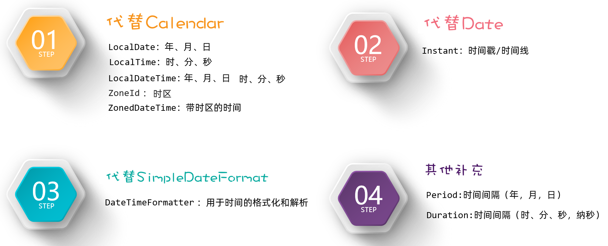

#### 2、创建对象

表示日期、时间、日期时间的类，分别是LocalDate、LocalTime、LocalDateTime。这三个类的用法套路基本都是一样的。它们都是不可变对象，进行修改时会获取新对象。

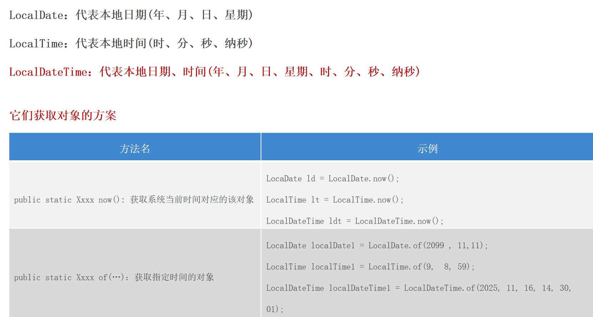

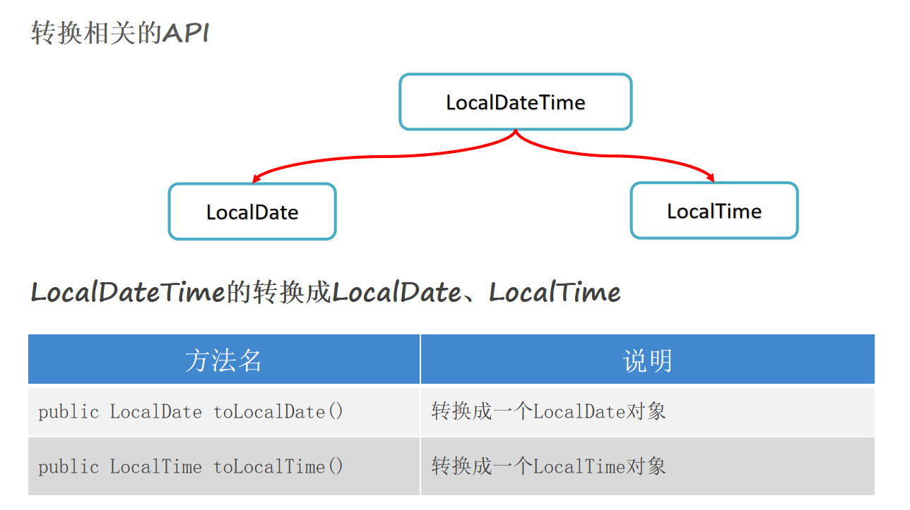

#### 3、LocalDate

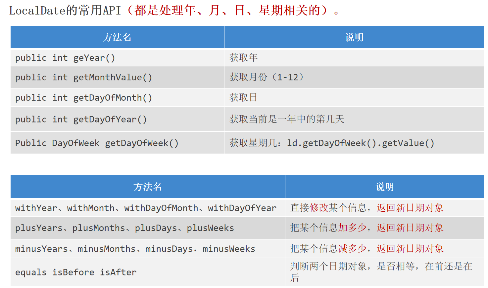

```java
public class Test1_LocalDate {
    public static void main(String[] args) {
        // 0、获取本地日期对象(不可变对象)
        LocalDate ld = LocalDate.now();
        System.out.println(ld); // "2023-07-05"

        // 1、获取日期对象中的信息
        int month = ld.getMonthValue(); // 月
        int dayOfYear = ld.getDayOfYear();  // 一年中的第几天
        int dayOfWeek = ld.getDayOfWeek().getValue(); // 星期几

        // 2、直接修改某个信息
        LocalDate ld2 = ld.withYear(2099);

        // 3、把某个信息加多少
        LocalDate ld3 = ld.plusYears(2);

        // 4、获取指定日期的LocalDate对象(参数：年，月，日)
        LocalDate ld4 = LocalDate.of(2099, 12, 11);

        // 5、判断2个日期对象，是否相等，在前还是在后
        System.out.println(ld4.isBefore(ld));// false
    }
}
```

#### 4、LocalTime

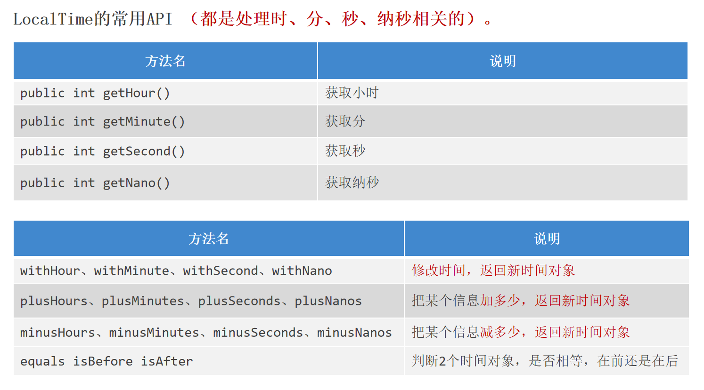

```java
public class Test2_LocalTime {
    public static void main(String[] args) {
        // 0、获取本地时间对象(不可变对象)
        LocalTime lt = LocalTime.now(); // 时 分 秒 纳秒
        System.out.println(lt); // "15:47:23.437787500"

        // 1、获取时间中的信息
        int nano = lt.getNano(); //纳秒

        // 2、修改时间
        // 3、加多少
        // 4、减多少
        // 5、获取指定时间的LocalTime对象(参数：时,分,秒(,纳秒))
        LocalTime lt2 = LocalTime.of(12, 12, 12);
        // 6、判断2个时间对象，是否相等，在前还是在后
    }
}
```

#### 5、LocalDateTime

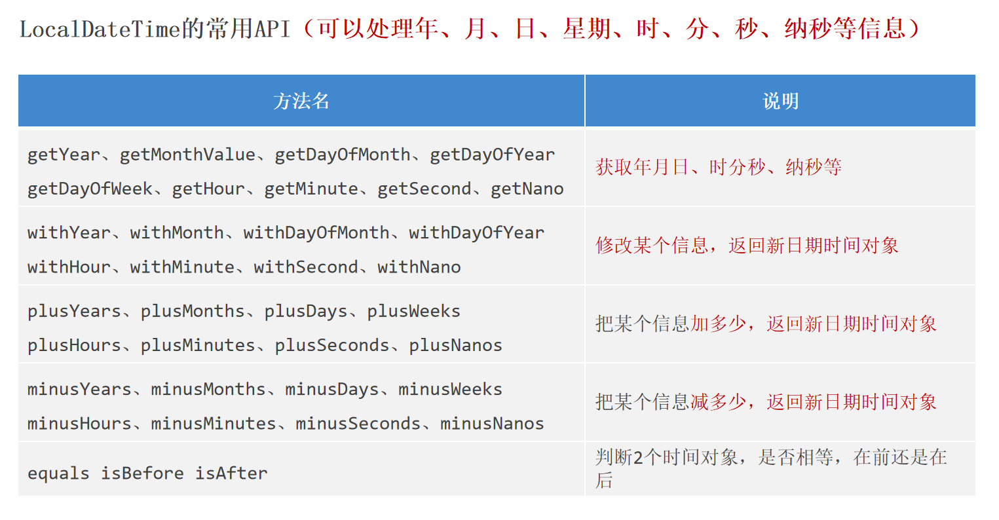

```java
public class Test3_LocalDateTime {
    public static void main(String[] args) {
        // 0、获取本地日期和时间对象(不可变对象)
        LocalDateTime ldt = LocalDateTime.now(); // 年 月 日 时 分 秒 纳秒
        System.out.println(ldt); // "2023-07-05T15:50:55.288620200"

        // 1、可以获取日期和时间的全部信息
        // 2、修改日期时间信息
        // 3、加多少
        // 4、减多少
        // 5、获取指定日期和时间的LocalDateTime对象(参数：年,月,日,时,分,秒(,纳秒))
        // 6、判断2个日期时间对象，是否相等，在前还是在后
        // 7、可以把LocalDateTime转换成LocalDate和LocalTime
        // public LocalDate toLocalDate()
        // public LocalTime toLocalTime()
        // public static LocalDateTime of(LocalDate date, LocalTime time)
        LocalDate ld = ldt.toLocalDate();
        LocalTime lt = ldt.toLocalTime();
        LocalDateTime ldt2 = LocalDateTime.of(ld, lt);
    }
}
```

### 7.2 时区

代表时区的两个类分别是ZoneId和ZonedDateTime

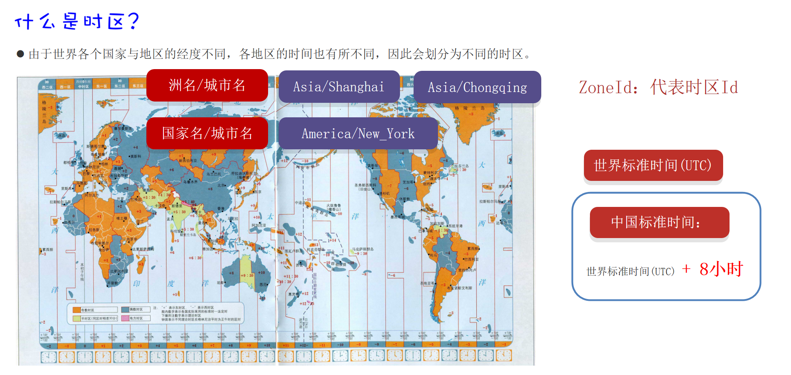

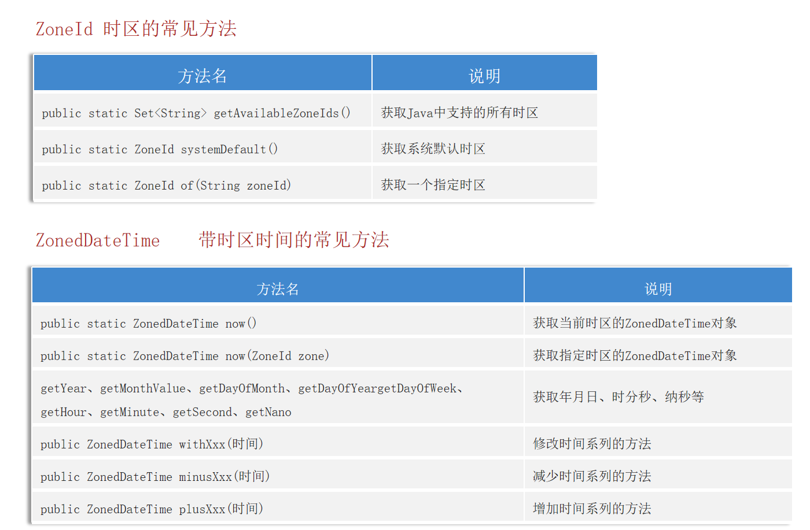


```java
public class Test4_ZoneId_ZonedDateTime {
    public static void main(String[] args) {
        // 目标：了解时区和带时区的时间。
        // 1、ZoneId的常见方法：
        // public static ZoneId systemDefault(): 获取系统默认的时区
        ZoneId zoneId = ZoneId.systemDefault();
        System.out.println(zoneId.getId());
        System.out.println(zoneId);

        // public static Set<String> getAvailableZoneIds(): 获取Java支持的全部时区Id
        System.out.println(ZoneId.getAvailableZoneIds());

        // public static ZoneId of(String zoneId) : 把某个时区id封装成ZoneId对象。
        ZoneId zoneId1 = ZoneId.of("America/New_York");

        // 2、ZonedDateTime：带时区的时间。
        // public static ZonedDateTime now(ZoneId zone): 获取某个时区的ZonedDateTime对象。
        ZonedDateTime now = ZonedDateTime.now(zoneId1);
        System.out.println(now);

        // 世界标准时间了
        ZonedDateTime now1 = ZonedDateTime.now(Clock.systemUTC());
        System.out.println(now1);

        // public static ZonedDateTime now()：获取系统默认时区的ZonedDateTime对象
        ZonedDateTime now2 = ZonedDateTime.now();
        System.out.println(now2);

        // Calendar instance = Calendar.getInstance(TimeZone.getTimeZone(zoneId1));
    }
}
```

### 7.3 Instant

通过获取Instant的对象可以拿到此刻的时间戳，该时间由两部分组成：从`1970-01-01 00:00:00`开始走到此刻的总秒数+不够1秒的纳秒数。

该类提供的方法如下图所示，可以用来获取当前时间，也可以对时间进行加、减、获取等操作。

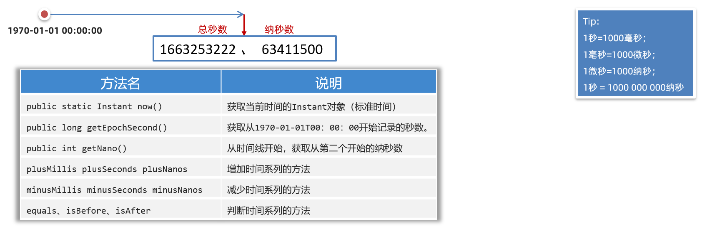

**作用：可以用来记录代码的执行时间，或用于记录用户操作某个事件的时间点**。传统的Date类，只能精确到毫秒，并且是可变对象；新增的Instant类，可以精确到纳秒，并且是不可变对象，推荐用Instant代替Date。

```java
public class Test5_Instant {
    public static void main(String[] args) {
       // 1、创建Instant的对象，获取此刻时间信息
        Instant now = Instant.now(); // 不可变对象

        // 2、获取总秒数
        long second = now.getEpochSecond();
        System.out.println(second);

        // 3、不够1秒的纳秒数
        int nano = now.getNano();
        System.out.println(nano);

        System.out.println(now);

        Instant instant = now.plusNanos(111);

        // Instant对象的作用：做代码的性能分析，或者记录用户的操作时间点
        Instant now1 = Instant.now();
        // 代码执行。。。。
        Instant now2 = Instant.now();

        LocalDateTime l = LocalDateTime.now();
    }
}
```

### 7.4 DateTimeFormater

DateTimeFormater是日期格式化器，可以对日期进行格式化和解析，它代替了原来的SimpleDateFormat类。


```java
public class Test6_DateTimeFormatter {
    public static void main(String[] args) {
        // 1、创建一个日期时间格式化器对象出来。
        DateTimeFormatter formatter = DateTimeFormatter.ofPattern("yyyy年MM月dd日 HH:mm:ss");

        // 2、对时间进行格式化
        LocalDateTime now = LocalDateTime.now();
        System.out.println(now);

        String rs = formatter.format(now); // 正向格式化
        System.out.println(rs);

        // 3、格式化时间，其实还有一种方案。
        String rs2 = now.format(formatter); // 反向格式化
        System.out.println(rs2);

        // 4、解析时间：解析时间一般使用LocalDateTime提供的解析方法来解析。
        String dateStr = "2029年12月12日 12:12:11";
        LocalDateTime ldt = LocalDateTime.parse(dateStr, formatter);
        System.out.println(ldt);
    }
}
```

### 7.5 Period

除以了上新增的类，JDK8还补充了两个类，一个叫Period类、一个叫Duration类。其中Period用来计算日期间隔（年、月、日），Duration用来计算时间间隔（时、分、秒、纳秒）。

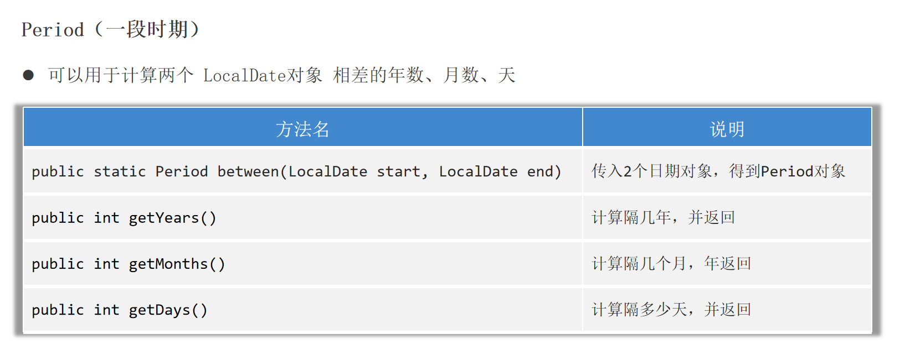

**注意：Period只能计算两个LocalDate对象之间的间隔**

```java
public class Test7_Period {
    public static void main(String[] args) {
        LocalDate start = LocalDate.of(2029, 8, 10);
        LocalDate end = LocalDate.of(2029, 12, 15);

        // 1、创建Period对象，封装两个日期对象。
        Period period = Period.between(start, end);

        // 2、通过period对象获取两个日期对象相差的信息。
        System.out.println(period.getYears());
        System.out.println(period.getMonths());
        System.out.println(period.getDays());
    }
}
```

### 7.6 Duration类

Duration类用来表示两个时间对象的时间间隔。**可以用于计算两个时间对象相差的天数、小时数、分数、秒数、纳秒数；支持LocalTime、LocalDateTime、Instant等时间**

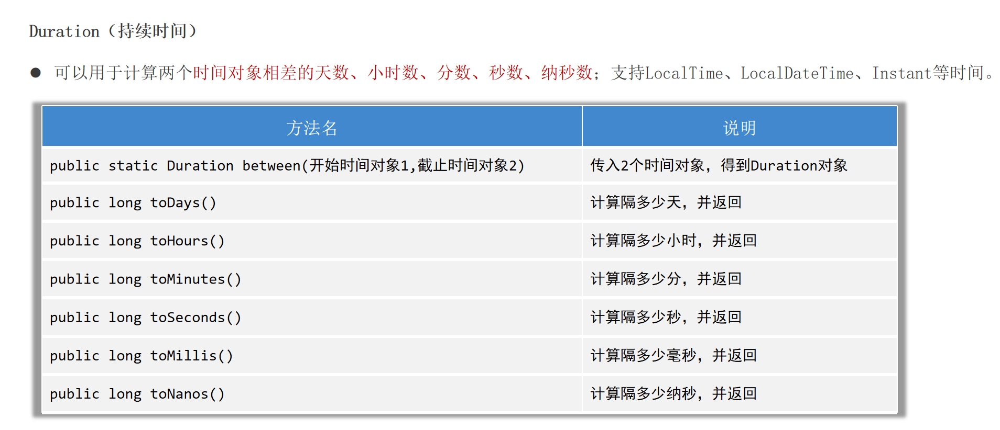

```java
public class Test8_Duration {
    public static void main(String[] args) {
        LocalDateTime start = LocalDateTime.of(2025, 11, 11, 11, 10, 10);
        LocalDateTime end = LocalDateTime.of(2025, 11, 11, 11, 11, 11);
        // 1、得到Duration对象
        Duration duration = Duration.between(start, end);

        // 2、获取两个时间对象间隔的信息
        System.out.println(duration.toDays());// 间隔多少天
        System.out.println(duration.toHours());// 间隔多少小时
        System.out.println(duration.toMinutes());// 间隔多少分
        System.out.println(duration.toSeconds());// 间隔多少秒
        System.out.println(duration.toMillis());// 间隔多少毫秒
        System.out.println(duration.toNanos());// 间隔多少纳秒

    }
}
```

## 8. 正则表达式

**正则表达式其实是由一些特殊的符号组成的，它代表的是某种规则。**

> 正则表达式的作用1：用来校验字符串数据是否合法
>
> 正则表达式的作用2：可以从一段文本中查找满足要求的内容

### 8.1 正则表达式书写规则

正则表达式可以简化校验数据的代码书写，我们使用String类的一个方法进行举例：

```java
// 判断字符串是否匹配正则表达式，匹配则返回true，不匹配返回false
public boolean matches(String regex)
```


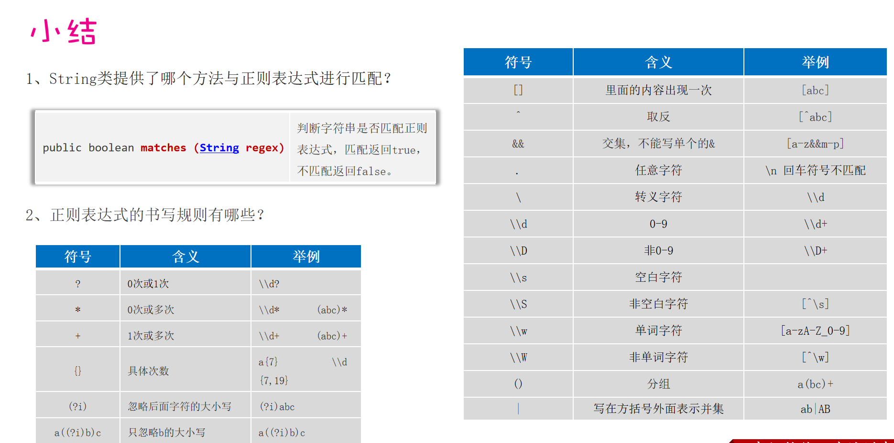

我们将这些规则，在代码中演示一下

```java
public class RegexTest2 {
    public static void main(String[] args) {
        // 1、字符类(只能匹配单个字符)
        System.out.println("a".matches("[abc]"));    // [abc]只能匹配a、b、c
        System.out.println("e".matches("[abcd]")); // false

        System.out.println("d".matches("[^abc]"));   // [^abc] 不能是abc
        System.out.println("a".matches("[^abc]"));  // false

        System.out.println("b".matches("[a-zA-Z]")); // [a-zA-Z] 只能是a-z A-Z的字符
        System.out.println("2".matches("[a-zA-Z]")); // false

        System.out.println("k".matches("[a-z&&[^bc]]")); // a到z，除了b和c
        System.out.println("b".matches("[a-z&&[^bc]]")); // false

        System.out.println("ab".matches("[a-zA-Z0-9]")); // false 注意：以上带 [内容] 的规则都只能用于匹配单个字符

        // 2、预定义字符(只能匹配单个字符)  .  \d  \D   \s  \S  \w  \W
        System.out.println("徐".matches(".")); // .可以匹配任意字符
        System.out.println("徐徐".matches(".")); // false

        System.out.println("3".matches("\\d"));  // \d: 0-9
        System.out.println("a".matches("\\d"));  //false

        System.out.println(" ".matches("\\s"));   // \s: 代表一个空白字符
        System.out.println("a".matches("\\s")); // false

        System.out.println("a".matches("\\S"));  // \S: 代表一个非空白字符
        System.out.println(" ".matches("\\S")); // false

        System.out.println("a".matches("\\w"));  // \w: [a-zA-Z_0-9]
        System.out.println("_".matches("\\w")); // true
        System.out.println("徐".matches("\\w")); // false

        System.out.println("徐".matches("\\W"));  // [^\w]不能是a-zA-Z_0-9
        System.out.println("a".matches("\\W"));  // false

        System.out.println("23232".matches("\\d")); // false 注意：以上预定义字符都只能匹配单个字符。

        // 3、数量词： ?   *   +   {n}   {n, }  {n, m}
        System.out.println("a".matches("\\w?"));   // ? 代表0次或1次
        System.out.println("".matches("\\w?"));    // true
        System.out.println("abc".matches("\\w?")); // false

        System.out.println("abc12".matches("\\w*"));   // * 代表0次或多次
        System.out.println("".matches("\\w*"));        // true
        System.out.println("abc12张".matches("\\w*")); // false

        System.out.println("abc12".matches("\\w+"));   // + 代表1次或多次
        System.out.println("".matches("\\w+"));       // false
        System.out.println("abc12张".matches("\\w+")); // false

        System.out.println("a3c".matches("\\w{3}"));   // {3} 代表要正好是n次
        System.out.println("abcd".matches("\\w{3}"));  // false
        System.out.println("abcd".matches("\\w{3,}"));     // {3,} 代表是>=3次
        System.out.println("ab".matches("\\w{3,}"));     // false
        System.out.println("abcde徐".matches("\\w{3,}"));     // false
        System.out.println("abc232d".matches("\\w{3,9}"));     // {3, 9} 代表是大于等于3次，小于等于9次

        // 4、其他几个常用的符号：(?i)忽略大小写  |或  ()分组
        System.out.println("abc".matches("(?i)abc")); // true
        System.out.println("ABC".matches("(?i)abc")); // true
        System.out.println("aBc".matches("a((?i)b)c")); // true
        System.out.println("ABc".matches("a((?i)b)c")); // false

        // 需求1：要求要么是3个小写字母，要么是3个数字。
        System.out.println("abc".matches("[a-z]{3}|\\d{3}")); // true
        System.out.println("ABC".matches("[a-z]{3}|\\d{3}")); // false
        System.out.println("123".matches("[a-z]{3}|\\d{3}")); // true
        System.out.println("A12".matches("[a-z]{3}|\\d{3}")); // false

        // 需求2：必须是"我爱"开头，中间可以是至少一个"编程"，最后至少是1个"666"
        System.out.println("我爱编程编程666666".matches("我爱(编程)+(666)+")); // true
        System.out.println("我爱编程编程66666".matches("我爱(编程)+(666)+")); // false
    }
}
```

### 8.2 正则表达式应用案例

- 正则表达式校验手机号码

```java
public class RegexTest3 {
    public static void main(String[] args) {
        checkPhone();
    }

    public static void checkPhone(){
        while (true) {
            System.out.println("请您输入您的电话号码(手机|座机): ");
            Scanner sc = new Scanner(System.in);
            String phone = sc.nextLine(); // 接收用户输入的一行数据
            // 18676769999  010-3424242424 0104644535
            if(phone.matches("(1[3-9]\\d{9})|(0\\d{2,7}-?[1-9]\\d{4,19})")){
                System.out.println("您输入的号码格式正确~~~");
                break;
            }else {
                System.out.println("您输入的号码格式不正确~~~");
            }
        }
    }
}
```

- 使用正则表达式校验邮箱是否正确

```java
public class RegexTest3 {
    public static void main(String[] args) {
        checkEmail();
    }

    public static void checkEmail(){
        while (true) {
            System.out.println("请您输入您的邮箱： ");
            Scanner sc = new Scanner(System.in);
            String email = sc.nextLine();
            /**
             * dlei0009@163.com
             * 25143242@qq.com
             * itheima@itcast.com.cn
             */
            if(email.matches("\\w{2,}@\\w{2,20}(\\.\\w{2,10}){1,2}")){
                System.out.println("您输入的邮箱格式正确~~~");
                break;
            }else {
                System.out.println("您输入的邮箱格式不正确~~~");
            }
        }
    }
}
```

### 8.3 正则表达式信息爬取

前面已经介绍了正则表达式的作用之一：用来校验数据格式的正确性。接下来我们介绍**正则表达式的第二个作用：在一段文本中查找满足要求的内容**。

案例需求如下

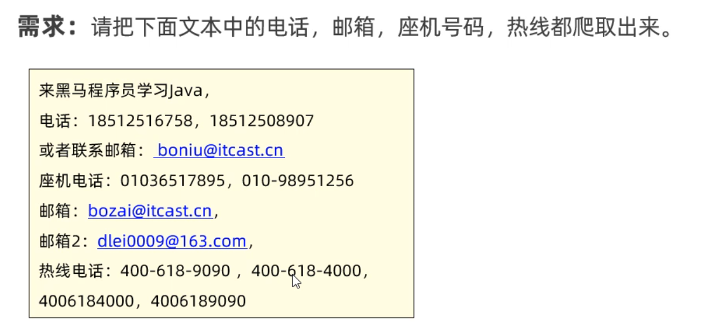

```java
public class RegexTest4 {
    public static void main(String[] args) {
        method1();
    }

    // 需求1：从以下内容中爬取出，手机，邮箱，座机、400电话等信息。
    public static void method1(){
        String data = " 来黑马程序员学习Java，\n" +
                "        电话：1866668888，18699997777\n" +
                "        或者联系邮箱：boniu@itcast.cn，\n" +
                "        座机电话：01036517895，010-98951256\n" +
                "        邮箱：bozai@itcast.cn，\n" +
                "        邮箱：dlei0009@163.com，\n" +
                "        热线电话：400-618-9090 ，400-618-4000，4006184000，4006189090";
        // 1、定义爬取规则
        String regex = "(1[3-9]\\d{9})|(0\\d{2,7}-?[1-9]\\d{4,19})|(\\w{2,}@\\w{2,20}(\\.\\w{2,10}){1,2})"
                + "|(400-?\\d{3,7}-?\\d{3,7})";
        // 2、把正则表达式封装成一个Pattern对象
        Pattern pattern = Pattern.compile(regex);
        // 3、通过pattern对象去获取查找内容的匹配器对象。
        Matcher matcher = pattern.matcher(data);
        // 4、定义一个循环开始爬取信息
        while (matcher.find()){
            String rs = matcher.group(); // 获取到了找到的内容了。
            System.out.println(rs);
        }
    }
}
```

### 8.4 正则表达式搜索、替换

正则表达式还具有替换、分割的功能，需要结合Stirng类中的方法使用：

- `String replaceAll(String regex, String replacement)`：使用给定的replacement替换此字符串所有匹配给定的正则表达式的子字符串
- `String[] split(String regex)`：把字符串按照regex内容分割，并返回分割后的字符串数组。其中regex可以是正则表达式。

```java
public class RegexTest5 {
    public static void main(String[] args) {
        // 需求1：请把下面字符串中的不是汉字的部分替换为 “-”
        String s1 = "古力娜扎ai8888迪丽热巴999aa5566马尔扎哈fbbfsfs42425卡尔扎巴";
        System.out.println(s1.replaceAll("\\w+", "-"));
        
        // 需求2(拓展)：某语音系统，收到一个口吃的人说的“我我我喜欢编编编编编编编编编编编编程程程！”，需要优化成“我喜欢编程！”。
        // (.)表示匹配一组相同的字符
        // \\1表示为这一组声明组号为1号
        // $1表示第1组代表的那个字符
        String s2 = "我我我喜欢编编编编编编编编编编编编程程程";
        System.out.println(s2.replaceAll("(.)\\1+", "$1"));

        // 需求3：请把下面字符串中的人名取出来，使用切割来做
        String s3 = "古力娜扎ai8888迪丽热巴999aa5566马尔扎哈fbbfsfs42425卡尔扎巴";
        String[] names = s3.split("\\w+");
        System.out.println(Arrays.toString(names));
    }
}
```

# 第08章_集合

## 1. Java集合框架概述

Java集合可分为Collection和Map两大体系。

### 1.1 Collection接口

Collection接口也称为`单列数据集合`，它继承了**Iterable接口**。Collection接口有以下三大子接口：

#### 1、List子接口

List子接口：元素有序、可重复、有索引。有以下子接口/实现类：

- ArrayList类
- LinkedList类
- Vector类（Vector还有一个著名的子类Stack，不过现在Vector和Stack均已过时）

#### 2、Set子接口

Set子接口：元素无序、不重复、无索引。有以下子接口/实现类：

- HashSet类
- LinkedHashSet类：它继承了HashSet，其底层可以记录元素添加时的先后顺序，但底层的元素位置仍是无序的
- SortedSet接口：它有一个实现类**TreeSet**，其元素是默认升序排序的

#### 3、Queue子接口

Queue子接口：定义了队列数据结构的操作方式。有以下子接口/实现类：

- PriorityQueue类
- Deque接口：定义了双端队列数据结构的操作方式，它有以下两个实现类：
  - ArrayDeque类
  - LinkedList类：注意，它既实现了List接口，也实现了Deque接口

### 1.2 Map接口

Map接口存储具有映射关系"key-value"对的集合，也称`双列数据集合`。其特征由key决定：元素无序、不重复、无索引。有以下子接口/实现类：

- HashMap类
- LinkedHashMap类：它继承了HashMap
- SortedMap接口：它有一个实现类**TreeMap**
- Hashtable类：它有一个著名的子类**Properties**

## 2. Collection

要求：向集合中添加元素时，元素所属的类需要重写一些方法(equals、hashCode、比较器)，因为Collection中contains()、remove()等方法需要根据以下规则判断两个元素是否相等：

- 对于List集合：`equals()`返回true则认为两个元素相等
- 对于HashSet和LinkedHashSet：`hashCode()`相等，且`equals()`返回true则认为两个元素相等
- 对于TreeSet：比较器返回0则认为两个元素相等

### 2.1 添加

- `boolean add(E e)`：添加元素
- `boolean addAll(Collection e)`：将集合e中的所有元素拷贝添加到当前集合中

### 2.2 判断

- `boolean isEmpty()`：判断当前集合是否为空
- `boolean contains(Object obj)`：判断当前集合中是否含有与obj相等的元素
- `boolean containsAll(Collection e)`：判断集合e中的元素是否在当前集合中都存在
- `boolean equals(Object o)`：判断当前集合与obj是否相等

### 2.3 删除

- `void clear()`：清空集合
- `boolean remove(Object obj)`：从当前集合中删除第一个与obj相等的元素
- `boolean removeAll(Collection coll)`：从当前集合中删除所有与coll集合中相同的元素。
- `boolean retainAll(Collection coll)`：从当前集合中删除两个集合中不同的元素，使得当前集合仅保留与coll集合中的元素相同的元素，即当前集合中仅保留两个集合的交集
- `boolean removeIf(Predicate filter)`：从当前集合中删除断言为true的元素

### 2.4 其它

- `int size()`：返回集合中的元素个数
- `Object[] toArray()`：返回包含当前集合中所有元素的Object数组
- `T[] toArray(T[] a)`：返回包含当前集合中所有元素的数组，数组中的元素都是T类型。常见用法：`String[] arr = c.toArray(new String[c.size()]);`
- `Iterator<E> iterator()`：返回集合的迭代器对象

**补充：将数组转化成集合，可以调用工具类Arrays中的asList方法**

```java
String[] arr = {"AA", "BB", "CC"};
List<String> list = Arrays.asList(arr);
```

**注意**：`List<T> Arrays.asList(T ... arr)`方法返回的List集合，既不是ArrayList实例，也不是Vector实例，而是一个**固定长度**的List集合，其长度无法被修改。

例题：

```java
@Test
public void test1() {
    Integer[] arr = {1, 2, 3};
    List<Integer> list = Arrays.asList(arr);
    System.out.println(list.size()); // 3
    System.out.println(list); // [1, 2, 3]

    int[] arr1 = {1, 2, 3};
    List<int[]> list1 = Arrays.asList(arr1);
    System.out.println(list1.size()); // 1
    System.out.println(list1); // [[I@77f03bb1]
}
```

## 3. Iterator接口

### 3.1 简介

Collection接口继承了Iterable接口，该接口中主要有以下方法：

- `Iterator<T> iterator()`：用于返回一个Iterator迭代器对象
- `void forEach(Consumer action)`：用于遍历集合

`Iterator`就是迭代器接口，主要用于遍历集合中的元素(注意**数组没有迭代器**)。

**注意：集合对象每次调用`iterator()`方法都会得到一个全新的迭代器对象，默认游标在集合的第一个元素之前**。

**Iterator接口的常用方法**：

- `E next()`: 先将迭代器后移，然后返回此时迭代器指向的元素。
- `boolean hasNext()`: 判断迭代器指向的位置的下一个位置的元素是否存在
- `void remove()`：从集合中删除此迭代器返回的最后一个元素(即之前调用`next()`返回的最后一个元素)

**注1**：在调用`it.next()`方法之前建议调用`it.hasNext()`进行检测判断。若不调用，且下一条记录无效，直接调用`it.next()`会抛出NoSuchElementException异常。

**注2**：在调用`it.remove()`前必须调用`it.next()`

### 3.2 迭代器的执行原理

Iterator迭代器对象在遍历集合时，内部采用指针的方式来跟踪集合中的元素，如图所示：


### 3.3 Collection批量删除元素

#### 方式1：使用迭代器

可以使用迭代器的`remove()`方法批量删除集合中指定条件的元素：

```java
List<String> list = new ArrayList<>();
list.add("Tom");
list.add("Alice");
list.add("hoho");
list.add("haha");

Iterator<String> iter = list.iterator();
while (iter.hasNext()) {
    String str = iter.next();
    if (str.contains("o")) {
        iter.remove();
    }
}
System.out.println(list); // [Alice, haha]
```

**注意事项**：

- Iterator可以删除集合的元素，但是遍历过程中只能通过迭代器对象的`remove()`方法进行删除，**不能用集合的方法修改基础集合**，否则迭代器的行为将会是未定义的。
- 如果还未调用`next()`或在上一次调用`next()`方法之后已经调用了`remove()`方法，再调用`remove()`都会报IllegalStateException。

#### 方式2：使用Lambda表达式

使用Collection接口的`removeIf()`方法结合Lambda表达式，即可实现批量条件删除：

```java
List<String> list = new ArrayList<>();
list.add("Tom");
list.add("Alice");
list.add("hoho");
list.add("haha");

list.removeIf(str -> str.contains("o"));
System.out.println(list); // [Alice, haha]
```

### 3.4 Collection的遍历方式

#### 方式1：迭代器遍历

```java
List<String> list = new ArrayList<>();
list.add("Tom");
list.add("Alice");
list.add("hoho");
list.add("haha");

// 1. 先获取迭代器对象
Iterator<String> iter = list.iterator();
// 2. 迭代器遍历
while (iter.hasNext()) {
    String str = iter.next();
    System.out.println(str);
}
```

#### 方式2：增强for循环

增强for循环可以用来遍历**数组和集合**。

**注意事项**：

- 增强for循环的执行过程中，是将集合或数组中的元素依次**赋值给临时变量**的。所以循环体中对临时变量的修改，往往不会导致原有集合或数组中元素的修改（例如基本数据类型、String）。
- 对于集合的遍历，增强for的底层其实是调用了Iterator迭代器。对于数组的遍历则不是，因为数组没有迭代器。

**练习**：

```java
public static void main(String[] args) {
    String[] str = new String[5];
    for (String myStr : str) {
        myStr = "atguigu";
        System.out.println(myStr); // atguigu
    }
    for (int i = 0; i < str.length; i++) {
        System.out.println(str[i]); // null
    }
}
```

#### 方式3：Lambda表达式遍历

使用Collection接口从Iterable接口继承来的`forEach()`方法结合Lambda表达式可以对集合进行遍历

- `void forEach(Consumer action)`

```java
List<String> list = new ArrayList<>();
list.add("Tom");
list.add("Alice");
list.add("hoho");
list.add("haha");

list.forEach(str -> System.out.println(str));
```

## 4. Collection子接口1：List

### 4.1 List接口方法

List集合的特点是：元素有序、可重复、有索引。List除了从Collection继承的方法外，还添加了一些`根据索引`来操作集合元素的方法。

因此，List的遍历方式除了Collection的三种遍历方式以外，还可以通过普通的for循环利用索引来遍历。

#### 1、插入元素

- `void add(int index, E ele)`：在index位置插入元素ele
- `boolean addAll(int index, Collection c)`：从index位置开始将c中的所有元素添加进来

#### 2、获取元素

- `E get(int index)`：获取指定index位置的元素
- `List<E> subList(int fromIndex, int toIndex)`：返回`[fromIndex, toIndex)`位置的子集合

#### 3、查找元素

- `int indexOf(Object o)`：返回o在集合中首次出现的位置，如果集合不包含元素o，则返回-1
- `int lastIndexOf(Object o)`：返回o在集合中末次出现的位置，如果集合不包含元素o，则返回-1

#### 4、修改或删除元素

- `E set(int index, E element)`：修改指定index位置的元素为element，返回被修改的元素
- `E remove(int index)`：删除指定index位置的元素，返回被删除的元素
- `void replaceAll(UnaryOperator<E> operator)`：将所有元素根据指定的操作进行替换

#### 5、创建List

- `static List<E> copyOf(Collection coll)`：复制集合coll中的元素，得到一个**不可修改**的List集合
- `static List<E> of(E... elements)`：根据可变形参，得到一个**不可修改**的List集合

#### 6、排序

- `void sort(Comparator c)`：排序。若参数为null，则自然排序（要求元素类必须实现Comparable接口）。


### 4.2 List实现类之一：ArrayList

ArrayList是List接口的`主要实现类`。ArrayList是线程不安全的、效率高。ArrayList底层是基于数组实现的。

**ArrayList的构造器**：

```java
ArrayList() // 空参构造器
ArrayList(int initialCapacity) // 直接指定底层数组的容量
ArrayList(Collection<? extends E> c) // 用另一个集合中的元素来初始化
```

### 4.3 List实现类之二：LinkedList

LinkedList集合线程不安全，底层是基于双向链表实现的。特点：查询慢，增删相对较快，对首尾元素进行增删改查的速度是极快的。

**LinkedList的构造器**：

```java
LinkedList()
LinkedList(Collection<? extends E> c)
```

### 4.4 List实现类之三：Vector

Vector是一个古老的集合，已经过时，其效率太低。底层实现基本与ArrayList相同，区别之处在于Vector是`线程安全`的，所以效率很低，而且还有很多冗余的方法。

## 5. Collection子接口2：Set

### 5.1 Set接口概述

Set集合的特点是：元素无序、不重复、无索引。**注意Set集合不允许包含相同的元素，如果试图把一个相同的元素加入同一个Set集合中，则添加操作失败，只会保留之前的元素**。Set接口相较于Collection接口基本没有提供额外的方法，只额外提供了以下两个创建Set的方法：

- `static Set<E> copyOf(Collection coll)`：复制集合coll中的元素，得到一个**不可修改**的Set集合
- `static Set<E> of(E... elements)`：根据可变形参，得到一个**不可修改**的Set集合

### 5.2 Set实现类之一：HashSet

#### 1、HashSet概述

HashSet是Set接口的主要实现类，它是线程不安全的。

**HashSet和LinkedHashSet集合判断两个元素相等的标准：两个对象通过 `hashCode()` 方法得到的哈希值相等，并且两个对象的 `equals() `方法返回值为true**。

因此，对于存放在HashSet和LinkedHashSet容器中的对象，**对应的类一定要重写`hashCode()`和`equals()`方法**，并且要保证两个方法的一致性，即equals返回true的两个对象hashCode必须相同。

**说明**：为了保证equals和hashCode的一致性，对象中用作equals()方法比较的Field，都应该用来计算hashCode值。开发中直接调用IDEA里的快捷键自动重写equals()和hashCode()方法即可。

**HashSet的构造器**：

```java
HashSet()
HashSet(Collection<? extends E> c)
HashSet(int initialCapacity) // 一般不使用
HashSet(int initialCapacity, float loadFactor) // 一般不使用
```

#### 2、HashSet底层原理

**哈希值**：就是一个int类型的数值，Java中每个对象都有一个哈希值；Java中的所有对象，都可以调用Obejct类提供的`hashCode()`方法，返回该对象自己的哈希值。

- 同一个对象多次调用`hashCode()`方法返回的哈希值是相同的。
- 不同的对象，它们的哈希值一般不相同，但也有可能会相同(哈希碰撞)。

**HashSet集合底层原理**

HashSet集合底层其实就是由HashMap实现的，而HashMap是基于哈希表实现的，哈希表是一种增删改查性能都较好的数据结构。哈希表的实现根据JDK版本的不同也是有区别的

- JDK7：哈希表 = 数组 + 单向链表
- JDK8：哈希表 = 数组 + 单向链表 + 红黑树

### 5.3 Set实现类之二：LinkedHashSet

LinkedHashSet是HashSet的子类，也是线程不安全的，底层是由LinkedHashMap实现的，而LinkedHashMap依然是基于哈希表(数组、单向链表、红黑树)实现的，但同时还使用`双向链表`维护元素添加时的先后顺序。LinkedHashSet`插入性能略低`于HashSet，但在按照添加元素时的顺序遍历访问全部元素时有很好的性能。

**LinkedHashSet的构造器**：与HashSet类似

**练习**：

```java
public class MyTest {
    public static void main(String[] args) {
        HashSet set = new HashSet();
        Person p1 = new Person(1001,"AA");
        Person p2 = new Person(1002,"BB");

        set.add(p1);
        set.add(p2);
        p1.name = "CC";
        set.remove(p1);
        System.out.println(set); // 2个元素
        set.add(new Person(1001,"CC"));
        System.out.println(set); // 3个元素

        set.add(new Person(1001,"AA"));
        System.out.println(set); // 4个元素
    }
}
class Person {
    public int id;
    public String name;
    public Person() {
    }
    public Person(int id, String name) {
        this.id = id;
        this.name = name;
    }
    @Override
    public boolean equals(Object o) {
        if (this == o) return true;
        if (o == null || getClass() != o.getClass()) return false;
        Person person = (Person) o;
        return id == person.id && Objects.equals(name, person.name);
    }
    @Override
    public int hashCode() {
        return Objects.hash(id, name);
    }
    @Override
    public String toString() {
        return "Person{" +
                "id=" + id +
                ", name='" + name + '\'' +
                '}';
    }
}
```

解释：将p1加入HashSet时，用的hashCode是"AA"生成的，记为h1，哈希表中将该元素和h1封装成Entry对象e1后存入。改成"CC"后p1对象的hashCode发生了变化，记为h2，所以remove的时候拿着h2自然无法将e1删除，因为其内部hash属性值是h1。同理，再添加哈希值为h2的元素时也不会产生冲突。最后添加哈希值为h1的元素，与e1产生了Hash冲突，此时调用equals方法发现两者不同，哈希表中的是"CC"，新添加的是"AA"，于是添加成功。


### 5.4 Set实现类之三：TreeSet

TreeSet集合线程不安全，其元素默认是升序排序的。其底层是由TreeMap实现的，而TreeMap底层是由红黑树实现的。

**注意**：

- 对于TreeSet集合而言，它判断`两个对象是否相等的唯一标准`是：两个对象通过`compareTo(Object obj)或compare(Object o1,Object o2)`方法比较返回值，返回值为0，则认为两个对象相等。因此，hashCode()和equals()方法可以无需重写。
- 添加到TreeSet中的元素必须是同一个类型的对象，否则会报ClassCastException

**TreeSet必须至少实现两种排序方法之一**：`自然排序`和`定制排序`。对于定制排序，可以通过调用TreeSet集合的有参构造器来设置Comparator。

**TreeSet的构造器**：

```java
TreeSet()
TreeSet(Comparator<? super E> comparator)
TreeSet(Collection<? extends E> c)
```

**TreeSet额外提供的方法**：

- `E first()`：返回第一个元素
- `E last()`：返回最后一个元素


## 6. Collection子接口3：Queue

### 6.1 Queue接口方法

- `boolean offer(E e)`：队尾添加元素e，成功返回true，失败返回false
- `E poll()`：返回并删除队首元素
- `E peek()`：返回队首元素

> 说明：Queue还提供了三个方法，`add(e)`, `remove()`, `element()`，这三个方法分别与上述三个方法作用相同，只不过会在失败时抛异常。

### 6.2 Queue的实现类：PriorityQueue

PriorityQueue是优先级队列，底层采用堆这种数据结构（实际上就是使用一个数组`Object[]`实现的，堆顶元素就是索引为0的元素）。默认情况下创建的是一个**小根堆**(即根元素最小)，如果想指定排序规则，需要在构造器中传入一个比较器参数。

**构造器**

- `PriorityQueue()`：无参空构造器，默认小根堆
- `PriorityQueue(Comparator<? super E> comparator)`：传入一个比较器指定排序规则

举例：

```java
Queue<Integer> q1 = new PriorityQueue<>(); // 小根堆
Queue<Integer> q2 = new PriorityQueue<>((o1, o2) -> o2 - o1); // 大根堆
```

**常用API**：

- `boolean offer(E e)`：将e加入优先级队列，成功返回true，失败返回false
- `E poll()`：返回并弹出堆顶元素
- `E peek()`：返回堆顶元素

### 6.3 Queue的子接口：Deque

Deque提供了以下三类核心API

#### 1、作为双端队列的API

- `boolean offerFirst(E e)`：队首插入元素
- `boolean offerLast(E e)`：队尾插入元素
- `E pollFirst()`：返回并删除队首元素
- `E pollLast()`：返回并删除队尾元素
- `E peekFirst()`：返回队首元素
- `E peekLast()`：返回队尾元素

> 说明：Deque还提供了六个方法`addFirst(e)`, `addLast(e)`, `removeFirst()`, `removeLast()`, `getFirst()`, `getLast()`，其作用分别与上述六个方法相同，只不过会在失败时抛异常。

#### 2、作为栈的API

- `void push(E e)`：入栈
- `E pop()`：出栈，并返回弹出的元素
- `E peek()`：返回栈顶元素

> 注意：栈顶，其实就是队首

#### 3、作为队列的API

同Queue接口提供的方法

### 6.4 Deque的实现类之一：ArrayDeque

ArrayDeque是Deque的数组实现，同样可用作双端队列、栈、队列。其底层是用一个循环数组实现的，能保证对头尾元素的高效操作：

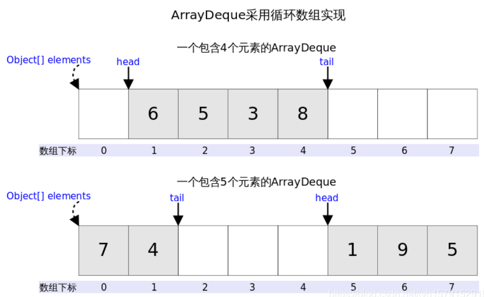

用一个`Object[]`数组存储数据，head属性表示队首，tail属性表示队尾，从head开始往右一直到tail是队列中的元素。

> 如果将ArrayDeque用作栈，则head表示栈顶。

### 6.5 Deque的实现类之二：LinkedList

LinkedList是Deque的链表实现，同样可用作双端队列、栈、队列。除此以外，它也实现了List接口，所以还能用作列表。

LinkedList底层用first属性表示首节点（即队首、栈顶），用last属性表示尾节点（即队尾）

## 7. Map

### 7.1 Map接口概述

Map集合称为双列集合，打印格式为：`{key1=value1, key2=value2, key3=value3, ...}`，一次需要存一对数据做为一个元素。Map集合的每个元素`key=value`是一个Entry对象，Map集合也被叫做键值对集合。

Map集合的所有键是不允许重复的，但值可以重复，每一个键只能找到自己对应的值。Map系列集合的特点都是由键决定的：无序、不重复、无索引。**注意如果试图把一个相同的key加入同一个Map集合中，则会直接用新的value替换之前元素的value**。

因此，对于value所属的类，需要重写`equals()`方法。而对于key所属的类，对HashMap来说需要重写`hashCode()`和`equals()`方法，对TreeMap来说需要给出比较器。

### 7.2 Map接口方法

#### 1、添加或修改

- `V put(K key, V value)`：将指定key-value添加到当前map对象中，添加成功则返回null。如果key已经存在，则直接替换对应的value值，然后返回原来的value。
- `void putAll(Map m)`：将m中的所有key-value对存放到当前map中

#### 2、删除

- `V remove(Object key)`：移除指定key的key-value对，并返回value
- `boolean remove(Object key, Object value)`：移除指定的key-value对
- `void clear()`：清空

#### 3、查找

- `V get(Object key)`：获取指定key对应的value
- `V getOrDefault(Object key, V defaultValue)`：获取指定key对应的value，若没有该key，则返回defaultValue
- `boolean containsKey(Object key)`：是否包含指定的key
- `boolean containsValue(Object value)`：是否包含指定的value

#### 4、元视图操作

- `Set<K> keySet()`：返回所有key构成的Set集合
- `Collection<V> values()`：返回所有value构成的Collection集合
- `Set<Map.Entry<K, V>> entrySet()`：返回所有key-value对(Entry对象)构成的Set集合

#### 5、基础API

- `int size()`：返回map中key-value对的个数
- `boolean isEmpty()`：判断当前map是否为空
- `void forEach(BiConsumer action)`：遍历

#### 6、创建Map或Entry

- `static Map<K, V> copyOf(Map map)`：复制map中的元素，得到一个**不可修改**的Map集合
- `static Map<K, V> ofEntries(Entry... entries)`：根据可变形参，得到一个**不可修改**的Map集合
- `static Entry<K, V> entry(K k, V v)`：创建一个**不可修改**的Entry对象

#### 7、Entry接口

Entry接口定义在Map接口内部，有以下一些常用API

```java
    interface Entry<K, V> {
        K getKey(); // 获取key
        V getValue(); // 获取value
        V setValue(V value); // 修改value值
        ...
    }
```

### 7.3 Map的遍历方式

注意Map没有迭代器，所以无法直接通过迭代器遍历。

#### 方式1：获取keySet后遍历

```java
Map<String, Double> map = new HashMap<>();
map.put("张三", 178.5);
map.put("李四", 180.0);
map.put("王五", 168.3);
// 1、获取Map集合的全部键
Set<String> keys = map.keySet();
for (String key : keys) {
    // 2、根据键获取对应的值
    double val = map.get(key);
    System.out.println(key + "->" + val);
}
```

#### 方式2：获取entrySet集合后遍历

```java
Map<String, Double> map = new HashMap<>();
map.put("张三", 178.5);
map.put("李四", 180.0);
map.put("王五", 168.3);
// 1、获取Map集合的全部键值对对象
Set<Map.Entry<String, Double>> entries = map.entrySet();
for (Map.Entry<String, Double> entry : entries) {
    // 2. 获取键和值
    String key = entry.getKey();
    Double val = entry.getValue();
    System.out.println(key + "->" + val);
}
```

#### 方式3：Lambda表达式遍历

使用Map接口的默认方法`forEach()`结合lambda表达式来遍历。`forEach()`方法的参数是一个函数式接口BiConsumer。

```java
Map<String, Double> map = new HashMap<>();
map.put("张三", 178.5);
map.put("李四", 180.0);
map.put("王五", 168.3);

map.forEach((k, v) -> System.out.println(k + "->" + v));
```

### 7.4 Map实现类之一：HashMap

HashMap是Map接口的主要实现类，它是线程不安全的。允许添加null键和null值。HashMap底层是基于哈希表实现的，只不过HashMap计算hashCode时只依赖Entry对象的键，而不依赖Entry对象的值。

**HashMap的构造器**：

```java
HashMap()
HashMap(Map<? extends K, ? extends V> m)
HashMap(int initialCapacity) // 一般不使用
HashMap(int initialCapacity, float loadFactor) // 一般不使用
```

### 7.5 Map实现类之二：LinkedHashMap

LinkedHashMap是HashMap的子类，也是线程不安全的，其底层数据结构依然是基于哈希表实现的，只是每个键值对元素又额外的多了一个双向链表来记录添加元素的先后顺序。

**LinkedHashMap的构造器**：与HashMap类似

### 7.6 Map实现类之三：TreeMap

TreeMap集合线程不安全，底层是基于红黑树实现的排序(按照键的大小默认升序排序，只能对键排序)。

**注意**：

- 对于TreeMap集合而言，它判断`两个key是否相等的唯一标准`是：两个key通过`compareTo(Object obj)或compare(Object o1,Object o2)`方法比较返回值，返回值为0，则认为相等。
- 添加到TreeMap中的key必须是同一个类型的对象，否则会报ClassCastException异常

**TreeMap的键必须至少实现两种排序方法之一**：`自然排序`和`定制排序`。对于定制排序，可以通过调用TreeMap集合的有参构造器来设置Comparator对象。

**TreeMap的构造器**：

```java
TreeMap()
TreeMap(Comparator<? super K> comparator)
TreeMap(Map<? extends K, ? extends V> m)
```

### 7.7 Map实现类之四：Hashtable

Hashtable是Map接口的古老实现类，线程安全、效率低。实现原理与HashMap类似，底层使用古老的哈希表，即数组+单向链表。注意Hashtable不可以添加null的key或value值。

### 7.8 Map实现类之五：Properties

#### 1、简介

Properties类是Hashtable的子类，它是用来代表属性文件的，通过Properties可以读写属性文件里的内容。Properties中要求key和value都是**字符串类型**。存取数据时，建议使用该集合提供的特有API。

**属性文件**：后缀为`.properties`的文件，称之为属性文件，它可以很方便的存储一些键值对数据，经常作为配置文件使用。

- 属性文件里面的每一行都是一个键值对，键和值中间用`=`隔开，每一行末尾不要加空格、分号等字符。比如 `admin=123456`
- `#`表示这行是注释信息
- 键不能重复，值可以重复

#### 2、读取属性文件中的键值对

- `void load(InputStream is)`：通过字节输入流，读取属性文件里的键值对数据
- `void load(Reader reader)`：通过字符输入流，读取属性文件里的键值对数据。(建议使用)
- `String getProperty(String key)`：根据键获取值(等效于`get()`方法)
- `Set<String> stringPropertyNames()`：获取全部键的集合(等效于`keySet()`方法)

使用Properties读取属性文件的步骤如下：

1. 创建一个空的Properties对象
2. 调用`load()`方法加载属性文件中的键值对数据到当前Properties对象中
3. 调用`getProperty()`方法根据键取值

举例：

```java
public static void main(String[] args) throws IOException {
    // 1. 创建一个空的Properties对象
    Properties prop = new Properties();
    // 2. 加载属性文件中的键值对数据到当前Properties对象中
    prop.load(new FileReader("E:\\application.properties"));
    // 3. 根据键取值
    Set<String> keys = prop.stringPropertyNames();
    for (String key : keys) {
        String val = prop.getProperty(key);
        System.out.println(key + "->" + val);
    }
}
```

#### 3、向属性文件中写入键值对

- `Object setProperty(String key, String value)`：保存键值对数据到Properties对象中去
- `void store(OutputStream os, String comments)`：把键值对数据，通过字节输出流写出到属性文件里去
- `void store(Writer w, String comments)`：把键值对数据，通过字符输出流写出到属性文件里去(建议使用)

使用Properties向属性文件中写入键值对的步骤如下：

1. 创建一个空的Properties对象
2. 调用`setProperty()`存储一些键值对数据
3. 调用`store()`将Properties对象的键和值写到属性文件中。注意，`store()`方法的第二个参数指的是注释，必须要传参。

举例：

```java
public static void main(String[] args) throws IOException {
    // 1. 创建一个空的Properties对象
    Properties prop = new Properties();
    // 2. 存储一些键值对数据
    prop.setProperty("server.port", "8888");
    prop.setProperty("name", "wsy");
    // 3. 将Properties对象的键和值写到属性文件中
    prop.store(new FileWriter("E:\\application.properties"),
            "保存配置文件!");
}
```

## 8. Collections工具类

Arrays是操作数组的工具类，而Collections是一个操作Collection和Map集合的工具类。以下方法均为静态方法，为了简便我们省略`static`关键字。

### 8.1 改变元素顺序

- `void sort(List list)`：根据元素的自然顺序对指定list集合元素按升序排序
- `void sort(List list, Comparator c)`：根据比较器c对list集合元素进行排序
- `void shuffle(List list)`：对list中元素进行随机打乱
- `void reverse(List list)`：反转list中元素的顺序
- `void swap(List list, int i, int j)`：将指定list集合中的i处元素和j处元素进行交换

### 8.2 查找

- `T max(Collection coll)`：根据元素的自然顺序，返回给定集合中的最大元素。同理还有`min()`方法。
- `T max(Collection coll, Comparator c)`：根据比较器c返回集合中的最大元素。同理还有`min()`方法。
- `int binarySearch(List list, T key)`：在有序的list集合中二分查找与key相同元素的下标。如果未能找到，则返回一个负数；如果有多个与key相同的元素，不能保证会返回哪一个下标。
- `int binarySearch(List list, T key, Comparator c)`：list集合需要按比较器c的规则有序，进行二分查找
- `int frequency(Collection c, Object o)`：返回集合中指定元素的出现次数

### 8.3 批量添加和替换

- `boolean addAll(Collection c, T... elements)`：将所有指定元素添加到指定集合c中
- `boolean replaceAll(List<T> list, T oldVal, T newVal)`：使用newVal替换list集合中的所有oldVal

### 8.4 复制集合

- `void copy(List dest, List src)`：将src中的内容复制到dest中，注意dest的大小不能小于src的大小。
- `Collection unmodifiableCollection(Collection c)`：根据c复制得到一个**不可修改**的集合对象。Collections工具类还提供了许多其他`unmodifiableXxx()`，作用都类似。

### 8.5 得到线程同步的集合

Collections工具类中提供了多个`synchronizedXxx()`方法，可以根据指定集合得到一个新的线程同步的集合，从而解决线程安全问题：

- `Collection<T> synchronizedCollection(Collection<T> c)`
- `List<T> synchronizedList(List<T> list)`
- `Set<T> synchronizedSet(Set<T> s)`
- `SortedSet<T> synchronizedSortedSet(SortedSet<T> s)`
- `NavigableSet<T> synchronizedNavigableSet(NavigableSet<T> s)`
- `Map<K,V> synchronizedMap(Map<K,V> m)`
- `SortedMap<K,V> synchronizedSortedMap(SortedMap<K,V> m)`
- `NavigableMap<K,V> synchronizedNavigableMap(NavigableMap<K,V> m)`

举例：

```java
List<Integer> list1 = new ArrayList<>();
List<Integer> list2 = Collections.synchronizedList(list1);
// 返回的list2就是线程安全的
```

# 第09章_泛型

## 1. 泛型概述

泛型(Generic)即为`类型参数`，即在定义类、接口、方法时，同时声明了一个或者多个类型变量（如：`<E>`），称为泛型类、泛型接口、泛型方法。

**泛型的作用**：泛型提供了在**编译阶段**约束所能操作的数据类型，并自动进行检查的能力。这样可以避免强制类型转换，及其可能出现的异常。

**泛型的本质：把具体的数据类型作为参数传给类型变量**。

**注意**：泛型的类型变量，只能使用**引用数据类型**进行赋值（不能使用基本数据类型，但可以使用包装类替换）

**泛型擦除**：事实上，泛型是工作在编译阶段的，一旦程序编译成class文件，**class文件中就不存在泛型了**，这就是泛型擦除。

## 2. 自定义泛型结构

### 2.1 自定义泛型类

自定义泛型类的格式如下：

```java
// 这里的<E, T>指的就是类型变量，可以是一个，也可以是多个
public class 类名<E, T> {
    
}
```

举例：

```java
public class MyArrayList<E> {
    private Object[] arr = new Object[100];
    private int size = 0;
    public boolean add(E e) {
        arr[size++] = e;
        return true;
    }
    public E get(int index) {
        return (E) arr[index];
    }
}
public class Test {
    public static void main(String[] args) {
        MyArrayList<String> arr = new MyArrayList<>();
        arr.add("java1");
        arr.add("java2");
        System.out.println(arr.get(1)); // java2
    }
}
```

除此之外，类型变量也可以做一定的限定：

```java
public class MyClass<E extends Animal> {
}
public class Test {
    public static void main(String[] args) {
        // 报错，必须是Animal类型或者其子类
        // MyClass<String> a = new MyClass<>(); 
        
        MyClass<Animal> b = new MyClass<>();
        MyClass<Cat> c = new MyClass<>();
    }
}
```

当我们在类或接口中定义某个成员时，该成员的相关类型是不确定的，而这个类型需要在使用这个类或接口时才可以确定，那么我们可以使用泛型类、泛型接口。

**说明**

- 如果在创建自定义泛型类的对象时，没有指明泛型参数类型，那么泛型将被擦除，泛型对应的类型均按照Object处理，但不等价于Object。
- 除创建泛型类对象外，子类继承泛型类时、实现类实现泛型接口时，也可以确定泛型结构中的泛型参数。
- 如果我们设计子类继承某个泛型类时，子类也不确定泛型的类型，则子类也需要继续使用泛型参数。例如`class Son<E> extends Dad<E> {}`
- 除此之外，我们还可以在现有的父类的泛型参数的基础上，新增泛型参数。例如`class Son<E, T> extends Dad<E> {}`

**注意**

- **对于数组的声明，无法直接使用泛型参数**，即`E[] arr = new E[10];`是错误的，因为数组不是泛型类。我们需要使用以下语句声明数组`E[] arr = (E[]) new Object[10];`
- 在本类/本接口的**静态方法**中，无法使用类/接口上声明的泛型参数
- **异常类不能是泛型类**

### 2.2 自定义泛型接口

定义格式如下：

```java
修饰符 interface 接口名<E> {
    
}
```

例如
```java
// 泛型接口
public interface Data<T> {

}
// 实现类
public class StringData implements Data<String> {

}
```

泛型接口的具体细节与泛型类类似。

### 2.3 自定义泛型方法

泛型方法的格式如下：

```java
修饰符 <E> 返回值类型 方法名(形参列表) {
    
}
```

举例：

```java
public class Test{
    public static void main(String[] args){
        ArrayList<Animal> ans = new ArrayList<>();
        go(ans);
    }
    // 这是一个泛型方法<T>表示一个不确定的数据类型，由调用者确定
    public static <T> void go(ArrayList<T> t){
    }
}
```

某个方法形参类型或者返回值类型不确定时，这个方法可以单独定义泛型参数，成为一个泛型方法。

**说明**

- 泛型方法，与其所在的类是否是泛型类没有关系。换而言之，如果一个方法只使用了其泛型类上定义的泛型参数，就并不是一个泛型方法。简而言之，只有在方法修饰符后定义了泛型参数`<E>`才是一个泛型方法。
- 泛型方法中的泛型参数的具体类型是在方法被调用时确定的
- 泛型方法可以声明为static

## 3. 泛型在继承上的体现

**类`SuperA`是类`A`的父类或接口，则`G<SuperA>`与`G<A>`是并列的两个类，没有任何子父类的关系**。比如`ArrayList<Object>`与`ArrayList<String>`没有子父类关系，所以下面的语句显然是错误的：

```java
ArrayList<Object> list1 = new ArrayList<>();
ArrayList<String> list2 = new ArrayList<>();
list1 = list2; // 报错
```

**类`SuperA`是类`A`的父类或接口，则`A<G>`是`SuperA<G>`的子类(或实现类)**，即`A<G>`的实例可以赋值给`SuperA<G>`类型的变量。比如，`ArrayList<String>`就是`List<String>`的子类，所以下面的赋值是正确的：

```java
List<String> list1 = null;
ArrayList<String> list2 = new ArrayList<>();
list1 = list2; 
```

## 4. 通配符的使用

根据上述讨论，我们发现在方法传递参数时，参数类型如果限制为`List<Object>`，就无法传入`List<String>`类型的实参，即使是`ArrayList<String>`也无法传入，因为泛型参数已经限定为`Object`，我们只能传入`A<Object>`类型的参数，其中`A`是`List`或其实现类。

为了让我们使用泛型时更具有通用性，我们可以使用类型通配符`?`，它表示一切泛型参数。

### 4.1 通配符

例如：`List<?>`就可以看作是各种List泛型的父类，如`List<String>`、`List<Object>`、`ArrayList<Object>`等等。所以将`List<String>`类型的对象赋值给`List<?>`是完全可以的。

```java
public class MyTest {
    public static void main(String[] args) {
        List<String> l1 = new ArrayList<>();
        ArrayList<String> l2 = new ArrayList<>();
        l1.add("123");
        l2.add("456");
    }
    public static void method(List<?> list) {
        // 1. 通配符的读操作
        // String obj = list.get(0); //报错
        Object obj = list.get(0);
        
        // 2. 通配符的写操作
        // list.add("123"); //报错
        list.add(null);
    }
}
```

**通配符的读操作**：由于`?`可能代表一切类型，所以进行读操作的时候，读出来的值类型必须声明为`Object`

**通配符的写操作**：由于`?`可能代表一切类型，所以为了不产生冲突，只能写入`null`

**使用注意点**：

1. `?`不能用在泛型方法声明上，即返回值类型前面的`<>`不能使用`?`
    ```java
    public static <?> void test(ArrayList<?> list){} // 报错
    ```

2. `?`不能用在泛型类的声明上
    ```java
    class GenericTypeClass<?> {} // 报错
    ```

3. `?`不能用在创建对象上，即不能new一个带`?`类型的对象
    ```java
    new ArrayList<?>(); // 报错
    ```

### 4.2 有限制的通配符

泛型上限：`<? extends Father>`，表示`?`能接收的必须是`Father`及其子类。

泛型下限：`<? super Father>`，表示`?`能接收的必须是`Father`及其父类。

**注意**：有限制的通配符**限制了泛型变量的范围**，例如对于`List<? extends Father>`的类型，即使是`ArrayList<Object>`的对象也不能赋值给它，泛型变量必须是`Father`及其子类。

`<? extends Father>`的读操作：由于`?`可能代表的类型最大是`Father`，所以进行读操作的时候，读出来的值类型最精确的声明是`Father`

`<? extends Father>`的写操作：由于`?`可能代表的类型最大是`Father`，所以为了不产生冲突，只能写入`null`

`<? super Father>`的读操作：由于`?`可能代表的类型最小是`Father`，所以进行读操作的时候，读出来的值类型必须声明为`Object`

`<? super Father>`的写操作：由于`?`可能代表的类型最小是`Father`，所以进行写操作的时候，只要是`Father`类型或其子类的对象，都能写入

```java
public class MyTest {
    public static void main(String[] args) {
        List<? extends Father> list = null;
        ArrayList<Object> list1 = new ArrayList<>();
        // list = list1; // 报错
    }
    public static void method1(List<? extends Father> list) {
        // list.add(new Father());// 报错
        list.add(null);
        
        // Son s = list.get(0); // 报错
        Father f = list.get(0);
    }
    public static void method2(List<? super Father> list) {
        // list.add(new Object()); // 报错
        list.add(new Father());
        
        // Father f = list.get(0); // 报错
        Object o = list.get(0);
    }
}
class Father {
    public int idF = 10;
}
class Son extends Father{
    public int idS = 5;
}
```

# 第10章_集合源码

## 1. List接口分析

### 1.1 ArrayList底层源码

调用空参构造器创建ArrayList对象时，底层会**初始化一个长度为0的Object数组(懒惰初始化)**：

```java
Object[] elementData = new Object[]{};
```

首次添加元素时，会初始化一个**长度为10的数组**：

```java
elementData = new Object[10];
elementData[0] = "新元素";
```

当底层数组已满时再添加元素，会**扩容1.5倍**(如果大小还是不够，比如调用addAll一次添加多个元素时，则会默认扩容到刚好所需的大小)，然后将原有数组中的元素复制到新的数组中。

**懒惰初始化的原因**：用的时候，再创建数组，避免浪费。因为很多方法的返回值是ArrayList类型，需要返回一个ArrayList的对象，例如：后期从数据库查询对象的方法，返回值很多就是ArrayList。有可能你要查询的数据不存在，要么返回null，要么返回一个没有元素的ArrayList对象。

> 注意：jdk7及之前并没有采用懒惰初始化，而是在调用空参构造器时直接初始化一个长度为10的数组。

### 1.2 Vector底层源码

调用空参构造器创建Vector对象时，底层会初始化一个长度为10的Object数组：

```java
Object[] elementData = new Object[10];
```

当底层数组已满时再添加元素，会扩容2倍。

### 1.3 LinkedList底层源码

**底层有两个指针first和last，分别记录第一个结点的位置和最后一个结点的位置**：

```java
transient Node<E> first;
transient Node<E> last;
```

Node的属性如下：

```java
private static class Node<E> {
    E item;
    Node<E> next;
    Node<E> prev;
}
```

调用空参构造器创建LinkedList对象时，底层什么都没做，即first和last都是默认为null。当添加元素时，底层会创建一个新的Node结点，并设置next和prev指针，最后再调整first和last指向相应的结点。注意LinkedList底层作为一个双向链表，是不存在扩容问题的。

## 2. Map接口分析

### 2.1 HashMap底层源码(JDK7)

#### 1、创建对象的过程

调用空参构造器创建HashMap对象时，底层会默认初始化一个**长度为16的Entry数组**：

```java
Entry[] table = new Entry[16];
```

如果调用有参构造器，设置底层table的长度为initialCapacity，实际上底层table的长度capacity未必就会被设置为initialCapacity，而是会被设置为2的幂次方，且满足`capacity >= initialCapacity`，源码如下：

```java
public HashMap(int initialCapacity, float loadFactor) {
    //...
    //通过此循环，得到capacity的最终值，此最终值决定了Entry数组的长度。
    //此时的capacity一定是2的幂次方
    int capacity = 1;
    while (capacity < initialCapacity)
        capacity <<= 1;

    this.loadFactor = loadFactor; //装载因子
    threshold = (int)Math.min(capacity * loadFactor, MAXIMUM_CAPACITY + 1);  //临界值
    table = new Entry[capacity]; //初始化数组，长度为capacity
    
    //...
}
```

- **装载因子loadFactor默认为0.75**，虽然也可以通过有参构造器修改，但不建议这么做。
- **底层table数组的长度一定是2的幂次方**。
- `int threshold`是临界值，其值**由capacity与loadFactor相乘得到**，所以会随着capacity的变化而变化。

**Entry的定义如下**：

```java
static class Entry<K,V> implements Map.Entry<K,V> {
    final K key;
    V value;
    Entry<K,V> next;
    int hash;  //使用key得到的哈希值2进行赋值。

    Entry(int h, K k, V v, Entry<K,V> n) {
        value = v;
        next = n;
        key = k;
        hash = h;
    }
}
```

#### 2、put(key,value)的过程

源码如下：

```java
public V put(K key, V value) {
    //1、HashMap允许添加key为null的值。将此(key,value)存放到table索引0的位置。
    if (key == null)
        return putForNullKey(value);
    //2、将key传入hash()，内部使用了key的哈希值1，此方法执行结束后，返回哈希值2
    int hash = hash(key);
    //3、确定当前(key,value)在数组中的存放位置i
    int i = indexFor(hash, table.length);
    
    for (Entry<K,V> e = table[i]; e != null; e = e.next) {
        Object k;
        if (e.hash == hash && ((k = e.key) == key || key.equals(k))) {
            V oldValue = e.value;
            e.value = value;
            e.recordAccess(this);
            return oldValue;  //如果put是修改操作，会返回原有旧的value值。
        }
    }

    //.....
    //将(key,value)封装为一个Entry对象，并将此对象保存在索引i位置。
    addEntry(hash, key, value, i); 
    return null; //如果put是添加操作，会返回null.
}
```

下面我们详细描述其过程。我们将(key1,value1)调用put()方法添加到当前的map中，其过程如下：

**第1步**：如果key1为null，则会将(key1,value1)这个Entry对象**放到table索引为0的位置**。因为此时key1为null，所以产生Hash冲突时只需比较另一个对象的键是否为null即可，如果也为null，则直接用value1替换其值。该过程对应源码中的步骤1。

**第2步**：调用key1所在类的`hashCode()`方法，计算key1对应的哈希值1，此哈希值1经过某种算法(`hash()`)之后，得到哈希值2。该过程对应源码中的步骤2。hash()方法的源码如下：

```java
final int hash(Object k) {
    int h = 0;
    if (useAltHashing) {
        if (k instanceof String) {
            return sun.misc.Hashing.stringHash32((String) k);
        }
        h = hashSeed;
    }

    h ^= k.hashCode();

    // This function ensures that hashCodes that differ only by
    // constant multiples at each bit position have a bounded
    // number of collisions (approximately 8 at default load factor).
    h ^= (h >>> 20) ^ (h >>> 12);
    return h ^ (h >>> 7) ^ (h >>> 4);
}
```

**第3步**：将哈希值2作为参数调用`indexFor()`方法，从而得到(key1,value1)在数组table中的索引位置i。该过程对应源码中的步骤3。indexFor()方法源码如下：

```java
static int indexFor(int h, int length) {
    return h & (length-1);
}
```

> 注意：**由于table的length为2的幂次方，所以length-1的二进制表示是全1的，用位与运算可以快速确定索引，效率极高**。

**第4步**：如果数组索引i上没有元素，则(key1,value1)添加成功。addEntry()方法的源码如下：

```java
void addEntry(int hash, K key, V value, int bucketIndex) {
    //扩容的条件
    if ((size >= threshold) && (null != table[bucketIndex])) {
        resize(2 * table.length); //默认扩容为原有容量的2倍
        hash = (null != key) ? hash(key) : 0;
        bucketIndex = indexFor(hash, table.length);
    }

    createEntry(hash, key, value, bucketIndex);
}
```

```java
void createEntry(int hash, K key, V value, int bucketIndex) {
    Entry<K,V> e = table[bucketIndex];
    table[bucketIndex] = new Entry<>(hash, key, value, e);
    size++;
}
```

即首先判断是否需要扩容(扩容的细节下面会补充)，如果无需扩容，则直接调用createEntry()创建Entry对象：**我们注意到新添加的(key1,value1)对象是一定放在索引i处的，而之前索引i处的对象会被(key1,value1)对象中的next指针指向(如果之前索引i处没有对象，则next指向null)，从形状上看，索引i处存放新添加的对象，然后它指向旧的对象，构成一个单向链表；并且，(key1,value1)对象中的hash属性由哈希值2赋值**。

**第5步**：如果数组索引i上有元素(key2,value2)，不失一般性我们假设其next指针指向null(如果索引i处是一个单链表，则逐一比较即可，步骤类似)，于是产生了Hash冲突。我们首先要比较key1刚算出的哈希值2，和(key2,value2)对象中存储的hash属性的值。如果这两个值不相同，则(key1,value1)添加成功，如上调用addEntry()方法即可。

**第6步**：如果第5步中所比较的两个hash值相同，则会进行源码中`(k = e.key) == key || key.equals(k)`的判断，即比较key1和key2：如果它们地址值相同，则相同；否则，调用key1所在类的equals()方法，将key2作为参数传递进去比较，如果返回true则相同。简而言之，若equals()返回false，则(key1,value1)添加成功，如上调用addEntry()方法即可；否则，认为key1和key2是相同的，**此时直接将(key2,value2)对象中的value属性赋值为value1**。

**扩容操作细节**：根据源码，我们发现扩容条件为`(size >= threshold) && (null != table[i])`，也就是说，当我们添加元素时，发现数组索引i处如果没有元素，则直接添加即可，不会扩容；如果索引i处有元素，并且此时HashMap中的**已有的元素数量size大于等于临界值threshold**，则会进行扩容，**默认数组长度扩容至2倍**。


### 2.2 HashMap底层源码(JDK8)

我们简要描述JDK8与JDK7的主要不同之处：

（1）在jdk8中，调用空参构造器创建HashMap对象后，底层只做了一件事，就是把装载因子设置为0.75，其余什么都没做，即并没有初始化table数组。当首次添加(key,value)时，进行判断，如果发现table尚未初始化，则对数组进行初始化，默认长度仍为16。

（2）在jdk8中，HashMap底层定义的是Node内部类，替换jdk7中的Entry内部类。即，我们创建的底层数组是`Node[]`，但它实际上也是实现了Entry接口。

（3）如果当前的(key,value)经过一系列判断之后，可以添加到当前的数组角标i中。**假设此时角标i位置上有元素，在jdk7中是将新的(key,value)指向已有的旧的元素（头插法），而在jdk8中是旧的元素指向新的(key,value)元素（尾插法）**

（4）jdk7的底层结构是数组+单向链表，而jdk8的底层结构是数组+单向链表+红黑树。

（5）单向链表转化为红黑树的时机：当我们将在索引i处添加新元素时，如果**数组索引i位置上的已有元素个数达到8，并且数组的长度达到64时**，我们就将此索引i位置上的多个元素改为使用红黑树的结构进行存储。注意：**如果数组索引i位置上的已有元素个数达到8，但是数组长度并未达到64，则会直接先进行扩容操作**。

（6）红黑树转化为单向链表的时机：**如果是删除元素，则当红黑树根root为空、或者root的左子树/右子树为空、或者root的左子树的左子树为空时，会直接将该索引处的红黑树转化为单向链表。如果是扩容操作，当新的红黑树的结点个数小于等于6的时候，就会退化为单向链表**。

### 2.3 LinkedHashMap底层源码

LinkedHashMap是HashMap的子类，它在HashMap使用的数组+单向链表+红黑树的基础上，又增加了一对双向链表，记录添加的(key,value)的先后顺序，便于我们遍历所有的key-value。其底层内部定义的Entry对象继承了HashMap的Node对象，而且额外添加了**before和after指针**：

```java
static class Entry<K,V> extends HashMap.Node<K,V> {
	Entry<K,V> before, after; //增加的一对双向链表
	
	Entry(int hash, K key, V value, Node<K,V> next) {
		super(hash, key, value, next);
	}
}
```

### 2.4 HashMap的其他相关问题

（1）Entry中的hash属性为什么不直接使用key的`hashCode()`返回值呢？

HashMap底层不是直接用key的hashCode值与`table.length-1`计算求下标的，而是先对key的hashCode值又进行了一个哈希运算`hash()`，这是为了保证**尽量均匀分布**。该哈希算法的思路是将hashCode值的**高位二进制与低位二进制值进行了异或**，让高位二进制也参与到index的计算中，这样做的原因是：

因为一个HashMap的table数组一般不会特别大（至少在不断扩容之前），那么`table.length-1`的大部分高位都是0，**直接用hashCode和table.length-1进行按位与运算的话，就会导致总是只有最低的几位是有效的**，那么就算你的`hashCode()`实现的再好也难以避免发生碰撞，这时让高位参与进来的意义就体现出来了。它对hashcode的低位添加了随机性并且混合了高位的部分特征，显著减少了碰撞冲突的发生。

（2）key-value中的key是否可以修改？

key-value存储到**HashMap中会存储key的hash值**，这样就不用在每次查找时重新计算每一个Entry的hash值了，因此如果已经put到Map中的key-value，再修改key的属性，而这个属性又参与hash值的计算，那么会导致匹配不上。所以不建议修改key。

（3）JDK1.7中HashMap的循环链表是怎么回事？如何解决？

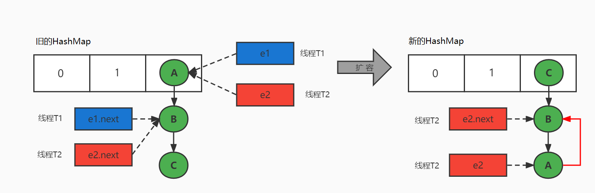

避免HashMap发生死循环的常用解决方案：

- 多线程环境下，使用线程安全的ConcurrentHashMap替代HashMap，推荐
- 多线程环境下，使用synchronized或Lock加锁，但会影响性能，不推荐
- 多线程环境下，使用线程安全的Hashtable替代，性能低，不推荐

HashMap死循环只会发生在JDK1.7版本中，主要原因：头插法+链表+多线程并发+扩容。

在JDK1.8中，HashMap改用尾插法，解决了链表死循环的问题。

## 3. Set接口分析

- HashSet底层使用的就是HashMap
- LinkedHashSet底层使用的就是LinkedHashMap
- TreeSet底层使用的就是TreeMap

它们添加的元素就是Entry对象的key，**对应的value是一个全局常量**：

```java
public boolean add(E e) {
    return map.put(e, PRESENT)==null;
}
private static final Object PRESENT = new Object();
```

# 第11章_File类与IO流

## 1. File类

### 1.1 概述

File类及各种IO流都定义在`java.io`包下。一个File对象代表硬盘或网络中可能存在的一个文件或者文件目录。

**注意**：File可以对文件和目录进行创建或删除等操作，但File不能读写文件中的数据。如果需要访问文件中的数据，则需要使用IO流。  

### 1.2 构造器

`File(String pathname)`：以pathname为路径创建File对象，可以是绝对路径或者相对路径。如果pathname是相对路径，则默认的相对位置在系统属性`user.dir`中存储。

**说明**：

- 绝对路径：以windows操作系统为例，就是包括盘符在内的文件或文件目录的完整路径
- 相对路径：相对于某一个目录来讲的相对位置。
  - IDEA中，main方法中的相对位置，是`当前project目录`。例如在E盘下的my-project项目，则该项目中所有main方法中的相对位置就是`E:\my-project\`
  - IDEA中，单元测试方法中的相对位置，是`当前module目录`。例如在E盘下的my-project项目中的my-module模块，里面的所有单元测试方法中的相对位置就是`E:\my-project\my-module\`

**注意**：

1. 无论构造File的路径是否真实存在文件或目录，都不影响File对象的创建
2. windows的路径分隔符使用`\`，而Java程序中的`\`表示转义字符，所以在字符串中表示路径，需要用`\\`。或者直接使用`/`也可以，Java程序支持将`/`当成平台无关的`路径分隔符`。
3. 当File对象的构造路径是**绝对路径**时，`getPath()`和`getAbsolutePath()`的返回结果是一样的。当File对象的构造路径是**相对路径**时，`getAbsolutePath()`的返回结果是`相对位置+构造路径`。

### 1.3 常用API

#### 1、获取基本信息

```java
public static void main(String[] args) {
    File file = new File("pic/test.png");
    // 1. 文件或目录的名称
    System.out.println(file.getName()); // test.png

    // 2. 创建File对象时指定的路径
    System.out.println(file.getPath()); // pic\test.png

    // 3. 绝对路径
    System.out.println(file.getAbsolutePath()); // E:\my-project\pic\test.png

    // 4. 等价于new File(file.getAbsolutePath())
    File absoluteFile = file.getAbsoluteFile();

    // 5. 上一级目录的名称，若没有上一级目录则返回null
    System.out.println(file.getParent()); // pic

    // 6. 文件长度，单位字节（注意无法获取目录的长度）
    System.out.println(file.length()); // 19777

    // 7. 最后修改时间，是一个时间戳毫秒值
    System.out.println(file.lastModified()); // 1705736224165
}
```

> **注意**：如果File对象代表的文件或目录存在，则File对象实例初始化时，就会用硬盘中对应文件或目录的属性信息（例如，时间、类型等）为File对象的属性赋值。否则除了路径和名称，File对象的其他属性将会保留默认值。

#### 2、列出目录中的内容

- `String[] list()`：返回一个String数组，表示该File目录中的所有一级子文件/目录名称。
- `File[] listFiles()`：返回一个File数组，表示该File目录中的所有一级子文件/目录对象。 

**注意**：

1. 当主调是文件，或者路径不存在时，返回null
2. 当主调是空目录时，返回一个长度为0的数组
3. 当主调是一个目录，但是程序没有权限访问该目录时，返回null

```java
public static void main(String[] args) {
    File file = new File("pic");

    String[] arr1 = file.list();
    for (String s : arr1)
        System.out.println(s); // test-dir test.png

    File[] arr2 = file.listFiles();
    for (File f : arr2)
        System.out.println(f); // pic\test-dir pic\test.png
}
```

**补充**：`list()`和`listFiles()`有重载方法，用于条件过滤：

```java
String[] list(FilenameFilter filter);
File[] listFiles(FilenameFilter filter);
File[] listFiles(FileFilter filter);
```

举例：输出目录中的所有`.png`文件的文件名

```java
public static void main(String[] args) {
    File file = new File("pic");

    String[] arr = file.list(new FilenameFilter() {
        @Override
        public boolean accept(File dir, String name) {
            return name.endsWith(".png");
        }
    });
    for (String s : arr) {
        System.out.println(s); // test.png
    }
}
```

#### 3、重命名

- `boolean renameTo(File dest)`：把文件重命名为指定的文件路径。实际上就类似linux的mv指令，剪切并重命名。

#### 4、判断

- `boolean exists()`：此File表示的文件或目录是否实际存在
- `boolean isDirectory()`：此File是否为目录
- `boolean isFile()`：此File是否为文件
- `boolean canRead()`：是否可读
- `boolean canWrite()`：是否可写
- `boolean canExecute()`：是否可执行
- `boolean isHidden()`：是否隐藏

> 注意：如果文件或目录不存在，那么上述方法全部返回false

#### 5、创建和删除

- `boolean createNewFile()`：创建文件。若文件存在，则不创建，返回false。
- `boolean mkdir()`：创建目录。如果此目录存在，就不创建了；如果此目录的上层目录不存在，也不创建。
- `boolean mkdirs()`：创建目录。如果上层目录不存在，则一并创建。
- `boolean delete()`：删除文件或者空目录。

**举例(递归遍历目录)**：

```java
public class FileDemo {
    public static void main(String[] args) {
        File file = new File("pic");
        printFileName(file); // test.png
        System.out.println(getDirectorySize(file)); // 19777
        deleteDirectory(file);
    }

    // 遍历指定目录下的所有文件名称，包括子目录中的文件
    public static void printFileName(File file) {
        if (file.isFile()) {
            // 如果file是文件，则直接打印文件名
            System.out.println(file.getName());
        } else if (file.isDirectory()) {
            File[] arr = file.listFiles();
            for (File f : arr) {
                printFileName(f);
            }
        }
    }

    // 计算指定目录中所有文件占用空间的大小
    public static long getDirectorySize(File file) {
        long size = 0;
        if (file.isFile()) {
            size = file.length();
        } else if (file.isDirectory()) {
            File[] arr = file.listFiles();
            for (File f : arr) {
                size += getDirectorySize(f);
            }
        }
        return size;
    }

    // 删除指定目录及其下的所有文件
    public static void deleteDirectory(File file) {
        if (file.isDirectory()) {
            File[] arr = file.listFiles();
            for (File f : arr) {
                deleteDirectory(f);
            }
        }
        file.delete();
    }
}
```

## 2. IO流简介

### 2.1 IO流的分类

I/O流中的I/O是`Input/Output`的缩写：

- 输入input：读取外部数据（磁盘、光盘等存储设备的数据）到内存中。
- 输出output：将内存数据输出到磁盘、光盘等存储设备中。

（1）按照数据的流向，可以分为

- 输入流：把数据从其他设备读取到内存中的流
- 输出流：把数据从内存中写出到其他设备的流

（2）按照操作的数据单位，可以分为

- 字节流：以字节为单位读写数据的流
- 字符流：以字符为单位读写数据的流

（3）按照流的作用，可以分为

- 节点流：也称为原始流、低级流，它直接连接数据源和目的地进行数据的读写
- 处理流：也称为包装流，它包装在已存在的流（节点流或处理流）之上，提供更强大的读写功能。

### 2.2 Java中的IO流

Java中的IO流有很多，但都是从以下四个抽象类派生出来的：

- 字节输入流：InputStream
- 字节输出流：OutputStream
- 字符输入流：Reader
- 字符输出流：Writer

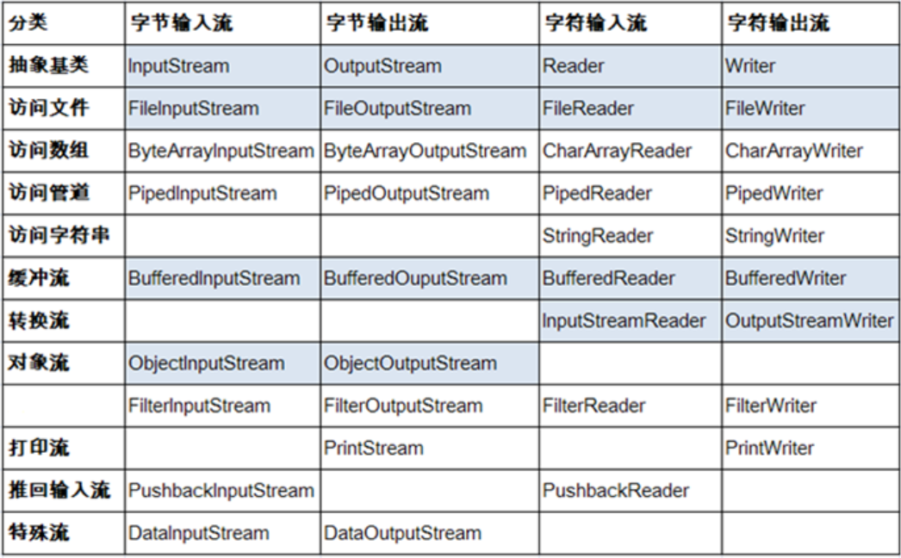

**常用的节点流**： 　

（1）文件流：用于对文件进行读写

- FileInputStream
- FileOutputStream
- FileReader
- FileWriter

（2）数组流：用于对内存中的数组进行读写

- ByteArrayInputStream
- ByteArrayOutputStream
- CharArrayReader
- CharArrayWriter

**常用的处理流**：

（1）缓冲流：增加缓冲功能，避免频繁读写硬盘，进而提升读写效率

- BufferedInputStream
- BufferedOutputStream
- BufferedReader
- BufferedWriter

（2）转换流：实现字节流和字符流之间的转换

- InputStreamReader
- OutputStreamWriter

（3）对象流：提供直接读写Java对象功能

- ObjectInputStream
- ObjectOutputStream

## 3. 字符流

字符流以字符为单位读写数据，专门用于处理文本文件，但不能用于图片、视频等非文本文件。

- 文本文件：`.txt`, `.java`, `.c`等
- 非文本文件：`.doc`, `.xls`, `.ppt`, `.jpg`, `.pdf`, `.mp4`, `.avi`等

### 3.1 Reader

Reader是一个代表字符输入流的抽象类，常用API如下：

- `int read()`：从输入流读取一个字符，但是会自动提升为int类型，返回该字符的Unicode编码值。如果已经到达流末尾了，则返回-1。
- `int read(char[] cbuf)`：从输入流中读取一些字符，并将它们存储到字符数组cbuf中。每次最多读取`cbuf.length`个字符。返回实际读取的字符个数。如果已经到达流末尾，没有数据可读，则返回-1。
- `int read(char[] cbuf, int off, int len)`：从输入流中读取一些字符，并将它们存储到字符数组cbuf中，从`cbuf[off]`开始的位置存储。每次最多读取len个字符。返回实际读取的字符个数。如果已经到达流末尾，没有数据可读，则返回-1。 
- `void close()`：关闭此流并释放与此流相关联的任何系统资源。

> 注意：当完成流的操作时，必须调用`close()`方法，释放系统资源，否则会造成内存泄漏。

### 3.2 Writer

Writer是一个代表字符输出流的抽象类，常用API如下：

- `void write(int c)`：写出单个字符
- `void write(char[] cbuf)`：写出字符数组 
- `void write(char[] cbuf, int off, int len)`：写出字符数组的某一部分，即从索引`off`开始，写出`len`个字符。
- `void write(String str)`：写出字符串 
- `void write(String str, int off, int len)`：写出字符串的某一部分，即从索引`off`开始，写出`len`个字符。
- `void flush()`：刷新该流的缓冲  
- `void close()`：关闭此流并释放与此流相关联的任何系统资源。

> 注意：当完成流的操作时，必须调用`close()`方法，释放系统资源，否则会造成内存泄漏。

### 3.3 FileReader

FileReader以字符流的方式读取文件，构造时使用系统默认的字符编码和默认字节缓冲区。构造器如下：

- `FileReader(File file)`：创建一个FileReader对象，给定要读取的File对象
- `FileReader(String fileName)`：创建一个FileReader对象，给定要读取的文件路径

### 3.4 FileWriter

FileWriter以字符流的方式写入文件，构造时使用系统默认的字符编码和默认字节缓冲区。构造器如下：

- `FileWriter(File file)`：创建一个FileWriter对象，给定要写入的File对象   
- `FileWriter(String fileName)`：创建一个FileWriter对象，给定要写入的文件路径
- `FileWriter(File file, boolean append)`：创建一个FileWriter对象，指明是否在现有文件末尾追加内容
- `FileWriter(String fileName, boolean append)`：创建一个FileWriter对象，指明是否在现有文件末尾追加内容

### 3.5 读写文件的步骤

1. 创建读取或写出的File对象
2. 创建输入流或输出流
3. 具体的读入或写出的过程
   - 读操作常用`read(char[] cbuf)`
   - 写操作常用`write(String str)`或`write(char[] cbuf, 0, len)`
4. 关闭流资源，避免内存泄漏

**注意事项**：

- 因为涉及到流资源的关闭操作，所以出现异常的话，需要使用try-catch-finally的方式来处理异常。推荐使用try-with-resource，代码简洁，让资源自动调用`close()`。
- 对于输入流来讲，要求File对象对应的物理磁盘上的文件必须存在，否则会报FileNotFoundException。如果File对象是一个目录，则会报IOException异常。
- 对于输出流来讲，File对象对应的物理磁盘上的文件可以不存在。
  - 如果此文件不存在，则在输出的过程中，会自动创建此文件，并写出数据到此文件中。
  - 如果此文件存在。若使用`FileWriter(file)`创建流，则输出数据过程中，会新建同名的文件对现有的文件进行覆盖；若使用`FileWriter(file, true)`创建流，则输出数据过程中，会在现有的文件的末尾追加写出内容。

**举例**：将hello.txt文件复制一份，得到hello_copy.txt

```java
public static void main(String[] args) {
    File src = new File("io-test/hello.txt");
    File dest = new File("io-test/hello_copy.txt");
    try (
            FileReader reader = new FileReader(src);
            FileWriter writer = new FileWriter(dest);
    ) {
        char[] buffer = new char[1024];
        int len = 0;
        while ((len = reader.read(buffer)) != -1) {
            writer.write(buffer, 0, len);
        }
    } catch (IOException e) {
        e.printStackTrace();
    }
}
```

### 3.6 flush刷新

因为内置缓冲区的原因，如果FileWriter不关闭输出流，则无法写出字符到文件中。但是关闭的流对象，是无法继续写出数据的。如果我们既想写出数据，又想继续使用流，就需要使用`flush()`方法：

- `flush()`：刷新缓冲区，流对象可以继续使用。
- `close()`：先刷新缓冲区，然后通知系统释放资源，流对象不可以再被使用了。

> 注意：即便是`flush()`方法写出了数据，程序代码最后还是要调用`close()`释放系统资源。

## 4. 字节流

如果我们要读写非文本文件，则必须使用字节流。

### 4.1 InputStream

InputStream是一个代表字节输入流的抽象类，常用API如下：

- `int read()`：从输入流读取一个字节，返回读取的字节值。虽然读取了一个字节，但是会自动提升为int类型。如果已经到达流末尾，没有数据可读，则返回-1。 
- `int read(byte[] b)`：从输入流中读取一些字节，并将它们存储到字节数组b中。每次最多读取`b.length`个字节。返回实际读取的字节个数。如果已经到达流末尾，没有数据可读，则返回-1。 
- `int read(byte[] b, int off, int len)`：从输入流中读取一些字节，并将它们存储到字节数组b中，从`b[off]`开始存储，每次最多读取len个字节。返回实际读取的字节个数。如果已经到达流末尾，没有数据可读，则返回-1。 
- `byte[] readAllBytes()`：直接将当前字节输入流对应的文件对象的所有字节数据装到一个字节数组中返回
- `void close()`：关闭此输入流并释放与此流相关联的任何系统资源。    

### 4.2 OutputStream

OutputStream是一个代表字节输出流的抽象类，常用API如下：

- `void write(int b)`：写出单个字节。虽然参数为int类型占四个字节，但是只会保留一个字节的信息写出。
- `void write(byte[] b)`：写出字节数组
- `void write(byte[] b, int off, int len)`：写出字节数组的某一部分，即从索引`off`开始，写出`len`个字节。 
- `void flush()`：刷新该流的缓冲
- `void close()`：关闭此输出流并释放与此流相关联的任何系统资源。  

### 4.3 FileInputStream

FileInputStream以字节流的方式读取文件，构造器如下：

- `FileInputStream(File file)`：创建一个FileInputStream对象，给定要读取的File对象
- `FileInputStream(String fileName)`：创建一个FileInputStream对象，给定要读取的文件路径

### 4.4 FileOutputStream

FileOutputStream以字节流的方式写入文件，构造器如下：

- `FileOutputStream(File file)`：创建一个FileOutputStream对象，给定要写入的File对象
- `FileOutputStream(String fileName)`：创建一个FileOutputStream对象，给定要写入的文件路径
- `FileOutputStream(File file, boolean append)`：创建一个FileOutputStream对象，指明是否在现有文件末尾追加内容。
- `FileOutputStream(String fileName, boolean append)`：创建一个FileOutputStream对象，指明是否在现有文件末尾追加内容。

### 4.5 读写文件的步骤

读写文件的步骤与字符流类似，只不过做读写操作时，针对的是`byte[]`数组。

**注意**：对于字符流，只能用来操作文本文件，不能用来处理非文本文件。而对于字节流，通常是用来处理非文本文件的，但如果涉及到文本文件的复制操作，也可以使用字节流。

**举例**：将picture.png图片复制一份，得到picture_copy.png

```java
public static void main(String[] args) {
    File src = new File("io-test/picture.png");
    File dest = new File("io-test/picture_copy.png");
    try (
            InputStream is = new FileInputStream(src);
            OutputStream os = new FileOutputStream(dest);
    ) {
        byte[] buffer = new byte[1024];
        int len = 0;
        while ((len = is.read(buffer)) != -1) {
            os.write(buffer, 0, len);
        }
    } catch (IOException e) {
        e.printStackTrace();
    }
}
```

## 5. 缓冲流

### 5.1 缓冲流简介

缓冲流是一种包装流，用于增加缓冲功能，避免频繁读写硬盘，进而提升读写效率。缓冲流要包装在别的流之上，同样可以分为：

- 字节缓冲流：BufferedInputStream和BufferedOutputStream
- 字符缓冲流：BufferedReader和BufferedWriter

**缓冲流的基本原理**：在创建缓冲流对象时，内部会创建一个缓冲区数组（默认使用`8192个字节(8KB)`的缓冲区），通过缓冲区读写，减少系统IO次数，从而提高读写的效率：

- 读数据时，它先用所包装的流一次性读取8KB的数据存入缓冲流内部的缓冲区数组中，然后再从该数组中读取数据。
- 写数据时，它先把数据写到缓冲流内部的8KB缓冲区数组中，然后再通过所包装的流，将该数组中的数据一次性写到目标文件中。

> 注意：**缓冲流的性能不一定比原始流高，比如原始流读写时自己加一个很大的数组，性能就会很好，但此时内存空间消耗就会很大**。所以缓冲流相当于帮我们加了一个相对而言大小比较合理的缓冲区数组，使得在时间和空间上都比较好。

### 5.2 缓冲流的使用

缓冲流的构造器如下：

- `BufferedInputStream(InputStream in)`：创建一个字节缓冲输入流
- `BufferedOutputStream(OutputStream out)`：创建一个字节缓冲输出流
- `BufferedReader(Reader in)`：创建一个字符缓冲输入流
- `BufferedWriter(Writer out)`：创建一个字符缓存输出流

**举例**：将picture.png图片复制一份，得到picture_copy1.png

```java
public static void main(String[] args) {
    File src = new File("io-test/picture.png");
    File dest = new File("io-test/picture_copy1.png");
    try (
            InputStream is = new FileInputStream(src);
            OutputStream os = new FileOutputStream(dest);
            BufferedInputStream bis = new BufferedInputStream(is);
            BufferedOutputStream bos = new BufferedOutputStream(os);
    ) {
        byte[] buffer = new byte[1024];
        int len = 0;
        while ((len = bis.read(buffer)) != -1) {
            bos.write(buffer, 0, len);
        }
    } catch (IOException e) {
        e.printStackTrace();
    }
}
```

**注意**：涉及到嵌套的多个流时，如果都显式关闭的话，需要先关闭外层的流，再关闭内层的流（其实在开发中，只需要关闭最外层的流即可，因为在关闭外层流时，内层的流也会自动被关闭）。不过我们采用try-with-resource方法后，就无需自己手动关闭流了。

**补充**：字符缓冲流还有一些特有的API，例如

- BufferedReader具有方法`String readLine()`，用于读取一行文字，注意返回的String中没有换行符，如果读到末尾则返回null
- BufferedWriter具有方法`void newLine()`，用于写一个换行符

## 6. 转换流

使用`FileReader`读取文本文件时，由于IDEA中针对项目设置了UTF-8编码，当读取Windows系统中创建的文本文件时，如果Windows系统默认的是GBK编码，则读入内存中会出现乱码。因此我们引入了转换流，转换流实现了字节与字符之间的转换。

### 6.1 转换流的使用

转换流InputStreamReader是Reader的子类（字符输入流），它使用指定的字符集**将字节解码为字符**。构造器如下：

- `InputStreamReader(InputStream in)`：使用平台的默认字符集
- `InputStreamReader(InputStream in, String charsetName)`：使用指定字符集

转换流OutputStreamWriter是Writer的子类（字符输出流），它使用指定的字符集**将字符编码为字节**。构造器如下：

- `OutputStreamWriter(OutputStream out)`：使用平台的默认字符集
- `OutputStreamWriter(OutputStream out, String charsetName)`：使用指定字符集

**举例**：将utf-8格式的文件复制一份成为gbk格式的文件

```java
public static void main(String[] args) {
    try (
            InputStream is = new FileInputStream("io-test/1_utf-8.txt");
            InputStreamReader isr = new InputStreamReader(is, "utf-8");
            OutputStream os = new FileOutputStream("io-test/1_gbk.txt");
            OutputStreamWriter osw = new OutputStreamWriter(os, "gbk");
    ) {
        char[] buffer = new char[1024];
        int len = 0;
        while ((len = isr.read(buffer)) != -1) {
            osw.write(buffer, 0, len);
        }
    } catch (IOException e) {
        e.printStackTrace();
    }
}
```

### 6.2 字符编码和解码

计算机中储存的信息都是用二进制数表示的。按照某种规则，将字符存储到计算机中，称为**编码**；反之，将存储在计算机中的二进制数按照某种规则解析显示出来，称为**解码**。

**字符编码（Character Encoding）**: 就是一套自然语言的字符与二进制数之间的对应规则。

如果按照A规则编码，同样按照A规则解码，那么就能显示正确的文本符号。反之，如果按照A规则编码，再按照B规则解码，就会导致**乱码现象**。

### 6.3 字符集

**字符集Charset**，也叫编码表，是一个系统支持的所有字符的集合。

计算机要准确的存储和识别各种字符集符号，需要进行字符编码，**一套字符集必然至少有一套字符编码**。可见，当指定了字符编码方案，它所对应的字符集也就确定了。在常见的字符集中，Unicode字符集就具有多种字符编码方案。

#### 1、ASCII字符集

ASCII主要针对英文字符，它使用单字节编码，用7个bit表示一个字符（最前面的1个bit统一为0），所以ASCII字符集共128个字符。

#### 2、ISO-8859-1字符集

ISO-8859-1主要针对欧洲字符，也称为Latin-1（拉丁码表），它使用单字节编码，兼容ASCII编码。

#### 3、GBK字符集

有很多`GBxxx`字符集，主要针对中文字符（GB就是国标），最常用的使GBK字符集。对于ASCII字符它使用单字节存储，而其他字符则采用双字节存储。

#### 4、Unicode字符集

Unicode字符集是为表达`任意语言的任意字符`而设计，所以也称为统一码、标准万国码。在最初，Unicode字符集采用的编码方案使用**两个字节**就可以为世界上所有字符设定唯一的二进制编码，这一编码方案也称为**Unicode编码**。

然而Unicode编码在很长一段时间都无法推广，最主要的原因是很多国家只使用英文，而英文使用两个字节表示实在过于浪费。因此，Unicode字符集出现了更多的**编码方案**，如UTF-8、UTF-16、UTF-32。

其中，UTF-8是最常用的编码方案，它是一种变长的编码方式，使用1到4个字节为每个字符编码，具体规则如下：

1. 128个ASCII字符，使用1个字节编码
2. 拉丁文等字符，使用2个字节编码
3. 大部分常用字符（包括中文字符），使用3个字节编码
4. 其他极少使用的Unicode辅助字符，使用4个字节编码

> 说明：操作系统上有一种常见的ANSI编码，它与具体的操作系统有关：在中文操作系统上，ANSI编码就是GBK编码；而在英文操作系统上，ANSI编码就是ISO-8859-1编码。
>
> 注意：在互联网项目中，我们应该统一规范，屏蔽操作系统的差异，所以**必须使用统一的UTF-8编码**。

### 6.4 字符在硬盘与内存中的存储

**字符在硬盘中的存储**：字符存储在磁盘文件中时，一般会使用GBK编码或者**UTF-8编码**（互联网项目必须使用UTF-8），所以

- 一个ASCII字符都只占1个字节
- 但中文(包括中文标点)如果以GBK的方式存储，会占2个字节；而以UTF-8的方式存储，会占3个字节。

**字符在内存中的存储**：我们知道Java中一个字符(char)占用2个字节，因为在内存中会使用**Unicode编码**。所以将磁盘文件（假设是UTF-8编码）中的字符读入内存时，就会进行UTF-8编码到Unicode编码的转化：


## 7. 对象流

如果需要将内存中定义的变量（包括基本数据类型或引用数据类型）保存在文件中，可以使用Java提供的数据流和对象流来处理这些类型的数据。

### 7.1 数据流

- DataInputStream：允许应用程序从输入流中读取基本数据类型、String类型的变量。
- DataOutputStream：允许应用程序将基本数据类型、String类型的变量写入输出流中

DataInputStream的常用API：

```java
byte readByte()       short readShort()
int readInt()         long readLong()
float readFloat()     double readDouble()
char readChar()		  boolean readBoolean()
String readUTF()      void readFully(byte[] b)
```

> 注1：对于DataOutputStream中的API，只需将上述方法的read改为相应的write即可。
>
> 注2：数据流的弊端在于，它只支持Java基本数据类型和字符串的读写，而不支持其它Java对象的类型。下面介绍的对象流既支持基本数据类型的读写，也支持引用数据类型的读写。

### 7.2 对象流

ObjectOutputStream：将Java基本数据类型和对象写入字节输出流中。常用API如下：

- `ObjectOutputStream(OutputStream out)`：构造器
- 对于基本数据类型和String类型，方法名与数据流相同，都是writeXxx
- `void writeObject(Object obj)`：写出一个obj对象

ObjectInputStream：从字节输入流中读取基本数据类型的数据和对象。常用API如下：

- `ObjectInputStream(InputStream in)`：构造器
- 对于基本数据类型和String类型，方法名与数据流相同，都是readXxx
- `Object readObject()`：读入一个对象

### 7.3 对象的序列化机制

`对象序列化机制`允许把内存中的Java对象转换成平台无关的二进制流，从而允许把这种二进制流持久地保存在磁盘上，或通过网络将这种二进制流传输到另一个网络节点。当其它程序获取了这种二进制流，就可以恢复成原来的Java对象。

- 序列化过程：使用ObjectOutputStream流实现。用一个字节序列表示一个对象，然后将其写入到文件。
- 反序列化过程：使用ObjectInputSteam流实现。该字节序列还可以从文件中读取到内存，重构对象。

> 序列化机制的作用：可以将任何实现了Serializable接口的对象转化为**字节数据**，使其在保存和传输时可被还原。

自定义类要想实现序列化机制，需要满足以下条件：

1. 必须实现接口`Serializable`，它是一个`标记接口`
2. 需要定义一个序列化版本的全局常量，例如`private static final long serialVersionUID = 1L;` 注意，如果不声明全局常量serialVersionUID，系统也会自动生成，但是如果修改此类的话，就会导致系统自动生成的serialVersionUID变化，进而导致反序列化时出现InvalidClassException异常。
3. 自定义类的各个属性也必须是可序列化的

> 注1：如果有一个属性不需要序列化，则该属性必须注明是瞬态的，使用`transient`关键字修饰。
> 
> 注2：static变量不会序列化，因为静态变量不属于某个对象。

### 7.4 使用对象流进行序列化的案例

> 需求：将一个对象写入文件，然后再读入内存，并输出到控制台（注意，如果有多个对象需要序列化，则可以将对象放到集合中，再序列化集合对象即可）

```java
@Data
@NoArgsConstructor
@AllArgsConstructor
public class Animal implements Serializable {
    private static final long serialVersionUID = 1L;
    private Integer id;
    private String name;
}
```

```java
public class FileDemo {
    public static void main(String[] args) {
        File file = new File("io-test/obj.txt");
        writeOp(file);
        readOp(file);
    }

    public static void writeOp(File file) {
        ArrayList<Animal> list = new ArrayList<>();
        list.add(new Animal(100, "小猫"));
        list.add(new Animal(111, "小狗"));
        list.add(new Animal(666, "小猪"));
        try (
                OutputStream os = new FileOutputStream(file);
                ObjectOutputStream oos = new ObjectOutputStream(os);
        ) {
            oos.writeObject(list);
        } catch (IOException e) {
            e.printStackTrace();
        }
    }

    public static void readOp(File file) {
        try (
                InputStream is = new FileInputStream(file);
                ObjectInputStream ois = new ObjectInputStream(is);
        ) {
            ArrayList<Animal> list = (ArrayList<Animal>) ois.readObject();
            System.out.println(list);
        } catch (Exception e) {
            e.printStackTrace();
        }
    }
}
```

## 8. 其他流的使用

### 8.1 标准输入、输出、错误流

- `System.in`代表标准输入流，其类型是`InputStream`，默认输入设备是键盘。
- `System.out`代表标准输出流，其类型是`PrintStream`，默认输出设备是显示器。
- `System.err`代表标准错误流，其类型是`PrintStream`

我们可以通过System类的以下API，来改变标准输入输出：

- `public static void setIn(InputStream in)`
- `public static void setOut(PrintStream out)`

**举例**：从键盘输入字符串，要求将读取到的整行字符串转成大写并输出。然后继续进行输入操作，直至输入exit时退出程序。

```java
public static void main(String[] args) {
    try (
            BufferedReader br = new BufferedReader(new InputStreamReader(System.in))
    ) {
        String str = null;
        while ((str = br.readLine()) != null) {
            if ("exit".equalsIgnoreCase(str))
                break;
            System.out.println(str.toUpperCase());
        }
    } catch (IOException e) {
        e.printStackTrace();
    }
}
```

### 8.2 打印流

打印流可以更方便地打印数据。`PrintStream`是字节打印流，`PrintWriter`是字符打印流，它们都提供了一系列重载的`print()`和`println()`方法，用于多种数据类型的输出。

PrintStream的常用构造器如下：

- `PrintStream(String fileName)`
- `PrintStream(File file)`
- `PrintStream(OutputStream out)` 

**举例**：使用打印流输出内容到文件

```java
public static void main(String[] args) {
    method1(new File("io-test/hello1.txt"));
    method2(new File("io-test/hello2.txt"));
}

// 方式1：直接创建打印流输出到目标文件
public static void method1(File file) {
    try (
            PrintStream printStream = new PrintStream(file)
    ) {
        for (int i = 0; i < 10; i++) {
            printStream.println(i);
        }
    } catch (IOException e) {
        e.printStackTrace();
    }
}

// 方式2：将标准输出流重定向到目标文件
public static void method2(File file) {
    try (
            OutputStream os = new FileOutputStream(file, true); // 设置可以追加
            PrintStream printStream = new PrintStream(os);
    ) {
        System.setOut(printStream);
        for (int i = 0; i < 10; i++) {
            System.out.println(i);
        }
    } catch (IOException e) {
        e.printStackTrace();
    }
}
```

### 8.3 Scanner类

构造器：

- `Scanner(File source)`：构造一个新的Scanner，它生成的值是从指定文件扫描的。 
- `Scanner(File source, String charsetName)`
- `Scanner(InputStream source)`：构造一个新的Scanner，它生成的值是从指定的输入流扫描的。 
- `Scanner(InputStream source, String charsetName)`

常用API：

- `boolean hasNextXxx()`：如果通过使用`nextXxx()`方法，此扫描器输入信息中的下一个标记可以解释为默认基数中的一个Xxx值，则返回true。
- `Xxx nextXxx()`：将输入信息的下一个标记扫描为一个Xxx

## 9. IO框架

### 9.1 介绍

框架：为了解决某类问题而编写的一套类、接口等。框架的形式：一般是把类、接口等编译成class形式，再压缩成一个`.jar`结尾的文件发行出去。好处：在框架的基础上开发，可以得到优秀的软件架构，并能提高开发效率。

由apache开源基金组织提供了一组有关IO流的小框架，可以提高IO流的开发效率，这个框架的名字叫commons-io，需要引入以下依赖：

```xml
<dependency>
    <groupId>commons-io</groupId>
    <artifactId>commons-io</artifactId>
    <version>2.15.1</version>
</dependency>
```

### 9.2 commons-io的常用API

commons-io中有两个常用的工具类：FileUtils和IOUtils，它们的常用API如下：

```java
public static void main(String[] args) throws IOException {
    File file = new File("io-test/a.txt");
    File dir = new File("io-test/a-dir");

    // 1. 复制文件：void copyFile(File srcFile, File destFile)
    FileUtils.copyFile(file, new File("io-test/b.txt"));

    // 2. 复制文件夹：void copyDirectory(File srcDir, File destDir)
    FileUtils.copyDirectory(dir, new File("io-test/b-dir"));

    // 3. 读数据：String readFileToString(File file, String encoding)
    String str = FileUtils.readFileToString(file, "utf-8");
    System.out.println(str);

    // 4. 写数据：void writeStringToFile(File file, String data, String encoding, boolean append)
    FileUtils.writeStringToFile(file, "111", "utf-8", true);
}
```

```java
public static void main(String[] args) {
    File src = new File("io-test/a.txt");
    File dest = new File("io-test/c.txt");

    try (
            InputStream is = new FileInputStream(src);
            OutputStream os = new FileOutputStream(dest);
    ) {
        // 1. 字节流的复制：int copy(InputStream is, OutputStream os)
        IOUtils.copy(is, os);

        // 2. 字符流的复制：int copy(Reader reader, Writer writer)

        // 3. 写数据：void write(String data, OutputStream os, String encoding)
        IOUtils.write("222", os, "utf-8");

    } catch (IOException e) {
        e.printStackTrace();
    }
}
```

## 10. xml文件

### 10.1 XML文件概述

XML是可扩展的标记语言(全称EXtensible Markup Language)。本质上一种数据格式，可以用来表示复杂的数据关系。应用场景：xml文件经常用来做为系统的配置文件；或者作为一种特殊的数据结构，在网络中进行传输(但现在以JSON为主)。

XML文件有如下的特点：

- XML中的`<标签名>`称为一个标签或者一个元素，一般是成对出现的。
- XML中的标签名可以自己定义（可扩展），但是必须要正确的嵌套
- XML中只能有一个根标签。
- XML标签中可以有属性，属性的值必须使用 `""` 引起来
- XML必须第一行有一个文档声明，格式是固定的`<?xml version="1.0" encoding="UTF-8"?>`
- XML文件必须是以.xml为后缀结尾

```xml
<?xml version="1.0" encoding="UTF-8" ?>
<!-- 注释：以上抬头声明必须放在第一行，必须有 -->
<!--  根标签只能有一个 -->
<users>
    <user id="1" desc="第一个用户">
        <name>张无忌</name>
        <sex>男</sex>
        <地址>光明顶</地址>
        <password>minmin</password>
    </user>
    <people>很多人</people>
    <user id="2">
        <name>敏敏</name>
        <sex>女</sex>
        <地址>光明顶</地址>
        <password>wuji</password>
    </user>
</users>
```

说明：

- xml中的注释格式：`<!–- 注释内容 -->`
- 如果标签文本中有以下特殊字符，需要用一些占位符代替。

  ```txt
  &lt;  表示 <
  &gt;  表示 >
  &amp; 表示 &
  &apos; 表示 '
  &quot; 表示 "
  ```
- 如果在标签文本中，出现大量的特殊字符，不想使用特殊字符，此时可以用CDATA区，格式如下

  ```xml
  <data1>
      <![CDATA[
     		3 < 2 && 5 > 4
      ]]>
  </data1>
  ```

### 10.2 XML解析

使用程序读取XML文件中的数据，称之为XML解析。一般用第三方的XML解析框架DOM4J来进行XML解析。

首先引入jar包，具体步骤如下：

1. 在模块的目录下，新建一个lib文件夹
2. 把dom4j-2.1.3.jar文件复制到lib文件夹下
3. 选择lib下的jar文件，右键点击Add As Library
4. 在类中导包使用

DOM4J解析XML文件的思想：**文档对象模型**（意思是把整个XML文档、每一个标签、每一个属性都等都当做对象来看待）。Document对象表示真个XML文档、Element对象表示标签（元素）、Attribute对象表示属性、标签中的内容就是文本

**XML解析的过程，是从根元素开始，从外层往里层解析**。

**1、SAXReader**

SAXReader是Dom4j提供的解析器，可以认为是代表整个Dom4j框架，它提供以下构造器/方法：

- `public SAXReader()`：构建Dom4j的解析器对象
- `public Document read(String url)`：把XML文件读成Document对象
- `public Document read(InputStream is)`：通过字节输入流读取XML文件

**2、Document**

Document提供以下方法获取根元素对象：

- `Element getRootElement()`

**3、Element**

通过Element就可以获取一些属性或者文本：

- `public String getName()`：得到元素名字
- `public List<Element> elements()`：得到当前元素下的所有子元素
- `public List<Element> elements(String name)`：得到当前元素下指定名字的子元素
- `public Element element(String name)`：得到当前元素下指定名字的子元素(有多个同名子元素，默认返回第一个)
- `public String attributeValue(String name)`：通过属性名直接得到属性值
- `public String elementText(String name)`：得到指定名称的子元素的文本内容
- `public String getText()`：得到文本内容

```java
public class Dom4JTest1 {
    public static void main(String[] args) throws Exception {
        // 1、创建一个Dom4J框架提供的解析器对象
        SAXReader saxReader = new SAXReader();

        // 2、使用saxReader对象把需要解析的XML文件读成一个Document对象。
        Document document =
                saxReader.read("properties-xml-log-app\\src\\helloworld.xml");

        // 3、从文档对象中解析XML文件的全部数据了
        Element root = document.getRootElement();
        System.out.println(root.getName());

        // 4、获取根元素下的全部一级子元素。
        // List<Element> elements = root.elements();
        List<Element> elements = root.elements("user");
        for (Element element : elements) {
            System.out.println(element.getName());
        }

        // 5、获取当前元素下的某个子元素。
        Element people = root.element("people");
        System.out.println(people.getText());

        // 如果下面有很多子元素user，默认获取第一个。
        Element user = root.element("user");
        System.out.println(user.elementText("name"));

        // 6、获取元素的属性信息呢？
        System.out.println(user.attributeValue("id"));
        Attribute id = user.attribute("id");
        System.out.println(id.getName());
        System.out.println(id.getValue());

        List<Attribute> attributes = user.attributes();
        for (Attribute attribute : attributes) {
            System.out.println(attribute.getName() + "=" + attribute.getValue());
        }

        // 7、如何获取全部的文本内容:获取当前元素下的子元素文本值
        System.out.println(user.elementText("name"));
        System.out.println(user.elementText("地址"));
        System.out.println(user.elementTextTrim("地址")); // 取出文本去除前后空格
        System.out.println(user.elementText("password"));

        Element data = user.element("data");
        System.out.println(data.getText());
        System.out.println(data.getTextTrim()); // 取出文本去除前后空格
    }
}
```

### 10.3 XML文件写入

事实上现在很少用程序去写入XML文件。如果一定要通过程序的方式写XML文件，建议不要使用DOM4J(因为很繁琐)，而是使用StringBuilder按照标签的格式拼接，然后再使用BufferedWriter写到XML文件中去就可以了。

### 10.4 XML约束

XML约束指的是限制XML文件中的标签或者属性，只能按照规定的格式写。

约束文档：专门用来限制xml书写格式的文档，比如：限制标签、属性应该怎么写。约束文档分为两类：DTD文档、Schema文档。

#### 1、DTD文档

IDEA中有代码提示的协助，在DTD文档的约束下进行配置非常简单。

#### 2、Schema文档

我们将来使用SSM框架中的Spring、SpringMVC框架时，会涉及到一点点对Schema约束的设置。

首先我们要理解一个概念：名称空间(name space)。Schema约束要求我们一个XML文档中，所有标签，所有属性都必须在约束中有明确的定义。

下面我们以web.xml的约束声明为例来做个说明：

```xml
<web-app xmlns="http://xmlns.jcp.org/xml/ns/javaee"
         xmlns:xsi="http://www.w3.org/2001/XMLSchema-instance"
         xsi:schemaLocation="http://xmlns.jcp.org/xml/ns/javaee http://xmlns.jcp.org/xml/ns/javaee/web-app_4_0.xsd"
         version="4.0">
```

- `xmlns`：指出当前XML文档约束规则的名称空间在哪里，我们就是通过这个属性来引用一个具体的名称空间
- `xmlns:xsi`：指出xmlns这个属性是在哪个约束文档中被定义的
- `xsi:schemaLocation`：指定当前XML文档中所用到的约束文档本身的文件的地址

## 11. 日志技术

### 11.1 日志概述

程序中的日志，记录了程序运行过程中产生的各种数据。日志技术有如下好处：

1. 日志可以将系统执行的信息，方便地记录到指定位置，可以是控制台、可以是文件、可以是数据库中。
2. 日志可以随时以开关的形式控制启停，无需侵入到源代码中去修改。

**日志框架**：常见的日志框架有JUL（`java.util.logging`）、Log4j、Logback等。

**日志接口**：设计日志框架的一套标准，日志框架需要实现这些接口。日志接口有JCL和SLF4J。

> 我们用的最多的是Logback日志框架，它是基于SLF4J的日志接口而实现的框架。

### 11.2 Logback日志配置文件

日志框架在记录日志时会读取配置文件中的配置信息，从而记录日志的形式。主要可以做以下配置：

1. 可以配置日志输出的位置是文件还是控制台
2. 可以配置日志输出的格式
3. 可以配置日志关闭和开启、以及哪些日志输出哪些日志不输出。

> **注意**：Logback日志配置文件必须命名为`logback.xml`，并且放到resources目录下。

```xml
<?xml version="1.0" encoding="UTF-8"?>
<configuration>
    <!-- CONSOLE：表示当前的日志信息是可以输出到控制台的 -->
    <appender name="CONSOLE" class="ch.qos.logback.core.ConsoleAppender">
        <!-- 输出流对象默认System.out -->
        <target>System.out</target>
        <encoder>
            <!-- 日志的输出格式-->
            <pattern>%d{yyyy-MM-dd HH:mm:ss.SSS} [%-5level]  %c [%thread] : %msg%n</pattern>
        </encoder>
    </appender>

    <!-- File：表示将日志信息输出到文件 -->
    <appender name="FILE" class="ch.qos.logback.core.rolling.RollingFileAppender">
        <encoder>
            <pattern>%d{yyyy-MM-dd HH:mm:ss.SSS} [%thread] %-5level %logger{36} - %msg%n</pattern>
            <charset>utf-8</charset>
        </encoder>
        <!-- 日志输出路径 -->
        <file>E:/log/thuwsy-data.log</file>
        <!--指定日志文件拆分和压缩规则-->
        <rollingPolicy class="ch.qos.logback.core.rolling.SizeAndTimeBasedRollingPolicy">
            <!-- 通过指定压缩文件名称，来确定分割文件方式 -->
            <fileNamePattern>E:/log/thuwsy-data-%i-%d{yyyy-MM-dd}-.log.gz</fileNamePattern>
            <!-- 文件拆分大小 -->
            <maxFileSize>1MB</maxFileSize>
        </rollingPolicy>
    </appender>

    <!-- 控制日志的输出情况：如，开启日志，取消日志。level是日志级别 -->
    <root level="debug">
        <appender-ref ref="CONSOLE"/>
        <appender-ref ref="FILE" />
    </root>
</configuration>
```

**日志级别**：就是日志信息的类型，常见的日志级别如下（优先级依次升高）：

- trace：追踪，指明程序运行轨迹
- debug：调试，实际开发中一般将其作为最低级别，而很少使用trace
- info：输出重要的运行信息，非常常用
- warn：警告信息
- error：错误信息

Logback只输出高于或者等于核心配置文件配置的日志级别信息。而低于配置级别的日志信息，不被记录。例如：

- 配置的是debug，则debug、info、warn、error级别的日志被输出
- 配置的是info，则info、warn、error级别的日志被输出

### 11.3 Logback的使用

（1）添加依赖

```xml
<dependency>
    <groupId>ch.qos.logback</groupId>
    <artifactId>logback-classic</artifactId>
    <version>1.2.3</version>
</dependency>
```

（2）在resources目录下创建日志配置文件`logback.xml`

（3）测试：

```java
public class LogBackTest {
    // 创建一个Logger日志对象
    public static final Logger LOGGER = LoggerFactory.getLogger("LogBackTest");

    public static void main(String[] args) {
        try {
            LOGGER.info("chu方法开始执行");
            chu(10, 0);
            LOGGER.info("chu方法执行成功");
        } catch (Exception e) {
            LOGGER.error("chu方法执行失败，出现了BUG");
        }
    }
    public static void chu(int a, int b) {
        LOGGER.debug("参数a：" + a);
        LOGGER.debug("参数b：" + b);
        int c = a / b;
        LOGGER.info("结果是c：" + c);
    }
}
```

当我们运行程序后，就可以看到控制台记录的日志：

```
2024-02-10 13:26:27.675 [INFO ]  LogBackTest [main] : chu方法开始执行
2024-02-10 13:26:27.679 [DEBUG]  LogBackTest [main] : 参数a：10
2024-02-10 13:26:27.681 [DEBUG]  LogBackTest [main] : 参数b：0
2024-02-10 13:26:27.681 [ERROR]  LogBackTest [main] : chu方法执行失败，出现了BUG
```

# 第12章_网络编程

## 1. 网络编程概述

### 1.1 简介

Java提供的网络类库（`java.net`包），可以实现无痛的网络连接，联网的底层细节被隐藏在Java的本机安装系统里，由JVM进行控制。并且Java实现了一个跨平台的网络库，程序员面对的是一个统一的网络编程环境。

### 1.2 通信架构

**C/S架构**：全称为Client/Server结构，是指客户端和服务器结构。

**B/S架构**：全称为Browser/Server结构，是指浏览器和服务器结构。

两种架构各有优势，但是无论哪种架构，都离不开网络的支持。**网络编程**，就是在一定的协议下，实现两台计算机之间的通信。

### 1.3 网络通信的三要素

#### 1、IP地址

IP地址是设备在网络中的唯一标识。

#### 2、端口号

端口号是进程在设备中的唯一标识，它是用两个字节表示的整数，取值范围为`0~65535`

- 周知端口：`0~1023`，被预先定义的知名应用占用。如`HTTP(80)`，`FTP(21)`，`Telnet(23)`
- 注册端口：`1024~49151`，分配给用户进程或某些应用程序。如`Tomcat(8080)`，`MySQL(3306)`，`Oracle(1521)`
- 动态端口：`49152~65535`，一般不固定分配某种进程，而是动态分配。

#### 3、协议

通信的协议还是比较复杂的，`java.net`包中包含的类和接口，它们提供低层次的通信细节。我们可以直接使用这些类和接口，来专注于网络程序开发，而不用考虑通信的细节。

`java.net`包中提供了两种常见的传输层协议的支持：

- UDP：用户数据报协议(User Datagram Protocol)
- TCP：传输控制协议(Transmission Control Protocol)

UDP协议的特点是无连接、不可靠通信，所以通信效率高，一般用于语音通话、视频直播等。而TCP协议的特点是面向连接、可靠通信，所以通信效率没有UDP高。

### 1.4 InetAddress

InetAddress类用于表示IP地址，有两个子类：Inet4Address、Inet6Address。

InetAddress类没有提供公共的构造器，而是提供了如下几个静态方法来**获取InetAddress实例**：

- `static InetAddress getLocalHost()`：获取本机IP，返回一个InetAddress对象
- `static InetAddress getByName(String host)`：参数传递的字符串可以是IP地址，也可以是域名，返回一个InetAddress对象
- `static InetAddress getByAddress(byte[] addr)`：根据参数传递的IP地址，返回一个InetAddress对象

InetAddress类提供了以下几个**常用API**：

- `String getHostAddress()`：返回IP地址字符串
- `String getHostName()`：获取此IP地址对象所对应的主机名
- `boolean isReachable(int timeout)`：在指定毫秒内，判断当前主机与该ip所对应的主机是否能连通

### 1.5 套接字

利用**套接字**(Socket)开发网络应用程序早已被广泛的采用，以至于成为事实上的标准，网络通信其实就是Socket间的通信。套接字指的就是具有唯一标识的IP地址和端口号的组合。

通信的两端都要有Socket，这是两台机器间通信的端点。Socket允许程序把网络连接当成一个流，数据在两个Socket间通过IO传输。一般主动发起通信的应用程序称为客户端，等待通信请求的称为服务端。

Java中套接字分为两类：一类是`数据报套接字`，被UDP协议使用，对应的Java类是`DatagramSocket`；另一类是`流套接字`，被TCP协议使用，对应的Java类有两个：

- Socket，该类就是两台机器间通信的端点
- ServerSocket，该类代表服务端的监听套接字，用于监听连接请求、建立连接


## 2. UDP网络编程

### 2.1 DatagramSocket

DatagramSocket类和DatagramPacket类实现了基于UDP协议的网络程序。UDP数据报通过数据报套接字DatagramSocket发送和接收，常用API如下：

- `DatagramSocket()`：空参构造器，系统会随机分配一个端口号，一般用于创建发送端的套接字对象。
- `DatagramSocket(int port)`：有参构造器，绑定到指定端口号，一般用于创建接收端（服务端）的套接字对象。
- `void send(DatagramPacket p)`：从该套接字发送UDP数据报
- `void receive(DatagramPacket p)`：从该套接字接收UDP数据报，将其保存到参数p中。此方法在接收到数据报前会一直阻塞。
- `void close()`：关闭套接字

### 2.2 DatagramPacket

DatagramPacket类用于封装UDP数据报。UDP协议中每个数据报都包含完整的地址信息（发送端和接收端的IP、port），因此无须建立发送方和接收方的连接。DatagramPacket类的常用API如下：

- `DatagramPacket(byte buf[], int length, InetAddress address, int port)`：创建要发出去的数据报对象。buf是要发送的数据，length是数据长度，address是接收端的IP对象，port是接收端的端口号。
- `DatagramPacket(byte buf[], int length)`：创建对象，一般用来接收数据报
- `int getLength()`：返回将要发送或接收到的数据报的实际长度
- `byte[] getData()`：返回DatagramPacket中用来发送和接收数据报的内部缓冲区
- `InetAddress getAddress()`：返回某台远程主机的IP地址，此数据报将要发送给该主机，或者是从该主机接收到的
- `int getPort()`：返回某台远程主机的端口号，此数据报将要发送给该主机，或者是从该主机接收到的

### 2.3 UDP网络编程的步骤

**发送端**：

1. 创建DatagramSocket，一般默认使用系统随机分配端口号
2. 创建DatagramPacket，将要发送的数据用字节数组表示，并指定要发送的数据长度，以及接收方的IP地址和端口号
3. 调用该DatagramSocket对象的`send()`方法发送数据报
4. 关闭DatagramSocket对象

**接收端**：

1. 创建DatagramSocket，指定监听的端口号
2. 创建DatagramPacket，指定接收数据用的字节数组（缓冲区），并指定最大可以接收的数据长度
3. 调用该DatagramSocket对象的`receive()`方法，阻塞等待接收数据报

> 说明：接收端（服务端）一般会一直运行，所以不需要关闭套接字。

### 2.4 UDP网络编程案例

#### 1、发送端

```java
public class Client {
    public static void main(String[] args) throws Exception {
        // 1. 创建发送端套接字对象DatagramSocket
        DatagramSocket socket = new DatagramSocket();

        // 准备要发送的数据
        Scanner scanner = new Scanner(System.in);
        while (true) {
            System.out.println("请输入要发送的数据：");
            String msg = scanner.nextLine();
            if ("exit".equals(msg)) {
                // 4. 如果用户输入exit，则退出客户端，关闭套接字
                socket.close();
                break;
            }

            // 2. 创建要发送的数据报DatagramPacket
            byte[] bytes = msg.getBytes();
            DatagramPacket packet = new DatagramPacket(bytes, bytes.length,
                    InetAddress.getLocalHost(), 8888);

            // 3. 发送UDP数据报
            socket.send(packet);
        }
    }
}
```

#### 2、接收端

```java
public class Server {
    public static void main(String[] args) throws Exception {
        // 1. 创建DatagramSocket，指定监听的端口号
        DatagramSocket socket = new DatagramSocket(8888);

        // 2. 创建DatagramPacket，指定接收数据用的缓冲区
        byte[] buffer = new byte[1024 * 64];
        DatagramPacket packet = new DatagramPacket(buffer, buffer.length);

        while (true) {
            // 3. 接收数据
            socket.receive(packet);

            // 数据处理
            String ip = packet.getAddress().getHostAddress(); // 发送端ip
            int port = packet.getPort(); // 发送端port
            int len = packet.getLength(); // 接收到的实际数据长度
            String data = new String(buffer, 0, len); // 接收到的实际数据
            System.out.println("收到数据: " + data + ", 来自IP="
                    + ip + ", Port=" + port);
        }
    }
}
```

## 3. TCP网络编程

### 3.1 Socket

Socket类代表TCP套接字，有以下常用API：

- `Socket(String host, int port)`：根据指定的服务器ip、端口号请求与服务端建立连接，连接通过，就获得了客户端socket
- `OutputStream getOutputStream()`：返回字节输出流对象，可以用于发送消息
- `InputStream getInputStream()`：返回字节输入流对象，可以用于接收消息
- `SocketAddress getRemoteSocketAddress()`：返回该Socket对象所连接的远程端点的地址
- `void close()`：关闭套接字

### 3.2 ServerSocket

ServerSocket类代表服务端的用于监听的TCP套接字，有以下常用API：

- `ServerSocket(int port)`：创建绑定到指定端口的服务端监听套接字
- `Socket accept()`：阻塞等待客户端的连接请求，一旦与某个客户端成功连接，则返回一个Socket对象（该Socket对象是服务端的，与成功连接的客户端Socket相连）

### 3.3 TCP网络编程的步骤


**客户端**：

1. 根据指定服务端的IP地址和端口号创建Socket对象。若服务端响应，则建立客户端到服务端的连接；若连接失败，会出现异常。
2. 通过Socket对象获取字节输入/输出流进行通信
3. 关闭Socket，释放资源

**服务端**：

1. 创建一个服务端的监听套接字ServerSocket，绑定到指定端口上，用于监听客户端的请求。
2. 调用ServerSocket的`accept()`方法，等待客户端的连接请求，连接成功后得到Socket管道对象。
3. 调用该Socket对象的方法获取字节输入/输出流进行通信
4. 关闭Socket，释放资源

> 说明：服务端一般会一直运行，所以监听套接字ServerSocket无需关闭。

### 3.4 TCP网络编程案例

#### 1、客户端

```java
public class Client {
    public static void main(String[] args) throws Exception {
        // 1. 创建Socket对象，并同时请求与服务端程序的连接
        Socket socket = new Socket("127.0.0.1", 8888);

        // 2. 从Socket通信管道中得到一个字节输出流，用来发数据给服务端
        OutputStream os = socket.getOutputStream();

        // 把低级的字节输出流包装成数据输出流，便于使用
        DataOutputStream dos = new DataOutputStream(os);

        // 准备要发送的数据
        Scanner scanner = new Scanner(System.in);
        while (true) {
            System.out.println("请输入要发送的数据：");
            String msg = scanner.nextLine();
            if ("exit".equals(msg)) {
                // 4. 如果用户输入exit，则退出客户端，关闭套接字
                dos.close();
                socket.close();
                break;
            }

            // 3. 发送数据
            dos.writeUTF(msg);
            dos.flush();
        }
    }
}
```

#### 2、服务端

主线程只用于监听和建立连接，每与一个客户端建立连接（新创建一个套接字），就新创建一个线程用于业务处理。

```java
public class Server {
    public static void main(String[] args) throws Exception {
        // 1. 创建监听套接字ServerSocket
        ServerSocket serverSocket = new ServerSocket(8888);

        while (true) {
            // 2. 调用accept()方法等待客户端的连接请求
            Socket socket = serverSocket.accept();
            System.out.println("有人上线了：" + socket.getRemoteSocketAddress());

            // 把这个socket通信管道，交给一个独立线程负责处理
            Runnable serverThread = new ServerThread(socket);
            new Thread(serverThread).start();
        }
    }
}
```

```java
public class ServerThread implements Runnable {
    private Socket socket; // 用于保存主线程中创建出来的套接字
    public ServerThread(Socket socket) {
        this.socket = socket;
    }
    @Override
    public void run() {
        try {
            // 3. 从Socket通信管道中得到一个字节输入流，用于接收数据
            InputStream is = socket.getInputStream();
            // 把低级的字节输入流包装成数据输入流，便于使用
            DataInputStream dis = new DataInputStream(is);
            while (true) {
                try {
                    // 4. 读取数据
                    String msg = dis.readUTF();
                    System.out.println(msg);
                } catch (Exception e) {
                    // 如果客户端关闭，则读取会产生异常，我们就可以关闭套接字
                    System.out.println("有人下线了：" + socket.getRemoteSocketAddress());
                    dis.close();
                    socket.close();
                    break;
                }
            }
        } catch (Exception e) {
            e.printStackTrace();
        }
    }
}
```

## 4. 案例实战-多人聊天室

多人聊天室，就是一个客户端发消息，所有客户端都能收到。核心思想就是：在服务端创建一个**存储Socket的集合**，每当一个客户端连接服务端，就可以把对应的Socket存储起来；当一个客户端给服务端发消息时，再**遍历集合通过每个Socket将消息发送给每个客户端**。

### 4.1 客户端-主线程

```java
public class ChatClient {
    public static void main(String[] args) throws Exception {
        // 1. 创建Socket对象，并同时请求与服务端程序的连接
        Socket socket = new Socket("127.0.0.1", 8888);

        // 2. 创建一个独立的线程，负责读取服务端发来的数据
        Runnable runnable = new ClientReaderThread(socket);
        new Thread(runnable).start();

        // 3. 从Socket通信管道中得到一个字节输出流，用来发数据给服务端
        OutputStream os = socket.getOutputStream();
        DataOutputStream dos = new DataOutputStream(os);

        // 准备要发送的数据
        Scanner scanner = new Scanner(System.in);
        while (true) {
            String msg = scanner.nextLine();
            if ("exit".equals(msg)) {
                // 5. 如果用户输入exit，则退出客户端，关闭套接字
                dos.close();
                socket.close();
                break;
            }

            // 4. 发送数据
            dos.writeUTF(msg);
            dos.flush();
        }
    }
}
```

### 4.2 客户端-接收消息线程

```java
public class ClientReaderThread implements Runnable{
    private Socket socket; // 保存Socket套接字
    public ClientReaderThread(Socket socket) {
        this.socket = socket;
    }
    @Override
    public void run() {
        try {
            // 1. 通过Socket获取字节输入流
            InputStream is = socket.getInputStream();
            DataInputStream dis = new DataInputStream(is);
            while (true) {
                try {
                    // 2. 接收消息
                    String msg = dis.readUTF();
                    System.out.println(msg);
                } catch (Exception e) {
                    System.out.println("下线!");
                    dis.close();
                    socket.close();
                    break;
                }
            }
        } catch (Exception e) {
            e.printStackTrace();
        }
    }
}
```

### 4.3 服务端-主线程

```java
public class ChatServer {
    // 保存所有在线的Socket
    public static List<Socket> onlineSockets = new ArrayList<>();

    public static void main(String[] args) throws Exception {
        // 1. 创建监听套接字ServerSocket
        ServerSocket serverSocket = new ServerSocket(8888);

        while (true) {
            // 2. 调用accept()方法等待客户端的连接请求
            Socket socket = serverSocket.accept();

            // 3. 保存Socket
            onlineSockets.add(socket);
            System.out.println("有人上线了：" + socket.getRemoteSocketAddress());

            // 4. 把这个socket通信管道，交给一个独立线程负责处理
            Runnable runnable = new ChatServerThread(socket);
            new Thread(runnable).start();
        }
    }
}
```

### 4.4 服务端-消息处理线程

```java
public class ChatServerThread implements Runnable {
    private Socket socket; // 保存Socket套接字
    public ChatServerThread(Socket socket) {
        this.socket = socket;
    }
    @Override
    public void run() {
        try {
            // 1. 通过Socket获取字节输入流
            InputStream is = socket.getInputStream();
            DataInputStream dis = new DataInputStream(is);
            while (true) {
                try {
                    String msg = dis.readUTF();
                    System.out.println(msg);
                    // 把这个消息发送给全部客户端
                    sendMsgToAll(msg);
                } catch (Exception e) {
                    System.out.println("有人下线了：" + socket.getRemoteSocketAddress());
                    // 从在线Socket集合中移除该Socket
                    ChatServer.onlineSockets.remove(socket);
                    dis.close();
                    socket.close();
                    break;
                }
            }
        } catch (Exception e) {
            e.printStackTrace();
        }
    }

    private void sendMsgToAll(String msg) throws IOException {
        for (Socket onlineSocket : ChatServer.onlineSockets) {
            OutputStream os = onlineSocket.getOutputStream();
            DataOutputStream dos = new DataOutputStream(os);
            dos.writeUTF(msg);
            dos.flush();
        }
    }
}
```


## 5. 案例实战-Web服务器

### 5.1 服务端-主线程

对于BS架构，我们无需编写客户端程序，因为使用的是浏览器访问。但我们需要注意，响应的数据需要满足HTTP协议。

服务端的主线程，仍然是只负责监听客户端请求并进行连接，而具体的业务处理则交给新创建的线程。为了提高效率，我们使用**线程池**。

```java
public class WebServer {
    public static void main(String[] args) throws Exception {
        // 1. 创建监听套接字，监听8080端口
        ServerSocket serverSocket = new ServerSocket(8080);

        // 2. 创建线程池，负责处理通信管道的任务
        ThreadPoolExecutor pool = new ThreadPoolExecutor(16 * 2, 16 * 2, 0,
                TimeUnit.SECONDS,
                new ArrayBlockingQueue<>(8),
                Executors.defaultThreadFactory(),
                new ThreadPoolExecutor.AbortPolicy());

        System.out.println("=====服务器启动成功=====");

        while (true) {
            // 3. 等待客户端的连接请求
            Socket socket = serverSocket.accept();

            // 4. 将这个socket通信管道，交给一个独立的线程负责处理
            pool.execute(new WebTask(socket));
        }
    }
}
```

### 5.2 服务端-线程任务类

```java
public class WebTask implements Runnable {
    private Socket socket; // 保存Socket套接字
    public WebTask(Socket socket) {
        this.socket = socket;
    }
    @Override
    public void run() {
        try {
            // 1. 通过Socket获取字节输出流
            OutputStream os = socket.getOutputStream();
            // 2. 包装成打印流，便于使用
            PrintStream ps = new PrintStream(os);
            // 3. 响应的内容要符合HTTP协议
            ps.println("HTTP/1.1 200 OK");
            ps.println("Content-Type:text/html;charset=UTF-8");
            ps.println();
            ps.println("<h1>wsy666</h1>");
            // 4. 关闭套接字
            ps.close();
            socket.close();
        } catch (Exception e) {
            e.printStackTrace();
        }
    }
}
```

**测试**：启动程序后，浏览器访问`http://localhost:8080`即可看到内容


## 6. URL网络编程

### 6.1 URL类

URL(Uniform Resource Locator)：统一资源定位符，它表示Internet上某一资源的地址。URL的基本结构由5部分组成：

```
<传输协议>://<主机名>:<端口号>/<文件名>#片段名?参数列表
```

Java中使用`java.net.URL`类来表示它。它的**构造器**有：

- `URL(String spec)`：参数是一个URL地址字符串
- `URL(URL context, String spec)`：context是基URL，spec是一个相对URL

一个URL对象生成后，它的属性是不能修改的，但可以通过**以下API来获取这些属性**：

- `String getProtocol()`：传输协议
- `String getHost()`：主机名
- `int getPort()`：端口号
- `String getPath()`：文件路径
- `String getFile()`：文件路径加上请求参数
- `String getQuery()`：请求参数

举例：

```java
String str = "http://localhost:8080/demo/abc.html?name=Tom&id=2";

try {
    URL url = new URL(str);
    System.out.println(url.getProtocol()); // http
    System.out.println(url.getHost()); // localhost
    System.out.println(url.getPort()); // 8080
    System.out.println(url.getPath()); // /demo/abc.html
    System.out.println(url.getFile()); // /demo/abc.html?name=Tom&id=2
    System.out.println(url.getQuery()); // name=Tom&id=2
} catch (MalformedURLException e) {
    e.printStackTrace();
}
```

### 6.2 URLConnection类

**URL类还有以下两个核心API**：

- `InputStream openStream()`：获取一个字节输入流，用于从网络上读取数据
- `URLConnection openConnection()`：生成对应的URLConnection对象

如果我们希望向某个url发送一些数据，就必须先与该url建立连接，然后才能进行读写。而**URLConnection类就代表到URL所引用的远程对象的连接**。因此，我们必须通过调用URL的`openConnection()`方法来得到对应的URLConnection对象。

URLConnection有以下**常用API**：

- `Object getContent()`
- `int getContentLength()`
- `String getContentType()`
- `long getDate()`
- `long getLastModified()`
- `InputStream getInputStream()`：获取字节输入流
- `OutputStream getOutputStream()`：获取字节输出流

案例实战：URL编程下载资源

```java
public static void main(String[] args) throws Exception {
    // 1. 获取URL实例
    String str = "https://unpkg.com/vue@3.3.9/dist/vue.global.js";
    URL url = new URL(str);

    // 2. 建立与服务端的连接
    HttpURLConnection conn = (HttpURLConnection) url.openConnection();

    // 3. 获取URLConnection对象的输入流
    InputStream is = conn.getInputStream();

    // 4. 创建输出流(下载资源的位置)
    File file = new File("E:\\my-vue.js");
    FileOutputStream fos = new FileOutputStream(file);

    // 5. 读写数据
    byte[] buffer = new byte[1024];
    int len = 0;
    while ((len = is.read(buffer)) != -1) {
        fos.write(buffer, 0, len);
    }

    // 6. 关闭资源
    fos.close();
    is.close();
    conn.disconnect();
}
```

# 第13章_反射

## 1. 概述

### 1.1 反射的出现背景

Java程序中，所有的对象都有两种类型：`编译时类型`和`运行时类型`，而很多时候对象的编译时类型和运行时类型不一致。例如

```java
// 编译时类型是Object，运行时类型是String
Object obj = new String("hello");
```

如果我们想调用obj对象中String类的独有API，则只能采用以下两种方案：

- 方案1：如果在编译和运行时都完全知道类型的具体信息，就可以直接先使用`instanceof`运算符进行判断，再利用强制类型转换符将其转换成运行时类型的变量即可。
- 方案2：如果编译时根本无法预知该对象和类的真实信息（特别是在作为一些方法的多态参数时），程序只能依靠**运行时信息**来发现该对象和类的真实信息，这就必须使用**反射**。

### 1.2 反射

Reflection（反射）被视为动态语言的关键，反射机制允许程序在**运行期间**获取任何类的内部信息，并能直接操作任意对象的内部属性及方法。

在JVM加载类之后，方法区中就产生了一个Class类型的对象，也称之为`字节码对象`（一个类对应一个Class对象），这个对象就包含了完整的类的结构信息。这个对象就像一面镜子，透过这个镜子可以看到类的结构，所以我们形象的称之为**反射**。

简单来说，**反射技术，指的是加载类的字节码到内存，并以编程的方法解刨出类中的各个成分（成员变量、方法、构造器等）**。

与反射相关的类：

- `java.lang.Class`：代表一个类
- `java.lang.reflect.Method`：代表类的方法
- `java.lang.reflect.Field`：代表类的成员变量
- `java.lang.reflect.Constructor`：代表类的构造器

### 1.3 反射的作用

Java反射机制提供以下功能：

- 在运行时判断任意一个对象所属的类
- 在运行时构造任意一个类的对象
- 在运行时判断任意一个类所具有的成员变量和方法
- 在运行时获取泛型信息
- 在运行时调用任意一个对象的成员变量和方法
- 在运行时处理注解
- 生成动态代理

> **注意**：通过反射，我们可以调用类的私有构造器和方法，这意味着即使是单例模式也可以创建多个对象。但是反射和封装性的思想并不冲突，private的封装性只是建议程序员不要调用这个结构，并不是指在任何手段下都无法调用。

### 1.4 反射的优缺点

- 优点：提高了Java程序的灵活性和扩展性，降低了耦合性。
- 缺点：反射的性能较低，所以反射机制主要应用在对灵活性和扩展性要求很高的系统**框架**上。

## 2. Class类

### 2.1 概述

当某个类的字节码文件（`.class`文件）被加载到JVM后，就会由JVM创建一个与之对应的Class对象（Class实例），通过它我们就可以解剖该类的结构。因此，Class对象是反射的根源。

> 说明：Class类本身也是一个类

**注意**：Java中的所有类型，都有对应的Class对象

```java
Class c1 = Object.class;      // 类
Class c2 = Comparable.class;  // 接口
Class c3 = String[].class;    // 一维数组
Class c4 = int[][].class;     // 二维数组
Class c5 = ElementType.class; // 枚举
Class c6 = Override.class;    // 注解
Class c7 = int.class;         // 基本数据类型
Class c8 = void.class;        // void
Class c9 = Class.class;       // Class类
```

说明：对于数组，只要元素类型和维度都一样，就对应同一个Class对象

```java
int[] a = new int[10];
int[] b = new int[100];
Class clazz1 = a.getClass();
Class clazz2 = b.getClass();
System.out.println(clazz1 == clazz2); // true，都是一维int数组
```

### 2.2 获取Class对象

获取Class对象主要有以下方式：

**方式一**：直接通过具体类的class属性获取，该方法最安全且性能最高

```java
Class clazz = Person.class;
System.out.println(clazz); // class com.thuwsy.Person
```

**方式二**：通过Class类的静态方法`forName()`获取，参数为具体类的全类名，要求该类必须在类路径下，否则会抛出ClassNotFoundException

```java
Class clazz = Class.forName("com.thuwsy.Person");
System.out.println(clazz); // class com.thuwsy.Person
```

**方式三**：通过实例对象的`getClass()`，获取该对象的运行时类型

```java
Object person = new Person();
Class clazz = person.getClass();
System.out.println(clazz); // class com.thuwsy.Person
```

**方式四**：通过类加载器加载指定路径下的类，得到其Class对象

```java
Class clazz = ClassLoader.getSystemClassLoader()
        .loadClass("com.thuwsy.Person");
System.out.println(clazz); // class com.thuwsy.Person
```

### 2.3 Class类的常用API

- `static Class<?> forName(String name)`：返回指定全类名的Class对象
- `T newInstance()`：调用对应类的无参构造器创建一个实例。该API已经过时。
- `String getName()`：返回对应类的全类名
- `String getSimpleName()`：返回对应类的简名
- `Class<? super T> getSuperclass()`：返回对应类的父类的Class对象
- `Class<?>[] getInterfaces()`：返回对应类所实现接口的Class对象数组
- `ClassLoader getClassLoader()`：返回对应类的类加载器

**说明**：关于类加载器ClassLoader的相关知识可以参考JVM，目前我们只需掌握ClassLoader类的一个常用API：`InputStream getResourceAsStream(String name)`，用于获取**类路径下**的指定文件的输入流。通常使用该方法来读取配置文件的信息：

```java
public static void main(String[] args) throws IOException {
    Properties properties = new Properties();
    // 读取类路径下（也就是resources目录下）的配置文件application.properties
    InputStream is = ClassLoader.getSystemClassLoader()
            .getResourceAsStream("application.properties");
    properties.load(is);

    String name = properties.getProperty("name");
    String password = properties.getProperty("password");
    System.out.println(name + ":" + password);
}
```

## 3. 反射的基本应用

### 3.1 获取构造器对象并使用

Class类中用于获取构造器的API：

- `Constructor<?>[] getConstructors()`：返回所有public修饰的构造器对象的数组
- `Constructor<?>[] getDeclaredConstructors()`：返回所有构造器对象的数组
- `Constructor<T> getConstructor(Class<?>... parameterTypes)`：返回某个public修饰的构造器对象(要指定参数的类型)
- `Constructor<T> getDeclaredConstructor(Class<?>... parameterTypes)`：返回某个构造器对象(要指定参数的类型)

Constructor类中的API：

- `T newInstance(Object... initargs)`：根据指定的构造器创建对象
- `void setAccessible(boolean flag)`：设置为true，表示无视权限强制访问
- `String getName()`：返回构造器的名称
- `int getParameterCount()`：返回构造器的参数个数

```java
public static void main(String[] args) throws Exception {
    Class c = Student.class;

    // 获取无参构造器
    Constructor cons1 = c.getDeclaredConstructor();
    cons1.setAccessible(true);
    Student s1 = (Student) cons1.newInstance();
    System.out.println(s1);

    // 获取有参构造器
    Constructor cons2 = c.getDeclaredConstructor(Integer.class, String.class);
    cons2.setAccessible(true);
    Student s2 = (Student) cons2.newInstance(1, "张三");
    System.out.println(s2);
}
```

### 3.2 获取成员变量并使用

Class类中用于获取成员变量的API：

- `Field[] getFields()`：返回所有public修饰的成员变量对象的数组
- `Field[] getDeclaredFields()`：返回所有成员变量对象的数组
- `Field getField(String name)`：返回某个public修饰的成员变量对象
- `Field getDeclaredField(String name)`：返回某个成员变量对象

Field类中的API：

- `void set(Object obj, Object value)`：赋值
- `Object get(Object obj)`：取值
- `void setAccessible(boolean flag)`：设置为true，表示无视权限强制访问
- `String getName()`：返回该成员变量的名称
- `Class<?> getType()`：返回该成员变量的类型

```java
public static void main(String[] args) throws Exception {
    Student student = new Student();
    Class c = student.getClass();

    // 获取成员变量
    Field field = c.getDeclaredField("name");
    field.setAccessible(true);
    System.out.println(field.getName() + "-->" + field.getType());
    // 赋值
    field.set(student, "张三");
    // 取值
    String name = (String) field.get(student);
    System.out.println(name);
}
```

### 3.3 获取方法并使用

Class类中用于获取方法的API：

- `Method[] getMethods()`：返回所有public修饰的成员方法对象的数组
- `Method[] getDeclaredMethods()`：返回所有成员方法对象的数组
- `Method getMethod(String name, Class<?>... parameterTypes)`：返回某个public修饰的成员方法对象(要指定方法名，以及参数的类型)
- `Method getDeclaredMethod(String name, Class<?>... parameterTypes)`：返回某个成员方法对象(要指定方法名，以及参数的类型)

Method类中的API：

- `Object invoke(Object obj, Object... args)`：调用该方法，第一个参数表示用obj对象调用该方法(静态方法传入null即可)，第二个参数表示调用该方法传递的参数，返回值就是方法的返回值(如果是void则返回null)
- `void setAccessible(boolean flag)`：设置为true，表示无视权限强制访问
- `String getName()`：返回方法名
- `int getParameterCount()`：返回方法的参数个数
- `Class<?> getReturnType()`：返回方法的返回值类型

```java
public static void main(String[] args) throws Exception {
    Student student = new Student(1, "张三");
    Class c = student.getClass();

    // 获取方法
    Method method = c.getDeclaredMethod("printMessage", String.class);
    method.setAccessible(true);
    System.out.println(method.getName() + "-->" +
            method.getParameterCount() + "-->" + method.getReturnType());
    // 调用方法
    String res = (String) method.invoke(student, "HelloWorld");
    System.out.println(res);
}
```

### 3.4 获取类的其他结构

```java
public class ReflectionTests {
    @Test // 获取父类
    public void test1() {
        Class clazz = Student.class;
        Class superclass = clazz.getSuperclass();
        System.out.println(superclass); // class java.lang.Object
    }

    @Test // 获取类所在的包
    public void test2() {
        Class clazz = Student.class;
        Package pack = clazz.getPackage();
        System.out.println(pack); // package com.thuwsy
    }

    @Test // 获取类上标注的注解
    public void test3() {
        Class clazz = Student.class;
        Annotation[] annotations = clazz.getAnnotations();
        for (Annotation annotation : annotations) {
            System.out.println(annotation);
        }
    }

    @Test // 获取类所实现的接口
    public void test4() {
        Class clazz = Student.class;
        Class[] interfaces = clazz.getInterfaces();
        for (Class anInterface : interfaces) {
            System.out.println(anInterface); // interface java.io.Serializable
        }
    }
}
```

```java
class Father<T, U> {

}
class Son extends Father<String, Integer> {

}

public class ReflectionTest {
    public static void main(String[] args) throws Exception {
        // 需求：在运行时，获取Son的泛型父类的泛型

        // 1. 先获取Son的Class对象
        Class clazz = Son.class;

        // 2. 获取泛型父类
        Type type = clazz.getGenericSuperclass();
        // 强制转换为ParameterizedType类型
        ParameterizedType pt = (ParameterizedType) type;

        // 3. 获取泛型父类的泛型实参列表
        Type[] typeArray = pt.getActualTypeArguments();
        for (Type ele : typeArray) {
            System.out.println(ele);
        }
        // 输出：
        // class java.lang.String
        // class java.lang.Integer
    }
}
```

## 4. 反射的动态性举例

例1：动态创建指定类的对象

```java
public class ReflectionTest {
    public static void main(String[] args) throws Exception {
        String className = "com.thuwsy.Student";
        Student student = createObject(className);
        System.out.println(student);
    }
    public static <T> T createObject(String className) throws Exception {
        // 1. 首先根据全类名，获取Class对象
        Class clazz = Class.forName(className);
        // 2. 获取无参构造器
        Constructor constructor = clazz.getDeclaredConstructor();
        constructor.setAccessible(true);
        // 3. 创建对象
        return (T) constructor.newInstance();
    }
}
```

例2：动态创建指定类的对象，并调用指定的方法

```java
public class ReflectionTest {
    public static void main(String[] args) throws Exception {
        String className = "com.thuwsy.Student";
        String info = (String) invoke(className, "sayHello");
        System.out.println("返回值为：" + info);
    }
    public static Object invoke(String className, String methodName) throws Exception {
        // 1. 首先根据全类名，获取Class对象
        Class clazz = Class.forName(className);
        // 2. 获取无参构造器
        Constructor constructor = clazz.getDeclaredConstructor();
        constructor.setAccessible(true);
        // 3. 创建对象
        Object obj = constructor.newInstance();
        // 4. 获取该类的方法
        Method method = clazz.getDeclaredMethod(methodName);
        method.setAccessible(true);
        // 5. 调用该对象的方法
        return method.invoke(obj);
    }
}
```

例3：根据配置文件中指定的全类名，动态创建类的对象

```java
public interface Fruit {
    void show();
}

public class Apple implements Fruit {
    @Override
    public void show() {
        System.out.println("I am an apple");
    }
}

public class Orange implements Fruit {
    @Override
    public void show() {
        System.out.println("I am an orange");
    }
}

public class ReflectionTest {
    public static void main(String[] args) throws Exception {
        // 1. 从配置文件中读取fruitName的值
        Properties properties = new Properties();
        InputStream is = ClassLoader.getSystemClassLoader()
                .getResourceAsStream("application.properties");
        properties.load(is);
        String className = properties.getProperty("fruitName");

        // 2. 创建指定类的实例
        Class clazz = Class.forName(className);
        Constructor constructor = clazz.getDeclaredConstructor();
        constructor.setAccessible(true);
        Fruit fruit = (Fruit) constructor.newInstance();

        // 3. 调用方法进行测试
        fruit.show();
        // 当 fruitName=com.thuwsy.Apple 时输出 I am an apple
        // 当 fruitName=com.thuwsy.Orange 时输出 I am an orange
    }
}
```

## 5. 动态代理设计模式

### 5.1 动态代理的基本概念

代理，就是被代理者没有能力，或者不愿意去完成某件事情，需要找个人（代理）代替自己去完成这件事。

动态代理主要是对被代理对象的行为进行代理。

**动态代理的开发步骤**：

1. 必须定义接口，里面定义一些行为，用来约束被代理对象和代理对象都要完成的事情。
2. 定义一个实现类实现接口，这个实现类的对象代表被代理的对象。
3. 定义一个测试类，在里面创建被代理对象，然后为其创建一个代理对象返回。（重点）
4. 代理对象中，需要模拟收首付款，真正触发被代理对象的行为，然后接收尾款操作。
5. 通过返回的代理对象进行方法的调用，观察动态代理的执行流程。

**动态代理的优点**：

1. 可以在不改变方法源码的情况下，实现对方法功能的增强，提高了代码的复用。
2. 简化了编程工作、提高了开发效率，同时提高了软件系统的可扩展性。
3. 可以为被代理对象的所有方法做代理。
4. 非常的灵活，支持任意接口类型的实现类对象做代理，也可以直接为接口本身做代理。

### 5.2 动态代理的示例

创建一个类BigStar作为被代理对象，需要实现代理接口：

```java
public class BigStar implements Star{
    private String name;
    public BigStar(String name) {
        this.name = name;
    }
    @Override
    public String sing(String message) {
        System.out.println(name + "正在唱" + message);
        return "谢谢";
    }
    @Override
    public void dance() {
        System.out.println(name + "正在跳舞");
    }
}
```

创建代理接口：

```java
public interface Star {
    String sing(String message);
    void dance();
}
```

定义一个工具类用于创建代理对象，即根据实现类对象，来创建一个用于代理的接口对象：

```java
public class ProxyUtil {
    public static Star createProxy(BigStar bigStar) {
//        public static Object newProxyInstance(ClassLoader loader,
//                Class<?>[] interfaces,
//                InvocationHandler h)
        // 第1个参数：指定一个类加载器
        // 第2个参数：指定生成的代理是哪些接口类型
        // 第3个参数：用来指定生成的代理对象要做什么事情
        Star star = (Star) Proxy.newProxyInstance(ProxyUtil.class.getClassLoader(),
                new Class[]{Star.class}, new InvocationHandler() {
                    /* 这是一个回调方法，如果在主程序中创建一个代理对象
                    * Star starProxy = ProxyUtil.createProxy(bigStar);
                    * 当调用接口Star中的方法，如starProxy.sing("666");
                    * 实际上会调用这里的invoke()方法：
                    * 代理对象starProxy传递给参数proxy
                    * sing方法作为一个Method对象传递给参数method
                    * sing方法中的参数传递给参数args
                    * */
                    @Override
                    public Object invoke(Object proxy, Method method, Object[] args) throws Throwable {
                        if (method.getName().equals("sing")) {
                            System.out.println("准备唱歌！");
                        } else if (method.getName().equals("dance")) {
                            System.out.println("准备跳舞！");
                        }
                        // 调用具体实现类BigStar中的对应方法
                        return method.invoke(bigStar, args);
                    }
                });
        return star;
    }
}
```

测试：

```java
public class ProxyTest {
    @Test
    public void test1() {
        BigStar bigStar = new BigStar("杨超越");
        Star starProxy = ProxyUtil.createProxy(bigStar);

        String str = starProxy.sing("666");
        System.out.println(str);

        starProxy.dance();
    }
}
```

# 第14章_JDK8-17新特性

## 1. Java8新特性：Lambda表达式

Lambda表达式的作用是：**简化匿名内部类代码的书写**。本质上Lambda表达式就是一个接口的匿名实现类的匿名对象。

### 1.1 Lambda表达式基本使用

Lamdba表达式的格式：

```java
(被重写方法的形参列表) -> {
    被重写方法的方法体;
}
```

**注意：Lambda表达式只能简化函数式接口的匿名内部类。函数式接口指的是只有一个抽象方法的接口(当然该接口可以包含其他非抽象方法)**。将来我们见到的大部分函数式接口，上面都可能会有一个`@FunctionalInterface`的注解，有该注解的接口就必定是函数式接口。

举例：

```java
public class Test {
    public static void main(String[] args) {
        Swim student = () -> {
            System.out.println("学生在游泳~~~");
        };
        student.swimming();
    }
}
@FunctionalInterface
interface Swim {
    void swimming();
}
```

### 1.2 Lambda表达式省略规则

Lambda的标准格式：

```java
(参数类型1 参数名1, 参数类型2 参数名2) -> {
    ...方法体的代码...
    return 返回值;
}
```

**（1）规则一**：参数类型可以省略不写

```java
(参数名1, 参数名2) -> {
    ...方法体的代码...
    return 返回值;
}
```

**（2）规则二**：如果只有一个参数，`()`也可以省略

```java
参数名1 -> {
    ...方法体的代码...
    return 返回值;
}
```

**（3）规则三**：如果方法体代码只有一行代码，可以省略大括号不写，同时要省略分号；此时，如果这行代码是return语句，就必须去掉return。

```java
(a, b) -> a - b
```

### 1.3 常见的函数式接口

Lambda表达式需要一个目标类型，这个目标类型必须是一个函数式接口。jdk8中声明的函数式接口都在java.util.function包下，主要有以下四大核心函数式接口。

#### 1、消费型接口

最重要的消费型接口是`Consumer<T>`，它的抽象方法是`void accept(T t);`即接收一个类型为T的参数，无返回值。

消费型接口的抽象方法特点是有形参，但是无返回值。还有一些常见的消费型接口，例如：

- `BiConsumer<T,U>`，其抽象方法是`void accept(T t, U u);`
- `DoubleConsumer`，其抽象方法是`void accept(double value);`

#### 2、供给型接口

最重要的供给型接口是`Supplier<T>`，它的抽象方法是`T get();`即没有形参，返回一个类型为T的对象。

供给型接口的抽象方法特点是无形参，但是有返回值。还有一些常见的供给型接口，例如：

- `DoubleSupplier`，其抽象方法是`double getAsDouble();`

#### 3、函数型接口

最重要的函数型接口是`Function<T, R>`，它的抽象方法是`R apply(T t);`即接收一个类型为T的参数，返回一个类型为R的对象。

函数型接口的抽象方法特点是既有参数又有返回值。还有一些常见的函数型接口，例如：

- `BiFunction<T, U, R>`，其抽象方法是`R apply(T t, U u);`
- `DoubleFunction<R>`，其抽象方法是`R apply(double value);`

#### 4、判断型接口

最重要的判断型接口是`Predicate<T>`，它的抽象方法是`boolean test(T t);`即接收一个类型为T的参数，返回一个boolean值。

判断型接口的抽象方法特点是有形参，且返回值类型是boolean。还有一些常见的判断型接口，例如：

- `BiPredicate<T, U>`，其抽象方法是`boolean test(T t, U u);`
- `DoublePredicate`，其抽象方法是`boolean test(double value);`

## 2. Java8新特性：方法引用

方法引用是用来进一步简化Lambda表达式的。**方法引用的前提**：Lambda体只有一句语句，并且是通过调用一个对象/类的现有方法或构造器来完成的。

### 2.1 静态方法的引用

使用场景：如果某个Lambda表达式里只是调用一个静态方法，并且Lambda表达式的参数和所调方法的参数一致，就可以使用静态方法引用。

语法：`类名::静态方法`

举例：

```java
public class MyTest {
    public static void main(String[] args) {
        Student[] students = new Student[4];
        students[0] = new Student("蜘蛛精", 169.5, 23);
        students[1] = new Student("紫霞", 163.8, 26);
        students[2] = new Student("紫霞", 163.8, 26);
        students[3] = new Student("至尊宝", 167.5, 24);

        // 原始写法：对数组中的学生对象，按照年龄升序排序
        Arrays.sort(students, new Comparator<Student>() {
            @Override
            public int compare(Student o1, Student o2) {
                return CompareByData.compareByAge(o1, o2);
            }
        });
        // 使用Lambda简化后的形式
        Arrays.sort(students, (o1, o2) -> CompareByData.compareByAge(o1, o2));
        // 使用静态方法引用
        Arrays.sort(students, CompareByData::compareByAge);
        
        System.out.println(Arrays.toString(students));
    }
}
class CompareByData {
    public static int compareByAge(Student o1, Student o2){
        return o1.getAge() - o2.getAge();
    }
}
```

### 2.2 实例方法的引用

使用场景：如果某个Lambda表达式里只是调用一个实例方法，并且Lambda表达式的参数和所调方法的参数一致，就可以使用实例方法引用。

语法：`对象名::实例方法`

举例：

```java
public class MyTest {
    public static void main(String[] args) {
        Student[] students = new Student[4];
        students[0] = new Student("蜘蛛精", 169.5, 23);
        students[1] = new Student("紫霞", 163.8, 26);
        students[2] = new Student("紫霞", 163.8, 26);
        students[3] = new Student("至尊宝", 167.5, 24);

        CompareByData cmp = new CompareByData();
        // 原始写法：对数组中的学生对象，按照年龄升序排序
        Arrays.sort(students, new Comparator<Student>() {
            @Override
            public int compare(Student o1, Student o2) {
                return cmp.compareByAgeObj(o1, o2);
            }
        });
        // 使用Lambda简化后的形式
        Arrays.sort(students, (o1, o2) -> cmp.compareByAgeObj(o1, o2));
        // 使用实例方法引用
        Arrays.sort(students, cmp::compareByAgeObj);

        System.out.println(Arrays.toString(students));
    }
}
class CompareByData {
    public int compareByAgeObj(Student o1, Student o2) {
        return o1.getAge() - o2.getAge();
    }
}
```

### 2.3 特定类型方法的引用

使用场景：如果某个Lambda表达式里只是调用一个实例方法，并且Lambda参数列表中的第一个参数是作为该实例方法的主调，后面的所有参数都是作为该实例方法的入参的，则此时就可以使用特定类型的方法引用。

语法：`类名::实例方法`

举例：

```java
public class MyTest {
    public static void main(String[] args) {
        String[] names = {"boby", "angela", "Andy" ,"dlei", "caocao", "Babo", "jack", "Cici"};
        // 原始写法：要求忽略首字符大小写进行排序
        Arrays.sort(names, new Comparator<String>() {
            @Override
            public int compare(String o1, String o2) {
                return o1.compareToIgnoreCase(o2);
            }
        });
        // lambda表达式写法
        Arrays.sort(names, (o1, o2) -> o1.compareToIgnoreCase(o2));
        // 特定类型方法的引用
        Arrays.sort(names, String::compareToIgnoreCase);
        
        System.out.println(Arrays.toString(names));
    }
}
```

### 2.4 构造器引用

使用场景：如果某个Lambda表达式里只是在调用构造器创建对象，并且Lambda表达式的参数和构造器中的参数一致，就可以使用构造器引用。

语法：`类名::new`

举例：

```java
public class MyTest {
    public static void main(String[] args) {
        // 原始写法
        Function<String, Student> func1 = new Function<String, Student>() {
            @Override
            public Student apply(String s) {
                return new Student(s); // 调用Student中一个参数的构造器
            }
        };
        // lambda表达式写法
        Function<String, Student> func2 = s -> new Student(s);
        // 构造器引用
        Function<String, Student> func3 = Student::new;

        System.out.println(func3.apply("张三"));
    }
}
```

### 2.5 数组构造引用

使用场景：如果某个Lambda表达式里只是在调用数组构造器创建数组，并且Lambda表达式的参数和数组构造器中的参数一致，就可以使用数组构造引用。

语法：`数据类型[]::new`

举例：

```java
public class MyTest {
    public static void main(String[] args) {
        // 原始写法
        Function<Integer, int[]> func1 = new Function<Integer, int[]>() {
            @Override
            public int[] apply(Integer length) {
                return new int[length];
            }
        };
        // lambda表达式写法
        Function<Integer, int[]> func2 = length -> new int[length];
        // 数组构造引用
        Function<Integer, int[]> func3 = int[]::new;

        System.out.println(Arrays.toString(func3.apply(5)));
    }
}
```

## 3. Java8新特性：Stream API

JDK8中有两大最为重要的改变：第一个是Lambda表达式，另外一个则是Stream API(`java.util.stream`)

### 3.1 Stream流概述

Stream是数据渠道，用于操作数据源（集合、数组等）所生成的元素序列。

Stream和集合的区别：**集合是一种静态的内存数据结构，讲的是数据，而Stream是有关计算的，讲的是计算**。前者是主要面向内存，存储在内存中，后者主要是面向CPU，通过CPU实现计算。Stream API大量地结合了Lambda的语法风格来编程，代码更简洁，可读性更好。

**注意**：

1. Stream自己不会存储元素。
2. **Stream不会改变源对象。相反，他们会返回一个持有结果的新Stream**。
3. 流是**惰性的**，只有在启动最终操作时才会对源数据进行计算，而且只在需要时才会消耗源元素
4. Stream一旦执行了终止操作，就不能再调用其它中间操作或终止操作了。

**Stream操作三个步骤**：

1. 创建Stream：通过一个数据源（如集合、数组），获取一个流
2. 中间操作：每次处理都会返回一个持有结果的新Stream，即中间操作的方法返回值仍然是Stream类型的对象。因此中间操作可以是个`操作链`，可对数据源的数据进行n次处理，但是在终结操作前，并不会真正执行。
3. 终止操作：终止操作的方法返回值类型就不再是Stream了，因此一旦执行终止操作，就结束整个Stream操作了。一旦执行终止操作，就执行中间操作链，最终产生结果并结束Stream。

### 3.2 Stream流的创建

#### 1、通过集合API创建流

JDK8中Collection接口被扩展，提供了两个获取流的方法：

- `default Stream<E> stream()`: 返回一个顺序流
- `default Stream<E> parallelStream()`: 返回一个并行流

```java
public static void main(String[] args) {
    // 1、获取List集合的Stream流
    List<String> names = new ArrayList<>();
    Stream<String> stream1 = names.stream();
    // 2、获取Set集合的Stream流
    Set<String> set = new HashSet<>();
    Stream<String> stream2 = set.stream();

    // 3、获取Map集合的Stream流(无法直接获取)
    Map<String, Double> map = new HashMap<>();
    // 获取key集合对应的Stream流
    Set<String> keys = map.keySet();
    Stream<String> ks = keys.stream();
    // 获取value集合对应的Stream流
    Collection<Double> values = map.values();
    Stream<Double> vs = values.stream();
    // 获取Entry对象集合对应的Stream流
    Set<Map.Entry<String, Double>> entries = map.entrySet();
    Stream<Map.Entry<String, Double>> kvs = entries.stream();
}
```

#### 2、通过数组API创建流

JDK8中Arrays的静态方法stream()可以获取数组流：

- `static <T> Stream<T> stream(T[] array)`
- `static IntStream stream(int[] array)`
- `static LongStream stream(long[] array)`
- `static DoubleStream stream(double[] array)`


```java
// 获取数组的Stream流
String[] names2 = {"张翠山", "东方不败", "唐大山", "独孤求败"};
Stream<String> s1 = Arrays.stream(names2);
int[] arr = {1, 2, 3};
IntStream s2 = Arrays.stream(arr);
```

#### 3、通过Stream的API创建流

- `Stream.of()`：通过显式值创建一个流
- `Stream.concat()`：合并两个流
- `Stream.builder()`：通过builder来创建流

```java
Stream<Integer> stream = Stream.of(1, 2, 3, 4, 5);
Stream<Integer> stream2 = Stream.concat(Stream.of(6, 8), stream);
Stream<Object> stream3 = Stream.builder().add("11").add("22").build();
```

#### 4、创建无限流

可以使用静态方法`Stream.iterate()`和`Stream.generate()`，创建无限流。

- 迭代：`static<T> Stream<T> iterate(final T seed, final UnaryOperator<T> f)`
- 生成：`static<T> Stream<T> generate(Supplier<T> s)`

```java
@Test
public void test05() {
	Stream<Integer> stream = Stream.iterate(0, x -> x + 2);
	stream.limit(10).forEach(System.out::println);

	Stream<Double> stream1 = Stream.generate(Math::random);
	stream1.limit(10).forEach(System.out::println);
}
```

### 3.3 Stream的中间操作

多个中间操作可以连接起来形成一个流水线，除非流水线上触发终止操作，否则中间操作不会执行任何的处理。所以在终止操作时一次性全部进行处理，就称为**惰性求值**。

**注意**：对于串行流，默认会将一个元素依次执行完所有流中的操作过程，然后再处理下一个元素(如果是像sorted()这种必须用到所有元素的操作则除外)。

#### 1、筛选

- `Stream<T> filter(Predicate<? super T> predicate)`：接收Lambda，从流中筛选某些元素(保留抽象方法test()返回true的元素)。
- `Stream<T> distinct()`：去除重复元素，hashCode()相等且equals()返回true则认为重复
- `Stream<T> limit(long maxSize)`：保留流前面的maxSize个元素
- `Stream<T> skip(long n)`：返回一个扔掉了前n个元素的流。若流中元素不足n个，则返回一个空流。

```java
public static void main(String[] args) {
    List<Integer> list = List.of(1, 2, 3, 4, 5, 6, 2, 4, 8, 4);

    list.stream()
            .filter(i -> i % 2 == 0)
            .limit(4)
            .forEach(System.out::println); // 2462
    list.stream()
            .skip(5)
            .distinct()
            .forEach(System.out::println); // 6248
}
```

#### 2、映射

- `Stream<R> map(Function mapper)`：接收一个Function作为参数，该函数会被应用到每个元素上，并将其映射成一个新的元素。
- `Stream<R> flatMap(Function f)`：接收一个Function作为参数，将流中的每个值都映射成另一个流，然后把所有流连接起来成为一个流

补充：其他一些类似的映射方法

- `mapToDouble(ToDoubleFunction f)`
- `mapToInt(ToIntFunction f)`
- `mapToLong(ToLongFunction f)`


```java
public static void main(String[] args) {
    List<String> list = List.of("a a", "b B", "C C");

    list.stream()
            .map(s -> s.toUpperCase())
            .forEach(System.out::print); // A AB BC C
    System.out.println("-----");
    list.stream()
            .flatMap(s -> {
                String[] arr = s.split(" ");
                return Arrays.stream(arr);
            })
            .forEach(System.out::print); // aabBCC
}
```

#### 3、排序

- `Stream<T> sorted()`：按自然顺序排序
- `Stream<T> sorted(Comparator comparator)`：按比较器顺序排序

```java
public static void main(String[] args) {
    List<Integer> list = new ArrayList<>();
    Collections.addAll(list, 1, 2, 3, 4, 5, 6, 2, 4, 8, 4);

    list.stream().sorted()
            .forEach(System.out::print); // 1223444568
    System.out.println("-----------");

    list.stream().sorted((o1, o2) -> -Integer.compare(o1, o2))
            .forEach(System.out::print); // 8654443221
}
```

#### 4、并行流

- `parallel()`：返回一个并行流。注意，**流默认是不并行的，使用中间操作parallel()后可以得到并行流**。

```java
Stream<Integer> stream = Stream.of(1,2,3,4,5);
Stream<Integer> parallelStream = stream.parallel();
```

#### 5、其他

- `Stream<T> peek(Consumer action)`：对流中每个元素调用参数Consumer中的accept()方法，该API的主要作用是打印流中的信息
- `Stream<T> takeWhile(Predicate predicate)`：对于test()返回true的元素进行保留，而一旦返回false，就直接截断，不再判断后续的元素

```java
public static void main(String[] args) {
    List<Integer> list = List.of(1, 2, 5, 7, 3, 8, 4);
    Object[] arr = list.stream()
            .takeWhile(e -> e < 6)
            .peek(System.out::print) // 125
            .toArray();
}
```

### 3.4 Stream的终止操作

终止操作会从流的流水线生成结果，其返回值不再是Stream，而是例如：List、Integer、void等。流进行了终止操作后，不能再次使用。

#### 1、匹配与查找

- `boolean allMatch(Predicate p)`：检查是否匹配所有元素
- `boolean anyMatch(Predicate p)`：检查是否至少匹配一个元素
- `boolean noneMatch(Predicate p)`：检查是否不匹配所有元素
- `Optional<T> findFirst()`：返回第一个元素
- `Optional<T> findAny()`：返回当前流中的任意元素
- `long count()`：返回流中元素总数
- `Optional<T> max(Comparator c)`：返回流中最大值
- `Optional<T> min(Comparator c)`：返回流中最小值
- `void forEach(Consumer action)`：遍历操作。集合的forEach遍历称为外部迭代，集合对应Stream流的forEach遍历称为内部迭代。

```java
public static void main(String[] args) {
    List<Integer> list = new ArrayList<>();
    Collections.addAll(list, 1, 2, 3, 4, 5, 6, 2, 4, 8, 4);

    System.out.println(list.stream().anyMatch(i -> i < 2)); // true
    System.out.println(list.stream().count()); // 10
    System.out.println(list.stream()
            .max(Integer::compare).get()); // 8
    // 注意max返回的是一个Optional类型的对象，调用get()方法后得到其值
}
```

#### 2、归约

- `T reduce(T identity, BinaryOperator<T> accumulator)`：可以将流中元素反复结合起来，得到一个值。返回T
- `Optional<T> reduce(BinaryOperator<T> accumulator)`：可以将流中元素反复结合起来，得到一个值，返回Optional

> 注：map 和 reduce 的连接通常称为 map-reduce 模式，因 Google 用它来进行网络搜索而出名。

```java
public static void main(String[] args) {
    List<Integer> list = new ArrayList<>();
    Collections.addAll(list, 1, 2, 3, 4, 5, 6, 2, 4, 8, 4);

    // 计算元素总和
    System.out.println(list.stream()
            .reduce(0, (i1, i2) -> i1 + i2)); // 39
    // identity相当于指定初始值
}
```

#### 3、收集

收集Stream流，就是把Stream流操作后的结果转回到集合或者数组中取返回。

- `R collect(Collector collector)`：将流收集到一个指定的集合中去。参数接收一个Collector接口的实现，用于给Stream中元素做汇总的方法。
- `Object[] toArray()`：将流收集到一个数组中去
- `A[] toArray(IntFunction<A[]> generator)`：将流收集到一个数组中去

Collector接口中方法的实现决定了如何对流执行收集的操作(如收集到List、Set、Map)。而**工具类Collectors提供了很多静态方法，可以方便地创建常见收集器实例**，工具类的常用方法如下：

- `Collectors.toList()`：把元素收集到List集合中
- `Collectors.toSet()`：把元素收集到Set集合中
- `Collectors.toMap(Function keyMapper, Function valueMapper)`：把元素收集到Map集合中
- `Collectors.toCollection(Supplier collectionFactory)`：把元素收集到创建的集合中

```java
public static void main(String[] args) {
    List<Integer> list = new ArrayList<>();
    Collections.addAll(list, 1, 2, 3, 4, 5, 6, 2, 4, 8, 4);

    // 去重后排序，得到一个新的list
    List<Integer> list1 = list.stream().distinct().sorted()
            .collect(Collectors.toList());
    list1.forEach(System.out::print); // 1234568
    System.out.println("-----------");

    // 将流收集到数组中
    Object[] arr1 = list1.stream().toArray(); // 方式1
    System.out.println(Arrays.toString(arr1));
    Integer[] arr2 = list1.stream()
            .toArray(len -> new Integer[len]); // 方式2
    System.out.println(Arrays.toString(arr2));

    // 挑选年龄大于20的学生，将(姓名，年龄)键值对收集到Map中
    List<Student> list2 = new ArrayList<>();
    list2.add(new Student("张三", 19));
    list2.add(new Student("李四", 20));
    list2.add(new Student("王五", 21));
    Map<String, Integer> ans = list2.stream()
            .filter(o -> o.getAge() > 20)
            .collect(Collectors.toMap(
                    a -> a.getName(), a -> a.getAge()
            ));
    System.out.println(ans); // {王五=21}
}
```

## 4. 其他新特性

### 4.1 Java的REPL工具：jShell命令

**JDK 9的新特性**

Java终于拥有了像Python之类的REPL工具（交互式编程环境，read-evaluate-print-loop）：`jShell`。以交互式的方式对语句和表达式进行求值。`即写即得`、`快速运行`。利用jShell在没有创建类的情况下，在命令行里直接声明变量，计算表达式，执行语句。

### 4.2 局部变量类型推断

**JDK 10的新特性**

```java
// 1. 局部变量的实例化
var list = new ArrayList<String>();
var set = new LinkedHashSet<Integer>();

// 2. 增强for循环中的索引
for (var v : list) {
    System.out.println(v);
}

// 3. 传统for循环中
for (var i = 0; i < 100; i++) {
    System.out.println(i);
}

// 4. 返回值类型含复杂泛型结构
var iterator = set.iterator();
//Iterator<Map.Entry<Integer, Student>> iterator = set.iterator();
```

**注意：**

- 注意，在很多不明确的情况下，是不能使用var的
- var不是一个关键字，而是一个类型名，将它作为变量的类型。不能使用var作为类名。
- 这不是JavaScript。var并不会改变Java是一门静态类型语言的事实。编译器负责推断出类型，并把结果写入字节码文件，就好像是开发人员自己敲入类型一样。

### 4.3 文本块

**JDK 13的新特性**

使用`"""`作为文本块的开始符和结束符，在其中就可以放置多行的字符串，不需要进行任何转义。因此，文本块将提高Java程序的可读性和可写性。我们以JSON字符串来举例：

原有方式：

```java
String myJson = "{\n" +
                "    \"name\":\"Song Hongkang\",\n" +
                "     \"address\":\"www.atguigu.com\",\n" +
                "    \"email\":\"shkstart@126.com\"\n" +
                "}";
System.out.println(myJson);
```

使用新特性：

```java
String myJson1 = """
                {
                    "name":"Song Hongkang",
                    "address":"www.atguigu.com",
                    "email":"shkstart@126.com"
                }""";
System.out.println(myJson1);
```

### 4.4 Optional类

**JDK 8的新特性**

Optional类，可以通过检查空值的方式避免空指针异常。`Optional<T>`类是一个容器类，它可以保存类型T的值，代表这个值存在；或者仅仅保存null，表示这个值不存在。如果值存在，则`isPresent()`方法会返回true，调用`get()`方法会返回该对象。

Optional提供很多有用的API，使得我们不用显式进行空值检测。

**创建Optional类对象的方法**：

- `static Optional<T> empty()`：用来创建一个空的Optional实例
- `static Optional<T> of(T value)`：用来创建一个Optional实例，value必须非空
- `static Optional<T> ofNullable(T value)` ：用来创建一个Optional实例，value可以是null
  

**判断Optional容器中是否包含对象**：

- `boolean isPresent()`：判断Optional容器中的值是否存在
- `void ifPresent(Consumer consumer)`：判断Optional容器中的值是否存在，如果存在，就对它进行Consumer指定的操作，如果不存在就不做

**获取Optional容器的对象**：

- `T get()`：如果调用对象包含值，返回该值；否则就抛异常。该方法通常与`of(T value)`配合使用。
- `T orElse(T other) `：如果Optional容器中非空，就返回其保存的值；如果为空，就返回other。该方法通常与`ofNullable(T value)`配合使用。
- `T orElseGet(Supplier other)`：如果Optional容器中非空，就返回其保存的值；如果为空，就返回other所提供的值。
- `T orElseThrow(Supplier exceptionSupplier)`：如果Optional容器中非空，就返回其保存的值；如果为空，就抛出exceptionSupplier所提供的异常类型。