# day10-多线程


## 二、线程安全问题

各位小伙伴，前面我们已经学习了如何创建线程，以及线程的常用方法。接下来，我们要学习一个在实际开发过程中，使用线程时最重要的一个问题，叫线程安全问题。

### 2.1 线程安全问题概述

- **首先，什么是线程安全问题呢？**

**线程安全问题指的是，多个线程同时操作同一个共享资源的时候，可能会出现业务安全问题。**

下面通过一个取钱的案例给同学们演示一下。案例需求如下

```java
场景：小明和小红是一对夫妻，他们有一个共享账户，余额是10万元，小红和小明同时来取钱，并且2人各自都在取钱10万元，可能出现什么问题呢？
```

如下图所示，小明和小红假设都是一个线程，本类每个线程都应该执行完三步操作，才算是完成的取钱的操作。但是真实执行过程可能是下面这样子的

​	① 小红线程只执行了判断余额是否足够（条件为true），然后CPU的执行权就被小红线程抢走了。

​	② 小红线程也执行了判断了余额是否足够（条件也是true）, 然后CPU执行权又被小明线程抢走了。

​	③ 小明线程由于刚才已经判断余额是否足够了，直接执行第2步，吐出了10万元钱，此时共享账户月为0。然后CPU执行权又被小红线程抢走。 

​	④ 小红线程由于刚刚也已经判断余额是否足够了，直接执行第2步，吐出了10万元钱，此时共享账户月为-10万。

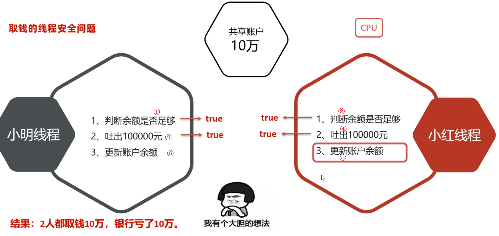

**你会发现，在这个取钱案例中，两个人把共享账户的钱都取了10万，但问题是只有10万块钱啊！！！**

以上取钱案例中的问题，就是线程安全问题的一种体现。


### 2.2 线程安全问题的代码演示

先定义一个共享的账户类

```java
public class Account {
    private String cardId; // 卡号
    private double money; // 余额。

    public Account() {
    }

    public Account(String cardId, double money) {
        this.cardId = cardId;
        this.money = money;
    }

    // 小明 小红同时过来的
    public void drawMoney(double money) {
        // 先搞清楚是谁来取钱？
        String name = Thread.currentThread().getName();
        // 1、判断余额是否足够
        if(this.money >= money){
            System.out.println(name + "来取钱" + money + "成功！");
            this.money -= money;
            System.out.println(name + "来取钱后，余额剩余：" + this.money);
        }else {
            System.out.println(name + "来取钱：余额不足~");
        }
    }

    public String getCardId() {
        return cardId;
    }

    public void setCardId(String cardId) {
        this.cardId = cardId;
    }

    public double getMoney() {
        return money;
    }

    public void setMoney(double money) {
        this.money = money;
    }
}
```

在定义一个是取钱的线程类

```java
public class DrawThread extends Thread{
    private Account acc;
    public DrawThread(Account acc, String name){
        super(name);
        this.acc = acc;
    }
    @Override
    public void run() {
        // 取钱(小明，小红)
        acc.drawMoney(100000);
    }
}
```

最后，再写一个测试类，在测试类中创建两个线程对象

```java
public class ThreadTest {
    public static void main(String[] args) {
         // 1、创建一个账户对象，代表两个人的共享账户。
        Account acc = new Account("ICBC-110", 100000);
        // 2、创建两个线程，分别代表小明 小红，再去同一个账户对象中取钱10万。
        new DrawThread(acc, "小明").start(); // 小明
        new DrawThread(acc, "小红").start(); // 小红
    }
}
```

运行程序，执行效果如下。你会发现两个人都取了10万块钱，余额为-10完了。


### 2.3 线程同步方案

为了解决前面的线程安全问题，我们可以使用线程同步思想。同步最常见的方案就是加锁，**意思是每次只允许一个线程加锁，加锁后才能进入访问，访问完毕后自动释放锁，然后其他线程才能再加锁进来。**

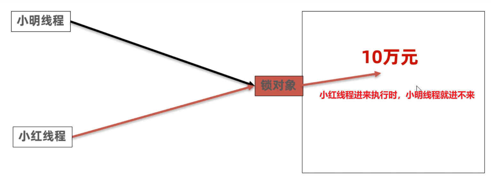

等小红线程执行完了，把余额改为0，出去了就会释放锁。这时小明线程就可以加锁进来执行，如下图所示。

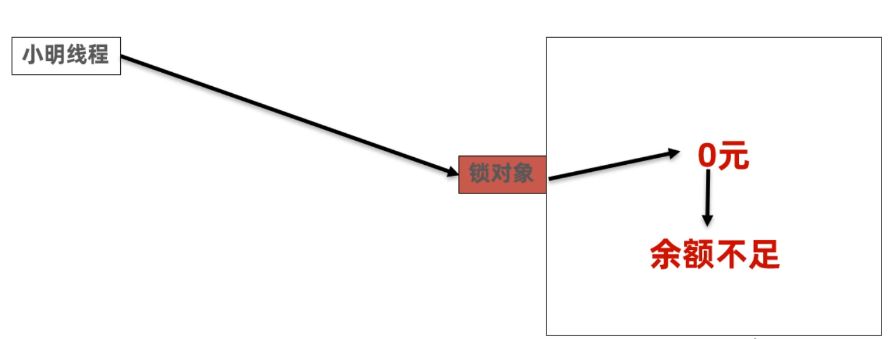

采用加锁的方案，就可以解决前面两个线程都取10万块钱的问题。怎么加锁呢？Java提供了三种方案

```java
1.同步代码块
2.同步方法
3.Lock锁
```


### 2.4 同步代码块

我们先来学习同步代码块。它的作用就是把访问共享数据的代码锁起来，以此保证线程安全。

```java
//锁对象：必须是一个唯一的对象（同一个地址）
synchronized(锁对象){
    //...访问共享数据的代码...
}
```

使用同步代码块，来解决前面代码里面的线程安全问题。我们只需要修改DrawThread类中的代码即可。

```java
// 小明 小红线程同时过来的
public void drawMoney(double money) {
    // 先搞清楚是谁来取钱？
    String name = Thread.currentThread().getName();
    // 1、判断余额是否足够
    // this正好代表共享资源！
    synchronized (this) {
        if(this.money >= money){
            System.out.println(name + "来取钱" + money + "成功！");
            this.money -= money;
            System.out.println(name + "来取钱后，余额剩余：" + this.money);
        }else {
            System.out.println(name + "来取钱：余额不足~");
        }
    }
}
```

此时再运行测试类，观察是否会出现不合理的情况。

**最后，再给同学们说一下锁对象如何选择的问题**

```java
1.建议把共享资源作为锁对象, 不要将随便无关的对象当做锁对象
2.对于实例方法，建议使用this作为锁对象
3.对于静态方法，建议把类的字节码(类名.class)当做锁对象
```


### 2.5 同步方法

接下来，学习同步方法解决线程安全问题。**其实同步方法，就是把整个方法给锁住，一个线程调用这个方法，另一个线程调用的时候就执行不了，只有等上一个线程调用结束，下一个线程调用才能继续执行。**

```java
// 同步方法
public synchronized void drawMoney(double money) {
    // 先搞清楚是谁来取钱？
    String name = Thread.currentThread().getName();
    // 1、判断余额是否足够
    if(this.money >= money){
        System.out.println(name + "来取钱" + money + "成功！");
        this.money -= money;
        System.out.println(name + "来取钱后，余额剩余：" + this.money);
    }else {
        System.out.println(name + "来取钱：余额不足~");
    }
}
```

改完之后，再次运行测试类，观察是否会出现不合理的情况。

**接着，再问同学们一个问题，同步方法有没有锁对象？锁对象是谁？**

```java
同步方法也是有锁对象，只不过这个锁对象没有显示的写出来而已。
	1.对于实例方法，锁对象其实是this（也就是方法的调用者）
	2.对于静态方法，锁对象时类的字节码对象（类名.class）
```

**最终，总结一下同步代码块和同步方法有什么区别？**

```java
1.不存在哪个好与不好，只是一个锁住的范围大，一个范围小
2.同步方法是将方法中所有的代码锁住
3.同步代码块是将方法中的部分代码锁住
```


### 2.6 Lock锁

接下来，我们再来学习一种，线程安全问题的解决办法，叫做Lock锁。

Lock锁是JDK5版本专门提供的一种锁对象，通过这个锁对象的方法来达到加锁，和释放锁的目的，使用起来更加灵活。格式如下

```java
1.首先在成员变量位子，需要创建一个Lock接口的实现类对象（这个对象就是锁对象）
	private final Lock lk = new ReentrantLock();
2.在需要上锁的地方加入下面的代码
	 lk.lock(); // 加锁
	 //...中间是被锁住的代码...
	 lk.unlock(); // 解锁
```

使用Lock锁改写前面DrawThread中取钱的方法，代码如下

```java
// 创建了一个锁对象
private final Lock lk = new ReentrantLock();

public void drawMoney(double money) {
        // 先搞清楚是谁来取钱？
        String name = Thread.currentThread().getName();
        try {
            lk.lock(); // 加锁
            // 1、判断余额是否足够
            if(this.money >= money){
                System.out.println(name + "来取钱" + money + "成功！");
                this.money -= money;
                System.out.println(name + "来取钱后，余额剩余：" + this.money);
            }else {
                System.out.println(name + "来取钱：余额不足~");
            }
        } catch (Exception e) {
            e.printStackTrace();
        } finally {
            lk.unlock(); // 解锁
        }
    }
}
```

运行程序结果，观察是否有线程安全问题。到此三种解决线程安全问题的办法我们就学习完了。


## 三、线程通信（了解）

接下来，我们学习一下线程通信。

**首先，什么是线程通信呢？**

- 当多个线程共同操作共享资源时，线程间通过某种方式互相告知自己的状态，以相互协调，避免无效的资源挣抢。

**线程通信的常见模式：是生产者与消费者模型**

- 生产者线程负责生成数据
- 消费者线程负责消费生产者生成的数据
- 注意：生产者生产完数据后应该让自己等待，通知其他消费者消费；消费者消费完数据之后应该让自己等待，同时通知生产者生成。

比如下面案例中，有3个厨师（生产者线程），两个顾客（消费者线程）。


接下来，我们先分析一下完成这个案例的思路

```java
1.先确定在这个案例中，什么是共享数据？
	答：这里案例中桌子是共享数据，因为厨师和顾客都需要对桌子上的包子进行操作。

2.再确定有那几条线程？哪个是生产者，哪个是消费者？
	答：厨师是生产者线程，3条生产者线程； 
	   顾客是消费者线程，2条消费者线程
	   
3.什么时候将哪一个线程设置为什么状态
	生产者线程(厨师)放包子：
		 1)先判断是否有包子
		 2)没有包子时，厨师开始做包子, 做完之后把别人唤醒，然后让自己等待
		 3)有包子时，不做包子了，直接唤醒别人、然后让自己等待
		 	
	消费者线程(顾客)吃包子：
		 1)先判断是否有包子
		 2)有包子时，顾客开始吃包子, 吃完之后把别人唤醒，然后让自己等待
		 3)没有包子时，不吃包子了，直接唤醒别人、然后让自己等待
```

按照上面分析的思路写代码。先写桌子类，代码如下

```java
public class Desk {
    private List<String> list = new ArrayList<>();

    // 放1个包子的方法
    // 厨师1 厨师2 厨师3
    public synchronized void put() {
        try {
            String name = Thread.currentThread().getName();
            // 判断是否有包子。
            if(list.size() == 0){
                list.add(name + "做的肉包子");
                System.out.println(name + "做了一个肉包子~~");
                Thread.sleep(2000);

                // 唤醒别人, 等待自己
                this.notifyAll();
                this.wait();
            }else {
                // 有包子了，不做了。
                // 唤醒别人, 等待自己
                this.notifyAll();
                this.wait();
            }
        } catch (Exception e) {
            e.printStackTrace();
        }
    }

    // 吃货1 吃货2
    public synchronized void get() {
        try {
            String name = Thread.currentThread().getName();
            if(list.size() == 1){
                // 有包子，吃了
                System.out.println(name  + "吃了：" + list.get(0));
                list.clear();
                Thread.sleep(1000);
                this.notifyAll();
                this.wait();
            }else {
                // 没有包子
                this.notifyAll();
                this.wait();
            }
        } catch (Exception e) {
            e.printStackTrace();
        }
    }
}
```

再写测试类，在测试类中，创建3个厨师线程对象，再创建2个顾客对象，并启动所有线程

```java
public class ThreadTest {
    public static void main(String[] args) {
        //   需求：3个生产者线程，负责生产包子，每个线程每次只能生产1个包子放在桌子上
        //      2个消费者线程负责吃包子，每人每次只能从桌子上拿1个包子吃。
        Desk desk  = new Desk();

        // 创建3个生产者线程（3个厨师）
        new Thread(() -> {
            while (true) {
                desk.put();
            }
        }, "厨师1").start();

        new Thread(() -> {
            while (true) {
                desk.put();
            }
        }, "厨师2").start();

        new Thread(() -> {
            while (true) {
                desk.put();
            }
        }, "厨师3").start();

        // 创建2个消费者线程（2个吃货）
        new Thread(() -> {
            while (true) {
                desk.get();
            }
        }, "吃货1").start();

        new Thread(() -> {
            while (true) {
                desk.get();
            }
        }, "吃货2").start();
    }
}
```

执行上面代码，运行结果如下：你会发现多个线程相互协调执行，避免无效的资源挣抢。

```
厨师1做了一个肉包子~~
吃货2吃了：厨师1做的肉包子
厨师3做了一个肉包子~~
吃货2吃了：厨师3做的肉包子
厨师1做了一个肉包子~~
吃货1吃了：厨师1做的肉包子
厨师2做了一个肉包子~~
吃货2吃了：厨师2做的肉包子
厨师3做了一个肉包子~~
吃货1吃了：厨师3做的肉包子
```


## 四、线程池

### 4.1 线程池概述

各位小伙伴，接下来我们学习一下线程池技术。先认识一下什么是线程池技术？ 其实，**线程池就是一个可以复用线程的技术**。

要理解什么是线程复用技术，我们先得看一下不使用线程池会有什么问题，理解了这些问题之后，我们在解释线程复用同学们就好理解了。

```java
假设：用户每次发起一个请求给后台，后台就创建一个新的线程来处理，下次新的任务过来肯定也会创建新的线程，如果用户量非常大，创建的线程也讲越来越多。然而，创建线程是开销很大的，并且请求过多时，会严重影响系统性能。
```

而使用线程池，就可以解决上面的问题。如下图所示，线程池内部会有一个容器，存储几个核心线程，假设有3个核心线程，这3个核心线程可以处理3个任务。

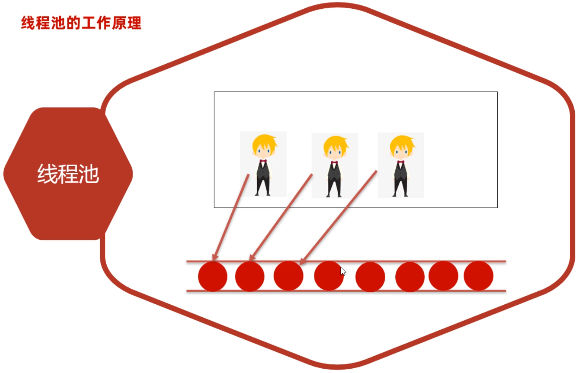


但是任务总有被执行完的时候，假设第1个线程的任务执行完了，那么第1个线程就空闲下来了，有新的任务时，空闲下来的第1个线程可以去执行其他任务。依此内推，这3个线程可以不断的复用，也可以执行很多个任务。

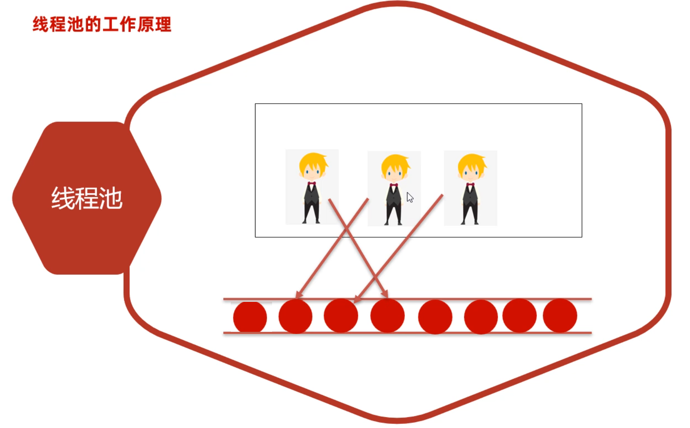


**所以，线程池就是一个线程复用技术，它可以提高线程的利用率。**


### 4.2 创建线程池

在JDK5版本中提供了代表线程池的接口ExecutorService，而这个接口下有一个实现类叫ThreadPoolExecutor类，使用ThreadPoolExecutor类就可以用来创建线程池对象。

下面是它的构造器，参数比较多，不要怕，干就完了^_^。

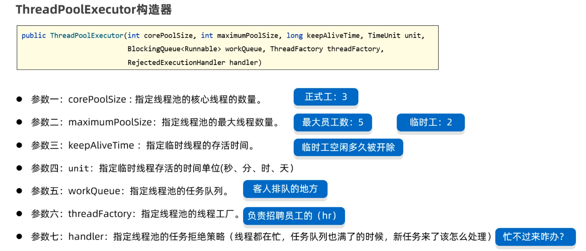

接下来，用这7个参数的构造器来创建线程池的对象。代码如下

```java
ExecutorService pool = new ThreadPoolExecutor(
    3,	//核心线程数有3个
    5,  //最大线程数有5个。   临时线程数=最大线程数-核心线程数=5-3=2
    8,	//临时线程存活的时间8秒。 意思是临时线程8秒没有任务执行，就会被销毁掉。
    TimeUnit.SECONDS,//时间单位（秒）
    new ArrayBlockingQueue<>(4), //任务阻塞队列，没有来得及执行的任务在，任务队列中等待
    Executors.defaultThreadFactory(), //用于创建线程的工厂对象
    new ThreadPoolExecutor.CallerRunsPolicy() //拒绝策略
);
```

关于线程池，我们需要注意下面的两个问题

- 临时线程什么时候创建？

  ```java
  新任务提交时，发现核心线程都在忙、任务队列满了、并且还可以创建临时线程，此时会创建临时线程。
  ```

- 什么时候开始拒绝新的任务？

  ```java
  核心线程和临时线程都在忙、任务队列也满了、新任务过来时才会开始拒绝任务。
  ```


### 4.3 线程池执行Runnable任务

创建好线程池之后，接下来我们就可以使用线程池执行任务了。线程池执行的任务可以有两种，一种是Runnable任务；一种是callable任务。下面的execute方法可以用来执行Runnable任务。

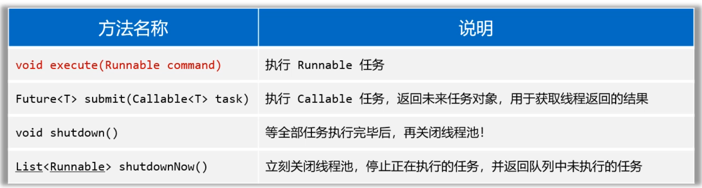

先准备一个线程任务类

```java
public class MyRunnable implements Runnable{
    @Override
    public void run() {
        // 任务是干啥的？
        System.out.println(Thread.currentThread().getName() + " ==> 输出666~~");
        //为了模拟线程一直在执行，这里睡久一点
        try {
            Thread.sleep(Integer.MAX_VALUE);
        } catch (InterruptedException e) {
            e.printStackTrace();
        }
    }
}
```

下面是执行Runnable任务的代码，注意阅读注释，对照着前面的7个参数理解。

```java
ExecutorService pool = new ThreadPoolExecutor(
    3,	//核心线程数有3个
    5,  //最大线程数有5个。   临时线程数=最大线程数-核心线程数=5-3=2
    8,	//临时线程存活的时间8秒。 意思是临时线程8秒没有任务执行，就会被销毁掉。
    TimeUnit.SECONDS,//时间单位（秒）
    new ArrayBlockingQueue<>(4), //任务阻塞队列，没有来得及执行的任务在，任务队列中等待
    Executors.defaultThreadFactory(), //用于创建线程的工厂对象
    new ThreadPoolExecutor.CallerRunsPolicy() //拒绝策略
);

Runnable target = new MyRunnable();
pool.execute(target); // 线程池会自动创建一个新线程，自动处理这个任务，自动执行的！
pool.execute(target); // 线程池会自动创建一个新线程，自动处理这个任务，自动执行的！
pool.execute(target); // 线程池会自动创建一个新线程，自动处理这个任务，自动执行的！
//下面4个任务在任务队列里排队
pool.execute(target);
pool.execute(target);
pool.execute(target);
pool.execute(target);

//下面2个任务，会被临时线程的创建时机了
pool.execute(target);
pool.execute(target);
// 到了新任务的拒绝时机了！
pool.execute(target);
```

执行上面的代码，结果输出如下

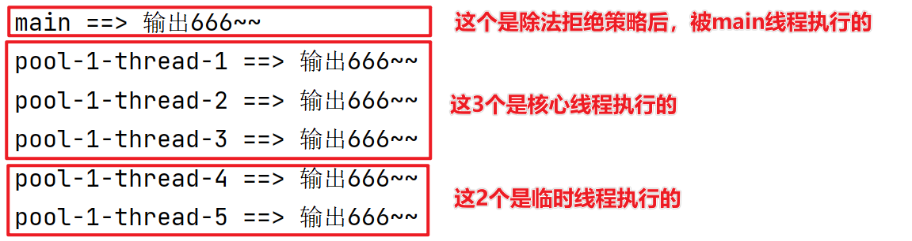


### 4.4 线程池执行Callable任务

接下来，我们学习使用线程池执行Callable任务。callable任务相对于Runnable任务来说，就是多了一个返回值。

执行Callable任务需要用到下面的submit方法

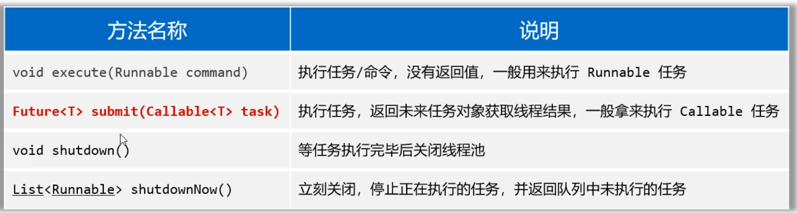

先准备一个Callable线程任务

```java
public class MyCallable implements Callable<String> {
    private int n;
    public MyCallable(int n) {
        this.n = n;
    }

    // 2、重写call方法
    @Override
    public String call() throws Exception {
        // 描述线程的任务，返回线程执行返回后的结果。
        // 需求：求1-n的和返回。
        int sum = 0;
        for (int i = 1; i <= n; i++) {
            sum += i;
        }
        return Thread.currentThread().getName() + "求出了1-" + n + "的和是：" + sum;
    }
}
```

再准备一个测试类，在测试类中创建线程池，并执行callable任务。

```java
public class ThreadPoolTest2 {
    public static void main(String[] args) throws Exception {
        // 1、通过ThreadPoolExecutor创建一个线程池对象。
        ExecutorService pool = new ThreadPoolExecutor(
            3,
            5,
            8,
            TimeUnit.SECONDS, 
            new ArrayBlockingQueue<>(4),
            Executors.defaultThreadFactory(),
            new ThreadPoolExecutor.CallerRunsPolicy());

        // 2、使用线程处理Callable任务。
        Future<String> f1 = pool.submit(new MyCallable(100));
        Future<String> f2 = pool.submit(new MyCallable(200));
        Future<String> f3 = pool.submit(new MyCallable(300));
        Future<String> f4 = pool.submit(new MyCallable(400));

        // 3、执行完Callable任务后，需要获取返回结果。
        System.out.println(f1.get());
        System.out.println(f2.get());
        System.out.println(f3.get());
        System.out.println(f4.get());
    }
}
```

执行后，结果如下图所示


### 4.5 线程池工具类（Executors）

有同学可能会觉得前面创建线程池的代码参数太多、记不住，有没有快捷的创建线程池的方法呢？有的。Java为开发者提供了一个创建线程池的工具类，叫做Executors，它提供了方法可以创建各种不能特点的线程池。如下图所示

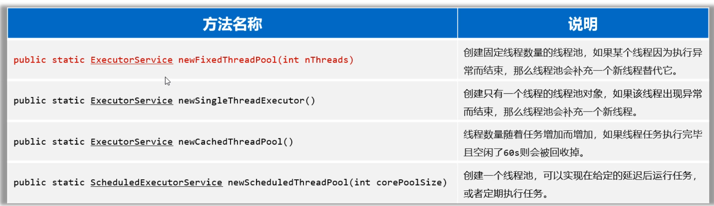

接下来，我们演示一下创建固定线程数量的线程池。这几个方法用得不多，所以这里不做过多演示，同学们了解一下就行了。

```java
public class ThreadPoolTest3 {
    public static void main(String[] args) throws Exception {
        // 1、通过Executors创建一个线程池对象。
        ExecutorService pool = Executors.newFixedThreadPool(17);
        // 老师：核心线程数量到底配置多少呢？？？
        // 计算密集型的任务：核心线程数量 = CPU的核数 + 1
        // IO密集型的任务：核心线程数量 = CPU核数 * 2

        // 2、使用线程处理Callable任务。
        Future<String> f1 = pool.submit(new MyCallable(100));
        Future<String> f2 = pool.submit(new MyCallable(200));
        Future<String> f3 = pool.submit(new MyCallable(300));
        Future<String> f4 = pool.submit(new MyCallable(400));

        System.out.println(f1.get());
        System.out.println(f2.get());
        System.out.println(f3.get());
        System.out.println(f4.get());
    }
}
```

Executors创建线程池这么好用，为什么不推荐同学们使用呢？原因在这里：看下图，这是《阿里巴巴Java开发手册》提供的强制规范要求。

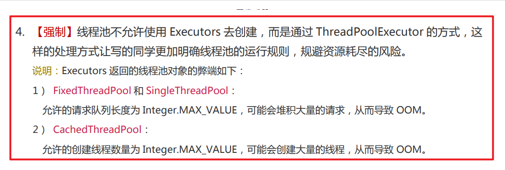

## 五、补充知识

最后，我们再补充几个概念性的知识点，同学们知道这些概念什么意思就可以了。

### 5.1 并发和并行

先学习第一个补充知识点，并发和并行。在讲解并发和并行的含义之前，我们先来了解一下什么是进程、线程？

- 正常运行的程序（软件）就是一个独立的进程
- 线程是属于进程，一个进程中包含多个线程
- 进程中的线程其实并发和并行同时存在（继续往下看）

我们可以打开系统的任务管理器看看（快捷键：Ctrl+Shfit+Esc），自己的电脑上目前有哪些进程。


知道了什么是进程和线程之后，接着我们再来学习并发和并行的含义。

**首先，来学习一下什么是并发？**

进程中的线程由CPU负责调度执行，但是CPU同时处理线程的数量是优先的，为了保证全部线程都能执行到，CPU采用轮询机制为系统的每个线程服务，由于CPU切换的速度很快，给我们的感觉这些线程在同时执行，这就是并发。（简单记：并发就是多条线程交替执行）

**接下，再来学习一下什么是并行？**

并行指的是，多个线程同时被CPU调度执行。如下图所示，多个CPU核心在执行多条线程

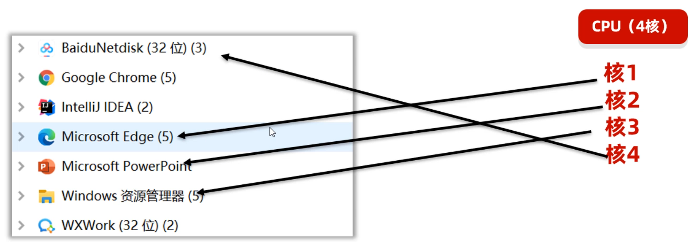

**最后一个问题，多线程到底是并发还是并行呢？**

其实多个线程在我们的电脑上执行，并发和并行是同时存在的。


### 5.2 线程的生命周期

接下来，我们学习最后一个有关线程的知识点，叫做线程的生命周期。所谓生命周期就是线程从生到死的过程中间有哪些状态，以及这些状态之间是怎么切换的。

为了让大家同好的理解线程的生命周期，先用人的生命周期举个例子，人从生到死有下面的几个过程。在人的生命周期过程中，各种状态之间可能会有切换，线程也是一样的。

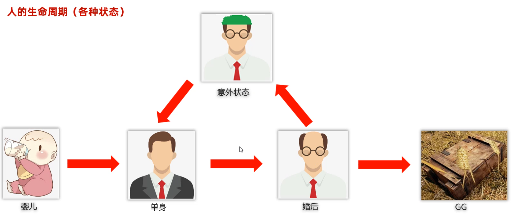

接下来就来学习线程的生命周期。在Thread类中有一个嵌套的枚举类叫Thread.Status，这里面定义了线程的6中状态。如下图所示

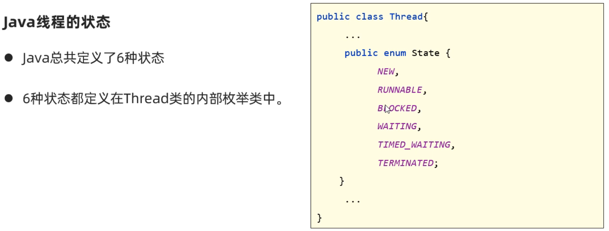

```java
NEW: 新建状态，线程还没有启动
RUNNABLE: 可以运行状态，线程调用了start()方法后处于这个状态
BLOCKED: 锁阻塞状态，没有获取到锁处于这个状态
WAITING: 无限等待状态，线程执行时被调用了wait方法处于这个状态
TIMED_WAITING: 计时等待状态，线程执行时被调用了sleep(毫秒)或者wait(毫秒)方法处于这个状态
TERMINATED: 终止状态, 线程执行完毕或者遇到异常时，处于这个状态。
```

这几种状态之间切换关系如下图所示

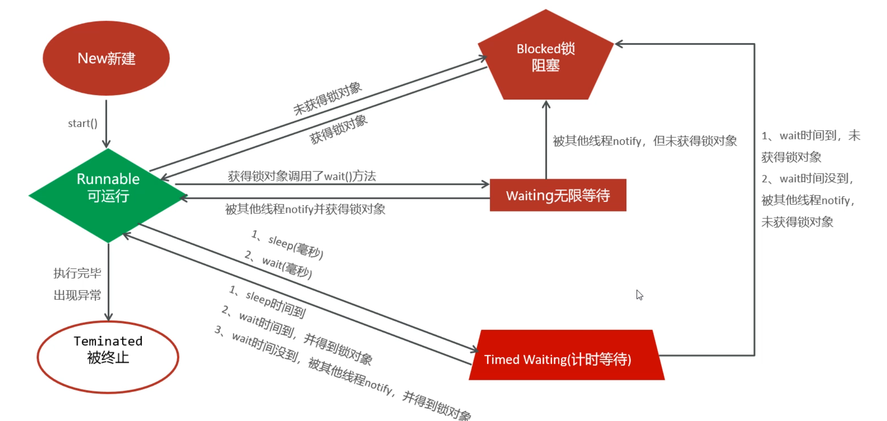

