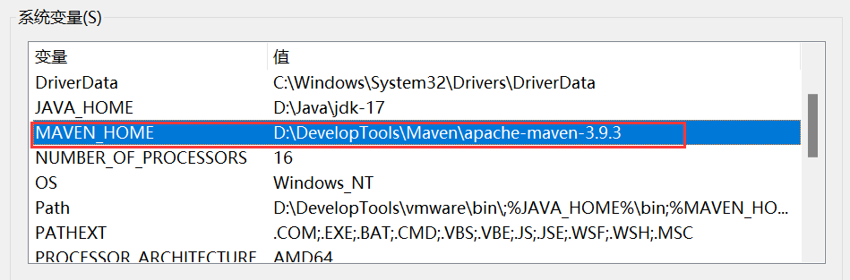
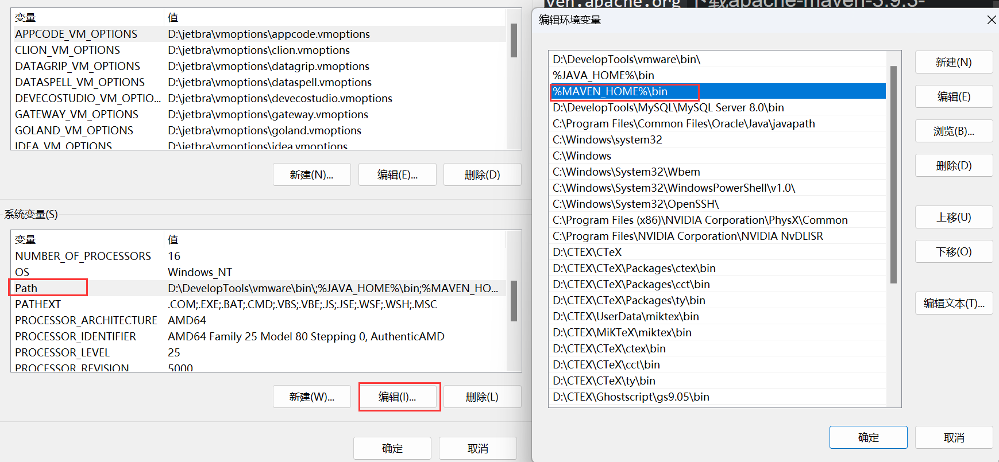
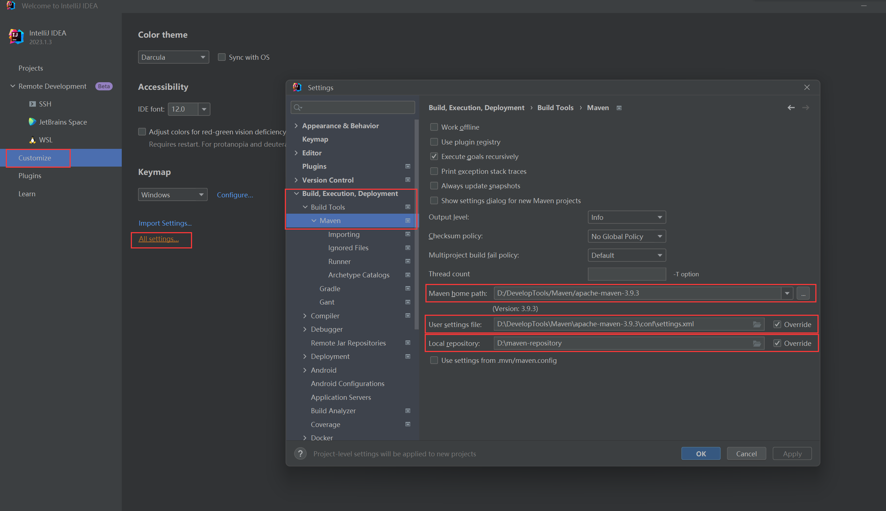
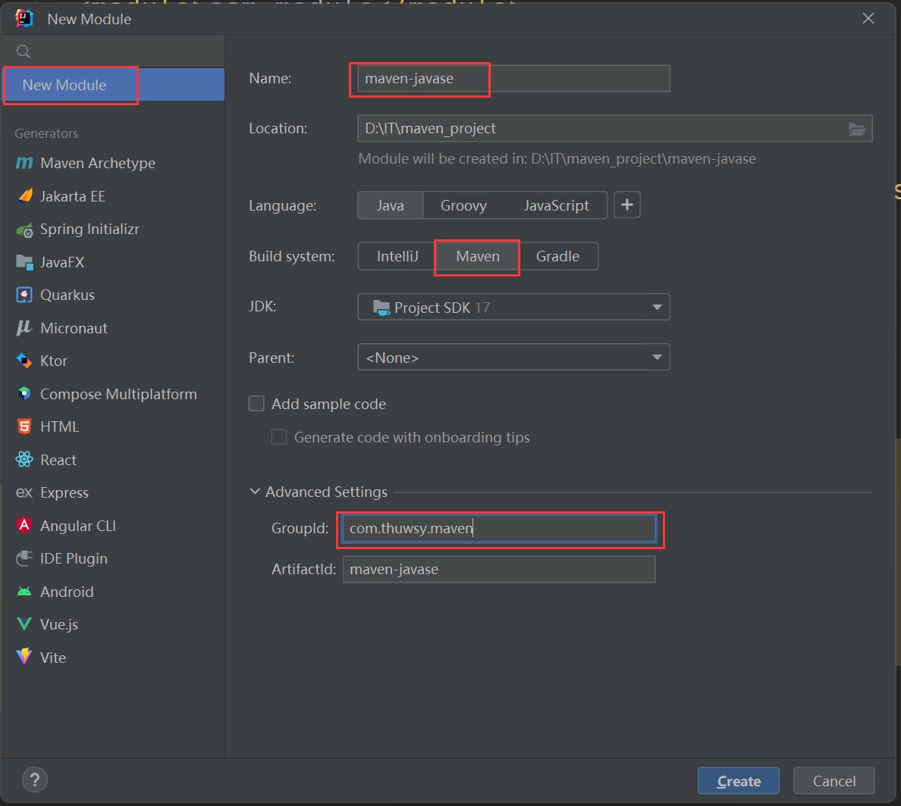
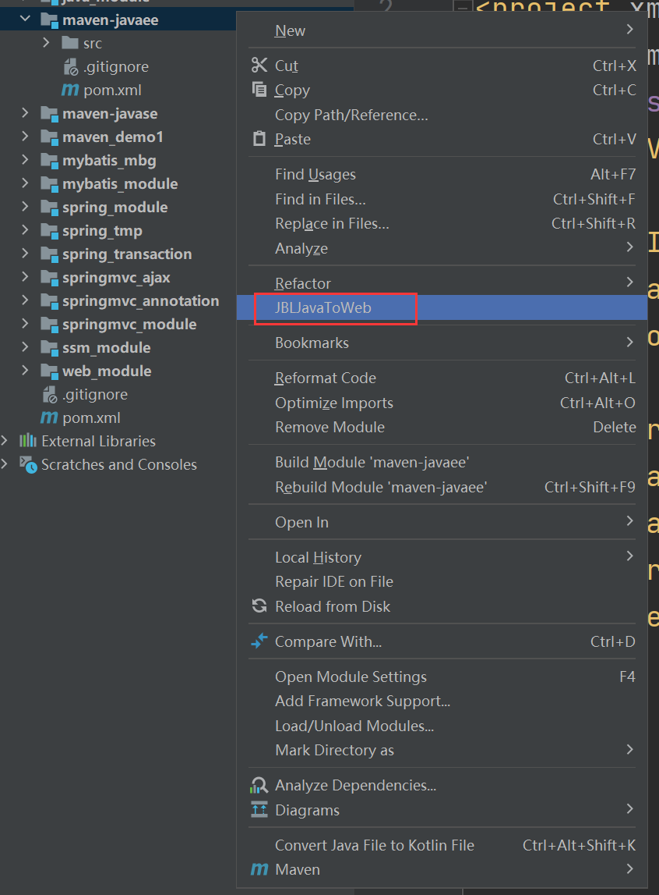
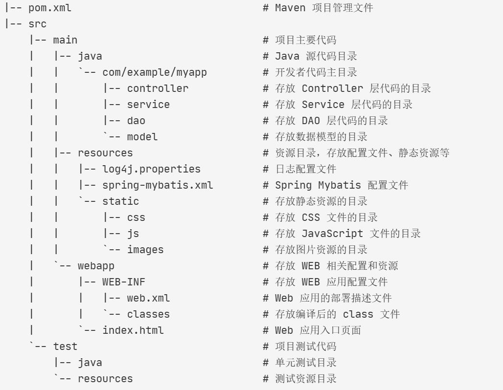
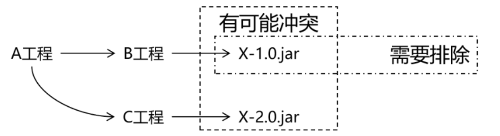
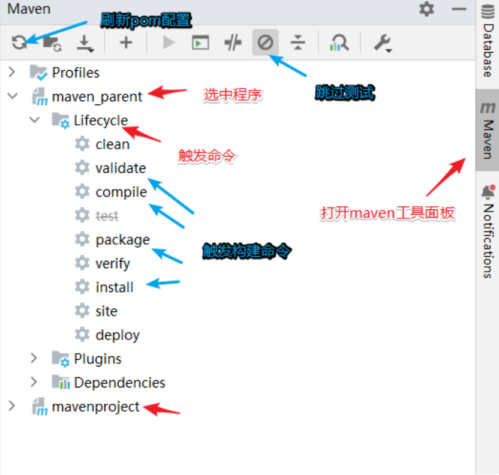
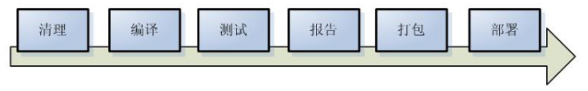

# 1. Maven简介

## 1.1 Maven的作用

Maven 是一款为 Java 项目**构建管理、依赖管理**的工具（软件），使用 Maven 可以自动化构建、测试、打包和发布项目，大大提高了开发效率和质量。

**依赖管理**

Maven 可以管理项目的依赖，包括自动下载所需依赖库、自动下载依赖需要的依赖并且保证版本没有冲突、依赖版本管理等。通过 Maven，我们可以方便地维护项目所依赖的外部库，而我们仅仅需要编写配置即可。

**构建管理**

项目构建是指将源代码、配置文件、资源文件等转化为能够运行或部署的应用程序或库的过程。

Maven 可以管理项目的编译、测试、打包、部署等构建过程。通过实现标准的构建生命周期，Maven 可以确保每一个构建过程都遵循同样的规则和最佳实践。同时，Maven 的插件机制也使得开发者可以对构建过程进行扩展和定制。主动触发构建，只需要简单的命令操作即可。

## 1.2 Maven的安装和配置

（1）到官网`https://maven.apache.org`下载apache-maven-3.9.3-bin.zip，然后解压即可。注意Maven必须要本机有java环境，且配置了JAVA_HOME环境变量。

（2）配置MAVEN_HOME和PATH





（3）在命令行输入`mvn -v`测试，查看maven版本

（4）修改MAVEN_HOME路径下的conf目录下的settings.xml文件：

- 配置本地仓库地址：第55行，
    ```xml
    <localRepository>D:\maven-repository</localRepository>
    ```
- 配置Maven的下载镜像(国内阿里镜像)：第168行，需要注释掉已有的mirror标签
    ```xml
    <mirror>
        <id>nexus-aliyun</id>
        <mirrorOf>central</mirrorOf>
        <name>Nexus aliyun</name>
        <url>http://maven.aliyun.com/nexus/content/groups/public</url>
    </mirror>
    ```
- 配置maven选用编译项目的jdk版本(jdk17)：第263行，
    ```xml
    <profile>
        <id>jdk-17</id>
        <activation>
            <activeByDefault>true</activeByDefault>
            <jdk>17</jdk>
        </activation>
        <properties>
            <maven.compiler.source>17</maven.compiler.source>
            <maven.compiler.target>17</maven.compiler.target>
            <maven.compiler.compilerVersion>17</maven.compiler.compilerVersion>
        </properties>
    </profile>
    ```

## 1.3 IDEA配置本地Maven



## 1.4 Linux安装Maven

（1）将官网下载的apache-maven-3.9.5-bin.tar.gz上传到Linux服务器的/usr/local目录下，然后解压

```shell
tar -zxvf apache-maven-3.9.5-bin.tar.gz
cd apache-maven-3.9.5
mkdir maven-repository
```

（2）Maven的配置文件

```shell
cd conf
vim settings.xml
```

- 配置本地仓库地址：
    ```xml
    <localRepository>/usr/local/apache-maven-3.9.5/maven-repository</localRepository>
    ```
- 配置Maven的下载镜像(国内阿里镜像)：需要注释掉已有的mirror标签
    ```xml
    <mirror>
        <id>nexus-aliyun</id>
        <mirrorOf>central</mirrorOf>
        <name>Nexus aliyun</name>
        <url>http://maven.aliyun.com/nexus/content/groups/public</url>
    </mirror>
    ```
- 配置maven选用编译项目的jdk版本(jdk17)：
    ```xml
    <profile>
        <id>jdk-17</id>
        <activation>
            <activeByDefault>true</activeByDefault>
            <jdk>17</jdk>
        </activation>
        <properties>
            <maven.compiler.source>17</maven.compiler.source>
            <maven.compiler.target>17</maven.compiler.target>
            <maven.compiler.compilerVersion>17</maven.compiler.compilerVersion>
        </properties>
    </profile>
    ```

（3）配置Maven环境变量，`vim /etc/profile`，在最后加上

```vim
export MAVEN_HOME=/usr/local/apache-maven-3.9.5
export PATH=$PATH:$MAVEN_HOME/bin
```

然后重新加载一下`source /etc/profile`使新增配置生效

（4）测试`mvn -v`

# 2. 基于IDEA的Maven工程创建

## 2.1 Maven工程的GAVP属性

Maven中的GAVP是指 GroupId、ArtifactId、Version、Packaging 等四个属性的缩写，其中前三个是必要的，而 Packaging 属性为可选项。这四个属性主要为每个项目在maven仓库总做一个标识。有了具体标识，方便maven软件对项目进行管理和互相引用！

**GAV遵循以下规则：**

1）**GroupID 格式**：`com.公司名.业务线[.子业务线]`，最多4级

2）**ArtifactID 格式**：模块名

3）**Version版本号格式推荐**：`主版本号.次版本号.修订号`，例如`1.0.0`

- 主版本号：当做了不兼容的 API 修改，或者增加了能改变产品方向的新功能。
- 次版本号：当做了向下兼容的功能性新增（新增类、接口等）。
- 修订号：修复 bug，没有修改方法签名的功能加强，保持 API 兼容性。

**Packaging定义规则**：指示将项目打包为什么类型的文件，idea根据packaging值，识别maven项目类型：

- packaging 属性为 jar（默认值），代表普通的Java工程，打包以后是.jar结尾的文件。
- packaging 属性为 war，代表Java的web工程，打包以后.war结尾的文件。
- packaging 属性为 pom，代表不会打包，用来做父工程。


## 2.2 IDEA构建Maven JavaSE工程



> 注意：version默认为1.0-SNAPSHOT，想修改可以在pom.xml中修改

## 2.3 IDEA构建Maven JavaEE工程

需要安装插件JBLJavaToWeb，然后根据上述步骤创建一个普通的Maven JavaSE工程，最后在工程模块右键使用JBLJavaToWeb插件快速创建web项目。




## 2.4 Maven工程项目结构说明



- pom.xml：Maven 项目管理文件，用于描述项目的依赖和构建配置等信息。
- src/main/java：存放项目的 Java 源代码。
- src/main/resources：存放项目的资源文件，如配置文件、静态资源等。
- src/main/webapp/WEB-INF：存放 Web 应用的配置文件。
- src/main/webapp/index.html：Web 应用的入口页面。
- src/test/java：存放项目的测试代码。
- src/test/resources：存放测试相关的资源文件，如测试配置文件等。

# 3. 依赖管理

## 3.1 依赖管理和配置

我们通过编写pom.xml文件，Maven就能够自动解析项目的依赖关系，并通过 Maven 仓库**自动下载**和管理依赖，从而避免了手动下载和管理依赖的繁琐工作和可能引发的版本冲突问题。

### 3.1.1 maven项目信息

```xml
<!-- 模型版本 -->
<modelVersion>4.0.0</modelVersion>

<groupId>com.thuwsy.maven</groupId>
<artifactId>maven-01-demo</artifactId>
<version>1.0-SNAPSHOT</version>
<packaging>war</packaging>
```

### 3.1.2 依赖添加和管理

```xml
<!-- 
   通过编写依赖jar包的gav必要属性，引入第三方依赖！
   scope属性是可选的(默认为compile)，可以指定依赖生效范围：
     - compile
     - provided 
     - runtime
     - test
 -->
<dependencies>
    <!-- 引入具体的依赖包 -->
    <dependency>
        <groupId>log4j</groupId>
        <artifactId>log4j</artifactId>
        <version>1.2.17</version>
        <scope>runtime</scope>
    </dependency>
</dependencies>
```

### 3.1.3 提取依赖版本便于维护

```xml
<!--在properties标签中声明版本-->
<properties>
    <!--命名随便，内部制定版本号即可！-->
    <junit.version>4.12</junit.version>
    <!--也可以通过maven规定的固定的key，配置maven的参数，如下配置编码格式！-->
    <project.build.sourceEncoding>UTF-8</project.build.sourceEncoding>
    <project.reporting.outputEncoding>UTF-8</project.reporting.outputEncoding>
</properties>

<dependencies>
    <dependency>
        <groupId>org.junit.jupiter</groupId>
        <artifactId>junit-jupiter-api</artifactId>
        <!--引用properties声明版本 -->
        <version>${junit.version}</version>
        <scope>test</scope>
    </dependency>
</dependencies>
```

## 3.2 依赖传递

**依赖传递**指的是当一个模块或库 A 依赖于另一个模块或库 B，而 B 又依赖于模块或库 C，那么 A 会间接依赖于 C。这种依赖传递结构可以形成一个依赖树。当我们引入一个库或框架时，构建工具（如 Maven、Gradle）会**自动解析和加载其所有的直接和间接依赖**，确保这些依赖都可用。

依赖传递的作用是：

1. 减少重复依赖：当多个项目依赖同一个库时，Maven 可以自动下载并且只下载一次该库。这样可以减少项目的构建时间和磁盘空间。
2. 自动管理依赖: Maven 可以自动管理依赖项，使用依赖传递，简化了依赖项的管理，使项目构建更加可靠和一致。
3. 确保依赖版本正确性：通过依赖传递的依赖，之间都不会存在版本兼容性问题，确实依赖的版本正确性。

## 3.3 依赖冲突

当直接引用或者间接引用出现了相同的jar包，这时一个项目就会出现相同的重复jar包，这就称为**依赖冲突**。此时Maven为了避免出现重复依赖，会立即**终止依赖传递**。



我们可以手动解决冲突，但并不推荐，因为Maven拥有自动解决依赖冲突问题的能力，它会按照以下原则选择依赖：

- 第一原则(短路优先原则)：例如`A->B->C->D->E->X(v1.0)`和`A->F->X(v2.0)`，则A依赖于X(v2.0)
- 第二原则(先声明优先)：在依赖路径长度相同时，在`<dependencies>`中先声明的，会优先选择。

## 3.4 依赖导入失败的解决方案

如果依赖项的版本号是正确无误的，且网络连接也没有问题，此时依赖导入失败，很可能是本地Maven仓库被污染。我们前往本地仓库中，根据依赖的gav属性依次向下查找文件夹，最终删除内部的以`.lastupdated`结尾的文件，然后重新下载即可。

# 4. 构建管理

## 4.1 构建方式

### 4.1.1 命令方式构建

|命令|描述|
|-|-|
|mvn clean|清理编译或打包后的项目结构,删除target文件夹|
|mvn compile|编译项目，生成target文件|
|mvn test|执行测试源码 (测试)|
|mvn site|生成一个项目依赖信息的展示页面|
|mvn package|打包项目，生成war / jar 文件|
|mvn install|打包后上传到maven本地仓库(本地部署)|
|mvn deploy|只打包，上传到maven私服仓库(私服部署)|

### 4.1.2 可视化方式构建



## 4.2 构建命令周期



构建生命周期可以理解成是一组固定构建命令的有序集合，触发周期后的命令，会自动触发周期前的命令。

**清理周期**：主要是对项目编译生成文件进行清理

- 包含命令：clean

**默认周期**：定义了真正构件时所需要执行的所有步骤，它是生命周期中最核心的部分

- 包含命令：compile - test - package - install / deploy

**报告周期**

- 包含命令：site

## 4.3 应用场景

**1、重新编译**

使用命令`mvn clean compile`

**2、打包**

使用命令`mvn clean package`

**3、部署到本地仓库**

使用命令`mvn clean install`

## 4.4 插件配置

一个周期包含若干命令，一个命令包含若干插件。使用周期命令构建是为了简化构建过程，但最终进行构建的是插件。由于jdk17和war包版本插件不匹配，所以我们需要配置插件：

```xml
<build>
   <!-- jdk17 和 war包版本插件不匹配 -->
    <plugins>
        <plugin>
            <groupId>org.apache.maven.plugins</groupId>
            <artifactId>maven-war-plugin</artifactId>
            <version>3.2.2</version>
        </plugin>
    </plugins>
</build>
```

# 5. Maven继承和聚合特性

## 5.1 Maven工程继承关系

### 5.1.1 继承简介

Maven 继承是指在 Maven 的项目中，让一个项目从另一个项目中继承配置信息的机制。继承可以让我们在多个项目中共享同一配置信息，简化项目的管理和维护工作。

继承最主要的**作用**就是在父工程中统一管理项目中的依赖信息，进行统一版本管理。

### 5.1.2 继承的语法

（1）在父工程中将打包方式改为pom

```xml
<groupId>com.atguigu.maven</groupId>
<artifactId>pro03-maven-parent</artifactId>
<version>1.0-SNAPSHOT</version>
<!-- 当前工程作为父工程，它要去管理子工程，所以打包方式必须是 pom -->
<packaging>pom</packaging>
```

（2）在子工程中使用parent标签去指定父工程

```xml
<!-- 使用parent标签指定当前工程的父工程 -->
<parent>
    <!-- 父工程的坐标 -->
    <groupId>com.atguigu.maven</groupId>
    <artifactId>pro03-maven-parent</artifactId>
    <version>1.0-SNAPSHOT</version>
</parent>

<!-- 子工程的坐标 -->
<!-- 如果子工程坐标中的groupId和version与父工程一致，那么可以省略 -->
<!-- <groupId>com.atguigu.maven</groupId> -->
<artifactId>pro04-maven-module</artifactId>
<!-- <version>1.0-SNAPSHOT</version> -->
```

（3）父工程使用dependencyManagement标签统一管理依赖版本

```xml
<!-- 使用dependencyManagement标签配置对依赖版本的管理 -->
<!-- 被管理的依赖并没有真正被引入到工程 -->
<dependencyManagement>
    <dependencies>
        <dependency>
            <groupId>org.springframework</groupId>
            <artifactId>spring-core</artifactId>
            <version>4.0.0.RELEASE</version>
        </dependency>
        <dependency>
            <groupId>org.springframework</groupId>
            <artifactId>spring-aop</artifactId>
            <version>4.0.0.RELEASE</version>
        </dependency>
    </dependencies>
</dependencyManagement>

<dependencies>
    <dependency>
        <groupId>org.junit.jupiter</groupId>
        <artifactId>junit-jupiter-api</artifactId>
        <version>5.3.1</version>
        <scope>test</scope>
    </dependency>
</dependencies>
```

> 注意：dependencyManagement标签下的依赖并没有被引入到工程，其作用只是为了管理版本。如果想让父工程中引入一些依赖，直接被子工程继承使用，那么就使用dependencies标签即可(不要用dependencyManagement标签包裹)，如上的junit就可以直接被子工程使用。

（4）子工程中使用父工程管理的依赖版本

```xml
<!--子工程引用父工程中的依赖信息时，可以不写版本号，
这样就表示使用父工程的dependencyManagement中管理的版本号-->
<dependencies>
    <dependency>
        <groupId>org.springframework</groupId>
        <artifactId>spring-core</artifactId>
    </dependency>
    <dependency>
        <groupId>org.springframework</groupId>
        <artifactId>spring-aop</artifactId>
    </dependency>
</dependencies>
```

## 5.2 Maven工程聚合关系

Maven 聚合是指将多个项目组织到一个父级项目中，**通过触发父工程的构建，就会统一按顺序触发子工程构建的过程**。聚合的作用如下：

1. 统一管理子项目构建：通过聚合，可以将多个子项目组织在一起，方便管理和维护。
2. 优化构建顺序：通过聚合，可以对多个项目进行顺序控制，避免出现构建依赖混乱导致构建失败的情况。

聚合的语法(在父项目中包含子项目)：

```xml
<project>
    <groupId>com.example</groupId>
    <artifactId>parent-project</artifactId>
    <packaging>pom</packaging>
    <version>1.0.0</version>
    <modules>
        <module>child-project1</module>
        <module>child-project2</module>
    </modules>
</project>
```