# 第01章_数据库概述

## 1. 基本概念

- DBMS，数据库管理系统(Database Management System)，是一种操纵和管理数据库的大型软件，用于对数据库进行统一管理和控制。常见的DBMS有Oracle、MySQL等。
- DB，数据库(Database)，是存储数据的仓库，其本质是一个文件系统。
- SQL，结构化查询语言(Structured Query Language)，是专门用来与数据库通信的语言。

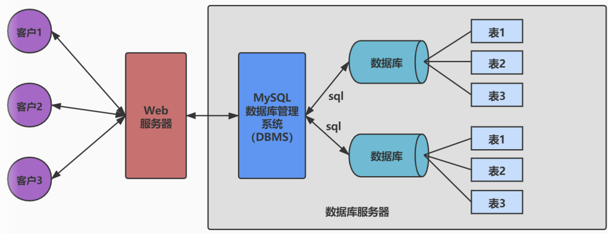

MySQL是一个开源的关系型数据库管理系统(RDBMS)，它比Oracle体积小、成本低。MySQL在历史版本中，从5.7版本直接跳跃发布了8.0版本，这是一个里程碑版本，大幅提升了性能。

RDBMS是DMBS的主流，像Oracle、MySQL都是RDBMS。关系型数据库以二维表格形式（行和列）存储数据，表与表之间的数据记录可以有关系。SQL就是关系型数据库的查询语言。

> 非关系型数据库无需经过SQL解析，一般性能都非常高，例如Redis

## 2. 表的关联关系

### 2.1 一对一关联

一对一关联在实际开发中应用不多，因为它通常可以合成为一张表。举例：

- 用户的常用信息表：id, name, age
- 用户的不常用信息表: id, hobby, remark

这两个表通过主键id关联，形成一对一关联。

### 2.2 一对多关联

一对多关联，就是在从表(多方)创建一个字段，指向主表(一方)的主键。举例：

- 部门表(主表)：部门id, 部门名称, 部门简介
- 员工表(从表)：员工id, 员工其他信息..., 员工所属部门id(指向部门表的主键)

### 2.3 多对多关联

要表示多对多关系，必须创建第三个表，该表通常称为`联接表`或`中间表`，用于将多对多关系划分为两个一对多关系，该中间表保存这两个表的主键。举例：

- 角色表：role_id, role_name, role_info
- 权限表：perm_id, perm_name, perm_info
- 中间表：id, role_id, perm_id

### 2.4 自我引用

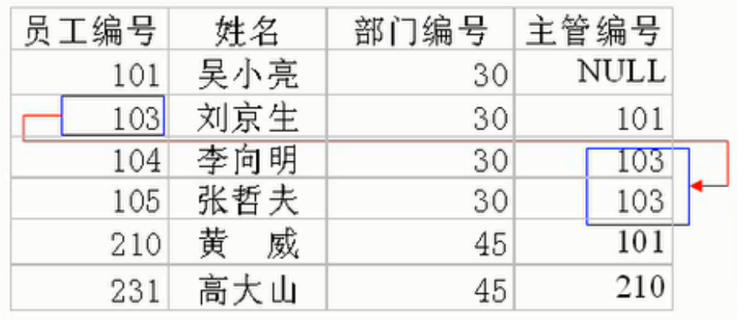

## 3. Linux安装MySQL

### 3.1 下载安装MySQL Server

（1）前往官网并选择版本进行下载 https://dev.mysql.com/downloads/mysql/

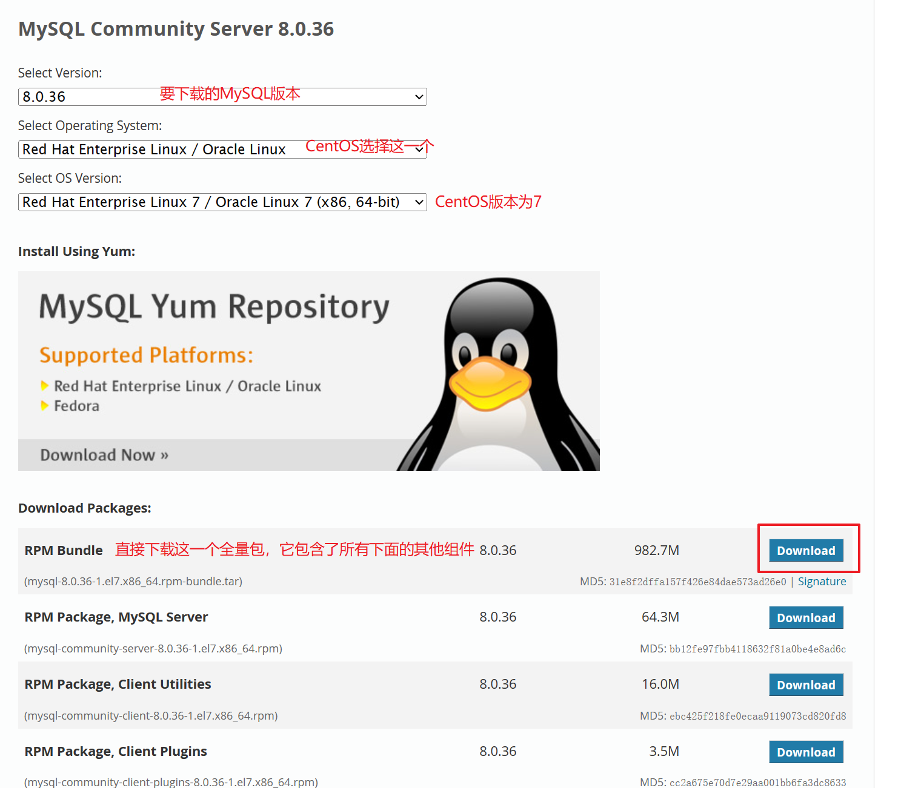

（2）将下载得到的`mysql-8.0.36-1.el7.x86_64.rpm-bundle.tar`进行解压，然后将解压后的所有文件都上传到Linux服务器的`/opt/mysql-8.0.36`目录下

（3）检查依赖

```sh
chmod -R 777 /tmp
yum update
yum install libaio
yum install net-tools
yum install perl
yum remove mysql-libs
```

（4）安装MySQL

```sh
cd /opt/mysql-8.0.36
rpm -ivh mysql-community-common-8.0.36-1.el7.x86_64.rpm
rpm -ivh mysql-community-client-plugins-8.0.36-1.el7.x86_64.rpm
rpm -ivh mysql-community-libs-8.0.36-1.el7.x86_64.rpm
rpm -ivh mysql-community-client-8.0.36-1.el7.x86_64.rpm
rpm -ivh mysql-community-icu-data-files-8.0.36-1.el7.x86_64.rpm
rpm -ivh mysql-community-server-8.0.36-1.el7.x86_64.rpm
```

（5）MySQL服务初始化

```sh
mysqld --initialize --user=mysql
cat /var/log/mysqld.log
```

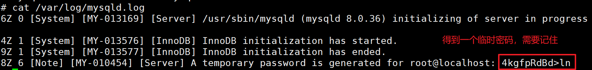

（6）启动MySQL服务

```sh
systemctl start mysqld.service
systemctl enable mysqld.service
```

### 3.2 登录MySQL

（1）登录MySQL，执行以下命令后输入密码（首次登录时需要使用上述临时密码）

```sh
mysql -hlocalhost -P3306 -uroot -p
```

（2）修改密码

```sql
ALTER USER 'root'@'localhost' IDENTIFIED BY 'abc666';
```

（3）配置允许远程登录（将root用户对应的host设置为`%`，表示允许所有ip都能连接）

```sql
USE mysql;
update user set host = '%' where user ='root';
flush privileges;
```

（4）现在，就可以使用Navicat远程连接MySQL了

### 3.3 字符集

MySQL5.7版本还需要将默认字符集修改为utf-8，而MySQL8.0版本则无需这一步骤。我们可以查看：

```sql
mysql> show variables like 'character%';
+--------------------------+--------------------------------+
| Variable_name            | Value                          |
+--------------------------+--------------------------------+
| character_set_client     | utf8mb4                        |
| character_set_connection | utf8mb4                        |
| character_set_database   | utf8mb4                        |
| character_set_filesystem | binary                         |
| character_set_results    | utf8mb4                        |
| character_set_server     | utf8mb4                        |
| character_set_system     | utf8mb3                        |
| character_sets_dir       | /usr/share/mysql-8.0/charsets/ |
+--------------------------+--------------------------------+
8 rows in set (0.00 sec)
```

- `character_set_server`是服务器级别的字符集
- `character_set_database`是数据库级别的字符集，也就是创建数据库时的默认字符集
- MySQL还有表级别的字符集，如果创建表时不额外指定字符集，则默认使用的就是该表所在数据库的字符集
- MySQL还有列级别的字符集，如果创建存储字符串的列时不额外指定字符集，则默认使用的就是该列所在表的字符集

> 说明：utf8mb4是标准的utf8字符集，即使用1到4个字节表示字符；而utf8mb3并不标准，只使用1到3个字节表示字符。**推荐统一使用utf8mb4**。

## 4. SQL简介

### 4.1 SQL分类

SQL语言在功能上主要分为如下三大类：

- **DDL（Data Definition Language，数据定义语言）**：包括创建，删除，修改数据库、表、视图、索引等数据库对象。主要的语句关键字包括`CREATE`、`DROP`、`ALTER`等。
- **DML（Data Manipulation Language，数据操作语言）**：包括添加，删除，更新，查询数据库记录。主要的语句关键字包括`INSERT`、`DELETE`、`UPDATE`、`SELECT`等。
- **DCL（Data Control Language，数据控制语言）**：包括定义数据库、表、字段、用户的访问权限和安全级别。主要的语句关键字包括`GRANT`、`REVOKE`、`COMMIT`、`ROLLBACK`、`SAVEPOINT`等。

> 说明：由于查询语句使用的非常频繁，所以有时也将查询语句单独分为一类，称为**DQL（Data Query Language，数据查询语言）**。有时也会将`COMMIT`、`ROLLBACK`单独分为一类，称为**TCL（Transaction Control Language，事务控制语言）**。

### 4.2 SQL规范

规则：

- 每条SQL语句以`;`或者`\g`或者`\G`结束
- 字符串、日期时间类型的数据，使用单引号`''`
- 如果要对列起别名，则别名建议使用双引号`""`，且尽量不要省略as
- 如果数据库名、表名或者字段名与保留字冲突，则必须使用着重号``引起来

在Linux中，MySQL的大小写规则为：

- 数据库名、表名、表的别名、变量名是严格区分大小写的
- SQL关键字、函数名、列名、列的别名是不区分大小写的

> 注意：在Windows中，以上全部都不区分大小写。

因此，我们建议采用统一的书写规范：

- 数据库名、表名、表的别名、列名、列的别名统一小写
- SQL关键字、函数名、绑定变量等统一大写

## 5. MySQL的架构

### 5.1 MySQL的逻辑架构

MySQL是典型的C/S架构，服务端程序使用的mysqld。整个过程总体来看就是**客户端进程向服务器进程发送一段文本（SQL语句），服务器进程处理后再向客户端进程发送一段文本（处理结果）**。这个过程可以细分为如下三个步骤：

1. 客户端首先向MySQL Server建立TCP连接
2. MySQL Server中分为三层逻辑结构，来处理客户端请求
3. 最终将数据存储到文件系统中，并响应客户端

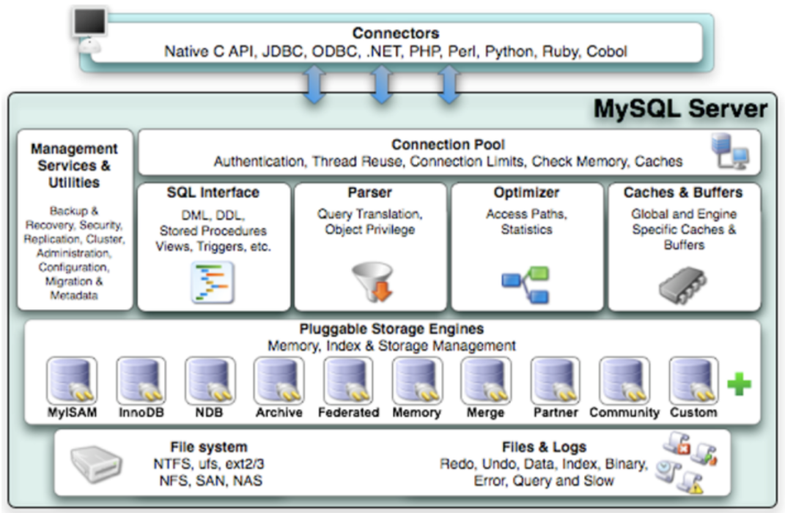

MySQL Server中分为三层逻辑结构：

#### 第一层：连接层

连接层的主要作用有：

- 管理连接：收到客户端的TCP连接请求后，每一个连接会从线程池中获取线程，该线程专门与这个客户端进行交互
- 用户认证：建立TCP连接后，会对用户传输的账号密码做身份认证
- 获取权限：用户身份认证通过后，会从权限表中查出该用户的权限，将权限与这个连接关联

#### 第二层：服务层

在服务层，MySQL Server会解析请求并创建相应的语法树，并对其完成优化（如确定查询表的顺序，是否利用索引等），最后生成相应的执行计划。服务层的常用组件如下：

- SQL接口(SQL Interface)：用于接收用户的SQL命令，并且返回给用户结果
- 解析器(Parser)：对SQL语句进行语法分析，并生成语法树
- 优化器(Optimizer)：对SQL语句进行优化，生成一个执行计划
- 查询缓存(Caches)：缓存一些查询语句及其查询结果。注意，在MySQL 8中已经删除了查询缓存，因为必须要完全相同的查询语句才能命中缓存，所以缓存命中率极低。

所以在MySQL 8中SQL语句的执行流程为：

1. 解析器对SQL语句进行语法分析，然后生成语法树
2. 优化器对SQL语句进行优化，确定SQL语句的执行路径（比如选择`全表检索`还是`索引检索`，要使用哪个索引等等），最终生成一个执行计划
3. 执行器根据执行计划，去调用一个具体的存储引擎来真正执行SQL语句

#### 第三层：引擎层

插件式存储引擎（Storage Engines），真正地负责了MySQL中数据的存储和提取，对物理服务器级别维护的底层数据执行操作，服务器通过API与存储引擎进行通信。

### 5.2 存储引擎

MySQL支持很多存储引擎，但最常用的是InnoDB和MyISAM。在MySQL 5.5之前的默认存储引擎是MyISAM，而在MySQL 5.5及之后的**默认存储引擎是InnoDB**。这两个存储引擎的主要区别如下：

- InnoDB支持事务；而MyISAM不支持事务
- InnoDB支持外键；而MyISAM不支持外键
- InnoDB支持表级锁和行级锁；而MyISAM只支持表级锁
- InnoDB的数据文件将表结构信息、数据信息、索引信息保存在同一个文件中；而MyISAM则将这三部分信息保存在三个文件中
- MyISAM针对数据统计有额外的常数存储，所以其`COUNT(*)`的时间复杂度是`O(1)`；而InnoDB的`COUNT(*)`的时间复杂度是`O(n)`
- MyISAM适用于以读为主的业务，其访问速度很快；而具备增删改查的业务，必然优先选择InnoDB
- InnoDB占用的磁盘空间更大
- 在数据库缓冲池中，InnoDB既缓存真实数据，又缓存索引；而MyISAM在数据库缓冲池中只缓存索引，不缓存真实数据。所以InnoDB使用的内存也更大。

### 5.3 数据库缓冲池

我们以`InnoDB`存储引擎为例来介绍数据库缓冲池(buffer pool)。`InnoDB`存储引擎是以页为单位来管理存储空间的，磁盘I/O需要消耗的时间很多，而在内存中进行操作效率则会高很多。所以DBMS会申请`占用内存来作为数据缓冲池`，在真正访问页面之前，需要把在磁盘上的页缓存到内存中的Buffer Pool之后才可以访问。

InnoDB存储引擎的缓冲池中，主要缓存了以下内容：

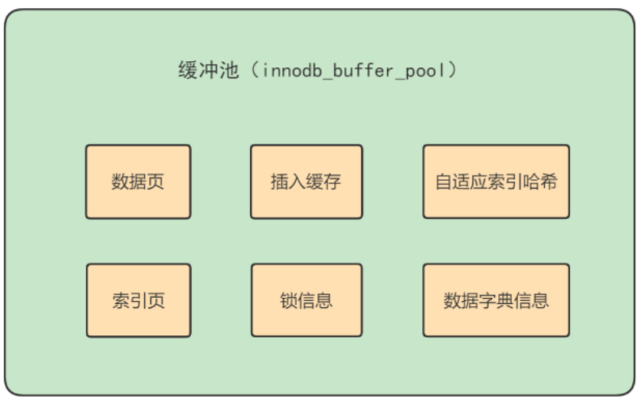

- 对于查询操作，首先会判断该页面是否在缓冲池中，如果存在就直接读取，否则就会从磁盘中找到页面然后放入缓冲池中再进行读取。
- 对于写操作，如果我们是对缓冲池中的数据进行修改，那么该数据并不会立即写入磁盘，而是会采用一种`checkpoint`的机制将脏数据回写到磁盘，这样做能提升整体性能。

> 注1：`数据库缓冲池`和`查询缓存`是两个完全不同的概念，查询缓存是只缓存查询语句及其查询结果，其缓存命中率很低，在MySQL 8中已被删除。
>
> 注2：`MyISAM`存储引擎的数据库缓冲池只缓存索引，而并不会缓存真实数据。

### 5.4 MySQL的数据目录

MySQL的数据目录，也就是数据库文件的默认存放路径为`/var/lib/mysql/`。我们自己创建的数据库都会在其中有一个对应的目录（目录名和数据库名相同），进入该目录后，里面保存的文件都与该数据库中的表有关联。具体而言：

- 如果某个表`t1_name`采用的是InnoDB引擎，则会有一个`t1_name.ibd`文件，用于存储这个表的**表结构信息、数据信息和索引信息**。
- 如果某个表`t2_name`采用的是MyISAM引擎，则会有以下三个文件（因为MyISAM中的索引都是`二级索引`，所以**数据和索引是分开存储的**）：
  - `t2_name_xxx.sdi`：存储这个表的表结构信息（xxx一般是几个数字）
  - `t2_name.MYD`：存储这个表的数据信息
  - `t2_name.MYI`：存储这个表的索引信息


# 第02章_DQL语句

我们首先导入sql脚本`testdb.sql`，便于学习和测试，如果导入时遇到外键约束检查问题，可以采用以下解决方案：

```sql
set FOREIGN_KEY_CHECKS=0;  #在导入前设置为不检查外键约束
set FOREIGN_KEY_CHECKS=1;  #在导入后恢复检查外键约束
```

## 1. 基本语法

### 1.1 SELECT基本查询

```sql
SELECT 字段名1, 字段名2
FROM 表名
WHERE 过滤条件;
```

举例：

```sql
SELECT employee_id, last_name, job_id
FROM employees
WHERE department_id = 90;
```

**注意**：在生产环境下，建议不要使用`SELECT *`进行查询，因为获取不需要的列数据会严重降低查询效率。

### 1.2 列的别名

在很多时候都需要给列起别名，例如方便计算等等。建议在列名和列的别名之间不要省略关键字`AS`，且列的别名使用双引号包裹。

```sql
SELECT last_name AS "name", salary * 12 AS "annual salary"
FROM employees;
```

> 注意：所有运算符或列值遇到null，运算的结果都为null

### 1.3 去重

使用关键字`DISTINCT`可以去除重复行。注意：`DISTINCT`必须放在所有列名的前面，它实际上是对所有列名的组合进行去重。

```sql
SELECT DISTINCT department_id, salary
FROM employees;
```

### 1.4 查询常数

SELECT还可以对常数进行查询，也就是在查询结果中增加一列固定的常数列，一般用于做某些标记。

```sql
SELECT last_name, '清华大学' as "school"
FROM employees;
```

### 1.5 排序

使用`ORDER BY`子句进行排序：

```sql
SELECT last_name
FROM employees
ORDER BY salary DESC, last_name ASC;
```

以上表示先按salary降序排序，如果salary相同再按last_name升序排序。升序排序时`ASC`关键字可以省略，但我们并不推荐省略。

### 1.6 分页

使用`LIMIT`可以实现分页：

```sql
LIMIT 位置偏移量, 行数
```

`位置偏移量`指的是查询到的内容从哪一条记录开始显示，而`行数`指的是返回的记录数。注意，`位置偏移量`可以省略，此时`位置偏移量`的值默认是0，也就是从第一条记录开始显示。

当使用分页查询时，使用的公式如下：

- `位置偏移量 = (当前页数 - 1) * 每页条数`
- `行数 = 每页条数`

举例：假设每页8条记录，查询第3页的记录

```sql
SELECT * FROM employees
LIMIT 16, 8;
```

> 说明：约束返回结果的数量可以提升查询效率，假设我们知道返回结果只有一条，就可以使用`LIMIT 1`，这样`SELECT`语句只要检索到一条符合条件的记录即可返回。

## 2. 运算符

### 2.1 算术运算符

算术运算符有`+`、`-`、`*`、`/`、`%`，注意，MySQL中的`+`只能表示数值的相加，如果遇到非数值类型，则会将其转化为数值类型再进行相加。如果想在MySQL中实现字符串拼接，需要使用`CONCAT()`函数。

### 2.2 比较运算符

比较运算符进行比较后，结果为真则返回1，结果为假则返回0，其余情况则返回NULL。常用的比较运算符有：

- `=` 判断两个操作数是否相等
- `<=>` 安全判断两个操作数是否相等。当两个操作数均为NULL时，返回1；当只有一个操作数为NULL时，返回0；当两个操作数都不是NULL时，返回结果与`=`一致。
- `!=` 判断两个操作数是否不相等，也可以使用`<>`
- `<`、`<=`、`>`、`>=`

> 注意：除了`<=>`外，以上其他运算符，只要有一个操作数为NULL，比较结果就为NULL

除此以外，还有非符号类型的运算符：

- `last_name IS NULL`判断last_name是否为NULL
- `last_name IS NOT NULL`判断last_name是否不为NULL
- `employee_id BETWEEN 100 AND 150`判断employee_id是否属于区间`[100, 150]`
- `employee_id IN (100, 101, 201)`判断employee_id是否在集合`{100, 101, 201}`中
- `employee_id NOT IN (100, 101, 201)`判断employee_id是否不在集合`{100, 101, 201}`中
- `last_name LIKE '%a%'`判断last_name中是否包含字符`a`。`LIKE`运算符通常用于模糊匹配，经常会使用以下两个通配符：`%`匹配0个或多个任意字符，`_`只能匹配1个任意字符。

### 2.3 逻辑运算符

- `!`表示逻辑非，也可以使用`NOT`关键字
- `&&`表示逻辑与，也可以使用`AND`关键字
- `||`表示逻辑或，也可以使用`OR`关键字
- `XOR`表示逻辑异或

**注意**：操作数尽量不要为NULL，否则很可能运算结果得到NULL。除此之外，`AND`的优先级高于`OR`，在实际开发中如果记不清运算符优先级，建议使用括号。

### 2.4 位运算符

MySQL也支持位运算符，但非常少用，如果有进行位运算的需求一般都会在Java代码中实现。

## 3. 多表查询

### 3.1 多表查询的分类

#### 1、等值连接与非等值连接

**等值连接**：连接条件中的比较运算符是`=`

举例：查询员工及其所属部门名称

```sql
SELECT e.employee_id, e.last_name, d.department_name 
FROM employees e
	JOIN departments d ON e.department_id = d.department_id;
```

注意事项：

1. `JOIN ... ON`子句中，JOIN后面的是要连接的表名，ON后面的是这两张表的连接条件
2. 多表查询中，建议**连接的表名都使用别名**进行简化，且**字段名都需要限定表的别名**（否则如果同一个字段出现在两张表中，不加表名的限定就会报错）
3. 连接条件中的字段，数据类型必须保证绝对一致，而且该字段尽量要有索引（提升性能）
4. 超过三个表禁止`JOIN`，因为多表连接就类似于嵌套for循环，连接的表数量过多时会严重影响性能

**非等值连接**：连接条件中的比较运算符不是`=`

举例：查询员工的工资所属的等级

```sql
SELECT e.last_name, e.salary, j.grade_level
FROM employees e 
	JOIN job_grades j ON e.salary BETWEEN j.lowest_sal AND j.highest_sal;
```

#### 2、自连接与非自连接

**非自连接**：连接的表是不同的。前面我们所示例的都是非自连接。

**自连接**：连接的表是自身。

举例：查询员工及其上司的姓名

```sql
SELECT t1.last_name AS "员工姓名", t2.last_name AS "上司姓名"
FROM employees t1 
	JOIN employees t2 ON t1.manager_id = t2.employee_id;
```

#### 3、内连接与外连接

**内连接**：两个表连接时，返回满足连接条件的行。使用关键字`JOIN`或`INNER JOIN`或`CROSS JOIN`都表示内连接。前面我们所示例的都是内连接。

**左外连接**：两个表连接时，除了返回满足连接条件的行，还返回左表中剩余的不满足连接条件的行，此时左表也称为主表，右表也称为从表。使用关键字`LEFT JOIN`或`LEFT OUTER JOIN`都表示左外连接。

**右外连接**：两个表连接时，除了返回满足连接条件的行，还返回右表中剩余的不满足连接条件的行，此时左表也称为从表，右表也称为主表。使用关键字`RIGHT JOIN`或`RIGHT OUTER JOIN`都表示右外连接。

**满外连接**：两个表连接时，除了返回满足连接条件的行，还返回左表和右表中剩余的不满足连接条件的行。注意，MySQL中的满外连接，只能结合`LEFT JOIN`、`RIGHT JOIN`和`UNION`关键字来实现。

### 3.2 UNION关键字

利用UNION关键字，可以给出多条SELECT语句，并将它们的结果合并成单个结果集。注意，合并时两个表**对应的列数和数据类型必须相同，并且相互对应**。格式如下：

```sql
SELECT column, ... FROM table1
UNION [ALL]
SELECT column, ... FROM table2;
```

- `UNION`会返回两个查询结果集的并集，并且去除重复记录
- `UNION ALL`会返回两个查询结果集的并集，但对于重复记录不会进行去重

> 说明：执行`UNION ALL`语句所需的资源比`UNION`更少，如果明确知道合并后的结果集不会存在重复记录，则一定要使用`UNION ALL`来提升查询效率。

### 3.3 七种JOINS的实现

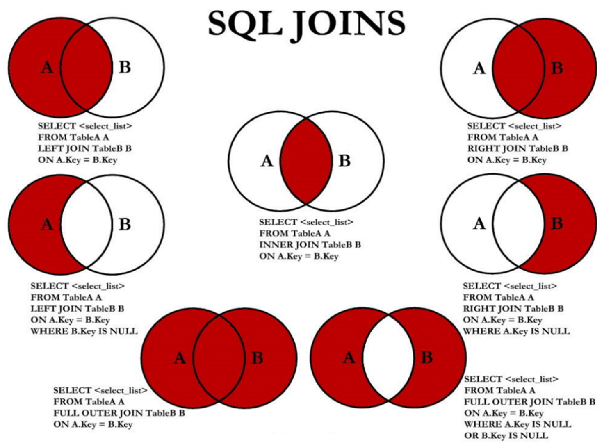

```sql
# 中图：内连接 A∩B 
SELECT e.employee_id, e.last_name, d.department_name
FROM employees e 
	JOIN departments d ON e.department_id = d.department_id;
```

```sql
# 左上图：左外连接
SELECT e.employee_id, e.last_name, d.department_name
FROM employees e 
	LEFT JOIN departments d ON e.department_id = d.department_id;
```

```sql
# 右上图：右外连接
SELECT e.employee_id, e.last_name, d.department_name
FROM employees e 
	RIGHT JOIN departments d ON e.department_id = d.department_id;
```

```sql
# 左中图：A - A∩B
SELECT e.employee_id, e.last_name, d.department_name
FROM employees e 
	LEFT JOIN departments d ON e.department_id = d.department_id
WHERE d.department_id IS NULL;
```

```sql
# 右中图：B - A∩B
SELECT e.employee_id, e.last_name, d.department_name
FROM employees e 
	RIGHT JOIN departments d ON e.department_id = d.department_id
WHERE e.department_id IS NULL;
```

```sql
# 左下图：满外连接
# 可以UNION左中图和右上图
SELECT e.employee_id, e.last_name, d.department_name
FROM employees e 
	LEFT JOIN departments d ON e.department_id = d.department_id
WHERE d.department_id IS NULL
UNION ALL # 一定不会有重复记录，所以使用UNION ALL提升效率
SELECT e.employee_id, e.last_name, d.department_name
FROM employees e 
	RIGHT JOIN departments d ON e.department_id = d.department_id;
```

```sql
# 右下图：可以UNION左中图和右中图
SELECT e.employee_id, e.last_name, d.department_name
FROM employees e 
	LEFT JOIN departments d ON e.department_id = d.department_id
WHERE d.department_id IS NULL
UNION ALL # 一定不会有重复记录，所以使用UNION ALL提升效率
SELECT e.employee_id, e.last_name, d.department_name
FROM employees e 
	RIGHT JOIN departments d ON e.department_id = d.department_id
WHERE e.department_id IS NULL;
```

## 4. 单行函数

单行函数就是只对一行进行变换，每行返回一个结果，单行函数可以嵌套。MySQL内置的常用单行函数有以下几种。

### 4.1 数值函数

- `ABS(x)`：返回x的绝对值
- `LEAST(e1, e2, ...)`：返回列表中的最小值
- `GREATEST(e1, e2, ...)`：返回列表中的最大值
- `RAND()`：返回0到1之间的随机值
- `ROUND(x, y)`：返回对x的值进行四舍五入后最接近x的值，并保留到小数点后面y位
- `TRUNCATE(x, y)`：返回数字x截断为y位小数的结果

### 4.2 字符串函数

- `CHAR_LENGTH(s)`：返回字符串s的字符数
- `LENGTH(s)`：返回字符串s的字节数，与字符集有关
- `CONCAT(s1, s2, ...)`：字符串拼接
- `LEFT(s, n)`：返回字符串s最左边的n个字符
- `RIGHT(s, n)`：返回字符串s最右边的n个字符
- `TRIM(s)`：去掉字符串s开始与结尾的空格
- `REVERSE(s)`：返回字符串s反转后的结果

### 4.3 日期和时间函数

在MySQL中日期和时间格式为：`'2021-10-25 19:36:55'`

- `CURDATE()`：返回当前日期，只包含年月日
- `CURTIME()`：返回当前时间，只包含时分秒
- `NOW()`、`CURRENT_TIMESTAMP()`：返回当前日期和时间
- `UNIX_TIMESTAMP(date)`：将日期时间date以UNIX时间戳的形式返回
- `FROM_UNIXTIME(timestamp)`：返回UNIX时间戳timestamp对应的日期时间
- `YEAR(date)`、`MONTH(date)`、`DAY(date)`：返回具体的年、月、日
- `HOUR(date)`、`MINUTE(date)`、`SECOND(date)`：返回具体的时、分、秒
- `DATEDIFF(date1, date2)`：返回date1-date2的日期间隔天数
- `TIMEDIFF(date1, date2)`：返回date1-date2的时间间隔，返回值格式为`783:40:49`

### 4.4 流程控制函数

#### 1、IF

```sql
# 如果test的值为true，则返回value1，否则返回value2
IF(test, value1, value2)
```

#### 2、IFNULL

```sql
# 如果value1为NULL，则返回value2，否则返回value1
IFNULL(value1, value2)
```

说明：这个函数经常可以用来给可能为NULL的字段设定计算时的默认值（以防计算结果为NULL），例如

```sql
SELECT employee_id, 12 * salary * (1 + IFNULL(commission_pct, 0))
FROM employees;
```

#### 3、CASE的第一种用法

```sql
CASE
WHEN condition1 THEN result1 
WHEN condition2 THEN result2 
...
[ELSE other_result] 
END
```

这种用法就相当于Java的`if ... else if ... else ...`，举例：

```sql
SELECT employee_id, salary, CASE
	WHEN salary >= 15000 THEN '高薪'
	WHEN salary >= 10000 THEN '潜力股'
	WHEN salary >= 8000 THEN '小资'
	ELSE '平民'
END AS '描述信息'
FROM employees;
```

#### 4、CASE的第二种用法

```sql
CASE expr
WHEN const1 THEN value1 
WHEN const2 THEN value2 
...
[ELSE other_value] 
END
```

这种用法就相当于Java的`switch ... case ...`，举例：

```sql
SELECT last_name, job_id, salary, CASE job_id
	WHEN 'IT_PROG'  THEN 1.10 * salary
	WHEN 'ST_CLERK' THEN 1.15 * salary
	WHEN 'SA_REP'   THEN 1.20 * salary
	ELSE salary 
END AS "最终薪资"
FROM employees;
```

## 5. 聚合函数和分组

### 5.1 聚合函数

聚合函数也称为聚集函数、分组函数，它是对一组数据进行汇总的函数，输入的是一组数据的集合，输出的是单个值。聚合函数主要有：

- `AVG(column)`：计算该列的平均值，注意该字段类型必须是数值型
- `SUM(column)`：计算该列的总和，注意该字段类型必须是数值型
- `MAX(column)`：计算该列的最大值
- `MIN(column)`：计算该列的最小值
- `COUNT(*)`或`COUNT(1)`：返回表中的记录总数
- `COUNT(column)`：返回该列中不为NULL的记录总数

> 注意：**聚合函数不能嵌套调用**，例如`AVG(SUM(column))`就是非法的。

我们不推荐使用`COUNT(column)`，因为它无法统计NULL值的记录。`COUNT(*)`或`COUNT(1)`才是标准的统计行数的语法。

- 对于MyISAM引擎的表，`COUNT(*)`或`COUNT(1)`执行的时间复杂度是`O(1)`，因为该引擎内部会维护一个计数器，保存该表的记录总数。
- 对于InnoDB引擎的表，`COUNT(*)`或`COUNT(1)`执行的时间复杂度是`O(n)`，因为它需要遍历整个表才能得到记录总数。

### 5.2 GROUP BY

使用`GROUP BY`子句可以将表中的数据分为若干组，其基本语法如下：

```sql
SELECT column, ...
FROM table
WHERE condition1
GROUP BY column, expression, ...
HAVING condition2;
```

**注意事项1**：在`SELECT`列表中，除了聚合函数中的列，其他所有出现的列，都应该包含在`GROUP BY`子句中

```sql
SELECT department_id, AVG(salary)
FROM employees
GROUP BY department_id;
```

**注意事项2**：`GROUP BY`也可以根据多个列来进行分组

```sql
SELECT department_id, AVG(salary)
FROM employees
GROUP BY department_id, job_id;
```

**注意事项3**：`HAVING`不能单独使用，必须跟在`GROUP BY`之后，用于对分组后的数据进行过滤筛选。注意，在`WHERE`子句中不能使用聚合函数，但在`HAVING`子句中可以使用聚合函数。

```sql
SELECT department_id, MAX(salary)
FROM employees
GROUP BY department_id
HAVING MAX(salary) > 10000;
```

> **说明**：底层执行的顺序严格按照`WHERE`、`GROUP BY`、`HAVING`，也就是说先进行`WHERE`过滤，再进行分组，再进行`HAVING`过滤。因此，我们推荐将不包含聚合函数的过滤条件都写到`WHERE`中，先进行大面积过滤再进行分组，能够提升效率；而包含聚合函数的过滤条件，只能写到`HAVING`中，因为必须在分组之后才能对每个分组进行聚合函数的计算并过滤。

### 5.3 SELECT的执行流程

一个标准的SELECT语句格式如下，注意关键字顺序是不能颠倒的：

```sql
SELECT DISTINCT ...
FROM ...
	JOIN ... ON ...
WHERE ...
GROUP BY ...
HAVING ...
ORDER BY ...
LIMIT ...
```

而SELECT语句的底层执行顺序则是：

```sql
FROM ... JOIN ... ON ... # 顺序1
WHERE ...                # 顺序2
GROUP BY ...             # 顺序3
HAVING ...               # 顺序4
SELECT ...               # 顺序5
DISTINCT                 # 顺序6
ORDER BY ...             # 顺序7
LIMIT ...                # 顺序8
```

**具体流程**如下：

1. 首先根据`FROM`定位到要查询的表，如果是多表联查，则还会经过以下步骤：
   - 先求笛卡尔积（即左表的第一条记录，与右表的所有记录关联，然后以此类推处理左表的第二条记录，...）得到一张虚拟表，该表的总记录数就是这两张表记录数的乘积
   - 然后根据`ON`中的连接条件进行筛选
   - 如果我们使用的是左外连接、右外连接、满外连接，则还会添加外部行（也就是相应的一些不满足连接条件的行）
   - 如果是超过两张表以上的JOIN，则重复上述步骤，直到处理完所有表
2. 根据`WHERE`条件对表中的数据进行过滤
3. 根据`GROUP BY`对表中的数据进行分组
4. 根据`HAVING`对表中的数据进行分组过滤
5. 根据`SELECT`提取所需要的列
6. 如果使用了`DISTINCT`关键字，则会过滤掉重复的行
7. 根据`ORDER BY`指定的字段进行排序
8. 根据`LIMIT`取出指定行的记录，得到最终的结果集

## 6. 子查询

### 6.1 简介

子查询指一个查询语句嵌套在另一个查询语句内部的查询。例如：

```sql
SELECT last_name, salary
FROM employees
WHERE salary > (
	SELECT salary
	FROM employees
	WHERE last_name = 'Abel'
);
```

注意：

- 子查询(内查询)会在主查询之前一次执行完成，子查询的结果被主查询(外查询)使用
- 子查询要包含在括号内，且将子查询放在比较条件的右侧
- 单行操作符对应单行子查询，多行操作符对应多行子查询

子查询有以下两种分类方式：

- 按照内查询的结果返回一条记录还是多条记录，可以将子查询分为`单行子查询`和`多行子查询`
- 按照内查询是否被执行多次，可以将子查询分为`相关子查询`和`不相关子查询`
  - 不相关子查询：内查询从数据表中查询到结果，如果这个结果只执行一次，并作为主查询的条件，那么这样的子查询就称为不相关子查询。
  - 相关子查询：如果内查询需要执行多次，即采用循环的方式，先从外查询开始，每次都传入内查询进行查询，然后再将结果反馈给外部，这种嵌套的执行方式就称为相关子查询。

> **说明**：如果同一个需求，使用多表连接查询或者子查询都能实现，一般情况下建议使用**多表连接查询**。因为很多DMBS都会对连接查询进行优化，其处理速度比子查询快得多。
>
> **注意**：子查询不仅仅可以用在查询语句中，在`INSERT`、`UPDATE`、`DELETE`语句中同样可以使用子查询。

### 6.2 单行子查询

单行子查询，就是内查询只返回一条记录，所以对应外查询中使用的就是单行比较操作符，如`=`、`!=`、`>`、`>=`、`<`、`<=`，我们以几个例题来演示单行子查询。

例1：返回公司工资最少的员工的last_name和salary

```sql
SELECT last_name, salary
FROM employees
WHERE salary = (
	SELECT MIN(salary) FROM employees
);
```

例2：查询最低工资大于50号部门最低工资的部门id和其最低工资

```sql
SELECT department_id, MIN(salary)
FROM employees
GROUP BY department_id
HAVING MIN(salary) > (
	SELECT MIN(salary)
	FROM employees
	WHERE department_id = 50
);
```

例3：显示员工的employee_id, last_name, location。其中，若员工的department_id与location_id为1800的department_id相同，则location为`'Canada'`，其余则为`'USA'`

```sql
SELECT employee_id, last_name, CASE department_id
	WHEN (
		SELECT department_id FROM departments
		WHERE location_id = 1800
	) THEN 'Canada'
	ELSE 'USA'
END AS "location"
FROM employees;
```

### 6.3 多行子查询

多行子查询，就是内查询会返回多行记录，所以对应外查询中应该使用多行比较操作符：

- `IN`：等于列表中的任意一个
- `ANY`：需要和单行比较操作符一起使用，和子查询返回的某一个值比较
- `ALL`：需要和单行比较操作符一起使用，和子查询返回的所有值比较

例1：返回其它job_id中比job_id为`'IT_PROG'`的任一员工的工资低的员工的employee_id, last_name, job_id和salary

```sql
SELECT employee_id, last_name, job_id, salary
FROM employees
WHERE salary < ANY (
	SELECT salary FROM employees
	WHERE job_id = 'IT_PROG'
)
AND job_id != 'IT_PROG';
```

例2：查询平均工资最低的部门id

```sql
SELECT department_id
FROM employees
GROUP BY department_id
HAVING AVG(salary) <= ALL (
	SELECT AVG(salary)
	FROM employees
	GROUP BY department_id
);
```

### 6.4 相关子查询

我们之前举例的都是不相关子查询。而如果子查询的执行依赖于外部查询，通常情况下都是因为子查询中的表用到了外部的表，并进行了条件关联，因此每执行一次外部查询，子查询都要重新计算一次，这样的子查询就称之为`相关子查询`。

例1：查询员工中工资大于本部门平均工资的员工的last_name, salary, department_id

**方式一**：使用相关子查询

```sql
SELECT last_name, salary, department_id
FROM employees e 
WHERE salary > (
	SELECT AVG(salary) FROM employees
	WHERE department_id = e.department_id
);
```

**方式二**：在FROM中使用不相关子查询构建一张临时的虚拟表

```sql
SELECT e.last_name, e.salary, e.department_id
FROM employees e, (
	SELECT department_id, AVG(salary) AS "dept_salary"
	FROM employees
	GROUP BY department_id
) tmp
WHERE e.department_id = tmp.department_id
AND e.salary > tmp.dept_salary;
```

例2：查询公司管理者的employee_id，last_name，job_id，department_id信息

```sql
SELECT employee_id, last_name, job_id, department_id
FROM employees e1 
WHERE EXISTS (
	SELECT * FROM employees e2 
	WHERE e2.manager_id = e1.employee_id
);
```

> 说明：相关子查询中常常会用到`EXISTS`，它用于检查子查询是否会返回记录：一旦在子查询中找到一条满足条件的记录，就会直接返回true，不再继续进行子查询；否则就会返回false。还有一个关键字`NOT EXISTS`用于检查子查询是否不会返回记录。


# 第03章_数据库和表的管理

## 1. 数据库的管理

### 1.1 创建数据库

```sql
CREATE DATABASE [IF NOT EXISTS] db_name DEFAULT CHARACTER SET utf8mb4;
```

### 1.2 使用(切换)数据库

```sql
USE db_name;
```

### 1.3 查看数据库

- 查看所有数据库

```sql
SHOW DATABASES;
```

- 查看当前正在使用的数据库

```sql
SELECT DATABASE();
```

- 查看指定数据库下的所有表

```sql
SHOW TABLES FROM db_name;
```

- 查看数据库的创建信息

```sql
SHOW CREATE DATABASE db_name;
```

### 1.4 删除数据库

```sql
DROP DATABASE [IF EXISTS] db_name;
```

## 2. MySQL中的数据类型

### 2.1 整数类型

**原则**：如果是整数，则建议使用`INT`，若项目的数据量特别大就使用`BIGINT`，它们分别对应Java中的`Integer`(4字节)和`Long`(8字节)。注意，如果确定该字段一定是非负整数，则使用`INT UNSIGNED`或`BIGINT UNSIGNED`。

### 2.2 小数类型

**原则**：如果是小数，则使用`DECIMAL`，禁止使用`FLOAT`和`DOUBLE`，因为它们存在精度损失问题。注意，如果存储的数据范围超过`DECIMAL`的范围，则建议将数据拆成整数和小数并分开存储。

`DECIMAL`实际上是定点数类型，而`FLOAT`和`DOUBLE`则是浮点数类型，所以`DECIMAL`不会出现精度损失问题，其底层在MySQL中是以字符串形式存储的。

在定义时，使用`DECIMAL(M,D)`的方式定义数据类型，其中M是精度（即整数位和小数位的总位数），D是标度（即小数位的位数），显然D必须小于M。例如`DECIMAL(5,2)`类型表示该列数据的取值范围是`-999.99~999.99`。如果我们定义`DECIMAL`时不指定精度和标度，则默认为`DECIMAL(10,0)`。

### 2.3 日期时间类型

**原则**：如果是日期时间，则使用`DATETIME`，它的日期格式是`YYYY-MM-DD HH:MM:SS`

在向`DATETIME`类型的字段插入数据时，可以使用`YYYY-MM-DD HH:MM:SS`或者`YYYYMMDDHHMMSS`格式的字符串，最终都会转化为`YYYY-MM-DD HH:MM:SS`格式。

### 2.4 字符串类型

**原则**：如果存储的字符串长度几乎相等，则使用`CHAR`；否则就使用`VARCHAR`，但尽量保证其长度不要超过5000；如果存储长度大于5000的字符串，则使用`TEXT`，并且独立出来一张表，用主键来关联，避免影响其他字段索引效率。

- `CHAR(M)`是固定长度的字符串，长度为M个字符，如果不指定M，则默认M为1
- `VARCHAR(M)`是可变长度的字符串，实际存储大小为`实际长度+1个字节`，定义时必须指定M，表示长度至多为M个字符
- `TEXT`一般用于保存比较大的文本段，最大可达4G

## 3. 表的管理

### 3.1 创建表

```sql
CREATE TABLE [IF NOT EXISTS] 表名 (
	字段1 数据类型 [约束条件] [默认值],
	字段2 数据类型 [约束条件] [默认值],
	...,
	[表级约束条件]
);
```

一个规范的建表语句如下：

```sql
CREATE TABLE user_info (
`id` int unsigned NOT NULL AUTO_INCREMENT COMMENT '自增主键',
`user_id` bigint NOT NULL COMMENT '用户id',
`username` varchar(45) NOT NULL COMMENT '真实姓名',
`birthday` date NOT NULL COMMENT '生日',
`sex` tinyint(4) DEFAULT '0' COMMENT '性别',
`short_introduce` varchar(150) DEFAULT NULL COMMENT '自己介绍，最多150个汉字',
`user_resume` varchar(300) NOT NULL COMMENT '用户提交的简历存放地址',
`create_time` datetime NOT NULL DEFAULT CURRENT_TIMESTAMP COMMENT '创建时间',
`update_time` datetime NOT NULL DEFAULT CURRENT_TIMESTAMP ON UPDATE
CURRENT_TIMESTAMP COMMENT '修改时间',
PRIMARY KEY (`id`),
UNIQUE KEY `uniq_user_id` (`user_id`),
KEY `idx_username` (`username`)
) ENGINE=InnoDB DEFAULT CHARSET=utf8 COMMENT='网站用户基本信息';
```

### 3.2 查看表的结构

使用`DESCRIBE 表名;`或者`DESC 表名;`可以查看表结构。

```sql
mysql> DESCRIBE employees;
+----------------+-------------+------+-----+---------+-------+
| Field          | Type        | Null | Key | Default | Extra |
+----------------+-------------+------+-----+---------+-------+
| employee_id    | int         | NO   | PRI | 0       |       |
| first_name     | varchar(20) | YES  |     | NULL    |       |
| last_name      | varchar(25) | NO   |     | NULL    |       |
| email          | varchar(25) | NO   | UNI | NULL    |       |
| phone_number   | varchar(20) | YES  |     | NULL    |       |
| hire_date      | date        | NO   |     | NULL    |       |
| job_id         | varchar(10) | NO   | MUL | NULL    |       |
| salary         | double(8,2) | YES  |     | NULL    |       |
| commission_pct | double(2,2) | YES  |     | NULL    |       |
| manager_id     | int         | YES  | MUL | NULL    |       |
| department_id  | int         | YES  | MUL | NULL    |       |
+----------------+-------------+------+-----+---------+-------+
11 rows in set (0.00 sec)
```

- Field是字段名称
- Type是字段类型
- Null表示该字段是否可以存储NULL值
- Key表示该字段是否已编制索引
- Default表示该字段的默认值
- Extra表示该字段的附件信息，例如`AUTO_INCREMENT`等

除此之外，也可以使用`SHOW CREATE TABLE 表名 \G`查看表创建的详细语句，包括存储引擎和字符编码：

```sql
mysql> SHOW CREATE TABLE employees \G
*************************** 1. row ***************************
       Table: employees
Create Table: CREATE TABLE `employees` (
  `employee_id` int NOT NULL DEFAULT '0',
  `first_name` varchar(20) DEFAULT NULL,
  `last_name` varchar(25) NOT NULL,
  `email` varchar(25) NOT NULL,
  `phone_number` varchar(20) DEFAULT NULL,
  `hire_date` date NOT NULL,
  `job_id` varchar(10) NOT NULL,
  `salary` double(8,2) DEFAULT NULL,
  `commission_pct` double(2,2) DEFAULT NULL,
  `manager_id` int DEFAULT NULL,
  `department_id` int DEFAULT NULL,
  PRIMARY KEY (`employee_id`),
  UNIQUE KEY `emp_email_uk` (`email`),
  UNIQUE KEY `emp_emp_id_pk` (`employee_id`),
  KEY `emp_dept_fk` (`department_id`),
  KEY `emp_job_fk` (`job_id`),
  KEY `emp_manager_fk` (`manager_id`),
  CONSTRAINT `emp_dept_fk` FOREIGN KEY (`department_id`) REFERENCES `departments` (`department_id`),
  CONSTRAINT `emp_job_fk` FOREIGN KEY (`job_id`) REFERENCES `jobs` (`job_id`),
  CONSTRAINT `emp_manager_fk` FOREIGN KEY (`manager_id`) REFERENCES `employees` (`employee_id`)
) ENGINE=InnoDB DEFAULT CHARSET=utf8mb3
1 row in set (0.00 sec)
```

### 3.3 修改表的结构

- 添加一个字段

```sql
ALTER TABLE 表名 ADD 字段名 字段类型 [AFTER 表中的某个字段名];
```

- 修改某个字段

```sql
ALTER TABLE 表名 MODIFY 字段名 字段类型;
```

- 重命名某个字段

```sql
ALTER TABLE 表名 CHANGE 原字段名 新字段名 新数据类型;
```

- 删除某个字段

```sql
ALTER TABLE 表名 DROP 字段名;
```

### 3.4 重命名表

```sql
RENAME TABLE 原表名 TO 新表名;
```

### 3.5 清空表

清空表中的所有数据，有以下两种方式：

```sql
TRUNCATE TABLE 表名;
DELETE FROM 表名;
```

其中，`TRUNCATE`的方式速度更快，但是该语句不能回滚，而`DELETE`语句可以回滚。开发中为了安全，尽量使用`DELETE`。

### 3.6 删除表

```sql
DROP TABLE [IF EXISTS] 表名;
```

## 4. 约束

### 4.1 简介

为了保证数据的完整性，SQL规范以约束(constraint)的方式对**表数据进行额外的条件限制**。一般都是在创建表时规定约束，当然也可以在创建表之后通过`ALTER TABLE`语句规定约束。

> 说明：在创建表时，写在字段后面的约束称之为`列级约束`，写在所有字段下面的约束称之为`表级约束`。

约束主要分为以下几类：

- `NOT NULL`非空约束
- `UNIQUE`唯一约束
- `PRIMARY KEY`主键约束
- `DEFAULT`默认值约束
- `FOREIGN KEY`外键约束

### 4.2 非空约束

默认情况下，所有数据类型的值都可以为NULL，但如果我们给某个字段添加了非空约束，这个字段的值就不允许为NULL。添加非空约束的语法如下：

```sql
CREATE TABLE 表名 (
	字段名 数据类型 NOT NULL
);
```

### 4.3 唯一约束

给某个字段添加唯一约束后，这个字段的值就必须唯一，但是可以出现多个NULL值。注意，添加唯一约束就会**默认创建唯一索引**，所以我们推荐使用`表级约束`的方式来创建唯一约束，并给该唯一约束命名（如果不命名，则默认和列名相同），语法如下：

```sql
CREATE TABLE 表名 (
    `user_id` bigint NOT NULL,
    UNIQUE KEY `uniq_user_id` (`user_id`) # 给字段user_id添加唯一约束，并命名该约束
);
```

我们也可以创建复合唯一约束，也就是要求多个字段组合的值唯一：

```sql
CREATE TABLE 表名 (
    `department` int NOT NULL,
    `username` varchar(50) NOT NULL,
    UNIQUE KEY `uniq_dept_uname` (`department`, `username`) 
);
```

如果我们想删除唯一约束，则只能通过索引的名称来删除唯一索引：

```sql
# 可以先查看表中的所有索引
SHOW INDEX FROM 表名;
# 然后根据索引名，删除索引
ALTER TABLE 表名 DROP INDEX `uniq_user_id`;
```

### 4.4 主键约束

主键用于唯一标识表中的一行记录，一个表中必须**有且仅有一个主键**，添加主键约束后对应字段就是唯一且非空的。可以给某一列创建主键约束，也可以给多个列的组合创建主键约束(即复合主键，但这些列必须都不为空，且组合的值不能重复)。创建主键约束时，会**默认创建主键索引**，该索引的名称始终是**PRIMARY**，我们无法自己指定。推荐使用`表级约束`的方式来创建主键约束，语法如下：

```sql
CREATE TABLE 表名 (
    `id` int unsigned NOT NULL AUTO_INCREMENT,
    PRIMARY KEY (`id`)
);
```

### 4.5 默认值约束

默认值约束用于给某个字段指定默认值，如果在插入数据时该字段没有显式赋值，则赋值为默认值。语法如下：

```sql
CREATE TABLE 表名 (
	字段名 数据类型 NOT NULL DEFAULT 默认值
);
```

> 说明：默认值约束一般不在唯一约束列和主键列上加

通常如果我们不想让字段出现NULL值影响计算时，就可以添加默认值约束`NOT NULL DEFAULT 0`或者`NOT NULL DEFAULT ''`

### 4.6 外键约束

外键约束用于限定表的某个字段的引用完整性，例如通过外键约束就可以保证员工表的员工所在部门，一定能在部门表中找到。然而，一旦添加外键约束，每次增删改数据时MySQL就会进行非常耗时的外键约束检查。因此，我们**禁止使用外键约束**，数据的引用完整性应该交给Java应用层来检查。

### 4.7 自增列

自增列的关键字是`AUTO_INCREMENT`，用于让某个字段的值自动递增，使用时有以下要求：

- 一个表至多只能有一个自增列
- 只有主键列，或者唯一约束的列，才可以设置为自增列
- 自增列的数据类型必须是整数类型
- 插入数据时，如果自增列字段的值为0或NULL，则插入后该字段的值会在自增列所维护的最大值基础上自增；如果插入数据时自增列字段的值是手动指定的具体值，则插入后该字段的值就是这一具体值。

语法如下：

```sql
CREATE TABLE 表名 (
    `id` int unsigned NOT NULL AUTO_INCREMENT,
    PRIMARY KEY (`id`)
);
```

自增列的**底层原理**：InnoDB数据字典内部会维护一个自增列的计数器，并将其持久化到`重做日志`中，计数器的初始值默认是1。所以，如果表中自增字段的值已经有`1,2,3,4,5`，则删除值为`5`的记录后，下次再插入新的记录，则其自增字段的值为`6`而不是`5`。如果我们插入一条自增字段值为给定具体值`100`的记录，则计数器维护的值也会修改，从而下一次自动插入的值就应该是`101`

## 5. 数据的增删改

### 5.1 新增数据

基本语法：

```sql
INSERT INTO 表名 (column1, column2, ...)
VALUES
(value1, value2, ...),
(value1, value2, ...),
...;
```

- 该插入语句为表的指定字段`(column1, column2, ...)`插入数据，其余字段则使用表定义时的默认值（如果没定义默认值，则为NULL）
- 如果插入的数据包含所有的字段，且顺序与表定义时字段的顺序一致，则可以省略`(column1, column2, ...)`，但我们并不推荐省略。
- 注意：插入字符串或者日期型的数据应该包含在单引号中

我们还可以使用子查询，将其他表的查询结果插入到表中：

```sql
INSERT INTO 目标表名 (tar_column1, tar_column2, ...)
SELECT (src_column1, src_column2, ...)
FROM 源表名
[WHERE condition];
```

- 使用这种语法，无需写`VALUES`关键字
- 注意，子查询中的值列表应与`INSERT`子句中的列名对应

### 5.2 修改数据

基本语法：

```sql
UPDATE 表名
SET column1 = value1, column2 = value2, ...
[WHERE condition];
```

> 注意：如果不加`WHERE`条件过滤，则会进行全表更新，开发中要注意这种安全隐患。

### 5.3 删除数据

基本语法：

```sql
DELETE FROM 表名
[WHERE condition];
```

> 注意：如果不加`WHERE`条件过滤，则会进行全表删除，开发中要注意这种安全隐患。


# 第04章_MySQL的其他基本知识

MySQL的其他基本知识（不常用），详见supplement目录。

MySQL语法的练习题，详见exercise目录。

# 第05章_索引

## 1. 索引的底层结构

### 1.1 索引简介

索引(Index)是存储引擎用于快速找到数据记录的一种数据结构。注意，索引是在存储引擎中实现的，所以每种存储引擎的索引不完全相同。

- 索引的优点：**提高数据查询的效率，减少磁盘I/O次数**
- 索引的缺点：维护索引要耗费时间，**会降低增、删、改的速度**；每个索引都对应一颗B+树，**会占用大量磁盘空间**

### 1.2 InnoDB中的索引

我们从零开始来推演InnoDB中的索引结构。首先建一个表：

```sql
mysql> CREATE TABLE index_demo (
-> c1 INT,
-> c2 INT,
-> c3 CHAR(1),
-> PRIMARY KEY(c1)
-> ) ROW_FORMAT = Compact;
```

我们规定了c1列为主键，这个表使用Compact行格式来实际存储记录。这里我们简化了index_demo表的行格式示意图并将其竖起来：

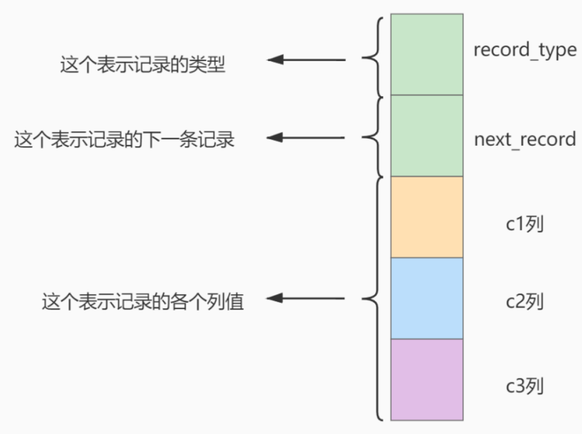

我们只在示意图里展示记录的这几个部分：

* record_type：记录头信息的一项属性，表示记录的类型，0表示普通记录、1表示目录项记录、2表示最小记录、3表示最大记录。 
* next_record：记录头信息的一项属性，表示下一条记录地址相对于本条记录的地址偏移量，我们用箭头来表明下一条记录。 
* 各个列的值：这里只记录在index_demo表中的三个列，分别是c1、c2和c3

把一些记录放到页里的示意图就是：

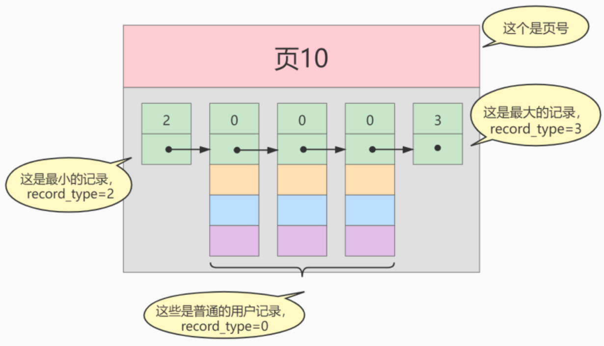

#### 版本1.0：简单的索引设计方案

我们可以为快速定位记录所在的数据页而建立一个目录，建这个目录必须完成下边这些事：

**条件1：下一个数据页中用户记录的主键值必须大于上一个页中用户记录的主键值**

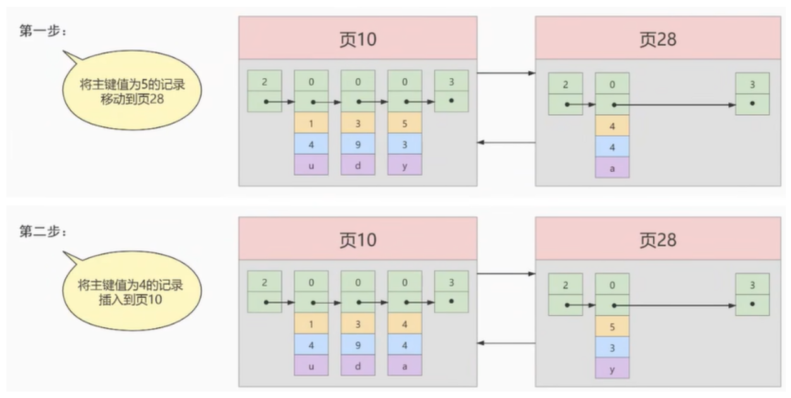

注意：新分配的**数据页编号可能并不是连续的**，它们只是通过维护上一个页和下一个页的编号而建立了**双向链表**关系。另外，为了满足条件1，在插入主键值为4的记录时需要伴随着一次**记录移动**，如上图所示，这个过程称为**页分裂**。

**条件2：给所有的页建立一个目录项**

我们需要给所有数据页做个**目录**，每个页对应一个目录项，每个目录项包括下边两个部分：

- 页的用户记录中最小的主键值：我们用**key**来表示。
- 页号：我们用**page_on**表示。

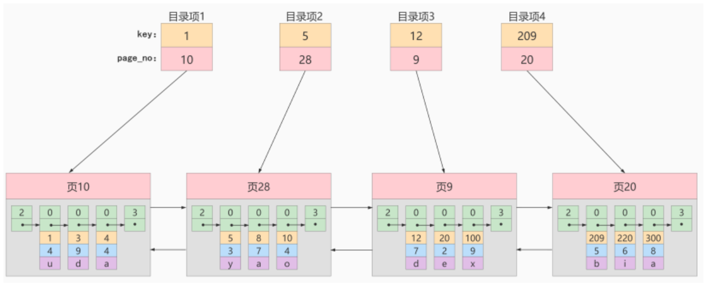

#### 版本2.0：目录页

InnoDB使用记录头信息里的**record_type**属性来区分一条记录是普通的**用户记录**还是**目录项记录**：

* 0：普通的用户记录
* 1：目录项记录
* 2：最小记录
* 3：最大记录

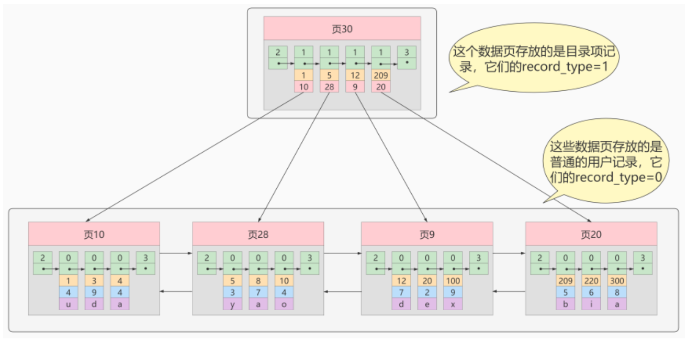

从图中可以看出来，我们新分配了一个编号为30的页来专门存储目录项记录，称之为**目录页**。注意**目录项记录**和普通的**用户记录** 

**不同点**：

* **目录项记录**的record_type值是1，而**普通用户记录**的record_type值是0 
* 目录项记录只有**主键值和页的编号**两个列，而普通的用户记录的列是用户自己定义的，可能包含**很多列**，另外实际上还有InnoDB自己添加的隐藏列
* 了解：记录头信息里还有一个叫**min_rec_mask**的属性，只有在存储**目录项记录**的页中的主键值最小的**目录项记录**的**min_rec_mask**值为**1**，其他别的记录的**min_rec_mask**值都是**0**

**相同点**：底层实际上都会为主键值生成**Page Directory(页目录)**，从而在按照主键值进行查找时可以使用**二分法**来加快查询速度。

#### 版本3.0：多个目录页

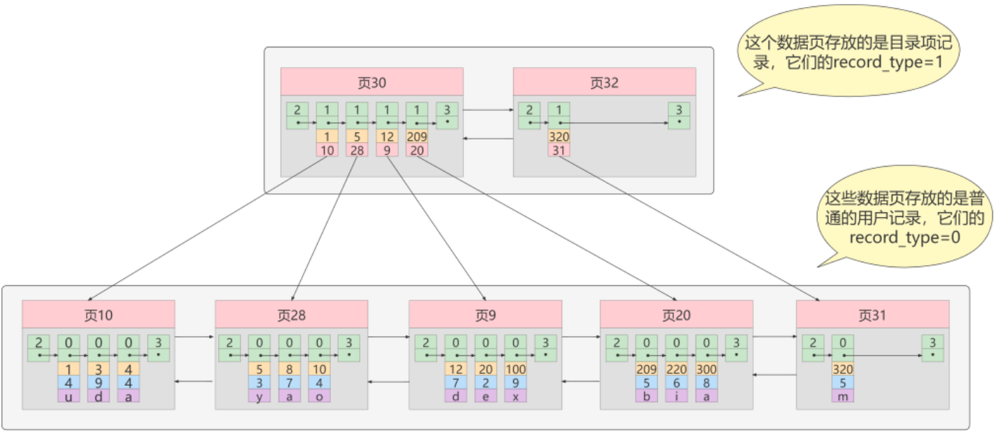

#### 版本4.0：目录页的目录页

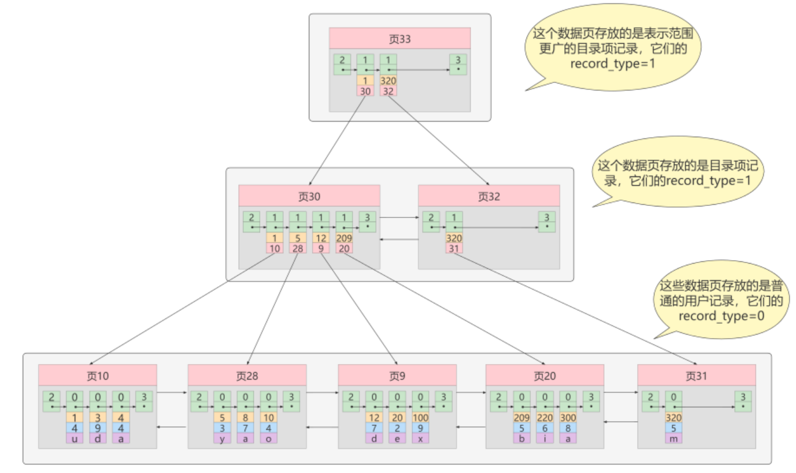

如图，我们生成了一个存储更高级目录项的`页33`，这个页中的两条记录分别代表`页30`和`页32`，如果用户记录的主键值在`[1, 320)`之间，则到`页30`中查找更详细的目录项记录，如果主键值不小于320的话，就到`页32`中查找更详细的目录项记录。

我们可以用下边这个图来描述它（这个数据结构就是B+树）：

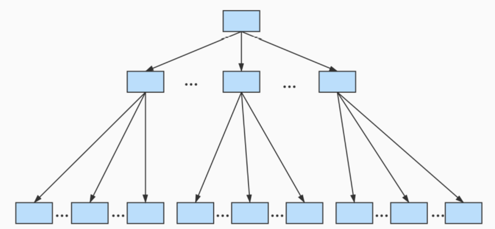

#### 版本5.0(最终版本)：B+Tree

一个B+树的节点其实可以分成好多层，规定最下边的那层，也就是存放我们用户记录的那层为第0层，之后依次往上加。真实环境中一个页存放的记录数量是非常大的，假设所有存放用户记录的叶子节点代表的数据页可以存放100条用户记录，所有存放目录项记录的内节点代表的数据页可以存放1000条目录项记录，那么：

* 如果B+树有3层，最多能存放`1000×1000×100=1,0000,0000`条记录
* 如果B+树有4层，最多能存放`1000×1000×1000×100=1000,0000,0000`条记录

所以一般情况下，我们用到的**B+树都不会超过4层**，那我们通过主键值去查找某条记录最多只需要做4个页面内的查找（查找3个目录项页和一个用户记录页），又因为在每个页面内有所谓的**Page Directory**(页目录)，所以在页面内也可以通过**二分法**实现快速定位记录。

#### 补充说明

InnoDB中的B+树实际上还有以下两个特点：

（1）**根页面位置始终不变，且根页面始终在内存中**：最开始表中没有数据的时候，每个索引对应的B+树的`根结点`中既没有用户记录，也没有目录项记录；随着用户记录的添加，当根节点中的可用`空间用完时`继续插入记录，此时会将根节点中的所有记录复制到多个新分配的页，而此时这个`根节点`便升级为存储目录项记录的页。

（2）**内节点中目录项记录必须保证唯一性**：前面我们演示的B+树的内节点中目录项记录的内容是`索引列 + 页号`的搭配，但对于二级索引来说实际上并非如此。为了让新插入记录找到自己在哪个页面，我们就需要**保证在B+树的同一层页节点的目录项记录除页号这个字段以外是唯一的**。所以二级索引的内节点的目录项记录的内容，实际上是由三个部分构成的：`索引列的值、主键值、页号`，根据主键值就能保证唯一性。

### 1.3 索引的常见概念

- 按照物理实现方式，索引可以分为**聚簇索引**和**非聚簇索引**，其中非聚簇索引也称为二级索引。
- 按照作用字段个数，索引可以分为**单列索引**和**联合索引**
- 按照功能逻辑，索引可以分为**普通索引**、**唯一索引**、**主键索引**、**全文索引**、**空间索引**

#### 1、聚簇索引

聚簇索引会将**完整的用户记录**(也就是所有列的数据)存储在B+树的叶子节点。**InnoDB中根据主键创建的主键索引就是聚簇索引**。聚簇索引的特点如下：

- B+树的叶子节点存储的是完整的用户记录，所以查找数据很快，因为只需根据主键定位到数据后，就能立即得到其他字段的值。
- 聚簇索引使用主键值的大小进行记录和页的排序，所以根据主键查找时速度非常快。

> **注意**：根据InnoDB表主键索引的以上特点，我们要求其**主键必须是递增的，且不能被更新**。如果主键不是递增的，则插入记录可能会产生页分裂，严重影响性能；同理，更新主键的代价很高，所以建议不要更新主键。

#### 2、二级索引

二级索引在B+树的叶子节点中并不会保存完整的用户记录，而是只保存**指定的索引列以及主键的值**。所以在InnoDB中除了主键索引以外，我们创建的**其他索引都是二级索引**。例如，我们给表中的c2列创建索引，它就会创建一颗新的B+树，具有以下特点：

- 二级索引以指定列(c2列)的大小作为数据页和页中记录的排序规则
- B+树的叶子节点存储的数据是`c2列+主键`
- B+树的目录项记录中存储的数据是`c2列+主键+页号`（下图中为了简便，省略了主键）
- 根据`c2列`进行查找时速度非常快，但是二级索引通常都需要**回表**。也就是说如果我们还需要除了主键和c2列以外的字段数据，则在二级索引定位到叶子节点的记录后，还需要根据该主键值去聚簇索引中再查找一次，才能得到完整的用户记录。

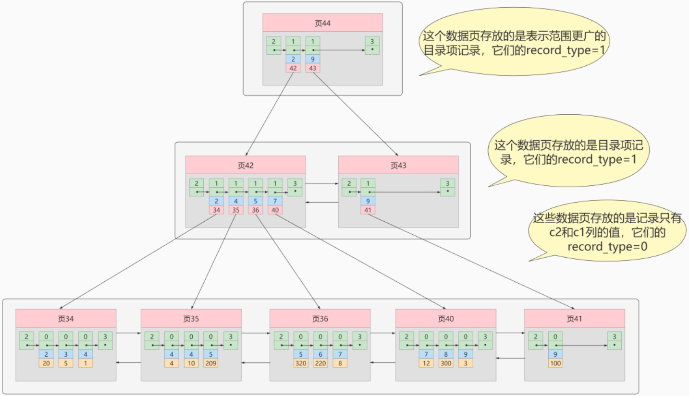

#### 3、单列索引

单列索引，顾名思义就是只根据某一个字段创建的索引。

#### 4、联合索引

联合索引，顾名思义就是根据多个字段创建的索引。例如我们为`(c2列, c3列)`创建索引，这就是一个联合索引，它具有以下特点：

- 数据页和页中记录的排序会先按照c2列进行排序；在c2列值相等的情况下，再按照c3列进行排序
- B+树的叶子节点存储的数据是`c2列+c3列+主键`
- B+树的目录项记录中存储的数据是`c2列+c3列+主键+页号`

### 1.4 MyISAM中的索引

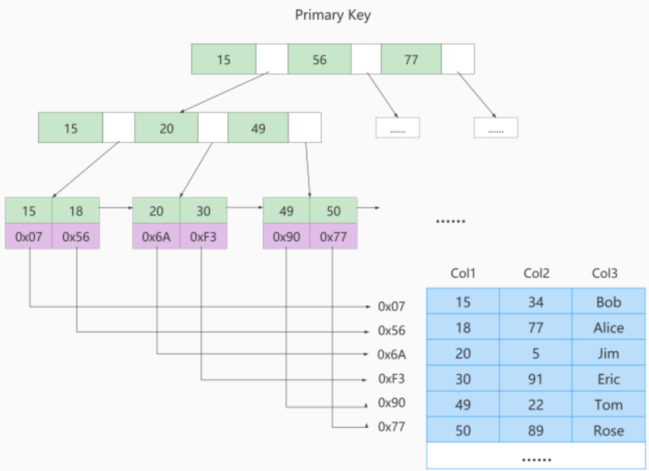

MyISAM索引的底层结构虽然也是B+Tree，但是它将**索引列的值和完整的用户记录分开存储**。例如，我们为c2列创建索引，它具有如下特点：

- B+树的叶子节点中存储的数据是`c2列+数据记录地址`，这颗B+树单独保存在`索引文件`中。而完整的用户记录单独保存在`数据文件`中，这个数据文件与索引没有任何关系(底层结构也不是B+树)，它只按照记录的插入顺序来保存所有记录。
- 因此，在MyISAM中没有聚簇索引，而**全都是二级索引**。即便是为主键创建的主键索引，其叶子节点同样只存储`主键列+数据记录地址`，所以仍然是个二级索引。因此MyISAM中甚至可以没有主键。
- MyISAM中的查询操作，始终都需要一次**回表**操作，也就是到数据文件中查找完整的数据记录。不过MyISAM中的回表，比InnoDB中的回表要快得多（因为InnoDB中的回表则是要再查找一颗B+树）

> **说明**：MyISAM可以没有主键，但InnoDB必须有主键。在InnoDB中，表如果没有显式指定主键，则会自动选择一个`非空且唯一`的列作为主键；如果不存在这种列，则自动为InnoDB表生成一个隐含字段作为主键，这个字段长度为6个字节，类型为长整型。
>
> **总结**：MyISAM表的索引全都是二级索引；InnoDB表必然有且仅有一个聚簇索引(也就是主键索引，实际上数据表本身存储的形式就是以主键索引的B+树结构存储的)，而其他的索引均为二级索引。

### 1.5 B+Tree数据结构详解

数据库索引一般很大，存储在磁盘上，所以我们根据索引查询时，不可能把整个索引全部加载到内存中，因此MySQL衡量查询效率的标准就是**磁盘IO次数**。加快查找速度的数据结构，常见的就是`哈希`和`平衡二叉搜索树`。

#### 1、Hash

Hash结构的查询时间复杂度为`O(1)`，速度非常快，然而InnoDB和MyISAM存储引擎都不支持Hash索引，其原因在于：

- Hash索引只有在等值查询时效率很高，如果要进行范围查询，时间复杂度退化为`O(n)`
- Hash索引中数据的存储是无序的，所以对于`ORDER BY`查询，还需要重新排序
- 对于联合索引，Hash值是将联合索引键合并后一起来计算的，无法对单独的一个键进行查询
- 对于等值查询来说，通常Hash索引效率更高，但如果索引列的重复值很多，Hash索引效率就变低了，因为遇到Hash冲突时需要遍历桶中的单链表进行比较。

> 补充：InnoDB本身不支持Hash索引，但是它提供`自适应Hash索引`，即如果某个数据经常被访问，当满足一定条件时，就会将这个数据页的地址存放到Hash表中，这样在下次查询时就可以直接找到这个页面的所在位置。

#### 2、B树

如果索引采用树结构，那么磁盘的IO次数正比于树的高度，而多叉树的高度会远远小于二叉树，因此B树和B+树的优先级很高。B树是多路平衡查找树，其结构如下：

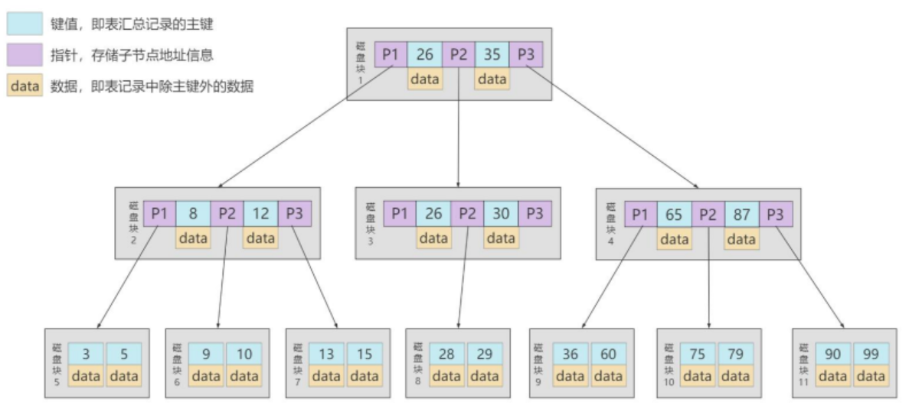

一个M阶B树（M>2）有以下特点：

1. 根节点的儿子数的范围是`[2,M]`
2. 每个中间节点包含`k-1`个关键字和`k`个孩子，`孩子的数量=关键字的数量+1`，`k`的取值范围为`[ceil(M/2), M]` 
3. 叶子节点包括`k-1`个关键字（叶子节点没有孩子），k 的取值范围同上。所有叶子节点位于同一层。

#### 3、B+树

B+树也是一种多路平衡搜索树，基于B树作出了改进，它更适合文件索引系统。

**B+树和B树的差异在于以下几点**：

1. B+树中，一个节点的孩子数量等于关键字数；而B树中，`孩子数量 = 关键字数 + 1`。
2. B+树中，非叶子节点的关键字也会同时存在在子节点中，并且是在子节点中所有关键字的最小（或最大）。 
3. B+树中，非叶子节点仅保存索引列、不保存数据记录，跟记录有关的信息都放在叶子节点中；而B树中，非叶子节点既保存索引列，也保存数据记录。 
4. B+树中所有关键字都会在叶子节点出现，叶子节点间构成一个有序链表，而且叶子节点本身也按照关键字从小到大顺序链接。

**B+树的优势**：

- 查询效率更加稳定：所有用户数据记录查询路径长度相同，都会查找到叶子结点。
- 磁盘读写代价更低：B+树的内节点中并没有保存数据记录，所以能存储的目录项记录就更多，因此结构上比B树更加矮胖，树高越小意味着IO次数越少。
- 在范围查询上B+树效率也更高：因为所有关键字都出现在B+树的叶子节点中，而叶子节点之间数据递增，且有指针连接，可以直接根据指针顺序读取。

> 说明：B树和B+树是两种不同的数据结构，不能混淆。但是在MySQl中只会使用到B+树，所以有时人们会将B+树简称为B树，因此，在MySQL中提到B树的概念，实际上指的都是B+树。

## 2. InnoDB数据存储结构

### 2.1 页(Page)

由于InnoDB是MySQL现在的默认存储引擎，所以我们主要研究InnoDB中数据的存储结构。InnoDB以`页`作为磁盘和内存之间交互的**基本单位**，InnoDB中页的大小默认为`16KB`。所以无论是读取表的一行还是多行，都会将这些行所在的页都加载到内存。

比`页`大的单位还有区、段、表空间，它们之间的关系如下：

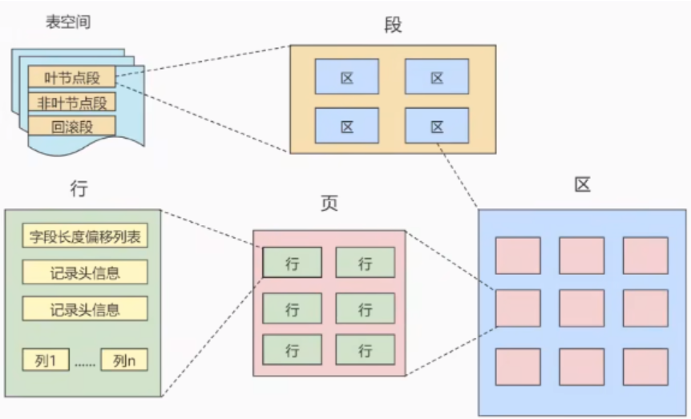

- 区(Extent)由一系列连续的页所组成，在InnoDB中默认一个区会**分配64个连续的页**
- 段(Segment)由一个或多个区组成，段是数据库中的`分配单位`，例如创建一张表时就会创建一个表段、创建一个索引时就会创建一个索引段
- 表空间(Tablespace)是一个逻辑容器，由一个或多个段组成。一个数据库就由一个或多个表空间组成。

### 2.2 页的内部结构

页有很多类型，最常见的是`数据页`（B+树的节点），数据页分为以下七个部分：

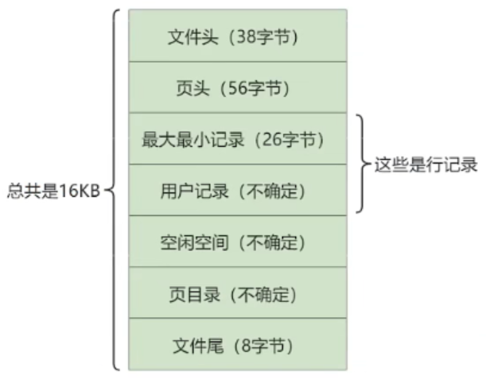

- 文件头(File Header)：保存页的通用信息，如页号、页的类型、上一页的页号、下一页的页号
- 页头(Page Header)：保存页的状态信息
- 最大最小记录：保存当前页中的最大记录和最小记录，是两条虚拟记录
- 用户记录(User Records)：按照`行格式`保存一条条用户记录，记录之间构成单链表
- 空闲空间(Free Space)：页中还没有被使用的空间
- 页目录(Page Directory)：用于保存用户记录的相对位置，便于二分查找提升效率。在底层，实际上会对这些用户记录进行分组，每组都包含一定数量的用户记录，在查找时首先通过二分查找定位到所在的组，然后在这个组中单链表顺序遍历找到目标记录。
- 文件尾(File Tailer)：用于校验页是否完整

### 2.3 行格式

行格式，也称为记录格式。行格式种类有很多，在MySQL 8中默认的行格式是`Dynamic`，它与另一种行格式`Compact`非常相似，只不过在处理行溢出数据时有所不同。所以我们着重介绍`Compact`行格式，它包含两部分内容：记录的额外信息、记录的真实数据。

#### 1、记录的额外信息

记录的额外信息中，主要包含以下三部分内容：

1. 变长字段长度列表：对于一些变长类型的字段(例如`VARCHAR`)，需要保存这些字段实际占用的长度，这就是这条记录中`变长字段长度列表`保存的内容。
2. NULL值列表：用于保存这条记录中每个字段是否为NULL，用1表示字段的值为NULL，用0表示字段的值不为NULL
3. 记录头信息

记录头信息，主要包含以下6个字段：

- `delete_mask`：1代表当前记录已被删除，0代表当前记录未被删除。因为实际删除的记录并不是立即从磁盘中移除的，而是通过修改该标记位表示删除，否则每次都要重新排列数据，严重影响性能。这些标记为1的记录会构成一个垃圾链表，将来新增记录时可能可以重用这些空间。
- `min_rec_mask`：只有B+树中的非叶子节点中的最小记录，会将该标记设置为1，其余都设置为0
- `record_type`：表示当前记录的类型，0表示普通记录，1表示非叶子节点的记录，2表示最小记录，3表示最大记录
- `heap_no`：该值表示当前记录在本页中的位置，我们插入的记录从2开始递增。0和1分别代表最小记录和最大记录，这两条虚拟记录是由页自动插入的。
- `n_owned`：页目录中的每个分组的最后一条记录，都会用该字段存储`该组总共的记录数`
- `next_record`：从当前记录的真实数据到下一条记录的真实数据的地址偏移量（单位是字节）。而且规定，最小记录(虚拟记录)的下一条记录是本页中最小的用户记录，本页中最大的用户记录的下一条记录是最大记录(虚拟记录)。

#### 2、记录的真实数据

记录的真实数据中，主要包含以下四部分内容：

1. 用户记录的真实数据，也就是各个列的值
2. 隐藏列`row_id`：如果一个表没有手动定义主键，则会自动选择一个非空、唯一列作为主键；如果这样的列都不存在，那么就会自动添加一个名为`row_id`的隐藏列作为主键，所以只有在这种情况下才会有这个隐藏列
3. 隐藏列`transaction_id`：事务id
4. 隐藏列`roll_pointer`：回滚指针，MVCC中需要用到

## 3. 索引的语法

### 3.1 创建索引

按照功能逻辑，索引可以分为**普通索引**、**唯一索引**、**主键索引**、**全文索引**、**空间索引**

#### 1、普通索引

创建普通索引，只是用于提高该字段的查询效率，这类索引可以创建在任何数据类型中，语法如下：

```sql
CREATE TABLE `table_name` (
	`id` int unsigned NOT NULL AUTO_INCREMENT,
    `user_id` bigint NOT NULL,
	`username` varchar(45) NOT NULL,
    PRIMARY KEY (`id`),
	KEY `idx_username` (`username`) # 其中idx_username是自定义的索引名称
);
```

- 关键字`KEY`和`INDEX`是同义词，可以相互替换
- 如果要创建联合索引，则使用类似`KEY idx_uid_uname (user_id, username)`的语句即可
- 对于字符串类型的字段，可以指定索引的长度，例如`KEY idx_username (username(10))`，表示只使该字段的前10个字符来创建索引

#### 2、唯一索引

使用`UNIQUE`关键字可以设置唯一索引，除了提高该字段的查询效率外，还限制该索引列的值必须唯一，但允许有多个NULL值，语法如下：

```sql
CREATE TABLE `table_name` (
	`id` int unsigned NOT NULL AUTO_INCREMENT,
    `user_id` bigint NOT NULL,
	`username` varchar(45) NOT NULL,
    PRIMARY KEY (`id`),
	UNIQUE KEY `uniq_user_id` (`user_id`)
);
```

#### 3、主键索引

设置主键后就会创建主键索引：

```sql
CREATE TABLE `table_name` (
	`id` int unsigned NOT NULL AUTO_INCREMENT,
    `user_id` bigint NOT NULL,
	`username` varchar(45) NOT NULL,
    PRIMARY KEY (`id`)
);
```

#### 4、全文索引

全文索引能够利用分词技术提高检索效率，它只能创建在CHAR、VARCHAR、TEXT类型及其系列类型的字段上，语法为`FULLTEXT KEY futxt_idx_info (info)`。不过该功能现在已逐渐被Elasticsearch等专门的搜索引擎替代。

#### 5、空间索引

空间索引只能创建在GEOMETRY等空间数据类型的字段上，且该字段必须非空，语法为`SPATIAL KEY spa_idx_geo (geo)`

### 3.2 在已有表上增加索引

以下两种语法都可以使用：

```sql
ALTER TABLE `table_name`
ADD [UNIQUE] INDEX `index_name` (`col_name`, ...);
```

```sql
CREATE [UNIQUE] INDEX `index_name`
ON `table_name` (`col_name`, ...);
```

### 3.3 删除索引

以下两种语法都可以使用：

```sql
ALTER TABLE `table_name` 
DROP INDEX `index_name`;
```

```sql
DROP INDEX `index_name`
ON `table_name`;
```

### 3.4 隐藏索引

MySQL 8开始支持**隐藏索引**，将某个索引设置为隐藏索引后，查询优化器就不会再使用这个索引，但是增、删、改操作时仍然会正常更新这个索引。隐藏索引一般只在测试调优的时候使用，在生产上如果某个索引长期隐藏，则会严重影响性能。注意，主键不能设置为隐藏索引。

设置隐藏索引的语法很简单，只需正常创建索引，在结尾添加`INVISIBLE`关键字即可，如下：

```sql
CREATE TABLE `table_name` (
	`id` int unsigned NOT NULL AUTO_INCREMENT,
    `user_id` bigint NOT NULL,
	`username` varchar(45) NOT NULL,
    PRIMARY KEY (`id`),
	KEY `idx_username` (`username`) INVISIBLE
);
```

```sql
ALTER TABLE `table_name`
ADD [UNIQUE] INDEX `index_name` (`col_name`, ...) INVISIBLE;
```

```sql
CREATE [UNIQUE] INDEX `index_name`
ON `table_name` (`col_name`, ...) INVISIBLE;
```

切换索引的可见状态的语法为：

```sql
# 切换成隐藏索引
ALTER TABLE `table_name` ALTER INDEX `index_name` INVISIBLE; 
# 切换成非隐藏索引
ALTER TABLE `table_name` ALTER INDEX `index_name` VISIBLE;   
```

## 4. 索引的设计原则

1. 业务上具有**唯一特性**的字段，即使是组合字段，也必须建立唯一索引
2. 频繁作为`WHERE`过滤条件的字段，需要创建索引
3. 频繁作为`GROUP BY`或`ORDER BY`的字段，需要创建索引
4. **区分度低**的字段(也就是重复值很多的字段，比如`性别`字段只有`男`和`女`，就会有很多数据重复)，禁止创建索引
5. 对字符串类型的字段创建索引时，必须**指定索引长度**，通常指定前20个字符即可。长度太长，会导致索引占用大量空间；长度太短，则会导致区分度过低。
6. 在多个字段都需要创建索引的情况下，通常创建联合索引会优于单列索引，因为多个单列索引占用的空间太大了。注意，在创建联合索引时，由于`最左前缀原则`，尽量将最频繁使用的字段放在联合索引的左侧。
7. 频繁更新的字段尽量不要创建索引，同理，频繁更新的表尽量不要创建过多的索引。
8. 单张表的索引数量不要超过6个，主要原因如下：
   - 维护索引要耗费时间，**会降低增、删、改的速度**
   - 每个索引都对应一颗B+树，**会占用大量磁盘空间**
   - 优化器在优化查询时，会对每一个可以用到的索引来进行评估，如果索引太多，反而**会增加优化器生成执行计划的时间**，降低查询性能。

# 第06章_MySQL调优-表结构优化


# 第07章_MySQL调优-SQL优化


# 第08章_MySQL调优-数据库优化


