# 第13章_事务基础知识

## 1. 数据库事务概述

### 1.1 基本概念

注意：在MySQL中，只有InnoDB引擎是支持事务的。

**事务**：一组逻辑操作单元，使数据从一种状态变换到另一种状态。

**事务处理的原则**：保证所有事务都作为 `一个工作单元` 来执行，即使出现了故障，都不能改变这种执行方式。当在一个事务中执行多个操作时，要么所有的事务都被提交(`commit`)，那么这些修改就`永久`地`保存下来`；要么数据库管理系统将`放弃`所作的`所有修改`，整个事务回滚(`rollback`)到最初状态。

### 1.2 事务的ACID特性

**原子性（atomicity）**

原子性是指事务是一个不可分割的工作单位，要么全部提交，要么全部失败回滚。

**一致性（consistency）**

一致性是指事务执行前后，数据从一个 `合法性状态` 变换到另外一个 `合法性状态` 。这种状态是 `语义上` 的而不是语法上的，跟具体的业务有关。

那什么是合法的数据状态呢？满足 `预定的约束` 的状态就叫做合法的状态。通俗一点，这状态是由你自己来定义的（比如满足现实世界中的约束）。

- 举例1：A账户有200元，转账300元出去，此时A账户余额为-100元。你自然就发现此时数据是不一致的，为什么呢？因为你定义了一个状态，余额这列必须>=0。
- 举例2：A账户有200元，转账50元给B账户，A账户的钱扣了，但是B账户因为各种意外，余额并没有增加。你也知道此时的数据是不一致的，为什么呢？因为你定义了一个状态，要求A+B的总余额必须不变。
- 举例3：在数据表中我们将`姓名`字段设置为`唯一性约束`，这时当事务进行提交或者事务发生回滚的时候，如果数据表的姓名不唯一，就破坏了事务的一致性要求。

**隔离型（isolation）**

事务的隔离性是指一个事务的执行`不能被其他事务干扰`，即一个事务内部的操作及使用的数据对`并发`的其他事务是隔离的，并发执行的各个事务之间不能相互干扰。

**持久性（durability）**

持久性是指一个事务一旦被提交，它对数据库中数据的改变就是 `永久性的` ，接下来的其他操作和数据库故障不应该对其有任何影响。

持久性是通过 `事务日志` 来保证的。日志包括了 `重做日志` 和 `回滚日志` 。当我们通过事务对数据进行修改的时候，首先会将数据库的变化信息记录到重做日志中，然后再对数据库中对应的行进行修改。这样做的好处是，即使数据库系统崩溃，数据库重启后也能找到没有更新到数据库系统中的重做日志，重新执行，从而使事务具有持久性。

> 总结
>
> ACID是事务的四大特征，在这四个特性中，原子性是基础，隔离性是手段，一致性是约束条件， 而持久性是我们的目的。
>
> 数据库事务，其实就是数据库设计者为了方便起见，把需要保证`原子性`、`隔离性`、`一致性`和`持久性`的一个或多个数据库操作称为一个事务。

### 1.3 事务的状态

我们现在知道`事务`是一个抽象的概念，它其实对应着一个或多个数据库操作，MySQL根据这些操作所执行的不同阶段把`事务`大致划分成几个状态：

**活动的（active）**

事务对应的数据库操作正在执行过程中时，我们就说该事务处在 `活动的` 状态。

**部分提交的（partially committed）**

当事务中的最后一个操作执行完成，但由于操作都在内存中执行，所造成的影响并 `没有刷新到磁盘` 时，我们就说该事务处在 `部分提交的` 状态。

**失败的（failed）**

当事务处在 `活动的` 或者 `部分提交的` 状态时，可能遇到了某些错误（数据库自身的错误、操作系统错误或者直接断电等）而无法继续执行，或者人为的停止当前事务的执行，我们就说该事务处在 `失败的` 状态。

**中止的（aborted）**

如果事务执行了一部分而变为 `失败的` 状态，那么就需要把已经修改的事务中的操作`回滚`到事务执行前的状态。当 `回滚` 操作执行完毕时，也就是数据库恢复到了执行事务之前的状态，我们就说该事务处在了 `中止的` 状态。

**提交的（committed）**

当一个处在 `部分提交的` 状态的事务将修改过的数据都 `同步到磁盘` 上之后，我们就可以说该事务处在了 `提交的` 状态。

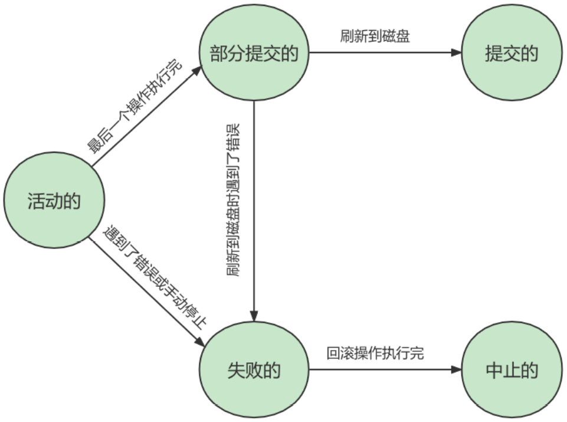

可见，只有当事务处于`提交的`或者`中止的`状态时，一个事务的生命周期才算是结束了。

## 2. 如何使用事务

使用事务有两种方式，分别为 `显式事务` 和 `隐式事务` 。

### 2.1 显式事务

**步骤1**： START TRANSACTION 或者 BEGIN ，作用是显式开启一个事务。

```sql
mysql> BEGIN;
#或者
mysql> START TRANSACTION;
```

`START TRANSACTION` 语句相较于 `BEGIN` 的特别之处在于，后边能跟随几个`修饰符`：

- `READ ONLY` ：标识当前事务是一个 `只读事务` ，也就是属于该事务的数据库操作只能读取数据，而不能修改数据。

  > 补充：只读事务中只是不允许修改那些其他事务也能访问到的表中的数据，对于临时表来说（我们使用 CREATE TMEPORARY TABLE 创建的表），由于它们只能再当前会话中可见，所有只读事务其实也是可以对临时表进行增、删、改操作的。

- `READ WRITE` ：标识当前事务是一个 `读写事务` ，也就是属于该事务的数据库操作既可以读取数据，也可以修改数据。
- `WITH CONSISTENT SNAPSHOT` ：启动一致性读。

比如：

```sql
START TRANSACTION READ ONLY; # 开启一个只读事务
```

```sql
START TRANSACTION READ ONLY, WITH CONSISTENT SNAPSHOT # 开启只读事务和一致性读
```

```sql
START TRANSACTION READ WRITE, WITH CONSISTENT SNAPSHOT # 开启读写事务和一致性读
```

注意：

* 一个事务的访问模式不能同时既设置为`只读`的也设置为`读写`的
* 如果我们不显式指定事务的访问模式，那么该事务的访问模式默认就是`读写`模式

**步骤2**：一系列事务中的操作（主要是DML，不含DDL）

**步骤3**：提交事务 或 中止事务（即回滚事务）

```sql
# 提交事务。当提交事务后，对数据库的修改是永久性的。
mysql> COMMIT;
```

```sql
# 回滚事务。即撤销正在进行的所有没有提交的修改
mysql> ROLLBACK;

# 将事务回滚到某个保存点。
mysql> ROLLBACK TO [SAVEPOINT]
```

其中关于SAVEPOINT相关操作有：

```sql
# 在事务中创建保存点，方便后续针对保存点进行回滚。一个事务中可以存在多个保存点。
SAVEPOINT 保存点名称;
```

```sql
# 删除某个保存点
RELEASE SAVEPOINT 保存点名称;
```

注意：回滚到某个保存点，该事务并没有结束，只有COMMIT或者ROLLBACK才会结束当前事务。

### 2.2 隐式事务

MySQL中有一个系统变量 `autocommit`，默认是开启自动提交的。当然，如果我们想关闭这种 `自动提交` 的功能，可以使用下边两种方法之一：

* 显式的使用 `START TRANSACTION` 或者 `BEGIN` 语句开启一个事务。这样在本次事务提交或者回滚前会暂时关闭掉自动提交的功能。

* 把系统变量 `autocommit` 的值设置为 `OFF`：

  ```sql
  SET autocommit = OFF;
  #或
  SET autocommit = 0;
  ```

> 总结：
> 当我们设置 autocommit=0 时，不论是否采用 START TRANSACTION 或者 BEGIN 的方式来开启事务，都需要使用 COMMIT 进行提交、使用 ROLLBACK 进行回滚。
>
> 当我们设置 autocommit=1 时，每条 SQL 语句都会自动进行提交。不过这时，如果你采用 START TRANSACTION 或者 BEGIN 的方式来显式地开启事务，那么这个事务只有在 COMMIT 时才会提交，在 ROLLBACK 时才会回滚。


### 2.3 隐式提交事务的情况

**（1）数据定义语言(DDL)**

当我们`CREATE、ALTER、DROP`等语句去修改数据库对象时(数据库对象，指的就是`数据库、表、视图、存储过程`等结构)，就会隐式地提交前边语句所属于的事务。即：

```sql
BEGIN;

SELECT ... # 事务中的一条语句
UPDATE ... # 事务中的一条语句
... # 事务中的其他语句

CREATE TABLE ... # 此语句会隐式的提交前边语句所属于的事务
```

**（2）隐式使用或修改mysql数据库中的表**

当我们使用`ALTER USER`、`CREATE USER`、`DROP USER`、`GRANT`、`RENAME USER`、`REVOKE`、`SET PASSWORD`等语句时也会隐式的提交前边语句所属于的事务。

**（3）事务控制或关于锁定的语句**

- 当我们在一个事务还没提交或者回滚时就又使用 START TRANSACTION 或者 BEGIN 语句开启了另一个事务时，会隐式地提交上一个事务。即：

  ```sql
  BEGIN;
  
  SELECT ... # 事务中的一条语句
  UPDATE ... # 事务中的一条语句
  ... # 事务中的其他语句
  
  BEGIN; # 此语句会隐式的提交前边语句所属于的事务
  ```

- 当前的 autocommit 系统变量的值为 OFF ，我们手动把它调为 ON 时，也会隐式的提交前边语句所属的事务。
- 使用 LOCK TABLES 、UNLOCK TABLES 等关于锁定的语句也会 隐式的提交前边语句所属的事务。

**（4）加载数据的语句**

使用`LOAD DATA`语句来批量往数据库中导入数据时，也会`隐式的提交`前边语句所属的事务。

**（5）关于MySQL复制的一些语句**

使用`START SLAVE、STOP SLAVE、RESET SLAVE、CHANGE MASTER TO`等语句会隐式的提交前边语句所属的事务

**（6）其他的一些语句**

使用`ANALYZE TABLE、CACHE INDEX、CAECK TABLE、FLUSH、LOAD INDEX INTO CACHE、OPTIMIZE TABLE、REPAIR TABLE、RESET`等语句也会隐式的提交前边语句所属的事务。

### 2.4 举例

#### 2.4.1 提交与回滚

**情况1：**

```sql
CREATE TABLE user(name varchar(20), PRIMARY KEY (name)) ENGINE=InnoDB;

BEGIN;
INSERT INTO user SELECT '张三';
COMMIT;

BEGIN;
INSERT INTO user SELECT '李四';
INSERT INTO user SELECT '李四';
ROLLBACK;
```

运行结果（1行数据）：

```sql
mysql> select * from user;
+--------+
| name   |
+--------+
| 张三    |
+--------+
1 行于数据集 (0.01 秒)
```

**情况2：**

```sql
CREATE TABLE user (name varchar(20), PRIMARY KEY (name)) ENGINE=InnoDB;

BEGIN;
INSERT INTO user SELECT '张三';
COMMIT;

INSERT INTO user SELECT '李四';
INSERT INTO user SELECT '李四';
ROLLBACK;
```

运行结果（2行数据）：

```sql
mysql> SELECT * FROM user;
+--------+
| name   |
+--------+
| 张三    |
| 李四    |
+--------+
2 行于数据集 (0.01 秒)
```

**情况3：**

```sql
CREATE TABLE user(name varchar(255), PRIMARY KEY (name)) ENGINE=InnoDB;

SET @@completion_type = 1;
BEGIN;
INSERT INTO user SELECT '张三';
COMMIT;

INSERT INTO user SELECT '李四';
INSERT INTO user SELECT '李四';
ROLLBACK;
```

运行结果（1行数据）：

```sql
mysql> SELECT * FROM user;
+--------+
| name   |
+--------+
| 张三    |
+--------+
1 行于数据集 (0.01 秒)
```

补充：MySQL中参数`completion_type`的作用

- `completion_type = 0`：这是`默认情况`，当我们执行COMMIT时会提交事务，在执行下一个事务时，还需要使用`START TRANSACTION`或者`BEGIN`来开启
- `completion_type = 1`：这种情况下，当我们提交事务后，相当于执行了`COMMIT AND CHAIN`，也就是自动开启了一个链式事务，即当我们提交事务之后会立即又开启一个相同隔离级别的事务。
- `completion_type = 2`：这种情况下`COMMIT`就相当于`COMMIT AND RELEASE`，也就是当我们提交之后，会自动与服务器断开连接。

#### 2.4.2 SAVEPOINT的使用

```sql
CREATE TABLE account(
id INT PRIMARY KEY AUTO_INCREMENT,
NAME VARCHAR(15),
balance DECIMAL(10,2)
);

INSERT INTO account(NAME,balance)
VALUES
('张三',1000),
('李四',1000);

BEGIN;
UPDATE account SET balance = balance - 100 WHERE NAME = '张三';
UPDATE account SET balance = balance - 100 WHERE NAME = '张三';
SAVEPOINT s1; # 设置保存点
UPDATE account SET balance = balance + 100 WHERE NAME = '张三';
ROLLBACK TO s1; # 回滚到保存点
```

结果：张三：800.00

然后执行回滚语句：
```sql
ROLLBACK;
```

结果：张三：1000.00

## 3. 事务隔离级别

MySQL是一个 `客户端／服务器` 架构的软件，对于同一个服务器来说，可以有若干个客户端与之连接，每个客户端与服务器连接上之后，就可以称为一个会话（`Session`）。每个客户端都可以在自己的会话中向服务器发起事务。事务有 `隔离性` 的特性，理论上在某个事务 `对某个数据进行访问` 时，其他事务应该进行`排队` ，当该事务提交之后，其他事务才可以继续访问这个数据。但是这样对 `性能影响太大` ，我们既想保持事务的隔离性，又想让服务器在处理访问同一数据的多个事务时 `性能尽量高些` ，那就需要二者进行权衡取舍。

### 3.1 数据并发问题

我们先看一下访问相同数据的事务在 `不保证串行执行` 的情况下可能会出现哪些问题：

**1. 脏写（Dirty Write）**

对于两个事务 Session A、Session B，如果事务Session A `修改了` 另一个 `未提交` 事务Session B `修改过` 的数据，那就意味着发生了 `脏写`，示意图如下：

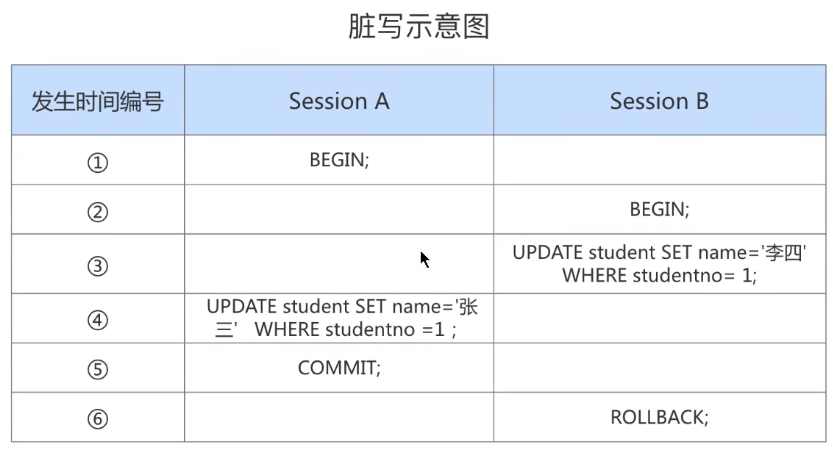

注意：SQL的所有隔离级别，都能够解决脏写的问题，具体而言，会使上面Session A中的更新语句处于等待状态。

**2. 脏读（Dirty Read）**

对于两个事务 Session A、Session B，Session A `读取` 了已经被 Session B `更新` 但还 `没有被提交` 的字段。之后若 Session B `回滚` ，Session A `读取 `的内容就是 `临时且无效` 的。

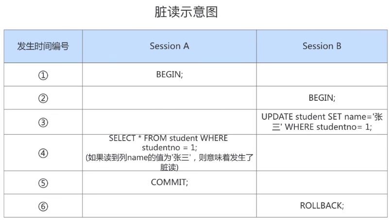

**3. 不可重复读（Non-Repeatable Read）**

对于两个事务Session A、Session B，Session A `读取`了一个字段，然后 Session B `更新`了该字段并提交。之后 Session A `再次读取` 同一个字段，`值就不同` 了。那就意味着发生了不可重复读。

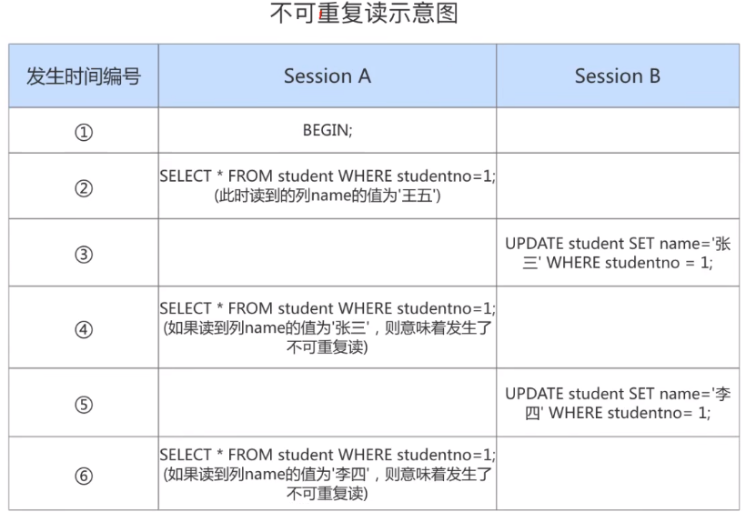

**4. 幻读（Phantom）**

对于两个事务Session A、Session B, Session A 从一个表中 `读取` 了一个字段, 然后 Session B 在该表中 `插入` 了一些新的行并提交。之后, 如果 Session A `再次读取` 同一个表, 就会多出几行。那就意味着发生了`幻读`。我们把新插入的那些记录称之为 `幻影记录`。

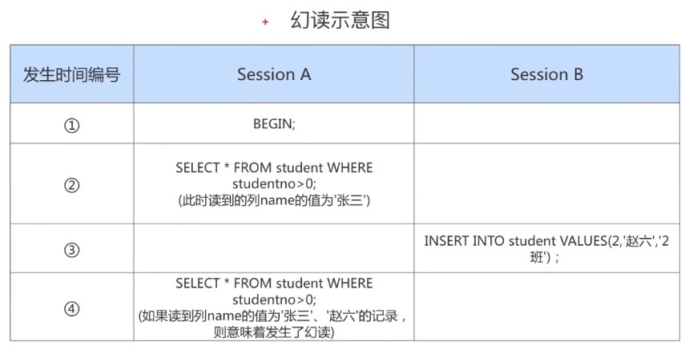

注：如果Session B`删除`了一些记录，而Session A读取到的记录变少了，这种情况`不属于幻读`。因为幻读强调的是一个事务按照某个`相同条件多次读取`记录时，后读取时读到了之前`没有读到的记录`。因此，这种情况只能相当于对每一条记录都发生了`不可重复读`的现象。

### 3.2 SQL中的四种隔离级别

上面介绍的几种并发事务的问题，由上至下严重性降低。我们愿意舍弃一部分隔离性来换取一部分性能，体现在：设立一些隔离级别，隔离级别越低，并发问题发生的就越多。`SQL标准` 中设立了4个 `隔离级别` ：

* `READ UNCOMMITTED` ：读未提交，在该隔离级别，所有事务都可以看到其他未提交事务的执行结果。不能避免脏读、不可重复读、幻读。 
* `READ COMMITTED` ：读已提交，它满足了隔离的简单定义：一个事务只能看见已经提交事务所做的改变。这是大多数数据库系统的默认隔离级别（但不是MySQL默认的）。不能避免不可重复读、幻读。 
* `REPEATABLE READ` ：可重复读，事务A在读到一条数据之后，此时事务B对该数据进行了修改并提交，那么事务A再读该数据，读到的还是原来的内容（这是MySQL的默认隔离级别）。不能避免幻读。 
* `SERIALIZABLE` ：可串行化，确保事务可以从一个表中读取相同的行。在这个事务持续期间，禁止其他事务对该表执行插入、更新和删除操作。所有的并发问题都可以避免，但性能十分低下。

总结：

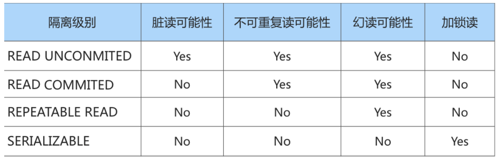

注1：脏写这个问题太严重了，所以不论是哪种隔离级别，都不允许脏写的情况发生。
注2：隔离级别越高，数据库的并发性能就越差


### 3.3 MySQL支持的四种隔离级别

Oracle只支持`READ COMMITTED(默认隔离级别)`和`SERIALIZABLE`两种隔离级别。

MySQL则支持4种隔离级别(默认隔离级别是`REPEATABLE READ`)，但与SQL标准中的规定有一些小区别，例如MySQL在`REPEATABLE READ`级别下是可以禁止幻读问题的发生的。

**MySQL中四种隔离级别的实现机制如下**：

- `READ UNCOMMITED`：读操作不加锁，写操作加记录锁，从而解决脏写的问题，但无法解决脏读、不可重复度、幻读。
- `READ COMMITTED`：读操作采用MVCC，写操作加记录锁，无法解决不可重复读、幻读。
- `REPEATABLE READ`：读操作采用MVCC(与上述读已提交的机制不同)，写操作加临键锁，进一步解决了不可重复读的问题，并且在读的层面也解决了幻读的问题。
- `SERIALIZABLE`：读操作加共享锁，写操作加临键锁。该隔离级别下，会对每个SELECT语句后自动加上LOCK IN SHARE MODE。

MySQL中查看事务的隔离级别：

```sql
SELECT @@transaction_isolation;
```

### 3.4 MySQL中修改事务的隔离级别

**通过下面的语句修改事务的隔离级别：**

```sql
SET [GLOBAL|SESSION] TRANSACTION ISOLATION LEVEL 隔离级别;
#其中，隔离级别格式：
> READ UNCOMMITTED
> READ COMMITTED
> REPEATABLE READ
> SERIALIZABLE
```

或者：

```sql
SET [GLOBAL|SESSION] TRANSACTION_ISOLATION = '隔离级别'
#其中，隔离级别格式：
> READ-UNCOMMITTED
> READ-COMMITTED
> REPEATABLE-READ
> SERIALIZABLE
```

**关于设置时使用GLOBAL或SESSION的影响：**

* 使用 GLOBAL 关键字（在全局范围影响）：

  ```sql
  SET GLOBAL TRANSACTION ISOLATION LEVEL SERIALIZABLE;
  #或
  SET GLOBAL TRANSACTION_ISOLATION = 'SERIALIZABLE';
  ```

  则：

  + 当前已经存在的会话无效
  + 只对执行完该语句之后产生的会话起作用

* 使用 `SESSION` 关键字（在会话范围影响）：

  ```sql
  SET SESSION TRANSACTION ISOLATION LEVEL SERIALIZABLE;
  #或
  SET SESSION TRANSACTION_ISOLATION = 'SERIALIZABLE';
  ```

  则：

  + 对当前会话的所有后续的事务有效
  + 如果在事务之间执行，则对后续的事务有效
  + 该语句可以在已经开启的事务中间执行，但不会影响当前正在执行的事务

如果在服务器启动时想改变事务的默认隔离级别，可以修改启动参数`transaction_isolation`的值。比如，在启动服务器时指定了`transaction_isolation=SERIALIZABLE`，那么事务的默认隔离界别就从原来的`REPEATABLE-READ`变成了`SERIALIZABLE`。

### 3.5 MySQL中幻读的补充知识

幻读，并不是说两次读取获取的结果集不同，幻读侧重的方面是某一次的select操作得到的结果所表征的数据状态无法支撑后续的业务操作。更具体一些：两次select都是空记录，但准备插入id为1的记录时，却发现报错，显示已存在该记录，此时就发生了幻读。**综上，MySQL的幻读并非读取两次返回结果集不同，而是事务在插入事先检测不存在的记录时，却惊奇地发现这些数据已经存在了，之前的检测读获取到的数据如同鬼影一般**。

其实在MySQL的RR隔离级别(`REPEATABLE READ`)下是可以避免幻读的，只要通过对select操作手动加`行X锁(独占锁)`(SELECT ... FOR UPDATE 这也正是SERIALIZABLE隔离级别下会隐式为你做的事情)。同时，即便当前记录不存在，比如id=1是不存在的，当前事务也会获得一把记录锁(因为InnoDB的行锁锁定的是索引，故记录实体存在与否没关系，存在就加`行X锁`，不存在就加`间隙锁`)，其他事务则无法插入此索引的记录，故杜绝了幻读。

## 4. 事务的常见分类

从事务理论的角度来看，可以把事务分为以下几种类型：

* 扁平事务：是事务类型中最简单的一种，而在实际生产环境中，这可能是使用最为频繁的事务。
* 带有保存点的扁平事务
* 链事务：可视为保存点模式的一个变种。链事务的思想是：在提交一个事务时，释放不需要的数据对象，将必要的处理上下文隐式地传给下一个要开始的事务。注意，提交事务操作和开始下一个事务操作将合并为一个原子操作。这意味着下一个事务将看到上一个事务的结果，就好像在一个事务中进行的。
* 嵌套事务：是一个层次结构框架。有一个顶层事务控制着各个层次的事务。顶层事务之下嵌套的事务被称为子事务，其控制每一个局部的变换。(注意：MySQL不支持嵌套事务)
* 分布式事务：通常是一个在分布式环境下运行的扁平事务，因此需要根据数据所在位置访问网络中的不同节点。对于分布式事务，同样需要满足ACID特性，要么都发生，要么都失效。

# 第14章_MySQL事务日志

事务有4种特性：原子性、一致性、隔离性和持久性。那么事务的四种特性到底是基于什么机制实现呢？

* 事务的**隔离性**由 `锁机制` 实现。
* 事务的**一致性**由数据库(例如字符串长度限制、唯一性约束等)和应用层(Java代码逻辑)共同保障
* 而事务的**持久性和原子性**由事务的`redo日志`和`undo日志`来保证。
  + REDO LOG 称为 `重做日志` ，提供再写入操作，恢复提交事务修改的页操作，用来保证事务的**持久性**。
  + UNDO LOG 称为 `回滚日志` ，回滚行记录到某个特定版本，用来保证事务的**原子性、一致性**。

REDO 和 UNDO 都可以视为是一种 `恢复操作`，但是：

* redo log: 是存储引擎层 (innodb) 生成的日志，记录的是`"物理级别"`上的页修改操作，比如页号xxx，偏移量yyy写入了zzz数据。主要为了保证数据的可靠性。
* undo log: 是存储引擎层 (innodb) 生成的日志，记录的是 `逻辑操作` 日志，比如对某一行数据进行了INSERT语句操作，那么undo log就记录一条与之相反的DELETE操作。主要用于 `事务的回滚` (undo log 记录的是每个修改操作的 `逆操作`) 和 `一致性非锁定读` (undo log 回滚行记录到某种特定的版本——MVCC，即多版本并发控制)。

## 1. redo日志

InnoDB存储引擎是以`页为单位`来管理存储空间的。在真正访问页面之前，需要把在`磁盘上`的页缓存到内存中的`Buffer Pool`之后才可以访问。所有的变更都必须`先更新缓冲池`中的数据，然后缓冲池中的`脏页`会以一定的频率被刷入磁盘，通过缓冲池来优化CPU和磁盘之间的鸿沟。

### 1.1 为什么需要REDO日志

由于事务包含 `持久性` 的特性，我们需要防止提交事务后，服务器崩溃导致未写入磁盘的情况。保证持久性的`一个简单的做法`是：在事务提交完成之前把该事务所修改的所有页面都刷新到磁盘，但是这个简单粗暴的做法有些问题:

- **修改量与刷新磁盘工作量严重不成比例**：有时候我们仅仅修改了某个页面中的一个字节，但磁盘IO必须刷新一整个页
- **随机IO刷新较慢**：如果修改多个页，则需要进行很多的`随机IO`

**我们采用的解决思路**：我们其实没有必要在每次事务提交时就把该事务在内存中修改过的全部页面刷新到磁盘，只需要把`修改了哪些东西记录一下`就好。InnoDB引擎的事务采用了**WAL技术** (`Write-Ahead Logging`)，这种技术的思想就是先写日志，再写磁盘，只有日志写入成功，才算事务提交成功，这里的日志就是redo log。当发生宕机且数据未刷到磁盘的时候，可以通过redo log来恢复，保证ACID中的D，这就是redo log的作用。

### 1.2 REDO日志的好处、特点

#### 1. 好处

* redo日志降低了刷盘频率 
* redo日志占用的空间非常小：只需存储表空间ID、页号、偏移量以及需要更新的值，所以所需的存储空间是很小的，刷盘快。

#### 2. 特点

**redo日志是顺序写入磁盘的**

在执行事务的过程中，每执行一条语句，就可能产生若干条redo日志，这些日志是按照`产生的顺序写入磁盘的`，也就是使用顺序IO，效率比随机IO快。

**事务执行过程中，redo log不断记录**

redo log跟bin log的区别：redo log是`存储引擎层`产生的，而bin log是`数据库层`产生的。假设一个事务，对表做10万行的记录插入，在这个过程中，一直不断的往redo log顺序记录，而bin log不会记录，直到这个事务提交，才会一次写入到bin log文件中。

### 1.3 redo的组成

redo log可以简单分为以下两个部分：

**重做日志的缓冲(redo log buffer)** ：保存在内存中，是易失的。在服务器启动时就会向操作系统申请了一大片称之为 redo log buffer 的 `连续内存` 空间，这片内存空间被划分为若干个连续的`redo log block`。一个redo log block占用`512字节`大小。

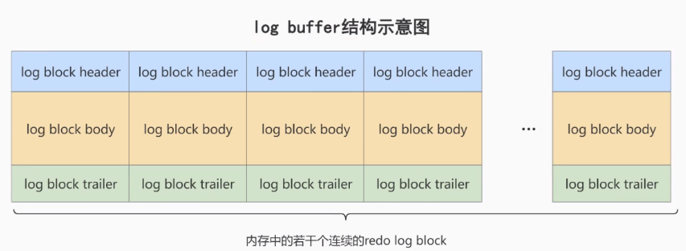

**重做日志文件(redo log file)** ：保存在硬盘中，是持久的。如`ib_logfile0`和`ib_logfile1`即为REDO日志。

### 1.4 redo的整体流程

以一个更新事务为例，redo log 流转过程，如下图所示：

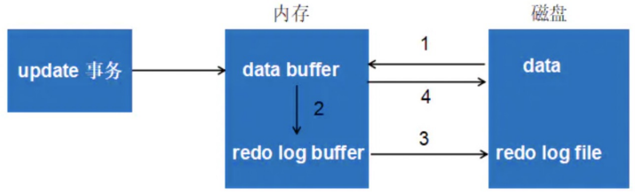

```
第1步：先将原始数据从磁盘中读入内存中来，修改数据的内存拷贝
第2步：生成一条重做日志并写入redo log buffer，记录的是数据被修改后的值
第3步：当事务commit时，将redo log buffer中的内容刷新到 redo log file，对 redo log file采用追加写的方式
第4步：定期将内存中修改的数据刷新到磁盘中
```

### 1.5 redo log的刷盘策略

redo log的写入并不是直接写入磁盘的，InnoDB引擎会先写入redo log buffer，之后以` 一定的频率 `刷入到真正的redo log file 中。

注意，redo log buffer刷盘到redo log file的过程并不是直接的，而是先写入到 `文件系统缓存（page cache）`中去（这是现代操作系统为了提高文件写入效率做的一个优化），真正的刷盘操作会交给系统自己来决定（比如page cache足够大了）。

首先，InnoDB存储引擎有一个后台线程，每隔`1秒`，就会把`redo log buffer`中的内容写到文件系统缓存(`page cache`)，然后直接调用刷盘操作。也就是说，一个没有提交事务的`redo log`记录，也可能会刷盘。

其次，在提交事务时，InnoDB给出 `innodb_flush_log_at_trx_commit` 参数，该参数控制commit提交事务时，如何将 redo log buffer 中的日志刷新到 redo log file 中，它支持三种策略：

* `设置为0` ：表示每次事务提交时不进行刷盘操作。
* `设置为1`（默认值）：表示每次事务提交时都将进行同步，刷盘到redo log file中
* `设置为2` ：表示每次事务提交时都只把 redo log buffer 内容写入 page cache，不进行刷盘操作，由OS自己决定什么时候同步到redo log file中。

**小结**：

- 参数值为1：效率最差，但最安全，因为只要事务提交成功，redo log记录就一定在硬盘里，不会有任何数据丢失。推荐使用该默认值。
- 参数值为2：效率适中，只要事务提交成功，redo log buffer中的内容就写入page cache，但如果在`1秒`的自动刷盘间隙内操作系统宕机，则产生数据丢失。
- 参数值为0：效率最高，安全性最差，完全靠每隔`1秒`的自动刷盘，一旦服务器宕机或者操作系统宕机，都容易丢失这1秒内的数据。

### 1.6 写入redo log buffer 过程

#### 1. 补充概念：Mini-Transaction

MySQL把对底层页面中的一次原子访问过程称之为一个`Mini-Transaction`，简称`mtr`。一个所谓的`mtr`可以包含一组redo日志，在进行崩溃恢复时这一组`redo`日志可以作为一个不可分割的整体。

一个事务可以包含若干条语句，每一条语句其实是由若干个 `mtr` 组成，每一个 `mtr` 又可以包含若干条 redo日志，画个图表示它们的关系就是这样：

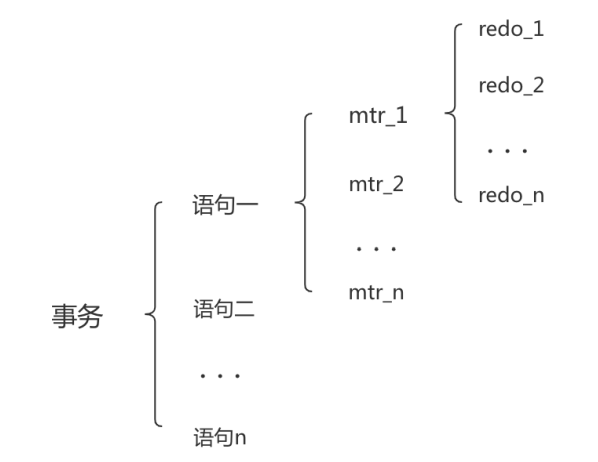

#### 2. redo日志写入log buffer

向log buffer中写入redo日志的过程是顺序的，当前边的block写满后再往下一个block中写。全局变量buf_free用于指明后续的redo日志应该写入的位置：

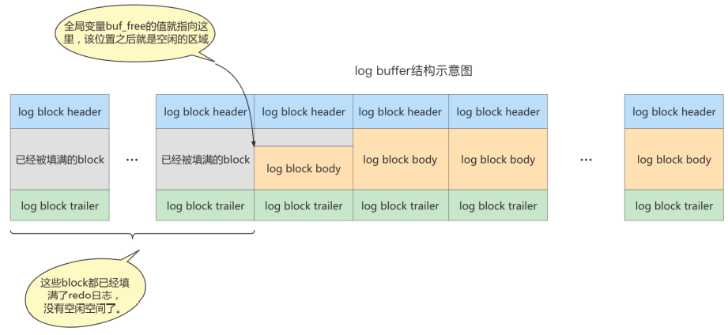

一个mtr执行过程中可能产生多条redo日志，这些redo日志需要等该mtr结束的时候一起写入到log buffer中。我们假设有两个事务t1和t2，它们各自包含2个mtr，它们的执行流程如下：(注意不同事务可能并发执行，所以t1和t2的mtr可能交替执行)

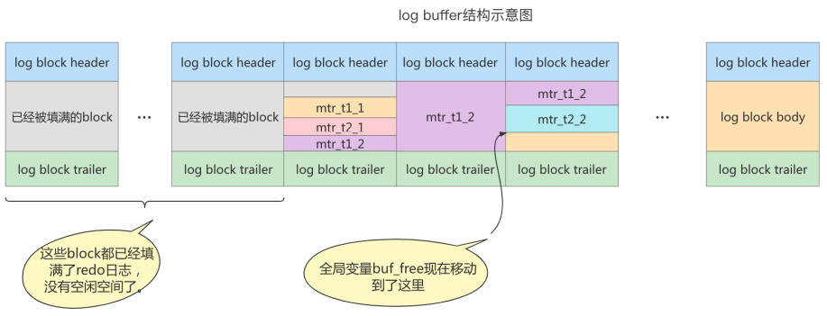


#### 3. redo log block的结构

一个redo log block是由`日志头、日志体、日志尾`组成。一个block大小为512字节，因为机械磁盘默认的扇区是512字节。redo日志都是存储到`log block body`中的，而`log block header`和`log block trailer`存储的是一些管理信息。

### 1.7 redo log file

#### 1. 日志文件组

磁盘上的redo日志文件不止一个，而是以一个`日志文件组`的形式出现，这些文件以`ib_logfile[数字]`的形式命名。当`ib_logfile[0]`写满后，才接着写`ib_logfile[1]`，以此类推。如果最后一个文件也写满了，则循环从头开始写。

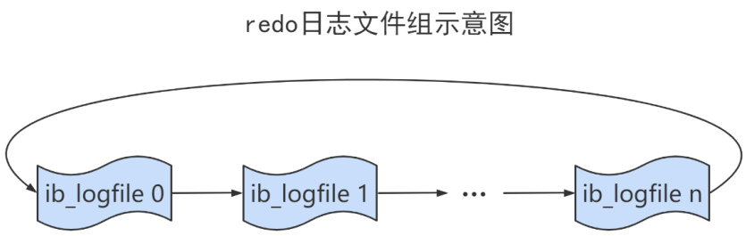

#### 2. checkpoint

在整个日志文件组中还有两个重要的属性，分别是 write pos、checkpoint

* `write pos`是当前记录的位置，一边写一边后移
* `checkpoint`是当前要擦除的位置，也是往后推移

每次刷盘 redo log 记录到日志文件组中，write pos 位置就会后移更新。每次MySQL加载日志文件组恢复数据时，会清空加载过的 redo log 记录，并把checkpoint后移更新。write pos 和 checkpoint 之间的还空着的部分可以用来写入新的 redo log 记录。

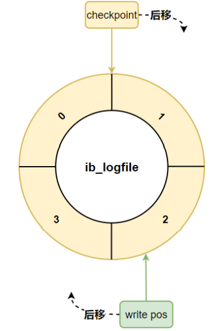

如果 write pos 追上 checkpoint ，表示`日志文件组`满了，这时候不能再写入新的 redo log记录，MySQL 得停下来，清空一些记录，把 checkpoint 推进一下。

## 2. undo日志

redo log是事务`持久性`的保证，undo log是事务`原子性`的保证。在事务中 `更新数据` 的前置操作其实是要先写入一个 `undo log` 。

### 2.1 如何理解Undo日志

为了保证事务的`原子性`，每当我们要对一条记录做改动时，都需要留一手(即把回滚所需的东西记下来)，比如：

- 对于每个INSERT，InnoDB存储引擎会记录一个DELETE以及该主键值(这样之后回滚的时候，只需把这个记录DELETE即可)
- 对于每个DELETE，需要记录一个INSERT
- 对于每个UPDATE，需要记录一个相反的UPDATE

MySQL把这些为了回滚而记录的内容称为`撤销日志`或者`回滚日志`(undo log)。注意，SELECT操作并不需要记录相应的undo日志。

此外，undo log也会产生redo log，因为undo log也需要持久性的保护。

### 2.2 Undo日志的作用

**作用1：回滚数据**

undo是`逻辑日志`，因此只是将数据库逻辑地恢复到原来的样子。所有修改都被逻辑地取消了，但是数据结构和页本身在回滚之后可能大不相同。

**作用2：MVCC**

undo的另一个作用是MVCC，即在InnoDB存储引擎中MVCC的实现是通过undo来完成。当用户读取一行记录时，若该记录已经被其他事务占用，当前事务可以通过undo读取之前的行版本信息，以此实现非锁定读取。

### 2.3 undo的存储结构

#### 1. 回滚段与undo页

InnoDB对undo log的管理采用段的方式，也就是`回滚段（rollback segment）`。每个回滚段记录了`1024`个`undo log segment`，而在每个undo log segment段中进行`undo页`的申请。

小结：undo日志存放在数据库内部的一个特殊段(rollback segment)中，而这个回滚段位于共享表空间内(支持128个回滚段)。

**undo页的重用**

当我们开启一个事务需要写undo log时，就得先去undo log segment中找到一个空闲位置去申请undo页，在这个undo页中进行undo log的写入。

但为每一个事务分配一个页式非常浪费的，所以undo页也被设计成可以`重用`的。当事务提交时，并不会立刻删除undo页，因为这个undo页可能混杂着其他事务的undo log(因为重用的缘故)。所以undo log在commit之后，会被放到一个`链表`中，然后判断undo页的使用空间是否`小于3/4`，如果小于3/4，则表示当前的undo页可以被重用，那么它就不会被回收，其他事务的undo log可以记录在当前undo页中。由于undo log是离散的，所以清理对应的磁盘空间时效率不高。

#### 2. 回滚段与事务

1. 每个事务只会使用一个回滚段，一个回滚段在同一时刻可能会服务于多个事务。
2. 当一个事务开始的时候，会指定一个回滚段，在事务进行的过程中，当数据被修改时，原始的数据会被复制到回滚段。
3. 在回滚段中，事务会不断填充盘区，直到事务结束或所有的空间被用完。
4. 回滚段存在于undo表空间中，在数据库中可以存在多个undo表空间，但同一时刻只能使用一个undo表空间。
5. 当事务提交时，InnoDB存储引擎会做以下两件事情：
   + 将undo log放入链表中，以供之后的purge操作 
   + 判断undo log所在的页是否可以重用，若可以分配给下个事务使用

#### 3. 回滚段中的数据分类

1. `未提交的回滚数据(uncommitted undo information)`：该数据所关联的事务并未提交，用于实现读一致性，所以该数据不能被其他事务的数据覆盖。
2. `已经提交但未过期的回滚数据(committed undo information)`：该数据关联的事务已经提交，但是仍受到undo retention参数的保持时间的影响。
3. `事务已经提交并过期的数据(expired undo information)`：事务已经提交，而且数据保存时间已经超过 undo retention参数指定的时间，属于已经过期的数据。当回滚段满了之后，就优先覆盖“事务已经提交并过期的数据"。

事务提交后不能马上删除undo log及undo log所在的页。这是因为可能还有其他事务需要通过undo log来得到行记录之前的版本。故事务提交时将undo log放入一个链表中，是否可以最终删除undo log以undo log所在页由purge线程来判断。

### 2.4 undo的类型

在InnoDB存储引擎中，undo log分为：

* insert undo log

  insert undo log是指insert操作中产生的undo log。因为insert操作的记录，只对事务本身可见，对其他事务不可见（这是事务隔离性的要求），故该undo log可以在事务提交后直接删除。不需要进行purge操作。

* update undo log

  update undo log记录的是对delete和update操作产生的undo log。该undo log可能需要提供MVCC机制，因此不能在事务提交时就进行删除。提交时放入undo log链表，等待purge线程进行最后的删除。

> 补充：
>
> purge线程两个主要作用是：`清理undo页`和`清理page里面带有Delete_Bit标识的数据行`。在InnoDB中，事务中的Delete操作实际上并不是真正的删除掉数据行，而是一种Delete Mark操作，在记录上标识Delete_Bit，而不删除记录。是一种“假删除”，只是做了个标记，真正的删除工作需要后台purge线程去完成。

### 2.5 undo和redo日志的简要生成过程

以下是undo+redo事务的简化过程：假设有两个数值，分别为A=1和B=2，然后将A修改为3，B修改为4

```sql
1. start transaction;
2. 记录A=1到undo log; update A=3; 记录A=3到redo log;
3. 记录B=2到undo log; update B=4; 记录B=4到redo log;
4. 将redo log刷新到磁盘; commit;
```

# 第15章_锁

## 1. 概述

`锁`是计算机协调多个进程或线程`并发访问某一资源`的机制。事务的`隔离性`就是通过锁机制实现的。

MySQL并发事务访问相同记录的情况大致可以划分为3种：

### 1.1 读-读

由于读取操作本身不会对记录有任何影响，所以这种情况不会引起并发问题。

### 1.2 写-写

`写-写` 情况，即并发事务相继对相同的记录做出改动。

在这种情况下会发生 `脏写` 的问题，任何一种隔离级别都不允许这种问题的发生。所以**在多个未提交事务相继对一条记录做改动时，必须让它们 `排队执行` ，这个排队的过程其实是通过 `锁` 来实现的**。

这个所谓的锁其实是一个内存中的结构，在事务执行前本来是没有锁的。当一个事务想对这条记录做改动时，首先会看看内存中有没有与这条记录关联的 `锁结构` ，如果没有，就会在内存中生成一个 `锁结构` 与之关联。比如，事务` T1` 要对这条记录做改动，就需要生成一个 `锁结构` 与之关联：

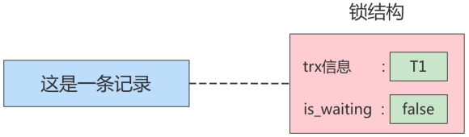

在`锁结构`里有很多信息，为了简化理解，只把两个比较重要的属性拿了出来：

* `trx信息`：代表这个锁结构是哪个事务生成的。
* `is_waiting`：代表当前事务是否在等待。

在事务`T1`改动了这条记录后，就生成了一个`锁结构`与该记录关联，因为之前没有别的事务为这条记录加锁，所以`is_waiting`属性就是`false`，我们把这个场景就称值为`获取锁成功`，或者`加锁成功`，然后就可以继续执行操作了。

在事务`T1`提交之前，另一个事务`T2`也想对该记录做改动，那么先看看有没有`锁结构`与这条记录关联，发现有一个`锁结构`与之关联后，然后也生成了一个锁结构与这条记录关联，不过锁结构的`is_waiting`属性值为`true`，表示当前事务需要等待，我们把这个场景就称之为`获取锁失败`，或者`加锁失败`，图示：

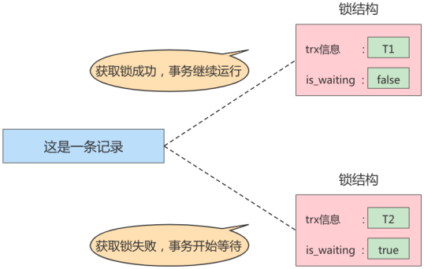

在事务T1提交之后，就会把该事务生成的`锁结构释放`掉，然后看看还有没有别的事务在等待获取锁，发现了事务T2还在等待获取锁，所以把事务T2对应的锁结构的`is_waiting`属性设置为`false`，然后把该事务对应的线程唤醒，让它继续执行，此时事务T2就算获取到锁了。

**小结**：

* 不加锁：意思就是不需要在内存中生成对应的 `锁结构` ，可以直接执行操作。

* 加锁成功(获取锁成功)：意思就是在内存中生成了对应的 `锁结构`，而且锁结构的 `is_waiting` 属性为 `false`。

* 加锁失败(获取锁失败)：意思就是在内存中生成了对应的 `锁结构`，不过锁结构的 `is_waiting` 属性为 `true`，也就是事务需要等待，不可以继续执行操作。

### 1.3 读-写

`读-写` 或 `写-读`，即一个事务进行读取操作，另一个进行改动操作。这种情况下可能发生 `脏读、不可重复读、幻读` 的问题。

### 1.4 并发问题的解决方案

解决`脏读、不可重复读、幻读`的问题有两种可选的解决方案：

**方案一：读操作利用多版本并发控制（MVCC），写操作进行加锁**。

MVCC，就是生成一个`ReadView`，通过ReadView找到符合条件的记录版本(历史版本由`undo日志`构建)。查询语句只能读到在生成ReadView之前`已提交事务所做的更改`，在生成ReadView之前未提交的事务或者之后才开启的事务所做的更改是看不到的。而写操作肯定针对的是`最新版本的记录`，读记录的历史版本和改动记录的最新版本本身并不冲突，即采用MVCC时`读-写`操作并不冲突。

> 普通的SELECT语句在READ COMMITTED和REPEATABLE READ隔离级别下会使用到MVCC读取记录。
>
> * 在 `READ COMMITTED` 隔离级别下，一个事务在执行过程中每次执行SELECT操作时都会生成一个ReadView，ReadView的存在本身就保证了`事务不可以读取到未提交的事务所做的更改`，也就是避免了脏读现象；
> * 在 `REPEATABLE READ` 隔离级别下，一个事务在执行过程中只有 `第一次执行SELECT操作` 才会生成一个ReadView，之后的SELECT操作都 `复用` 这个ReadView，这样也就避免了不可重复读和幻读的问题。

**方案二：读、写操作都采用加锁的方式**。

一些业务场景不允许读取记录的旧版本，而是每次都必须去`读取记录的最新版本`。这样，在读取记录时也需要进行加锁，即`读-写`也像`写-写`那样排队执行。

**小结**：

* 采用`MVCC`方式的话，读-写操作彼此并不冲突，性能更高 。
* 采用`加锁`方式的话，读-写操作彼此需要`排队执行`，影响性能。

## 2. 锁的内部结构

我们前边说对一条记录加锁的本质就是在内存中创建一个`锁结构`与之关联，那么是不是一个事务对多条记录加锁，就要创建多个`锁结构`呢？

理论上创建多个`锁结构`没问题，但是如果一个事务要获取10000条记录的锁，生成10000个锁结构也太崩溃了。所以决定在对不同记录加锁时，**如果符合下边这些条件的记录会放在一个`锁结构`中**：

* 在同一个事务中进行加锁操作
* 被加锁的记录在同一个页面中
* 加锁的类型是一样的
* 等待状态是一样的

`InnoDB` 存储引擎中的 `锁结构` 如下：

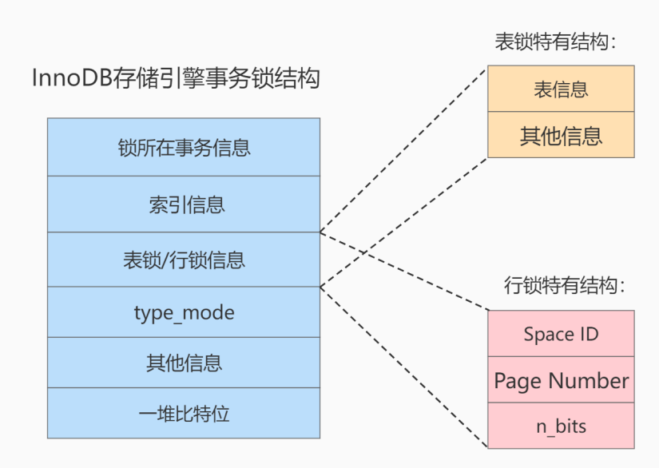


**（1）锁所在的事务信息**

哪个事务生成了这个锁结构，这里就记录这个事务的信息，此`锁所在的事务信息`在内存结构中只是一个指针，通过指针可以找到内存中关于该事务的更多信息，比方说事务id等。

**（2）索引信息**

对于`行锁`来说，需要记录一下加锁的记录是属于哪个索引的，这里也是一个指针。

**（3）表锁／行锁信息**

`表锁结构`和`行锁结构`在这个位置的内容是不同的：

* 表锁：记载着是对哪个表加的锁，还有其他的一些信息。

* 行锁：记载了三个重要的信息：

  * `Space ID`：记录所在表空间
  * `Page Number`：记录所在页号
  * `n_bits`：对于行锁来说，一条记录就对应着一个比特位，一个页面中包含很多记录，用不同的比特位来区分到底是哪一条记录加了锁(在锁结构末尾的`一堆比特位`中记录)。此处n_bits的值就表示锁结构中末尾的`一堆比特位`的比特位数。

  > n_bits的值一般都比页面中记录条数多一些。主要是为了之后在页面中插入了新记录后也不至于重新分配锁结构。

**（4）type_mode**

这是一个32位的数，被分成了`lock_mode`、`lock_type`和`rec_lock_type`三个部分，如图所示：

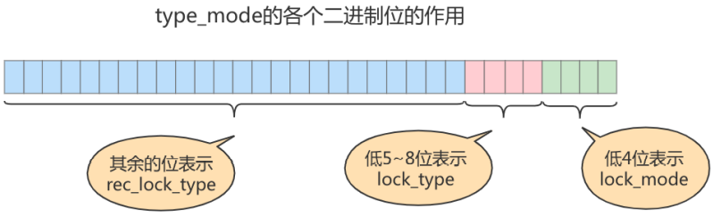

- lock_mode：共享意向锁、独占意向锁、共享锁、独占锁、自增锁
- lock_type：表级锁、行级锁
- rec_lock_type：只有当lock_type是行级锁时，才会划分更细的类型：next-key锁、gap锁、记录锁、插入意向锁等

**注意**：为了节省内存空间，`is_waiting`属性用type_mode的第9个bit位表示，1表示true(处于等待状态)，0表示false

**（5）其他信息**

为了更好的管理系统运行过程中生成的各种锁结构而设计了各种哈希表和链表。

**（6）一堆比特位**

如果是`行锁结构`的话，在锁结构末尾还放置了一堆比特位，比特位的数量等于上面`n_bits`的值。InnoDB数据页中的每条记录在`记录头信息`中都包含一个`heap_no`属性，伪记录`Infimum`的`heap_no`值为0，`Supremum`的`heap_no`值为1，之后每插入一条记录，`heap_no`值就增1。锁结构最后的一堆比特位就对应着一个页面中的记录，一个比特位映射一个`heap_no`，即一个比特位映射到页内的一条记录。

## 3. 锁的不同角度分类

### 3.1 从数据操作的类型划分：共享锁、排他锁

MySQL实现一个由两种类型的锁组成的锁系统，分别是`(Shared Lock)`和`排他锁(Exclusive Lock)`。

* `共享锁`：一般也称为 `读锁`、英文用 S 表示。针对同一份数据，多个事务的读操作可以同时进行而不会互相影响。
* `排他锁`：一般也称为 `写锁`、`独占锁`、英文用 X 表示。当前写操作没有完成前，它会阻断其他写锁和读锁。

**需要注意的是对于 InnoDB 引擎来说，读锁和写锁可以加在表上，也可以加在行上。**

总结：以下的兼容是指对同一张表或同一条记录的锁的兼容性情况。

|   |X锁  |S锁    |
|---|-----|------|
|X锁|不兼容|不兼容|
|S锁|不兼容|兼容  |

#### 3.1.1 SELECT语句

对于普通的SELECT语句，不会加任何锁，但SELECT语句可以通过以下方式显示地加S锁和X锁：

**对读取的记录加S锁**：

```sql
SELECT ... LOCK IN SHARE MODE;
# 或者
SELECT ... FOR SHARE; # mysql 8.0新增语法
```

在普通的SELECT语句后边加`LOCK IN SHARE MODE`，则会为读取到的记录加S锁，这样就允许别的事务继续获取这些记录的S锁，但是不能获取这些记录的X锁。

**对读取的记录加X锁**：

```sql
SELECT ... FOR UPDATE;
```

在普通的SELECT语句后边加`FOR UPDATE`，则会为读取到的记录加X锁，这样别的事务既不能获取这些记录的S锁，也不能获取这些记录的X锁。

**MySQL8.0新特性**：

在5.7及之前的版本，`SELECT ... FOR UPDATE/LOCK IN SHARE MODE`如果获取不到锁，则会一直等待，直到`innodb_lock_wait_timeout`超时。而在8.0版本中，可以在`SELECT ... FOR UPDATE/SHARE`后面添加`NOWAIT`或`SKIP LOCKED`来跳过锁等待、或跳过锁定：

- NOWAIT：如果获取锁失败，则会立即报错返回
- SKIP LOCKED：如果获取锁失败，也会立即返回，但是返回的结果中不包含被锁定的行。

#### 3.1.2 DELETE、UPDATE、INSERT语句

**DELETE**

对一条记录做DELETE操作的过程其实是先在B+树中定位到这条记录的位置，然后获取这条记录的`X锁`，再执行delete mark操作。

**UPDATE**

- 情况1：没有修改该记录的主键值，并且被更新的列占用的存储空间在修改前后未发生变化。则先在B+树中定位到这条记录的位置，然后获取该记录的`X锁`，最后在原记录的位置进行修改操作。
- 情况2：没有修改该记录的主键值，并且至少有一个被更新的列占用的存储空间在修改前后发生变化。则先在B+树中定位到这条记录的位置，然后获取该记录的`X锁`，将该记录彻底删除掉(即把该记录彻底移入垃圾链表)，最后再插入一条新记录。新插入的记录由`INSERT`操作提供的`隐式锁`进行保护。
- 情况3：修改了该记录的主键值。则相当于在原记录上做DELETE，然后再进行一次INSERT，加锁规则遵循DELETE和INSERT的规则。

**INSERT**

一般情况下，新插入一条记录的操作并不加锁，而是通过一种称为`隐式锁`的结构来保护这条新插入的记录在本事务提交前不被别的事务访问。

### 3.2 从数据操作的粒度划分：表级锁、页级锁、行锁

为了尽可能提高数据库的并发度，每次锁定的数据范围越小越好，但锁的范围越小、需要消耗的资源却越多。因此要在并发响应和系统性能两方面进行平衡，这就产生了`锁粒度(Lock granularity)`的概念。从表级锁、页级锁到行锁，锁粒度逐渐变细。

#### 3.2.1 表锁（Table Lock）

该锁会锁定整张表，它是MySQL中最基本的锁策略，并**不依赖于存储引擎**。表锁是**开销最小**的策略，且可以**避免死锁**的问题，但**并发率大打折扣**。

##### 1、表级别的S锁、X锁

- 在对某个表执行SELECT、INSERT、DELETE、UPDATE语句时，**InnoDB存储引擎是不会为这个表添加表级别的S锁或者X锁的**。
- 在对某个表执行一些**DDL语句**，如 `ALTER TABLE、DROP TABLE`时，其他事务对这个表并发执行诸如SELECT等语句会发生阻塞。同理，某个事务中对某个表执行SELECT等语句时，在其他事务中对这个表执行DDL语句也会发生阻塞。这个过程其实是通过在server层使用一种称之为`元数据锁`（Metadata Locks，简称MDL）的结构来实现的。

一般情况下，**不会使用InnoDB存储引擎提供的表级别的S锁和X锁**，因为InnoDB引擎有行锁。只会在一些特殊情况下，比方说 `崩溃恢复` 过程中用到。

**补充**：如何在InnoDB引擎中使用表锁？(了解即可)在系统变量 `autocommit=0，innodb_table_locks = 1`时，通过以下语句可以手动获取InnoDB存储引擎提供的表级的S锁或者X锁：

* `LOCK TABLES t READ;`对表t加表级别的S锁。
* `LOCK TABLES t WRITE;`对表t加表级别的X锁。
* `UNLOCK TABLES;`使用此命令解锁当前加锁的表

不过建议避免在InnoDB中使用这样的手动锁表语句，它们只会降低并发能力而已，**InnoDB的厉害之处还是实现了更细粒度的行锁**。

**MyISAM引擎下的表锁：MyISAM引擎不支持行锁，因此MyISAM在执行普通的查询语句前，会自动给涉及的所有表添加表级的S锁，而在执行增删改操作前，会自动给涉及的表添加表级的X锁。而InnoDB存储引擎是不会为这个表自动添加表级别的S锁和X锁的**。

**总结**：MySQL的表级锁有两种模式

* 表共享读锁（Table Read Lock）
* 表独占写锁（Table Write Lock）

|表级锁类型|自己可读|自己可写|自己可操作其他表|他人可读|他人可写|
|--|--|--|--|--|--|
|读锁|是|否|否|是|否|
|写锁|是|是|否|否|否|

##### 2、意向锁（intention lock）

InnoDB支持`多粒度锁`，即在特定场景下允许`行级锁`与`表级锁`共存，而`意向锁`就是其中的一种`表锁`。

1. 意向锁的存在是为了协调行锁和表锁的关系，支持多粒度（表锁和行锁）的锁并存。
2. 意向锁是一种`不与行级锁冲突的表级锁`。
3. 意向锁表明某个事务`正在某些行持有了锁`或该事务`准备去某些行持有锁`。

**意向锁的类型：**

* **意向共享锁**（intention shared lock, IS）：事务有意向对表中的某些行加**共享锁**。事务要获取某些行的S 锁，必须先获得表的IS锁。
* **意向排他锁**（intention exclusive lock, IX）：事务有意向对表中的某些行加**排他锁**。事务要获取某些行的X锁，必须先获得表的IX锁。

小结：意向锁是由存储引擎`自己维护的`，用户无法手动操作意向锁，在为数据行加共享/排他锁之前，InooDB会先获取该数据行`所在数据表的对应意向锁`。

**意向锁的重要性：**

假设没有意向锁的设计，如果某个事务试图在该表上应用排它锁，那么就必须首先逐行去检查是否有行锁，效率太低。而意向锁的存在，就可以让该事务只需检查是否有意向锁即可，无需逐行检查。

**意向锁的兼容性：**

（1）**意向锁之间是相互兼容的**，因为从符合实际的角度考虑，一个事务想获取某一行的排他锁，以及另一个事务想获取该表另一行的排他锁，这个操作显然是合理的，也就是说，这两个事务都应该成功获取表级的意向排他锁，所以意向锁理应互相兼容。如下：

|             |意向共享锁(IS)|意向排他锁(IX)|
|-------------|-------------|-------------|
|意向共享锁(IS)|兼容         |兼容          |
|意向排他锁(IX)|兼容         |兼容          |

（2）**意向锁和普通的表级锁之间未必兼容**，例如一个事务给某行添加了排他锁(自动就给该表上了意向排他锁)，那么此时另一个事务当然不能对该表添加表级的排他锁或者共享锁(因为前面那个事务正在修改某些行)。如下：

|            |意向共享锁(IS)|意向排他锁(IX)|
|------------|-------------|-------------|
|表级共享锁(S)|兼容         |互斥          |
|表级排他锁(X)|互斥         |互斥          |

（3）**意向锁不会与行级的共享/排他锁互斥**，很显然，意向锁并不会影响到多个事务对不同数据行加排他锁时的并发性。

##### 3、自增锁（AUTO-INC锁）

在使用MySQL过程中，我们可以为表的某个列添加 `AUTO_INCREMENT` 属性，意味着在书写插入语句时不需要为这个列赋值。所有插入数据的方式总共分为三类：

**Simple inserts（简单插入）**

可以`预先确定要插入的行数`（当语句被初始处理时）的语句。包括没有嵌套子查询的单行和多行`INSERT...VALUES()`和`REPLACE`语句。

**Bulk inserts（批量插入）**

`事先不知道要插入的行数`的语句。比如`INSERT...SELECT`，`REPLACE...SELECT`和`LOAD DATA`语句，但不包括纯INSERT。

**Mixed-mode inserts（混合模式插入）**

Simple inserts语句中一部分指定了自增主键的值，如`INSERT INTO teacher (id,name) VALUES (1,'a'), (NULL,'b'), (5,'c'), (NULL,'d');` 另一种类型的混合模式插入是`INSERT ... ON DUPLICATE KEY UPDATE`。

MySQL中的`自增锁`是**当向使用含有AUTO_INCREMENT列的表中插入数据时需要获取的一种特殊的表级锁**。在传统模式中，执行这种插入语句就会给表级别加一个AUTO-INC锁，然后为每条待插入记录的AUTO_INCREMENT列分配递增的值，执行结束后再把AUTO-INC锁释放。可见，一个事务在持有AUTO-INC锁的过程中，其他事务的插入语句都要被阻塞，从而保证递增值是连续的，所以这种方式并发性很差。所以，InnoDB通过`innodb_autoinc_lock_mode`的不同取值来提供不同的锁定机制，从而改善并发性。

**（1）innodb_autoinc_lock_mode = 0 (传统锁定模式)**

上述提及的就是传统锁定模式，并发性很差。

**（2）innodb_autoinc_lock_mode = 1 (连续锁定模式)**

在 MySQL 8.0 之前，连续锁定模式是`默认`的。
- 对于bulk inserts，在这个模式下仍然使用AUTO-INC表级锁，并保持到语句结束。
- 对于Simple inserts，则通过在`mutex(轻量锁)`的控制下获得所需数量的自动递增值来避免表级AUTO-INC锁，它只在分配过程的持续时间内保持，而不是直到语句完成。

**（3）innodb_autoinc_lock_mode = 2 (交错锁定模式)**

从 MySQL 8.0 开始，交错锁定模式是`默认`的。在此锁定模式下，自动递增值`保证`在所有并发执行的所有类型的insert语句中是`唯一`且`单调递增`的。但是，由于多个语句可以同时生成数字，**为任何给定语句插入的行生成的值可能不是连续的**。

如果执行的语句是simple inserts，由于要插入的行数已提前知道，所以为单个语句生成的数字不会有间隙(除非它是在Mixed-mode inserts中)。如果执行bulk inserts，在由任何给定语句分配的自动递增值中可能存在间隙。

##### 4、元数据锁（MDL锁）

MySQL5.5引入了meta data lock，简称MDL锁，属于表锁范畴。MDL的作用是保证读写的正确性。比如，如果一个查询正在遍历一个表中的数据，而执行期间另一个线程对这个`表结构做变更`，增加了一列，那么查询线程拿到的结果跟表结构对不上，肯定是不行的。

因此，**当对一个表做增删改查操作的时候，加MDL读锁；当要对表做结构变更操作的时候，加MDL写锁**。

读锁之间不互斥，因此你可以有多个线程同时对一张表增删查改。读写锁之间、写锁之间都是互斥的，用来保证变更表结构操作的安全性，解决了DML和DDL操作之间的一致性问题。`不需要显式使用`，在访问一个表的时候会被自动加上。

#### 3.2.2 InnoDB中的行锁

行锁（Row Lock），顾名思义，就是锁住某一行（某条记录 row）。需要注意的是，MySQL服务器层并没有实现行锁机制，**行级锁只在存储引擎层实现**，只有InnoDB存储引擎实现了行级锁。

**InnoDB与MyISAM的最大不同有两点**：一是支持事务，二是采用了行级锁。

**InnoDB中行锁的实现原理**：

InnoDB行锁是**通过给索引上的索引项加锁来实现的**，只有通过索引条件检索数据，InnoDB才使用行锁，否则InnoDB将会对所有行都加锁，效果等同于表锁。另外，不论使用主键索引、唯一索引还是普通索引，InnoDB都会使用行锁来对数据加锁。

**行锁的优缺点**：

- 优点：发生`锁冲突概率低`，可以实现的`并发度高`
- 缺点：对于`锁的开销比较大`，加锁会比较慢，容易出现`死锁`情况


##### 1、记录锁（Record Locks）

记录锁也就是仅仅把一条记录锁住，官方的类型名称为`LOCK_REC_NOT_GAP`。记录锁是有S锁和X锁之分的，称之为`S型记录锁`和`X型记录锁`。

* 当一个事务获取了一条记录的S型记录锁后，其他事务也可以继续获取该记录的S型记录锁，但不可以继续获取该记录的X型记录锁；
* 当一个事务获取了一条记录的X型记录锁后，其他事务既不可以继续获取该记录的S型记录锁，也不可以继续获取该记录的X型记录锁。

##### 2、间隙锁（Gap Locks）

`MySQL`在`REPEATABLE READ`隔离级别下是可以解决幻读问题的，解决方案有两种，可以使用`MVCC`方案解决，也可以采用`加锁`方案解决。但是在使用加锁方案解决时有个大问题，就是事务在第一次执行读取操作时，那些幻影记录尚不存在，我们无法给这些`幻影记录`加上`记录锁`。InnoDB提出了一种称之为`Gap Locks`的锁，官方的类型名称为` LOCK_GAP`，我们可以简称为`gap锁`。比如，把id值为8的那条记录加一个gap锁的示意图如下。

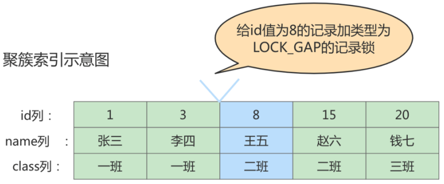

图中id值为8的记录加了gap锁，意味着`不允许别的事务在id值为8的记录前边的间隙插入新记录`，其实就是id列的值(3, 8)这个区间的新记录是不允许其他事务插入的。比如，有另外一个事务再想插入一条id值为4的新记录，它定位到该条新记录的下一条记录的id值为8，而这条记录上又有一个gap锁，所以就会阻塞插入操作，直到拥有这个gap锁的事务提交了之后，id列的值在区间(3, 8)中的新记录才可以被插入。

**gap锁的提出仅仅是为了防止插入幻影记录而提出的**。虽然有`共享gap锁`和`独占gap锁`这样的说法，但是它们起到的作用是相同的。而且如果对一条记录加了gap锁（不论是共享gap锁还是独占gap锁），并不会限制其他事务对这条记录加记录锁或者继续加gap锁。

**举例**：事务1执行 `select * from student where id=5 lock in share mode;`还未提交，此时事务2执行`select * from student where id=5 for update;`。这里事务2并不会阻塞，因为表里并没有id=5这条记录，因此事务1加的是间隙锁(3,8)，而事务2也是在这个间隙加的间隙锁。虽然它们一个是共享锁、一个是独占锁，但它们有共同的目标，即：保护这个间隙、不允许其他事务插入值，所以它们是不冲突的。

**注意**：给一条记录加gap锁只是不允许其他事务往这条记录前面的间隙插入新纪录，那么对于最后一条记录之后的间隙该怎么办呢？也就是说，如何阻止其他事务插入id值大于20的新纪录？这时，我们在讲数据页时介绍的两条伪记录就派上用场了：

* `Infimum`记录，表示该页面中最小的记录。
* `Supremun`记录，表示该页面中最大的记录。

为了实现阻止其他事务插入id值在(20,正无穷)这个区间的新记录，我们可以给索引中的最后一条记录(即id值为20的那条记录)所在页面的Supremun记录加上一个gap锁，如图所示。


如下操作即可：
```sql
# 这样就可以阻止其他事务插入id值在(20,正无穷)这个区间的新记录
mysql> select * from student where id > 20 lock in share mode;
Empty set (0.01 sec)
```

间隙锁的引入，可能会导致同样的语句锁住更大的范围，这其实是影响了并发度的。如下的例子**就会产生死锁**：

```sql
1. 事务1查询id为5的记录(for update)，加上间隙锁(3,8)
2. 事务2查询id为5的记录(for update)，间隙锁之间不会冲突，所以同样加上了间隙锁(3,8)
3. 事务2试图插入一条id=5的记录，但被事务1的间隙锁阻塞了
4. 事务1试图插入一条id=5的记录，但被事务2的间隙锁阻塞了。从而产生了死锁。
# 当然InnoDB的死锁检测会立即发现这对死锁关系，比如可以让事务1的insert语句报错返回。
```

##### 3、临键锁（Next-Key Locks）

有时候我们既想`锁住某条记录`，又想`阻止其他事务在该记录前边的间隙插入新记录`，所以InnoDB就提出了一种称之为Next-Key Locks的锁，官方的类型名称为 `LOCK_ORDINARY`，我们也可以简称为next-key锁。Next-Key Locks是在存储引擎 `innodb` 、事务级别在 `可重复读` 的情况下使用的数据库锁，**innodb默认的锁就是Next-Key Locks**。比如，我们把id值为8的那条记录加一个next-key锁的示意图如下：

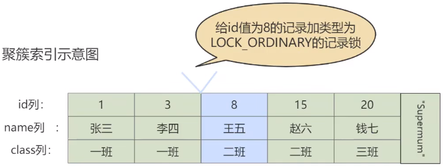

`next-key锁`的本质就是一个`记录锁`和一个`gap锁`的合体，它既能保护该条记录，又能阻止别的事务将新记录插入被保护记录前边的`间隙`。

```sql
begin;
select * from student where id <=8 and id > 3 for update;
```
如上，其实就是给id=8的记录加了一个临键锁，等效于一个(3,8)的间隙锁和一个id=8的记录锁。

##### 4、插入意向锁（Insert Intention Locks）

在一个事务插入一条记录时，需要判断插入位置是不是被别的事务加了gap锁，如果有的话，该插入操作就需要等待。**InnoDB规定事务在插入等待的时候也需要在内存中生成一个锁结构**，表明该事务想在某个间隙中插入新记录，但是现在正在等待，这种类型的锁就是Insert Intention Locks，官方的类型名称为`LOCK_INSERT_INTENTION`，我们称之为`插入意向锁`。注意，插入意向锁是一种`gap锁`，在insert操作时产生，并不是意向锁。

插入意向锁是在插入一条记录行前，**由INSERT操作产生的一种间隙锁**，用于表明插入意向。多个事务在同一间隙(gap)插入数据时，只要插入的位置不同(比如一个插入id=5，一个插入id=6)，事务之间就无需互相等待。

总结：
- 插入意向锁是一种`特殊的间隙锁`(间隙锁可以锁定开区间内的记录)
- 插入意向锁之间`互不排斥`：即使多个事务在同一间隙插入多条记录，只要记录本身(主键、唯一索引)不冲突，那么事务之间就不会出现冲突等待。

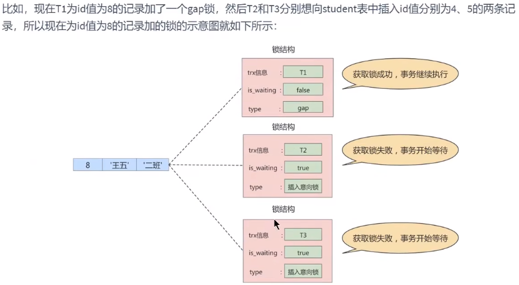

从图中可以看到，由于T1持有gap锁，所以T2和T3需要生成一个插入意向锁的锁结构并处于等待状态。当T1提交并释放锁后，T2和T3就能获取对应的插入意向锁了(即is_waiting属性改为false)，且它们之间也并不会相互阻塞。

#### 3.2.3 页锁

页锁就是在 `页的粒度` 上进行锁定，锁定的记录数比行锁要多，因为一个页中可以有多个行记录。当我们使用页锁的时候，会出现数据浪费的现象，但这样的浪费最多也就是一个页上的数据行。**页锁的开销介于表锁和行锁之间，会出现死锁，并发度一般。**

**锁升级**：

每个层级的锁数量是有限制的，因为锁会占用内存空间，`锁空间的大小是有限的`。当某个层级的锁数量超过了这个层级的阈值时，就会进行`锁升级`。**锁升级就是用更大粒度的锁替代多个更小粒度的锁**，比如 InnoDB 中行锁升级为表锁，这样做的好处是占用的锁空间降低了，但同时数据的并发度也下降了。

### 3.3 从对待锁的态度划分：乐观锁、悲观锁

从对待锁的态度来看锁的话，可以将锁分成乐观锁和悲观锁，从名字中也可以看出这两种锁是两种看待`数据并发的思维方式`。需要注意的是，乐观锁和悲观锁并不是锁，而是锁的`设计思想`。

#### 3.3.1 悲观锁（Pessimistic Locking）

**悲观锁总是假设最坏的情况，每次去拿数据的时候都认为别人会修改，所以每次在拿数据的时候都会上锁**。比如行锁，表锁等，都是在做操作之前先上锁，当其他线程想要访问数据时，都需要阻塞挂起。Java中 `synchronized` 和 `ReentrantLock` 等独占锁就是悲观锁思想的实现。

例如`select price from items where id = 1001 for update;`就是MySQL中悲观锁的一种使用方式。

- 注1：此时其他事务执行`select price from items where id = 1001 for update;`会被阻塞，但执行`select price from items where id = 1001;`不会受影响，因为普通的select语句不使用锁。
- 注2：`select ... for update`语句执行过程中所有扫描的行都会被锁上，所以必须确保过滤条件使用了索引，否则全表扫描就会把整个表锁住。

悲观锁依靠数据库的锁机制实现，对数据库性能开销影响很大，所以不适用的场景比较多。

#### 3.3.2 乐观锁（Optimistic Locking）

乐观锁认为对同一数据的并发操作不会总发生，属于小概率事件，不用每次都对数据上锁，但是在更新的时候会判断一下在此期间别人有没有去更新这个数据，也就是**不采用数据库自身的锁机制，而是通过程序来实现**。在程序上，我们可以采用 `版本号机制` 或者 `CAS机制` 实现。**乐观锁适用于多读的应用类型， 这样可以提高吞吐量**。在Java中` java.util.concurrent.atomic` 包下的原子变量类就是使用了乐观锁的一种实现方式：CAS实现的。

**1. 乐观锁的版本号机制**

在表中设计一个 `版本字段 version` ，第一次读的时候，会获取 version 字段的取值。然后对数据进行更新或删除操作时，会执行 `UPDATE ... SET version=version+1 WHERE version=#{version}`，其中`#{version}`是MyBatis中sql语句的占位符赋值。此时如果已经有事务对这条数据进行了更改，修改就不会成功。

这种方式类似我们熟悉的SVN、CVS版本管理系统，当我们修改了代码进行提交时，首先会检查当前版本号与服务器上的版本号是否一致，如果一致就可以直接提交，如果不一致就需要更新服务器上的最新代码，然后再进行提交。

**2. 乐观锁的时间戳机制**

时间戳和版本号机制一样，也是在更新提交的时候，将当前数据的时间戳和更新之前取得的时间戳进行比较，如果两者一致则更新成功，否则就是版本冲突。

你能看到乐观锁就是程序员自己控制数据并发操作的权限，基本是通过给数据行增加一个戳（版本号或者时间戳），从而证明当前拿到的数据是否最新。

#### 3.3.3 两种锁的适用场景

1. `乐观锁`适合`读操作多`的场景，它的优点在于 `程序实现`，`不存在死锁`问题。
2. `悲观锁`适合`写操作多`的场景，因为写的操作具有`排它性`。采用悲观锁的方式，可以在数据库层面阻止其他事务对该数据的操作权限，防止`读-写`和`写-写`的冲突。

### 3.4 按加锁的方式划分：显式锁、隐式锁

#### 3.4.1 隐式锁

如果一个事务INSERT成功插入一条记录，而另一个事务立即访问该记录(获取其X锁或S锁)，那么如果没有任何措施，就会发生`脏写`或`脏读`，此时，我们之前提及的`事务id`就起作用了：

**情景一**：对于聚簇索引记录来说，有一个`trx_id`隐藏列，该隐藏列记录着最后改动该记录的`事务id`。于是其他事务(记为事务2)想对该记录添加S锁或者X锁时，首先会看一下该记录的trx_id隐藏列代表的事务是否是当前的某个活跃事务(记为事务1)，**如果是的话，那么就帮助当前事务(事务1)创建一个X锁（is_waiting属性是false），然后也为自己(事务2)创建一个锁结构（is_waiting属性是true）进入等待状态**。

**情景二**：对于二级索引记录来说，本身并没有trx_id隐藏列，但是在二级索引页面的Page Header部分有一个`PAGE_MAX_TRX_ID`属性，该属性代表对该页面做改动的最大的`事务id`，如果 `PAGE_MAX_TRX_ID` 属性值小于当前最小的活跃事务id，那么说明对该页面做修改的事务都已经提交了，否则就需要在页面中定位到对应的二级索引记录，然后回表找到它对应的聚簇索引记录，然后再重复`情景一`的做法。

**总结**：一个事务对新插入的记录可以不显式地加锁(即不生成一个锁结构)，但**由于`事务id`的存在，就相当于给这条记录加了个`隐式锁`**。别的事务在对这条记录加S锁或者X锁时，由于这条记录有隐式锁(即根据trx_id判断是某个活跃的事务)，此时就会先帮助对应事务生成一个锁结构(生成了`显式锁`)，然后自己再生成一个锁结构(同样又生成一个`显式锁`)并进入等待状态。因此，隐式锁是一种`延迟加锁`的机制，从而减少加锁的数量。**综上，`隐式锁`在实际内存对象中并不含有这个锁信息，只有当别的事务对该记录加锁时，才会转化为`显式锁`**。

#### 3.4.2 显式锁

只要在内存中有锁结构的，都称之为显式锁。

### 3.5 其它：全局锁

全局锁就是对 `整个数据库实例` 加锁。当你需要让整个库处于 `只读状态` 的时候，可以使用这个命令，之后其他线程的以下语句会被阻塞：数据更新语句（数据的增删改）、数据定义语句（包括建表、修改表结构等）和更新类事务的提交语句。全局锁的典型使用`场景`是做`全库逻辑备份`。

全局锁的命令：

```sql
Flush tables with read lock
```

### 3.6 其它：死锁

#### 3.6.1 概念

两个事务都持有对方需要的锁，并且在等待对方释放，并且双方都不会释放自己的锁。

**举例：**

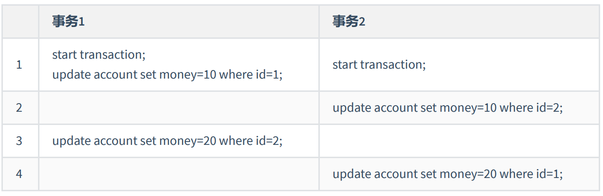

#### 3.6.2 产生死锁的必要条件

1. 两个或者两个以上事务
2. 每个事务都已经持有锁并且申请新的锁
3. 锁资源同时只能被同一个事务持有或者不兼容
4. 事务之间因为持有锁和申请锁导致彼此循环等待

> 死锁的关键在于：两个（或以上）的Session加锁的顺序不一致。

#### 3.6.3 如何处理死锁

**方式1**：等待直到超时(`innodb_lock_wait_timeout=50s`)，即当两个事务互相等待时，当一个事务等待时间超过设置的阈值时，就将其`回滚`，另一个事务继续执行。缺点：这个时间过长，如果改短一点，容易误伤到普通的锁等待。

**方式2**：使用死锁检测处理死锁程序

方式1检测死锁太过被动，innodb还提供了`wait-for graph算法`来主动进行死锁检测，每当加锁请求无法立即满足需要并进入等待时，wait-for graph算法都会被触发。

这是一种较为`主动的死锁检测机制`，要求数据库保存`锁的信息链表`和`事务等待链表`两部分信息。基于这两个信息，可以绘制wait-for graph（等待图）。

> 死锁检测的原理是构建一个以事务为顶点，锁为边的有向图，判断有向图是否存在环，存在既有死锁。

一旦检测到回路，即有死锁，这时候InnoDB存储引擎会选择`回滚undo量最小的事务`，让其他事务继续执行（`innodb_deadlock_detect=on`表示开启这个逻辑）。

缺点：每个新的被阻塞的线程，都要判断是不是由于自己的加入导致了死锁，这个操作时间复杂度是O(n)。

**如何解决？**

* 方式1：关闭死锁检测，但意味着可能会出现大量的超时，会导致业务有损。
* 方式2：控制并发访问的数量。比如在中间件中实现对于相同行的更新，在进入引擎之前排队，这样在InnoDB内部就不会有大量的死锁检测工作。

#### 3.6.4 如何避免死锁

- 合理设计索引，使业务SQL尽可能通过索引定位更少的行，减少锁竞争
- 调整业务逻辑SQL执行顺序，避免update/delete长时间持有锁的SQL在事务前面
- 避免大事务，尽量将大事务拆成多个小事务来处理
- 在并发比较高的系统中，不要显式加锁
- 降低隔离级别(如果业务允许的话)，比如将隔离级别从RR调整为RC，可以避免掉很多因为gap锁造成的死锁


## 4. 锁监控

关于MySQL锁的监控，我们一般可以通过检查 InnoDB_row_lock 等状态变量来分析系统上的行锁的争夺情况

```sql
mysql> show status like 'innodb_row_lock%';
+-------------------------------+-------+
| Variable_name                 | Value |
+-------------------------------+-------+
| Innodb_row_lock_current_waits | 0     |
| Innodb_row_lock_time          | 0     |
| Innodb_row_lock_time_avg      | 0     |
| Innodb_row_lock_time_max      | 0     |
| Innodb_row_lock_waits         | 0     |
+-------------------------------+-------+
5 rows in set (0.01 sec)
```

对各个状态量的说明如下(加粗的状态量比较重要)：

* Innodb_row_lock_current_waits：当前正在等待锁定的数量
* **Innodb_row_lock_time** ：从系统启动到现在锁定总时间长度（等待总时长） 
* **Innodb_row_lock_time_avg** ：每次等待所花平均时间（等待平均时长） 
* Innodb_row_lock_time_max：从系统启动到现在等待最长的一次所花的时间；
* **Innodb_row_lock_waits** ：系统启动后到现在总共等待的次数（等待总次数）


# 第16章_多版本并发控制

## 1. 什么是MVCC

MVCC（Multiversion Concurrency Control），多版本并发控制。顾名思义，MVCC 是通过数据行的多个版本管理来实现数据库的`并发控制`。这项技术使得在InnoDB的事务隔离级别下执行`一致性读`操作有了保证。

MVCC没有正式的标准，在不同的DBMS中MVCC的实现方式可能是不同的，也不是普遍使用的。这里讲解InnoDB中MVCC的实现机制（MySQL其他的存储引擎并不支持它）。

通过MVCC，我们可以：

1. 解决读写之间阻塞的问题。通过MVCC可以让读不阻塞写，写不阻塞读，这样就可以提升事务并发处理能力。
2. 降低了死锁的概率。这是因为MVCC采用了乐观锁的方式，读取数据时并不需要加锁，对于写操作，也只锁定必要的行。
3. 解决快照读的问题。

## 2. 快照读与当前读

MVCC在MySQL InnoDB中的实现主要是为了提高数据库并发性能，用更好的方式去处理`读-写冲突`，做到即使有读写冲突时，也能做到`不加锁、非阻塞并发读`，而这个读指的就是`快照读`、而非`当前读`。当前读实际上是一种加锁的操作，是悲观锁的实现。而MVCC本质是采用**乐观锁**思想的一种方式。

### 2.1 快照读

快照读又叫一致性读，读取的是快照数据。**不加锁的普通SELECT属于快照读**，即不加锁的非阻塞读。

之所以出现快照读的情况，是基于提高并发性能的考虑，快照读的实现是基于MVCC，它在很多情况下，避免了加锁操作，降低了开销。

既然是基于多版本，那么快照读可能读到的并不一定是数据的最新版本，而有可能是之前的历史版本。 

快照读的前提是隔离级别不是串行级别，串行级的快照读会退化成当前读。

### 2.2 当前读

当前读读取的是记录的最新版本，读取时还要保证其他并发事务不能修改当前记录，所以会对读取的记录进行加锁。加锁的SELECT，或者对数据进行增删改都会进行当前读。

## 3. MVCC实现原理

在MySQL中，默认的隔离级别是`可重复读`，这个隔离级别可以解决`脏读`和`不可重复读`的并发问题，但是一般无法解决`幻读`的问题，而MySQL中InnoDB引擎使用MVCC可以在这一级别下解决`幻读`的问题。

MVCC可以不采用锁机制，而是通过乐观锁的方式来解决不可重复度和幻读的问题，降低系统的开销。

**MVCC的实现依赖于**：`隐藏字段`、`Undo Log`、`ReadView`。

### 3.1 隐藏字段、Undo Log版本链

对于使用 InnoDB 存储引擎的表来说，它的聚簇索引记录中都包含两个必要的隐藏列：

* `trx_id`：每次一个事务对某条聚簇索引记录进行改动时，都会把该事务的`事务id`赋值给`trx_id`隐藏列。 
* `roll_pointer`：每次对某条聚簇索引记录进行改动时，都会把旧的版本写入到`undo日志`中，然后这个隐藏列就相当于一个指针，可以通过它来找到该记录修改前的信息。

每次对记录进行改动，都会将旧值放到一条undo日志中(表示该记录的一个旧版本)，每条undo日志也都有一个`roll_pointer`属性，将这些`undo日志`都连起来就串成一个链表，称之为`版本链`(版本链的头节点就是当前记录最新的值，每个版本中还包含生成该版本时对应的`事务id`)：


### 3.2 ReadView简介

**ReadView就是事务在使用MVCC机制进行快照读操作时产生的读视图**。当事务启动时，会生成数据库系统当前的一个快照，InnoDB为每个事务构造了一个数组，用于记录并维护系统当前`活跃事务的id`(活跃事务指的是开启了但还未提交的事务)。

`READ UNCOMMITTED`和`SERIALIZABLE`隔离级别的事务，无需用到ReadView，因为：

- 使用 `READ UNCOMMITTED` 隔离级别的事务，由于可以读到未提交事务修改过的记录，所以直接读取记录的最新版本就好了。
- 使用 `SERIALIZABLE` 隔离级别的事务，InnoDB规定使用加锁的方式来访问记录。

使用`READ COMMITTED`和`REPEATABLE READ`隔离级别的事务，都必须保证读到`已经提交了的`事务修改过的记录。假如另一个事务已经修改了记录但是尚未提交，是不能直接读取最新版本的记录的，所以核心问题就是需要判断一下版本链中的哪个版本是当前事务可见的，这是ReadView要解决的主要问题。

这个ReadView中主要包含4个比较重要的内容，分别如下：

1. `creator_trx_id`：创建这个ReadView的事务ID
   
   > 说明：在一个事务中，只有第一次在对表中的记录做改动时（如执行INSERT、DELETE、UPDATE这些语句时）才会为事务分配事务id（从1开始递增），否则一个只读事务的事务id默认为0。

2. `trx_ids`：表示在生成ReadView时当前系统中活跃的事务的`事务id列表`
3. `up_limit_id`：活跃的事务中最小的事务ID
4. `low_limit_id`：表示生成ReadView时系统中应该分配给下一个事务的id值。即low_limit_id是系统最大的事务id值加1(因为事务id是递增分配的)，这里要注意是系统中的事务id，并不是活跃的事务id。

> 注意：low_limit_id并不是trx_ids中的最大值加1。例如，现在有id为1、2、3这三个事务，之后id为3的事务提交了。那么此时一个事务在生成ReadView时，trx_ids就包括1和2，up_limit_id的值就是1，low_limit_id的值就是4。

### 3.3 ReadView的规则

有了这个ReadView，这样在访问某条记录时，只需要按照下边的步骤判断记录的某个版本是否可见：

* 如果被访问版本的trx_id属性值与ReadView中的 creator_trx_id 值相同，意味着当前事务在访问它自己修改过的记录，所以该版本可以被当前事务访问。 
* 如果被访问版本的trx_id属性值小于ReadView中的 up_limit_id 值，表明生成该版本的事务在当前事务生成ReadView前已经提交，所以该版本可以被当前事务访问。 
* 如果被访问版本的trx_id属性值大于或等于ReadView中的 low_limit_id 值，表明生成该版本的事务在当前事务生成ReadView后才开启，所以该版本不可以被当前事务访问。 
* 如果被访问版本的trx_id属性值属于ReadView的 `[up_limit_id, low_limit_id)` 区间，那就需要判断一下trx_id属性值是不是在 trx_ids 列表中：
  * 如果在，说明创建ReadView时生成该版本的事务还是活跃的，该版本不可以被访问。 
  * 如果不在，说明创建ReadView时生成该版本的事务已经被提交，该版本可以被访问。

### 3.4 MVCC整体操作流程

了解了这些概念之后，我们来看下当查询一条记录的时候，系统如何通过MVCC找到它：

1. 首先获取自己的事务id，然后获取ReadView； 
2. 查询得到的记录，根据其trx_id属性，按ReadView的规则进行比较；
3. 如果该记录的版本不可访问，则根据roll_pointer指针找到前一个版本的记录，以此类推，继续按ReadView的规则进行比较； 
4. 最后返回可以访问的版本的记录。如果顺着版本链查找的所有版本都不可访问，就意味着这条记录对该事务完全不可见，查询结果就不包含该记录。

> 小结：InnoDB中，MVCC是通过Undo Log和ReadView进行数据读取，Undo Log保存了历史快照，而ReadView规则帮我们判断当前版本的数据是否可见。

**（1）在隔离级别为`读已提交`时，一个事务中的每一次SELECT查询都会重新生成一次ReadView**。

> 注意，此时同样的查询语句都会重新获取一次 Read View，这时如果 Read View 不同，就可能产生不可重复读或者幻读的情况。

**（2）在隔离级别为`可重复读`时，一个事务只在第一次SELECT时会生成一次ReadView，而后面所有的SELECT都会复用这个ReadView**。

> 注意，这样的方案就解决了不可重复读的问题，并在`读`层面上解决了幻读的问题。

## 4. 举例

假设现在student表中只有一条由`事务id=8`的事务插入的记录：`id=1, name='张三', class='一班'`，并且该事务已经提交。

由于MVCC只能在`READ COMMITTED`和`REPEATABLE READ`两个隔离级别下工作，我们接下来分别看看这两个隔离级别生成ReadView的不同：

### 4.1 READ COMMITTED隔离级别下

假设有以下两个事务正在执行：

```sql
# 事务id=10
BEGIN;
UPDATE student SET name="李四" WHERE id=1;
UPDATE student SET name="王五" WHERE id=1;
```

```sql
# 事务id=20
BEGIN;
```

此刻，表student中id=1的记录的版本链如下：


假设现在有一个使用 `READ COMMITTED` 隔离级别的事务开始执行：

```sql
# 使用READ COMMITTED隔离级别的事务
BEGIN;
# SELECT1：Transaction 10、20未提交
SELECT * FROM student WHERE id = 1; # 得到的列name的值为'张三'
```

上述`SELECT1`的执行过程如下：

1. 在执行`SELECT`语句时会先生成一个ReadView，其 `trx_ids=[10,20]` ， `up_limit_id=10` ， `low_limit_id=21` ， `creator_trx_id=0` 。
2. 从版本链中挑选可见的记录，由于第一条`name='王五'`的记录中`trx_id=10`，在`trx_ids`列表内，所以不可访问，根据`roll_pointer`查找前一个版本的记录。
3. 同理，`name='李四'`的记录中`trx_id=10`，也在`trx_ids`列表内，不可访问，继续查找前一个版本。
4. `name='张三'`的记录中`trx_id=8`，小于`up_limit_id`的值，按规则是可以访问的，所以最终返回给用户的记录就是这个版本的。

之后，我们把`事务id=10`的事务提交，然后再到`事务id=20`的事务中做如下操作：

```sql
# 事务id=20，尚未提交
UPDATE student SET name="钱七" WHERE id=1;
UPDATE student SET name="宋八" WHERE id=1;
```

此刻，表student中 `id` 为 `1` 的记录的版本链就长这样：


然后再到刚才使用 `READ COMMITTED` 隔离级别的事务中继续查找这个 id 为 1 的记录，如下：

```sql
# SELECT2：Transaction 10提交，Transaction 20未提交
SELECT * FROM student WHERE id = 1; # 得到的列name的值为'王五'
```

上述`SELECT2`的执行过程如下：

1. 由于隔离级别是`READ COMMITTED`，所以在执行该`SELECT`语句时又会生成一个新的ReadView，其 `trx_ids=[20]` ， `up_limit_id=20` ， `low_limit_id=21` ， `creator_trx_id=0` 。
2. 从版本链中挑选可见的记录，前两条`trx_id=20`的都不可见。而`name='王五'`的记录中`trx_id=10`，是可见的，所以返回这条记录。


> 强调：使用READ COMMITTED隔离级别的事务在每次查询开始时都会生成一个新的ReadView。

### 4.2 REPEATABLE READ隔离级别下

流程与上一小节相同，只不过换了隔离级别，我们只分析上述`SELECT1`和`SELECT2`的执行过程。

`SELECT1`的过程与上一小节相同，生成了一个ReadView，其 `trx_ids=[10,20]` ， `up_limit_id=10` ， `low_limit_id=21` ， `creator_trx_id=0` ，最终查找版本链后返回的记录也是`name='张三'`的版本。

`SELECT2`的执行过程如下：

1. 由于隔离级别是`REPEATABLE READ`，所以直接复用上述SELECT1时生成的ReadView。
2. 从版本链中挑选可见的记录，前两条`trx_id=20`的都不可见。而第三、第四条`name='王五'`和`name='李四'`的记录中`trx_id=10`，同样在`trx_ids`列表中，所以依然不可见。继续查找，最终返回的记录是`name='张三'`的版本。

### 4.3 REPEATABLE READ解决幻读的案例

重新假设现在表student中只有一条数据，数据内容中：主键 id=1，普通字段name='张三'，隐藏的trx_id=10。

假设现在有事务A和事务B并发执行，事务A的事务id=20，事务B的事务id=30。

**步骤1**：事务A开始第一次查询数据(假设之前做了一些无关紧要的增删改，从而才使得事务id=20，因为事务id是在第一次对表做更改时才分配的)

```sql
select * from student where id >= 1;
```

在开始查询之前，MySQL会为事务A产生一个ReadView，此时 ReadView的内容如下：`trx_ids= [20,30]，up_limit_id=20，low_limit_id=31，creator_trx_id=20`。

由于此时表 student 中只有一条数据，且符合 `where id>=1` 条件，因此会查询出来。然后根据 ReadView 机制，发现该行数据的trx_id=10，小于事务A的ReadView里的up_limit_id，表示这条数据是事务A开启之前，其他事务就已经提交了的数据，因此事务A可以读取到。

**步骤2**：接着事务B(trx_id=30)，往表 student 中新插入两条数据，并提交事务。

```sql
insert into student(id,name) values(2,'李四');
insert into student(id,name) values(3,'王五');
```

此时表student中就有三条数据了，对应的 undo 如下图所示：

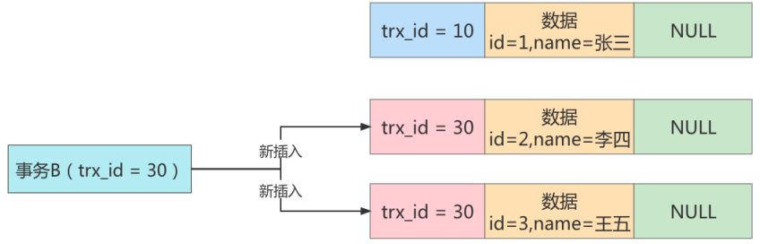

**步骤3**：接着事务A开启第二次查询，根据可重复读隔离级别的规则，此时事务A并不会再重新生成ReadView。此时表 student 中的3条数据都满足 `where id>=1` 的条件，因此会先查出来，然后根据 ReadView 机制，判断每条数据是不是都可以被事务A看到：

- 首先 id=1 的这条数据，前面已经说过了，可以被事务 A 看到。 
- 然后是 id=2 的数据，它的 trx_id=30，此时事务A发现，这个值在`trx_ids=[20,30]`数组中，这表示 id=2 的这条数据是与事务A在同一时刻活跃的其他事务提交的，所以这条数据对A不可见。
- 同理，id=3 的这条数据也对A不可见。

**结论**：最终事务A的第二次查询，只能查询出 id=1 的这条数据。这和事务A的第一次查询的结果是一样的，因此可以认为没有出现幻读现象，所以说在 MySQL 的可重复读隔离级别下基本解决了幻读问题(但实际上没有完全解决，因为只是从`读`的层面保证了读取的结果集不变，但是`写`的层面并没有保证)。
