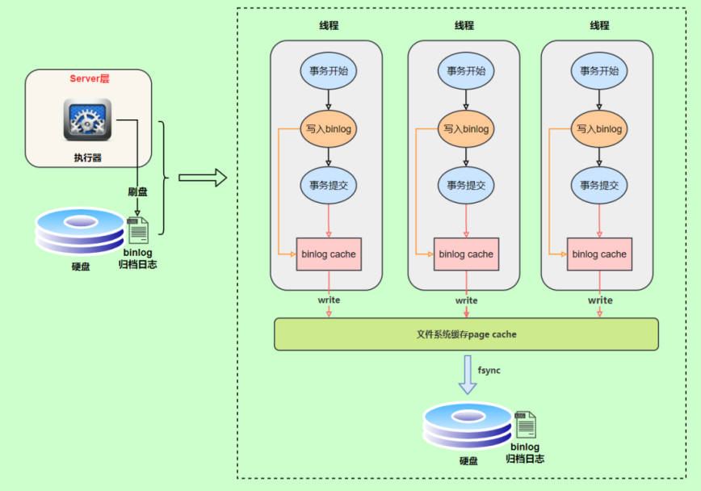
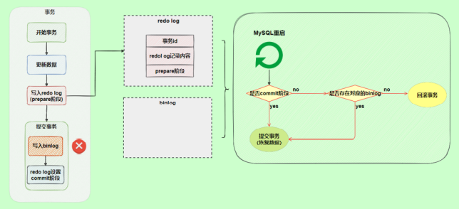
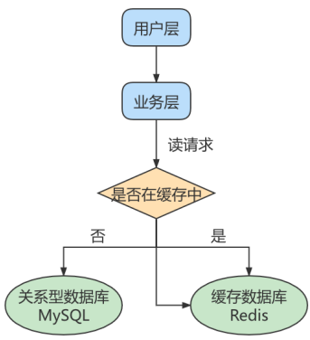
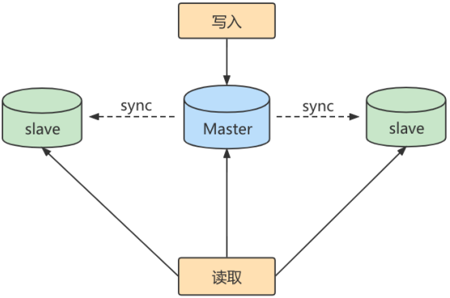
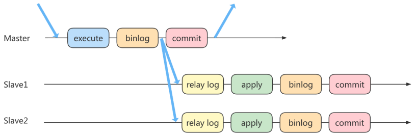
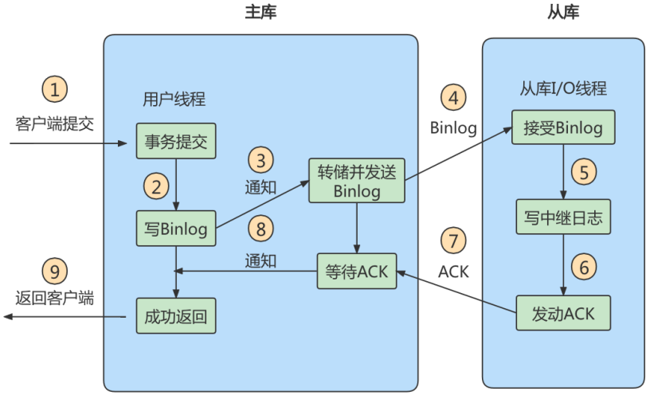
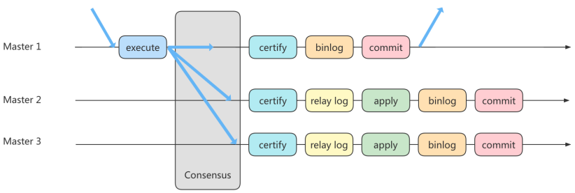
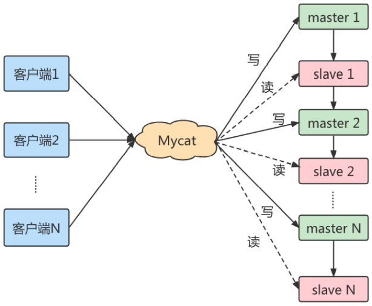

# 第17章_其他数据库日志

## 1. MySQL支持的日志

### 1.1 日志类型

在数据库事务中，我们讲过`重做日志`和`回滚日志`。除此之外，MySQL还有其他不同类型的日志文件：

* `慢查询日志`：记录所有**执行时间超过long_query_time的所有查询**，方便我们对查询进行优化。 
* `通用查询日志`：记录所有连接的起始时间和终止时间，以及连接发送给数据库服务器的所有指令，对我们复原操作的实际场景、发现问题，甚至是对数据库操作的审计都有很大的帮助。 
* `错误日志`：记录MySQL服务的启动、运行或停止MySQL服务时**出现的问题**，方便我们了解服务器的状态，从而对服务器进行维护。 
* `二进制日志`：记录所有**更改数据**的语句，可以**用于主从服务器之间的数据同步**，以及服务器遇到故障时数据的无损失恢复。 
* `中继日志`：用于主从服务器架构中，**从服务器用来存放主服务器二进制日志内容的一个中间文件**。从服务器通过读取中继日志的内容，来同步主服务器上的操作。 
* `数据定义语句日志`：记录数据定义语句执行的元数据操作。

默认情况下，所有日志创建于`MySQL数据目录`中。

### 1.2 日志的弊端

* 日志功能会`降低MySQL数据库的性能`。
* 日志会`占用大量的磁盘空间`。

## 2. 慢查询日志(slow query log)

见第9章。

## 3. 通用查询日志(general query log)

### 3.1 简介

通用查询日志用来`记录用户的所有操作`，包括启动和关闭MySQL服务、所有用户的连接开始时间和截止时间、发给 MySQL 数据库服务器的所有 SQL 指令等。当我们的数据发生异常时，**查看通用查询日志，还原操作时的具体场景**，可以帮助我们准确定位问题。

通用查询日志是以 `文本文件` 的形式存储在文件系统中的，可以使用 `文本编辑器` 直接打开日志文件。

### 3.2 开启方式

通用查询日志`默认是关闭的`，开启方式如下：

**方式1：永久性方式**

修改my.cnf或者my.ini配置文件来设置。在`[mysqld]`组下加入log选项，并重启MySQL服务。格式如下：

```properties
[mysqld]
general_log=ON
general_log_file=[path[filename]] #日志文件所在目录路径，filename为日志文件
```

如果不指定目录和文件名，通用查询日志将默认存储在MySQL数据目录中的hostname.log文件中，hostname表示主机名。

**方式2：临时性方式**

```sql
SET GLOBAL general_log=on; # 开启通用查询日志
```

```sql
SET GLOBAL general_log_file=’path/filename’; # 设置日志文件保存位置
```

## 4. 错误日志(error log)

通过错误日志可以查看系统的运行状态，便于及时发现故障、恢复故障。

在MySQL数据库中，错误日志功能是`默认开启`的。而且，错误日志`无法被禁止`。默认情况下，错误日志存储在MySQL数据库的数据文件夹下，名称默认为`mysqld.log`（Linux系统）。

MySQL错误日志是以文本文件形式存储的，可以使用文本编辑器直接查看。

> 小结：
>
> 通常情况下，管理员不需要查看错误日志。但是，MySQL服务器发生异常时，管理员可以从错误日志中找到发生异常的时间、原因，然后根据这些信息来解决异常。

## 5. 二进制日志(bin log)

### 5.1 简介

binlog即binary log，二进制日志文件，也叫作变更日志（update log）。它记录了数据库所有执行的`DDL`和`DML`等数据库更新事件的语句，但是不包含没有修改任何数据的语句（如数据查询语句select、show等）。以`事件形式`记录并保存在`二进制文件`中。

**binlog主要应用场景**：

- 一是用于`数据恢复`：如果MySQL数据库宕机，可以通过二进制日志文件来查看用户的操作和修改，然后根据记录恢复数据库服务器
- 二是用于`数据复制`：由于日志的延续性和时效性，master把它的二进制日志传递给slaves来达到master-slave数据一致的目的。

### 5.2 查看日志

MySQL8中二进制日志是`默认开启`的。当MySQL创建二进制日志文件时，先创建一个以"filename"为名称、以".index"为后缀的文件，再创建一个以"filename"为名称、以".000001"为后缀的文件。MySQL服务 `重新启动一次` ，以".000001"为后缀的文件就会增加一个，并且后缀名递增1，即日志文件的个数与MySQL服务启动的次数相同。如果日志长度超过了 `max_binlog_size` 的上限（默认是1GB），就会创建一个新的日志文件。

binlog是二进制文件，无法直接查看，想要更直观的观测它就要借助`mysqlbinlog`命令工具了。指令如下(不是在MySQL中执行的命令)：

```shell
mysqlbinlog -v "/var/lib/mysql/binlog/atguigu-bin.000002"
```

上面这种办法读取出binlog日志的全文内容比较多，不容易分辨查看到pos点信息，下面介绍一种更为方便的查询命令(MySQL中执行的命令)：

```sql
mysql> show binlog events [IN 'log_name'] [FROM pos] [LIMIT [offset,] row_count];
```

* `IN 'log_name'` ：指定要查询的binlog文件名（不指定就是第一个binlog文件）　 
* `FROM pos` ：指定从哪个pos起始点开始查起（不指定就是从整个文件首个pos点开始算） 
* `LIMIT [offset]` ：偏移量(不指定就是0) 
* `row_count` : 查询总条数（不指定就是所有行）


上面我们讲了这么多都是基于binlog的Row格式，除此之外，binlog还有2种格式，分别是`Statement`和`Mixed`：

**STATEMENT模式**(基于SQL语句的复制,SBR)：这是默认的binlog格式，每一条会修改数据的sql语句会记录到binlog中。
- 优点：不需要记录每一行的变化，减少了binlog日志量，文件较小，节约了IO、提高性能
- 缺点：不是所有的UPDATE语句都能被复制，尤其是包含不确定操作的时候，例如有关UUID()等函数

**ROW模式**(基于行的复制,RBR)：不记录每条sql语句的上下文信息，仅记录哪条数据被修改了，修改成什么样了。
- 优点：任何情况都可以被复制，这对复制来说是最 `安全可靠` 的。
- 缺点：binlog 大了很多，且无法从 binlog 中看到都复制了些什么语句

**MIXED模式**(混合模式复制,MBR)：实际上就是Statement与Row的结合。在Mixed模式下，一般的语句修改使用statment格式保存binlog。而对于一些函数，statement无法完成主从复制的操作，则采用row格式保存binlog。

### 5.3 使用日志恢复数据

如果MySQL服务器启用了二进制日志，在数据库出现意外丢失数据时，可以使用MySQLbinlog工具从指定的时间点开始（例如，最后一次备份）直到现在或另一个指定的时间点的日志中回复数据。

mysqlbinlog恢复数据的语法如下：

```sql
mysqlbinlog [option] filename|mysql –uuser -ppass;
```

* `filename`：日志文件名
* `option`：可选项，比较重要的两对option参数如下：
  * `--start-date`和`--stop-date`：可以指定恢复数据库的起始时间点和结束时间点
  * `--start-position`和`--stop-position`：可以指定恢复数据的开始位置和结束位置。

### 5.4 数据复制

如果遇到数据量大、数据库和数据表很多（比如分库分表的应用）的场景，用二进制日志进行数据恢复，是很有挑战性的，因为起止位置不容易管理。

在这种情况下，一个有效的解决办法是 `配置主从数据库服务器` ，甚至是 `一主多从` 的架构，把二进制日志文件的内容通过中继日志，同步到从数据库服务器中，这样就可以有效避免数据库故障导致的数据异常等问题。

## 6. binlog底层原理

### 6.1 写入机制

binlog的写入时机也非常简单，事务执行过程中，先把日志写到`binlog cache`，事务提交的时候，再把binlog cache写到binlog文件中。binlog日志刷盘流程如下：



> * 上图的write，是指把日志写入到文件系统的page cache，并没有把数据持久化到磁盘，所以速度比较快
> * 上图的fsync，才是将数据持久化到磁盘的操作

write和fsync的时机，可以由参数 `sync_binlog` 控制：

- 值为0：这是默认值，表示每次提交事务都只write，由操作系统自行判断什么时候执行fsync。虽然性能得到提升，但是机器宕机，page cache里面的数据会丢失。
- 值为1：表示每次提交事务都会执行fsync，就如同**redo log 刷盘流程**一样，这种方式安全性最高。
- 值为N(N>1)：表示每次提交事务都write，但累积N个事务后才fsync，这是一种折中的方式。在出现IO瓶颈的场景里，将sync_binlog设置成一个比较大的值，可以提升性能。同样的，如果机器宕机，会丢失最近N个事务的binlog日志。

### 6.2 binlog与redolog对比

* redo log是`物理日志`，记录内容是"在某个数据页上做了什么修改"，属于 InnoDB 存储引擎层产生的。
* binlog是`逻辑日志`，记录内容是语句的原始逻辑，类似于"给 ID=2 这一行的 c 字段加 1"，属于MySQL Server层。
* 虽然它们都属于持久化的保证，但是侧重点不同：
  * redo log让InnoDB存储引擎拥有了崩溃恢复能力。
  * binlog保证了MySQL集群架构的数据一致性。

### 6.3 两阶段提交

在执行更新语句过程，会记录redo log与binlog两块日志，以基本的事务为单位，**redo log在事务执行过程中可以不断写入磁盘，而binlog只有在提交事务时才写入磁盘**，所以redo log与binlog的 `写入时机` 不一样。

**如果redo log与binlog两份日志之间的逻辑不一致，会出现问题**。例如执行一条插入的sql语句，在执行过程中写完了redo log，但在写binlog期间发生了异常，重启服务器后，主数据库可以根据redo log来恢复，而binlog中并没有这条插入sql的记录，从而导致从数据库中缺失了这条记录，于是**产生主从数据库中数据不一致的问题**。

为了解决两份日志之间的逻辑一致问题，InnoDB存储引擎使用**两阶段提交**方案。原理很简单，将redo log的写入拆成了两个步骤prepare和commit，这就是**两阶段提交**。


使用两阶段提交后，写入binlog时发生异常也不会有影响，因为MySQL根据redo log日志恢复数据时，发现redo log还处于prepare阶段，并且没有对应binlog日志，就会回滚该事务。



假如redo log在commit阶段发生异常，也不会有影响，并且此时不会回滚事务。它会执行下图框住的逻辑，虽然redo log是处于prepare阶段，但是能通过事务id找到对应的binlog日志，所以MySQL认为是完整的，就会提交事务恢复数据。


## 7. 中继日志(relay log)

**中继日志只在主从服务器架构的从服务器上存在**。从服务器为了与主服务器保持一致，要从主服务器读取二进制日志的内容，并且把读取到的信息写入 `本地的日志文件` 中，这个从服务器本地的日志文件就叫 `中继日志` 。然后，从服务器读取中继日志，并根据中继日志的内容对从服务器的数据进行更新，完成`主从服务器的数据同步`。

搭建好主从服务器之后，中继日志默认会保存在从服务器的数据目录下。文件名的格式是：`从服务器名-relay-bin.序号` 。中继日志还有一个索引文件：`从服务器名-relaybin.index`，用来定位当前正在使用的中继日志。

中继日志与二进制日志的格式相同，可以用 `mysqlbinlog` 工具进行查看。

注意：如果从服务器宕机，有的时候为了系统恢复，要重装操作系统，这样就可能会导致你的 `服务器名称` 与之前不同。而中继日志里是 `包含从服务器名` 的。在这种情况下，就可能导致你恢复从服务器的时候，无法从宕机前的中继日志里读取数据。解决的方法也很简单，把从服务器的名称改回之前的名称即可。

# 第18章_主从复制

## 1. 主从复制概述

### 1.1 如何提升数据库并发能力

在实际工作中，我们常常将`Redis`作为缓存与`MySQL`配合来使用，当有请求的时候，首先会从缓存中进行查找，如果存在就直接取出。如果不存在再访问数据库，这样就`提升了读取的效率`，也减少了对后端数据库的`访问压力`。Redis的缓存架构是`高并发架构`中非常重要的一环。



此外，一般应用对数据库而言都是`读多写少`，也就说对数据库读取数据的压力比较大，有一个思路就是采用数据库集群的方案，做 `主从架构` 、进行 `读写分离` ，这样同样可以提升数据库的并发处理能力。但并不是所有的应用都需要对数据库进行主从架构的设置，毕竟设置架构本身是有成本的。

如果我们的目的在于提升数据库高并发访问的效率，那么首先考虑的是如何 `优化SQL和索引` ，这种方式简单有效；其次才是采用 `缓存的策略` ，比如使用Redis将热点数据保存在内存数据库中，提升读取的效率；最后才是对数据库采用`主从架构`，进行读写分离。

按照上面的方式进行优化，使用和维护的成本是由低到高的。

### 1.2 主从复制的作用

主从同步设计不仅可以提高数据库的吞吐量，还有以下3个方面的作用。

**第1个作用：读写分离**。我们可以通过主从复制的方式来`同步数据`，然后通过读写分离提高数据库并发处理能力。



其中一个是Master主库，负责写入数据，我们称之为：写库。其他都是Slave从库，负责读取数据，我们称之为：读库。当主库进行更新的时候，会自动将数据复制到从库中，而我们在客户端读取数据的时候，会从从库进行读取。

面对`读多写少`的需求，采用读写分离的方式，可以实现`更高的并发访问`。同时，我们还能对从服务器进行`负载均衡`，让不同的读请求按照策略均匀地分发到不同的从服务器上，让`读取更加顺畅`。读取顺畅的另一个原因，就是`减少了锁表`的影响，比如我们让主库负责写，当主库出现写锁的时候，不会影响到从库进行SELECT的读取。

**第2个作用就是数据备份**。我们通过主从复制将主库上的数据复制到从库上，相当于一种`热备份机制`，也就是在主库正常运行的情况下进行的备份，不会影响到服务。

**第3个作用是具有高可用性**。数据备份实际上是一种冗余的机制，通过这种冗余的方式可以换取数据库的高可用性，也就是当服务器出现故障或宕机的情况下，可以切换到从服务器上，保证服务的正常运行。

## 2. 主从复制的原理

`Slave` 会从 `Master` 读取 `binlog` 来进行数据同步。

### 2.1 原理剖析

**三个线程**

实际上主从同步的原理就是基于 binlog 进行数据同步的。在主从复制过程中，会基于 `3个线程` 来操作，一个主库线程，两个从库线程。


`二进制日志转储线程`（Binlog dump thread）是一个主库线程。当从库线程连接的时候，主库可以将二进制日志发送给从库，当主库读取事件（Event）的时候，会在 Binlog 上 `加锁` ，读取完成之后，再将锁释放掉。

`从库 I/O 线程` 会连接到主库，向主库发送请求更新 Binlog。这时从库的 I/O 线程就可以读取到主库的二进制日志转储线程发送的 Binlog 更新部分，并且拷贝到本地的中继日志（Relay log）。

`从库 SQL 线程` 会读取从库中的中继日志，并且执行日志中的事件，将从库中的数据与主库保持同步。

**复制三步骤**

步骤1：`Master`将写操作记录到二进制日志`binlog`。

步骤2：`Slave`将`Master`的binary log events拷贝到它的中继日志`relay log`；

步骤3：`Slave`重做中继日志中的事件，将改变应用到自己的数据库中。

注意：MySQL复制是异步的且串行化的，而且重启后从 `接入点` 开始复制。复制的最大问题是`延时`。

### 2.2 复制的基本原则

* 每个 `Slave` 只有一个 `Master`
* 每个 `Master` 可以有多个 `Slave`

## 3. 同步数据一致性问题

**主从同步的要求：**

* 读库和写库的数据一致(最终一致)； 
* 写数据必须写到写库； 
* 读数据必须到读库(不一定)；

### 3.1 理解主从延迟问题

进行主从同步的内容是二进制日志，它是一个文件，在进行 `网络传输` 的过程中就一定会 `存在主从延迟`（比如 500ms），这样就可能造成用户在从库上读取的数据不是最新的数据，也就是主从同步中的 `数据不一致性` 问题。

### 3.2 主从延迟问题原因

在网络正常的时候，日志从主库传给从库所需的时间是很短的，所以主从延迟的主要来源是从库接收完binlog和执行完这个事务之间的时间差。

**主从延迟最直接的表现是，从库消费中继日志（relay log）的速度，比主库生产binlog的速度要慢**。造成原因：

1. 从库的机器性能比主库要差 
2. 从库的压力大 
3. 大事务的执行，比如一次性用delete删除太多数据、一次性用insert...select插入太多数据、大表DDL等

### 3.3 如何减少主从延迟

1. 降低多线程大事务并发的概率，优化业务逻辑 
2. 优化SQL，避免慢SQL，`减少批量操作`。 
3. `提高从库机器的配置`
4. 尽量采用 `短的链路`，也就是主库和从库服务器的距离尽量要短，减少binlog传输的网络延时。 
5. 实时性要求高的业务读强制走主库，从库只做备份。

### 3.4 如何解决一致性问题

如果操作的数据存储在同一个数据库中，那么对数据进行更新的时候，可以对记录加写锁，这样在读取的时候就不会发生数据不一致的情况。但这时从库的作用就是`备份`，并没有起到`读写分离`，分担主库`读压力`的作用。

读写分离情况下，解决主从同步中数据不一致的问题，就是解决主从之间 `数据复制方式` 的问题，如果按照数据一致性 `从弱到强` 来进行划分，有以下3种复制方式。

#### 方法1：异步复制

异步复制，就是客户端提交 COMMIT 之后不需要等从库返回任何结果，而是直接将结果返回给客户端。

这样做的好处是不会影响主库写的效率，但可能会存在主库宕机，而Binlog还没有同步到从库的情况，也就是此时的主库和从库数据不一致。这时候从从库中选择一个作为新主，那么新主则可能缺少原来主服务器中已提交的事务。所以，这种复制模式下的数据一致性是最弱的。



#### 方法2：半同步复制

半同步复制，就是在客户端提交COMMIT之后不直接将结果返回给客户端，而是等待至少有一个从库接收到了Binlog，并且写入到中继日志中，再返回给客户端。

这样做的好处就是提高了数据的一致性，但相比于异步复制，至少多增加了一个网络连接的延迟。



#### 方法3：组复制

异步复制和半同步复制都无法最终保证数据的一致性问题，半同步复制是通过判断从库响应的个数来决定是否返回给客户端，虽然数据一致性相比于异步复制有提升，但仍然无法满足对数据一致性要求高的场景，比如金融领域。MGR很好地弥补了这两种复制模式的不足。

组复制技术，简称MGR（MySQL Group Replication），是 MySQL 在 5.7.17 版本中推出的一种新的数据复制技术，这种复制技术是基于 Paxos 协议的状态机复制。

**MGR 是如何工作的**

首先我们将多个节点共同组成一个复制组，在 `执行读写（RW）事务` 的时候，需要通过一致性协议层（Consensus 层）的同意，也就是读写事务想要进行提交，必须要经过组里“大多数人”（对应 Node 节点）的同意，大多数指的是同意的节点数量需要大于（N/2+1），这样才可以进行提交，而不是原发起方一个说了算。而针对 `只读（RO）事务` 则不需要经过组内同意，直接 COMMIT 即可。

在一个复制组内有多个节点组成，它们各自维护了自己的数据副本，并且在一致性协议层实现了原子消息和全局有序消息，从而保证组内数据的一致性。



MGR 将 MySQL 带入了数据强一致性的时代，是一个划时代的创新，其中一个重要的原因就是MGR 是基 于 Paxos 协议的。Paxos 算法是由 2013 年的图灵奖获得者 Leslie Lamport 于 1990 年提出的。事实上，Paxos 算法提出来之后就作为 `分布式一致性算法` 被广泛应用，比如 Apache 的 ZooKeeper 也是基于 Paxos 实现的。

## 4. 中间件

在主从架构的配置中，如果想要采取读写分离的策略，我们可以`自己编写程序` ，也可以通过 `第三方的中间件` 来实现。

* 自己编写程序的好处就在于比较自主，我们可以自己判断哪些查询在从库上来执行，针对实时性要求高的需求，我们还可以考虑哪些查询可以在主库上执行。同时，程序直接连接数据库，减少了中间件层，相当于减少了性能损耗。
* 采用中间件的方法有很明显的优势，`功能强大` ， `使用简单` 。但因为在客户端和数据库之间增加了中间件层会有一些 `性能损耗` ，同时商业中间件也是有使用成本的。我们也可以考虑采取一些优秀的开源工具，如Mycat。

`Mycat` 是开源社区在阿里cobar基础上进行二次开发，解决了cobar存在的问题，并且加入了许多新的功能在其中。




# 第19章_数据库备份与恢复

为了有效防止数据丢失，并将损失降到最低，应`定期`对MySQL数据库服务器做`备份`。如果数据库中的数据丢失或者出现错误，可以使用备份的数据`进行恢复`。主从服务器之间的数据同步问题可以通过复制功能实现。

## 1. 物理备份与逻辑备份

**物理备份**：备份数据文件，转储数据库物理文件到某一目录。物理备份恢复速度比较快，但占用空间比较大，MySQL中可以用 `xtrabackup` 工具来进行物理备份。

**逻辑备份**：对数据库对象利用工具进行导出工作，汇总入备份文件内。逻辑备份恢复速度慢，但占用空间小，更灵活。MySQL 中常用的逻辑备份工具为 `mysqldump` 。逻辑备份就是 `备份sql语句` ，在恢复的时候执行备份的sql语句实现数据库数据的重现。

## 2. 逻辑备份：mysqldump

mysqldump是MySQL提供的一个非常有用的数据库备份工具。mysqldump命令执行时，可以将数据库备份成一个`文本文件`，该文件中实际上包含多个`CREATE`和`INSERT`语句，使用这些语句可以重新创建表和插入数据。

需要恢复时，可以使用`mysql命令`来恢复备份的数据。mysql命令可以执行备份文件中的`CREATE语句`和`INSERT语句`。通过CREATE语句来创建数据库和表。通过INSERT语句来插入备份的数据。

## 3. 物理备份：直接复制整个数据库

直接将MySQL中的数据库文件复制出来。这种方法最简单，速度也最快。MySQL的数据库目录位置不一定相同：

* 在Windows平台下，MySQL 8.0存放数据库的目录通常默认为`C:\ProgramData\MySQL\MySQL Server 8.0\Data`或者其他用户自定义目录； 
* 在Linux平台下，数据库目录位置通常为`/var/lib/mysql/`； 