# 第06章_索引的数据结构

## 1. 为什么使用索引

索引是存储引擎用于快速找到数据记录的一种数据结构。MySQL中进行数据查找时，首先查看查询条件是否命中某条索引，符合则`通过索引查找`相关数据，如果不符合则需要`全表扫描`，即需要一条一条地查找记录，直到找到与条件符合的记录。

我们建立索引的目的就是为了`减少磁盘I/O的次数`，加快查询速率。

## 2. 索引及其优缺点

### 2.1 索引概述

**索引的定义**：索引（Index）是帮助MySQL高效获取数据的数据结构。

**索引的本质**：索引是数据结构。

`索引是在存储引擎中实现的`，因此每种存储引擎的索引不一定完全相同，并且每种存储引擎不一定支持所有索引类型。

### 2.2 优点

（1）提高数据检索的效率，降低**数据库的IO成本**，这也是创建索引最主要的原因。 

（2）通过创建唯一索引，可以保证数据库表中每一行**数据的唯一性** 。 

（3）对于有依赖关系的子表和父表联合查询时，可以提高查询速度，即**加速表和表之间的连接**。 

（4）在使用分组和排序子句进行数据查询时，可以显著**减少查询中分组和排序的时间**。

### 2.3 缺点 

（1）创建索引和维护索引要 **耗费时间** ，并且随着数据量的增加，所耗费的时间也会增加。 

（2）索引需要占**磁盘空间**。 

（3）虽然索引大大提高了查询速度，同时却会 **降低更新表的速度**。

## 3. InnoDB中索引的推演

### 3.1 设计索引

建一个表：

```sql
mysql> CREATE TABLE index_demo(
-> c1 INT,
-> c2 INT,
-> c3 CHAR(1),
-> PRIMARY KEY(c1)
-> ) ROW_FORMAT = Compact;
```

我们规定了c1列为主键，这个表使用 **Compact** 行格式来实际存储记录的。这里我们简化了index_demo表的行格式示意图：


我们只在示意图里展示记录的这几个部分：

* record_type ：记录头信息的一项属性，表示记录的类型，0表示普通记录、1标表示目录项记录、2表示最小记录、3表示最大记录。 
* next_record ：记录头信息的一项属性，表示下一条记录地址相对于本条记录的地址偏移量，我们用箭头来表明下一条记录是谁。 
* 各个列的值 ：这里只记录在 index_demo 表中的三个列，分别是 c1、c2和c3 。 

将记录格式示意图的其他信息项暂时去掉并把它竖起来的效果就是这样：


把一些记录放到页里的示意图就是：

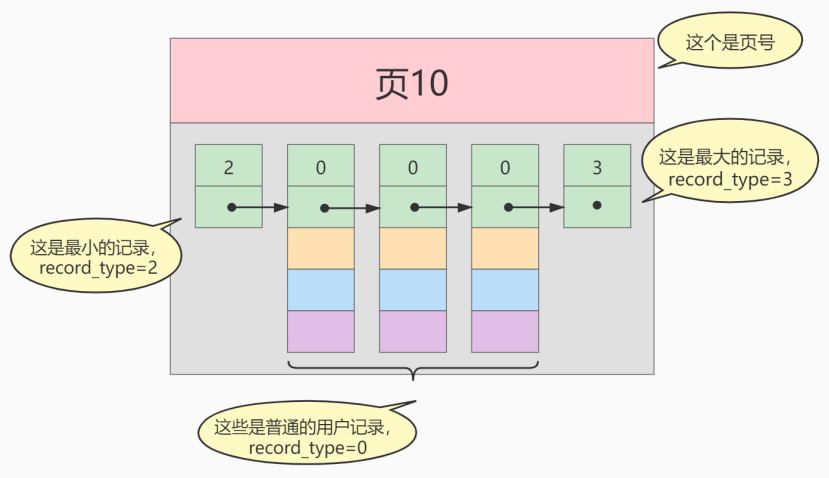

#### 1. 一个简单的索引设计方案

我们可以为快速定位记录所在的数据页而建立一个目录，建这个目录必须完成下边这些事：

**条件1：下一个数据页中用户记录的主键值必须大于上一个页中用户记录的主键值。**

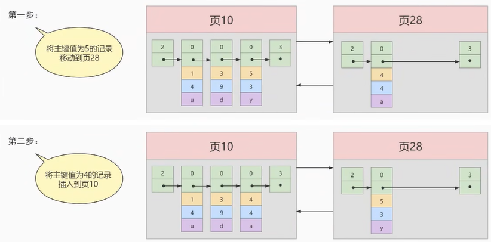

注意：新分配的 **数据页编号可能并不是连续的**，它们只是通过维护者上一个页和下一个页的编号而建立了 **双向链表** 关系。另外，为了满足条件1，所以在插入主键值为4的记录的时候需要伴随着一次 **记录移动**，如上图所示，这个过程称为 **页分裂**。

**条件2：给所有的页建立一个目录项。**

我们需要给所有数据页做个**目录**，每个页对应一个目录项，每个目录项包括下边两个部分：
- 页的用户记录中最小的主键值：我们用 **key** 来表示。
- 页号：我们用 **page_on** 表示。


至此，针对数据页做的简易目录就搞定了。这个目录有一个别名，称为 **索引** 。

#### 2. InnoDB中的索引方案

##### 版本1.0：目录页

InnoDB 使用记录头信息里的 **record_type** 属性来区分一条记录是普通的 **用户记录** 还是 **目录项记录** ：

* 0：普通的用户记录
* 1：目录项记录
* 2：最小记录
* 3：最大记录


从图中可以看出来，我们新分配了一个编号为30的页来专门存储目录项记录，称之为**目录页**。注意 **目录项记录** 和普通的 **用户记录** 

**不同点**：

* **目录项记录** 的 record_type 值是1，而 **普通用户记录** 的 record_type 值是0。 
* 目录项记录只有 **主键值和页的编号** 两个列，而普通的用户记录的列是用户自己定义的，可能包含 **很多列** ，另外还有InnoDB自己添加的隐藏列。 
* 了解：记录头信息里还有一个叫 **min_rec_mask** 的属性，只有在存储 **目录项记录** 的页中的主键值最小的 **目录项记录** 的 **min_rec_mask** 值为 **1** ，其他别的记录的 **min_rec_mask** 值都是 **0** 。

**相同点**：都会为主键值生成 **Page Directory （页目录）**，从而在按照主键值进行查找时可以使用 **二分法** 来加快查询速度。

##### 版本2.0：多个目录页

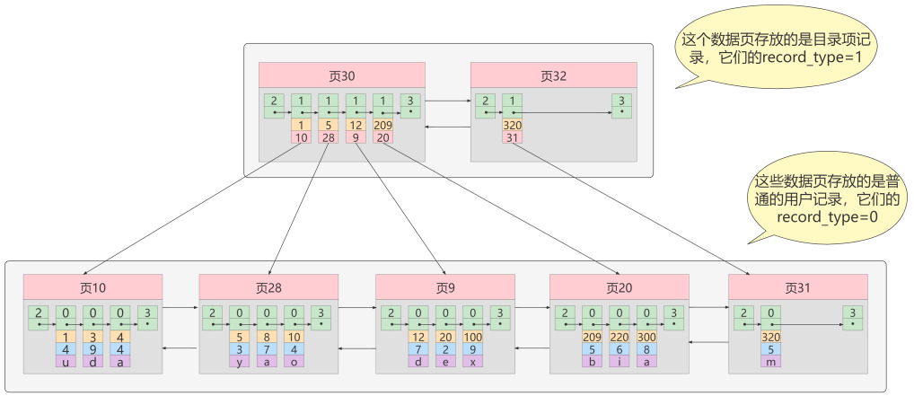


##### 版本3.0：目录页的目录页


如图，我们生成了一个存储更高级目录项的 页33 ，这个页中的两条记录分别代表页30和页32，如果用 户记录的主键值在 [1, 320) 之间，则到页30中查找更详细的目录项记录，如果主键值 不小于320 的 话，就到页32中查找更详细的目录项记录。

我们可以用下边这个图来描述它：

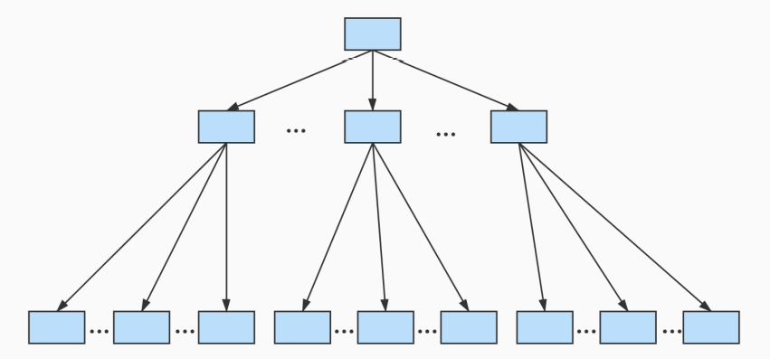

这个数据结构，它的名称是 B+树 。

##### 最终版本：B+Tree

一个B+树的节点其实可以分成好多层，规定最下边的那层，也就是存放我们用户记录的那层为第 0 层， 之后依次往上加。真实环境中一个页存放的记录数量是非常大的，假设所有存放用户记录 的叶子节点代表的数据页可以存放 100条用户记录 ，所有存放目录项记录的内节点代表的数据页可以存放 1000条目录项记录 ，那么：

* 如果B+树有3层，最多能存放 1000×1000×100=1,0000,0000 条记录。 
* 如果B+树有4层，最多能存放 1000×1000×1000×100=1000,0000,0000 条记录。相当多的记录！

所以一般情况下，我们用到的 **B+树都不会超过4层** ，那我们通过主键值去查找某条记录最多只需要做4个页面内的查找（查找3个目录项页和一个用户记录页），又因为在每个页面内有所谓的 **Page Directory** （页目录），所以在页面内也可以通过 **二分法** 实现快速定位记录。

### 3.2 常见索引概念

按照物理实现方式，索引可以分为 2 种：聚簇索引和非聚簇索引，我们也把非聚簇索引称为二级索引或者辅助索引。

#### 1. 聚簇索引

聚簇索引是**一种数据存储方式**（所有的用户记录都存储在了叶子结点），也就是所谓的 `索引即数据，数据即索引`。

**特点：**

* 使用记录主键值的大小进行记录和页的排序，这包括三个方面的含义： 

  * `页内`的记录是按照主键的大小顺序排成一个 `单向链表` 。 
  * 各个存放 `用户记录的页` 也是根据页中用户记录的主键大小顺序排成一个 `双向链表` 。 
  * 存放 `目录项记录的页` 分为不同的层次，在同一层次中的页也是根据页中目录项记录的主键大小顺序排成一个 `双向链表` 。 

* B+树的`叶子节点`存储的是完整的用户记录。 


**优点：**

* `数据访问更快`，因为聚簇索引将索引和数据保存在同一个B+树中
* 聚簇索引对于主键的 `排序查找` 和 `范围查找` 速度非常快 
* 按照聚簇索引排列顺序，查询显示一定范围数据的时候，由于数据都是紧密相连，数据库不用从多 个数据块中提取数据，所以 `节省了大量的io操作` 。

**缺点：**

* `插入速度严重依赖于插入顺序`，因此，对于InnoDB表，我们一般都会定义一个`自增的ID列为主键`
* `更新主键的代价很高`，因此，对于InnoDB表，我们一般定义**主键为不可更新**
* `二级索引访问需要两次索引查找`，第一次找到主键值，第二次根据主键值找到行数据

#### 2. 二级索引

如果我们想以别的列(如c2列)作为搜索条件时，可以`再建一颗B+树`，用`c2`列的大小作为数据页、页中记录的排序规则。如下图所示：


**二级索引与聚簇索引的不同**：

1. 二级索引以指定列(如c2列)的大小作为数据页、页中记录的排序规则
2. 二级索引的B+树的叶子结点存储的并不是完整的用户记录，而只是`c2列+主键`这两个列的值。
3. 二级索引的每个目录项记录中是`c2列+页号`(事实上是`c2列+主键+页号`)，不再是`主键+页号`
4. 一张表可以有多个二级索引，但只能有一个聚簇索引。

**二级索引的查找过程**：

1. 例如查找c2列中值为4的记录，首先会在该二级索引中层层定位到叶子结点
2. 但是二级索引的叶子结点中只记录了`c2列+主键`这两个列的值，所以需要再根据主键值去聚簇索引中再查找一遍得到完整的用户记录(这个过程称为`回表`)。因此，根据c2列的值查询一条完整的用户记录需要使用到2棵B+树。

#### 3.联合索引

我们也可以同时以多个列的大小作为排序规则，也就是同时为多个列建立索引，这就是联合索引。比方说我们想让B+树按 照 `c2和c3列` 的大小进行排序，这个包含两层含义： 

* 先把各个记录和页按照c2列进行排序。 
* 在记录的c2列相同的情况下，采用c3列进行排序 

为c2和c3建立的索引的示意图如下：

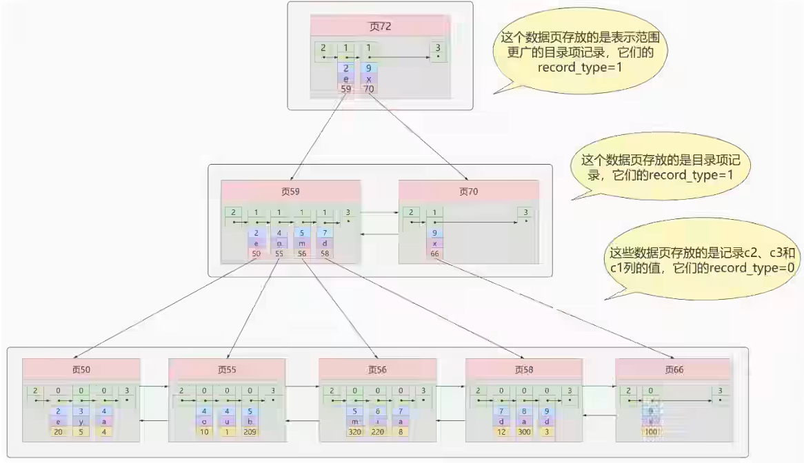

如图所示，我们需要注意以下几点：

* 每条目录项都有c2、c3、页号这三个部分组成(事实上是c2、c3、主键、页号这四部分组成)，各条记录先按照c2列的值进行排序，如果记录的c2列相同，则按照c3列的值进行排序
* B+树叶子节点处的用户记录由c2、c3和主键c1列组成


### 3.3 InnoDB的B+树索引的注意事项

#### 1. 根页面位置始终不变

B+树的形成过程：

* 最开始表中没有数据的时候，每个B+树索引对应的 `根结点` 中既没有用户记录，也没有目录项记录。
* 随着用户记录的添加，当根节点中的可用 `空间用完时` 继续插入记录，此时会将根节点中的所有记录复制到多个新分配的页，而此时这个 `根节点` 便升级为存储目录项记录的页。

#### 2. 内节点中目录项记录的唯一性

我们知道B+树索引的内节点中目录项记录的内容是 `索引列 + 页号` 的搭配，但是这个搭配对于二级索引来说有点不严谨，因为可能会产生歧义。为了让新插入记录找到自己在那个页面，我们需要**保证在B+树的同一层页节点的目录项记录除页号这个字段以外是唯一的**。所以对于二级索引的内节点的目录项记录的内容实际上是由三个部分构成的：`索引列的值、主键值、页号`，根据主键值就能保证唯一性。

#### 3. InnoDB的一个数据页至少可以存放两条记录

## 4. MyISAM中的索引方案

MyISAM、InnoDB、Memory引擎都支持B+Tree索引。即使多个存储引擎支持同一种类型的索引，但是他们的实现原理也是不同的。注意，Innodb和MyISAM默认的索引是B+Tree索引；而Memory默认的索引是Hash索引。

### MyISAM索引的原理

**MyISAM的索引方案虽然也是B+Tree，但是却将索引和数据分开存储**：
- 索引信息存储在`索引文件`中，MyISAM单独为主键创建的索引，其叶子节点中并不存储完整的用户记录，而是`主键值+数据记录地址`
- 表中的数据记录则按照记录的插入顺序单独存储在`数据文件`中。注意这个文件并不划分为若干个数据页，而且插入数据时并没有刻意按照主键大小排序，所以我们也无法在这些数据上使用二分查找。


**注1**：在MyISAM中，主键索引和二级索引在结构上并没有任何区别。因此，在MyISAM的二级索引查找过程中并不会查找2颗B+树。

**注2**：在InnoDB存储引擎中，我们只需要根据主键值对 **聚簇索引** 进行一次查找就能找到对应的记录，而在 MyISAM 中却需要进行一次 **回表** 操作，即去数据文件中查找完整的数据记录。所以MyISAM中建立的索引相当于全部都是 **二级索引**，但MyISAM的回表操作显然比InnoDB的回表操作快得多。

**注3**：MyISAM可以没有主键，而InnoDB要求表必须有主键。即在InnoDB中，表如果没有显式指定主键，则会自动选择一个`非空且唯一`的列作为主键；如果不存在这种列，则自动为InnoDB表生成一个隐含字段作为主键，这个字段长度为6个字节，类型为长整型。

## 5. 索引的代价

索引是个好东西，但不能乱建，它在空间和时间上都会有消耗：

* 空间上的代价：每建立一个索引都要为它建立一棵B+树，每一棵B+树的每一个节点都是一个数据页，一个页默认会占用 16KB的存储空间。

* 时间上的代价：每次对表中的数据进行 增、删、改 操作时，都需要去修改各个B+树索引。

## 6. MySQL数据结构选择的合理性

数据库索引一般很大，存储在磁盘上，所以我们利用索引查询时，不可能把整个索引全部加载到内存中，因此MySQL衡量查询效率的标准就是**磁盘IO次数**。

**加快查找速度的数据结构，常见的有两类：**

(1) 树，例如平衡二叉搜索树，查询/插入/修改/删除的平均时间复杂度都是 `O(logN)`;

(2)哈希，例如HashMap，查询/插入/修改/删除的平均时间复杂度都是 `O(1)`; 

### 6.1 Hash结构

**Hash结构效率高，那为什么索引结构要设计成树型呢？**

- Hash索引仅能满足等值查询，如果是范围查询，时间复杂度为退化为`O(n)`
- Hash索引中数据的存储时无序的，所以对于ORDER BY的查询，还需要重新排序
- 对于联合索引，Hash值是将联合索引键合并后一起来计算的，无法对单独的一个键进行查询
- 对于等值查询来说，通常Hash索引效率更高，但如果索引列的重复值很多，Hash索引效率就变低了，因为遇到Hash冲突时需要遍历桶中的单链表进行比较。

注1：MyISAM和InnoDB都不支持Hash索引，只有Memory引擎支持。键值型数据库(如Redis)存储的核心才是Hash表。

注2：InnoDB本身不支持Hash索引，但是它提供`自适应Hash索引`，即如果某个数据经常被访问，当满足一定条件时，就会将这个数据页的地址存放到Hash表中，这样在下次查询时就可以直接找到这个页面的所在位置。

### 6.2 Tree结构

如果我们利用树作为索引结构，那么磁盘的IO次数和索引树的高度是相关的，因此，多叉树的高度会远远小于二叉树。

#### 6.2.1 B树

B 树的英文是 Balance Tree，也就是 `多路平衡查找树`，它的高度远小于平衡二叉树。


一个 M 阶的 B 树（M>2）有以下的特性：

1. 根节点的儿子数的范围是 `[2,M]`。 
2. 每个中间节点包含 k-1 个关键字和 k 个孩子，孩子的数量 = 关键字的数量 +1，k 的取值范围为 `[ceil(M/2), M]`。 
3. 叶子节点包括 k-1 个关键字（叶子节点没有孩子），k 的取值范围同上。所有叶子节点位于同一层。

#### 6.2.2 B+树

B+树也是一种多路搜索树，基于B树作出了改进，它更适合文件索引系统。

**B+树和B树的差异在于以下几点：**

1. B+树中，一个节点的孩子数量等于关键字数；而B树中，孩子数量 = 关键字数 + 1。
2. B+树中，非叶子节点的关键字也会同时存在在子节点中，并且是在子节点中所有关键字的最大（或最小）。 
3. B+树中，非叶子节点仅用于索引、不保存数据记录，跟记录有关的信息都放在叶子节点中；而B树中，非叶子节点既保存索引，也保存数据记录。 
4. B+树中所有关键字都在叶子节点出现，叶子节点构成一个有序链表，而且叶子节点本身按照关键字从小到大顺序链接。

**B+树的优势**：

- 查询效率更加稳定：所有关键字查询路径长度相同，都会查到叶子结点，所以查询效率稳定。
- 磁盘读写代价更低：B+树的内节点中并没有指向关键字具体信息的指针，所以内节点比B树更小，自然所能存储的节点关键字更多，因此结构上比B树更加矮胖，一次性读入内存的关键字也就越多。
- 在范围查询上B+树效率也更高：因为所有关键字都出现在B+树的叶子节点中，而叶子节点之间数据递增，且又有指针。


# 第7章_InnoDB数据存储结构

## 1. 数据库的存储结构：页


### 1.1 磁盘与内存交互基本单位：页


### 1.2 页结构概述


### 1.3 页的大小

不同的数据库管理系统（简称DBMS）的页大小不同。比如在 MySQL 的 InnoDB 存储引擎中，默认页的大小是 `16KB`，我们可以通过下面的命令来进行查看：

```mysql
show variables like '%innodb_page_size%'
```

SQL Server 中页的大小为 `8KB`，而在 Oracle 中我们用术语 "`块`" （Block）来表示 "页"，Oracle 支持的快大小为2KB, 4KB, 8KB, 16KB, 32KB 和 64KB。

### 1.4 页的上层结构

另外在数据库中，还存在着区（Extent）、段（Segment）和表空间（Tablespace）的概念。行、页、区、段、表空间的关系如下图所示：


## 2. 页的内部结构

页如果按类型划分的话，常见的有 `数据页（保存B+树节点）、系统表、Undo 页 和 事务数据页` 等。数据页是我们最常使用的页。

数据页的 `16KB` 大小的存储空间被划分为七个部分，分别是文件头（File Header）、页头（Page Header）、最大最小记录（Infimum + supremum）、用户记录（User Records）、空闲空间（Free Space）、页目录（Page Directory）和文件尾（File Tailer）。

页结构的示意图如下所示：


如下表所示：


我们可以把这7个结构分为3个部分。

### 第一部分：File Header (文件头部) 和 File Trailer (文件尾部)

见文件InnoDB数据库存储结构.mmap

### 第二部分：User Records (用户记录)、最大最小记录、Free Space (空闲空间)

见文件InnoDB数据库存储结构.mmap

### 第三部分：Page Directory (页目录) 和 Page Header (页面头部)

见文件InnoDB数据库存储结构.mmap

### 2.3 从数据库页的角度看B+树如何查询

一颗B+树按照字节类型可以分为两部分：

1. 叶子节点，B+ 树最底层的节点，节点的高度为0，存储行记录。
2. 非叶子节点，节点的高度大于0，存储索引键和页面指针，并不存储行记录本身。

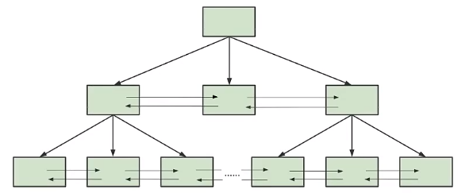

当我们从页结构来理解 B+ 树的结构的时候，可以帮我们理解一些通过索引进行检索的原理：


## 3. InnoDB行格式 (或记录格式)

见文件InnoDB数据库存储结构.mmap

## 4. 区、段与碎片区

### 4.1 为什么要有区？


### 4.2 为什么要有段？


### 4.3 为什么要有碎片区？


### 4.4 区的分类

区大体上可以分为4种类型：

* 空闲的区 (FREE) : 现在还没有用到这个区中的任何页面。
* 有剩余空间的碎片区 (FREE_FRAG)：表示碎片区中还有可用的页面。
* 没有剩余空间的碎片区 (FULL_FRAG)：表示碎片区中的所有页面都被使用，没有空闲页面。
* 附属于某个段的区 (FSEG)：每一个索引都可以分为叶子节点段和非叶子节点段。

处于FREE、FREE_FRAG 以及 FULL_FRAG 这三种状态的区都是独立的，直属于表空间。而处于 FSEG 状态的区是附属于某个段的。

> 如果把表空间比作是一个集团军，段就相当于师，区就相当于团。一般的团都是隶属于某个师的，就像是处于 FSEG 的区全部隶属于某个段，而处于 FREE、FREE_FRAG 以及 FULL_FRAG 这三种状态的区却直接隶属于表空间，就像独立团直接听命于军部一样。

## 5. 表空间


### 5.1 独立表空间

独立表空间，即每张表有一个独立的表空间，也就是数据和索引信息都会保存在自己的表空间中。独立的表空间 (即：单表) 可以在不同的数据库之间进行 `迁移`。

空间可以回收 (DROP TABLE 操作可自动回收表空间；其他情况，表空间不能自己回收) 。如果对于统计分析或是日志表，删除大量数据后可以通过：alter table TableName engine=innodb; 回收不用的空间。对于使用独立表空间的表，不管怎么删除，表空间的碎片不会太严重的影响性能，而且还有机会处理。

**独立表空间结构**

独立表空间由段、区、页组成。

**真实表空间对应的文件大小**

我们到数据目录里看，会发现一个新建的表对应的 .ibd 文件只占用了 96K，才6个页面大小 (MySQL5.7中)，这是因为一开始表空间占用的空间很小，因为表里边都没有数据。不过别忘了这些 .ibd 文件是自扩展的，随着表中数据的增多，表空间对应的文件也逐渐增大。

**查看 InnoDB 的表空间类型：**

```mysql
show variables like 'innodb_file_per_table'
```

你能看到 innodb_file_per_table=ON, 这就意味着每张表都会单词保存一个 .ibd 文件。

### 5.2 系统表空间

系统表空间的结构和独立表空间基本类似，只不过由于整个MySQL进程只有一个系统表空间，在系统表空间中会额外记录一些有关整个系统信息的页面，这部分是独立表空间中没有的。

**InnoDB数据字典**


删除这些数据并不是我们使用 INSERT 语句插入的用户数据，实际上是为了更好的管理我们这些用户数据而不得以引入的一些额外数据，这些数据页称为 元数据。InnoDB 存储引擎特意定义了一些列的 内部系统表 (internal system table) 来记录这些元数据：


这些系统表也称为 `数据字典`，它们都是以 B+ 树的形式保存在系统表空间的某个页面中。其中 `SYS_TABLES、SYS_COLUMNS、SYS_INDEXES、SYS_FIELDS` 这四个表尤其重要，称之为基本系统表 (basic system tables) ，我们先看看这4个表的结构：


注意：用户不能直接访问 InnoDB 的这些内部系统表，除非你直接去解析系统表空间对应文件系统上的文件。不过考虑到查看这些表的内容可能有助于大家分析问题，所以在系统数据库 `information_schema` 中提供了一些以 `innodb_sys` 开头的表:

```mysql
USE information_schema;
```

```mysql
SHOW TABLES LIKE 'innodb_sys%';
```

在 `information_scheme` 数据库中的这些以 `INNODB_SYS` 开头的表并不是真正的内部系统表 (内部系统表就是我们上边以 `SYS` 开头的那些表)，而是在存储引擎启动时读取这些以 `SYS` 开头的系统表，然后填充到这些以 `INNODB_SYS` 开头的表中。以 `INNODB_SYS` 开头的表和以 `SYS` 开头的表中的字段并不完全一样，但仅供大家参考已经足矣。

## 附录：数据页加载的三种方式

InnoDB从磁盘中读取数据 `最小单位` 是数据页。而你想得到的 id = xxx 的数据，就是这个数据页众多行中的一行。

对于MySQL存放的数据，逻辑概念上我们称之为表，在磁盘等物理层面而言是按 `数据页` 形式进行存放的，当其加载到 MySQL 中我们称之为 `缓存页`。

如果缓冲池没有该页数据，那么缓冲池有以下三种读取数据的方式，每种方式的读取速率是不同的：

**1. 内存读取**

如果该数据存在于内存中，基本上执行时间在 1ms 左右，效率还是很高的。

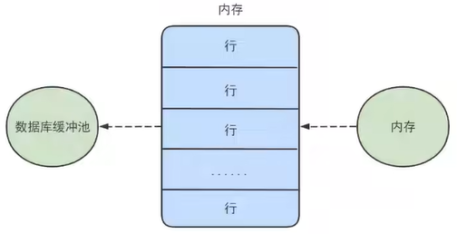

**2. 随机读取**


**3. 顺序读取**


# 第8章_索引的创建与设计原则

## 1. 索引的声明与使用

### 1.1 索引的分类

MySQL的索引包括普通索引、唯一索引、全文索引、单列索引、联合索引和空间索引等。

- 从 `功能逻辑` 上说，索引主要有 4 种，分别是普通索引、唯一索引、主键索引、全文索引。 
- 按照 `物理实现方式` ，索引可以分为 2 种：聚簇索引和非聚簇索引。 
- 按照 `作用字段个数` 进行划分，分成单列索引和联合索引。

**1. 普通索引**：在创建普通索引时，不附加任何限制条件，只是用于提高查询效率，这类索引可以创建在任何数据类型中。

**2. 唯一索引**：使用UNIQUE参数可以设置唯一索引，限制该索引的值必须唯一，但允许有空值。

**3. 主键索引**：一张表最多只能有一个主键索引。

**4. 单列索引**：根据单个字段创建的索引。

**5. 多列 (组合、联合) 索引**：根据多个字段组合创建的索引，使用联合索引时遵循**最左前缀原则**：即查询条件中使用了这些组合字段中的第一个字段时，该联合索引才会被使用。

**6. 全文索引**：能够利用分词技术等算法分析出文本文字中关键词的频率和重要性，智能筛选出我们想要的结果。使用参数FULLTEXT可以设置索引为全文索引，注意只能创建在CHAR、VARCHAR、TEXT类型及其系列类型的字段上，查询数据量较大的字符串类型的字段时，使用全文索引可以提高查询速度。该功能现在逐渐被ElasticSearch等专门的搜索引擎替代。

**7. 空间索引**：使用参数SPATIAL可以设置索引为空间索引，只能设置在空间数据类型上，如GEOMETRY等

**小结：不同的存储引擎支持的索引类型也不一样**

- InnoDB ：不支持 Hash 索引
- MyISAM ：不支持 Hash 索引
- Memory ：不支持 FULLTEXT 索引；


### 1.2 创建索引

#### 1. 创建表的时候创建索引

使用CREATE TABLE创建表时，除了可以定义列的数据类型外，还可以定义主键约束、外键约束或者唯一性约束，而不论创建哪种约束，在定义约束的同时相当于在指定列上创建了一个索引。

举例：

```sql
CREATE TABLE dept(
dept_id INT PRIMARY KEY AUTO_INCREMENT,
dept_name VARCHAR(20)
);

CREATE TABLE emp(
emp_id INT PRIMARY KEY AUTO_INCREMENT,
emp_name VARCHAR(20) UNIQUE,
dept_id INT,
CONSTRAINT emp_dept_id_fk FOREIGN KEY(dept_id) REFERENCES dept(dept_id)
)
```

但是，如果显式创建表时创建索引的话，基本语法格式如下：

```sql
CREATE TABLE table_name [col_name data_type]
[UNIQUE | FULLTEXT | SPATIAL] [INDEX | KEY] [index_name] (col_name [length]) [ASC |
DESC]
```

* UNIQUE 、 FULLTEXT 和 SPATIAL 为可选参数，分别表示唯一索引、全文索引和空间索引； 
* INDEX 与 KEY 为同义词，两者的作用相同，用来指定创建索引； 
* index_name 指定索引的名称，为可选参数，如果不指定，那么MySQL默认col_name为索引名； 
* col_name 为需要创建索引的字段列，该列必须从数据表中定义的多个列中选择； 
* length 为可选参数，表示索引的长度，只有字符串类型的字段才能指定索引长度； 
* ASC 或 DESC 指定升序或者降序的索引值存储。

**1. 创建普通索引**

在book表中的year_publication字段上建立普通索引，SQL语句如下：

```sql
CREATE TABLE book(
  book_id INT ,
  year_publication YEAR,
  INDEX(year_publication)
);
```

**2. 创建唯一索引**

```sql
CREATE TABLE test1(
  id INT NOT NULL,
  name varchar(30) NOT NULL,
  UNIQUE INDEX uk_idx_id(id)
);
```

该语句执行完毕之后，可以使用SHOW CREATE TABLE查看表结构：

```sql
SHOW INDEX FROM test1;
```

**3. 创建主键索引**

设定为主键后数据库会自动建立索引，innodb为聚簇索引，语法：

```sql
CREATE TABLE student (
  id INT(10) UNSIGNED AUTO_INCREMENT ,
  student_no VARCHAR(200),
  student_name VARCHAR(200),
  PRIMARY KEY(id)
);
```

**4. 创建组合索引**


```sql
CREATE TABLE test3(
  id INT(11) NOT NULL,
  name CHAR(30) NOT NULL,
  age INT(11) NOT NULL,
  info VARCHAR(255),
  INDEX multi_idx(id,name,age)
);
```

效果：查询id和name字段时，会使用名称为MultiIdx的索引；如果查询 (name, age) 组合或者单独查询name和age字段，会发现并没有使用创建的组合索引进行查询。

**5. 创建全文索引**

```sql
CREATE TABLE test4(
  id INT NOT NULL,
  name CHAR(30) NOT NULL,
  age INT NOT NULL,
  info VARCHAR(255),
  FULLTEXT INDEX futxt_idx_info(info)
);
```

**6. 创建空间索引**

空间索引创建中，要求空间类型的字段必须为 `非空` 。

```sql
CREATE TABLE test5(
  geo GEOMETRY NOT NULL,
  SPATIAL INDEX spa_idx_geo(geo)
) ENGINE=MyISAM;
```

#### 2. 在已经存在的表上创建索引

在已经存在的表中创建索引可以使用ALTER TABLE语句或者CREATE INDEX语句。

**1. 使用ALTER TABLE语句创建索引** ALTER TABLE语句创建索引的基本语法如下：

```sql
ALTER TABLE table_name ADD [UNIQUE | FULLTEXT | SPATIAL] [INDEX | KEY]
[index_name] (col_name[length],...) [ASC | DESC]
```

**2. 使用CREATE INDEX创建索引** CREATE INDEX语句可以在已经存在的表上添加索引，在MySQL中，CREATE INDEX被映射到一个ALTER TABLE语句上，基本语法结构为：

```sql
CREATE [UNIQUE | FULLTEXT | SPATIAL] INDEX index_name
ON table_name (col_name[length],...) [ASC | DESC]
```

### 1.3 删除索引

**1. 使用ALTER TABLE删除索引**  ALTER TABLE删除索引的基本语法格式如下：

```sql
ALTER TABLE table_name DROP INDEX index_name;
```

**2. 使用DROP INDEX语句删除索引** DROP INDEX删除索引的基本语法格式如下：

```sql
DROP INDEX index_name ON table_name;
```

> 提示: 删除表中的列时，如果要删除的列为索引的组成部分，则该列也会从索引中删除。如果组成索引的所有列都被删除，则整个索引将被删除。

## 2. MySQL8.0索引新特性

### 2.1 支持降序索引

降序索引以降序存储键值。虽然在语法上，从MySQL 4版本开始就已经支持降序索引的语法了，但实际上DESC定义是被忽略的，直到MySQL 8.x版本才开始真正支持降序索引 (仅限于InnoDB存储引擎)。

```sql
CREATE TABLE ts1(
  a int,
  b int,
  index idx_a_b(a,b desc)
);
```

### 2.2 隐藏索引

从MySQL 8.x开始支持 隐藏索引（invisible indexes） ，只需要将待删除的索引设置为隐藏索引，使查询优化器不再使用这个索引，确认将索引设置为隐藏索引后系统不受任何响应，就可以彻底删除索引。这种通过先将索引设置为隐藏索 引，再删除索引的方式就是软删除。

> 注意：
>
> 主键不能被设置为隐藏索引。当表中没有显式主键时，表中第一个唯一非空索引会成为隐式主键，也不能设置为隐藏索引。

索引默认是可见的，在使用CREATE TABLE, CREATE INDEX 或者 ALTER TABLE 等语句时可以通过 `VISIBLE` 或者 `INVISIBLE` 关键词设置索引的可见性。

**1. 创建表时直接创建**

在MySQL中创建隐藏索引通过SQL语句INVISIBLE来实现，其语法形式如下：

```sql
CREATE TABLE tablename(
propname1 type1[CONSTRAINT1],
propname2 type2[CONSTRAINT2],
……
propnamen typen,
INDEX [indexname](propname1 [(length)]) INVISIBLE
);
```

上述语句比普通索引多了一个关键字INVISIBLE，用来标记索引为不可见索引。

**2. 在已经存在的表上创建**

可以为已经存在的表设置隐藏索引，其语法形式如下：

```sql
CREATE INDEX indexname
ON tablename(propname[(length)]) INVISIBLE;
```

**3. 通过ALTER TABLE语句创建**

语法形式如下：

```sql
ALTER TABLE tablename
ADD INDEX indexname (propname [(length)]) INVISIBLE;
```

**4. 切换索引可见状态**

已存在的索引可通过如下语句切换可见状态：

```sql
ALTER TABLE tablename ALTER INDEX index_name INVISIBLE; #切换成隐藏索引
ALTER TABLE tablename ALTER INDEX index_name VISIBLE; #切换成非隐藏索引
```

> 注意 当索引被隐藏时，它的内容仍然是和正常索引一样实时更新的。如果一个索引需要长期被隐藏，那么可以将其删除，因为索引的存在会影响插入、更新和删除的性能。


## 3. 索引的设计原则

### 3.1 哪些情况适合创建索引

#### 1. 字段的数值有唯一性的限制

索引本身可以起到约束的作用，比如唯一索引、主键索引都是可以起到唯一性约束的，因此在我们的数据表中，如果某个字段时唯一的，就可以直接创建唯一索引。

> 业务上具有唯一特性的字段，即使是组合字段，也必须建成唯一索引。（来源：Alibaba） 说明：不要以为唯一索引影响了 insert 速度，这个速度损耗可以忽略，但提高查找速度是明显的。

#### 2. 频繁作为 WHERE 查询条件的字段

某个字段在SELECT语句的 WHERE 条件中经常被使用到，那么就需要给这个字段创建索引了。

#### 3. 经常 GROUP BY 和 ORDER BY 的列

索引就是让数据按照某种顺序进行存储或检索，因此当我们使用 GROUP BY 对数据进行分组查询，或者使用 ORDER BY 对数据进行排序的时候，就需要对分组或者排序的字段进行索引。如果待排序的列有多个，那么可以在这些列上建立组合索引 。

#### 4. UPDATE、DELETE 的 WHERE 条件列

对数据按照某个条件进行查询后再进行 UPDATE 或 DELETE 的操作，如果对 WHERE 字段创建了索引，就能大幅提升效率。**如果进行更新的时候，更新的字段是非索引字段，提升的效率会更明显，这是因为非索引字段更新不需要对索引进行维护**。

#### 5. DISTINCT字段需要创建索引

有时候我们需要对某个字段进行去重，使用 DISTINCT，那么对这个字段创建索引，也会提升查询效率。 

#### 6. 多表 JOIN 连接操作时，创建索引注意事项

首先，`连接表的数量尽量不要超过 3 张`，因为每增加一张表就相当于增加了一次嵌套的循环，数量级增长会非常快，严重影响查询的效率。 

其次，`对 WHERE 条件创建索引`，因为 WHERE 才是对数据条件的过滤。

最后，`对用于连接的字段创建索引`，并且该字段在多张表中的类型必须一致。


#### 7. 尽量让索引列使用较小的类型

例如能使用INT就不要使用BIGINT，因为数据类型越小，在查询时进行的比较操作越快，而且数据类型越小意味着索引占用的存储空间就越少。

这个建议对于表的`主键`来说尤为适用，因为二级索引都会存储主键的值。

#### 8. 使用字符串前缀创建索引

如果一个字符串很长，我们可以通过截取字段的前面一部分内容来创建索引，这个就叫`前缀索引`。一般建议截取长度为20的前缀。

**拓展：Alibaba《Java开发手册》**

【强制】在 varchar 字段上建立索引时，必须指定索引长度，没必要对全字段建立索引，根据实际文本区分度决定索引长度。 

说明：索引的长度与区分度是一对矛盾体，一般对字符串类型数据，长度为 20 的索引，区分度会高达 90% 以上 ，可以使用 `count(distinct left(列名, 索引长度))/count(*)`的区分度来确定。

#### 9. 区分度高(散列性高)的列适合作为索引

`列的基数` 指的是某一列中不重复数据的个数，比方说某个列包含值 `2, 5, 8, 2, 5, 8, 2, 5, 8`，虽然有`9`条记录，但该列的基数却是3。也就是说**在记录行数一定的情况下，列的基数越大，该列中的值越分散；列的基数越小，该列中的值越集中**。最好为列的基数大的列建立索引，为基数太小的列的建立索引效果可能不好。

可以使用公式`select count(distinct a) / count(*) from t1` 计算区分度，越接近1越好，一般超过33%就算比较高效的索引了。

扩展：联合索引把区分度搞(散列性高)的列放在前面。

#### 10. 使用最频繁的列放到联合索引的左侧

这样也可以较少的建立一些索引。同时，由于"最左前缀原则"，可以增加联合索引的使用率。

#### 11. 在多个字段都要创建索引的情况下，联合索引优于单值索引


### 3.2 哪些情况不适合创建索引

#### 1. 在where中使用不到的字段，不要设置索引

#### 2. 数据量小的表最好不要使用索引

在数据表中的数据行数比较少的情况下，比如不到 1000 行，是不需要创建索引的。

#### 3. 有大量重复数据的列上不要建立索引

比如在学生表的"性别"字段上只有“男”与“女”两个不同值，因此无须建立索引。如果建立索引，不但不会提高查询效率，反而会`严重降低数据更新速度`。

> 结论：当数据重复度大，比如 高于 10% 的时候，也不需要对这个字段使用索引。

#### 4. 避免对经常更新的表创建过多的索引

- 频繁更新的字段不一定要创建索引。
- 避免对经常更新的表创建过多的索引，并且索引中的列尽可能少。

#### 5. 不建议用无序的值作为索引

例如身份证、UUID(在索引比较时需要转为ASCII，并且插入时可能造成页分裂)、MD5、HASH、无序长字符串等。

#### 6. 删除不再使用或者很少使用的索引

#### 7. 不要定义冗余或重复的索引

### 3.3 限制索引的数目

在实际开发中，单张表索引数量建议不超过6个，原因：

- 每个索引都需要占用磁盘空间
- 索引会影响INSERT、DELETE、UPDATE操作的性能
- 优化器在选择如何优化查询时，会对每一个可以用到的索引来进行评估，所以索引太多会增加优化器生成执行计划的时间，降低查询性能。


# 第09章_性能分析工具的使用

在数据库调优中，我们的目标是 `响应时间更快, 吞吐量更大` 。利用宏观的监控工具和微观的日志分析可以帮我们快速找到调优的思路和方式。

## 1. 数据库服务器的优化步骤

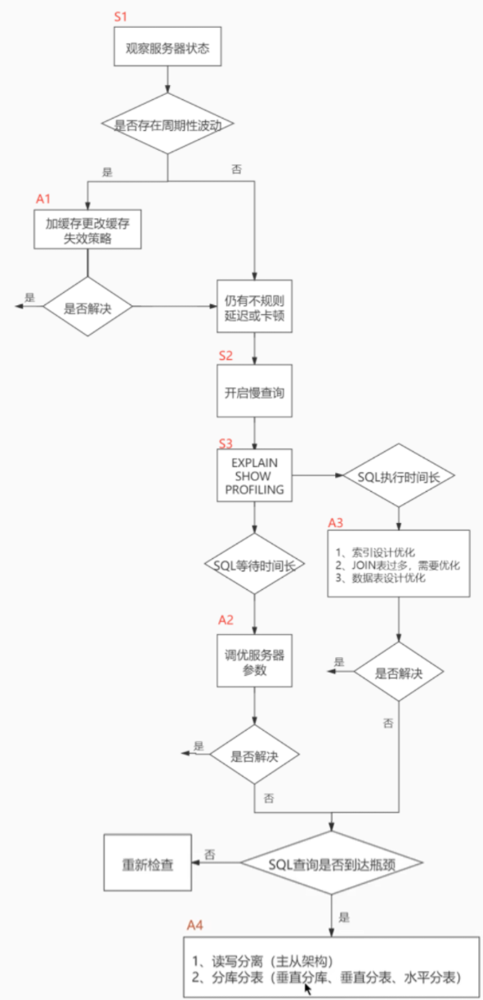


## 2. 查看系统性能参数

在MySQL中，可以使用 `SHOW STATUS` 语句查询一些MySQL数据库服务器的`性能参数、执行频率`。

```sql
SHOW [GLOBAL|SESSION] STATUS LIKE '参数';
```

一些常用的性能参数如下：

* Connections：连接MySQL服务器的次数。 
* Uptime：MySQL服务器的上线时间。 
* Slow_queries：慢查询的次数。 


## 3. 统计SQL的查询成本: last_query_cost

一条SQL查询语句在执行前需要查询执行计划，如果存在多种执行计划的话，MySQL会计算每个执行计划所需要的成本，从中选择`成本最小`的一个作为最终执行的执行计划。

如果我们想要查看某条SQL语句的查询成本，可以在执行完这条SQL语句之后，通过查看当前会话中的`last_query_cost`变量值来得到当前查询的成本。它通常也是我们`评价一个查询的执行效率`的一个常用指标，这个查询成本对应的是`SQL 语句所需要读取的读页的数量`。

```sql
SHOW STATUS LIKE 'last_query_cost';
```

> SQL查询是一个动态的过程，从页加载的角度来看，我们可以得到以下两点结论：
>
> 1. `位置决定效率`。如果页就在数据库 `缓冲池` 中，那么效率是最高的，否则还需要从 `内存` 或者 `磁盘` 中进行读取。
> 2. `批量决定效率`。如果我们从磁盘中对单一页进行随机读，那么效率是很低的，而采用顺序读取的方式，批量对页进行读取，平均一页的读取效率就会提升很多。


## 4. 定位执行慢的 SQL：慢查询日志

MySQL的慢查询日志，是用来记录在MySQL中`响应时间超过阈值`的语句，具体指运行时间超过`long_query_time`值的SQL，该值默认为`10`，即运行时间超过10秒的语句会被记录到慢查询日志中。

慢查询日志的主要作用是帮助我们发现那些执行时间特别长的SQL语句，从而进行针对性的优化。默认情况下，MySQL数据库`没有开启慢查询日志`，如果我们需要调优，则要手动开启慢查询日志参数。

### 4.1 开启慢查询日志参数

**1. 开启 slow_query_log**

开启慢查询：

```sql
set global slow_query_log='ON';
```

检查慢查询日志是否开启，以及慢查询日志文件的位置：

```sql
show variables like '%slow_query_log%';
```


**2. 修改 long_query_time 阈值**

比如将阈值设置为1秒：

```sql
set global long_query_time = 1;
set long_query_time=1;
```

**补充：配置文件中一并设置参数**

如下的方式相较于前面的命令行方式，可以看做是永久设置的方式。

修改 `my.cnf` 文件，[mysqld] 下增加或修改参数 `long_query_time、slow_query_log` 和 `slow_query_log_file` 后，然后重启 MySQL 服务器：

```properties
[mysqld]
slow_query_log=ON  # 开启慢查询日志开关
slow_query_log_file=/var/lib/mysql/atguigu-low.log  # 慢查询日志的目录和文件名信息
long_query_time=3  # 设置慢查询的阈值为3秒，超出此设定值的SQL即被记录到慢查询日志
log_output=FILE
```

如果不指定存储路径，慢查询日志默认存储到MySQL数据库的数据文件夹下。如果不指定文件名，默认文件名为hostname_slow.log。

### 4.2 查看慢查询数目

查询当前系统中有多少条慢查询记录：

```sql
SHOW GLOBAL STATUS LIKE '%Slow_queries%';
```

## 5. 查看 SQL 执行成本：SHOW PROFILE

show profile 是 MySQL 提供的可以用来分析当前会话中 SQL 都做了什么、执行的资源消耗工具的情况，可用于 sql 调优的测量。`默认情况下处于关闭状态`，并保存最近15次的运行结果。

**注意**：SHOW PROFILE命令将被弃用，我们可以从 information_schema 中的 profiling 数据表进行查看。

## 6. 分析查询语句：EXPLAIN

### 6.1 概述

定位了查询慢的SQL之后，我们就可以使用EXPLAIN或DESCRIBE工具做针对性的分析查询语句。它们的使用方法是一样的，并且分析结果也是一样的。

MySQL中有专门负责优化SELECT语句的优化器模块，通过计算分析系统中收集到的统计信息，来提供它认为最优的执行计划。MySQL为我们提供了EXPLAIN语句来帮助我们查看某个查询语句的具体执行计划。


### 6.2 基本语法

EXPLAIN 或 DESCRIBE语句的语法形式如下：

```sql
EXPLAIN SELECT select_options
或者
DESCRIBE SELECT select_options
```
- 除了SELECT语句以外，也可以在DELETE、INSERT、REPLACE、UPDATE语句前都加上EXPLAIN，用来查看这些语句的执行计划
- 使用EXPLAIN时并没有真正执行后面的语句，而只是查看执行计划。

**EXPLAIN 语句输出的各个列的作用如下**：

- `id`：在一个大的查询语句中每个SELECT关键字都对应一个唯一的id
- `select_type`：SELECT关键字对应的那个查询的类型
- `table`：表名
- `partitions`：匹配的分区信息
- `type`：针对单表的访问方法
- `possible_keys`：可能用到的索引
- `key`：实际使用的索引
- `key_len`：实际使用到的索引的长度
- `ref`：当使用索引列等值查询时，与索引列进行等值匹配的对象信息
- `rows`：预估的需要读取的记录条数
- `filtered`：某个表经过搜索条件过滤后剩余记录条数的百分比
- `Extra`：一些额外的信息


### 6.3 数据准备

**1. 建表**

```sql
CREATE TABLE s1 (
    id INT AUTO_INCREMENT,
    key1 VARCHAR(100),
    key2 INT,
    key3 VARCHAR(100),
    key_part1 VARCHAR(100),
    key_part2 VARCHAR(100),
    key_part3 VARCHAR(100),
    common_field VARCHAR(100),
    PRIMARY KEY (id),
    INDEX idx_key1 (key1),
    UNIQUE INDEX idx_key2 (key2),
    INDEX idx_key3 (key3),
    INDEX idx_key_part(key_part1, key_part2, key_part3)
) ENGINE=INNODB CHARSET=utf8;
```

```sql
CREATE TABLE s2 (
    id INT AUTO_INCREMENT,
    key1 VARCHAR(100),
    key2 INT,
    key3 VARCHAR(100),
    key_part1 VARCHAR(100),
    key_part2 VARCHAR(100),
    key_part3 VARCHAR(100),
    common_field VARCHAR(100),
    PRIMARY KEY (id),
    INDEX idx_key1 (key1),
    UNIQUE INDEX idx_key2 (key2),
    INDEX idx_key3 (key3),
    INDEX idx_key_part(key_part1, key_part2, key_part3)
) ENGINE=INNODB CHARSET=utf8;
```

**2. 设置参数 log_bin_trust_function_creators**

创建函数，假如报错，需开启如下命令：允许创建函数设置：

```sql
set global log_bin_trust_function_creators=1; # 不加global只是当前窗口有效。
```

**3. 创建函数**

```sql
DELIMITER //
CREATE FUNCTION rand_string1(n INT)
	RETURNS VARCHAR(255) #该函数会返回一个字符串
BEGIN
	DECLARE chars_str VARCHAR(100) DEFAULT
'abcdefghijklmnopqrstuvwxyzABCDEFJHIJKLMNOPQRSTUVWXYZ';
    DECLARE return_str VARCHAR(255) DEFAULT '';
    DECLARE i INT DEFAULT 0;
    WHILE i < n DO
        SET return_str =CONCAT(return_str,SUBSTRING(chars_str,FLOOR(1+RAND()*52),1));
        SET i = i + 1;
    END WHILE;
    RETURN return_str;
END //
DELIMITER ;
```

**4. 创建存储过程**

创建往s1表中插入数据的存储过程：

```sql
DELIMITER //
CREATE PROCEDURE insert_s1 (IN min_num INT (10),IN max_num INT (10))
BEGIN
    DECLARE i INT DEFAULT 0;
    SET autocommit = 0;
    REPEAT
    SET i = i + 1;
    INSERT INTO s1 VALUES(
        (min_num + i),
        rand_string1(6),
        (min_num + 30 * i + 5),
        rand_string1(6),
        rand_string1(10),
        rand_string1(5),
        rand_string1(10),
        rand_string1(10));
    UNTIL i = max_num
    END REPEAT;
    COMMIT;
END //
DELIMITER ;
```

创建往s2表中插入数据的存储过程：

```sql
DELIMITER //
CREATE PROCEDURE insert_s2 (IN min_num INT (10),IN max_num INT (10))
BEGIN
    DECLARE i INT DEFAULT 0;
    SET autocommit = 0;
    REPEAT
    SET i = i + 1;
    INSERT INTO s2 VALUES(
        (min_num + i),
        rand_string1(6),
        (min_num + 30 * i + 5),
        rand_string1(6),
        rand_string1(10),
        rand_string1(5),
        rand_string1(10),
        rand_string1(10));
    UNTIL i = max_num
    END REPEAT;
    COMMIT;
END //
DELIMITER ;
```

**5. 调用存储过程**

s1表数据的添加：加入1万条记录：

```sql
CALL insert_s1(10001,10000);
```

s2表数据的添加：加入1万条记录：

```sql
CALL insert_s2(10001,10000);
```

### 6.4 EXPLAIN各列作用

为了让大家有比较好的体验，我们调整了下 `EXPLAIN` 输出列的顺序。

#### 1. table

MySQL规定EXPLAIN语句输出的每条记录都对应着某个单表的访问方法，该条记录的table列代表着该表的表名（有时不是真实的表名字，可能是简称）。

```sql
mysql > EXPLAIN SELECT * FROM s1 INNER JOIN s2;
```


可以看出这个连接查询的执行计划中有两条记录，这两条记录的table列分别是s1和s2，用来分别说明对s1表和s2表的访问记录。

#### 2. id

查询语句中每出现一个SELECT关键字，MySQL就会为它分配一个唯一的id值。

（1）对于**连接查询**来说，一个SELECT关键字后边的FROM字句中可以跟随多个表，所以**在连接查询的执行计划中，每个表都会对应一条记录，但是这些记录的id值都是相同的**，出现在上面的表是`驱动表`，出现在下面的表是`被驱动表`，比如：

```sql
mysql> EXPLAIN SELECT * FROM s1 INNER JOIN s2;
```

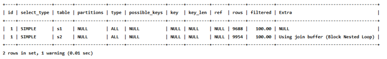


（2）对于**包含子查询**的查询语句来说，就可能涉及多个`SELECT`关键字，所以在包含子查询的查询语句的执行计划中，每个`SELECT`关键字都会对应一个唯一的id值，比如：

```sql
mysql> EXPLAIN SELECT * FROM s1 WHERE key1 IN (SELECT key1 FROM s2) OR key3 = 'a';
```


从中我们可以看到，外层查询的id是1，而内层子查询的id是2

（3）注意，**查询优化器可能对涉及子查询的语句进行重写，从而转换为连接查询**。如

```sql
# 查询优化器可能对涉及子查询的查询语句进行重写，转变为多表查询的操作。  
mysql> EXPLAIN SELECT * FROM s1 WHERE key1 IN (SELECT key2 FROM s2 WHERE common_field = 'a');
```

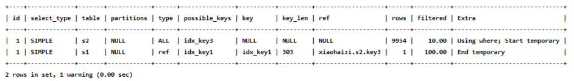

可以看到，虽然我们的查询语句是一个子查询，但是执行计划中s1和s2表对应的记录的`id`值全部是1，这就表明`查询优化器将子查询转换为了连接查询`。

（4）对于**包含`UNION`子句**的查询语句来说，每个`SELECT`关键字也同样对应一个`id`值：

```sql
# Union去重
mysql> EXPLAIN SELECT * FROM s1 UNION SELECT * FROM s2;
```

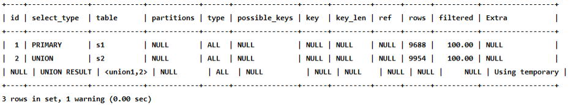

注1：这个语句的执行计划的第三条记录产生的原因是UNION会对合并的结果集进行去重，而去重用到的是一个临时表，所以创建了一个名为`<union1,2>`的临时表的记录。

注2：如果使用UNION ALL，则不会对合并的结果集进行去重，所以就不会有第三条记录了。

**小结:**

* id如果相同，可以认为是一组，从上往下顺序执行 
* 在所有组中，id值越大，优先级越高，越先执行 
* 关注点：id号每个号码，表示一趟独立的查询，一个sql的查询趟数越少越好

#### 3. select_type

`select_type`指的是SELECT关键字对应的那个查询的类型，具体类型如下：

* SIMPLE：查询语句中不包含`UNION`或者子查询的查询都算作是`SIMPLE`类型
* PRIMARY：对于包含`UNION、UNION ALL`或者子查询的大查询来说，它是由几个小查询组成的，其中最左边的那个查询的`select_type`的值就是`PRIMARY`
* UNION：对于包含`UNION`或者`UNION ALL`的大查询来说，它是由几个小查询组成的，其中除了最左边的那个查询以外，其余的小查询的`select_type`值就是`UNION`
* UNION RESULT：MySQL 选择使用临时表来完成`UNION`查询的去重工作，针对该临时表的查询的`select_type`就是`UNION RESULT`
* SUBQUERY：如果包含子查询的查询语句不能够转为对应的`semi-join`的形式，并且该子查询是不相关子查询，并且查询优化器决定采用将该子查询物化的方案来执行该子查询时，该子查询的第一个`SELECT`关键字代表的那个查询的`select_type`就是`SUBQUERY`，比如下边这个查询：

  ```sql
  mysql> EXPLAIN SELECT * FROM s1 WHERE key1 IN (SELECT key1 FROM s2) OR key3 = 'a';
  ```

  

* DEPENDENT SUBQUERY

  ```sql
  mysql> EXPLAIN SELECT * FROM s1 WHERE key1 IN (SELECT key1 FROM s2 WHERE s1.key2 = s2.key2) OR key3 = 'a';
  ```

  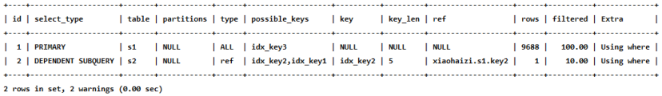

* DEPENDENT UNION

  ```sql
  mysql> EXPLAIN SELECT * FROM s1 WHERE key1 IN (SELECT key1 FROM s2 WHERE key1 = 'a' UNION SELECT key1 FROM s1 WHERE key1 = 'b');
  ```

  

* DERIVED

  ```sql
  mysql> EXPLAIN SELECT * FROM (SELECT key1, count(*) as c FROM s1 GROUP BY key1) AS derived_s1 where c > 1;
  ```

  

  从执行计划中可以看出，id为2的记录就代表子查询的执行方式，它的select_type是DERIVED，说明该子查询是以物化的方式执行的。id为1的记录代表外层查询，大家注意看它的table列显示的是derived2，表示该查询时针对将派生表物化之后的表进行查询的。

* MATERIALIZED

  当查询优化器在执行包含子查询的语句时，选择将子查询物化之后的外层查询进行连接查询时，该子查询对应的`select_type`属性就是DERIVED，比如下边这个查询：

  ```sql
  mysql> EXPLAIN SELECT * FROM s1 WHERE key1 IN (SELECT key1 FROM s2);
  ```

  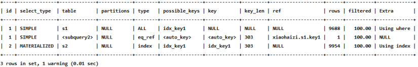

* UNCACHEABLE SUBQUERY：不常用
* UNCACHEABLE UNION：不常用

####  4. partitions

代表分区表中的命中情况，非分区表，该项为`NULL`。一般情况下我们的查询语句的执行计划的`partitions`列的值为`NULL`。

#### 5. type (重点)

执行计划的一条记录就代表着MySQL对某个表的 `执行查询时的访问方法`，又称“访问类型”，其中的 `type` 列就表明了这个访问方法是什么。

完整的访问方法如下(从左到右依次是最好到最差)： 

**system > const > eq_ref > ref** > fulltext > ref_or_null > index_merge > unique_subquery > index_subquery > **range > index > ALL** 

**其中粗体的是比较重要的type。SQL性能优化的目标：至少要达到range级别，要求是ref级别，最好是const级别。（阿里巴巴开发手册要求）**

我们详细解释一下：

* `system`：当表中`只有一条记录`并且该表使用的存储引擎的统计数据是精确的(如MyISAM、Memory)，那么对该表的访问方法就是`system`。
* `const`：当我们根据主键或者唯一二级索引列与常数进行等值匹配时，对单表的访问方法就是`const`，比如：

  ```sql
  mysql> EXPLAIN SELECT * FROM s1 WHERE id = 10005;
  ```

* `eq_ref`：在连接查询时，如果被驱动表是通过主键或者唯一二级索引列等值匹配的方式进行访问的（如果该主键或者唯一二级索引是联合索引的话，所有的索引列都必须进行等值比较），则对该被驱动表的访问方法就是`eq_ref`，比如：

  ```sql
  mysql> EXPLAIN SELECT * FROM s1 INNER JOIN s2 ON s1.id = s2.id;
  ```

  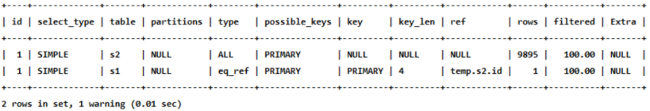

  从执行计划的结果中可以看出，MySQL打算将s2作为驱动表，s1作为被驱动表，重点关注s1的访问 方法是 `eq_ref` ，表明在访问s1表的时候可以 `通过主键的等值匹配` 来进行访问。

* `ref`：当通过普通的二级索引列与常量进行等值匹配时来查询某个表，那么对该表的访问方法就可能是`ref`，比方说下边这个查询：

  ```sql
  mysql> EXPLAIN SELECT * FROM s1 WHERE key1 = 'a';
  ```

  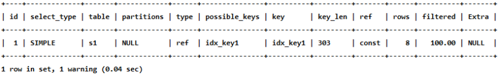

* `fulltext`：全文索引

* `ref_or_null`：当对普通二级索引进行等值匹配查询，该索引列的值也可以是`NULL`值时，那么对该表的访问方法就可能是`ref_or_null`，比如说：

  ```sql
  mysql> EXPLAIN SELECT * FROM s1 WHERE key1 = 'a' OR key1 IS NULL;
  ```

  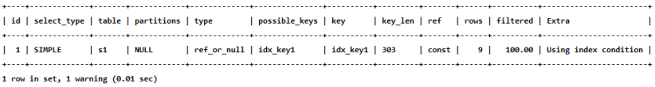

* `index_merge`：一般情况下对于某个表的查询只能使用到一个索引，但单表访问方法时在某些场景下可以使用`Interseation、union、Sort-Union`这三种索引合并的方式来执行查询。我们看一下执行计划中是怎么体现MySQL使用索引合并的方式来对某个表执行查询的：

  ```sql
  mysql> EXPLAIN SELECT * FROM s1 WHERE key1 = 'a' OR key3 = 'a';
  ```

  

  从执行计划的 `type` 列的值是 `index_merge` 就可以看出，MySQL 打算使用索引合并的方式来执行 对 s1 表的查询。

* `unique_subquery`：类似于两表连接中被驱动表的`eq_ref`访问方法，`unique_subquery`是针对在一些包含`IN`子查询的查询语句中，如果查询优化器决定将`IN`子查询转换为`EXISTS`子查询，而且子查询可以使用到主键进行等值匹配的话，那么该子查询执行计划的`type`列的值就是`unique_subquery`，比如下边的这个查询语句：

  ```sql
  mysql> EXPLAIN SELECT * FROM s1 WHERE key2 IN (SELECT id FROM s2 where s1.key1 = s2.key1) OR key3 = 'a';
  ```

  

+ `index_subquery`：与 `unique_subquery` 类似，只不过访问子查询中的表时使用的是普通的索引，比如这样：

  ```sql
  mysql> EXPLAIN SELECT * FROM s1 WHERE common_field IN (SELECT key3 FROM s2 where s1.key1 = s2.key1) OR key3 = 'a';
  ```

  

* `range`：利用索引进行范围查询

  ```sql
  mysql> EXPLAIN SELECT * FROM s1 WHERE key1 IN ('a', 'b', 'c');
  ```

  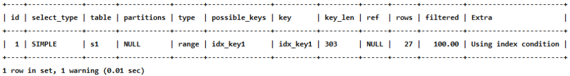

  或者：

  ```sql
  mysql> EXPLAIN SELECT * FROM s1 WHERE key1 > 'a' AND key1 < 'b';
  ```

  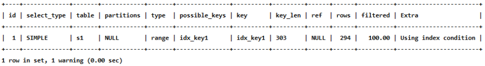

* `index`：当我们可以使用索引覆盖，但需要扫描全部的索引记录时，该表的访问方法就是`index`，比如这样：

  ```sql
  mysql> EXPLAIN SELECT key_part2 FROM s1 WHERE key_part3 = 'a';
  ```

  

  上述查询中的所有列表中只有key_part2 一个列，而且搜索条件中也只有 key_part3 一个列，这两个列又恰好包含在idx_key_part这个索引中，可是搜索条件key_part3不能直接使用该索引进行`ref`和`range`方式的访问，只能扫描整个`idx_key_part`索引的记录，所以查询计划的`type`列的值就是`index`。

  > 再一次强调，对于使用InnoDB存储引擎的表来说，二级索引的记录只包含索引列和主键列的值，而聚簇索引中包含用户定义的全部列以及一些隐藏列，所以扫描二级索引的代价比直接全表扫描，也就是扫描聚簇索引的代价更低一些。

* `ALL`：最熟悉的全表扫描，就不多说了，直接看例子：

  ```sql
  mysql> EXPLAIN SELECT * FROM s1;
  ```

  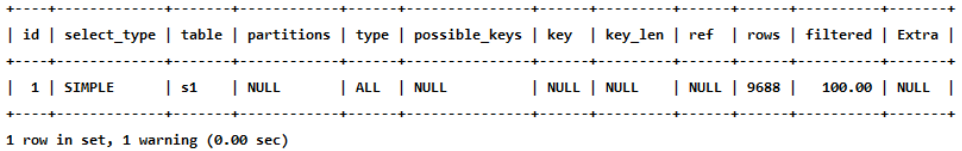


#### 6. possible_keys和key (重点)

在EXPLAIN语句输出的执行计划中，`possible_keys`列表示在某个查询语句中，对某个列执行`单表查询时可能用到的索引`有哪些。一般查询涉及到的字段上若存在索引，则该索引将被列出，但不一定被查询使用。`key`列表示`实际用到的索引`有哪些，如果为NULL，则没有使用索引。

#### 7. key_len (重点)

key_len 表示实际使用到的索引长度 (即：字节数)，作用是帮我们检查`是否充分的利用了索引`，`值越大越好`，主要针对于联合索引。

```sql
mysql> EXPLAIN SELECT * FROM s1 WHERE id = 10005;
```

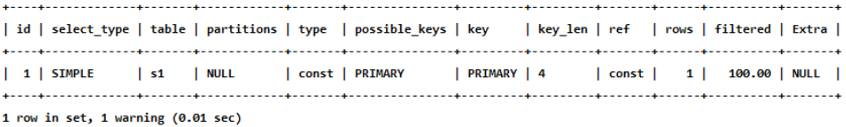

> int 占用 4 个字节

```sql
mysql> EXPLAIN SELECT * FROM s1 WHERE key2 = 10126;
```


> key2上有一个唯一性约束，是否为NULL占用一个字节，那么就是5个字节

```sql
mysql> EXPLAIN SELECT * FROM s1 WHERE key1 = 'a';
```

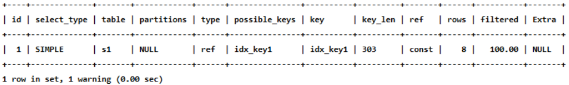

> key1 VARCHAR(100) 一个字符占3个字节，100*3，是否为NULL占用一个字节，varchar的长度信息占两个字节。


联合索引举例：

```sql
mysql> EXPLAIN SELECT * FROM s1 WHERE key_part1 = 'a';
```

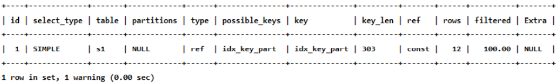

```sql
mysql> EXPLAIN SELECT * FROM s1 WHERE key_part1 = 'a' AND key_part2 = 'b';
```

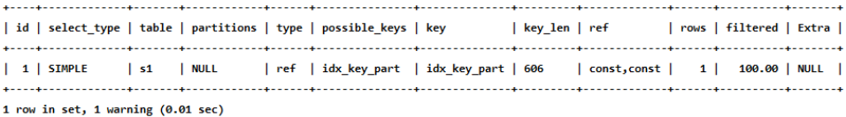

> 联合索引中可以比较，key_len=606的好于key_len=303

**补充：key_len的长度计算公式**

```sql
varchar(10)变长字段且允许NULL = 10 * (character set：utf8=3,gbk=2,latin1=1)+1(NULL)+2(变长字段)

varchar(10)变长字段且不允许NULL = 10 * (character set：utf8=3,gbk=2,latin1=1)+2(变长字段)

char(10)固定字段且允许NULL = 10 * (character set：utf8=3,gbk=2,latin1=1)+1(NULL)

char(10)固定字段且不允许NULL = 10 * (character set：utf8=3,gbk=2,latin1=1)
```

#### 8. ref

ref显示哪些列或常量被用于查找索引列上的值，例如：

```sql
mysql> EXPLAIN SELECT * FROM s1 WHERE key1 = 'a';
```

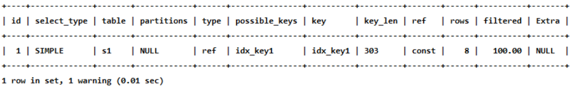

可以看到`ref`列的值是`const`，表明在使用`idx_key1`索引执行查询时，与`key1`列作等值匹配的对象是一个常数。

#### 9. rows (重点)

rows表示预估的需要读取的记录条数，`值越小越好`。

```sql
mysql> EXPLAIN SELECT * FROM s1 WHERE key1 > 'z';
```

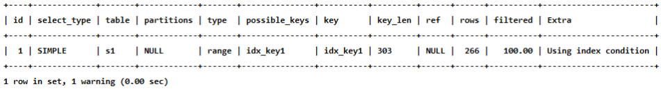

#### 10. filtered

filtered 表示某个表经过搜索条件过滤后剩余记录条数的百分比。

对于单表查询来说，这个filtered的值没有什么意义，我们`更关注在连接查询中驱动表对应的执行计划记录的filtered值`，它决定了被驱动表要执行的次数 (即: rows * filtered)

```mysql
mysql> EXPLAIN SELECT * FROM s1 INNER JOIN s2 ON s1.key1 = s2.key1 WHERE s1.common_field = 'a';
```


从执行计划中可以看出来，查询优化器打算把`s1`作为驱动表，`s2`当做被驱动表。我们可以看到驱动表`s1`表的执行计划的`rows`列为`9688`，filtered列为`10.00`，这意味着驱动表`s1`的扇出值就是`9688 x 10.00% = 968.8`，这说明还要对被驱动表执行大约`968`次查询。

#### 11. Extra (重点)

顾名思义，`Extra`列是用来说明一些额外信息的。我们可以通过这些额外信息来`更准确的理解MySQL到底将如何执行给定的查询语句`。我们只挑选比较重要的额外信息介绍：

* `No tables used`：当查询语句没有`FROM`子句时将会提示该额外信息。
* `Impossible WHERE`：当查询语句的`WHERE`子句永远为`FALSE`时将会提示该额外信息。
* `Using where`(较差)：当我们使用全表扫描，并且WHERE子句中有针对该表的搜索条件时，会提示该额外信息；当我们使用索引查询某个表，并且WHERE子句中有除了该索引包含的列之外的其他搜索条件时，也会提示该额外信息。
* `Using index`(很好)：当我们的查询列表以及搜索条件中只包含属于某个索引的列，也就是在可以使用覆盖索引的情况下，在`Extra`列将会提示该额外信息。比方说下边这个查询中只需要用到`idx_key1`而不需要回表操作:

  ```sql
  mysql> EXPLAIN SELECT key1 FROM s1 WHERE key1 = 'a';
  ```

  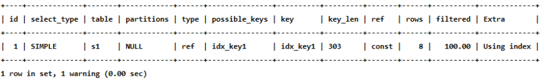

* `Using index condition`：使用了**索引条件下推**。
* `Using join buffer (Block Nested Loop)`：在连接查询执行过程中，当被驱动表不能有效的利用索引加快访问速度，MySQL一般会为其分配一块名叫`join buffer`的内存块来加快查询速度，也就是我们所讲的`基于块的嵌套循环算法`。
* `Using filesort`(较差)：将使用文件排序而不是按照索引顺序排列结果，数据较少时从内存排序，否则需要在磁盘完成排序，代价非常高，需要添加合适的索引。
* `Using temporary`(较差)：需要创建一个临时表来存储结果，这通常发生在对没有索引的列进行GROUP BY时，或者ORDER BY里的列不都在索引里(或者DISTINCT)，需要添加合适的索引。
* `Select tables optimized away`(较好)：使用某些聚合函数来访问存在索引的某个字段时，优化器会通过索引直接一次定位到所需要的数据行完成整个查询，例如MIN()\MAX()，这种也是比较好的结果之一。

#### 12. 小结

**EXPLAIN的一些其他特点**：

* EXPLAIN不考虑各种Cache 
* EXPLAIN不能显示MySQL在执行查询时所作的优化工作 
* EXPLAIN不会告诉你关于触发器、存储过程的信息或用户自定义函数对查询的影响情况 
* 部分统计信息是估算的，并非精确值

**使用EXPLAIN的核心**

1. 重点关注以下列：
   - type：可以大致了解查询的效率，尽量避免出现index和ALL的情况
   - key：可以知道最终选择的索引，如果没有索引的话，本次查询效率通常很差。
   - key_len：在联合索引中，使用到的索引长度越长越好。
   - rows：预估要扫描的记录数，越小越好
   - Extra：要重点关注一些额外信息
2. Extra中需要重点关注的信息：
   - Using filesort：很差的情况，尽量避免出现
   - Using temporary：很差的情况，尽量避免出现
   - Using where：较差的情况
   - Using index：很好的情况
   - Select tables optimized away：很好的情况


## 7. EXPLAIN的进一步使用

### 7.1 EXPLAIN四种输出格式

EXPLAIN可以输出四种格式：`传统格式`，`JSON格式`，`TREE格式`以及`可视化输出`。

#### 1. 传统格式

传统格式简单明了，输出是一个表格形式，概要说明查询计划。

#### 2. JSON格式

第1种格式中介绍的`EXPLAIN`语句输出中缺少了一个衡量执行好坏的重要属性 —— `成本`。而JSON格式是四种格式里面输出`信息最详尽`的格式，里面包含了执行的成本信息。

* JSON格式：在EXPLAIN单词和真正的查询语句中间加上 FORMAT=JSON 。

```sql
EXPLAIN FORMAT=JSON SELECT ....
```

#### 3. TREE格式

TREE格式是8.0.16版本之后引入的新格式，主要根据查询的 `各个部分之间的关系` 和 `各部分的执行顺序` 来描述如何查询。

```sql
EXPLAIN FORMAT=tree SELECT ...
```

#### 4. 可视化输出

可视化输出，可以通过MySQL Workbench可视化查看MySQL的执行计划。通过点击Workbench的放大镜图标，即可生成可视化的查询计划。 

### 7.2 SHOW WARNINGS的使用

在我们使用`EXPLAIN`语句查看了某个查询的执行计划后，紧接着还可以使用`SHOW WARNINGS`语句查看与这个查询的执行计划有关的一些扩展信息：

```sql
mysql> SHOW WARNINGS\G
*************************** 1. row ***************************
    Level: Note
     Code: 1003
Message: /* select#1 */ select `atguigu`.`s1`.`key1` AS `key1`,`atguigu`.`s2`.`key1`
AS `key1` from `atguigu`.`s1` join `atguigu`.`s2` where ((`atguigu`.`s1`.`key1` =
`atguigu`.`s2`.`key1`) and (`atguigu`.`s2`.`common_field` is not null))
1 row in set (0.00 sec)
```

大家可以看到`SHOW WARNINGS`展示出来的信息有三个字段，分别是`Level、Code、Message`。我们最常见的就是Code为1003的信息，当Code值为1003时，`Message`字段展示的信息类似于查询优化器将我们的查询语句重写后的语句。

但是要注意，我们说`Message`字段展示的信息类似于查询优化器将我们的查询语句`重写后的语句`，但`Message`字段展示的信息并不一定是标准的查询语句，我们可以作参考。

## 8. 分析优化器执行计划：trace

OPTIMIZER_TRACE 是 MySQL5.6 引入的一项跟踪功能，它可以跟踪优化器做出的各种决策。此功能默认关闭，需要开启：

```sql
SET optimizer_trace="enabled=on",end_markers_in_json=on;
set optimizer_trace_max_mem_size=1000000;
```

测试：执行如下SQL语句

```sql
select * from student where id < 10;
```

最后，查询 information_schema.optimizer_trace 就可以知道MySQL是如何执行SQL的 ：

```sql
select * from information_schema.optimizer_trace\G
```

## 9. MySQL监控分析视图-sys schema


# 第10章_索引优化与查询优化

都有哪些维度可以进行数据库调优？简言之：

* 索引失效、没有充分利用到索引——建立索引
* 关联查询太多JOIN（设计缺陷或不得已的需求）——SQL优化
* 服务器调优及各个参数设置（缓冲、线程数等）——调整my.cnf
* 数据过多——分库分表

关于数据库调优的知识非常分散。不同的DBMS，不同的公司，不同的职位，不同的项目遇到的问题都不尽相同。这里我们分为三个章节进行细致讲解。

虽然SQL查询优化的技术有很多，但是大方向上完全可以分成`物理查询优化`和`逻辑查询优化`两大块。

* 物理查询优化是通过`索引`和`表连接方式`等技术来进行优化，这里重点需要掌握索引的使用。
* 逻辑查询优化就是通过SQL`等价变换`提升查询效率，直白一点就是说，换一种查询写法效率可能更高。

## 1. 数据准备

`学员表` 插 `50万` 条，` 班级表` 插 `1万` 条。

```sql
CREATE DATABASE atguigudb2;
USE atguigudb2;
```

**步骤1：建表**

```sql
CREATE TABLE `class` (
    `id` INT(11) NOT NULL AUTO_INCREMENT,
    `className` VARCHAR(30) DEFAULT NULL,
    `address` VARCHAR(40) DEFAULT NULL,
    `monitor` INT NULL ,
    PRIMARY KEY (`id`)
) ENGINE=INNODB AUTO_INCREMENT=1 DEFAULT CHARSET=utf8;

CREATE TABLE `student` (
    `id` INT(11) NOT NULL AUTO_INCREMENT,
    `stuno` INT NOT NULL ,
    `name` VARCHAR(20) DEFAULT NULL,
    `age` INT(3) DEFAULT NULL,
    `classId` INT(11) DEFAULT NULL,
    PRIMARY KEY (`id`)
    #CONSTRAINT `fk_class_id` FOREIGN KEY (`classId`) REFERENCES `t_class` (`id`)
) ENGINE=INNODB AUTO_INCREMENT=1 DEFAULT CHARSET=utf8;
```

**步骤2：设置参数**

* 命令开启：允许创建函数设置：

```sql
set global log_bin_trust_function_creators=1; # 不加global只是当前窗口有效。
```

**步骤3：创建函数**

保证每条数据都不同。

```sql
#随机产生字符串
DELIMITER //
CREATE FUNCTION rand_string(n INT) RETURNS VARCHAR(255)
BEGIN
DECLARE chars_str VARCHAR(100) DEFAULT
'abcdefghijklmnopqrstuvwxyzABCDEFJHIJKLMNOPQRSTUVWXYZ';
DECLARE return_str VARCHAR(255) DEFAULT '';
DECLARE i INT DEFAULT 0;
WHILE i < n DO
SET return_str =CONCAT(return_str,SUBSTRING(chars_str,FLOOR(1+RAND()*52),1));
SET i = i + 1;
END WHILE;
RETURN return_str;
END //
DELIMITER ;
#假如要删除
#drop function rand_string;
```

随机产生班级编号

```sql
#用于随机产生多少到多少的编号
DELIMITER //
CREATE FUNCTION rand_num (from_num INT ,to_num INT) RETURNS INT(11)
BEGIN
DECLARE i INT DEFAULT 0;
SET i = FLOOR(from_num +RAND()*(to_num - from_num+1)) ;
RETURN i;
END //
DELIMITER ;
#假如要删除
#drop function rand_num;
```

**步骤4：创建存储过程**

```sql
#创建往stu表中插入数据的存储过程
DELIMITER //
CREATE PROCEDURE insert_stu( START INT , max_num INT )
BEGIN
DECLARE i INT DEFAULT 0;
SET autocommit = 0; #设置手动提交事务
REPEAT #循环
SET i = i + 1; #赋值
INSERT INTO student (stuno, name ,age ,classId ) VALUES
((START+i),rand_string(6),rand_num(1,50),rand_num(1,1000));
UNTIL i = max_num
END REPEAT;
COMMIT; #提交事务
END //
DELIMITER ;
#假如要删除
#drop PROCEDURE insert_stu;
```

创建往class表中插入数据的存储过程

```sql
#执行存储过程，往class表添加随机数据
DELIMITER //
CREATE PROCEDURE `insert_class`( max_num INT )
BEGIN
DECLARE i INT DEFAULT 0;
SET autocommit = 0;
REPEAT
SET i = i + 1;
INSERT INTO class ( classname,address,monitor ) VALUES
(rand_string(8),rand_string(10),rand_num(1,100000));
UNTIL i = max_num
END REPEAT;
COMMIT;
END //
DELIMITER ;
#假如要删除
#drop PROCEDURE insert_class;
```

**步骤5：调用存储过程**

class

```sql
#执行存储过程，往class表添加1万条数据
CALL insert_class(10000);
```

stu

```sql
#执行存储过程，往stu表添加50万条数据
CALL insert_stu(100000,500000);
```

**步骤6：删除某表上的索引**

创建存储过程

```sql
DELIMITER //
CREATE PROCEDURE `proc_drop_index`(dbname VARCHAR(200),tablename VARCHAR(200))
BEGIN
        DECLARE done INT DEFAULT 0;
        DECLARE ct INT DEFAULT 0;
        DECLARE _index VARCHAR(200) DEFAULT '';
        DECLARE _cur CURSOR FOR SELECT index_name FROM
information_schema.STATISTICS WHERE table_schema=dbname AND table_name=tablename AND
seq_in_index=1 AND index_name <>'PRIMARY' ;
#每个游标必须使用不同的declare continue handler for not found set done=1来控制游标的结束
		DECLARE CONTINUE HANDLER FOR NOT FOUND set done=2 ;
#若没有数据返回,程序继续,并将变量done设为2
        OPEN _cur;
        FETCH _cur INTO _index;
        WHILE _index<>'' DO
            SET @str = CONCAT("drop index " , _index , " on " , tablename );
            PREPARE sql_str FROM @str ;
            EXECUTE sql_str;
            DEALLOCATE PREPARE sql_str;
            SET _index='';
            FETCH _cur INTO _index;
        END WHILE;
    CLOSE _cur;
END //
DELIMITER ;
```

执行存储过程

```sql
CALL proc_drop_index("dbname","tablename");
```

## 2. 索引失效案例

MySQL中提高性能的一个最有效的方式是对数据表`设计合理的索引`。

但用不用索引，最终都是优化器决定的。优化器是基于`cost开销`的，而不是基于规则或者语义的。除此之外，SQL语句是否使用索引，和数据库版本、数据量、数据选择度都有关系。

### 2.1 全值匹配

### 2.2 没有满足最佳左前缀法则

在MySQL建立联合索引时会遵守**最佳左前缀原则**，即最左优先，在检索数据时从联合索引的最左边开始匹配。

结论：MySQL可以为多个字段创建索引，一个索引可以包含16个字段。对于多列索引，**过滤条件要使用索引必须按照索引建立时的顺序，依次满足，一旦跳过某个字段，索引后面的字段都无法被使用**。如果查询条件中没有用这些字段中第一个字段时，多列（或联合）索引不会被使用。

### 2.3 主键插入顺序不当

如果我们插入的主键值忽大忽小，可能会导致某个已满的数据页产生分裂，把该页的一些记录移动到新创建的页中，导致性能损耗。所以我们建议：让主键具有 `AUTO_INCREMENT`。

### 2.4 计算、函数导致索引失效

**举例一(函数导致索引失效)**：

```sql
EXPLAIN SELECT SQL_NO_CACHE * FROM student WHERE student.name LIKE 'abc%';
```

```sql
EXPLAIN SELECT SQL_NO_CACHE * FROM student WHERE LEFT(student.name,3) = 'abc';
```

以上两个SQL语句，第一个明显更好，因为索引生效；而第二个则会导致索引失效，因为使用了函数。


**举例二(计算导致索引失效)**：

（假设：student表的字段stuno上设置有索引）

- 索引优化失效：
  ```sql
  EXPLAIN SELECT SQL_NO_CACHE id, stuno, NAME FROM student WHERE stuno+1 = 900001;
  ```

- 索引优化生效：

  ```sql
  EXPLAIN SELECT SQL_NO_CACHE id, stuno, NAME FROM student WHERE stuno = 900000;
  ```


### 2.5 类型转换(自动或手动)导致索引失效

（假设name字段上设置有索引）

```sql
# 使用到索引
EXPLAIN SELECT SQL_NO_CACHE * FROM student WHERE name='123';
```

```sql
# 未使用到索引
EXPLAIN SELECT SQL_NO_CACHE * FROM student WHERE name=123;
```

原因是name=123发生类型转换，索引失效。

### 2.6 范围条件右边的列索引失效

假设在(age, classId, name)上创建了联合索引，

```sql
EXPLAIN SELECT SQL_NO_CACHE * FROM student
WHERE student.age=30 AND student.classId>20 AND student.name = 'abc' ;
```

上述SQL语句只会用到age和classId的索引，这是因为查询条件中classId是一个范围条件，于是在联合索引中，classId右边的索引都会失效(结合B+树的结构很容易理解)。

> 应用开发中，如金额查询、日期查询往往都是范围查询，在创建的联合索引中，务必把这些涉及到范围的字段写在最后。

### 2.7 不等于(!=)索引失效

索引失效：
```sql
EXPLAIN SELECT SQL_NO_CACHE * FROM student WHERE student.name != 'abc';
```


### 2.8 is null可以使用索引，is not null无法使用索引

* IS NULL: 可以触发索引

```sql
EXPLAIN SELECT SQL_NO_CACHE * FROM student WHERE age IS NULL;
```

* IS NOT NULL: 无法触发索引

```sql
EXPLAIN SELECT SQL_NO_CACHE * FROM student WHERE age IS NOT NULL;
```


> 结论：最好在设计数据库的时候就将`字段设置为 NOT NULL 约束`，这样查询条件就不用判断是否是NULL了。比如你可以将 INT 类型的字段，默认值设置为0；将字符类型的默认值设置为空字符串`''`。
>
> 扩展：同理，在查询中使用`not like`也无法使用索引，导致全表扫描。

### 2.9 like以通配符%开头索引失效

在使用LIKE关键字进行查询的查询语句中，如果匹配字符串的第一个字符为`%`，索引就不会起作用。只有'%'不在第一个位置，索引才会起作用。

* 使用到索引

```sql
EXPLAIN SELECT SQL_NO_CACHE * FROM student WHERE name LIKE 'ab%';
```

* 未使用到索引

```sql
EXPLAIN SELECT SQL_NO_CACHE * FROM student WHERE name LIKE '%ab%';
```

> 拓展：Alibaba《Java开发手册》 
>
> 【强制】页面搜索严禁左模糊或者全模糊，如果需要请走搜索引擎来解决。

### 2.10 OR 前后存在非索引的列，索引失效

在WHERE子句中，只有**OR前后的两个条件中的列都是索引时，查询中才使用索引。**

因为OR的含义是`或`，所以`只有一个条件列进行了索引是没有意义的`，只要有某个条件列没有进行索引，就会进行`全表扫描`。

例如查询条件(OR)中age字段和name字段上都有索引，则查询中使用了索引，且使用到了`index_merge`，简单来说index_merge就是对age和name分别进行了扫描，然后将这两个结果集进行了合并。这样做的好处就是`避免了全表扫描`。

### 2.11 数据库和表的字符集没有统一使用utf8mb4

统一使用utf8mb4兼容性更好，统一字符集可以避免由于字符集转换产生的乱码。而不同的 `字符集` 进行比较前需要进行 `转换` 会造成索引失效。

### 2.12 总结

**一般性建议**

* 对于单列索引，尽量选择针对当前query过滤性更好的索引
* 在选择组合索引的时候，当前query中过滤性最好的字段在索引字段顺序中，位置越靠前越好。
* 在选择组合索引的时候，尽量选择能够当前query中where子句中更多的索引。
* 在选择组合索引的时候，如果某个字段可能出现范围查询时，尽量把这个字段放在索引次序的最后面。

**总之，书写SQL语句时，尽量避免造成索引失效的情况**

## 3. 关联查询优化

### 3.1 join语句原理

#### 1. 驱动表和被驱动表

join方式连接多个表，本质就是各个表之间数据的循环匹配。驱动表就是主表，被驱动表就是从表、非驱动表。

* 对于内连接来说：

  ```sql
  SELECT * FROM A JOIN B ON ...
  ```

  A一定是驱动表吗？不一定，优化器会根据你查询语句做优化，决定先查哪张表。先查询的那张表就是驱动表，反之就是被驱动表。通过explain关键字可以查看。

* 对于外连接来说：

  ```sql
  SELECT * FROM A LEFT JOIN B ON ...
  ```

  通常，大家会认为A就是驱动表，B就是被驱动表。但也未必，因为优化器可能会将外连接优化成内连接。

#### 2. Simple Nested-Loop Join (简单嵌套循环连接)

算法相当简单，从表A中取出一条数据1，遍历表B，将匹配到的数据放到result.. 以此类推，驱动表A中的每一条记录与被驱动表B的所有记录进行逐一判断。

#### 3. Index Nested-Loop Join (索引嵌套循环连接)

Index Nested-Loop Join其优化的思路主要是为了`减少非驱动表数据的匹配次数`，所以要求被驱动表上必须`有索引`才行。通过驱动表匹配条件直接与被驱动表索引进行匹配，避免和被驱动表的每条记录去进行比较，这样极大地减少了对被驱动表的匹配次数。

因为索引查询的成本是比较固定的，故mysql优化器一般都倾向于使用记录数少的表作为驱动表（外表）。

#### 4. Block Nested-Loop Join（块嵌套循环连接）

如果join的列没有索引，被驱动表要扫描的次数太多了。每次访问被驱动表，其表中的记录都会被加载到内存中，然后再从驱动表中取一条与之逐一匹配，匹配结束后清除内存。然后再从驱动表中加载下一条记录，然后再把被驱动表的记录加载到内存中，这样周而复始，大大增加了IO的次数。为了减少被驱动表的IO次数，就出现了Block Nested-Loop Join的方式。

这种方式不再是逐条获取驱动表的数据，而是一块一块的获取，所以引入了`join buffer缓冲区`，将驱动表join相关的部分数据列(大小受join buffer的限制)缓存到join buffer中，然后全表扫描被驱动表，被驱动表的每一条记录一次性和join buffer中的所有驱动表记录进行匹配(内存中操作)，将简单嵌套循环中的多次比较合并成一次，降低了被驱动表的访问频率。

> 注意：
>
> 这里缓存的不只是join相关的列，select后面的列也会缓存起来。
>
> 在一个有N个join关联的sql中会分配N-1个join buffer。所以查询的时候尽量减少不必要的字段，可以让join buffer中可以存放更多的列。

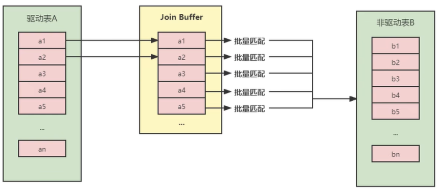


参数设置：

* block_nested_loop：通过`show variables like '%optimizer_switch%` 查看 `block_nested_loop`状态。默认是开启的。

* join_buffer_size：驱动表能不能一次加载完，要看join buffer能不能存储所有的数据，默认情况下`join_buffer_size=256k`。


#### 5. Join小结

1. **整体效率比较：INLJ > BNLJ > SNLJ**

2. 永远用小结果集驱动大结果集（其本质就是减少外层循环的数据数量）（小的度量单位指的是表行数 * 每行大小）

    ```sql
    select t1.b,t2.* from t1 straight_join t2 on (t1.b=t2.b) where t2.id<=100; # 推荐
    select t1.b,t2.* from t2 straight_join t1 on (t1.b=t2.b) where t2.id<=100; # 不推荐
    ```
    原因是第一条SQL语句只查询了t1中的一列字段，所以结果集更小，从而能加载仅join buffer的行数更多，因此t1更适合做驱动表。

3. 为被驱动表匹配的条件增加索引(减少被驱动表的循环匹配次数)

4. 增大join buffer size的大小（一次索引的数据越多，那么被驱动表的扫描次数就越少）

5. 减少驱动表不必要的字段查询（字段越少，join buffer所缓存的数据就越多）

#### 6. Hash Join

**从MySQL的8.0.20版本开始将废弃BNLJ，因为从MySQL8.0.18版本开始就加入了hash join，默认都会使用hash join**

* Nested Loop: 对于被连接的数据子集较小的情况，Nested Loop是个较好的选择。

* Hash Join是做`大数据集连接`时的常用方式，优化器使用两个表中相对较小的表利用Join Key在内存中建立`散列表`，然后扫描较大的表并探测散列表，找出与Hash表匹配的行。
  * 这种方式适合于较小的表完全可以放于内存中的情况，这样总成本就是访问两个表的成本之和。
  * 在表很大的情况下并不能完全放入内存，这时优化器会将它分割成`若干不同的分区`，不能放入内存的部分就把该分区写入磁盘的临时段，此时要求有较大的临时段从而尽量提高I/O的性能。
  * 它能够很好的工作于没有索引的大表和并行查询的环境中，并提供最好的性能。大多数人都说它是Join的重型升降机。Hash Join只能应用于等值连接（如WHERE A.COL1 = B.COL2），这是由Hash的特点决定的。


### 3.2 小结

* 保证被驱动表的JOIN字段已经创建了索引 
* 需要JOIN 的字段，数据类型保持绝对一致，防止类型转换导致的索引失效。 
* LEFT JOIN 时，选择小表作为驱动表，大表作为被驱动表，从而减少外层循环的次数。 
* INNER JOIN 时，MySQL会自动将小结果集的表选为驱动表。
* 能够直接多表关联的尽量直接关联，不用子查询。(减少查询的趟数) 
* 不建议使用子查询，建议将子查询SQL拆开结合程序多次查询，或使用 JOIN 来代替子查询。 
* 衍生表建不了索引

## 4. 子查询优化

子查询可以一次性完成很多逻辑上需要多个步骤才能完成的SQL操作。但是，**子查询的执行效率不高**。原因：

1. 执行子查询时，MySQL需要为内层查询语句的查询结果建立一个临时表，然后外层查询语句从临时表中查询记录。查询完毕后，再撤销这些临时表。这样会消耗过多的CPU和IO资源，产生大量的慢查询。
2. 子查询的结果集存储的临时表，不论是内存临时表还是磁盘临时表都不会存在索引，所以查询性能会受到一定的影响。
3. 对于返回结果集比较大的子查询，其对查询性能的影响也就越大。

**在MySQL中，可以使用连接（JOIN）查询来替代子查询**。连接查询 `不需要建立临时表` ，其 `速度比子查询` 要快，如果查询中使用索引的话，性能就会更好。

> 补充：尽量不要使用NOT IN或者NOT EXISTS，用LEFT JOIN xxx ON xx WHERE xx IS NULL替代

## 5. 排序优化

### 5.1 排序优化

在MySQL中，支持两种排序方式，分别是 `FileSort` 和 `Index` 排序。

* Index 排序中，索引可以保证数据的有序性，不需要再进行排序，`效率更高`。
* FileSort 排序则一般在 `内存中` 进行排序，占用`CPU较多`。如果待排结果较大，会产生临时文件 I/O 到磁盘进行排序的情况，效率较低。

**优化建议：**

1. SQL 中，可以在 WHERE 子句和 ORDER BY 子句中使用索引，目的是在 WHERE 子句中 `避免全表扫描` ，在 ORDER BY 子句 `避免使用 FileSort 排序`。当然，某些情况下全表扫描，或者 FileSort 排序不一定比索引慢。但总的来说，我们还是要避免，以提高查询效率。 
2. 尽量使用 Index 完成 ORDER BY 排序。如果 WHERE 和 ORDER BY 后面是相同的列就使用单索引列；如果不同就使用联合索引。 
3. 无法使用 Index 时，需要对 FileSort 方式进行调优。

### 5.2 一般经验

```sql
INDEX a_b_c(a,b,c)

以下 order by 能使用索引最左前缀
- ORDER BY a
- ORDER BY a,b
- ORDER BY a,b,c
- ORDER BY a DESC,b DESC,c DESC

如果WHERE使用索引的最左前缀定义为常量，则order by 能使用索引
- WHERE a = const ORDER BY b,c
- WHERE a = const AND b = const ORDER BY c
- WHERE a = const ORDER BY b,c
- WHERE a = const AND b > const ORDER BY b,c

以下不能使用索引进行排序
- ORDER BY a ASC,b DESC,c DESC /* 排序不一致 */
- WHERE g = const ORDER BY b,c /*丢失a索引*/
- WHERE a = const ORDER BY c /*丢失b索引*/
- WHERE a = const ORDER BY a,d /*d不是索引的一部分*/
- WHERE a in (...) ORDER BY b,c /*对于排序来说，多个相等条件也是范围查询*/

特殊情况：
# select列太多，可能会导致索引失效，因为回表操作需要大量IO。比如以下语句，可能就采用filesort
- SELECT * FROM student ORDER BY a,b
# 此时加上limit就可能让索引生效，因为数据量很小，回表操作不会耗费太多资源
- SELECT * FROM student ORDER BY a,b LIMIT 10
```

> 结论：
>
> 1. 多个索引同时存在，mysql自动选择最优的方案。但是，`随着数据量的变化，选择的索引也会随之变化的 `。 
> 2. **当【范围条件】和【group by 或者 order by】的字段出现二选一时，优先观察条件字段的过滤数量，如果过滤的数据足够多，而需要排序的数据并不多时，优先把索引放在范围字段上。反之，亦然。**
> 3. 尽量让where的过滤条件和排序使用上索引。但有时候即使排序字段有索引，优化器仍会使用filesort，这是因为where条件已经过滤掉了大部分的数据，剩下的几百几千条数据直接进行filesort排序并不是很消耗性能，反而可能比索引排序更快。


### 5.3 filesort算法：双路排序和单路排序

排序的字段若不在索引列上，则filesort会有两种算法：双路排序和单路排序

**双路排序（慢）**

* MySQL 4.1之前是使用双路排序 ，字面意思就是两次扫描磁盘，最终得到数据，读取行指针和 order by列 ，对他们进行排序，然后扫描已经排序好的列表，按照列表中的值重新从列表中读取对应的数据输出 
* 从磁盘取排序字段，在buffer进行排序，再从磁盘取其他字段。

取一批数据，要对磁盘进行两次扫描，众所周知，IO是很耗时的，所以在mysql4.1之后，出现了第二种改进的算法，就是单路排序。

**单路排序（快）**

从磁盘读取查询需要的`所有列`，按照order by列在buffer对它们进行排序，然后扫描排序后的列表进行输出，它的效率更快一些，避免了第二次读取数据。并且把随机IO变成了顺序IO，但是它会使用更多的空间，因为它把每一行都保存在内存中了。

**结论及引申出的问题**：单路排序总体而言好过双路。但是单路也会有一些问题：
* 在sort_buffer中，单路要比多路多占用很多空间，因为单路是把所有字段都取出，所以有可能取出的数据的总大小超出了`sort_buffer`的容量，导致每次只能取`sort_buffer`容量大小的数据，进行排序（创建tmp文件，多路合并），排完再取sort_buffer容量大小，再排...从而多次I/O。于是单路本来想省一次I/O操作，反而导致了大量的I/O操作，得不偿失。

**优化策略**

**1. 尝试提高sort_buffer_size**

**2. 尝试提高max_length_for_sort_data**：这个参数的含义是，如果需要返回的列的总长度大于这个数，就使用双路算法，否则使用单路算法。

**3. `Order by`时`select *` 是一个大忌，最好只Query需要的字段**。

## 6. GROUP BY优化

* group by 使用索引的原则几乎跟order by一致 ，group by 即使没有过滤条件用到索引，也可以直接使用索引。 
* group by 先排序再分组，遵照索引建的最佳左前缀法则 
* 当无法使用索引列，增大 max_length_for_sort_data 和 sort_buffer_size 参数的设置 
* where效率高于having，能写在where限定的条件就不要写在having中了 
* 减少使用order by，和业务沟通能不排序就不排序，或将排序放到程序端去做。Order by、group by、distinct这些语句较为耗费CPU，数据库的CPU资源是极其宝贵的。 
* 包含了order by、group by、distinct这些查询的语句，where条件过滤出来的结果集请保持在1000行以内，否则SQL会很慢。

## 7. 优化分页查询

一般分页查询时，通过创建覆盖索引能够比较好地提高性能。但一个常见的问题就是`limit 2000000, 10`，此时需要MySQL排序前2000010条记录，但仅仅返回2000000到2000010的记录，其他记录丢弃，查询排序的代价非常大。

**优化思路一**

在索引上完成排序分页操作，最后根据主键关联回原表查询所需要的其他列内容。

```sql
EXPLAIN SELECT * FROM student t,(SELECT id FROM student ORDER BY id LIMIT 2000000,10) a WHERE t.id = a.id;
```

**优化思路二**

该方案适用于主键自增的表，可以把limit查询转换成某个位置的查询。

```sql
EXPLAIN SELECT * FROM student WHERE id > 2000000 LIMIT 10;
```

## 8. 优先考虑覆盖索引

### 8.1 什么是覆盖索引

覆盖索引，简单说就是，`索引列+主键` 包含 `SELECT 到 FROM之间查询的列`，因此使用到覆盖索引，就无需回表。

**举例：**

```sql
CREATE INDEX idx_age_name ON student(age, NAME);
EXPLAIN SELECT id,age,NAME FROM student WHERE NAME LIKE '%abc';
```


虽然左模糊查询一般是不会用到索引的，但上述却使用到了索引，这正是因为优先满足了覆盖索引，无需回表的操作会使性能大大提升。

### 8.2 覆盖索引的利弊

**由于覆盖索引可以减少树的搜索次数，显著提升查询性能，所以使用覆盖索引是一个常用的性能优化手段**。

好处：
- 避免InnoDB表进行索引的回表：在覆盖索引中，二级索引的键值中可以获取所要的全部数据，避免了对主键的二次查询，减少了IO操作，提升了查询效率。
- 可以把磁盘的随机读取的IO变成索引查找的顺序IO

弊端：
- 索引字段的维护是有代价的。因此，在建立冗余索引来支持覆盖索引时就需要权衡考虑。

## 9. 如何给字符串添加索引

### 9.1 前缀索引

MySQL是支持前缀索引的。默认地，如果你创建索引的语句不指定前缀长度，那么索引就会包含整个字符串。

```sql
mysql> alter table teacher add index index1(email);
#如下使用前缀索引
mysql> alter table teacher add index index2(email(6));
```

下图就是这两个索引的数据结构示意图。

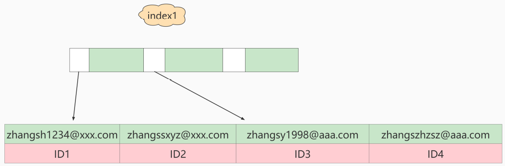

以及

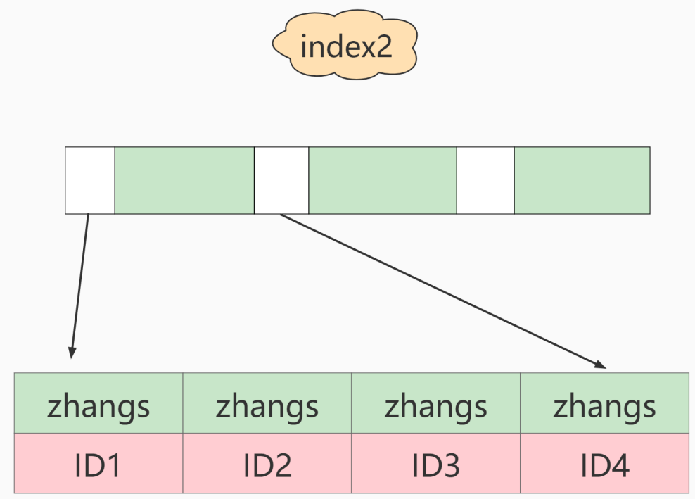

**如果使用的是index1**（即email整个字符串的索引结构），执行顺序是这样的：

1. 从index1索引树找到满足索引值是`zhangssxyz@xxx.com`的这条记录，取得ID2的值； 
2. 到主键上查到主键值是ID2的行，判断email的值是正确的，将这行记录加入结果集； 
3. 取index1索引树上刚刚查到的位置的下一条记录，发现已经不满足`email='zhangssxyz@xxx.com'`的条件了，循环结束。

这个过程中，只需要回主键索引取一次数据，所以系统认为只扫描了一行。

**如果使用的是index2**（即email(6)索引结构），执行顺序是这样的：

1. 从index2索引树找到满足索引值是`zhangs`的记录，找到的第一个是ID1； 
2. 到主键上查到主键值是ID1的行，判断出email的值不是 `zhangssxyz@xxx.com`，这行记录丢弃； 
3. 取index2上刚刚查到的位置的下一条记录，发现仍然是`zhangs`，取出ID2，再到ID索引上取整行然后判断，这次值对了，将这行记录加入结果集； 
4. 重复上一步，直到在index2上取到的值不是`zhangs`时，循环结束。

也就是说**使用前缀索引，定义好长度，就可以做到既节省空间，又不用额外增加太多的查询成本**。前面已经讲过区分度，区分度越高越好。因为区分度越高，意味着重复的键值越少。

### 9.2 前缀索引对覆盖索引的影响

> 结论：使用前缀索引就用不上覆盖索引对查询性能的优化了，这也是你在选择是否使用前缀索引时需要考虑的一个因素。

## 10. 索引条件下推

### 10.1 ICP的定义

有些搜索条件中虽然出现了索引列，但却不能使用到索引，比如下边这个查询：

```sql
# 假设有一个联合索引(key1, key2)
SELECT * FROM s1 WHERE key1 > 'z' AND key2 LIKE '%a';
```
其中`key1 > 'z'`可以用到索引，但`key2 LIKE '%a'`却无法使用到索引(左模糊查询)。以前版本的MySQL，会按以下步骤来查询：
- 先根据`key1 > 'z'`定位到对应的二级索引的叶子节点
- 然后根据主键值进行回表，找到完整的用户记录再检测该记录是否符合`key2 LIKE '%a'`这个条件。

但我们注意到`key2 LIKE '%a'`这个条件虽然不能组成范围区间参与range访问方法的执行，但这个key2毕竟也在(key1,key2)的索引树中，所以现在MySQL会使用以下步骤进行优化：
- 先根据`key1 > 'z'`定位到对应的二级索引的叶子节点
- 对于指定的二级索引记录，先不急着回表，而是先检测一下该记录是否满足`key2 LIKE '%a'`这个条件
- 对于满足`key2 LIKE '%a'`条件的二级索引记录再进行回表操作

注意到回表操作其实是一个随机IO，非常耗时，所以这种修改虽然只改进了一点点，但是可以省去很多回表操作。MySQL把这个改进称之为**索引条件下推**(Index Condition Pushdown)。如果在查询语句中使用了索引条件下推这个特性，就会在Extra列中显示`Using index condition`。

Index Condition Pushdown(ICP)是MySQL 5.6中新特性，是一种在存储引擎层使用索引过滤数据的一种优化方式。注意，ICP的加速效果取决于在存储引擎内通过ICP筛选掉的数据的比例。

### 10.2 ICP的使用条件

1. 如果表的访问类型为range、ref、eq_ref、ref_or_null可以使用ICP。
2. ICP可以使用`InnDB`和`MyISAM`表，包括分区表 `InnoDB` 和 `MyISAM` 表
3. 对于`InnoDB`表，ICP仅用于`二级索引`。因为ICP的目标是减少全行读取次数，从而减少I/O操作，即减少回表的I/O操作，所以如果都没有回表操作，自然也不会有ICP(因此聚簇索引不会有ICP)。
4. 当SQL使用覆盖索引时，就不会有ICP，因为这种情况下没有回表操作。
5. 相关子查询的条件不能使用ICP

## 11. 普通索引 vs 唯一索引

从性能的角度考虑，你选择唯一索引还是普通索引呢？

假设，我们有一个主键列为id的表，表中有字段k，并且在k上有索引，假设字段 k 上的值都不重复。

### 11.1 查询过程

假设，执行查询的语句是 select id from test where k=5;

* 对于普通索引来说，查找到满足条件的第一个记录(5,500)后，需要查找下一个记录，直到碰到第一个不满足k=5条件的记录。 
* 对于唯一索引来说，由于索引定义了唯一性，查找到第一个满足条件的记录后，就会停止继续检索。

事实上，这个不同带来的性能差距微乎其微。

### 11.2 更新过程

为了说明普通索引和唯一索引对更新语句性能的影响，我们首先介绍一下change buffer。

当需要更新一个数据页时，如果数据页在内存中就直接更新，而如果这个数据页还没有在内存中的话， 在不影响数据一致性的前提下， `InooDB会将这些更新操作缓存在change buffer中` ，这样就不需要从磁盘中读入这个数据页了。在下次查询需要访问这个数据页的时候，将数据页读入内存，然后执行change buffer中与这个页有关的操作。通过这种方式就能保证这个数据逻辑的正确性。

将change buffer中的操作应用到原数据页，得到最新结果的过程称为 `merge` 。除了 `访问这个数据页` 会触发merge外，系统有 `后台线程会定期` merge。在 `数据库正常关闭（shutdown）` 的过程中，也会执行merge 操作。

如果能够将更新操作先记录在change buffer， `减少读磁盘` ，语句的执行速度会得到明显的提升。而且， 数据读入内存是需要占用 buffer pool 的，所以这种方式还能够 `避免占用内存 `，提高内存利用率。

**唯一索引的更新就不能使用change buffer ，实际上也只有普通索引可以使用**。

### 11.3 change buffer的使用场景

1. 普通索引和唯一索引应该怎么选择？其实，这两类索引**在查询能力上是没差别的**，主要考虑的是对**更新性能**的影响。所以，建议**尽量选择普通索引**。 
2. 在实际使用中会发现， 普通索引 和 change buffer 的配合使用，对于 `数据量大` 的表的更新优化还是很明显的。 
3. 如果所有的更新后面，都马上 `伴随着对这个记录的查询` ，那么你应该 `关闭change buffer` 。而在其他情况下，change buffer都能提升更新性能。 
4. 由于唯一索引用不上change buffer的优化机制，因此如果业务可以接受，从性能角度出发建议优先考虑非唯一索引。但是如果"业务可能无法确保唯一性"的情况下，怎么处理呢？ 
   * 首先， 业务正确性优先 。我们的前提是“业务代码已经保证不会写入重复数据”的情况下，讨论性能问题。如果业务不能保证，或者业务就是要求数据库来做约束，那么没得选，`必须创建唯一索引`。
   * 然后，在一些`归档库`的场景，你是可以考虑使用普通索引的。比如，线上数据只需要保留半年，然后历史数据保存在归档库。这时候，归档数据已经是确保没有唯一键冲突了。要提高归档效率，可以考虑把表里面的唯一索引改成普通索引。

## 12. 其它查询优化策略

### 12.1 EXISTS 和 IN 的区分

**问题**：哪种情况下应该使用 EXISTS，哪种情况应该用 IN。

**回答**：我们首先保证有索引的前提，其次选择与否还是要看表的大小，选择标准就是`小表驱动大表`，因为这种方式下效率是最高的。例如：

```sql
SELECT * FROM A WHERE cc IN (SELECT cc FROM B);
SELECT * FROM A WHERE EXISTS (SELECT cc FROM B WHERE B.cc = A.cc);
```

当A小于B时，用EXISTS，因为EXISTS的实现逻辑相当于外表循环：
```java
for i in A
  for j in B
    if j.cc == i.cc then ...
```

当B小于A时，用IN，因为`cc IN (10, 20, 30)`本质上就是`cc = 10 OR cc = 20 OR cc = 30`，所以IN的实现逻辑类似于：
```java
for i in B
  for j in A
    if j.cc == i.cc then ...
```

### 12.2 COUNT(*)与COUNT(具体字段)效率

**问题**：在 MySQL 中统计数据表的行数，可以使用三种方式： `SELECT COUNT(*)` 、 `SELECT COUNT(1)` 和 `SELECT COUNT(具体字段)`，使用这三者之间的查询效率是怎样的？

**回答**：前提：如果要统计的是某个字段的非空数据行数，则另当别论，毕竟比较执行效率的前提是结果一样才可以。

1. `COUNT(*)`和`COUNT(1)`都是对所有结果进行COUNT，两者没有本质区别(执行效率几乎可以看成是相等的)。如果有WHERE子句，则是对所有符合筛选条件的数据进行统计；如果没有没有WHERE子句，则是对数据表的数据行数进行统计。
2. 如果是MyISAM存储引擎，统计数据表的行数只需要`O(1)`的复杂度，这是因为每张MyISAM的数据表都有一个meta信息存储了row_count值，而一致性则由表级锁来保证；如果是InnoDB存储引擎，因为InnoDB支持事务，采用行级锁和MVCC机制，所以无法像MyISAM一样维护一个row_count变量，因此需要`全表扫描`，是`O(n)`的复杂度。
3. 在InnoDB引擎中，如果采用`COUNT(具体字段)`来统计数据行数，要尽量采用`二级索引`。因为主键采用的是聚簇索引，包含的信息太多，降低统计效率。而对于`COUNT(*)`和`COUNT(1)`来说，系统会自动采用占用空间更小的二级索引来进行统计，具体而言：如果有多个二级索引，会使用key_len较小的二级索引进行扫描，只有当没有二级索引时，才会采用主键索引来进行统计。

### 12.3 关于`SELECT(*)`

**在表查询中，建议明确字段，不要使用`*`作为查询的字段列表，推荐使用`SELECT <字段列表> 查询`**。原因： 

1. MySQL 在解析的过程中，会通过查询数据字典 将`*`按序转换成所有列名，这会大大的耗费资源和时间。 
2. 无法使用`覆盖索引`，因为一般不可能使用表中的全部字段来建立一个聚簇索引。
3. `SELECT *`可能不会使用索引，因为它是否使用索引是由优化器决定，优化器底层会认为：**如果查询的结果集超过了总行数的25%，就没必要使用索引了**。

### 12.4 LIMIT 1 对优化的影响

针对的是会扫描全表的 SQL 语句，如果你可以确定结果集只有一条，那么加上 `LIMIT 1` 的时候，当找到一条结果的时候就不会继续扫描了，这样会加快查询速度。

如果数据表已经对字段建立了唯一索引，那么可以通过索引进行查询，不会全表扫描的话，就不需要加上 LIMIT 1 了。

### 12.5 多使用COMMIT

只要有可能，在程序中尽量多使用 COMMIT，这样程序的性能得到提高，需求也会因为 COMMIT 所释放的资源而减少。

使用 COMMIT 后所释放的资源： 

* 回滚段上用于恢复数据的信息 
* 被程序语句获得的锁 
* redo / undo log buffer 中的空间 
* 管理上述 3 种资源中的内部花费

## 13. 淘宝数据库，主键如何设计的？

### 13.1 自增ID做主键的问题

自增ID做主键，简单易懂，几乎所有数据库都支持自增类型，只是实现上各自有所不同而已。自增ID除了简单，其他都是缺点，总体来看存在以下几方面的问题：

1. **可靠性不高**：存在自增ID回溯的问题，这个问题直到最新版本的MySQL 8.0才修复。 
2. **安全性不高**：对外暴露的接口可以非常容易猜测对应的信息。比如：/User/1/这样的接口，可以非常容易猜测用户ID的值为多少，总用户数量有多少，也可以非常容易地通过接口进行数据的爬取。 
3. **性能差**：自增ID的性能较差，需要在数据库服务器端生成。 
4. **交互多**：业务还需要额外执行一次类似 last_insert_id() 的函数才能知道刚才插入的自增值，这需要多一次的网络交互。在海量并发的系统中，多1条SQL，就多一次性能上的开销。 
5. **局部唯一性**：最重要的一点，自增ID是局部唯一，只在当前数据库实例中唯一，而不是全局唯一，在任意服务器间都是唯一的。对于目前分布式系统来说，这简直就是噩梦。

### 13.2 业务字段做主键的问题

**选择卡号做主键**

问题：会员卡号可能存在重复使用的情况。比如，张三退了会员卡，但是商家不想让这个会员卡空着，就把该卡号是分配给了王五。然而再另一张消费记录表中，原本是张三的消费记录，现在反而变成是王五的了，这就导致了很严重的问题。

**选择电话或身份证号做主键**

电话也不可以做主键，因为手机号也存在被运营商收回，重新发给别人用的情况。而身份证号属于个人隐私，顾客都不一定愿意给你。

**所以，建议尽量不要用跟业务有关的字段做主键。**

### 13.3 淘宝的主键设计

淘宝的订单ID是：

```sql
订单ID = 时间 + 去重字段 + 用户ID后6位尾号
```

这样的设计能做到全局唯一，且对分布式系统查询及其友好。

### 13.4 推荐的主键设计

**非核心业务** ：对应表的主键自增ID，如告警、日志、监控等信息。

**核心业务** ：`主键设计至少应该是全局唯一且是单调递增`。全局唯一保证在各系统之间都是唯一的，单调递增是希望插入时不影响数据库性能。

这里推荐最简单的一种主键设计：**UUID**。

**UUID的特点**：全局唯一，占用36字节，数据无序，插入性能差。

**认识UUID：**

MySQL数据库的UUID组成如下所示：

```sql
UUID = 时间+UUID版本（16字节）- 时钟序列（4字节） - MAC地址（12字节）
```

我们以UUID值e0ea12d4-6473-11eb-943c-00155dbaa39d举例：


`为什么UUID是全局唯一的？`

在UUID中时间部分占用60位，存储的类似TIMESTAMP的时间戳，但表示的是从1582-10-15 00：00：00.00 到现在的100ns的计数。可以看到UUID存储的时间精度比TIMESTAMPE更高，时间维度发生重复的概率降 低到1/100ns。

时钟序列是为了避免时钟被回拨导致产生时间重复的可能性。MAC地址用于全局唯一。

`为什么UUID占用36个字节？`

UUID根据字符串进行存储，设计时还带有无用"-"字符串，因此总共需要36个字节。

`为什么UUID是随机无序的呢？`

因为UUID的设计中，将时间低位(如纳秒数)放在最前面，而这部分的数据是一直在循环变化的，并且是无序。

**改造UUID**

若将时间高低位互换，则时间就是单调递增的了，也就变得单调递增了。MySQL 8.0可以更换时间低位和时间高位的存储方式，这样UUID就是有序的UUID了。

MySQL 8.0还解决了UUID存在的空间占用的问题，除去了UUID字符串中无意义的"-"字符串，并且将字符串用二进制类型保存，这样存储空间降低为了16字节。

可以通过MySQL8.0提供的uuid_to_bin函数实现上述功能，同样的，MySQL也提供了bin_to_uuid函数进行转化：

```sql
SET @uuid = UUID();
SELECT @uuid,uuid_to_bin(@uuid),uuid_to_bin(@uuid,TRUE);
```


**通过函数uuid_to_bin(@uuid,true)将UUID转化为有序UUID了**。全局唯一且单调递增，这正是我们想要的主键。而且在实际业务使用中有序UUID在 `业务端就可以生成`，还可以进一步减少SQL的交互次数。


> 总结：在当今的互联网环境中，非常不推荐自增ID作为主键的数据库设计。更推荐类似有序UUID的全局唯一的实现。 
>
> 另外在真实的业务系统中，主键还可以加入业务和系统属性，如用户的尾号，机房的信息等。这样的主键设计就更为考验架构师的水平了。

# 第11章_数据库的设计规范

## 1. 范式

良好的数据库设计有以下优点：

- 节省数据的存储空间
- 能够保证数据的完整性
- 方便进行数据库应用系统的开发

总之，开始设置数据库的时候，我们就需要重视数据库表的设计。为了建立`冗余较小`、`结构合理`的数据库，设计数据库时必须遵循一定的规则。

### 1.1 范式简介

**在关系型数据库中，关于数据表设计的基本原则、规则就称为范式**。

目前关系型数据库有六种常见范式，按照范式级别，从低到高分别是：第一范式（1NF）、第二范式 （2NF）、第三范式（3NF）、巴斯-科德范式（BCNF）、第四范式（4NF）和第五范式（5NF，又称完美范式）。

数据库的范式设计越高阶，冗余度就越低，同时高阶的范式一定符合低阶范式的要求，满足最低要求的范式是第一范式（1NF）。在第一范式的基础上进一步满足更多规范的要求称为第二范式（2NF），其余范式以此类推。

一般来说，在关系型数据库设计中，最高也就遵循到`BCNF`, 普遍还是`3NF`。但也不绝对，有时候为了提高某些查询性能，我们还需要破坏范式规则，也就是`反范式化`。

### 1.2 键和相关属性的概念

范式的定义会使用到主键和候选键，数据表中的键由一个或者多个属性组成。数据表中常用的几种键和属性的定义：

- 超键：能唯一标识元组的属性集叫作超键
- 候选键：如果超键不包括多余的属性，那么这个超键就是候选键
- 主键：用户可以从候选键中选择一个作为主键
- 外键：如果数据表R1中的某属性集不是R1的主键，而是另一个数据表R2的主键，那么这个属性集就是数据表R1的外键
- 主属性：包含在任一候选键中的属性称为主属性
- 非主属性：与主属性相对，指的是不包含在任何一个候选键中的属性

**举例:**

`球员表(player)` ：球员编号 | 姓名 | 身份证号 | 年龄 | 球队编号 

`球队表(team) `：球队编号 | 主教练 | 球队所在地

* 超键 ：对于球员表来说，超键就是包括球员编号或者身份证号的任意组合，比如（球员编号）（球员编号，姓名）（身份证号，年龄）等。 
* 候选键 ：就是最小的超键，对于球员表来说，候选键就是（球员编号）或者（身份证号）。 
* 主键 ：我们自己选定，也就是从候选键中选择一个，比如（球员编号）。 
* 外键 ：球员表中的球队编号。 
* 主属性 、 非主属性 ：在球员表中，主属性是（球员编号）（身份证号），其他的属性（姓名）（年龄）（球队编号）都是非主属性。

## 2. 第一、第二、第三范式

### 2.1 第一范式(1st NF)

第一范式主要确保数据库中每个字段的值必须具有`原子性`，也就是说数据表中每个字段的值为`不可再次拆分`的最小数据单元。事实上，任何的DBMS都会满足第一范式的要求，不会将字段进行拆分。

**举例1：**

假设一家公司要存储员工的姓名和联系方式。它创建一个如下表：

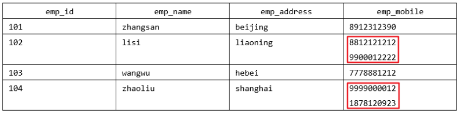

该表不符合 1NF ，因为规则说“表的每个属性必须具有原子（单个）值”，lisi和zhaoliu员工的 emp_mobile 值违反了该规则。为了使表符合 1NF ，我们应该有如下表数据：

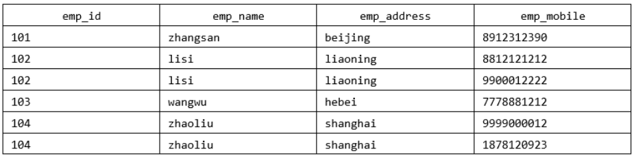

**举例2：**

user 表的设计不符合第一范式


其中，user_info字段为用户信息，可以进一步拆分成更小粒度的字段，不符合数据库设计对第一范式的要求。将user_info拆分后如下：


**举例3：**

属性的原子性是`主观的`。例如，Employees表中地址应当使用1个（地址）还是3个（省、市、街道）属性表示呢？答案取决于应用程序。如果应用程序需要分别处理地址的各个具体部分（如：用于搜索目的），则有必要把它们分开。否则，不需要。

表1：


表2：


### 2.2 第二范式(2nd NF)

第二范式要求，在满足第一范式的基础上，还要**满足数据库里的每一条数据记录，都是可唯一标识的。而且所有非主键字段，都必须完全依赖主键，不能只依赖主键的一部分**。（要求中的主键，其实可以扩展替换为候选键）

**举例1：**

`成绩表` （学号，课程号，成绩）关系中，（学号，课程号）可以决定成绩，但是学号不能决定成绩，课程号也不能决定成绩，所以“（学号，课程号）→成绩”就是 `完全依赖关系` 。

**举例2：**

`比赛表 player_game`，里面包含球员编号、姓名、年龄、比赛编号、比赛时间和比赛场地等属性，这里候选键和主键都为（球员编号，比赛编号），我们可以通过候选键（或主键）来决定如下的关系：

```sql
(球员编号, 比赛编号) → (姓名, 年龄, 比赛时间, 比赛场地，得分)
```

但是这个数据表不满足第二范式，因为数据表中的字段之间还存在着如下的对应关系：

```sql
(球员编号) → (姓名，年龄)

(比赛编号) → (比赛时间, 比赛场地)
```

对于非主属性来说，并非完全依赖候选键。这样会产生怎样的问题呢？

1. `数据冗余` ：如果一个球员可以参加 m 场比赛，那么球员的姓名和年龄就重复了 m-1 次。一个比赛也可能会有 n 个球员参加，比赛的时间和地点就重复了 n-1 次。 
2. `插入异常` ：如果我们想要添加一场新的比赛，但是这时还没有确定参加的球员都有谁，那么就没法插入。 
3. `删除异常` ：如果我要删除某个球员编号，如果没有单独保存比赛表的话，就会同时把比赛信息删除掉。 
4. `更新异常` ：如果我们调整了某个比赛的时间，那么数据表中所有这个比赛的时间都需要进行调整，否则就会出现一场比赛时间不同的情况。

为了避免出现上述的情况，我们可以把球员比赛表设计为下面的三张表：


这样的话，每张数据表都符合第二范式，也就避免了异常情况的发生。

> 1NF 告诉我们字段属性需要是原子性的，而 2NF 告诉我们一张表只表达一个意思。

### 2.3 第三范式(3rd NF)

第三范式是在第二范式的基础上，确保数据表中的每一个非主键字段都和主键字段直接相关，也就是说，**要求数据表中的所有非主键字段不能依赖于其他非主键字段**。通俗地讲，该规则的意思是所有`非主键属性`之间不能有依赖关系，必须`相互独立`。（这里的主键可以扩展为候选键）

**举例1：**

`部门信息表` ：每个部门有部门编号（dept_id）、部门名称、部门简介等信息。

`员工信息表 `：每个员工有员工编号、姓名、部门编号。列出部门编号后就不能再将部门名称、部门简介等与部门有关的信息再加入员工信息表中，否则就违反了第三范式(因为主键是员工编号，而部门名称则依赖于部门编号，所以是间接依赖于员工编号的)。


> 2NF和3NF通常以这句话概括：“每个非键属性依赖于键，依赖于整个键，并且除了键别无他物”。这里的键指的是主键。

### 2.4 小结

关于数据表的设计，有三个范式要遵循：

- 第一范式：确保每列保持`原子性`
- 第二范式：确保每列都和主键`完全依赖`
- 第三范式：确保每列都和主键列`直接相关`，而不是间接相关

**范式的优点**：有助于消除数据库中的`数据冗余`，第三范式通常被认为在性能、扩展性和数据完整性方面达到了最好的平衡。

**范式的缺点**：范式的使用，可能`降低查询的效率`，因为范式等级越高、设计出来的数据表就越多越精细、数据的冗余度就越低，从而进行数据查询时就可能需要`关联多张表`，这不但代价昂贵，也可能使一些`索引失效`。

**总结**：范式只是提出了设计的标准，没有完美的设计，只有合适的设计，开发中我们有时为了性能和读取效率会违反范式的原则，通过`增加少量的冗余`来提高数据库的`读性能`，减少关联查询的次数，实现`空间换取时间`的目的。

## 3. 反范式化

### 3.1 概述

有的时候不能简单按照范式要求设计数据表，因为有的数据看似冗余，其实对业务来说十分重要。我们要遵循`业务优先`的原则，首先满足业务需要，再尽量减少冗余。

如果我们想对查询效率进行优化，`反范式化`就是一种优化思路，此时，可以通过在数据表中`增加冗余字段`来提高数据库的读性能。

**举例：**

员工的信息存储在 `employees 表` 中，部门信息存储在 `departments 表` 中。通过 employees 表中的 department_id字段与 departments 表建立关联关系。如果要查询一个员工所在部门的名称：

```sql
select employee_id,department_name
from employees e join departments d
on e.department_id = d.department_id;
```

如果经常需要进行这个操作，连接查询就会浪费很多时间。可以在 employees 表中增加一个冗余字段 department_name，这样就不用每次都进行连接操作了。

### 3.2 反范式的新问题

* 存储空间变大了 
* 一个表中字段做了修改，另一个表中冗余的字段也需要做同步修改，否则 `数据不一致` 
* 若采用存储过程来支持数据的更新、删除等额外操作，如果更新频繁，会非常消耗系统资源 
* 在 `数据量小` 的情况下，反范式不能体现性能的优势，可能还会让数据库的设计更加复杂

### 3.3 反范式的适用场景

当冗余信息有价值或者能 `大幅度提高查询效率` 的时候，我们才会采取反范式的优化。

#### 1. 增加冗余字段的建议

增加冗余字段一定要符合如下两个条件，只有满足这两个条件，才可以考虑增加冗余字段：

- 这个冗余字段`不需要经常进行修改`
- 这个冗余字段`查询的时候不可或缺`

#### 2. 历史快照、历史数据的需要

在现实生活中，我们经常需要一些冗余信息，比如订单中的收货人信息，包括姓名、电话和地址等。每次发生的 `订单收货信息` 都属于 `历史快照` ，需要进行保存，但用户可以随时修改自己的信息，这时保存这些冗余信息(订单收货信息)是非常有必要的。

反范式优化也常用在 `数据仓库` 的设计中，因为数据仓库通常`存储历史数据` ，对增删改的实时性要求不强，对历史数据的分析需求强。这时适当允许数据的冗余度，更方便进行数据分析。

## 4. 巴斯、第四、第五、域键范式

### 4.1 巴斯范式(BCNF)

人们在3NF的基础上进行了改进，提出了`巴斯范式（BCNF）`，也叫巴斯-科德范式（Boyce-Codd Normal Form）。BCNF没有新的设计规范加入，只是对第三范式中设计规范要求更强，使得数据库冗余度更小。所以，称为是`修正的第三范式`，或`扩充的第三范式`。

**若一个关系达到了第三范式，并且它只有一个候选键，或者它的每个候选键都是单属性，则自然达到BC范式**。

一般来说，一个数据库设符合3NF或者BCNF就可以了。

**举例**：

有一个 `学生导师表` ，其中包含字段：学生ID，专业，导师，专业GPA，这其中学生ID和专业是联合主键。

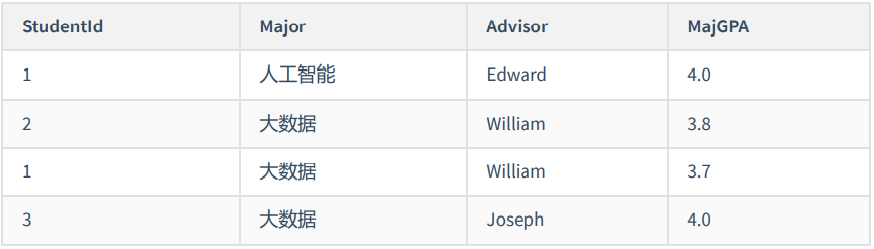

这个表的设计满足三范式，但是这里存在另一个依赖关系，“专业”依赖于“导师”，也就是说每个导师只做一个专业方面的导师，只要知道了是哪个导师，我们自然就知道是哪个专业的了。

所以这个表的部分主键Major依赖于非主键属性Advisor，那么我们可以进行以下的调整，拆分成2个表：

学生导师表：

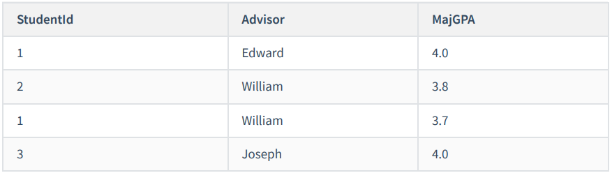

导师表：


### 4.2 第四范式

多值依赖的概念：

* `多值依赖`即属性之间的一对多关系，记为K—>—>A。
* `函数依赖`事实上是单值依赖，所以不能表达属性值之间的一对多关系。
* `平凡的多值依赖`：全集U=K+A，一个K可以对应于多个A，即K—>—>A。此时整个表就是一组一对多关系。
* `非平凡的多值依赖`：全集U=K+A+B，一个K可以对应于多个A，也可以对应于多个B，A与B相互独立，即K—>—>A，K—>—>B。整个表有多组一对多关系，且有："一"部分是相同的属性集合，“多”部分是相互独立的属性集合。

**第四范式即在满足巴斯范式（BCNF）的基础上，消除非平凡且非函数依赖的多值依赖（即把同一表的多对多关系删除）**。

**举例**：职工表(职工编号，职工孩子姓名，职工选修课程)

在这个表中，同一个职工可能会有多个职工孩子姓名。同样，同一个职工也可能会有多个职工选修课程，即这里存在着多值事实，不符合第四范式。

如果要符合第四范式，只需要将上表分为两个表，使它们只有一个多值事实，例如： `职工表一` (职工编号，职工孩子姓名)， `职工表二`(职工编号，职工选修课程)，两个表都只有一个多值事实，所以符合第四范式。

### 4.3 第五范式、域键范式

除了第四范式外，我们还有更高级的第五范式（又称完美范式）和域键范式（DKNF）。

在满足第四范式（4NF）的基础上，消除不是由候选键所蕴含的连接依赖。**如果关系模式R中的每一个连接依赖均由R的候选键所隐含**，则称此关系模式符合第五范式。

函数依赖是多值依赖的一种特殊的情况，而多值依赖实际上是连接依赖的一种特殊情况。但连接依赖不像函数依赖和多值依赖可以由 `语义直接导出` ，而是在 `关系连接运算` 时才反映出来。存在连接依赖的关系模式仍可能遇到数据冗余及插入、修改、删除异常等问题。

第五范式处理的是 `无损连接问题` ，这个范式基本 `没有实际意义` ，因为无损连接很少出现，而且难以察觉。而域键范式试图定义一个 `终极范式` ，该范式考虑所有的依赖和约束类型，但是实用价值也是最小的，只存在理论研究中。

## 5. ER模型

ER模型也叫作`实体关系模型`，是用来描述事物、事物的属性、事物之间的关系的一种数据模型。在开发基于数据库的信息系统的设计阶段，通常使用ER模型来描述信息需求和信息特性，帮助我们理清业务逻辑，从而设计出优秀的数据库。

### 5.1 ER模型的要素

**ER 模型中有三个要素，分别是实体、属性和关系。**

`实体` ，可以看做是数据对象，往往对应于现实生活中的真实存在的个体。在 ER 模型中，用 `矩形` 来表示。实体分为两类，分别是 `强实体` 和 `弱实体` 。强实体是指不依赖于其他实体的实体；弱实体是指对另一个实体有很强的依赖关系的实体。

`属性` ，则是指实体的特性。在 ER 模型中用 `椭圆形` 来表示。

`关系` ，则是指实体之间的联系。在 ER 模型中用 `菱形` 来表示。

### 5.2 关系的类型

在 ER 模型的 3 个要素中，关系又可以分为 3 种类型，分别是 `一对一`、`一对多`、`多对多`。

`一对一` ：指实体之间的关系是一一对应的。

`一对多` ：指一边的实体通过关系，可以对应多个另外一边的实体。相反，另外一边的实体通过这个关系，则只能对应唯一的一边的实体。

`多对多` ：指关系两边的实体都可以通过关系对应多个对方的实体。比如一个选课表，有许多科目，每个科目有很多学生选，而每个学生又可以选择多个科目，这就是多对多的关系。

### 5.3 ER模型举例

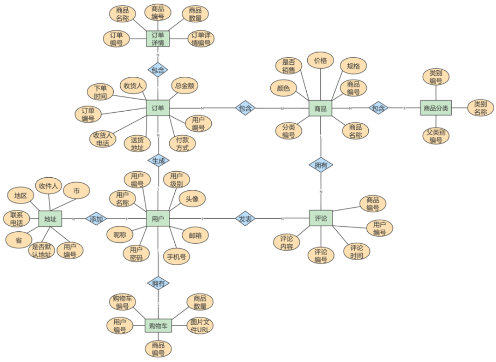

### 5.4 ER模型图转换成数据表

转换的原则：

（1）一个 `实体` 通常转换成一个 `数据表` ； 

（2）一个 `多对多的关系` ，通常也转换成一个 `数据表` (即中间表)； 

（3）一个 `1 对 1` ，或者 `1 对多` 的关系，往往通过表的 `外键` 来表达，而不是设计一个新的数据表(注意实际的开发中，一般不使用外键，因为会影响数据库性能，所以通常在应用层面做数据的`一致性检查`)； 

（4） `属性` 转换成表的 `字段` 。

## 6. 数据表的设计原则

综合以上内容，总结出数据表设计的一般原则："三少一多"

- 数据表的个数越少越好
- 数据表中的字段个数越少越好
- 数据表中联合主键的字段个数越少越好
- 使用主键和外部关系越多越好

"三少一多"原则的核心就是`简单可复用`。简单指的是用更少的表、更少的字段、更少的联合主键字段来完成数据表的设计，而可复用指的是通过主键、外部关系的使用来增强数据表之间的复用率。

> 注意：这个原则并不是绝对的，有时候我们需要增加数据的冗余度来换取数据处理的效率。

## 7. 数据库对象编写建议

### 7.1 关于库

1. 【强制】库的名称必须控制在32个字符以内，只能使用英文字母、数字和下划线，建议以英文字母开头。 
2. 【强制】库名英文 `一律小写` ，不同单词采用 `下划线` 分割。须见名知意。 
3. 【强制】库的名称格式：`业务系统名称_子系统名`。
4. 【强制】库名禁止使用关键字（如type,order等）。
5. 【强制】创建数据库时必须 `显式指定字符集` ，并且字符集只能是`utf8`或者`utf8mb4`。创建数据库SQL举例：`CREATE DATABASE crm_fund DEFAULT CHARACTER SET 'utf8' ;` 
6. 【建议】对于程序连接数据库账号，遵循 `权限最小原则` 使用数据库账号只能在一个DB下使用，不准跨库。程序使用的账号 `原则上不准有drop权限` 。 
7. 【建议】临时库以 `tmp_` 为前缀，并以日期为后缀；备份库以 `bak_` 为前缀，并以日期为后缀。

### 7.2 关于表、列

1. 【强制】表和列的名称必须控制在32个字符以内，表名只能使用英文字母、数字和下划线，建议以英文字母开头 。 
2. 【强制】`表名、列名一律小写`，不同单词采用`下划线`分割。须见名知意。 
3. 【强制】表名要求与模块名强相关，同一模块的表名尽量使用 `统一前缀` 。比如：crm_fund_item 
4. 【强制】创建表时必须 `显式指定字符集` 为`utf8`或`utf8mb4`。 
5. 【强制】表名、列名禁止使用关键字（如type,order等）。 
6. 【强制】创建表时必须 `显式指定表存储引擎` 类型。如无特殊需求，一律为`InnoDB`。 
7. 【强制】建表必须有comment。 
8. 【强制】字段命名应尽可能使用表达实际含义的英文单词或 `缩写`。如：公司 ID，不要使用 corporation_id, 而用corp_id 即可。 
9. 【强制】布尔值类型的字段命名为 `is_描述` 。如member表上表示是否为enabled的会员的字段命名为 is_enabled。 
10. 【强制】禁止在数据库中存储图片、文件等大的二进制数据。通常文件很大，短时间内造成数据量快速增长，数据库进行数据库读取时，通常会进行大量的随机IO操作，文件很大时，IO操作很耗时。通常存储于文件服务器，数据库只存储文件地址信息。 
11. 【建议】建表时关于主键：表必须有主键

     (1)强制要求主键为id，类型为int或bigint，且为 `auto_increment` 建议使用unsigned无符号型。

     (2)标识表里每一行主体的字段不要设为主键，建议设为其他字段如user_id，order_id等，并建立unique key索引。因为如果设为主键且主键值为随机插入，则会导致innodb内部页分裂和大量随机I/O，性能下降。 
12. 【建议】核心表（如用户表）必须有行数据的创建时间字段（create_time）和 最后更新时间字段（update_time），便于查问题。 
13. 【建议】表中所有字段尽量都是 `NOT NULL` 属性，业务可以根据需要定义 `DEFAULT值` 。 因为使用 NULL值会存在每一行都会占用额外存储空间、数据迁移容易出错、聚合函数计算结果偏差等问题。 
14. 【建议】所有存储相同数据的 `列名和列类型必须一致` （一般作为关联列，如果查询时关联列类型不一致会自动进行数据类型隐式转换，会造成列上的索引失效，导致查询效率降低）。 
15. 【建议】中间表（或临时表）用于保留中间结果集，名称以 `tmp_` 开头。 备份表用于备份或抓取源表快照，名称以 `bak_` 开头。中间表和备份表定期清理。 
16. 【示范】一个较为规范的建表语句：

```sql
CREATE TABLE user_info (
`id` int unsigned NOT NULL AUTO_INCREMENT COMMENT '自增主键',
`user_id` bigint(11) NOT NULL COMMENT '用户id',
`username` varchar(45) NOT NULL COMMENT '真实姓名',
`email` varchar(30) NOT NULL COMMENT '用户邮箱',
`nickname` varchar(45) NOT NULL COMMENT '昵称',
`birthday` date NOT NULL COMMENT '生日',
`sex` tinyint(4) DEFAULT '0' COMMENT '性别',
`short_introduce` varchar(150) DEFAULT NULL COMMENT '一句话介绍自己，最多50个汉字',
`user_resume` varchar(300) NOT NULL COMMENT '用户提交的简历存放地址',
`user_register_ip` int NOT NULL COMMENT '用户注册时的源ip',
`create_time` timestamp NOT NULL DEFAULT CURRENT_TIMESTAMP COMMENT '创建时间',
`update_time` timestamp NOT NULL DEFAULT CURRENT_TIMESTAMP ON UPDATE
CURRENT_TIMESTAMP COMMENT '修改时间',
`user_review_status` tinyint NOT NULL COMMENT '用户资料审核状态，1为通过，2为审核中，3为未
通过，4为还未提交审核',
PRIMARY KEY (`id`),
UNIQUE KEY `uniq_user_id` (`user_id`),
KEY `idx_username`(`username`),
KEY `idx_create_time_status`(`create_time`,`user_review_status`)
) ENGINE=InnoDB DEFAULT CHARSET=utf8 COMMENT='网站用户基本信息';
```

17. 【建议】创建表时，可以使用可视化工具。这样可以确保表、字段相关的约定都能设置上。

实际上，我们通常很少自己写 DDL 语句，可以使用一些可视化工具来创建和操作数据库和数据表。可视化工具除了方便，还能直接帮我们将数据库的结构定义转化成 SQL 语言，方便数据库和数据表结构的导出和导入。

### 7.3 关于索引

1. 【强制】InnoDB表必须主键为`id int/bigint auto_increment`，且主键值禁止被更新 。 
2. 【强制】InnoDB和MyISAM存储引擎表，索引类型必须为 BTREE (数据库中的B树，默认指的是B+树)。 
3. 【建议】主键的名称以 `pk_` 开头，唯一键以 `uni_` 或 `uk_` 开头，普通索引以 `idx_` 开头，一律使用小写格式，以字段的名称或缩写作为后缀。 
4. 【建议】多单词组成的columnname，取前几个单词首字母，加末单词组成column_name。如: sample 表 member_id 上的索引：idx_sample_mid。 
5. 【建议】单个表上的索引个数`不能超过6个`。 
6. 【建议】在建立索引时，多考虑建立 `联合索引` ，并把区分度最高的字段放在最前面。 
7. 【建议】在多表 JOIN 的SQL里，保证`被驱动表的连接列上有索引`，这样JOIN执行效率最高。 
8. 【建议】建表或加索引时，保证表里互相不存在 `冗余索引` 。 比如：如果表里已经存在key(a,b)，则key(a)为冗余索引，需要删除。

### 7.4 SQL编写

1. 【强制】程序端SELECT语句必须指定具体字段名称，禁止写成 `*`。 
2. 【建议】程序端insert语句指定具体字段名称，不要写成`INSERT INTO t1 VALUES(…)`。 
3. 【建议】除静态表或小表（100行以内），DML语句必须有WHERE条件，且使用索引查找。 
4. 【建议】`INSERT INTO…VALUES(XX),(XX),(XX)..` 这里XX的值不要超过5000个。值过多虽然上线很快，但会引起主从同步延迟。 
5. 【建议】SELECT语句不要使用UNION，推荐使用UNION ALL，并且UNION子句个数限制在5个以内。 
6. 【建议】线上环境，多表 JOIN 不要超过5个表。 
7. 【建议】减少使用ORDER BY，和业务沟通能不排序就不排序，或将排序放到程序端去做。ORDER BY、GROUP BY、DISTINCT 这些语句较为耗费CPU，数据库的CPU资源是极其宝贵的。 
8. 【建议】包含了ORDER BY、GROUP BY、DISTINCT 这些查询的语句，WHERE 条件过滤出来的结果集请保持在1000行以内，否则SQL会很慢。 
9. 【建议】对单表的多次alter操作必须合并为一次。对于超过100W行的大表进行alter table，必须经过DBA审核，并在业务低峰期执行，多个alter需整合在一起。因为alter table会产生 `表锁` ，期间阻塞对于该表的所有写入，对于业务可能会产生极大影响。 
10. 【建议】批量操作数据时，需要控制事务处理间隔时间，进行必要的sleep。 
11. 【建议】事务里包含SQL不超过5个。因为过长的事务会导致锁数据较久，MySQL内部缓存、连接消耗过多等问题。 
12. 【建议】事务里更新语句尽量基于主键或UNIQUE KEY，如`UPDATE… WHERE id=XX;` 否则会产生间隙锁，内部扩大锁定范围，导致系统性能下降，产生死锁。

## 8. PowerDesigner的使用

PowerDesigner是一款开发人员常用的数据库建模工具，用户利用该软件可以方便地制作 `数据流程图` 、 `概念数据模型` 、 `物理数据模型` ，它几乎包括了数据库模型设计的全过程，是Sybase公司为企业建模和设计提供的一套完整的集成化企业级建模解决方案。

### 8.1 开始界面

当前使用的PowerDesigner版本是16.5的。打开软件即是此页面，可选择Create Model,也可以选择Do Not Show page Again,自行在打开软件后创建也可以。


- “Create Model”的作用类似于普通的一个文件，该文件可以单独存放也可以归类存放。
- “Create Project”的作用类似于文件夹，负责把有关联关系的文件集中归类存放。

### 8.2 概念数据模型

常用的模型有4种，分别是 `概念模型(CDM Conceptual Data Model)` ， `物理模型（PDM,Physical Data Model）` ， `面向对象的模型（OOM Objcet Oriented Model）` 和 `业务模型（BPM Business Process Model）` ，我们先创建概念数据模型。

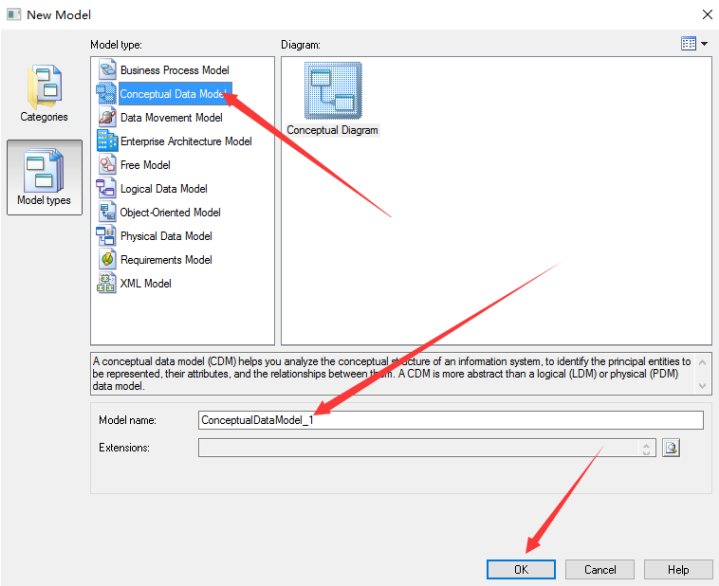


点击上面的ok，即可出现下图左边的概念模型1，可以自定义概念模型的名字，在概念模型中使用最多的 就是如图所示的Entity(实体),Relationship(关系)

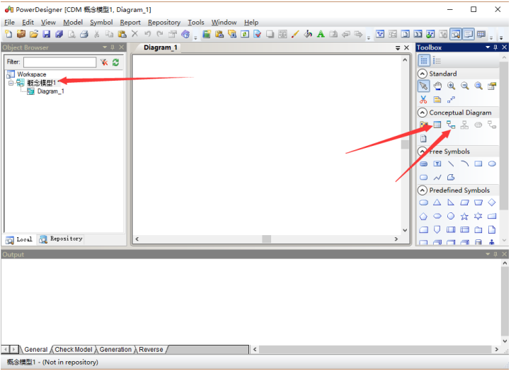


**Entity实体**

选中右边框中Entity这个功能，即可出现下面这个方框，需要注意的是书写name的时候，code自行补全，name可以是英文的也可以是中文的，但是code必须是英文的。

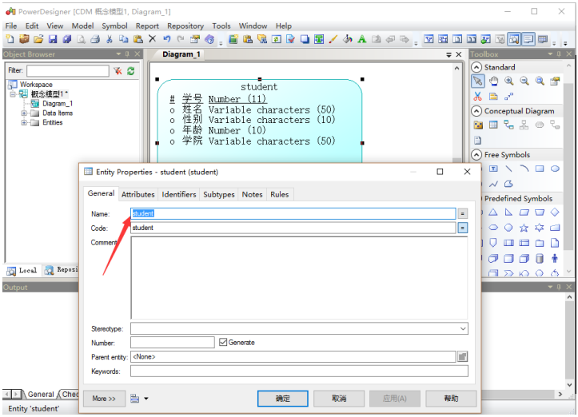

**填充实体字段**

General中的name和code填好后，就可以点击Attributes（属性）来设置name（名字），code(在数据库中 的字段名)，Data Type(数据类型) ，length(数据类型的长度)

* Name: 实体名字一般为中文，如论坛用户 
* Code: 实体代号，一般用英文，如XXXUser 
* Comment:注释，对此实体详细说明 
* Code属性：代号，一般用英文UID DataType 
* Domain域，表示属性取值范围如可以创建10个字符的地址域 
* M:Mandatory强制属性，表示该属性必填。不能为空 
* P:Primary Identifer是否是主标识符，表示实体唯一标识符 
* D:Displayed显示出来，默认全部勾选

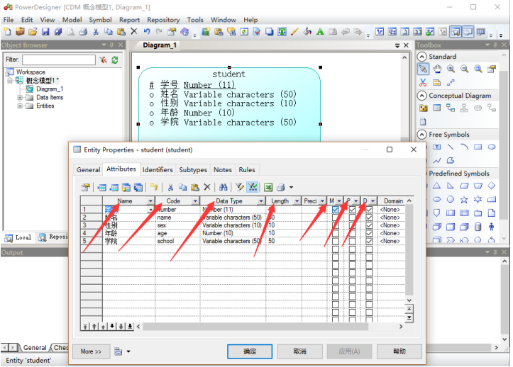

在此上图说明name和code的起名方法

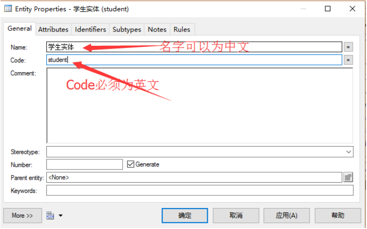

**设置主标识符**

如果不希望系统自动生成标识符而是手动设置的话，那么切换到Identifiers选项卡，添加一行Identifier， 然后单击左上角的“属性”按钮，然后弹出的标识属性设置对话框中单击“添加行”按钮，选择该标识中使用的属性。例如将学号设置为学生实体的标识。

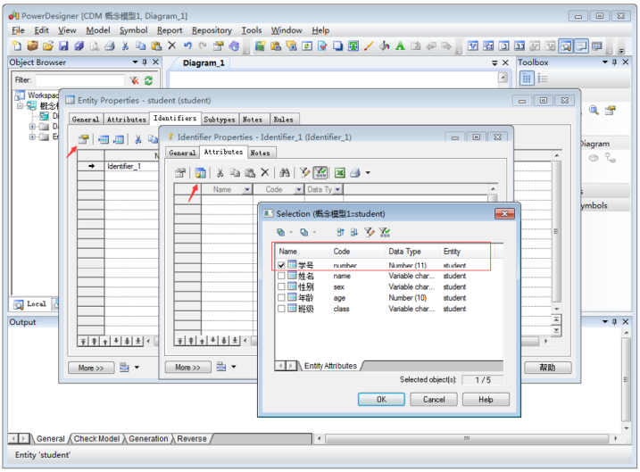

**放大模型**

创建好概念数据模型如图所示，但是创建好的字体很小，读者可以按着ctrl键同时滑动鼠标的可滑动按钮 即可放大缩写字体，同时也可以看到主标识符有一个*号的标志，同时也显示出来了，name,Data type和 length这些可见的属性

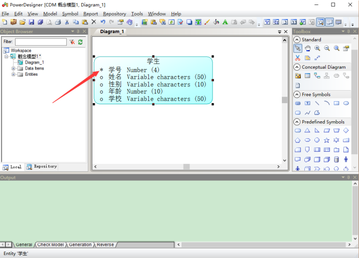

**实体关系**

同理创建一个班级的实体（需要特别注意的是，点击完右边功能的按钮后需要点击鼠标指针状态的按钮 或者右击鼠标即可，不然很容易乱操作，这点注意一下就可以了），然后使用Relationship（关系）这个 按钮可以连接学生和班级之间的关系，发生一对多（班级对学生）或者多对一（学生对班级）的关系。 

如图所示

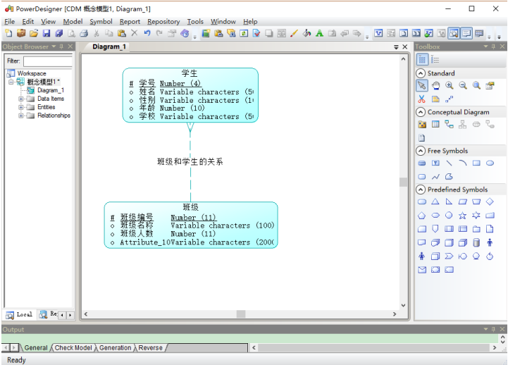

需要注意的是点击Relationship这个按钮，就把班级和学生联系起来了，就是一条线，然后双击这条线进 行编辑，在General这块起name和code

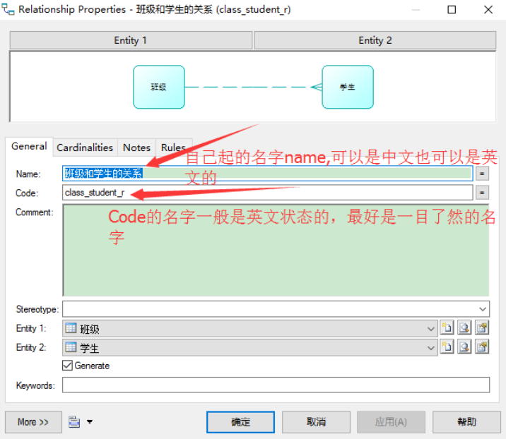

上面的name和code起好后就可以在Cardinalities这块查看班级和学生的关系，可以看到班级的一端是一 条线，学生的一端是三条，代表班级对学生是一对多的关系即one对many的关系，点击应用，然后确定 即可

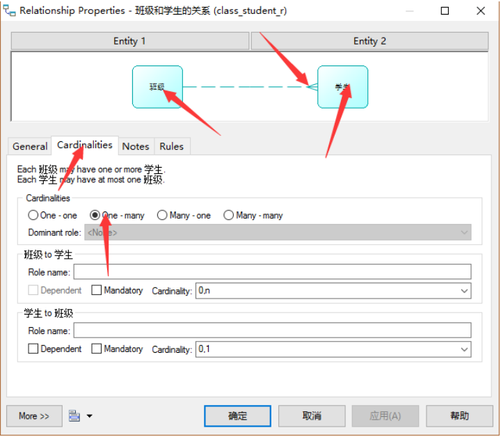

一对多和多对一练习完还有多对多的练习，如下图操作所示，老师实体和上面介绍的一样，自己将 name，data type等等修改成自己需要的即可，满足项目开发需求即可。（comment是解释说明，自己可以写相关的介绍和说明）

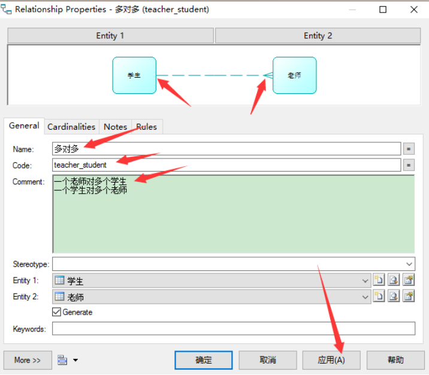

多对多需要注意的是自己可以手动点击按钮将关系调整称为多对多的关系many对many的关系，然后点击应用和确定即可

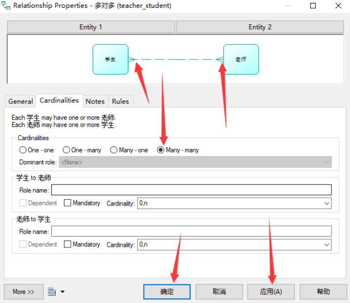

综上即可完成最简单的学生，班级，教师这种概念数据模型的设计，需要考虑数据的类型和主标识码， 是否为空。关系是一对一还是一对多还是多对多的关系，自己需要先规划好再设计，然后就ok了。

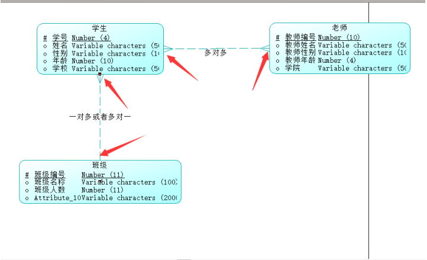

### 8.3 物理数据模型

上面是概念数据模型，下面介绍一下物理数据模型，以后 经常使用 的就是物理数据模型。打开 PowerDesigner，然后点击File-->New Model然后选择如下图所示的物理数据模型，物理数据模型的名字自己起，然后选择自己所使用的数据库即可。

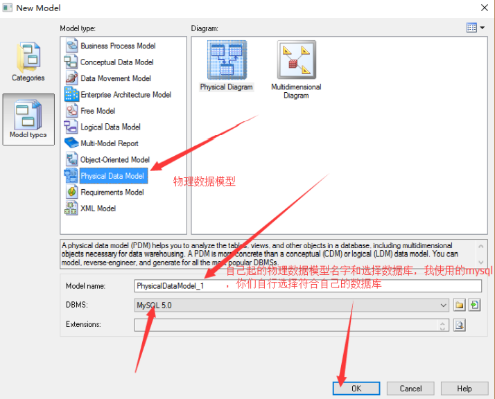

创建好主页面如图所示，但是右边的按钮和概念模型略有差别，物理模型最常用的三个是 `table(表)` ， `view(视图)`， `reference(关系) `；


鼠标先点击右边table这个按钮然后在新建的物理模型点一下，即可新建一个表，然后双击新建如下图所示，在General的name和code填上自己需要的，点击应用即可），如下图：


然后点击Columns,如下图设置，非常简单，需要注意的就是P（primary主键） , F （foreign key外键） , M（mandatory强制性的，代表不可为空） 这三个。


在此设置学号的自增（MYSQL里面的自增是这个AUTO_INCREMENT），班级编号同理，不多赘述！


在下面的这个点上对号即可，就设置好了自增

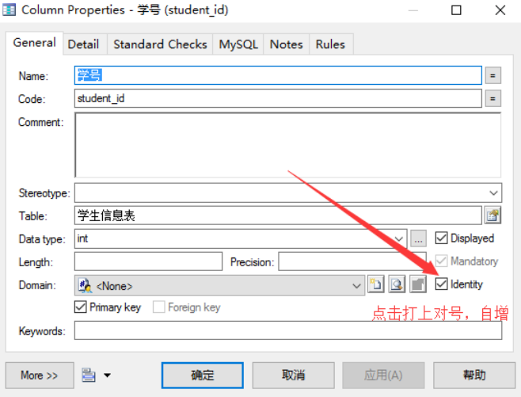

全部完成后如下图所示。

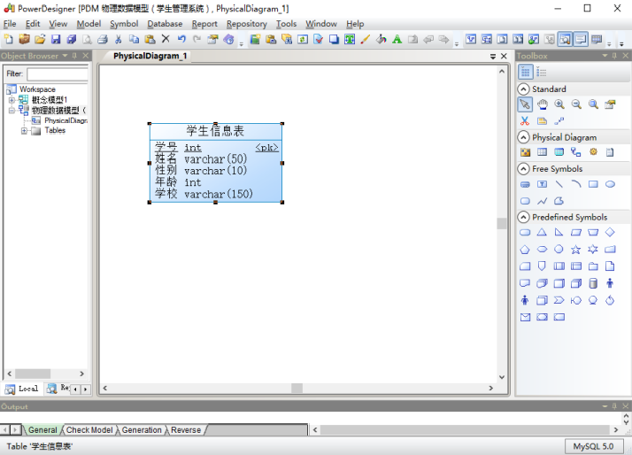

班级物理模型同理如下图所示创建即可

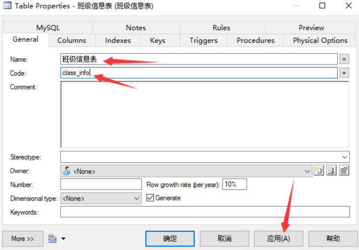

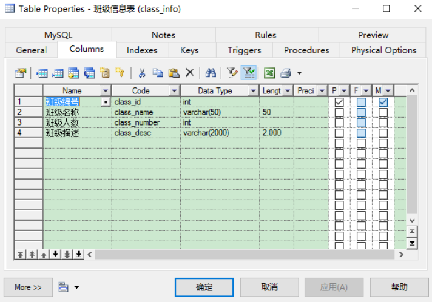

完成后如下图所示

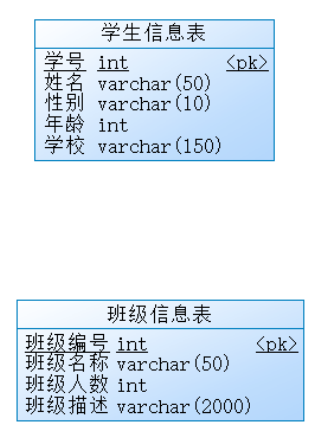

上面的设置好如上图所示，然后下面是关键的地方，点击右边按钮Reference这个按钮，因为是班级对学 生是一对多的，所以鼠标从学生拉到班级如下图所示，学生表将发生变化，学生表里面增加了一行，这 行是班级表的主键作为学生表的外键，将班级表和学生表联系起来。（仔细观察即可看到区别。）

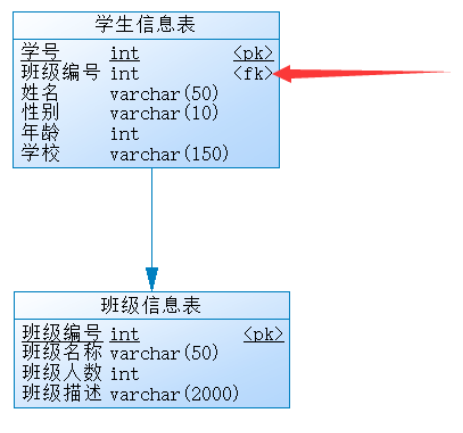

做完上面的操作，就可以双击中间的一条线，显示如下图，修改name和code即可

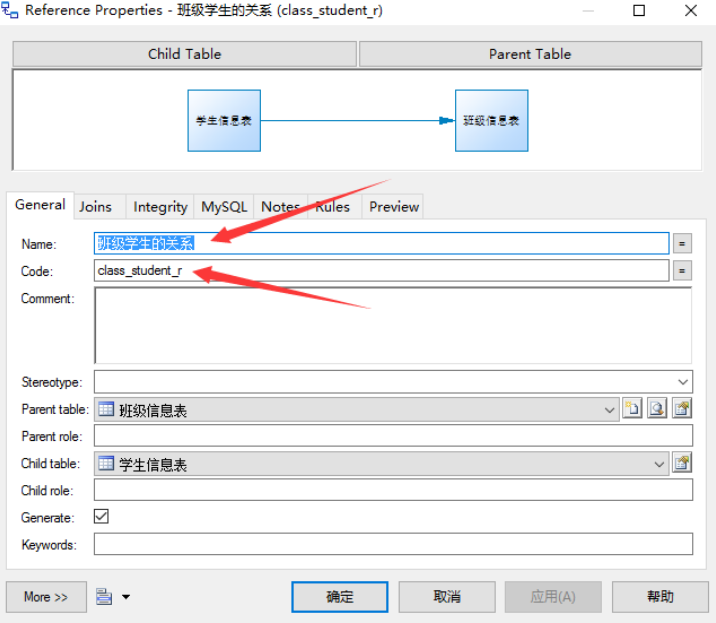

但是需要注意的是，修改完毕后显示的结果却如下图所示，并没有办法直接像概念模型那样，修改过后 显示在中间的那条线上面，自己明白即可。

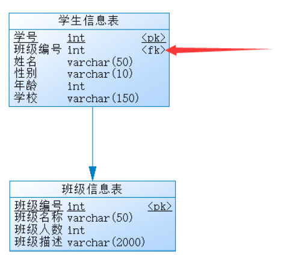

学习了多对一或者一对多的关系，接下来学习多对对的关系，同理自己建好老师表，这里不在叙述，记得老师编号自增，建好如下图所示

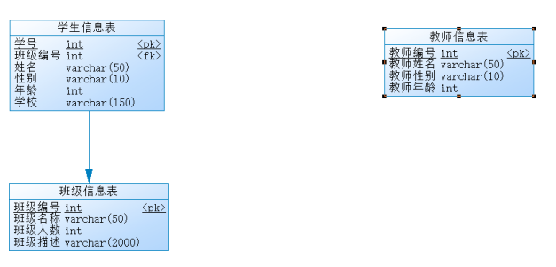

下面是多对多关系的关键，由于物理模型多对多的关系需要一个中间表来连接，如下图，只设置一个字 段，主键，自增

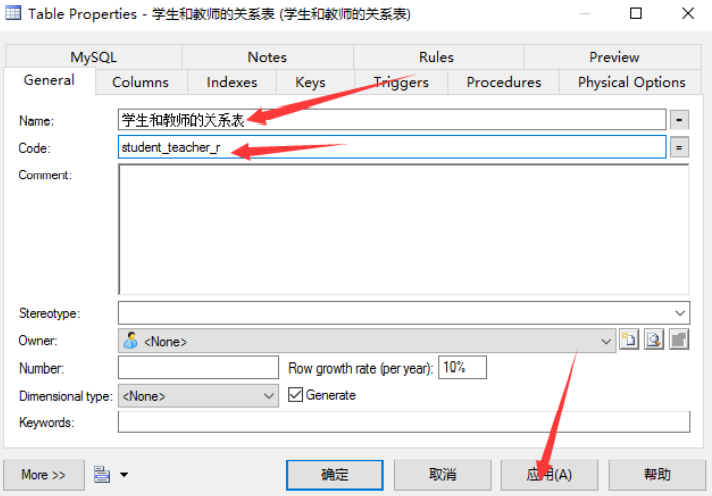

点击应用，然后设置Columns，只添加一个字段


这是设置字段递增，前面已经叙述过好几次


设置好后如下图所示，需要注意的是有箭头的一方是一，无箭头的一方是多，即一对多的多对一的关系 需要搞清楚，学生也可以有很多老师，老师也可以有很多学生，所以学生和老师都可以是主体；

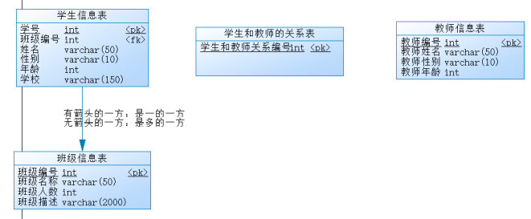

可以看到添加关系以后学生和教师的关系表前后发生的变化

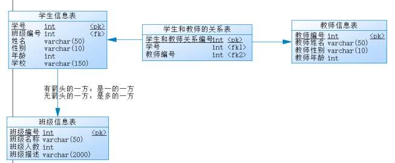

### 8.4 概念模型转为物理模型

如下图所示先打开概念模型图，然后点击Tool,如下图所示

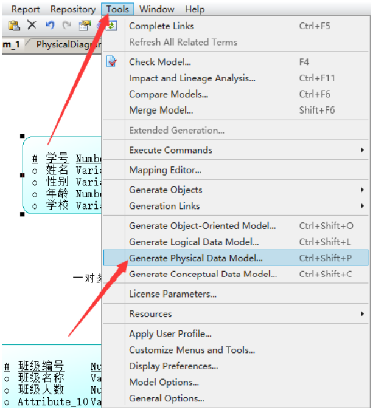

点开的页面如下所示，name和code已经从概念模型1改成物理模型1了

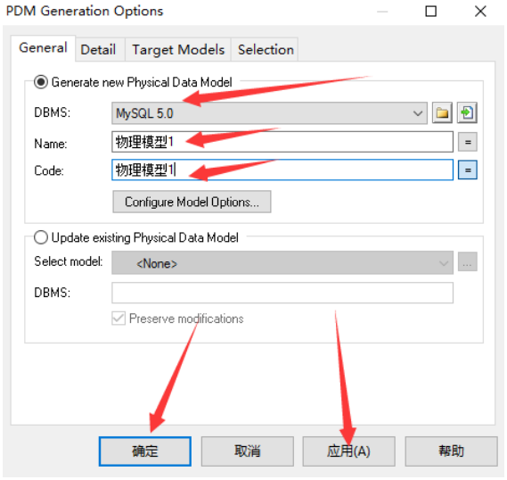

完成后如下图所示，将自行打开修改的物理模型，需要注意的是这些表的数据类型已经自行改变了，而 且中间表出现两个主键，即双主键

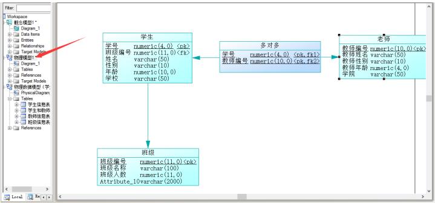

### 8.5 物理模型转为概念模型

上面介绍了概念模型转物理模型，下面介绍一下物理模型转概念模型（如下图点击操作即可）

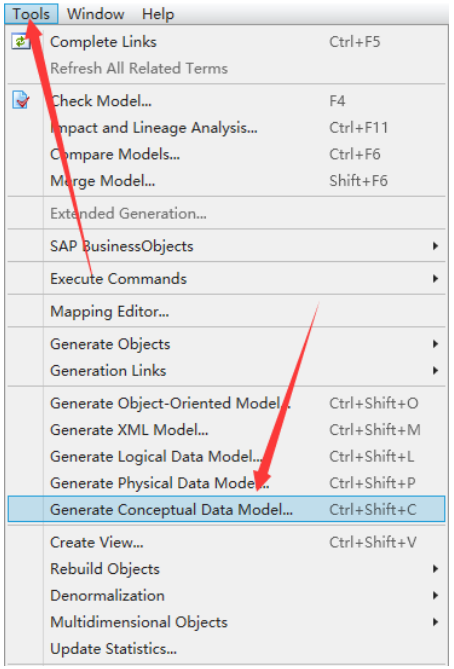

然后出现如下图所示界面，然后将物理修改为概念 ，点击应用确认即可

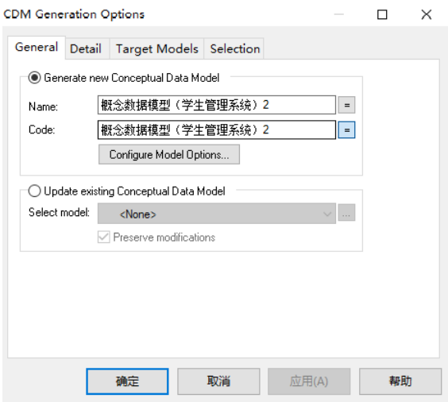

点击确认后将自行打开如下图所示的页面，自己观察有何变化，如果转换为oracle的，数据类型会发生变 化，比如Varchar2等等）；

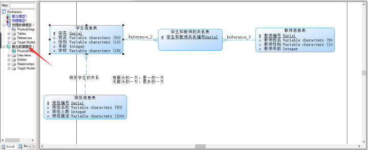

### 8.6 物理模型导出SQL语句

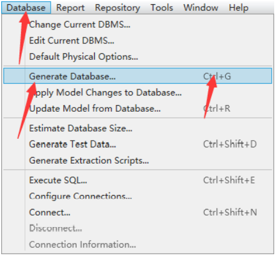

打开之后如图所示，修改好存在sql语句的位置和生成文件的名称即可

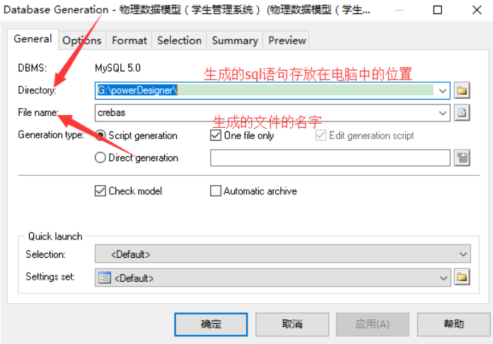

在Selection中选择需要导出的表，然后点击应用和确认即可


完成以后出现如下图所示，可以点击Edit或者close按钮

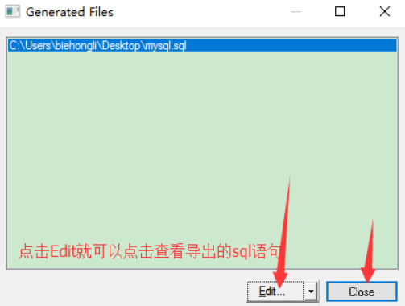

自此，就完成了导出sql语句，就可以到自己指定的位置查看导出的sql语句了；PowerDesigner在以后在 项目开发过程中用来做需求分析和数据库的设计非常的方便和快捷。

# 第12章_数据库其它调优策略

## 1. 数据库调优的措施

### 1.1 调优的目标

* 尽可能节省系统资源，以便系统可以提供更大负荷的服务。（吞吐量更大） 
* 合理的结构设计和参数调整，以提高用户操作响应的速度。（响应速度更快） 
* 减少系统的瓶颈，提高MySQL数据库整体的性能。

### 1.2 定位调优问题

定位调优问题，一般有如下几种方式：

- 用户的反馈(主要)
- 日志分析(主要)：我们可以通过查看数据库日志和操作系统日志等方式找出异常情况，通过它们来定位遇到的问题
- 服务器资源使用监控：监控服务器的CPU、内存、I/O等使用情况
- 数据库内部状态监控：在数据库的监控中，`活动会话(Active Session)监控`是一个重要的指标
- 其他：对事务、锁等待进行监控

### 1.3 调优的维度和步骤

我们需要调优的对象是整个数据库管理系统，它不仅包括 SQL 查询，还包括数据库的部署配置、架构 等。通过如下的步骤我们进行梳理：

#### 第1步：选择适合的DBMS

如果对`事务性处理`以及`安全性要求高`的话，可以选择商业的数据库产品，例如SQL Server、Oracle。

除此之外，也可以采用开源的MySQL进行存储，它有很多存储引擎可以选择，如果进行事务处理的话可以选择InnoDB。

#### 第2步：优化表设计

有一些优化的原则可以参考：

- 表结构尽量遵循`三范式的原则`
- 如果`查询`应用比较多，尤其是需要进行`多表联查`时，可以采用`反范式`进行优化
- `表字段的数据类型`要合理选择

详见第11章和第12章。

#### 第3步：优化逻辑查询

SQL查询优化，可以分为`逻辑查询优化`和`物理查询优化`。

- `逻辑查询优化`就是通过改变SQL语句的内容让SQL执行效率更高，采用的方式就是对SQL语句进行等价变换、对查询进行重写。**SQL的查询重写包括了子查询优化、等价谓词重写、视图重写、条件简化、连接消除和嵌套连接消除等**。例如在使用EXISTS和IN时，我们根据`小表驱动大表`的原则来选择。
- `物理查询优化`是在确定了逻辑查询优化之后，采用物理优化技术(主要是**索引的创建和使用**)，来找到代价最小的执行计划。

详见第10章。

#### 第4步：优化物理查询

详见第10章。

#### 第5步：使用 Redis 或 Memcached 作为缓存

除了可以对 SQL 本身进行优化以外，我们还可以请外援提升查询的效率。

如果我们将常用的数据直接放到内存中，就会大幅提升查询的效率。键值存储数据库可以帮我们做到这一点，常用的键值存储数据库有 Redis 和 Memcached，它们都可以将数据存放到内存中。

**通常我们对于查询响应要求高的场景(响应时间短、吞吐量大)，可以考虑内存数据库**。

#### 第6步：库级优化

库级优化是站在数据库的维度上进行的优化策略，比如控制一个库中的数据表数量。另外，单一的数据库总会遇到各种限制，不如取长补短，利用外援的方式。通过`主从架构`优化我们的读写策略，通过对数据库进行垂直或者水平切分，突破单一数据库或数据表的访问限制，提升查询的性能。

**1、读写分离**

如果读和写的业务量都很大，并且它们都在同一个数据库服务器中进行操作，那么数据库的性能就会出现瓶颈，这时为了提升系统的性能，优化用户体验，我们可以采用`读写分离`的方式降低主数据库的负载，比如用主数据库(master)完成写操作，用从数据库(slave)完成读操作。


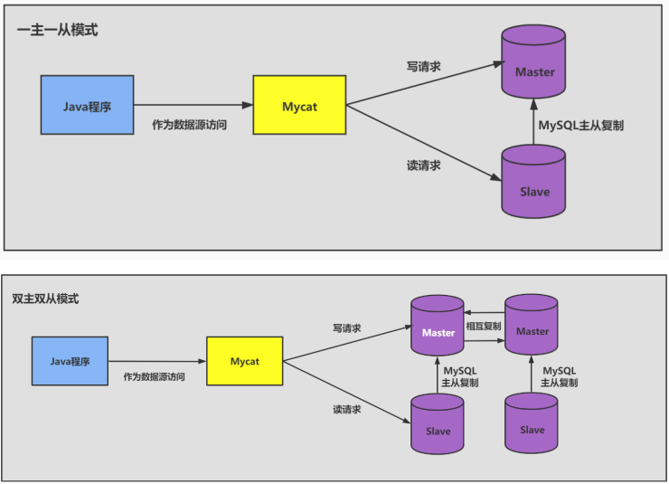

**2、数据分片**

`对数据库分库分表`。当数据量级别达到千万级以上时，有时候我们需要把一个数据库切成多份，放到不同的数据库服务器上，减少对单一数据库服务器的访问压力。如果你使用的是MySQL，就可以使用MySQL自带的分区表功能，当然也可以考虑自己做`垂直拆分(分库)、水平拆分(分表)`。

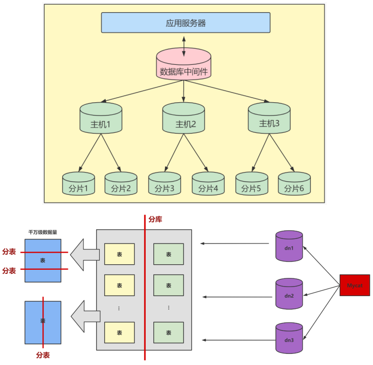

> 但需要注意的是，分拆在提升数据库性能的同时，也会增加维护和使用成本。

## 2. 优化MySQL服务器

优化MySQL服务器主要从两个方面来优化：一是对`硬件`进行优化，二是对MySQL`服务的参数`进行优化。

### 2.1 优化服务器硬件

1. 配置较大的内存
2. 配置高速磁盘系统
3. 合理分布磁盘I/O
4. 配置多处理器

### 2.2 优化MySQL的参数

MySQL服务的配置参数都在`my.cnf`或者`my.ini`文件的`[mysqld]`组中，配置完参数后需要重新启动MySQL服务才会生效。下面对几个对性能影响较大的参数进行详细介绍：

* innodb_buffer_pool_size ：这个参数是Mysql数据库最重要的参数之一，表示InnoDB类型的表和索引的最大缓存。它不仅仅缓存`索引数据`，还会缓存`表的数据`。这个值越大，查询的速度就会越快，但是这个值太大会影响操作系统的性能。
* key_buffer_size ：表示索引缓冲区的大小。
* table_cache ：表示同时打开的表的个数。
* query_cache_size ：表示查询缓冲区的大小。
* query_cache_type ：
  * 当query_cache_type=0时，所有的查询都不使用查询缓存区。但是query_cache_type=0并不会导致MySQL释放query_cache_size所配置的缓存区内存。
  * 当query_cache_type=1时，所有的查询都将使用查询缓存区，除非在查询语句中指定 `SQL_NO_CACHE` ，如`SELECT SQL_NO_CACHE * FROM tbl_name`。
  * 当query_cache_type=2时，只有在查询语句中使用 `SQL_CACHE` 关键字，查询才会使用查询缓存区。使用查询缓存区可以提高查询的速度，这种方式只适用于修改操作少且经常执行相同的查询操作的情况。
* sort_buffer_size ：表示每个需要进行排序的线程分配的缓冲区的大小。
* join_buffer_size ：表示联合查询操作所能使用的缓冲区大小。
* read_buffer_size ：表示每个线程连续扫描时为扫描的每个表分配的缓冲区的大小（字节）。
* innodb_flush_log_at_trx_commit ：表示`何时将缓冲区的数据写入日志文件，并且将日志文件写入磁盘中`。该参数对于innoDB引擎非常重要，该参数有3个值，分别为0、1和2（默认值 为1）：
  * 值为 0 时，表示 `每秒1次` 的频率将数据写入日志文件并将日志文件写入磁盘。每个事务的commit并不会触发前面的任何操作。该模式速度最快，但不太安全，mysqld进程的崩溃会导致上一秒钟所有事务数据的丢失。
  * 值为 1 时，表示 `每次提交事务时` 将数据写入日志文件并将日志文件写入磁盘进行同步。该模式是最安全的，但也是最慢的一种方式。因为每次事务提交或事务外的指令都需要把日志写入 （flush）硬盘。
  * 值为 2 时，表示 `每次提交事务时` 将数据写入日志文件， `每隔1秒` 将日志文件写入磁盘。该模式速度较快，也比0安全，只有在操作系统崩溃或者系统断电的情况下，上一秒钟所有事务数 据才可能丢失。
* innodb_log_buffer_size ：这是 InnoDB 存储引擎的`事务日志所使用的缓冲区`。
* max_connections ：表示允许连接到MySQL数据库的最大数量。
* back_log ：用于控制MySQL监听TCP端口时设置的积压请求栈大小。
* thread_cache_size ：线程池缓存线程数量的大小。
* wait_timeout ：指定一个请求的最大连接时间。
* interactive_timeout ：表示服务器在关闭连接前等待行动的秒数。

这里给出一份my.cnf的参考配置：

```sql
mysqld]
port = 3306 
serverid = 1 
socket = /tmp/mysql.sock 
skip-locking #避免MySQL的外部锁定，减少出错几率增强稳定性。 
skip-name-resolve #禁止MySQL对外部连接进行DNS解析，使用这一选项可以消除MySQL进行DNS解析的时间。但需要注意，如果开启该选项，则所有远程主机连接授权都要使用IP地址方式，否则MySQL将无法正常处理连接请求！ 
back_log = 384
key_buffer_size = 256M 
max_allowed_packet = 4M 
thread_stack = 256K
table_cache = 128K 
sort_buffer_size = 6M 
read_buffer_size = 4M
read_rnd_buffer_size=16M 
join_buffer_size = 8M 
myisam_sort_buffer_size =64M 
table_cache = 512 
thread_cache_size = 64 
query_cache_size = 64M
tmp_table_size = 256M 
max_connections = 768 
max_connect_errors = 10000000
wait_timeout = 10 
thread_concurrency = 8 #该参数取值为服务器逻辑CPU数量*2，在本例中，服务器有2颗物理CPU，而每颗物理CPU又支持H.T超线程，所以实际取值为4*2=8
skip-networking #开启该选项可以彻底关闭MySQL的TCP/IP连接方式，如果WEB服务器是以远程连接的方式访问MySQL数据库服务器则不要开启该选项！否则将无法正常连接！ 
table_cache=1024
innodb_additional_mem_pool_size=4M #默认为2M 
innodb_flush_log_at_trx_commit=1
innodb_log_buffer_size=2M #默认为1M 
innodb_thread_concurrency=8 #你的服务器CPU有几个就设置为几。建议用默认一般为8 
tmp_table_size=64M #默认为16M，调到64-256最挂
thread_cache_size=120 
query_cache_size=32M
```


**举例**：调整参数来让电商平台高效运转，主要调整如下3个参数

**(1) 调整系统参数 InnoDB_flush_log_at_trx_commit**

这个参数适用于InnoDB引擎，默认值是1，意思是每次提交事务时都把数据写入日志、并把日志写入磁盘。这样做的好处是数据`安全性最佳`，但是在高并发的场景下，过于频繁的磁盘读写会导致CPU资源浪费、系统效率变低。我们把这个参数的值改为2即可明显改善系统效率。

**(2) 调整系统参数 InnoDB_buffer_pool_size**

这个参数的意思是，InnoDB存储引擎使用`缓存来存储索引和数据`，这个值越大，可以加载到缓存区的索引和数据量就越多，需要的`磁盘读写就越少`，所以我们可以调高该参数的值，如64G。

**(3) 调整系统参数 InnoDB_buffer_pool_instances**

这个参数可以将InnoDB的缓存区分成几个部分，从而提高系统的`并发处理能力`，因为可以允许多个进程同时处理不同部分的缓存区。

我们把这个值修改为64，意思就是把InnoDB的缓存区分成64个分区，这样就可以同时有多个进程进行数据操作，CPU的效率就高多了。

**总结**：遇到CPU资源不足的问题时，可以按下面2个思路去解决

- 疏通拥堵路段，消除瓶颈，让等待的时间更短(调整参数`(1)`和`(2)`)
- 开拓新的通道，增加并行处理能力(调整参数`(3)`)

## 3. 优化数据库结构

### 3.1 拆分表：冷热数据分离

拆分表的思路是：把一个包含很多字段的表拆分成两个或者多个相对较小的表。这样做的原因是，这些表中某些字段的操作频率很高(热数据)，而另外一些字段的使用频率却很低(冷数据)。`冷热数据分离`，可以减小表的宽度，如果放在一个表里面，每次查询都要读取大记录，会消耗较多的资源。

`冷热数据分离`的目的是：减少磁盘IO，保证热数据的内存缓存命中率；更有效地利用缓存，避免读入无用的冷数据。

### 3.2 增加中间表

对于需要经常联合查询的表，可以建立中间表以提高查询效率。**通过建立中间表，把需要经常联合查询的数据插入中间表中，然后将原来的联合查询改为对中间表的查询，以此来提高查询效率**。

### 3.3 增加冗余字段

设计数据库表时应尽量遵循范式理论的规约，尽可能减少冗余字段，让数据库设计看起来精致、优雅。但是，合理地加入冗余字段可以提高查询速度。

### 3.4 优化数据类型

优先选择符合存储需要的最小的数据类型。列的字段越大，建立索引时需要的空间也越大，这样一页中所能存储的索引节点的数量也越少，在遍历时所需要的IO次数也就越多，索引的性能也就越差。

**情况1：对整数类型数据进行优化**

遇到整数类型的字段可以用 `INT` 型。对于非负型的数据，要优先使用无符号整型 `UNSIGNED` 来存储，因为无符号相对于有符号，同样的字节数，存储的数值范围更大。

**情况2：既可以使用文本类型也可以使用整数类型的字段，要选择使用整数类型**

跟文本类型数据相比，大整数往往占用更少的存储空间。

**情况3：避免使用TEXT、BLOB数据类型**

MySQL`内存临时表`不支持TEXT、BLOB这样的大数据类型，如果查询中包含这样的数据，在排序操作时，就不能使用内存临时表，必须使用`磁盘临时表`进行。并且对于这种数据，MySQL还需要进行`二次查询`，会使性能变得很差。

如果一定要使用这样类型的数据，建议把BLOB或是TEXT列`分离到单独的扩展表`中，查询时一定不要使用`select *`，而是只取出必要的列，不需要TEXT列的数据时不要对该列进行查询。

**情况4：避免使用ENUM类型**

修改ENUM值需要使用ALTER语句。ENUM类型的ORDER BY 操作效率低，需要额外操作。建议使用TINYINT来代替ENUM类型。

**情况5：使用TIMESTAMP存储时间**

TIMESTAMP存储的时间范围`1970-01-01 00:00:01 ~ 2038-01_19-03:14:07`。TIMESTAMP使用4字节，DATETIME使用8个字节，同时TIMESTAMP具有自动赋值以及自动更新的特性。

**情况6：用DECIMAL代替FLOAT和DOUBLE存储精确浮点数**

Decimal类型为精准浮点数，在计算时不会丢失精度。占用空间由定义的宽度决定，每4个字节可以存储9位数字，并且小数点要占用一个字节。可用于存储比bigint更大的整型数据。

**总之，遇到数据量大的项目时，一定要在充分了解业务需求的前提下，合理优化数据类型，这样才能充 分发挥资源的效率，使系统达到最优。**

### 3.5 优化插入记录的速度

插入记录时，影响插入速度的主要是索引、唯一性校验、一次插入记录条数等。根据这些情况可以分别进行优化。这里我们分为MyISAM引擎和InnoDB引擎来讲。

#### 3.5.1 MyISAM引擎的表

**1、禁用索引**

对于非空表，插入记录时，MySQL会根据表的索引对插入的记录建立索引。如果插入大量数据，建立索引就会降低插入记录的速度。所以，可以在插入记录之前禁用索引，插入完毕后再开启索引。

禁用索引的语句如下：

```sql
ALTER TABLE table_name DISABLE KEYS;
```

重新开启索引的语句如下：

```sql
ALTER TABLE table_name ENABLE KEYS;
```

若对空表批量插入数据，则无需此操作，因为MyISAM引擎的表都是在导入数据之后才建立索引的。

**2、禁用唯一性检查**

插入数据时，MySQL会对插入的记录进行唯一性校验，它会降低插入记录的速度。所以我们可以在插入记录前禁用唯一性检查，等记录插入完毕后再开启。

禁用唯一性检查的语句如下：

```sql
SET UNIQUE_CHECKS = 0;
```

开启唯一性检查的语句如下：

```sql
SET UNIQUE_CHECKS = 1;
```

**3、使用批量插入**

插入多条记录时，建议使用一条INSERT语句插入多条数据，例如：

```sql
insert into student values
(1,'zhangsan',18,1),
(2,'lisi',17,1),
(3,'wangwu',17,1),
(4,'zhaoliu',19,1);
```

**4、使用LOAD DATA INFILE 批量导入**

当需要批量导入数据时，如果能用LOAD DATA INFILE语句，就尽量使用。因为LOAD DATA INFILE语句导入数据的速度比INSERT语句块。

#### 3.5.2 InnoDB引擎的表

**1、禁用唯一性检查**

和MyISAM引擎的使用方法一样。

**2、禁用外键检查**

插入数据之前禁止对外键的检查，插入完成之后再恢复。

禁用外键检查的语句如下：

```sql
SET foreign_key_checks = 0;
```

开启外键检查的语句如下：

```sql
SET foreign_key_checks = 1;
```

**3、禁止自动提交**

插入数据之前禁止事务的自动提交，插入完成之后再恢复。

禁用自动提交的语句如下：

```sql
set autocommit = 0;
```

开启自动提交的语句如下：

```sql
set autocommit = 1;
```

### 3.6 使用非空约束

在设计字段时，如果业务允许，建议尽量`使用非空约束`。这样做的好处是：

- 进行比较和计算时，省去要对NULL值的字段判断是否为空的开销，提高效率
- 索引NULL列需要额外的空间来保存该列是否为NULL，占用更多的空间。所以使用非空约束后，就能节省存储空间。

### 3.7 分析表、检查表与优化表

MySQL提供了分析表、检查表和优化表的语句。`分析表`主要是分析关键字的分布，`检查表`主要是检查表是否存在错误，`优化表`主要是消除删除或者更新造成的空间浪费。

#### 1. 分析表

MySQL中提供了ANALYZE TABLE语句分析表，ANALYZE TABLE语句的基本语法如下：

```sql
ANALYZE [LOCAL | NO_WRITE_TO_BINLOG] TABLE tbl_name[,tbl_name]…
```

ANALYZE TABLE分析后的统计结果会反应到 `cardinality` 的值，该值统计了表中某一键所在的列不重复的值的个数。**该值越接近表中的总行数，则在表连接查询或者索引查询时，就越优先被优化器选择使用**。也就是索引列的cardinality的值与表中数据的总条数差距越大，即使查询的时候使用了该索引作为查询条件，存储引擎实际查询的时候使用的概率就越小。cardinality可以通过 SHOW INDEX FROM 表名查看。

#### 2. 检查表

MySQL中可以使用 `CHECK TABLE` 语句来检查表。CHECK TABLE语句能够检查InnoDB和MyISAM类型的表是否存在错误。该语句的基本语法如下：

```sql
CHECK TABLE tbl_name [, tbl_name] ... [option] ...
```

#### 3. 优化表

MySQL中使用 `OPTIMIZE TABLE` 语句来优化表。但是，OPTILMIZE TABLE语句只能优化表中的 `VARCHAR` 、 `BLOB` 或 `TEXT` 类型的字段。一个表使用了这些字段的数据类型，若已经 `删除` 了表的一大部分数据，或者已经对含有可变长度行的表（含有VARCHAR、BLOB或TEXT列的表）进行了很多 `更新` ，则 应使用OPTIMIZE TABLE来重新利用未使用的空间，并整理数据文件的 `碎片` 。OPTILMIZE TABLE语句的基本语法如下：

```sql
OPTIMIZE [LOCAL | NO_WRITE_TO_BINLOG] TABLE tbl_name [, tbl_name] ...
```

> 说明： 在多数的设置中，根本不需要运行OPTIMIZE TABLE。即使对可变长度的行进行了大量的更新，也不需要经常运行，` 每周一次` 或 `每月一次` 即可，并且只需要对 `特定的表` 运行。

### 3.8 小结

上述这些方法都是有利有弊的。比如：

* 修改数据类型，节省存储空间的同时，你要考虑到数据不能超过取值范围； 
* 增加冗余字段的时候，不要忘了确保数据一致性； 
* 把大表拆分，也意味着你的查询会增加新的连接，从而增加额外的开销和运维的成本。

因此，你一定要结合实际的业务需求进行权衡。

## 4. 大表优化

当MySQL单表记录数过大时，数据库的CRUD性能会明显下降，一些常见的优化措施如下：

### 4.1 限定查询的范围

禁止不带任何限制数据范围条件的查询语句。比如：我们当用户在查询订单历史的时候，我们可以控制在一个月的范围内。

### 4.2 读写分离

经典的数据库拆分方案，主库负责写，从库负责读。

* 一主一从模式：

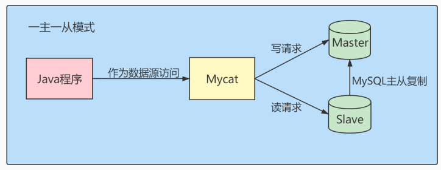

* 双主双从模式：

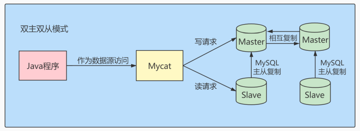

### 4.3 垂直拆分

当数据量级达到 `千万级` 以上时，有时候我们需要把一个数据库切成多份，放到不同的数据库服务器上，减少对单一数据库服务器的访问压力。

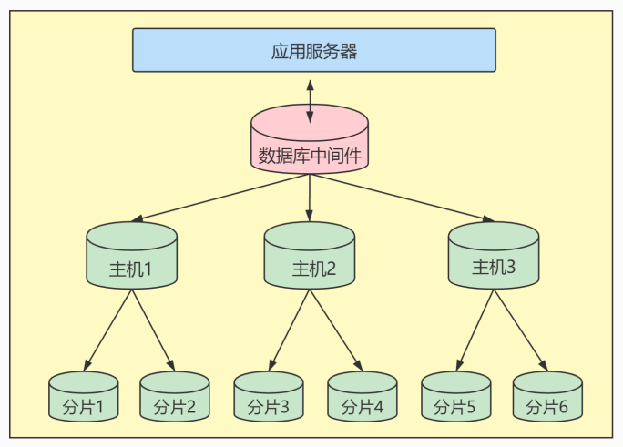

* 如果数据库的数据表过多，可以采用`垂直分库`的方式，将关联的数据库部署在同一个数据库上。
* 如果数据库中的列过多，可以采用`垂直分表`的方式，将一张数据表分拆成多张数据表，把经常一起使用的列放在同一张表里。

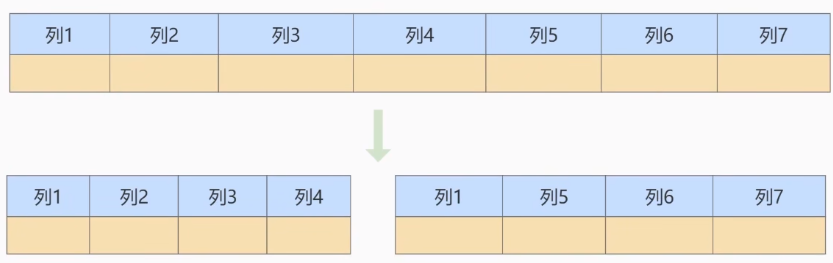

`垂直拆分的优点`： 可以使得列数据变小，在查询时减少读取的Block数，减少I/O次数。此外，垂直分区可以简化表的结构，易于维护。 

`垂直拆分的缺点`： 主键会出现冗余，需要管理冗余列，并会引起 JOIN 操作。此外，垂直拆分会让事务变得更加复杂。

### 4.4 水平拆分

尽量控制单表数据量的大小，建议控制在1000万以内，过大会造成修改表结构、备份、恢复都会有很大的问题。此时可以用`历史数据归档`(应用于日志数据)，`水平分表`(应用于业务数据)等手段来控制数据量大小。

`水平分表`即将数据表按照某个属性维度分拆成小表，每张小表保持相同的表结构。例如将2020年以前的数据放在一张表，以后的数据放在另一张表。

水平分表仅是解决了单一表数据过大的问题，但表数据还是在同一主机上，对于提升并发能力没什么意义，所以`水平拆分最好分库`，从而达到分布式的目的。


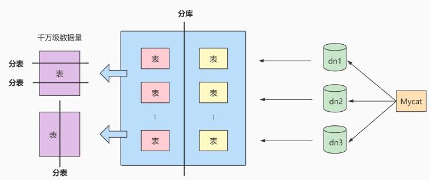

水平拆分能够支持非常大的数据量存储，但`分片事务难以解决，跨节点Join性能较差`，因此一些人推荐`尽量不要对数据进行分片`，如果实在要分片，尽量选择客户端分片架构，这样可以减少一次和中间件的网络IO。下面补充一下数据库分片的两种常见方案：

* **客户端代理： 分片逻辑在应用端，封装在jar包中，通过修改或者封装JDBC层来实现**。当当网的 Sharding-JDBC 、阿里的TDDL是两种比较常用的实现。 
* **中间件代理：在应用和数据中间加了一个代理层。分片逻辑统一维护在中间件服务中**。我们现在谈的 Mycat 、360的Atlas、网易的DDB等等都是这种架构的实现。

## 5. 其它调优策略

### 5.1 服务器语句超时处理

在MySQL 8.0中可以设置 `服务器语句超时的限制` ，单位可以达到 毫秒级别 。当中断的执行语句超过设置的毫秒数后，服务器将终止查询影响不大的事务或连接，然后将错误报给客户端。

### 5.2 创建全局通用表空间

MySQL 8.0 使用 `CREATE TABLESPACE` 语句来创建一个`全局通用表空间`。全局表空间可以被所有的数据库的表共享，而且相比于独享表空间，**使用手动创建共享表空间可以节约元数据方面的内存**。可以在创建表的时候，指定属于哪个表空间，也可以对已有表进行表空间修改等。

### 5.3 MySQL 8.0新特性：隐藏索引对调优的帮助

不可见索引的特性对于性能调试非常有用。在MySQL 8.0中，索引可以被隐藏，当一个索引被隐藏时，它不会被查询优化器所使用。从而管理员可以隐藏一个索引，然后观察其对数据库性能的影响。

注意当一个索引被隐藏时，它的内容仍然是和正常索引一样`实时更新`的，所以如果一个索引需要长期被隐藏，建议将其删除，否则会影响增删改的性能。注意主键不能设置为invisible。
