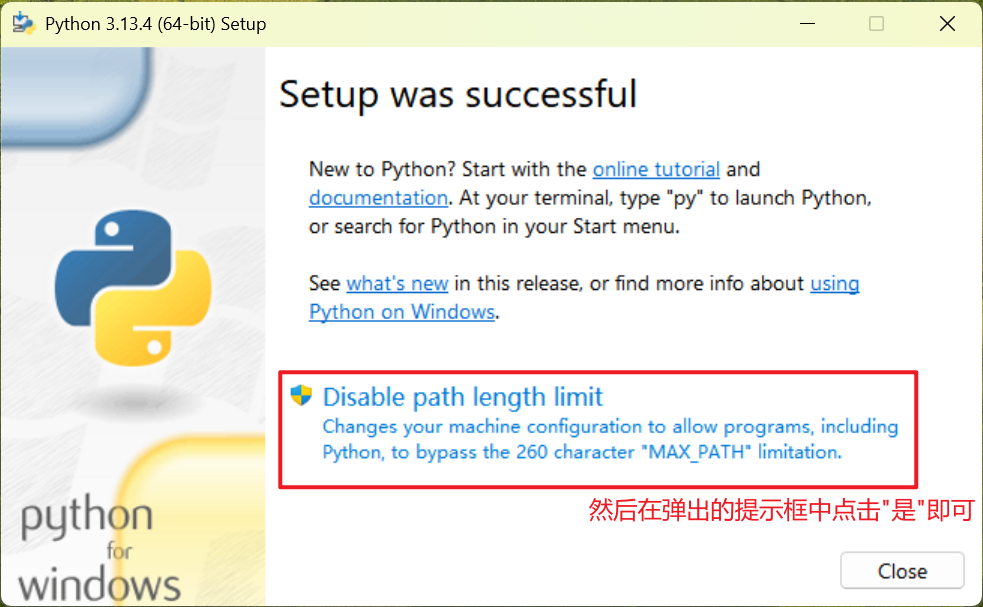

# 第01章_Python简介

## 1. Python安装

前往官网 https://www.python.org/downloads/ 下载，然后进行安装：




然后在cmd中输入python，能够返回python的版本号并进入python编辑模式就意味着python安装成功。

## 2. PyCharm安装

PyCharm是Python最常用的集成开发工具（IDE），前往官网 https://www.jetbrains.com.cn/pycharm/download/?section=windows 下载PyCharm社区版即可。


# 第02章_Python基础

## 1. 变量

### 1.1 变量的声明与赋值

```python
"""
我是
多行注释
"""

# 我是单行注释

money = 50
money = money - 10
print("剩余金额：", money)
```

说明：

- 多行注释使用三引号包裹，通常用于解释类、方法、或者整个python代码文件
- 单行注释以`#`开头，起辅助说明作用

注意：Python中变量、函数的命名推荐使用**下划线命名法**（多个单词用下划线连接，所有英文字母小写），例如`student_name`；而类的命名推荐使用**大驼峰命名法**，例如`UserInfoModel`

### 1.2 数据类型

Python中常用的有以下6种数据类型：


> 注1：变量是没有类型的，但它存储的数据是有类型的
>
> 注2：Python中，数字、字符串、元组属于**值类型（不可变类型）**；而列表、集合、字典属于**引用类型（可变类型）**。

**查看数据类型**：可以通过`type()`

```python
x = 10
print(type(x)) # 输出<class 'int'>
x = 13.14
print(type(x)) # 输出<class 'float'>
x = 1 + 2j
print(type(x)) # 输出<class 'complex'>
x = True
print(type(x)) # 输出<class 'bool'>
x = "哈哈"
print(type(x)) # 输出<class 'str'>
```

**数据类型转换**：

```python
a = "3.14"
b = float(a)  # 转换为小数
c = int(b)    # 转换为整数（浮点数转整数可能会丢失精度）
d = str(c)    # 转换为字符串
print(b)      # 3.14
print(c)      # 3
print(d)      # 3
```

### 1.3 数据输入

使用`input()`语句可以从键盘获取输入，输入的内容都将转为字符串类型

```python
age = input("请输入您的年龄\n")
print(type(age))  # <class 'str'>
```

### 1.4 数据输出

使用`print()`语句可以输出到显示屏，默认情况下`print()`是会自动换行的。如果不想换行，则可采用如下方式：

```python
print("Hello ", end='')
print("World", end='')
```

## 2. 运算符

### 2.1 算术运算符

```python
print(3 + 2)   # 5，加法
print(3 - 2)   # 1，减法
print(3 * 2)   # 6，乘法
print(3 / 2)   # 1.5，除法
print(9 % 4)   # 1，取余
print(9 // 4)  # 2，取整除（返回商的整数部分）
print(3 ** 2)  # 9，乘方
```

### 2.2 赋值运算符

`=`、`+=`、`-=`、`*=`、`/=`、`%=`、`//=`、`**=`

### 2.3 比较运算符

通过比较运算符进行比较运算会得到布尔类型的结果

`==`、`!=`、`>`、`<`、`>=`、`<=`

### 2.4 逻辑运算符

- `and`：逻辑与运算
- `or`：逻辑或运算
- `not`：逻辑非运算

说明：

1. Python中，以下变量都会被当成False：任何数字类型的0、空字符串、空列表、空元组、空集合、空字典、`None`等
2. `and`和`or`运算符会将其中一个表达式的值作为最终结果，而并不是将True或False作为最终结果
3. 当一个表达式中有多个逻辑运算符时，按优先级`not>and>or`顺序来运算

#### and

若左边表达式的值为假，则左边表达式的值作为最终结果；若左边表达式的值为真，则右边表达式的值作为最终结果。

```python
print(15 > 10 and 15 < 6) # False
print({} and 15)          # {}
print(6 and 15)           # 15
```

#### or

若左边表达式的值为假，则右边表达式的值作为最终结果；若左边表达式的值为真，则左边表达式的值作为最终结果。

```python
print(15 > 10 or 15 < 6) # True
print({} or 15)          # 15
print(6 or 15)           # 6
```

#### not

若表达式的值为真，则结果为False；若表达式的值为假，则结果为True。

```python
print(not 16 < 9) # True
print(not {})     # True
print(not 6)      # False
```

## 3. 流程控制语句

### 3.1 if

```python
import random
# 生成一个[70, 100]之间的随机整数
score = random.randint(70, 100)
print(f"你的分数是{score}")
if score >= 90:
    print("成绩为优秀")
elif score >= 80:
    print("成绩为良好")
else:
    print("成绩为中等")
```

### 3.2 while

```python
sum = 0
i = 1
while i <= 100:
    sum += i
    i += 1
print(sum)
```

> 在while循环和for循环中，我们可以使用continue和break关键字来控制循环的中断

### 3.3 for

Python中的for循环是无法定义循环条件的，只能从被处理的数据集中依次取出内容进行逐个处理。语法如下：

```python
for 临时变量 in 待处理数据集:
    循环体代码
```

其中，待处理数据集是一种**可迭代类型**。可迭代类型就是其内容可以一个个依次取出的一种类型，包括字符串、列表、元组、集合、字典等。for循环语句本质上就是遍历可迭代对象。

```python
for x in "hello你好":
    print(x)
```

在for循环中，我们通常使用**range语句获取一个简单的数字序列**（可迭代类型的一种），例如：

```python
for i in range(5):
    print(i)
```

1. `range(n)`获取一个从`0`开始、到`n`结束的数字序列（不含`n`本身）。例如，`range(5)`取得的数据是`[0,1,2,3,4]`
2. `range(n1, n2)`获取一个从`n1`开始、到`n2`结束的数字序列（不含`n2`本身）。例如，`range(5, 10)`取得的数据是`[5,6,7,8,9]`
3. `range(n1, n2, step)`获取一个从`n1`开始、到`n2`结束、以`step`为步长的数字序列（不含`n2`本身）。例如，`range(5, 10, 2)`取得的数据是`[5, 7, 9]`

## 4. 函数

### 4.1 函数的定义

函数的定义格式如下：

```python
def 函数名(形参1, 形参2):
    函数体
    return 返回值
```

说明：

1. 函数必须先定义再调用
2. 函数可以没有return语句，此时该函数的返回值为`None`字面量，其类型为`<class 'NoneType'>`

给函数添加**说明文档**的规范格式如下：

```python
def div(x, y):
    """
    div函数的功能是进行除法运算
    :param x: 形参x
    :param y: 形参y，不能为零
    :return: 返回两数相除的结果
    """
    return x / y
```

> 注意：在Python中，如果将函数定义为class（类）的成员，那么我们就称之为`方法`。

### 4.2 变量的作用域

- 局部变量：定义在函数体内的变量是局部变量，只在函数体内部生效
- 全局变量：定义在函数体外的变量是全局变量

例1：

```python
num = 100
def test1():
    num = 200
    print(num)
def test2():
    print(num)

test1()   # 200
test2()   # 100
```

> 说明：在函数`test1()`中定义了一个同名的局部变量`num`，所以在`test1()`中会打印200；而`test2()`中访问的则是全局变量`num`，所以会打印100

例2：

```python
num = 100
def test1():
    global num
    num = 200
    print(num)
def test2():
    print(num)

test1()   # 200
test2()   # 200
```

> 说明：在函数`test1()`中通过**global**关键字声明该`num`是全局变量，所以`test1()`中将全局变量`num`的值修改成了200

### 4.3 多返回值

Python函数支持返回多个返回值（多个返回值之间用逗号隔开），只需按照返回值的顺序用多个变量接收即可：

```python
def test():
    return "wsy", 666, True
x, y, z = test()
print(f"x={x}, y={y}, z={z}")
```

### 4.4 多种传参方式

#### 1、位置参数

位置参数指的是调用函数时根据函数定义的参数位置来传递参数，也是我们最常用的传参方式。

```python
def test(name, age, gender):
    print(f"姓名是{name}，年龄是{age}，性别是{gender}")
test("张三", 20, "男")
```

#### 2、关键字参数

函数调用时可以通过`键=值`的形式传递参数，关键字参数无需按照形参的顺序来传递。关键字参数可以和位置参数混合使用，但位置参数必须在关键字参数的前面。

```python
def test(name, age, gender):
    print(f"姓名是{name}，年龄是{age}，性别是{gender}")
test("张三", gender="男", age=18)
```

#### 3、缺省参数

缺省参数也叫默认参数，用于定义函数时给参数提供默认值。注意，位置参数必须在默认参数的前面。

```python
def test(name, age, gender="男"):
    print(f"姓名是{name}，年龄是{age}，性别是{gender}")
test("张三", 18)
test("李四", 20, "女")
```

#### 4、可变参数

可变参数可以接收0个或多个参数，有以下两种传递方式：

**位置传递**：以`*`标记一个形参，用元组的形式接收参数

```python
def test(*args):
    print(f"类型为{type(args)}，内容为{args}")
test("张三", 18)  # 类型为<class 'tuple'>，内容为('张三', 18)
```

**关键字传递**：以`**`标记一个形参，用字典的形式接收参数，传参的格式为`键=值`

```python
def test(**kwargs):
    print(f"类型为{type(kwargs)}，内容为{kwargs}")
test(name="张三", age=18)  # 类型为<class 'dict'>，内容为{'name': '张三', 'age': 18}
```

### 4.5 lambda匿名函数

Python中，函数本身也可以像普通变量一样作为参数传递使用（**函数名**存放的是函数的地址）：

```python
def test(compute):
    result = compute(1, 2)
    print(f"类型为{type(compute)}，结果为{result}")
def div(x, y):
    return x / y
test(div)  # 类型为<class 'function'>，结果为0.5
```

为了更简便地传递上述参数，我们可以通过lambda关键字定义**匿名函数**（匿名函数只可以临时使用），匿名函数只允许有一行函数体代码，格式为`lambda 形参: 函数体`，示例如下：

```python
def test(compute):
    result = compute(1, 2)
    print(f"类型为{type(compute)}，结果为{result}")
test(lambda x, y: x / y)
```

## 5. 异常处理

**格式一**：最简单的形式

```python
try:
    # 可能抛出异常的代码
    file = open("E:/e.txt", "r", encoding="UTF-8")
except:
    # 出现异常后会执行的代码
    print("文件未找到")
```

**格式二**：捕获指定异常（如果抛出的异常类型与要捕获的异常类型不一致，则无法捕获异常，所以我们推荐使用Exception来捕获所有类型的异常）

```python
try:
    file = open("E:/e.txt", "r", encoding="UTF-8")
except FileNotFoundError as e:
    print(e)  # [Errno 2] No such file or directory: 'E:/e.txt'
```

```python
try:
    file = open("E:/e.txt", "r", encoding="UTF-8")
except Exception as e:
    print(e)  # [Errno 2] No such file or directory: 'E:/e.txt'
```

**格式三**：捕获多个异常（多个异常类型通过元组的方式进行书写）

```python
try:
    file = open("E:/e.txt", "r", encoding="UTF-8")
except (NameError, FileNotFoundError) as e:
    print(e)
```

**格式四**：异常else（出现异常则不执行else，未出现异常则执行else）

```python
try:
    file = open("E:/e.txt", "r", encoding="UTF-8")
    print("执行成功1")
except Exception as e:
    print(e)
else:
    print("执行成功2")
    
# 最终输出：
# [Errno 2] No such file or directory: 'E:/e.txt'
```

```python
try:
    print("执行成功1")
except Exception as e:
    print(e)
else:
    print("执行成功2")

# 最终输出：
# 执行成功1
# 执行成功2
```

**格式五**：异常finally（无论是否出现异常，finally中的代码都会最终被执行）

```python
file = None
try:
    file = open("E:/demo.txt", "w", encoding="UTF-8")
    number = 10 / 0
    print("执行成功1")
except Exception as e:
    print(e)
finally:
    file.close()
    print("执行成功2")

# 最终输出：
# division by zero
# 执行成功2
```

## 6. 模块与包

### 6.1 模块

Python模块（Module）其实就是一个Python文件，其中可以定义函数、类、变量等，也可以包含可执行代码。模块的作用就是帮助我们快速实现一些功能，比如time模块就为我们提供与时间相关的功能，所以我们可以认为一个模块就是一个工具包。导入模块的语法主要有以下几种：

**格式一**：

```python
# 导入：import 模块名1, 模块名2
import time

# 使用：模块名.功能名
time.sleep(3)
```

**格式二**：

```python
# 导入：from 模块名 import 功能名
from time import sleep

# 使用：功能名
sleep(3)
```

```python
# 导入：from 模块名 import *
from time import *

# 使用：功能名
sleep(3)
```

**格式三**：

```python
# 导入：import 模块名 as 模块别名
import time as t

# 使用：模块别名.功能名
t.sleep(3)
```

```python
# 导入：from 模块名 import 功能名 as 功能别名
from time import sleep as sl

# 使用：功能别名
sl(3)
```

### 6.2 json模块的使用

Python字典的结构与JSON格式相兼容，所以Python数据和JSON数据的相互转化十分方便，只需使用json模块为我们提供的功能即可：

- `json.dumps(py_data)`：将Python数据转化为JSON数据，可以添加参数`ensure_ascii=False`来确保中文字符正确转换
- `json.loads(json_data)`：将JSON数据转化为Python数据

```python
import json

py_obj = {"name": "张三", "age": 18}
py_list = [{"name": "李四", "age": 19}, {"name": "王五", "age": 20}]

# Python数据转JSON数据
json_obj = json.dumps(py_obj, ensure_ascii=False)
json_list = json.dumps(py_list, ensure_ascii=False)
print(f"类型：{type(json_obj)}，数据：{json_obj}")
print(f"类型：{type(json_list)}，数据：{json_list}")

# JSON数据转Python数据
py_obj_new = json.loads(json_obj)
py_list_new = json.loads(json_list)
print(f"类型：{type(py_obj_new)}，数据：{py_obj_new}")
print(f"类型：{type(py_list_new)}，数据：{py_list_new}")
```

### 6.3 自定义模块

我们可以根据自己的需求来自定义模块，例如我们自定义一个`compute_util.py`模块：

```python
# 定义各种功能函数
def add(x, y):
    print(f"{x}+{y}={x + y}")
    return x + y

def sub(x, y):
    print(f"{x}-{y}={x - y}")
    return x - y

# 在自定义模块中可以编写测试方法，需要采用如下格式：
if __name__ == '__main__':
    print("=======测试add功能=======")
    add(2, 3)
    print("=======测试sub功能=======")
    sub(2, 3)
# 说明：
# - 当运行该Python文件时，__name__会被赋值为__main__，因此上述测试方法可以执行
# - 而当别的文件导入该模块后运行，if判断就不成立，所以不会执行上述测试方法
# - 因此，如果不使用上述if判断，那么别的文件导入该模块后都会执行一遍测试方法，不符合我们的预期
```

在Python文件`demo.py`中导入自定义模块：

```python
import compute_util

result = compute_util.add(4, 5)
```

> 说明：如果Python文件与自定义模块在同一目录下，则可以使用上述方式直接import导入；但若不在同一目录下，则需要使用导入包的方式进行导入。

**注意**：在模块文件中可以定义`__all__`变量（list类型），用于**限制导入`*`的范围**，例如我们在`compute_util.py`首行可以定义`__all__ = ["add"]`。也就是说，使用`from 模块名 import *`进行导入时，只会导入这个`__all__`变量中保存的元素。

### 6.4 包

Python包（Package）其实就是一个文件夹，且该文件夹下包含了一个` __init__.py`文件，该文件夹可用于包含多个模块文件，事实上包的本质依然是模块。包的作用就是帮助我们管理模块文件。


在PyCharm中创建Python软件包后会自动添加` __init__.py`文件（这个文件控制着包的导入行为），我们在该文件夹中可以添加多个模块文件交给包管理：


包的导入主要有以下几种语法：

**格式一**：

```python
# 导入：import 包名.模块名
import utils.compute_util

# 使用：包名.模块名.功能名
utils.compute_util.add(2, 3)
```

**格式二**：

```python
# 导入：from 包名 import 模块名
from utils import compute_util

# 使用：模块名.功能名
compute_util.add(2, 3)
```

```python
# 注意：以下格式必须在__init__.py文件中添加__all__ = []来控制允许导入的模块
# 例如__all__ = ["compute_util", "network_util", "string_util"]

# 导入：from 包名 import *
from utils import *

# 使用：模块名.功能名
compute_util.add(2, 3)
```

**格式三**：

```python
# 导入：from 包名.模块名 import 功能名
from utils.compute_util import add

# 使用：功能名
add(2, 3)
```

```python
# 导入：from 包名.模块名 import *
from utils.compute_util import *

# 使用：功能名
add(2, 3)
```

### 6.5 安装第三方包

在Python的生态中，有非常多的第三方包（非Python官方），可以极大地帮助我们提高开发效率，如：

- 科学计算中常用的：numpy包
- 数据分析中常用的：pandas包
- 大数据计算中常用的：pyspark、apache-flink包
- 图形可视化常用的：matplotlib、pyecharts包
- 人工智能常用的：tensorflow包

但由于是第三方，所以Python没有内置，因此我们需要安装它们后才可以导入使用。在cmd中输入如下指令即可通过网络快速安装第三方包：

```cmd
pip install 包名称
```

但由于pip是连接国外网站进行包的安装，所以速度很慢，我们可以通过如下命令让其连接国内网站进行包的安装：

```cmd
pip install -i https://pypi.tuna.tsinghua.edu.cn/simple 包名称
```

第三方包安装完成后，就可以在Python程序中导入并使用：

```python
import numpy

matrix = numpy.identity(4)
print(matrix)
# [[1. 0. 0. 0.]
#  [0. 1. 0. 0.]
#  [0. 0. 1. 0.]
#  [0. 0. 0. 1.]]
```


# 第03章_数据容器

Python中的数据容器是一种可以容纳多份数据的数据类型，其中每一个元素可以是**任意类型**的数据（字符串这一数据容器除外）。数据容器有以下5类：列表、元组、字符串、集合、字典。

## 1. 列表list

列表是有序的可变序列

### 1.1 列表的定义

```python
# 定义列表
list1 = ["wsy", 666, True]
# 定义空列表
empty_list1 = []
empty_list2 = list()

print(list1)        # ['wsy', 666, True]
print(type(list1))  # <class 'list'>
```

### 1.2 列表的索引

- 正向索引：从前往后，从0开始依次递增
- 反向索引：从后往前，从-1开始依次递减

```python
list1 = ["wsy", 666, True]
print(list1[0])   # wsy
print(list1[-1])  # True
```

### 1.3 列表的常用操作

| 使用方式                | 作用                                                 |
| ----------------------- | ---------------------------------------------------- |
| 列表.append(元素)       | 向列表尾部追加一个元素                               |
| 列表.extend(容器)       | 将容器中的所有元素依次追加到列表尾部                 |
| 列表.insert(下标, 元素) | 在指定下标处插入指定元素                             |
| del 列表[下标]          | 删除列表指定下标元素                                 |
| 列表.pop(下标)          | 删除列表指定下标元素                                 |
| 列表.remove(元素)       | 从前往后，删除此元素第一个匹配项                     |
| 列表.clear()            | 清空列表                                             |
| 列表.index(元素)        | 从前往后，查找此元素第一个匹配项的下标，找不到则报错 |
| 列表.count(元素)        | 统计此元素在列表中出现的次数                         |
| len(列表)               | 返回列表中的元素个数                                 |

示例：

```python
list1 = [1, 2, 3]
list1.append(4)         # [1, 2, 3, 4]
list1.extend(range(2))  # [1, 2, 3, 4, 0, 1]
list1.insert(1, 5)      # [1, 5, 2, 3, 4, 0, 1]
del list1[1]            # [1, 2, 3, 4, 0, 1]
list1.pop(3)            # [1, 2, 3, 0, 1]
list1.remove(3)         # [1, 2, 0, 1]
print(list1.index(1))   # 0
print(list1.count(1))   # 2
print(len(list1))       # 4
```

### 1.4 列表的遍历

```python
list1 = [1, 2, 3, 4, 5]
for element in list1:
    print(element)
```

## 2. 元组tuple

元组是有序的不可变序列

### 2.1 元组的定义

```python
# 定义元组
tuple1 = ("wsy", 666, True)
# 定义空元组
empty_tuple1 = ()
empty_tuple2 = tuple()
# 定义只有一个元素的元组，注意单元素后必须添加逗号，否则不是元组
single_tuple = ("wsy",)

print(tuple1)        # ('wsy', 666, True)
print(type(tuple1))  # <class 'tuple'>
```

> 说明：通过索引访问元组的方式与列表一致

### 2.2 元组的常用操作

> 说明：**元组不可被修改**

| 使用方式         | 作用                                                 |
| ---------------- | ---------------------------------------------------- |
| 元组.index(元素) | 从前往后，查找此元素第一个匹配项的下标，找不到则报错 |
| 元组.count(元素) | 统计此元素在元组中出现的次数                         |
| len(元组)        | 返回元组中的元素个数                                 |

**注意**：如果元组中有引用类型的元素（例如列表），那么只要不改变其地址，就相当于没有修改该元组。

```python
tuple1 = (1, [1, 2, 3])
tuple1[1].append(4)   # 正确，('wsy', [1, 2, 3, 4])
tuple1[1] = [2, 3, 4] # 报错
tuple1[0] = 2         # 报错
```

### 2.3 元组的遍历

```python
tuple1 = (1, 2, 3, 4, 5)
for element in tuple1:
    print(element)
```

## 3. 字符串str

字符串是字符的容器，是不可修改的

### 3.1 三种定义方式

```python
name = "张三"     # 双引号定义法
name = '张三'     # 单引号定义法
name = """张三""" # 三引号定义法
```

> 说明：使用三引号定义法，其内容也支持换行，当它赋值给一个变量时就作为字符串，而当它不赋值给某个变量时就作为多行注释。

### 3.2 字符串拼接

两个字符串可以通过`+`进行拼接。注意，字符串无法和非字符串类型进行拼接。

### 3.3 字符串格式化

#### 方式一

通过占位符`%s`可以进行字符串格式化：

```python
name = "张三"
age = 18
message = "我叫%s，今年%s岁" % (name, age)
print(message)
```

格式符号有以下三种（不过在大多数情况下我们都使用`%s`来转换成字符串占位即可）：

| 格式符号 | 说明                             |
| -------- | -------------------------------- |
| `%s`     | 将内容转换成字符串，放入占位位置 |
| `%d`     | 将内容转换成整数，放入占位位置   |
| `%f`     | 将内容转换成浮点数，放入占位位置 |

**数字精度控制**：我们可以使用辅助符号`m.n`来控制数字的宽度和精度。`m`用于控制宽度（很少使用），但若设置的宽度小于数字自身，则不生效；`.n`用于控制小数精度，会进行小数的四舍五入。

举例：

- `%5d`表示将整数的宽度控制在5位，例如数字`11`就会变成`[空格][空格][空格]11`
- `%7.2f`表示将宽度控制在7位，将小数点精度设置为2，例如`11.345`就会变成`[空格][空格]11.35`
- `%.2f`表示不限制宽度，只设置小数点精度为2，例如`11.345`就会变成`11.35`

#### 方式二

通过语法`f"内容{变量}"`可以进行字符串的快速格式化：

```python
name = "张三"
age = 18
message = f"我叫{name}，今年{age}岁"
print(message)
```

### 3.4 字符串的常用操作

| 使用方式                         | 作用                                                         |
| -------------------------------- | ------------------------------------------------------------ |
| 字符串[下标]                     | 根据下标索引读取字符                                         |
| 字符串.index(字符串)             | 从前往后，查找此字符串第一个匹配项的下标，找不到则报错       |
| 字符串.replace(字符串1, 字符串2) | 将字符串中的全部字符串1替换为字符串2后返回一个新的字符串。注意，原字符串并不会被修改。 |
| 字符串.split(分隔符)             | 按照指定分隔符划分字符串，并存入一个列表中返回               |
| 字符串.strip()                   | 移除首尾的空格和换行符后返回一个新的字符串                   |
| 字符串.strip(字符串)             | 移除首尾的指定字符串后返回一个新的字符串                     |
| 字符串.count(字符串)             | 统计字符串中某字符串的出现次数                               |
| len(字符串)                      | 统计字符串的字符个数                                         |

示例：

```python
s = "$$hello, world$$"
print(s.index("l"))     # 4

new_s = s.replace("ll", "!!")
print(s)                # $$hello, world$$
print(new_s)            # $$he!!o, world$$

str_list = s.split(",")
print(str_list)         # ['$$hello', ' world$$']

print(s.strip())        # $$hello, world$$
print(s.strip("$$"))    # hello, world

print(s.count("l"))     # 3
print(len(s))           # 16
```

### 3.5 字符串的遍历

```python
s = "hello, world"
for c in s:
    print(c)
```

## 4. 集合set

集合中的元素是无序不重复的

### 4.1 集合的定义

```python
# 定义集合
set1 = {"wsy", 666, "wsy"}
# 定义空集合
empty_set = set()

print(set1)        # {666, 'wsy'}
print(type(set1))  # <class 'set'>
```

### 4.2 集合的常用操作

| 使用方式                       | 作用                                                       |
| ------------------------------ | ---------------------------------------------------------- |
| 集合.add(元素)                 | 集合内添加元素                                             |
| 集合.remove(元素)              | 移除集合内指定的元素                                       |
| 集合.pop()                     | 从集合中随机移除一个元素并返回                             |
| 集合.clear()                   | 清空集合                                                   |
| 集合1.difference(集合2)        | 返回集合1与集合2的差集。原来的两个集合内容不变。           |
| 集合1.difference_update(集合2) | 从集合1中删除集合2中存在的元素。集合1会被修改，集合2不变。 |
| 集合1.union(集合2)             | 返回集合1与集合2的并集。原来的两个集合内容不变。           |
| len(集合)                      | 返回集合中元素的个数                                       |

示例：

```python
set1 = {1, 2, 3}
set1.add(4)       # {1, 2, 3, 4}
set1.remove(4)    # {1, 2, 3}
set1.pop()        # {2, 3}

set2 = {1, 2, 3}
print(set2.difference({3, 4}))  # {1, 2}
set2.difference_update({3, 4})
print(set2)                     # {1, 2}
print(set2.union({1, 4}))       # {1, 2, 4}
print(len(set2))                # 2
```

### 4.3 集合的遍历

```python
set1 = {1, 2, 3, 4, 5}
for element in set1:
    print(element)
```

## 5. 字典dict

字典是无序的，存放key-value对

### 5.1 字典的定义

```python
# 定义字典
dict1 = {"name": "wsy", "age": 666, 123: 321}
# 定义空字典
empty_dict1 = {}
empty_dict2 = dict()

print(dict1)        # {'name': 'wsy', 'age': 666, 123: 321}
print(type(dict1))  # <class 'dict'>
```

> 注意：key不可重复，重复会对原数据覆盖。key不能是字典。

### 5.2 字典的常用操作

| 使用方式        | 作用                                         |
| --------------- | -------------------------------------------- |
| 字典[key]       | 获取指定key对应的value                       |
| 字典[key]=value | 添加或更新键值对                             |
| 字典.pop(key)   | 从字典中删除指定的key-value对，并返回该value |
| 字典.clear()    | 清空字典                                     |
| 字典.keys()     | 获取字典的全部key                            |
| len(字典)       | 返回字典中的元素个数                         |

示例：

```python
dict1 = {"k1": 111, "k2": 222, "k3": 333}
print(dict1["k1"])   # 111
dict1["k4"] = 444
dict1.pop("k3")
print(dict1.keys())  # dict_keys(['k1', 'k2', 'k4'])
print(len(dict1))    # 3
```

### 5.3 字典的遍历

```python
dict1 = {"k1": 111, "k2": 222, "k3": 333}
for key in dict1:
    print(f"key={key}, value={dict1[key]}")
```

## 6. 数据容器的其他操作

### 6.1 序列切片

**序列**是指有序并且可以用下标索引的数据容器，Python中列表、元组、字符串都是序列。序列支持切片操作，**切片**是指从该序列中取出一个子序列。

基本格式：`序列[起始下标:结束下标:步长]`，表示从指定位置开始、依次取出元素、到指定位置结束得到一个新的序列。

- 起始下标：可以省略，省略视作从头开始。
- 结束下标：可以省略，省略视作截取到结尾。注意，最终得到的序列中**不包含**该结束下标处的元素。
- 步长：表示依次取元素的间隔，可以省略，省略视作1。步长可以是负数，表示反向取，此时起始下标和结束下标也要反向标记。

示例：

```python
list1 = [0, 1, 2, 3, 4, 5]
print(list1[1:4])     # [1, 2, 3]
print(list1[:])       # [0, 1, 2, 3, 4, 5]
print(list1[::2])     # [0, 2, 4]
print(list1[::-1])    # [5, 4, 3, 2, 1, 0]
print(list1[3:1:-1])  # [3, 2]
```

### 6.2 统计功能

五类数据容器都可以调用以下函数进行数据统计：

| 函数      | 功能                 |
| --------- | -------------------- |
| len(容器) | 返回容器中的元素个数 |
| max(容器) | 返回容器中的最大元素 |
| min(容器) | 返回容器中的最小元素 |

### 6.3 转换功能

五类数据容器都可以调用以下函数进行转换：

| 函数        | 功能                   |
| ----------- | ---------------------- |
| list(容器)  | 将给定容器转换为列表   |
| tuple(容器) | 将给定容器转换为元组   |
| str(容器)   | 将给定容器转换为字符串 |
| set(容器)   | 将给定容器转换为集合   |

### 6.4 排序功能

五类数据容器都可以调用`sorted()`函数**返回一个排序后的列表(list)对象**，注意原容器不会被修改：

- `sorted(容器)`：升序
- `sorted(容器, reverse=True)`：降序

示例：

```python
set1 = {2, 5, 1, 0}
print(sorted(set1))                # [0, 1, 2, 5]
print(sorted(set1, reverse=True))  # [5, 2, 1, 0]
```


# 第04章_文件操作

## 1. 打开文件

使用open函数可以打开一个已经存在的文件或者创建一个新文件：

```python
file = open(name, mode, encoding="UTF-8")
```

- name表示文件路径，如果使用相对路径，则默认的相对路径是当前python文件所在目录
- mode表示访问模式，有以下三种：
  1. `r`表示以**只读**方式打开文件，这是默认模式。文件的指针将会放在文件开头。
  2. `w`表示打开一个文件**只用于写入**。如果该文件不存在，则创建新文件；如果该文件已存在，则打开该文件，清空原有内容，并从头开始写入。
  3. `a`表示打开一个文件**用于追加**。如果该文件不存在，则创建新文件；如果该文件已存在，则打开该文件，新的内容将会被写入到已有内容之后。
- encoding表示编码格式，推荐统一使用UTF-8
- 返回值file是一个**文件对象**

示例：

```python
file = open("E:/demo.txt", "r", encoding="UTF-8")
```

## 2. 读取文件

每次`open()`中的内容只能被读取一次。对于同一文件对象，每次读取会从上一次读取结束的位置开始读取。读取文件的常用操作如下：

- `file.read(num)`：读取num个字符。若没有传入num，则读取文件中的全部数据。
- `file.readline()`：读取一行数据
- `file.readlines()`：按照行的方式读取全部内容，返回一个列表，列表中的每个元素代表每一行的数据
- `for line in file`：for循环读取数据，每个临时变量line记录一行数据

示例：

```python
file = open("E:/demo.txt", "r", encoding="UTF-8")
for line in file:
    print(line, end='')
file.close()
```

## 3. 关闭文件

如果不关闭文件，且程序没有停止运行，那么这个文件将一直被Python程序占用，无法操作。所以我们使用完文件对象后，必须调用`file.close()`来关闭文件。

Python中为我们提供了`with open() as file`的语法，在该语句块中可以对文件进行操作，操作完成后会**自动关闭文件**，即使出现异常也会自动关闭文件：

```python
with open("E:/demo.txt", "r", encoding="UTF-8") as file:
    for line in file:
        print(line, end='')
```

## 4. 写入文件

`w`写入模式：

```python
file = open("E:/demo.txt", "w", encoding="UTF-8")
file.write("hello world\n")
file.close()
```

`a`追加模式：

```python
file = open("E:/demo.txt", "a", encoding="UTF-8")
file.write("hello world\n")
file.close()
```

说明：

- 调用`file.write(content)`后，数据并**未真正**写入文件，而是会写入内存缓冲区。
- 调用`file.flush()`后，数据才会**真正**写入文件，即从内存缓冲区刷新到硬盘。
- `file.close()`会附带`file.flush()`方法的功能。


# 第05章_面向对象编程

## 1. 类与对象

### 1.1 类的定义

```python
class Student:
    # 成员变量
    name = None
    age = None

    # 成员方法（必须要写self关键字，它表示对象自身）
    def say_hi(self):
        # 在方法内部想访问类的其他属性或方法，必须使用self
        print(f"大家好，我叫{self.name}，今年{self.age}岁")

# 创建对象（类默认会提供一个无参构造方法）
student = Student()
# 为属性赋值
student.name = "张三"
student.age = 18
# 调用成员方法（self会自动被Python传入，所以我们无需手动传递self）
student.say_hi()
```

### 1.2 魔术方法

魔术方法是Python类内置的方法，有各自特殊的功能，我们将介绍几个常用的魔术方法。

**`__init__`方法**：构造方法，可用于创建类对象的时候设置初始化行为。如果我们自定义了构造方法，则默认的无参构造方法将不再提供。

```python
class Student:
    name = None
    age = None

    def __init__(self, name, age):
        self.name = name
        self.age = age


student = Student("张三", 18)
print(f"姓名：{student.name}，年龄：{student.age}")
```

**`__str__`方法**：默认打印对象时输出的是对象的内存地址，我们可以通过重写`__str__`方法来自定义打印对象时的输出内容。

```python
class Student:
    name = "张三"
    age = 18

    def __str__(self):
        return f"Student(name={self.name}, age={self.age})"


student = Student()
print(student)  # Student(name=张三, age=18)
```

**`__lt__`方法**：默认两个对象是无法进行大小比较的，我们可以通过重写`__lt__`方法来自定义`<`的比较逻辑。除此之外，重写完该方法后，也能进行`>`的比较。

```python
class Student:
    name = None
    age = None

    def __init__(self, name, age):
        self.name = name
        self.age = age

    def __lt__(self, other):
        return self.age < other.age


student1 = Student("张三", 18)
student2 = Student("李四", 19)
print(student1 < student2)  # True
print(student1 > student2)  # False
```

**`__le__`方法**：默认两个对象是无法进行大小比较的，我们可以通过重写`__le__`方法来自定义`<=`的比较逻辑。除此之外，重写完该方法后，也能进行`>=`的比较。

```python
class Student:
    name = None
    age = None

    def __init__(self, name, age):
        self.name = name
        self.age = age

    def __le__(self, other):
        return self.age <= other.age


student1 = Student("张三", 18)
student2 = Student("李四", 19)
print(student1 <= student2)  # True
print(student1 >= student2)  # False
```

**`__eq__`方法**：默认两个对象进行`==`比较是比较内存地址是否相同，我们可以通过重写`__eq__`方法来自定义`==`的比较逻辑。除此之外，重写完该方法后，也会改变`!=`的比较逻辑。

```python
class Student:
    name = None
    age = None

    def __init__(self, name, age):
        self.name = name
        self.age = age

    def __eq__(self, other):
        return self.name == other.name and self.age == other.age


student1 = Student("张三", 18)
student2 = Student("张三", 18)
print(student1 == student2)  # True
```

## 2. 封装

封装的思想其实就是合理隐藏、合理暴露。通过定义私有成员变量、私有成员方法，就可以实现封装的思想。在Python中，以双下划线`__`开头命名的就代表私有成员变量、私有成员方法。

## 3. 继承

### 3.1 继承的基本语法

**单继承**

```python
# 父类
class Parent:
    name = "李xx"
    def hello(self):
        print(f"我是{self.name}")

# 子类
class Child(Parent):
    student_number = "2025300011"
    def introduce(self):
        print(f"我的学号是{self.student_number}")

child = Child()
child.hello()      # 我是李xx
child.introduce()  # 我的学号是2025300011
```

**多继承**（如果父类中有同名成员，默认以继承顺序从左到右为优先级）

```python
# 父类1
class Parent1:
    name = "父类1"
# 父类2
class Parent2:
    name = "父类2"
# 子类
class Child(Parent1, Parent2):
    def introduce(self):
        print(f"name={self.name}")

child = Child()
child.introduce()  # name=父类1
```

### 3.2 复写

子类可以复写父类的属性和方法，即在子类中重新定义同名的属性和方法。进行复写后，如果在子类中想调用父类的同名属性或方法，则可以采用以下方式：

1. 方式一：通过父类名调用
   - 调用成员变量：`父类名.成员变量`
   - 调用成员方法：`父类名.成员方法(self)`
2. 方式二：通过`super()`调用
   - 调用成员变量：`super().成员变量`
   - 调用成员方法：`super().成员方法()`

```python
# 父类
class Parent:
    name = "父类"
    def hello(self):
        print(f"我是父类！")

# 子类
class Child(Parent):
    name = "子类"
    def hello(self):
        print(f"我是子类！")
    def show(self):
        print(f"Parent.name={Parent.name}")
        Parent.hello(self)
        print(f"super().name={super().name}")
        super().hello()

child = Child()
child.hello()
child.show()
# 输出：
# 我是子类！
# Parent.name=父类
# 我是父类！
# super().name=父类
# 我是父类！
```

## 4. 多态

多态常作用在继承关系上，以父类做定义声明，以子类做实际工作：

```python
class Animal:
    def speak(self):
        pass

class Dog(Animal):
    def speak(self):
        print("汪汪汪")

class Cat(Animal):
    def speak(self):
        print("喵喵喵")

def test(animal: Animal):
    animal.speak()

test(Dog())  # 汪汪汪
test(Cat())  # 喵喵喵
```

上述Animal是一个抽象类（含有抽象方法的类），其中speak()是一个抽象方法（方法体是空实现的，使用pass占位），然后由子类去实现该抽象方法，从而达到了多态的效果。


# 第06章_类型注解

## 1. 类型注解简介

Python在3.5版本的时候引入了类型注解（在代码中涉及数据交互的地方，提供数据类型的显式说明），其功能是帮助第三方IDE工具对代码进行类型推断、协助做代码提示，以及帮助开发者自身对变量进行类型注释。但要注意，**类型注解并不会真正地对类型做验证和判断**，也就是说，类型注解仅仅是提示性的、不是决定性的。Python中支持变量的类型注解、函数形参和返回值的类型注解。

## 2. 变量的类型注解

> 说明：一般来说，无法直接看出变量类型时，我们才会添加变量的类型注解。

基本数据类型注解：

```python
var_1: int = 10
var_2: float = 3.14
var_3: bool = True
var_4: str = "thu"
```

类对象类型注解：

```python
class Student:
    pass
stu: Student = Student()
```

容器类型注解：

```python
my_list: list = [1, 2, 3]
my_tuple: tuple = (1, 2, 3)
my_set: set = {1, 2, 3}
my_dict: dict = {"age": 18}
```

容器类型详细注解：

```python
my_list: list[int] = [1, 2, 3]
my_tuple: tuple[int, int, int] = (1, 2, 3)
my_set: set[int] = {1, 2, 3}
my_dict: dict[str, int] = {"age": 18}
```

> 注意：元组类型设置类型详细注解时，需要将每一个元素都标记出来。字典类型设置类型详细注解时，需要两个类型，第一个是key第二个是value。

## 3. 函数的类型注解

形参的类型注解：

```python
def add(x: int, y: int):
    return x + y
```

返回值的类型注解：

```python
def zero() -> int:
    return 0
```

## 4. Union类型注解

使用`Union[类型, ..., 类型]`可以定义联合类型注解，表示此处的数据类型是Union的其中之一。使用Union类型注解需要导包`from typing import Union`

```python
from typing import Union

my_list: list[Union[str, int]] = [1, 2, "wsy"]
my_dict: dict[str, Union[str, int]] = {"name": "wsy", "age": 18}
```

> 说明：Union类型注解同样可以用在函数形参和返回值处。


# 第07章_Python操作数据库

## 1. 创建数据库连接

我们首先执行以下cmd命令来安装pymysql包，用于操作数据库：

```cmd
pip install -i https://pypi.tuna.tsinghua.edu.cn/simple pymysql
```

创建数据库连接：

```python
from pymysql import Connection

# 获取数据库连接对象
conn = Connection(
    host="localhost",   # IP地址
    port=3306,          # 端口号
    user="root",        # 用户名
    password="abc666",  # 密码
    autocommit=True     # 设置自动提交
)
print(conn.get_server_info())
# 关闭数据库连接
conn.close()
```

## 2. 增删改语句

我们以插入语句为例：

```python
from pymysql import Connection

# 获取数据库连接对象
conn = Connection(
    host="localhost",   # IP地址
    port=3306,          # 端口号
    user="root",        # 用户名
    password="abc666",  # 密码
    autocommit=True     # 设置自动提交
)

# 获取游标对象，用于操作数据库
cursor = conn.cursor()
# 选择数据库
conn.select_db("test")
# 执行SQL语句
cursor.execute("insert into student values(1, '张三', 18)")
# 关闭数据库连接
conn.close()
```

## 3. 查询语句

```python
from pymysql import Connection

# 获取数据库连接对象
conn = Connection(
    host="localhost",   # IP地址
    port=3306,          # 端口号
    user="root",        # 用户名
    password="abc666",  # 密码
    autocommit=True     # 设置自动提交
)

# 获取游标对象，用于操作数据库
cursor = conn.cursor()
# 选择数据库
conn.select_db("test")
# 执行SQL语句
cursor.execute("select * from student")
# 获取查询结果（会封装到嵌套元组中）
results: tuple = cursor.fetchall()
for r in results:
    print(r)
# 关闭数据库连接
conn.close()
```


# 第08章_Python高阶技巧

## 1. 闭包

在函数嵌套的前提下，内部函数使用了外部函数的变量，并且外部函数返回了内部函数，我们把这个使用外部函数变量的内部函数称为闭包。注意，在内部函数中如果想要**修改**外部函数的变量值，则必须用nonlocal声明这个变量。

```python
def outer(num):
    def inner():
        nonlocal num
        num += 100
        print(f"num={num}")
    return inner

# 创建闭包实例
f = outer(10)
f()  # num=110
```

- 优点：闭包使用的变量位于外部函数之中，不像全局变量一样容易被错误修改，可使变量的访问和修改更加安全。
- 缺点：由于内部函数持续引用外部函数的值，所以会导致这一部分内存空间不被释放，一直占用内存。

## 2. Python中实现常见的设计模式

### 2.1 装饰器模式

一般写法：

```python
# 定义一个装饰器
def decorator(func):
    # 为目标函数进行装饰
    def inner():
        print("前置操作")
        func()
        print("后置操作")
    return inner

# 目标函数
def hello():
    print("Hello world!")

new_func = decorator(hello)
new_func()
```

语法糖写法：（在目标函数上添加`@装饰器名`，解释器遇到时会自动执行装饰过程）

```python
# 定义一个装饰器
def decorator(func):
    # 为目标函数进行装饰
    def inner():
        print("前置操作")
        func()
        print("后置操作")
    return inner

# 目标函数
@decorator
def hello():
    print("Hello world!")

# 通过语法糖注解，直接调用即可达到装饰效果
hello()
```

### 2.2 单例模式

在模块文件`tools.py`中定义：

```python
class StrTool:
    pass

str_tool = StrTool()
```

在我们的Python文件中导入并使用`str_tool`就是单例的：

```python
from tools import str_tool

s1 = str_tool
s2 = str_tool
print(s1 == s2)  # True
```

### 2.3 工厂模式

```python
class Person:
    pass

class Worker(Person):
    pass
class Student(Person):
    pass
class Teacher(Person):
    pass

class Factory:
    def get_person(self, p_type):
        if p_type == "w":
            return Worker()
        elif p_type == "s":
            return Student()
        elif p_type == "t":
            return Teacher()
        else:
            return None

factory = Factory()
worker = factory.get_person("w")
student = factory.get_person("s")
teacher = factory.get_person("t")
```

## 3. 多线程编程

Python可以通过threading模块进行多线程编程：

```python
import threading
import time

def func(name, age):
    while True:
        print(f"我叫{name}，今年{age}岁！")
        time.sleep(1)

"""
通过threading.Thread()可以创建一个线程，它主要有以下参数：
- target: 执行的目标任务
- args: 以元组的方式给执行任务传参
- kwargs: 以字典的方式给执行任务传参
- name: 线程名
"""

thread1 = threading.Thread(target=func, args=("张三", 18))
thread2 = threading.Thread(target=func, kwargs={"name": "李四", "age": 20})

# 启动线程
thread1.start()
thread2.start()
```

## 4. eval函数

`eval()`函数可将字符串**当成有效的表达式**来求值并返回计算结果：

```python
res = eval("(1+9)*5")
print(res)  # 50

res = eval("'*'*10")
print(res)  # **********

res = eval("[1,2,3]")
print(type(res))  # <class 'list'>
```

## 5. 浅拷贝和深拷贝

### 5.1 可变类型

对于可变类型：

- 进行普通赋值时，仅仅是拷贝地址
- 使用`copy`函数进行浅拷贝，则会创建一个新对象，但其内部的子对象也仅仅拷贝地址
- 使用`deepcopy`函数进行深拷贝，则会对其内部每层可变类型对象都进行拷贝（开辟新内存空间，创建新对象）

```python
import copy

arr = [[1, 2], [11, 22]]
arr_assign = arr
arr_copy = copy.copy(arr)
arr_deepcopy = copy.deepcopy(arr)

# id()可获得变量的内存地址
print(id(arr))              # 2138616074944
print(id(arr_assign))       # 2138616074944
print(id(arr_copy))         # 2138615952320
print(id(arr_deepcopy))     # 2138615952192
print(id(arr[0]))           # 2138614228800
print(id(arr_assign[0]))    # 2138614228800
print(id(arr_copy[0]))      # 2138614228800
print(id(arr_deepcopy[0]))  # 2138615952256
```

### 5.2 不可变类型

对于不可变类型，进行普通赋值、使用`copy`函数、使用`deepcopy`函数的效果都相同，仅仅是拷贝地址：

```python
import copy

arr = ((1, 2), (11, 22))
arr_assign = arr
arr_copy = copy.copy(arr)
arr_deepcopy = copy.deepcopy(arr)

# id()可获得变量的内存地址
print(id(arr))              # 2358694435200
print(id(arr_assign))       # 2358694435200
print(id(arr_copy))         # 2358694435200
print(id(arr_deepcopy))     # 2358694435200
```

