# 第1章 Java基础

## 1.1 Java简介

- 编写代码
- 编译代码：将人能看懂的源代码（.java文件）转换为Java虚拟机能够执行的字节码文件（.class文件）
- 运行代码：将字节码文件交给Java虚拟机执行

> **编写第一个Java入门程序**

按照下面提供的步骤，一步一步的完成第一个Java入门程序的编写、编译和执行。

**第一步**：新建一个后缀为.java的文本文件`HelloWorld.java`，用记事本编写代码如下。

```java
public class HelloWorld {
   public static void main(String[] args) {
     System.out.println(" HelloWorld ");
    }
}
```

**第二步**：进入`HelloWorld.java`文件所在目录，在地址栏输入cmd回车，即可在此处打开命令行窗口。

编译：在命令行窗口输入编译命令`javac HelloWorld`完成编译，编译后会生成一个`HelloWorld.class`文件。

**第三步**：再接着输入`java HelloWorld`就可以运行了，运行结果如下。


### 1.1.1 JDK的组成
 

JDK由JVM、核心类库、开发工具组成，如下图所示


- 什么是JVM?
    答：JDK最核心的组成部分是JVM（Java Virtual Machine），它是Java虚拟机，真正运行Java程序的地方。
    
- 什么是核心类库？
	答：它是Java本身写好的一些程序，给程序员调用的。 Java程序员并不是凭空开始写代码，是要基于核心类库提供的一些基础代码，进行编程。
	
- 什么是JRE?
    答：JRE（Java Runtime Enviroment），意思是Java的运行环境；它是由JVM和核心类库组成的；如果你不是开发人员，只需要在电脑上安装JRE就可以运行Java程序。
    
- 什么是开发工具呢？
	答：Java程序员写好源代码之后，需要编译成字节码，这里会提供一个编译工具叫做javac.exe，编写好源代码之后，想要把class文件加载到内存中运行，这里需要用到运行工具java.exe。 除了编译工具和运行工具，还有一些其他的反编译工具、文档工具等

JDK、JRE的关系用一句话总结就是：用JDK开发程序，交给JRE运行


### 1.1.2 Java的跨平台原理

因为有了Java虚拟机所以Java程序有一个重要的特性叫做跨平台性。

- **什么是跨平台性呢？**

  所谓跨平台指的是用Java语言开发的程序可以在多种操作系统上运行，常见的操作系统有Windows、Linux、MacOS系统。如果没有跨平台性，同一个应用程序，想要在多种操作系统上运行，需要针对各个操作系统单独开发应用。比如微信有Windows版本、MacOS版本、Android版本、IOS版本

  

- **为什么Java程序可以跨平台呢？**

  跨平台性的原理是因为在**不同版本的操作系统**中安装有**不同版本的Java虚拟机**，Java程序的运行只依赖于Java虚拟机，和操作系统并没有直接关系。**从而做到一处编译，处处运行**。


### 1.1.3 JDK环境变量配置

JDK安装后，接下我们来学习一个补充知识，叫做Path环境变量

- **什么是Path环境变量？**

  Path环境变量是让系统程序的路径，方便程序员在命令行窗口的任意目录下启动程序

- **如何配置环境变量呢？**

  比如把QQ的启动程序，配置到Path环境变量下就可以在任意目录下启动QQ，按照一下步骤操作。

  **第一步：**先找到QQ启动程序所在的目录`C:\Program Files (x86)\Tencent\QQ\Bin`，复制这个路径


  **第二步：**按照下面的步骤，找到Path环境变量。

  首先找到此电脑，右键点击属性，可以按照下面的界面；点击【高级系统设置】，再点击【环境变量】


  双击Path后，点击新建，把QQ启动目录粘贴进来，不要忘记点确定哦


  **第三步：**配置好之后，检查是否配置成功

  ```java
  1.Win+R 输入cmd回车，打开命令行窗口
  2.输入QQScLanucher，可以看到QQ启动了
  ```


- **将JDK配置到Path路径下**

  上面我们配置了QQ的启动目录到Path环境变量位置，那么接下来，我们把JDK的bin目录配置到Path环境变量下，这样就可以在任意目录下启动javac和java命令来完成编译和运行了。

  **第一步：**找到JDK的bin目录`C:\Program Files\Java\jdk-17.0.3\bin`，复制一下

  **第二步：**将JDK的bin目录粘贴在Path环境变量后面


  **第三步：检测否配置成功**

  ```java
  1.按住Win+R输入cmd 回车，打开命令行创建
  2.输入javac -version 看提示信息是否显示你安装JDK的版本号
    输入java -version 看提示信息是否显示你安装JDK的版本号
  【如果显示版本号都是JDK17就表示配置安装成功】
  ```

## 1.2 Java开发工具


有没有一种软件能够将写代码、编译、运行等工具集成到一起呢？ 有，这就是集成开发环境（Integrated Development Environment ，简称IDE）。除此之外，IDE还有代码提示、检查代码错误等功能，从而提高程序员的开发效率。

IDE有很多种，常见的Eclipse、MyEclipse、Intellij IDEA、JBuilder、NetBeans等。但是这些IDE中目前比较火的是Intellij IDEA（以下简称IDEA），被众多Java程序员视为最好用的Java集成开发环境，所以我们课程中就以IDEA为开发工具来编写代码，以后大家去公司也建议用IDEA作为开发环境。


### 1.2.1 IDEA编写Java程序


想要在IDEA正确的写一个Java程序，必须先认识一下IDEA的管理Java程序的工程结构。

- 第一步：首先得在IDEA中创建一个Project（工程、也叫项目），后面统称为工程。
- 第二步：需要在Project中创建Module（模块），一个工程中可以包含多个模块
- 第三步：需要在Module中新建Package（包），一个模块中可以有多个包
- 第四步：需要在Package中新建Class（类），一个包中可以包含多个类


### 1.2.2 常用快捷键


下面是几种常见的快捷键，以及他们的作用，大家可以自己试试

| **快捷键**                        | **功能效果**                     |
| --------------------------------- | -------------------------------- |
| main/psvm、sout               | 快速键入相关代码                 |
| Ctrl + D                          | 复制当前行数据到下一行           |
| Ctrl + Y                          | 删除所在行，建议用Ctrl + X       |
| Ctrl + ALT + L                    | 格式化代码                       |
| ALT + SHIFT + ↑ , ALT + SHIFT + ↓ | 上下移动当前代码                 |
| Ctrl + / , Ctrl + Shift + /       | 对代码进行注释(讲注释的时候再说) |


## 1.3 Java基础语法


### 1.3.1 注释


- 注释有哪几种？格式怎样？

  ```java
  1.单行注释：
  	//后面根解释文字
  2.多行注释
      /*
      这里写注释文字
      可以写多行
      */
  3.文档注释
      /**
      这里写文档注释
      也可以写多行，文档注释可以利用JDK的工具生成帮助文档
      */
  ```

每次手动加注释比较麻烦，也可以使用快捷键加注释

```java
Ctrl + / 	单行注释（对当前行进行注释）
Ctrl + Shift + / 	对选中的代码进行多行注释。
```


### 1.3.2 字面量


- 什么是字面量？

  字面量其实就是告诉程序员数据在程序中的书写格式。下面是常用的数据在程序中的书写格式。

```java
public class LiteralDemo{
    public static void main(String[] args){
        //1.整数
        System.out.println(666);
        
        //2.小数
        System.out.println(3.66);
        
        //3.字符: 字符必须用单引号引起来
        System.out.println('a');
        System.out.println('中');
        System.out.println(' '); //空格也算字符
        //特殊字符：\t表示制表符 \n表示换行
        
        //4.字符串：字符串是双引号引起来的
        System.out.println("我爱你中国abc");
        
        //5.布尔值：只有两个值true和false
        System.out.println(true);
        System.out.println(false);

        //6.空值：null
    }
}
```


### 1.3.3 变量


**什么是变量？**

变量是用来记录程序中的数据的。其本质上是内存中的一块区域，你可以把这块区域理解成一个小盒子。

当执行`int age = 18;` 这句代码时，JVM会在内存中申请一块区域，在这个区域中存储了一个整数18，给这个区域取的名字叫age； 相当于在盒子中存了一个数据18，这个盒子的名字是age，当我们打印age时，就是从盒子中把盒子中的数据取出来再打印。

注意变量是什么类型，就应该用来装什么类型的数据，否则报错。例如对于上述的 `age`，则 `age = 9.5` 会报错。


### 1.3.4 标志符

```java
强制要求：必须遵守，不遵守就会报错
	1.由字母、数字、下划线、$组成
	2.不能以数字开头
	3.不能是Java的关键字

建议遵守：按照下面的方式取名字会显得更加专业
	1.所有的名字要见名知意，便于自己和别人阅读
		举例： class Student{} //一看这个类就知道表示一个学生
			  int age = 10;    //一看这个变量就知道表示年龄
		
	2.类名：首字母大写（大驼峰命名）
		举例： class Student{}
		
	3.变量名：第二个单词开始首字母大写（小驼峰命名）
		举例： double money = 6.88;  
			  double applePrice = 7.5; 
```


## 1.4 数据类型

### 1.4.1 不同进制在Java程序中的书写格式

```java
System.out.pirntln('a' + 1); //98
System.out.pirntln(0b01100001); //97，二进制
System.out.pirntln(0141); //97，八进制
System.out.pirntln(0x61); //97，十六进制
```

### 1.4.2 Java数据类型

Java的数据类型整体上来说分为两大类： **基本数据类型**、**引用数据类型**。 

基本数据类型一共有4类8种，每一种数据类型占用的内存空间不一样，能够表示的数据范围也不一样。如下图所示


需要我们注意的是，随便写一个整数或者小数的字面量，它也是有默认数据类型的(整数默认int，小数默认double)

```
- 比如23，它默认就为int类型；如果加上后缀L，则为long类型；
- 比如23.8，它默认为double类型；如果加上后缀F，则为float类型;
```


### 1.4.3 自动类型转换

在我们实际开发中可能存在将某种类型变量的值，赋值给另一个类型的变量；也可能存在多种数据类型的数据一起运算的情况。

在以上情况中，其实都会涉及到类型转换。类型转换的形式总体分为2种，一种是**自动类型转换**，一种是**强制类型转换**。

- **什么是自动类型转换呢？**

```java
答：自动类型转换指的是，数据范围小的变量可以直接赋值给数据范围大的变量
    int x = 3;
    float y = x;
    System.out.println(y); //输出3.0
```

- **自动类型转换的原理是怎样的？**

```java
答：自动类型转换其本质就是在较小数据类型数据前面，补了若干个字节
```


- **表达式的自动类型转换**

自动类型转换还有另外一种形式，就是表达式的自动类型转换。所谓表达式指的是几个变量或者几个数据一起参与运算的式子。

如果同一个表达式中，出现不同类型的变量或者数据一起运算，这种情况下运算结果是一个什么数据类型呢？需要遵守下面的两条运算规则：

1. 表达式的最终结果类型由表达式中的最高类型决定。
2. 在表达式中，byte、short、char 是直接转换成int类型参与运算的。注意，即使两个byte运算，结果也会提升为int。


### 1.4.4 强制类型转换

能不能将数据范围大的数据直接赋值给数据范围小的变量呢？ **答案是会报错。**


- **什么是强制类型转换**

但是你强行将范围大的数据，赋值给范围小的变量也是可以的，这里就需要用到强制类型转换。下面是强制类型转换的格式

```java
目标数据类型  变量名  =  (目标数据类型)被转换的数据;
```


```java
public class TypeConversionDemo3 {
    public static void main(String[] args) {
        // 目标：掌握强制类型转换。
        int a = 20;
        byte b = (byte) a;  // ALT + ENTER 强制类型转换。
        System.out.println(a);
        System.out.println(b);

        double d = 99.5;
        int m = (int) d; // 强制类型转换
        System.out.println(m); // 丢掉小数部分，保留整数部分
    }
}
```

- 注：强制类型转换可能造成数据(丢失)溢出；浮点型强转成整型，直接丢掉小数部分，保留整数部分返回。

## 1.5 运算符


- 基本算术运算符
- 自增自减运算符
- 赋值运算符
- 关系运算符
- 逻辑运算符
- 三元运算符

### 1.5.1 算术运算符

先从最基本的算术运算符开始学习，算术运算符有 `+ - * / % ` ，其中`*`表示乘法，`/`表示除法，`%`表示取余数

需要我们注意以下几点

```java
/: 两个整数相除，结果也是一个整数
%: 表示两个数相除，取余数
```

需要我们注意的是：`+`符号除了用于加法运算，还可以作为连接符。**`+`符号与字符串运算的时候是用作连接符的，其结果依然是一个字符串**。


```java
public class OperatorDemo1 {
    public static void main(String[] args) {
        int a2 = 5;
        System.out.println("abc" + a2); // "abc5"
        System.out.println(a2 + 5); //  10
        System.out.println("itheima" + a2 + 'a'); // "itheima5a"
        System.out.println(a2 + 'a' + "itheima"); // 102itheima
    }
}
```


### 1.5.2 自增自减运算符

`++`读作自增，`--`读作自减；注意自增自减只能操作变量不能操作字面量。


### 1.5.3 赋值运算符


除了基本的赋值运算符，我们这里主要学习一下扩展的赋值运算符。有`+= -= *= /= %=` ，注意：扩展的赋值运算符隐含了强制类型转换。例如 `a += b;`，底层代码形式为`a = (a的类型)(a + b);`


```java
问题1：下面的代码否有问题？
    byte x = 10;
    byte y = 30;
	  x = x + y;  //这句代码有问题，因为两个byte类型数据相加，会提升为int类型;
	
问题2：下面的代码是否有问题？
	byte x = 10;
	byte y = 30;
	x += y; //这句代码没有问题，因为这里有隐含的强制类型转换
	//x += y; 等价于 byte x = (byte)(x + y);
```


### 1.5.4 关系运算符

关系运算符(比较运算符)在程序中常用于条件判断，根据条件判断的结果是true还是false，来决定后续该执行哪些操作。


### 1.5.5 逻辑运算符

**逻辑运算符是用来将多个条件放在一起运算，最终结果是true或者false**


### 1.5.6 三元运算符

三元运算符的格式： 

```java
关系表达式? 值1 : 值2;
```

### 1.5.7 运算优先级


从图中我们发现，&&运算比||运算的优先级高，所以&&和||同时存在时，是先算&&再算||；

**在实际开发中，其实我们很少考虑运算优先级， 因为如果你想让某些数据先运算，其实加`()`就可以了，这样阅读性更高。**


### 1.5.8 案例技术：获取用户键盘输入的数据

**键盘录入这个事情，其实并不是我们自己做的，而是Java本身就提供了这样的功能，我们按照它的要求，去调用就行。**

我们在安装JDK的时候，其实JDK中就已经包含了一些Java写好的代码，我们把Java写好的代码直接拿过来用就行。


比如：Scanner就是Java提供给我们用于键盘录入数据的类，为了录入不同类型的数据，还提供了不同的功能，每一个功能会有不同的名称，我们只需要调用Scanner提供的功能就可以完成键盘录入数据。


大家只需要按照下面的步骤编写代码，就可以键盘录入数据了

```java
【第1步】：在class类上导包：一般不需要我们自己做，idea工具会自动帮助我们导包的。
	import java.util.Scanner;
	
【第2步】：得到一个用于键盘扫描器对象（照抄代码就行，固定格式）
	//Scanner是键盘扫描器对象(你就把它理解成一个东西)，这个东西有录入的功能
	//sc是给这个东西取的名字
	Scanner sc = new Scanner(System.in);

【第3步】：开始调用sc的功能，来接收用户键盘输入的数据。
	//sc这个东西有键盘录入整数的功能，这个功能的名字叫nextInt()
	//.表示表示调用的意思
	int age = sc.nextInt();
	System.out.println("我的年龄是:"+age);

	//sc这个东西还有键盘录入字符串的功能，这个功能的名字叫next
	String name = sc.next();
	System.out.println("我的姓名是:"+name);
```

- 注意：System、String在JDK中的Java.lang包下。lang包不需要我们导包，是默认的包。


## 1.6 程序流程控制

### 1.6.1 分支结构

#### if分支

#### switch分支

**switch 注意事项**


```java
- 1.表达式类型只能是 byte、short、int、char
	JDK5开始支持枚举，JDK7开始支持String
	不支持 double、float、long
    
- 2.case给出的值不允许重复，且只能是字面量，不能是变量。
		
- 3.正常使用switch的时候，不要忘记写break，否则会出现穿透现象。
```

### 1.6.2 循环结构

#### for循环

#### while循环

#### do-while循环

### 1.6.3 随机数

生成随机数的功能，其实 Java已经给我们提供了，在JDK中提供了一个类叫做Random，我们只需要调用Random这个类提供的功能就可以了。

- 注意：`Randome` 类下的 `nextInt(n)` 功能只能生成 `0` 至 `n-1`之间的随机数，不包含 `n`

```java
// 目标：掌握使用Random生成随机数的步骤。
// 1、导包。import java.util.Random; (idea会自动完成)
import java.util.Random;
public class RandomDemo1 {
    public static void main(String[] args) {
        // 2、创建一个Random对象，用于生成随机数。
        Random r = new Random();
        // 3、调用Random提供的功能：nextInt得到随机数。
        for (int i = 1; i <= 20; i++) {
            int data = r.nextInt(10); // 0 - 9
            System.out.println(data);
        }
    }
}
```

```java
// 生成[M, N]之间的随机数
// 方案一：
Random r = new Random();
int ans = r.nextInt(N - M + 1) + M;
// 方案二：直接调用java提供的API : r.nextInt(a, b) 生成[a, b)之间的随机整数
ans = r.nextInt(M, N + 1);
```


## 1.7 数组


数组有两种初始化的方式，一种是静态初始化、一种是动态初

### 1.7.1 数组的静态初始化

所谓静态初始化指的是：在定义数组时直接给数组中的数据赋值。

**1. 静态初始化标准格式：**

```java
数据类型[] 变量名 = new 数据类型[]{元素1,元素2,元素3};
```

```java
int[] ages = new int[]{12, 24, 36};
```

**2. 静态初始化简化格式**

Java语言的设计者为了简化定义数组的写法，还为静态初始化提供了一种简化写法

```java
数据类型[] 变量名 = {元素1,元素2,元素3};
```

```java
int[] ages = {12, 24, 36}
```

**3. 注意哟**

- 定义数组时， `数据类型[] 数组名` 也可写成 `数据类型 数组名[]` 

```java
//以下两种写法是等价的。但是建议大家用第一种，因为这种写法更加普遍
int[] ages = {12, 24, 36};
int ages[] = {12, 24, 36};
```


**4. 数组在计算机中的基本原理**

数组变量名中存储的是数组在内存中的地址，数组是一种引用数据类型

我们以`int[] ages = {12,24,36};`这句话为例，看一下这句话到底在计算机中做了那些事情。

- 首先，左边`int[] ages` 表示定义了一个数组类型的变量，变量名叫ages
- 其次，右边`{12,24,36}`表示创建一个数组对象，你完全可以把它理解成一个能装数据的东西。这个对象在内存中会有一个地址值`[I@4c873330`，每次创建一个数组对象都会有不用的地址值。
- 然后，把右边的地址值`[I@4c873330`赋值给左边的ages变量
- 所以，ages变量就可以通过地址值，找到数组这个东西。


### 1.7.2 数组长度


我们可以获取数组中元素的个数，后面我们统称为数组的长度。

```java
// 访问数组的元素个数：数组名.length
System.out.println(arr.length);
```

### 1.7.3 数组的动态初始化

另一个初始化数组的方式叫 **动态初始化**。动态初始化不需要我们写出具体的元素，而是指定元素类型和长度就行。格式如下

```java
//数据类型[]  数组名 = new 数据类型[长度];
int[] arr = new int[3];
```

下面是动态初始化数组的原理图。我们发现`int[] arr` 其实就是一个变量，它记录了数组对象的地址值，而且数组中的元素默认值是0。


**注意：**

使用动态初始化定义数组时，根据元素类型不同，默认值也有所不同。


注意：静态初始化和动态初始化数组的写法是独立的，不可以混用。如下写法是错误的：

```java
int[] arr = new int[3]{30，40,50};
```


### 1.7.4 数组的执行原理，Java程序的执行原理

实际上Java程序是把编译后的字节码加载到Java虚拟机中执行的。


Java为了便于虚拟机执行Java程序，将虚拟机的内存划分为 方法区、栈、堆、本地方法栈、寄存器 这5块区域。同学们需要重点关注的是  **方法区、栈、堆**。

下面把每一个块内存区域作用介绍一下，我们大致只需要知道每一部分存储什么内容就行。

- **方法区**：字节码文件先加载到这里
- **栈**：方法运行时所进入的内存区域，由于变量在方法中，所以变量也在这一块区域中
- **堆**：存储new出来的东西，并分配地址。由于数组是new 出来的，所以数组也在这块区域。

下面是上面案例执行的内存原理如下图所示，按照① ② ③ ④ ⑤ ⑥ 的标记的顺序来看


**总结一下`int a = 10`与 `int[] arr = new int[]{11,22,33}的区别`**

- **a**是一个变量，在栈内存中，**a**变量中存储的数据就是**10**这个值。
- **arr**也是一个变量，在栈中，存储的是数组对象在堆内存中的地址值

```java
// 这里的int a是一个基本类型变量，存储的是一个数值
int a = 10 ; 
//这里的int[] arr是一个引用类型的变量，存储的是一个地址值
int[] arr = new int[]{44,55,66};
```


### 1.7.5 多个变量指向同一个数组的问题

在实际开发中可能存在一种特殊情况，就是多个变量指向同一个数组对象的形式。


```java
public class ArrayDemo2 {
    public static void main(String[] args) {
        // 目标：认识多个变量指向同一个数组对象的形式，并掌握其注意事项。
        int[] arr1 = {11, 22, 33};

        // 把int类型的数组变量arr1赋值给int类型的数组变量arr2
        int[] arr2 = arr1;

        System.out.println(arr1);
        System.out.println(arr2);

        arr2[1] = 99;
        System.out.println(arr1[1]);

        arr2 = null; // 拿到的数组变量中存储的值是null
        System.out.println(arr2); //null
    }
}
```

**总结：**

- 两个变量指向同一个数组时，两个变量记录的是同一个地址值。

- 当一个变量修改数组中的元素时，另一个变量去访问数组中的元素，元素已经被修改过了。

- 如果某个数组变量存储的地址是null，那么该变量将不再指向任何数组对象，此时只能打印出 `null`，但无法获得 `length` 等属性


### 1.7.6 Debug调试工具


Debug调试工具的使用步骤如下：

```java
第一步：打断点，如下图的红色小圆点
第二步：右键Debug方式启动程序，如下图右键菜单
	  启动后，代码会停留在打断点的这一行
第三步：点击箭头按钮，一行一行往下执行
```


## 1.8 方法

**1. 方法是什么**

**方法是一种语法结构，它可以把一段代码封装成一个功能，以便重复调用**。

```java
修饰符 返回值类型 方法名(形参列表) {
    方法体代码(需要执行的功能代码)
    return 返回值;
}
```

```java
public static int sum(int a, int b) {
    int c = a + b;
    return c;
}
```

**2. 定义方法的注意点**


1. 方法的修饰符：暂时都使用public static 修饰。（目前看做是固定写法，后面是可以改动的）

2. 方法申明了具体的返回值类型，内部必须使用return返回对应类型的数据。

3. 形参列表可以有多个，甚至可以没有；如果有多个形参，多个形参必须用 `,` 隔开，且不能给初始化值。


**3. 设计一个合理的方法的原则**

- 如果方法不需要返回数据，返回值类型必须申明成void（无返回值申明）,  此时方法内部不可以使用return返回数据。
- 方法如果不需要接收外部传递进来的数据，则不需要定义形参，且调用方法时也不可以传数据给方法。


**4. 方法使用常见的问题**

1. 方法在类中没有先后顺序，但是不能把一个方法定义在另一个方法中。

2. 方法的返回值类型写void（无返回申明）时，方法内不能使用return返回数据，但可以使用 `return` 立即跳出并结束当前方法的执行。如果方法的返回值类型写了具体类型，方法内部则必须使用return返回对应类型的数据。

3. return语句的下面，不能编写代码，属于无效的代码，执行不到这儿。

4. 方法不调用就不会执行, 调用方法时，传给方法的数据，必须严格匹配方法的参数情况。

5. 调用有返回值的方法，有3种方式：
     ① 可以定义变量接收结果 
     ② 或者直接输出调用，
     ③ 甚至直接调用；

6. 调用无返回值的方法，只有1种方式：只能直接调用。


### 1.8.1 方法在计算机中的执行原理


我们知道Java程序的运行，都是在内存中执行的，而内存区域又分为栈、堆和方法区。那Java的方法是在哪个内存区域中执行呢？

答案是栈内存。 **每次调用方法，方法都会进栈执行；执行完后，又会弹栈出去。**

假设在main方法中依次调用A方法、B方法、C方法，在内存中的执行流程如下：

- 每次调用方法，方法都会从栈顶压栈执行
- 每个方法执行完后，会从栈顶弹栈出去


### 1.8.2 方法参数的传递机制


**Java的参数传递机制都是：值传递**

所谓值传递：指的是在传递实参给方法的形参的时候，传递的是实参变量中存储的值的副本。 

#### 参数传递的是基本类型数据

**Java的参数传递机制都是：值传递，传递的是实参存储的值的副本。**


#### 参数传递的是引用数据类型

我们发现调用change方法时参数是引用类型，**实际上也是值传递，只不过参数传递存储的地址值**。此时change方法和main方法中两个方法中各自有一个变量arrs，这两个变量记录的是同一个地址值 `[I@4c873330` ，change方法把数组中的元素改了，main方法在访问时，元素已经被修改了。


例：数组拷贝

```java
// 注意：这个不是拷贝数组，叫把数组变量赋值给另一个数组变量。
// int[] arr2 = arr;

public static int[] copy(int[] arr){
    // arr = [11, 22, 33]
    // 1、创建一个长度一样的整型数组出来。
    int[] arr2 = new int[arr.length];
    // arr2 = [0, 0, 0]

    // 2、把原数组的元素值对应位置赋值给新数组。
    for (int i = 0; i < arr.length; i++) {
        arr2[i] = arr[i];
    }
    return arr2;
}
```


**总结：**

```java
基本类型和引用类型的参数在传递的时候有什么不同？
  - 都是值传递
  - 基本类型的参数传递存储的数据值。
  - 引用类型的参数传递存储的地址值。
```


### 1.8.3 方法重载


所谓方法重载指的是：一个类中，只要一些方法的名称相同、形参列表不同，那么它们就是方法重载了，其它的都不管。

下面案例中有多个test方法，但是参数列表都不一样，它们都是重载的方法。调用时只需要通过参数来区分即可。

```java
public class MethodOverLoadDemo1 {
    public static void main(String[] args) {
        // 目标：认识方法重载，并掌握其应用场景。
        test();
        test(100);
    }

    public static void test(){
        System.out.println("===test1===");
    }

    public static void test(int a){
        System.out.println("===test2===" + a);
    }

    void test(double a){

    }

    void test(double a, int b){
    }

    void test(int b, double a){
    }

    int test(int a, int b){
        return a + b;
    }
}
```


# 第2章 Java面向对象基础


## 一、面向对象入门

**所谓编写对象编程，就是把要处理的数据交给对象，让对象来处理。**

1. 面向对象编程有什么好处？

答：面向对象的开发更符合人类的思维习惯，让编程变得更加简单、更加直观。

2. 程序中对象到底是个啥？

答：**对象实质上是一种特殊的数据结构**。

3. 对象是怎么出来的？

刚刚我们讲到对象就是一张数据表，那么这个数据表是怎么来的呢？这张表是不会无缘无故存在的，因为Java也不知道你这个对象要处理哪些数据，所以这张表需要我们设计出来。

用什么来设计这张表呢？就是类（class），**类可以理解成对象的设计图**，或者对象的模板。

**一句话总结：对象可以理解成一张数据表，而数据表中可以有哪些数据，是由类来设计的。**


## 三、对象在计算机中的执行原理


按照我们之前讲的数组的执行原理，数组变量记录的其实数数组在堆内存中的地址。其实面向对象的代码执行原理和数组的执行原理是非常类似的。

其实`Student s1 = new Student();`这句话中的原理如下

- `Student s1`表示的是在栈内存中，创建了一个Student类型的变量，变量名为s1

- 而`new Student()`会在堆内存中创建一个对象，而对象中包含学生的属性名和属性值。同时系统会为这个Student对象分配一个地址值0x4f3f5b24

- 接着把对象的地址赋值给栈内存中的变量s1，通过s1记录的地址就可以找到这个对象

- 当执行`s1.name="播妞"`时，其实就是通过s1找到对象的地址，再通过对象找到对象的name属性，再给对象的name属性赋值为`播妞`;  


## 四、类和对象的一些注意事项


> **第一条**：一个代码文件中，可以写多个class类，但是只能有一个是public修饰，且public修饰的类必须和文件名相同。

假设文件名为`Demo1.java`，这个文件中假设有两个类`Demo1类和Student类`，代码如下

```java
//public修饰的类Demo1，和文件名Demo1相同
public class Demo1{
    
}

class Student{
    
}
```

> **第二条**：对象与对象之间的数据不会相互影响，但是多个变量指向同一个对象会相互影响。

注意：当堆内存中的对象，没有被任何变量引用（指向）时，就会被判定为内存中的“垃圾”。Java存在自动垃圾回收机制，会自动清除掉垃圾对象，程序员不用操心。

## 五、this关键字


**this是什么呢？**

this就是一个变量，用在方法中，可以拿到当前类的对象。

我们看下图所示代码，通过代码来体会这句话到底是什么意思。**哪一个对象调用方法，方法中的this就是哪一个对象**。事实上在底层，哪一个对象调用方法，该方法会默认地添加一个this参数，然后把该对象的地址值传入this。


上面代码运行结果如下


**this有什么用呢？**

通过this在方法中可以访问本类对象的成员变量。this主要用来解决：变量名称冲突问题的。


## 六、构造器


- **什么是构造器？**

  构造器其实是一种特殊的方法，但是这个方法没有返回值类型，方法名必须和类名相同。

  比如一个Student类，构造器名称也必须叫Student；也有空参数构造器，也可以有有参数构造器。


- **构造器的特点？**

  在创建对象时，会调用构造器。关于构造器的特点，我们记住一句话：**new 对象就是在执行构造方法**

- **构造器的应用场景？**

  其实构造器就是用来创建对象的。可以在创建对象时给对象的属性做一些初始化操作。

- **构造器的注意事项？**

  
  1.在设计一个类时，如果不写构造器，Java会自动生成一个无参数构造器。
  2.一旦定义了有参数构造器，Java就不再提供空参数构造器，此时建议自己加一个无参数构造器。


## 七、封装性


**1. 什么是封装呢？**

所谓封装，就是用类设计对象处理某一个事物的数据时，应该把要处理的数据，以及处理数据的方法，都设计到一个对象中去。

封装的设计规范用8个字总结，就是：**合理隐藏、合理暴露**


**2. 封装在代码中的体现**

一般我们在设计一个类时，会将成员变量隐藏，然后把操作成员变量的方法对外暴露。

这里需要用到一个修饰符，叫private，**被private修饰的变量或者方法，只能在本类中被访问。**

`private double score;` 就相当于把score变量封装在了Student对象的内部，且不对外暴露，你想要在其他类中访问score这个变量就不能直接访问了；

如果你想给Student对象的score属性赋值，得调用对外暴露的方法`setScore(int score)`，在这个方法中可以对调用者传递过来的数据进行一些控制，更加安全。

## 八、实体JavaBean

**1. 什么是实体类？**

实体类就是一种特殊的类，它需要满足下面的要求：

1. 这个类中的成员变量都要私有，并且要对外提供响应的`getXXX` , `setXXX` 方法
2. 类中必须要有一个公共的无参构造器


其实我们会发现实体类中除了有给对象存、取值的方法就没有提供其他方法了。所以实体类仅仅只是用来封装数据用的。

**2. 实体类的应用场景**

在实际开发中，实体类仅仅只用来封装数据，而对数据的处理交给其他类来完成，以实现数据和数据业务处理相分离。如下图所示


在实际应用中，会将类作为一种数据类型使用。如下图所示，在StudentOperator类中，定义一个Student类型的成员变量student，然后使用构造器给student成员变量赋值。

然后在Student的printPass()方法中，使用student调用Student对象的方法，对Student对象的数据进行处理。


## 十、成员变量和局部变量的区别


# day08——Java常用API

## 一、今日内容介绍、API概述

这就是我们今天要学习的内容——常用API（全称是Application Program Interface 应用程序接口），就是：**别人写好的一些程序，给咱们程序员直接拿去调用。**

Java官方其实已经给我们写好了很多很多类，每一个类中又提供了一系列方法来解决与这个类相关的问题。

- 比如String类，String代表字符串对象，可以用来封装字符串数据，并提供了很多操作字符串的方法。
- 比如ArrayList类，ArrayList是集合中最常用的一种，集合类似于数组，也是容器，用来装数据的，但集合的大小可变。

像这样的类还有很多，Java把这些类是干什么用的、类中的每一个方法是什么含义，编写成了文档，我们把这个文档称之为API文档。


**3. 今天我们主要学习两个类，一个是String类、还有一个是ArrayList类。**

有数组，为啥还学习集合？
答：数组定义完成并启动后，类型确定、长度固定。集合大小可变，提供的功能更为丰富，开发中用的更多。


## 二、包

**1. 什么是包**

在学习API类之前，我们先要学习包。因为Java官方提供的类有很多，为了对这些类进行分门别类的管理，别人把写好的类都是放在不同的包里的。

包其实类似于文件夹，一个包中可以放多个类文件。
建包的语法格式：

```java
//类文件的第一行定义包
package com.itheima.javabean;

public class 类名{
    
}
```

**2. 在自己的程序中，调用其他包中的程序，需要注意下面一个问题**

- 如果当前程序中，要调用自己所在包下的其他程序，可以直接调用。（同一个包下的类，互相可以直接调用）

- 如果当前程序中，要调用其他包下的程序，则必须在当前程序中导包, 才可以访问！

  导包格式：` import 包名.类名;`

- 如果当前程序中，要调用Java提供的程序，也需要先导包才可以使用；但是Java.lang包下的程序是不需要我们导包的，可以直接使用。

- 如果当前程序中，要调用多个不同包下的程序，而这些程序名正好一样，此时默认只能导入一个程序，另一个程序必须带包名访问。


## 三、String类

### 1. String类概述


Java为了方便我们处理字符串，所以给我们提供了一个String类来代表字符串，这个类就是`java.lang`包下。

按照面向对象的编程思想，对于字符串的操作，只需要创建字符串对象，用字符串对象封装字符串数据，然后调用String类的方法就可以了。


### 2. String创建对象


String类的API中，有这么一句话：“Java程序中的所有字符串字面值（如"abc"）都是字符串的实例实现”。这里所说的实例实现，其实指的就是字符串对象。

意思就是：**所有Java的字符串字面值，都是字符串对象。**

- 所以创建String对象的第一种方式就有了

```java
String s1 = "abc"; //这里"abc"就是一个字符串对象，用s1变量接收

String s2 = "黑马程序员"; //这里的“黑马程序员”也是一个字符串对象，用s2变量接收
```

- 创建String对象还有第二种方式，就是利用String类的构造方法创建String类的对象。


我们前面学习过类的构造方法，执行构造方法需要用到new关键字。`new String(参数)`就是在执行String类的构造方法。 

下面我们演示通过String类的构造方法，创建String类的对象

```java
// 1、直接双引号得到字符串对象，封装字符串数据
String name = "黑马666";
System.out.println(name);

// 2、new String创建字符串对象，并调用构造器初始化字符串
String rs1 = new String();
System.out.println(rs1); // ""

String rs2 = new String("itheima");
System.out.println(rs2);

char[] chars = {'a', '黑', '马'};
String rs3 = new String(chars);
System.out.println(rs3);

byte[] bytes = {97, 98, 99};
String rs4 = new String(bytes);
System.out.println(rs4);
```


### 3. String类的常用方法


这里已经将String类的常用方法，给同学们挑出来了，我们先快速的认识一下。为什么是快速认识一下呢？因为API真正的作用是来解决业务需求的，如果不解决业务需求，只是记API是很难记住的。


```java
public class StringDemo2 {
    public static void main(String[] args) {
        //目标：快速熟悉String提供的处理字符串的常用方法。
        String s = "黑马Java";
        // 1、获取字符串的长度
        System.out.println(s.length());

        // 2、提取字符串中某个索引位置处的字符
        char c = s.charAt(1);
        System.out.println(c);

        // 字符串的遍历
        for (int i = 0; i < s.length(); i++) {
            // i = 0 1 2 3 4 5
            char ch = s.charAt(i);
            System.out.println(ch);
        }

        System.out.println("-------------------");

        // 3、把字符串转换成字符数组，再进行遍历
        char[] chars = s.toCharArray();
        for (int i = 0; i < chars.length; i++) {
            System.out.println(chars[i]);
        }

        // 4、判断字符串内容，内容一样就返回true
        String s1 = new String("黑马");
        String s2 = new String("黑马");
        System.out.println(s1 == s2); // false
        System.out.println(s1.equals(s2)); // true

        // 5、忽略大小写比较字符串内容
        String c1 = "34AeFG";
        String c2 = "34aEfg";
        System.out.println(c1.equals(c2)); // false
        System.out.println(c1.equalsIgnoreCase(c2)); // true

        // 6、截取字符串内容 (包前不包后的)
        String s3 = "Java是最好的编程语言之一";
        String rs = s3.substring(0, 8);
        System.out.println(rs); // "Java是最好的"

        // 7、从当前索引位置一直截取到字符串的末尾
        String rs2 = s3.substring(5);
        System.out.println(rs2);

        // 8、把字符串中的某个内容替换成新内容，并返回新的字符串对象给我们
        String info = "这个电影简直是个垃圾，垃圾电影！！";
        String rs3 = info.replace("垃圾", "**");
        System.out.println(rs3);

        // 9、判断字符串中是否包含某个关键字
        String info2 = "Java是最好的编程语言之一，我爱Java,Java不爱我！";
        System.out.println(info2.contains("Java"));//true
        System.out.println(info2.contains("java"));//false
        System.out.println(info2.contains("Java2"));//false

        // 10、判断字符串是否以某个字符串开头。
        String rs4 = "张三丰";
        System.out.println(rs4.startsWith("张")); //true
        System.out.println(rs4.startsWith("张三")); //true
        System.out.println(rs4.startsWith("张三2")); //false

        // 11、把字符串按照某个指定内容分割成多个字符串，放到一个字符串数组中返回给我们
        String rs5 = "张无忌,周芷若,殷素素,赵敏";
        String[] names = rs5.split(",");
        for (int i = 0; i < names.length; i++) {
            System.out.println(names[i]);
        }
    }
}
```

注：对于字符串对象的比较，`==` 比较的是地址，容易出业务bug。要比较字符串内容应调用String提供的equals方法。


### 4. String的注意事项

- **注意事项1：String对象的内容不可改变，被称为不可变字符串对象**

我们先看一段代码，分析这段代码的结果


需要注意的是：只要是以`""`方式写出的字符串对象，会在堆内存中的**字符串常量池**中存储。

执行第一句话时，会在堆内存的常量池中，创建一个字符串对象`“黑马”`，然后把`“黑马”`的地址赋值给`String name`


当执行第二句话时，又会再堆内存的常量池中创建一个字符串`“程序员”`，和`“黑马”`拼接，拼接之后还会产生一个新的字符串对象`”黑马程序员“`，然后将新产生的`“黑马程序员”`对象的地址赋值给`String name`变量。


此时你会发现，之前创建的字符串对象`“黑马”`内容确实是没有改变的，所以说String的对象是不可变的。

结论：每次试图改变字符串对象实际上是新产生了新的字符串对象了，变量每次都是指向了新的字符串对象，之前字符串对象的内容确实是没有改变的，因此说String的对象是不可变的。


- **注意事项2：字符串字面量和new出来字符串的区别**
  1. 只要是以`"..."`方式写出的字符串对象，会存储到字符串常量池，且相同内容的字符串只存储一份。如下图一所示
  2. 但通过`new`方式创建字符串对象，每new一次都会产生一个新的对象放在堆内存中。如下图二所示


## 四、ArrayList类

### 2. ArrayList常用方法

想要使用ArrayList存储数据，并对数据进行操作：

- 第一步：创建ArrayList容器对象。一般使用空参数构造方法，如下图所示：

- 第二步：调用ArrayList类的常用方法对容器中的数据进行操作。常用方法如下：


```java
public class ArrayListDemo1 {
    public static void main(String[] args) {
        // 1、创建一个ArrayList的集合对象
        // ArrayList<String> list = new ArrayList<String>();
        // 从jdk 1.7开始才支持的
        ArrayList<String> list = new ArrayList<>();

        list.add("黑马");
        list.add("黑马");
        list.add("Java");
        System.out.println(list);

        // 2、往集合中的某个索引位置处添加一个数据
        list.add(1, "MySQL");
        System.out.println(list);

        // 3、根据索引获取集合中某个索引位置处的值
        String rs = list.get(1);
        System.out.println(rs);

        // 4、获取集合的大小（返回集合中存储的元素个数）
        System.out.println(list.size());

        // 5、根据索引删除集合中的某个元素值，会返回被删除的元素值给我们
        System.out.println(list.remove(1));
        System.out.println(list);

        // 6、直接删除某个元素值，删除成功会返回true，反之
        System.out.println(list.remove("Java"));
        System.out.println(list);

        list.add(1, "html");
        System.out.println(list);

        // 默认删除的是第一次出现的这个"黑马"的数据的
        System.out.println(list.remove("黑马"));
        System.out.println(list);

        // 7、修改某个索引位置处的数据，修改后会返回原来的值给我们
        System.out.println(list.set(1, "黑马程序员"));
        System.out.println(list);
    }
}
```


# day01——面向对象高级


## 一、静态


static读作静态，可以用来修饰成员变量，也能修饰成员方法。我们先来学习static修饰成员变量。

### 1.1 static修饰成员变量

Java中的成员变量按照有无static修饰分为两种：**类变量、实例变量**。它们的区别如下图所示：

- 类变量(静态变量)：有static修饰，属于类，在计算机里只有一份，会被类的全部对象共享。
- 实例变量(对象的变量)：无static修饰，属于每个对象。

由于静态变量是属于类的，只需要通过类名就可以调用：**`类名.静态变量`** (虽然 `对象.静态变量` 也能访问静态变量，但并不推荐这么调用)

实例变量是属于对象的，需要通过对象才能调用：**`对象.实例变量`**


### 1.2 static修饰成员变量的应用场景


在实际开发中，如果某个数据只需要一份，且希望能够被共享（访问、修改），则该数据可以定义成类变量来记住。

### 1.3 static修饰成员方法

成员方法根据有无static也分为两类：**类方法、实例方法**

> 有static修饰的方法，是属于类的，称为**类方法**；调用时直接用类名调用即可。(不推荐使用对象来调用类方法)

> 无static修饰的方法，是属于对象的，称为实例方法；调用时，需要使用对象调用。


补充：main方法就是个类方法，例如 Java 在运行 Test 类文件时，实际就是调用了 `Test.main()`

### 1.4 工具类


如果一个类中的方法全都是静态的，那么这个类中的方法就全都可以被类名直接调用，由于调用起来非常方便，就像一个工具一样，所以把这样的类就叫做工具类。

> 再补充一点，工具类里的方法全都是静态的，推荐用类名调用为了防止使用者用对象调用。我们可以把工具类的构造方法私有化。

```java
public class MyUtils{
    //私有化构造方法：这样别人就不能使用构造方法new对象了
    private MyUtils(){
        
    }
    
    //类方法
    public static String createCode(int n){
       ...
    }
}
```

### 1.5 static的注意事项

- 类方法中可以直接访问类成员/类方法，不可以直接访问实例成员/实例方法。
- 实例方法中既可以直接访问类成员/类方法，也可以直接访问实例成员/实例方法。
- 实例方法中可以出现this关键字，类方法中不可以出现this关键字的。


### 1.6 static应用（代码块）

代码块是类的5大成分之一（成员变量、构造器、方法、代码块、内部类）。代码块根据有无static修饰分为两种：静态代码块、实例代码块。

- 静态代码块：
  - 格式：`static { }`
  - 特点：类加载时自动执行，由于类只会加载一次，所以静态代码块也只会执行一次。注意静态代码块不需要创建对象就能够执行。
  - 作用：完成类的初始化，例如：对类变量的初始化赋值。


```java
public class Student {
    static int number = 80;
    static String schoolName;
    // 静态代码块
    static {
        System.out.println("静态代码块执行了~~");
        schoolName = "黑马";
    }
}
```

```java
public class Test {
    public static void main(String[] args) {
        System.out.println(Student.number);
        System.out.println(Student.number);
        System.out.println(Student.number);

        System.out.println(Student.schoolName); 
        // 以上代码将先后输出：
        // 静态代码块执行了~~
        // 80
        // 80
        // 80
        // 黑马
    }
}
```


- 实例代码块：
  - 格式：`{ }`
  - 特点：每次创建对象时，执行实例代码块，并在构造器前执行。
  - 作用：和构造器一样，都是用来完成对象的初始化的，例如：对实例变量进行初始化赋值。


```java
public class Student{
    //实例变量
	int age;
    //实例代码块：实例代码块会执行在每一个构造方法之前
    {
        System.out.println("实例代码块执行了~~");
        age = 18;
        System.out.println("有人创建了对象：" + this);
    }

    public Student(){
        System.out.println("无参数构造器执行了~~");
    }

    public Student(String name){
        System.out.println("有参数构造器执行了~~");
    }
}
```


```java
public class Test {
    public static void main(String[] args) {
        Student s1 = new Student();
        Student s2 = new Student("张三");
        System.out.println(s1.age);
        System.out.println(s2.age);
    }
    // 以上代码将先后输出：
    // 实例代码块执行了~~
    // 有人创建了对象：com.thuwsy.tmp.Student@6d311334
    // 无参数构造器执行了~~
    // 实例代码块执行了~~
    // 有人创建了对象：com.thuwsy.tmp.Student@682a0b20
    // 有参数构造器执行了~~
    // 18
    // 18
}
```


### 1.7 static应用（单例设计模式）


所谓设计模式指的是，一个问题通常有n种解法，其中肯定有一种解法是最优的，这个最优的解法被人总结出来了，称之为设计模式。设计模式有20多种，对应20多种软件开发中会遇到的问题。

#### 单例设计模式

单例设计模式：确保一个类只有一个对象。

单例设计模式的实现方式很多，比如有：
- 饿汉式单例：拿对象时，对象早就创建好了。
- 懒汉式单例：拿对象时，才开始创建对象。

饿汉式单例设计模式写法：
- 把类的构造器私有。
- 定义一个类变量记住类的一个对象。
- 定义一个类方法，返回对象。

```java
public class A {
  // 2. 定义一个类变量记住类的一个对象
  private static A a = new A();

  // 1. 私有构造器
  private A() {}

  // 3. 定义一个类方法返回对象
  public static A getObject() {
    return a;
  }
}
```

懒汉式单例设计模式写法：
- 把类的构造器私有。
- 定义一个类变量用于存储对象。
- 提供一个类方法，保证返回的是同一个对象。

```java
public class B {
  // 2. 定义一个类变量量用于存储对象
  private static B b; // null

  // 1. 私有构造器
  private B() {}

  // 3. 提供一个类方法返回类的一个对象
  public static B getObject() {
    if (b == null)
      b = new B();
    return b;
  }
}
```

单例设计模式的应用场景：如任务管理器对象、获取运行时对象。在这些业务场景下，使用单例模式，可以避免浪费内存。


## 二、继承

### 2.1 继承快速入门

Java中提供了一个关键字extends，用这个关键字，可以让一个类和另一个类建立起父子关系。

继承的特点：子类能继承父类的非私有成员（成员变量、成员方法）。

继承后对象的创建：子类的对象是由子类、父类共同完成的。


```java
public class B extends A{
    // A类称为父类(基类或超类)
    // B类称为子类(派生类)
}
```

这里我们只需要关注一点：**子类对象实际上是由子、父类两张设计图共同创建出来的。**

所以，在子类对象的空间中，既有本类的成员，也有父类的成员。但是子类只能调用父类公有的成员。


### 2.2 继承的好处

减少重复代码的编写，**继承可以提高代码的复用性**


```java
public class People{
    private String name;
    
    public String getName(){
        return name;
    }
    public void setName(String name){
        this.name=name;
    }
}
```

```java
public class Teacher extends People{
    private String skill; //技能
    
    public String getSkill(){
        return skill;
    }
    
    public void setSkill(String skill){
        this.skill=skill;
    }
    
    public void printInfo(){
        System.out.println(getName()+"具备的技能："+skill);
    }
}
```


### 2.3 权限修饰符

各位同学，在刚才使用继承编写的代码中我们有用到两个权限修饰符，一个是public（公有的）、一个是private（私有的），实际上还有两个权限修饰符，一个是protected（受保护的）、一个是缺省的（不写任何修饰符）。


> **什么是权限修饰符呢？**
>
> 权限修饰符是用来限制类的成员（成员变量、成员方法、构造器...）能够被访问的范围。

每一种权限修饰符能够被访问的范围如下


下面我们用代码演示一下，在本类中可以访问到哪些权限修饰的方法。

```java
public class Fu {
    // 1、私有:只能在本类中访问
    private void privateMethod(){
        System.out.println("==private==");
    }

    // 2、缺省：本类，同一个包下的类
    void method(){
        System.out.println("==缺省==");
    }

    // 3、protected: 本类，同一个包下的类，任意包下的子类
    protected void protectedMethod(){
        System.out.println("==protected==");
    }

    // 4、public： 本类，同一个包下的类，任意包下的子类，任意包下的任意类
    public void publicMethod(){
        System.out.println("==public==");
    }

    public void test(){
        //在本类中，所有权限都可以被访问到
        privateMethod(); //正确
        method(); //正确
        protectedMethod(); //正确
        publicMethod(); //正确
    }
}
```

接下来，在和Fu类同一个包下，创建一个测试类Demo，演示同一个包下可以访问到哪些权限修饰的方法。

```java
public class Demo {
    public static void main(String[] args) {
        Fu f = new Fu();
        // f.privateMethod();	//私有方法无法使用
        f.method();
        f.protectedMethod();
        f.publicMethod();
    }
}
```

接下来，在另一个包下创建一个Fu类的子类，演示不同包下的子类中可以访问哪些权限修饰的方法。

```java
public class Zi extends Fu {
    //在任意包下的子类中，只能访问到public、protected修饰的方法
    public void test(){
        // privateMethod(); // 报错
        // method(); // 报错
        protectedMethod();	//正确
        publicMethod();	//正确
    }
}
```

接下来，在和Fu类不同的包下，创建一个测试类Demo2，演示一下不同包的无关类，能访问到哪些权限修饰的方法；

```java
public class Demo2 {
    public static void main(String[] args) {
        Fu f = new Fu();
        // f.privateMethod(); // 报错
        // f.method();		  //报错
        // f.protecedMethod();//报错
        f.publicMethod();	//正确

        Zi zi = new Zi();
        // zi.protectedMethod();  //报错，不同包中，只能在子类Zi中访问protected，而Demo2并不是Fu的子类
    }
}
```


### 2.4 单继承、Object


**Java语言只支持单继承(一个类只能继承一个类)，不支持多继承，但是可以多层继承**。

**Object类是Java所有类的祖宗类。我们写的任何一个类，其实都是Object的子类或子孙类。**

```java
public class Test {
    public static void main(String[] args) {
        // 目标：掌握继承的两个注意事项事项。
        // 1、Java是单继承的：一个类只能继承一个直接父类；
        // 2、Object类是Java中所有类的祖宗。
        A a = new A();
        B b = new B();

        ArrayList list = new ArrayList();
        list.add("java");
        System.out.println(list.toString());
    }
}

class A {} //extends Object{}
class B extends A{}
// class C extends B , A{} // 报错
class D extends B{}
```

### 2.5 方法重写


> **什么是方法重写**

当子类觉得父类中的某个方法不好用，或者无法满足自己的需求时，子类可以重写一个方法名称、参数列表一样的方法，去覆盖父类的这个方法，这就是方法重写。

**注意：重写后，方法的访问遵循就近原则**。

下面我们看一个代码演示。写一个A类作为父类，定义两个方法print1和print2

```java
public class A {
    public void print1(){
        System.out.println("111");
    }

    public void print2(int a, int b){
        System.out.println("111111");
    }
}
```

再写一个B类作为A类的子类，重写print1和print2方法。

```java
public class B extends A{
    // 方法重写
    @Override // 安全，可读性好
    public void print1(){
        System.out.println("666");
    }

    // 方法重写
    @Override
    public void print2(int a, int b){
        System.out.println("666666");
    }
}
```

接下来，在测试类中创建B类对象，调用方法

```java
public class Test {
    public static void main(String[] args) {
        // 目标：认识方法重写，掌握方法重写的常见应用场景。
        B b =  new B();
        b.print1();
        b.print2(2, 3);
    }
}
```

执行代码，我们发现真正执行的是B类中的print1和print2方法

**注意事项**

1. 重写的方法上面，可以加一个注解 `@Override` , 用于标注这个方法是重写的父类方法，他可以指定java编译器检查我们方法重写的格式是否正确，代码可读性也会更好。
2. 子类重写父类方法时，访问权限必须大于或者等于父类该方法的权限( public > protected > 缺省 )
3. 重写的方法返回值类型，必须与被重写的方法返回值类型一样，或者范围更小
4. 私有方法、静态方法不能被重写，如果重写会报错。


> **方法重写的应用场景**

学习完方法重写之后，接下来，我们还需要大家掌握方法重写，在实际中的应用场景。方法重写的应用场景之一就是：**子类重写Object的toString()方法，以便返回对象的内容。**

比如：有一个Student类，这个类会默认继承Object类。其实Object类中有一个toString()方法，直接通过Student对象调用Object的toString()方法，会得到对象的地址值。(事实上调用 `System.out.println(s);` 时会默认调用 `System.out.println(s.toString());`)

但是，此时不想调用父类Object的toString()方法，那就可以在Student类中重新写一个toSting()方法，用于返回对象的属性值。

```java
package com.itheima.d12_extends_override;

public class Student extends Object{
    private String name;
    private int age;

    public Student() {
    }

    public Student(String name, int age) {
        this.name = name;
        this.age = age;
    }

    @Override
    public String toString() {
        return "Student{" +
                "name='" + name + '\'' +
                ", age=" + age +
                '}';
    }
}
```

所以如果我们打印一个对象 `System.out.println(s);` 发现得到的不是地址值时，说明这个类的 `toString()` 方法一定被重写了。

### 2.6 子类中访问成员的特点

**原则：在子类中访问其他成员（成员变量、成员方法），是依据就近原则的**

- 先子类局部范围找
- 然后子类成员范围找
- 然后父类成员范围找，如果父类范围还没有找到则报错


**如果子父类中，出现了重名的成员，会优先使用子类的；如果此时一定要在子类中使用父类的，可以通过super关键字，指定访问父类的成员：`super.父类成员变量/父类成员方法`**

```java
public class Z extends F {
    String name = "子类名称";

    public void showName(){
        String name = "局部名称";
        System.out.println(name); // 局部名称
        System.out.println(this.name); // 子类成员变量
        System.out.println(super.name); // 父类的成员变量
    }

    @Override
    public void print1(){
        System.out.println("==子类的print1方法执行了=");
    }

    public void showMethod(){
        print1(); // 子类的
        super.print1(); // 父类的
    }
}
```

### 2.7 子类构造器的特点

**子类构造器的特点：子类的全部构造器，都会先调用父类的构造器，再执行自己。**

**子类构造器是如何实现调用父类构造器的：**
- 默认情况下，子类全部构造器的第一行代码都是 `super();` （写不写都有） ，它会调用父类的无参数构造器。
- 如果父类没有无参数构造器或者不想使用默认的`super()`方式调用父类构造器，则我们必须在子类构造器的第一行手写`super(a, b, ...)`，指定去调用父类的有参数构造器。


> **在本类中访问自己的构造方法**

任意类的构造器中，是可以通过 `this()` 去调用该类的其他构造器的。注意：`this(…) 、super(…)` 都只能放在构造器的第一行，因此，有了 `this(…)` 就不能写 `super(…)` 了，反之亦然。

```java
this(): 调用本类的空参数构造器
this(参数): 调用本类有参数的构造器
```


# day02——面向对象高级


## 一、多态


### 1.1 多态概述

> **什么是多态？**
>
> 多态是在继承/实现情况下的一种现象，表现为：对象多态、行为多态。

比如：Teacher和Student都是People的子类，代码可以写成下面的样子


```java
public class People {
    public String name = "People";
    public void run() {
        System.out.println("人可以跑");
    }
}
public class Teacher extends People{
    public String name = "Teacher";
    @Override
    public void run() {
        System.out.println("老师跑的贼慢");
    }
}
public class Student extends People {
    public String name = "Student";
    @Override
    public void run() {
        System.out.println("学生跑的贼快");
    }
}
public class Test {
    public static void main(String[] args) {
        // 对象多态
        // 编译看左边(p1和p2都是People类型，但指向的对象不一样)
        People p1 = new Teacher();
        People p2 = new Student();
        // 行为多态
        // 运行看右边(run方法行为不一样)
        p1.run(); // 老师跑的贼慢
        p2.run(); // 学生跑的贼快
        // 成员变量没有多态(多态只有对象多态、行为多态)
        System.out.println(p1.name); // People
        System.out.println(p2.name); // People
    }
}
```

**多态的前提：** 有继承/实现关系；存在父类引用子类对象；存在方法重写。

**注意：** 多态是对象、行为的多态，Java中的属性(成员变量)不谈多态。


### 1.2 多态的好处


> 1.在多态形式下，右边的代码`new Teacher()`是解耦合的，更便于扩展和维护。

- 怎么理解这句话呢？比如刚开始p1指向Teacher对象，run方法执行的就是Teacher对象的业务；假如p1指向Student对象 ，run方法执行的自然是Student对象的业务。

> 2.定义方法时，使用父类类型作为形参，可以接收一切子类对象，扩展行更强，更便利。


### 1.3 类型转换

虽然多态形式下有一些好处，但是也有一些弊端。在多态形式下，不能调用子类特有的方法，比如在Teacher类中多了一个teach方法，在Student类中多了一个study方法，这两个方法在多态形式下是不能直接调用的(因为编译的时候把p1和p2看作People)。

```java
// 自动类型转换：父类 变量名 = new 子类();
People p = new Teacher();
// 强制类型转换：子类 变量名 = (子类) 父类变量;
Teacher t = (Teacher) p;
```

**强制类型转换的注意事项：**

- 存在继承/实现关系就可以在编译阶段进行强制类型转换，编译阶段不会报错。
- 但运行时，如果发现对象的真实类型与强转后的类型不同，就会报类型转换异常（ClassCastException）的错误出来。
    ```java
    People p = new Teacher();
    Student s = (Student) p; //编译时不会报错，但运行时会出现异常java.lang.ClassCastException
    ```
- 强转前，Java建议使用instanceof关键字，判断当前对象的真实类型，再进行强转。
    ```java
    People p = new Teacher();
    if (p instanceof Teacher)
        Teacher t = (Teacher) p;
    ```


关于多态转型问题，我们最终记住一句话：**原本是什么类型，才能还原成什么类型**


## 二、final关键字


### 2.1 final修饰符的特点

final关键字是最终的意思，可以修饰类、修饰方法、修饰变量。

- final修饰类：该类称为最终类，特点是不能被继承
- final修饰方法：该方法称为最终方法，特点是不能被重写。
- final修饰变量：该变量只能被赋值一次。

```java
// final修饰变量的特点
// 情况一
final double a = 3.14; // final修饰，必须赋值
a = 3.15; // 报错，不能再给a赋值

// 情况二
public static void pay(final double z) {
    z = 0.9; // 第二次赋值，报错。因为传参时是第一次赋值
}

// 情况三
final int[] arr = {10, 20, 30};
arr = null; // 第二次赋值，报错
arr[1] = 200; // 但可以修改数组元素
```

final修饰变量的注意事项：

- final修饰基本类型的变量，变量存储的数据不能被改变。
- final修饰引用类型的变量，变量存储的地址不能被改变，但地址所指向对象的内容是可以被改变的。

### 2.2 常量


- 被 `static final` 修饰的成员变量，称之为常量。
- 作用：通常用于记录系统的配置信息

```java
// 常量建议名称全部大写，多个单词用下划线连接
public static final String IT_NAME = "黑马";
```

使用常量记录系统配置信息的优势、执行原理：

- 代码可读性更好，可维护性也更好。
- 程序编译后，常量会被“宏替换”：出现常量的地方全部会被替换成其记住的字面量，这样可以保证使用常量和直接用字面量的性能是一样的。


## 三、抽象


### 3.1 认识抽象类


- 在Java中有一个关键字叫abstract，它就是抽象的意思，它可以修饰类也可以修饰成员方法。
- 被abstract修饰的类，就是抽象类
- 被abstract修饰的方法，就是抽象方法（不允许有方法体，只能有方法签名）

```java
//abstract修饰类，这个类就是抽象类
public abstract class A{
    //abstract修饰方法，这个方法就是抽象方法
    public abstract void test();
}
```

注意事项：

- 抽象类中不一定有抽象方法，有抽象方法的类一定是抽象类。
- 类该有的成员（成员变量、方法、构造器）抽象类都可以有。
- 抽象类最主要的特点：抽象类不能创建对象，仅作为一种特殊的父类，让子类继承并实现。
- 一个类继承抽象类，必须重写完抽象类的全部抽象方法，否则这个类也必须定义成抽象类。


### 3.2 抽象类的好处

父类知道每个子类都要做某个行为，但每个子类要做的情况不一样，父类就定义成抽象方法，交给子类去重写实现，我们设计这样的抽象类，**就是为了更好地支持多态**。


```java
public abstract class Animal {
    private String name;
    public abstract void cry();
    public String getName() {
        return name;
    }
    public void setName(String name) {
        this.name = name;
    }
}
public class Cat extends Animal{
    @Override
    public void cry() {
        System.out.println(getName() + "cat cry");
    }
}
public class Dog extends Animal{
    @Override
    public void cry() {
        System.out.println(getName() + "dog cry");
    }
}
public class Test {
    public static void main(String[] args) {
        Animal a = new Dog();
        a.setName("二花");
        a.cry();
    }
}
```


### 3.3 模板方法设计模式

**模板方法设计模式主要解决方法中存在重复代码的问题**

比如A类和B类都有sing()方法，sing()方法的开头和结尾都是一样的，只是中间一段内容不一样。此时A类和B类的sing()方法中就存在一些相同的代码。

怎么解决上面的重复代码问题呢？我们可以写一个抽象类C类，在C类中写一个doSing()的抽象方法。再写一个sing()模板方法。


- 第1步：定义一个抽象类，把子类中相同的代码写成一个模板方法，建议使用final关键字修饰模板方法。
- 第2步：把模板方法中不能确定的代码写成抽象方法，并在模板方法中调用。
- 第3步：子类继承抽象类，只需要重写父类抽象方法就可以了。


```java
public abstract class C {
    // 模板方法
    public final void sing() {
        System.out.println("唱一首歌");
        doSing();
        System.out.println("唱完了");
    }
    // 抽象方法
    public abstract void doSing();
}
public class A extends C{
    @Override
    public void doSing() {
        System.out.println("歌名：AAA");
    }
}
public class B extends C{
    @Override
    public void doSing() {
        System.out.println("歌名：BBB");
    }
}
public class Test {
    public static void main(String[] args) {
        B b = new B();
        b.sing();
    }
}

```


## 四、接口

### 4.1 认识接口

Java提供了一个关键字interface，用这个关键字来定义接口这种特殊结构。传统的接口中只能定义成员变量和成员方法。

- 接口中的成员变量一定是常量，所以我们可以省略 `public static final`
- 接口中的成员方法一定是抽象方法，所以我们可以省略 `public abstract`

```java
public interface 接口名{
    //成员变量（常量）
    //成员方法（抽象方法）
}
```

- **接口不能创建对象；接口是用来被类实现（implements）的，实现接口的类称为实现类。**
- **一个类可以实现多个接口，实现类实现多个接口，必须重写完全部接口的全部抽象方法，否则实现类需要定义成抽象类。**

```java
修饰符 class 实现类 implements 接口1, 接口2, 接口3 {

}
```

### 4.2 接口的好处

- 弥补了类单继承的不足，一个类同时可以实现多个接口。
- 让程序可以面向接口编程，这样程序员可以灵活方便的切换各种业务实现。

我们看一个案例演示，假设有一个Studnet学生类，还有一个Driver司机的接口，还有一个Singer歌手的接口。现在要写一个A类，想让他既是学生，偶然也是司机能够开车，偶尔也是歌手能够唱歌。那我们代码就可以这样设计，如下：

```java
class Student{
}
interface Driver{
    void drive();
}
interface Singer{
    void sing();
}
//A类是Student的子类，同时也实现了Dirver接口和Singer接口
class A extends Student implements Driver, Singer{
    @Override
    public void drive() {
    }
    @Override
    public void sing() {
    }
}
public class Test {
    public static void main(String[] args) {
        //想唱歌的时候，A类对象就表现为Singer类型
        Singer s = new A();
        s.sing();
		
        //想开车的时候，A类对象就表现为Driver类型
        Driver d = new A();
        d.drive();
    }
}
```


### 4.3 接口的案例

各位同学，关于接口的特点以及接口的好处我们都已经学习完了。接下来我们做一个案例，先来看一下案例需求.


```java
public class Student {
    private String name;
    private char sex;
    private double score;
    public Student() {
    }
    public Student(String name, char sex, double score) {
        this.name = name;
        this.sex = sex;
        this.score = score;
    }
    public String getName() {
        return name;
    }
    public void setName(String name) {
        this.name = name;
    }
    public char getSex() {
        return sex;
    }
    public void setSex(char sex) {
        this.sex = sex;
    }
    public double getScore() {
        return score;
    }
    public void setScore(double score) {
        this.score = score;
    }
}

public interface StudentOperator {
    void printAllInfo(ArrayList<Student> students);
    void printAverageScore(ArrayList<Student> students);
}

public class StudentOpImpl1 implements StudentOperator{
    @Override
    public void printAllInfo(ArrayList<Student> students) {
        System.out.println("---------全部学生信息如下---------");
        for (int i = 0; i < students.size(); i++) {
            Student tmp = students.get(i);
            System.out.println("姓名：" + tmp.getName() + "  性别：" + tmp.getSex() + "  成绩：" + tmp.getScore());
        }
        System.out.println("-------------------------------");
    }

    @Override
    public void printAverageScore(ArrayList<Student> students) {
        double sum = 0;
        for (int i = 0; i < students.size(); i++)
            sum += students.get(i).getScore();
        System.out.println("全部学生的平均分为：" + sum / students.size());
    }
}

public class StudentOpImpl2 implements StudentOperator{
    @Override
    public void printAllInfo(ArrayList<Student> students) {
        int count1 = 0, count2 = 0;
        System.out.println("---------全部学生信息如下---------");
        for (int i = 0; i < students.size(); i++) {
            Student tmp = students.get(i);
            System.out.println("姓名：" + tmp.getName() + "  性别：" + tmp.getSex() + "  成绩：" + tmp.getScore());
            if (tmp.getSex() == '男')
                count1++;
            else count2++;
        }
        System.out.println("男生人数为：" + count1 + "  女生人数为：" + count2);
        System.out.println("班级总人数是" + students.size());
        System.out.println("-------------------------------");
    }

    @Override
    public void printAverageScore(ArrayList<Student> students) {
        double sum = 0, max = 0, min = 100;
        for (int i = 0; i < students.size(); i++) {
            double tmp = students.get(i).getScore();
            sum += tmp;
            max = Math.max(max, tmp);
            min = Math.min(min, tmp);
        }
        System.out.println("最高分：" + max + "  最低分：" + min);
        sum -= max + min;
        System.out.println("去掉最高最低分后全部学生的平均分为：" + sum / (students.size() - 2));
    }
}

public class ClassManager {
    private ArrayList<Student> students = new ArrayList<>();
    private StudentOperator studentOperator = new StudentOpImpl1();

    public ClassManager() {
        students.add(new Student("张三", '男', 100));
        students.add(new Student("李四", '女', 90));
        students.add(new Student("王五", '男', 80));
        students.add(new Student("六六", '女', 70));
    }
    public void printInfo() {
        studentOperator.printAllInfo(students);
    }
    public void printScore() {
        studentOperator.printAverageScore(students);
    }
}

public class Test {
    public static void main(String[] args) {
        ClassManager cla = new ClassManager();
        cla.printInfo();
        cla.printScore();
    }
}
```

注意：如果想切换班级管理系统的业务功能，随时可以将ClassManager中的StudentOpImpl1切换为StudentOpImpl2


### 4.4 接口JDK8的新特性

随着JDK版本的升级，在JDK8版本以后接口中能够定义的成员也做了一些更新，从JDK8开始，接口中新增三种方法形式。新增的方法增强了接口的能力，更便于项目的扩展和维护。

```java
public interface A {
    /**
     * 1、默认方法：必须使用default修饰，默认会被public修饰，所以可省略public
     * 它是实例方法，即对象的方法，必须使用实现类的对象来访问。
     */
    default void test1(){
        System.out.println("===默认方法==");
        test2();
    }

    /**
     * 2、私有方法：必须使用private修饰。(JDK 9开始才支持的)
     *   只能在本接口中访问，比如可以在test1()中调用
     */
    private void test2(){
        System.out.println("===私有方法==");
    }

    /**
     * 3、静态方法：必须使用static修饰，默认会被public修饰，所以可省略public
     * 注意：只能用接口名来调用，例如 A.test3();
     */
     static void test3(){
        System.out.println("==静态方法==");
     }
}
```

### 4.5 接口的其他细节


- 一个接口可以同时继承多个接口，从而便于便于实现类去实现。

```java
//比如：D接口继承C、B、A
public interface D extends C, B, A{

}
```


1. 一个接口继承多个接口，如果多个接口中存在方法签名冲突，则此时不支持多继承
2. 一个类实现多个接口，如果多个接口中存在方法签名冲突，则此时不支持多实现
3. 一个类继承了父类，又同时实现了接口，父类中和接口中有同名的默认方法，实现类会优先用父类的。
4. 一个类实现了多个接口，多个接口中存在同名的默认方法，可以不冲突，只要这个类重写该方法即可。


# day03——面向对象高级


## 一、内部类

内部类是类中的五大成分之一（成员变量、方法、构造器、内部类、代码块），如果一个类定义在另一个类的内部，这个类就是内部类。

当一个类的内部，包含一个完整的事物，且这个事物没有必要单独设计时，就可以把这个事物设计成内部类。

内部类有四种形式，分别是成员内部类、静态内部类、局部内部类、匿名内部类。


### 1.1 成员内部类

成员内部类就是类中的一个普通成员，类似于普通的成员变量、成员方法。

```java
public class Outer {
    private int age = 99;
    // 成员内部类
    public class Inner {
        private int age = 88;
        public void test() {
            System.out.println(age); // 88
            int age = 77;
            System.out.println(age); // 77
            System.out.println(this.age); // 88
            System.out.println(Outer.this.age); // 99
        }
    }
}
public class Test {
    public static void main(String[] args) {
        Outer.Inner in = new Outer().new Inner();
        in.test();
    }
}
```

注意：JDK16之前，成员内部类中不能定义静态成员，JDK 16开始也可以定义静态成员了。

- 成员内部类创建对象的格式如下

```java
//外部类名.内部类名 对象名 = new 外部类().new 内部类();
Outer.Inner in = new Outer().new Inner();
//调用内部类的方法
in.test();
```

- 成员内部类中访问其他成员的特点：
  - 和前面学过的实例方法一样，成员内部类的实例方法中，同样可以直接访问外部类的实例成员、静态成员。
  - 可以在成员内部类的实例方法中，拿到当前外部类对象，格式是：外部类名.this


### 1.2 静态内部类

静态内部类是有static修饰的内部类，属于外部类自己持有。

```java
public class Outer {
    private int age = 99;
    public static String schoolName="黑马";

    // 静态内部类
    public static class Inner{
        //静态内部类访问外部类的静态变量，是可以的
        //静态内部类访问外部类的实例变量，是不行的
        public void test(){
            System.out.println(schoolName); //99
            //System.out.println(age);   //报错
        }
    }
}
```

静态内部类创建对象的格式：

```java
//外部类名.内部类名 对象名 = new 外部类.内部类();
Outer.Inner in = new Outer.Inner();
in.test();
```

静态内部类中访问外部类成员的特点：

- 可以直接访问外部类的静态成员，不可以直接访问外部类的实例成员。


### 1.3 局部内部类

局部内部类是定义在在方法中、代码块中、构造器等执行体中的类，和局部变量一样，只能在方法中有效。所以局部内部类的局限性很强，一般在开发中是不会使用的。

```java
public class Outer{
    public void test(){
        //局部内部类
        class Inner{
            public void show(){
                System.out.println("Inner...show");
            }
        }
        
        //局部内部类只能在方法中创建对象，并使用
        Inner in = new Inner();
        in.show();
    }
}
```


### 1.4 匿名内部类

> **1.4.1 认识匿名内部类，基本使用**


匿名内部类是一种特殊的局部内部类；所谓匿名，指的是程序员不需要为这个类声明名字。

下面就是匿名内部类的格式：

```java
new 父类/接口(参数值){
    @Override
    重写父类/接口的方法;
}
```

匿名内部类本质就是一个子类，并会立即创建出一个子类对象。

```java
public class Test {
    public static void main(String[] args) {
        Animal cat = new Animal() { //匿名内部类
            @Override
            public void cry() {
                System.out.println("喵喵喵");
            }
        };
        cat.cry();
    }
}
abstract class Animal {
    public abstract void cry();
}
```

需要注意的是，匿名内部类在编写代码时没有名字，编译后系统会为自动为匿名内部类生产字节码，字节码的名称会以`外部类$1.class`的方法命名。

**匿名内部类的作用：简化了创建子类对象、实现类对象的书写格式。**


> **1.4.2 匿名内部类的应用场景**

学习完匿名内部类的基本使用之后，我们再来看一下匿名内部类在实际中的应用场景。其实一般我们会主动的使用匿名内部类。

**只有在调用方法时，当方法的形参是一个接口或者抽象类，为了简化代码书写，而直接传递匿名内部类对象给方法**。这样就可以少写一个类，所以匿名内部类通常作为一个参数传输给方法。


```java
public class Test {
    public static void main(String[] args) {
        go(new Crying() {
            @Override
            public void cry() {
                System.out.println("汪汪汪");
            }
        });
    }
    public static void go(Crying s) {
        s.cry();
    }
}
interface Crying {
    void cry();
}
```


```java
public class Test {
    public static void main(String[] args) {
        // GUI编程
        // 1. 创建窗口
        JFrame win = new JFrame("登录界面");
        JPanel panel = new JPanel();
        win.add(panel);

        JButton btn = new JButton("登录");
        panel.add(btn);

        // 2. 给按钮绑定单击事件监听器(用匿名内部类)
        btn.addActionListener(new ActionListener() {
            @Override
            public void actionPerformed(ActionEvent e) {
                JOptionPane.showMessageDialog(win, "登录一下");
            }
        });

        win.setSize(400, 400);
        win.setLocationRelativeTo(null);
        win.setDefaultCloseOperation(WindowConstants.EXIT_ON_CLOSE);
        win.setVisible(true);
    }
}
```


## 二、枚举

### 2.1 认识枚举

> **2.1.1 认识枚举、枚举的原理**


枚举是一种特殊的类，它的格式是：

```java
修饰符 enum 枚举类名{
    枚举项1, 枚举项2, 枚举项3;
    其他成员/方法;
}
```

其实枚举项就表示枚举类的对象，只是这些对象在定义枚举类时就预先写好了，以后就只能用这几个固定的对象。


注意：

- 枚举类的第一行只能罗列一些名称，这些名称都是常量，并且每个常量记住的都是枚举类的一个对象。
- 枚举类的构造器都是私有的（写不写都只能是私有的），因此，枚举类对外不能创建对象。
- 枚举都是最终类，不可以被继承。
- 枚举类中，从第二行开始，可以定义类的其他各种成员。
- 编译器为枚举类新增了几个方法，并且枚举类都是继承：java.lang.Enum类的，从enum类也会继承到一些方法。

```java
public enum A {
    X, Y, Z;
    private String name;
    public String getName() { return name;}
    public void setName(String name) { this.name = name;}
}
public class Test {
    public static void main(String[] args) {
        A a1 = A.X; // 想要获取枚举类中的枚举项，需要用类名调用
        System.out.println(a1); // 输出X
        // A a = new A(); 枚举类的构造器是私有的，不能对外创建对象

        // 枚举类提供一些额外的API
        A[] as = A.values(); // 拿到全部对象
        A a2 = A.valueOf("Y"); // 等价于 A a2 = A.Y
        System.out.println(a2.name()); // Y
        System.out.println(a2.ordinal()); // 1, 获取索引
    }
}
```


> **2.1.2 枚举深入**

**抽象枚举**

```java
// 抽象枚举
public enum B {
    X() {
        @Override
        public void go() { }
    }, Y("张三") { // 枚举项后面加括号，就是在执行枚举类的带参数构造方法。
        @Override
        public void go() {
            System.out.println(getName() + "在跑~~");
        }
    };
    private String name;
    B() {}
    B(String name) { this.name = name; }
    public abstract void go();
    public String getName() { return name; }
    public void setName(String name) { this.name = name; }
}
public class Test {
    public static void main(String[] args) {
        B y = B.Y;
        y.go(); // 张三在跑~~
    }
}
```

**使用枚举可以实现单例模式**

```java
public enum C {
    X; //单例
}
```


### 2.2 枚举的应用场景

枚举的应用场景是这样的：**枚举一般表示一组信息，然后作为参数进行传输。**

如果选择定义一个一个的常量来表示一组信息，并作为参数传输，则参数值不受约束。但如果选择定义枚举表示一组信息，并作为参数传输，则代码可读性好，参数值得到了约束，对使用者更友好。

```java
public enum Constant{
    BOY, GIRL;
}
public class Test{
    public static void main(String[] args){
        //调用方法，传递男生
        provideInfo(Constant.BOY);
    }
    
    public static void provideInfo(Constant c){
        switch(c){
            case BOY:
                System.out.println("展示一些信息给男生看");
                break;
            case GIRL:
                System.out.println("展示一些信息给女生看");
                break;
        }
    }
}
```


## 三、泛型

### 3.1 认识泛型

所谓泛型指的是，在定义类、接口、方法时，同时声明了一个或者多个类型变量（如：`<E>`），称为泛型类、泛型接口、泛型方法，它们统称为泛型。比如我们前面学过的ArrayList类就是一个泛型类。

- **泛型的作用：泛型提供了在编译阶段约束所能操作的数据类型，并自动进行检查的能力！这样可以避免强制类型转换，及其可能出现的异常。**

- **泛型的本质：把具体的数据类型作为参数传给类型变量。**

### 3.2 自定义泛型类


自定义泛型类的格式如下

```java
// 这里的<E, T>其实指的就是类型变量，可以是一个，也可以是多个。
// 类型变量建议用大写的英文字母，常用的有：E、T、K、V 等
修饰符 class 类名<E, T>{
    
}
```

```java
public class MyArrayList<E> {
    private Object[] arr = new Object[100];
    private int size = 0;
    public boolean add(E e) {
        arr[size++] = e;
        return true;
    }
    public E get(int index) {
        return (E) arr[index];
    }
}
public class Test {
    public static void main(String[] args) {
        MyArrayList<String> arr = new MyArrayList<>();
        arr.add("java1");
        arr.add("java2");
        System.out.println(arr.get(1)); // java2
    }
}
```

除此之外，类型变量也可以做一定的限定：

```java
public class MyClass<E extends Animal> {
}
public class Test {
    public static void main(String[] args) {
        // 报错，必须是Animal类型或者其子类
        // MyClass<String> a = new MyClass<>(); 
        
        MyClass<Animal> b = new MyClass<>();
        MyClass<Cat> c = new MyClass<>();
    }
}
```

### 3.3 自定义泛型接口

泛型接口其实指的是在接口中把不确定的数据类型用`<类型变量>`表示。定义格式如下：

```java
修饰符 interface 接口名<类型变量>{
    
}
```

例如
```java
// 泛型接口
public interface Data<T> {

}
// 实现类
public class StringData implements Data<String> {

}
```

### 3.4 泛型方法

泛型方法的格式

```java
修饰符 <类型变量, 类型变量> 返回值类型 方法名(形参列表){
    
}
```

```java
public class Test{
    public static void main(String[] args){
        ArrayList<Animal> ans = new ArrayList<>();
        go(ans);
    }
    
    //这是一个泛型方法<T>表示一个不确定的数据类型，由调用者确定
    public static <T> void go(ArrayList<T> t){
    
    }
}
```

### 3.5 泛型限定

在**使用泛型**的时候可以用通配符 `?` 代表一切类型。例如上一节的代码可简写为

```java
public class Test{
    public static void main(String[] args){
        ArrayList<Animal> ans = new ArrayList<>();
        go(ans);
    }
    
    public static void go(ArrayList<?> t){
    
    }
}
```

我们还可以用泛型上限和泛型下限来限定泛型数据类型的范围。

- 泛型上限：`<? extends Car>`，表示 `?` 能接收的必须是`Car`及其子类。
- 泛型下限：`<? super Car>`，表示 `?` 能接受的必须是`Car`及其父类。


### 3.6 泛型擦除

泛型的擦除问题和注意事项：

- 泛型是工作在编译阶段的，一旦程序编译成class文件，class文件中就不存在泛型了，这就是泛型擦除。
- 泛型不支持基本数据类型，只能支持对象类型（引用数据类型）。所以 `ArrayList<int>` 这样的语法是错误的，如果一定要存整数，可以使用 `ArrayList<Integer>`，其中 `Integer` 是整数对象类型。


## 四、常用API

### 4.1 Object类

Object类是Java中所有类的祖宗类，因此，Java中所有类的对象都可以直接使用Object类中提供的一些方法。

> **4.1.1 toString()方法**


```java
public String toString()
    调用toString()方法可以返回对象的字符串表示形式。
    默认的格式是：“包名.类名@哈希值16进制”
```

注意如果 `s` 是对象类型，则 `System.out.println(s);` 等价于 `System.out.println(s.toString());`

`toString()` 方法存在的意义就是为了被子类重写，以便返回对象具体的内容。


> **4.1.2 equals(Object o)方法**


```java
public boolean equals(Object o)
    - 判断此对象与参数对象是否"相等"
    - 默认比较对象的地址，作用与 == 没有区别
```

因此，直接比较两个对象的地址是否相同完全可以用 `==` 替代 `equals`，`equals` 存在的意义就是为了被子类重写，以便子类自己来定制比较规则（比如比较对象内容）。

```java
public class Student{
    private String name;
    private int age;
    
    public Student(String name, int age){
        this.name=name;
        this.age=age;
    }
    
    @Override
    public String toString(){
        return "Student{name=‘"+name+"’, age="+age+"}";
    }
    
    //重写equals方法，按照对象的属性值进行比较
    @Override
    public boolean equals(Object o) {
        // 如果地址相同，直接返回true
        if (this == o) return true;
        // 如果o是null，返回false
        // 如果两个对象的类型class不同，返回false
        if (o == null || getClass() != o.getClass()) return false;
        
        Student student = (Student) o;
        // 比较两个对象的内容
        return age == student.age && Objects.equals(name, student.name);
    }
}
```


> **4.1.3 clone() 方法**

接下来，我们学习Object类的clone()方法，克隆。当某个对象调用这个方法时，这个方法会复制一个一模一样的新对象返回。

```java
protected Object clone()
    克隆当前对象，返回一个新对象
```

- 想要调用clone()方法，必须让被克隆的类实现Cloneable接口(Cloneable只是一个标记接口，里面没有内容，代表一种规则)。
- 必须重写clone()方法

```java
public class User implements Cloneable{
    private int id;
    private String name;
    private double[] scores;

    @Override
    protected Object clone() throws CloneNotSupportedException {
        return super.clone();
    }
}
public class Test {
    public static void main(String[] args) throws CloneNotSupportedException {
        User u1 = new User();
        User u2 = (User) u1.clone();
    }
}
```

上面演示的克隆方式，是一种浅克隆的方法，浅克隆的意思：**拷贝出的新对象，与原对象中的数据一模一样（引用类型拷贝的只是地址）**。

还有一种拷贝方式，称之为深克隆：**对象中基本类型的数据直接拷贝；对象中的字符串数据拷贝的还是地址；对象中还包含的其他对象，不会拷贝地址，会创建新对象**。

重写一下 `clone` 即可实现深克隆。

```java
    protected Object clone() throws CloneNotSupportedException {
        // 先克隆得到一个新对象
        User u = (User) super.clone();
        // 再将新对象中的引用类型数据，再次克隆
        u.scores = u.scores.clone();
        return u;
    }
```


### 4.2 Objects类

Objects是一个工具类，提供了很多操作对象的静态方法给我们使用。

#### equals

```java
// 先做非空判断，再比较两个对象。用起来更安全。
public static boolean equals(Object a, Object b);
```

源码：
```java
public static boolean equals(Object a, Object b) {
    return (a == b) || (a != null && a.equals(b));
}
```

#### isNull

```java
// 判断对象是否为null，为null返回true ,反之
public static boolean isNull(Object obj) 
```

#### nonNull

```java
// 判断对象是否不为null，不为null则返回true, 反之
public static boolean nonNull(Object obj)
```


### 4.3 基本类型包装类

同学们，接下来我们学习一下包装类。为什么要学习包装类呢？因为在Java中有一句很经典的话，万物皆对象。Java中的8种基本数据类型还不是对象，所以要把它们变成对象，变成对象之后，可以提供一些方法对数据进行操作。

Java中8种基本数据类型都用一个包装类与之对一个，如下图所示


> **4.2.1 创建包装类对象**

```java
// 1. 使用Integer类的静态方法valueOf(数据)
Integer a = Integer.valueOf(10);

// 2. 一般直接用自动装箱的写法(基本数据类型可以自动转换为包装类型)
Integer b = 10;

// 3. 自动拆箱(包装类型可以自动转换为基本数据类型)
int c = b;

// 4. 装箱和拆箱在使用集合时就有体现
ArrayList<Integer> list = new ArrayList<>();
// 添加的元素是基本类型，实际上会自动装箱为Integer类型
list.add(100);
// 获取元素时，会将Integer类型自动拆箱为int类型
int e = list.get(0);
```

> **4.2.2 包装类数据类型转换**


```java
Integer a = 23;
String s1 = Integer.toString(a); // "23"
String s2 = a.toString(); // "23"
String s3 = a + ""; // "23"，开发中更常用

String str1 = "29";
int i1 = Integer.parseInt(str1); // 29
int i2 = Integer.valueOf(str1); // 29，开发中更常用

String str2 = "99.5";
double d1 = Double.parseDouble(str2); // 99.5
double d2 = Double.valueOf(str2); // 99.5，开发中更常用
```


# day04——常用API

## 一、 StringBuilder类

- StringBuilder代表可变字符串对象，相当于是一个容器，它里面装的字符串是可以改变的，就是用来操作字符串的。
- 好处：StringBuilder比String更合适做字符串的修改操作，效率更高，代码也更加简洁。


**1.1 StringBuilder方法演示**


```java
public class Test{
    public static void main(String[] args){
        StringBuilder sb = new StringBuilder("itehima");
        
        //1.拼接内容
        sb.append(12);
        sb.append("黑马");
        sb.append(true);
        
        //2.append方法，支持链式编程
        sb.append(666).append("黑马2").append(666);
        System.out.println(sb); // itehima12黑马true666黑马2666
        
        //3.反转操作
        sb.reverse();
        System.out.println(sb); // 6662马黑666eurt马黑21amiheti
        
        //4.返回字符串的长度
        System.out.println(sb.length());
        
        //5.StringBuilder还可以转换为字符串
        String s = sb.toString();
        System.out.println(s); // 6662马黑666eurt马黑21amiheti
    }
}
```

对于字符串相关的操作，如频繁的拼接、修改等，建议用StringBuidler，效率更高! 如果操作字符串较少，或者不需要操作，以及定义字符串变量，还是建议用String。

**补充**：还有一个类叫作 StringBuffer，它的用法与 StringBuilder 是一模一样的。但 StringBuilder 是线程不安全的，而 StringBuffer 是线程安全的。


## 二、StringJoiner类

StringJoiner类是JDK8开始才有的，跟StringBuilder一样，也是用来操作字符串的，也可以看成是一个容器，创建之后里面的内容是可变的。好处：不仅能提高字符串的操作效率，并且在有些场景下使用它操作字符串，代码会更简洁，StringJoiner号称是拼接神器。


下面演示一下StringJoiner的基本使用(注意StringJoiner的add方法中的参数只能是字符串类型)

```java
public class Test{
    public static void main(String[] args){
        //参数1：间隔符
        //参数2：开头
        //参数3：结尾
        StringJoiner s1 = new StringJoiner(", ","[","]");
        s1.add("java1");
        s1.add("java2");
        s1.add("java3");
        System.out.println(s1); //结果为：[java1, java2, java3]
    }
}
```


## 三、Math类

Math代表数学，是一个工具类，里面提供的都是对数据进行操作的一些静态方法。


## 四、 System类

System代表程序所在的系统，也是一个工具类。


```java
// 终止当前运行的Java虚拟机。
public static void exit​(int status)
// 返回当前系统的时间毫秒值形式
public static long currentTimeMillis​()
```
- 时间毫秒值指的是从1970年1月1日00:00:00走到此刻的总的毫秒数(1970年1月1日算C语言的生日)


## 五、Runtime类

接下来，我们再学习一个Java的运行时类，叫Runtime类。这个类可以用来获取JVM的一些信息，也可以用这个类去执行其他的程序。Runtime代表程序所在的运行环境，它是一个单例类。


```java
public class RuntimeTest {
    public static void main(String[] args) throws IOException, InterruptedException {
        // 1、public static Runtime getRuntime() 返回与当前Java应用程序关联的运行时对象。
        Runtime r = Runtime.getRuntime();

        // 2、public void exit(int status) 终止当前运行的虚拟机,该参数用作状态代码; 按照惯例，非零状态代码表示异常终止。
        // r.exit(0);

        // 3、public int availableProcessors(): 获取虚拟机能够使用的处理器数。
        System.out.println(r.availableProcessors());

        // 4、public long totalMemory() 返回Java虚拟机中的内存总量。
        System.out.println(r.totalMemory()/1024.0/1024.0 + "MB"); // 1024 = 1K     1024 * 1024 = 1M

        // 5、public long freeMemory() 返回Java虚拟机中的可用内存量
        System.out.println(r.freeMemory()/1024.0/1024.0 + "MB");

        // 6、public Process exec(String command) 启动某个程序，并返回代表该程序的对象。
        // r.exec("D:\\soft\\XMind\\XMind.exe");
        Process p = r.exec("QQ"); // 需要把QQ路径配置到环境变量中
        Thread.sleep(5000); // 让程序在这里暂停5s后继续往下走！！
        p.destroy(); // 销毁！关闭程序！
    }
}
```


## 六、BigDecimal类

```java
public class Test {
    public static void main(String[] args) {
        System.out.println(0.1 + 0.2);
        System.out.println(1.0 - 0.32);
        System.out.println(1.015 * 100);
        System.out.println(1.301 / 100);
    }
}
```

运行以上代码，我们会发现，结果并和我们想看到的不太一样。如下图所示


为了解决计算精度损失的问题，Java给我们提供了BigDecimal类，它提供了一些方法可以对数据进行四则运算，而且不丢失精度，同时还可以保留指定的小数位。


```java
public class Test2 {
    public static void main(String[] args) {
        // 目标：掌握BigDecimal进行精确运算的方案。
        double a = 0.1;
        double b = 0.2;

        // 1、把浮点型数据封装成BigDecimal对象，再来参与运算。
        // a、public BigDecimal(double val) 得到的BigDecimal对象是无法精确计算浮点型数据的。 注意：不推荐使用这个，
        // b、public BigDecimal(String val)  得到的BigDecimal对象是可以精确计算浮点型数据的。 可以使用。
        // c、public static BigDecimal valueOf(double val): 通过这个静态方法得到的BigDecimal对象是可以精确运算的。是最好的方案。
        BigDecimal a1 = BigDecimal.valueOf(a);
        BigDecimal b1 = BigDecimal.valueOf(b);

        // 2、public BigDecimal add(BigDecimal augend): 加法
        BigDecimal c1 = a1.add(b1);

        // 3、public BigDecimal subtract(BigDecimal augend): 减法
        BigDecimal c2 = a1.subtract(b1);

        // 4、public BigDecimal multiply(BigDecimal augend): 乘法
        BigDecimal c3 = a1.multiply(b1);

        // 5、public BigDecimal divide(BigDecimal b): 除法
        BigDecimal c4 = a1.divide(b1);

//        BigDecimal d1 = BigDecimal.valueOf(0.1);
//        BigDecimal d2 = BigDecimal.valueOf(0.3);
//        BigDecimal d3 = d1.divide(d2);
//        System.out.println(d3); // 运行报错，无法精确表达结果

        // 6、public BigDecimal divide(另一个BigDecimal对象，精确几位，舍入模式) : 除法，可以设置精确几位。
        BigDecimal d1 = BigDecimal.valueOf(0.1);
        BigDecimal d2 = BigDecimal.valueOf(0.3);
        BigDecimal d3 = d1.divide(d2,  2, RoundingMode.HALF_UP); // 0.33
        System.out.println(d3);

        // 7、public double doubleValue() : 把BigDecimal对象又转换成double类型的数据。
        double db1 = d3.doubleValue();
        print(db1);
    }

    public static void print(double a){
        System.out.println(a);
    }
}

```

## 五、Date类

接下来，我们学习一下Date类，Java中是由这个类的对象用来表示日期或者时间。

Date对象记录的时间是用毫秒值来表示的。Java语言规定，1970年1月1日0时0分0秒认为是时间的起点，此时记作0，那么1000（1秒=1000毫秒）就表示1970年1月1日0时0分1秒，依次内推。

下面是Date类的构造方法，和常见的成员方法，利用这些API写代码尝试一下


```java
public class Test1Date {
    public static void main(String[] args) {
        // 1、创建一个Date的对象：代表系统当前时间信息的。
        Date d = new Date();
        System.out.println(d);

        // 2、拿到时间毫秒值。
        long time = d.getTime();
        System.out.println(time);

        // 3、把时间毫秒值转换成日期对象： 2s之后的时间是多少。
        time += 2 * 1000;
        Date d2 = new Date(time);
        System.out.println(d2);

        // 4、直接把日期对象的时间通过setTime方法进行修改
        Date d3 = new Date();
        d3.setTime(time);
        System.out.println(d3);
    }
}
```


## 六、SimpleDateFormat类

SimpleDateFormat类可以转换Date对象表示日期时间的显示格式。

- 我们把Date对象转换为指定格式的日期字符串这个操作，叫做**日期格式化，**

- 反过来把指定格式的日期符串转换为Date对象的操作，叫做**日期解析。**

接下来，我们先演示一下日期格式化，需要用到如下的几个方法


注意：创建SimpleDateFormat对象时，在构造方法的参数位置传递日期格式，而日期格式是由一些特定的字母拼接而来的。我们需要记住常用的几种日期/时间格式

```java
字母	   表示含义
yyyy	年
MM		月
dd		日
HH		时
mm		分
ss		秒
SSS		毫秒
EEE     星期几
a       上午/下午

"2022年12月12日" 的格式是 "yyyy年MM月dd日"
"2022-12-12 12:12:12" 的格式是 "yyyy-MM-dd HH:mm:ss"
按照上面的格式可以任意拼接，但是字母不能写错
```

SimpleDateFormat还可以解析字符串时间成为日期对象：
```java
public Date parse​(String source)
```

```java
public class Test2SimpleDateFormat {
    public static void main(String[] args) throws ParseException {
        // 目标：掌握SimpleDateFormat的使用。
        // 1、准备一些时间
        Date d = new Date();
        System.out.println(d);

        long time = d.getTime();
        System.out.println(time);

        // 2、格式化日期对象，和时间 毫秒值。
        SimpleDateFormat sdf = new SimpleDateFormat("yyyy年MM月dd日 HH:mm:ss EEE a");

        String rs = sdf.format(d);
        String rs2 = sdf.format(time);
        System.out.println(rs);
        System.out.println(rs2);
        System.out.println("----------------------------------------------");

        // 目标：掌握SimpleDateFormat解析字符串时间 成为日期对象。
        String dateStr = "2022-12-12 12:12:11";
        // 1、创建简单日期格式化对象 , 指定的时间格式必须与被解析的时间格式一模一样，否则程序会出bug.
        SimpleDateFormat sdf2 = new SimpleDateFormat("yyyy-MM-dd HH:mm:ss");
        Date d2 = sdf2.parse(dateStr);
        System.out.println(d2);
    }
}
```

## 七、Calendar类

Calendar类表示日历，它提供了一些比Date类更好用的方法。Calendar代表的是系统此刻时间对应的日历，通过它可以单独获取、修改时间中的年、月、日、时、分、秒等。


```java
public class Test4Calendar {
    public static void main(String[] args) {
        // 1、得到系统此刻时间对应的日历对象。
        Calendar now = Calendar.getInstance();
        System.out.println(now);

        // 2、获取日历中的某个信息
        int year = now.get(Calendar.YEAR);
        int days = now.get(Calendar.DAY_OF_YEAR);

        // 3、拿到日历中记录的日期对象。
        Date d = now.getTime();
        System.out.println(d);

        // 4、拿到时间毫秒值
        long time = now.getTimeInMillis();
        System.out.println(time);

        // 5、修改日历中的某个信息
        now.set(Calendar.MONTH, 9); // 修改月份成为10月份，注意其中的MONTH是从0开始的。
        now.set(Calendar.DAY_OF_YEAR, 125); // 修改成一年中的第125天。
        System.out.println(now);

        // 6、为某个信息增加或者减少多少
        now.add(Calendar.DAY_OF_YEAR, 100);
        now.add(Calendar.DAY_OF_YEAR, -10);
        now.add(Calendar.DAY_OF_MONTH, 6);
        now.add(Calendar.HOUR, 12);
        now.set(2026, 11, 22);
        System.out.println(now);
    }
}
```


## 九、JDK8日期、时间、日期时间

接下来，我们学习一下JDK8新增的日期类。为什么以前的Date类就可以表示日期，为什么要有新增的日期类呢？原因如下


JDK8新增的日期类分得更细致一些，比如表示年月日用LocalDate类、表示时间秒用LocalTime类、而表示年月日时分秒用LocalDateTime类等；除了这些类还提供了对时区、时间间隔进行操作的类等。它们几乎把对日期/时间的所有操作都通过了API方法，用起来特别方便。


先学习表示日期、时间、日期时间的类；有LocalDate、LocalTime、以及LocalDateTime类。仔细阅读代码，你会发现这三个类的用法套路都是一样的。它们都是不可变对象，进行修改时会获取新对象。


- LocalDate类的基本使用

```java
public class Test1_LocalDate {
    public static void main(String[] args) {
        // 0、获取本地日期对象(不可变对象)
        LocalDate ld = LocalDate.now();
        System.out.println(ld); // "2023-07-05"

        // 1、获取日期对象中的信息
        int month = ld.getMonthValue(); // 月
        int dayOfYear = ld.getDayOfYear();  // 一年中的第几天
        int dayOfWeek = ld.getDayOfWeek().getValue(); // 星期几

        // 2、直接修改某个信息
        LocalDate ld2 = ld.withYear(2099);

        // 3、把某个信息加多少
        LocalDate ld3 = ld.plusYears(2);

        // 4、获取指定日期的LocalDate对象(参数：年，月，日)
        LocalDate ld4 = LocalDate.of(2099, 12, 11);

        // 5、判断2个日期对象，是否相等，在前还是在后
        System.out.println(ld4.isBefore(ld));// false
    }
}
```

- LocalTime类的基本使用

```java
public class Test2_LocalTime {
    public static void main(String[] args) {
        // 0、获取本地时间对象(不可变对象)
        LocalTime lt = LocalTime.now(); // 时 分 秒 纳秒
        System.out.println(lt); // "15:47:23.437787500"

        // 1、获取时间中的信息
        int nano = lt.getNano(); //纳秒

        // 2、修改时间
        // 3、加多少
        // 4、减多少
        // 5、获取指定时间的LocalTime对象(参数：时,分,秒(,纳秒))
        LocalTime lt2 = LocalTime.of(12, 12, 12);
        // 6、判断2个时间对象，是否相等，在前还是在后
    }
}
```

- LocalDateTime类的基本使用

```java
public class Test3_LocalDateTime {
    public static void main(String[] args) {
        // 0、获取本地日期和时间对象(不可变对象)
        LocalDateTime ldt = LocalDateTime.now(); // 年 月 日 时 分 秒 纳秒
        System.out.println(ldt); // "2023-07-05T15:50:55.288620200"

        // 1、可以获取日期和时间的全部信息
        // 2、修改日期时间信息
        // 3、加多少
        // 4、减多少
        // 5、获取指定日期和时间的LocalDateTime对象(参数：年,月,日,时,分,秒(,纳秒))
        // 6、判断2个日期时间对象，是否相等，在前还是在后
        // 7、可以把LocalDateTime转换成LocalDate和LocalTime
        // public LocalDate toLocalDate()
        // public LocalTime toLocalTime()
        // public static LocalDateTime of(LocalDate date, LocalTime time)
        LocalDate ld = ldt.toLocalDate();
        LocalTime lt = ldt.toLocalTime();
        LocalDateTime ldt2 = LocalDateTime.of(ld, lt);
    }
}
```


## 十、JDK8日期（时区）

接着，我们学习代表时区的两个类。由于世界各个国家与地区的经度不同，各地区的时间也有所不同，因此会划分为不同的时区。每一个时区的时间也不太一样。


```java
public class Test4_ZoneId_ZonedDateTime {
    public static void main(String[] args) {
        // 目标：了解时区和带时区的时间。
        // 1、ZoneId的常见方法：
        // public static ZoneId systemDefault(): 获取系统默认的时区
        ZoneId zoneId = ZoneId.systemDefault();
        System.out.println(zoneId.getId());
        System.out.println(zoneId);

        // public static Set<String> getAvailableZoneIds(): 获取Java支持的全部时区Id
        System.out.println(ZoneId.getAvailableZoneIds());

        // public static ZoneId of(String zoneId) : 把某个时区id封装成ZoneId对象。
        ZoneId zoneId1 = ZoneId.of("America/New_York");

        // 2、ZonedDateTime：带时区的时间。
        // public static ZonedDateTime now(ZoneId zone): 获取某个时区的ZonedDateTime对象。
        ZonedDateTime now = ZonedDateTime.now(zoneId1);
        System.out.println(now);

        // 世界标准时间了
        ZonedDateTime now1 = ZonedDateTime.now(Clock.systemUTC());
        System.out.println(now1);

        // public static ZonedDateTime now()：获取系统默认时区的ZonedDateTime对象
        ZonedDateTime now2 = ZonedDateTime.now();
        System.out.println(now2);

        // Calendar instance = Calendar.getInstance(TimeZone.getTimeZone(zoneId1));
    }
}
```


## 十一、JDK8日期（Instant类）

接下来，我们来学习Instant这个类。通过获取Instant的对象可以拿到此刻的时间，该时间由两部分组成：从1970-01-01 00:00:00 开始走到此刻的总秒数+不够1秒的纳秒数。

该类提供的方法如下图所示，可以用来获取当前时间，也可以对时间进行加、减、获取等操作。


**作用：可以用来记录代码的执行时间，或用于记录用户操作某个事件的时间点。** 传统的Date类，只能精确到毫秒，并且是可变对象；新增的Instant类，可以精确到纳秒，并且是不可变对象，推荐用Instant代替Date。

```java
public class Test5_Instant {
    public static void main(String[] args) {
       // 1、创建Instant的对象，获取此刻时间信息
        Instant now = Instant.now(); // 不可变对象

        // 2、获取总秒数
        long second = now.getEpochSecond();
        System.out.println(second);

        // 3、不够1秒的纳秒数
        int nano = now.getNano();
        System.out.println(nano);

        System.out.println(now);

        Instant instant = now.plusNanos(111);

        // Instant对象的作用：做代码的性能分析，或者记录用户的操作时间点
        Instant now1 = Instant.now();
        // 代码执行。。。。
        Instant now2 = Instant.now();

        LocalDateTime l = LocalDateTime.now();
    }
}
```


## 十二、JDK8日期（格式化器）

接下来，我们学习一个新增的日期格式化类，叫DateTimeFormater。它可以从来对日期进行格式化和解析。它代替了原来的SimpleDateFormat类。

需要用到的方法，如下图所示


```java
public class Test6_DateTimeFormatter {
    public static void main(String[] args) {
        // 1、创建一个日期时间格式化器对象出来。
        DateTimeFormatter formatter = DateTimeFormatter.ofPattern("yyyy年MM月dd日 HH:mm:ss");

        // 2、对时间进行格式化
        LocalDateTime now = LocalDateTime.now();
        System.out.println(now);

        String rs = formatter.format(now); // 正向格式化
        System.out.println(rs);

        // 3、格式化时间，其实还有一种方案。
        String rs2 = now.format(formatter); // 反向格式化
        System.out.println(rs2);

        // 4、解析时间：解析时间一般使用LocalDateTime提供的解析方法来解析。
        String dateStr = "2029年12月12日 12:12:11";
        LocalDateTime ldt = LocalDateTime.parse(dateStr, formatter);
        System.out.println(ldt);
    }
}

```

## 十三、JDK8日期（Period类）

除以了上新增的类，JDK8还补充了两个类，一个叫Period类、一个叫Duration类。其中Period用来计算日期间隔（年、月、日），Duration用来计算时间间隔（时、分、秒、纳秒）


注意：Period **只能计算两个LocalDate对象之间的间隔**

```java
public class Test7_Period {
    public static void main(String[] args) {
        LocalDate start = LocalDate.of(2029, 8, 10);
        LocalDate end = LocalDate.of(2029, 12, 15);

        // 1、创建Period对象，封装两个日期对象。
        Period period = Period.between(start, end);

        // 2、通过period对象获取两个日期对象相差的信息。
        System.out.println(period.getYears());
        System.out.println(period.getMonths());
        System.out.println(period.getDays());
    }
}
```


## 十四、JDK8日期（Duration类）

接下来，我们学习Duration类。它是用来表示两个时间对象的时间间隔。**可以用于计算两个时间对象相差的天数、小时数、分数、秒数、纳秒数；支持LocalTime、LocalDateTime、Instant等时间**


```java
public class Test8_Duration {
    public static void main(String[] args) {
        LocalDateTime start = LocalDateTime.of(2025, 11, 11, 11, 10, 10);
        LocalDateTime end = LocalDateTime.of(2025, 11, 11, 11, 11, 11);
        // 1、得到Duration对象
        Duration duration = Duration.between(start, end);

        // 2、获取两个时间对象间隔的信息
        System.out.println(duration.toDays());// 间隔多少天
        System.out.println(duration.toHours());// 间隔多少小时
        System.out.println(duration.toMinutes());// 间隔多少分
        System.out.println(duration.toSeconds());// 间隔多少秒
        System.out.println(duration.toMillis());// 间隔多少毫秒
        System.out.println(duration.toNanos());// 间隔多少纳秒

    }
}
```


# day05-算法和数据结构

## 一、Arrays类

### 1.1 Arrays基本使用


下面我们用代码来演示一下：**遍历、拷贝、排序等操作**。需要用到的方法如下


```java
public class ArraysTest1 {
    public static void main(String[] args) {
        // 1、public static String toString(类型[] arr): 返回数组的内容
        int[] arr = {10, 20, 30, 40, 50, 60};
        System.out.println(Arrays.toString(arr));

        // 2、public static 类型[] copyOfRange(类型[] arr, 起始索引, 结束索引) ：拷贝数组（指定范围，包前不包后）
        int[] arr2 = Arrays.copyOfRange(arr, 1, 4);
        System.out.println(Arrays.toString(arr2));

        // 3、public static copyOf(类型[] arr, int newLength)：拷贝数组，可以指定新数组的长度。
        int[] arr3 = Arrays.copyOf(arr, 10);
        System.out.println(Arrays.toString(arr3));

        // 4、public static setAll(double[] array, IntToDoubleFunction generator)：把数组中的原数据改为新数据又存进去。
        double[] prices = {99.8, 128, 100};
        //                  0     1    2
        // 把所有的价格都打八折，然后又存进去。
        Arrays.setAll(prices, new IntToDoubleFunction() {
            @Override
            public double applyAsDouble(int value) {
                // value = 0  1  2 索引
                return prices[value] * 0.8;
            }
        });
        System.out.println(Arrays.toString(prices));

        // 5、public static void sort(类型[] arr)：对数组进行排序(默认是升序排序)
        Arrays.sort(prices);
        System.out.println(Arrays.toString(prices));
    }
}
```


### 1.2 Arrays操作对象数组


如果数组中存储的元素类型是自定义的对象，如何排序呢？接下来，我们就学习一下Arrays如何对对象数组进行排序。


- **排序方式1** ：让该对象的类实现Comparable(比较规则)接口，然后重写compareTo方法，自己来制定比较规则。

```java
public class Student implements Comparable<Student>{
    private String name;
    private double height;
    private int age;

    @Override
    public int compareTo(Student o) {
        // 升序排序约定：
        // 约定1：认为左边对象 大于 右边对象 请您返回正整数
        // 约定2：认为左边对象 小于 右边对象 请您返回负整数
        // 约定3：认为左边对象 等于 右边对象 请您一定返回0
		/* if(this.age > o.age){
            return 1;
        }else if(this.age < o.age){
            return -1;
        }
        return 0;*/

        //上面的if语句，也可以简化为下面的一行代码
        return this.age - o.age; // 按照年龄升序排列
        // return o.age - this.age; // 按照年龄降序排列
    }
    
    @Override
    public String toString() {
        return "Student{" +
                "name='" + name + '\'' +
                ", height=" + height +
                ", age=" + age +
                '}';
    }
}
```

- **排序方式2** ：在调用`Arrays.sort(数组,Comparator比较器);`时，除了传递数组之外，再创建Comparator比较器接口的匿名内部类对象，然后自己制定比较规则。

```java
// 对数组进行排序(支持自定义排序规则)
public static <T> void sort(T[] arr, Comparator<? super T> c) 
```

```java
public class ArraysTest2 {
    public static void main(String[] args) {
        // 目标：掌握如何对数组中的对象进行排序。
        Student[] students = new Student[4];
        students[0] = new Student("蜘蛛精", 169.5, 23);
        students[1] = new Student("紫霞", 163.8, 26);
        students[2] = new Student("紫霞", 163.8, 26);
        students[3] = new Student("至尊宝", 167.5, 24);

		// 2、public static <T> void sort(T[] arr, Comparator<? super T> c)
        // 参数一：需要排序的数组
        // 参数二：Comparator比较器对象（用来制定对象的比较规则）
        Arrays.sort(students, new Comparator<Student>() {
            @Override
            public int compare(Student o1, Student o2) {
                // 制定比较规则：左边对象 o1   右边对象 o2
                // 升序排序约定：
                // 约定1：认为左边对象 大于 右边对象 请您返回正整数
                // 约定2：认为左边对象 小于 右边对象 请您返回负整数
                // 约定3：认为左边对象 等于 右边对象 请您一定返回0
//                if(o1.getHeight() > o2.getHeight()){
//                    return 1;
//                }else if(o1.getHeight() < o2.getHeight()){
//                    return -1;
//                }
//                return 0; // 升序
                 return Double.compare(o1.getHeight(), o2.getHeight()); // 升序
                // return Double.compare(o2.getHeight(), o1.getHeight()); // 降序
            }
        });
        System.out.println(Arrays.toString(students));
    }
}
```


## 二、Lambda表达式

接下来，我们学习一个JDK8新增的一种语法形式，叫做Lambda表达式。**作用：用于简化匿名内部类代码的书写。**

### 2.1 Lambda表达式基本使用

怎么去简化呢？Lamdba是有特有的格式的，按照下面的格式来编写Lamdba。

```java
(被重写方法的形参列表) -> {
    被重写方法的方法体代码;
}
```

需要给说明一下的是，在使用Lambda表达式之前，必须先有一个接口，而且接口中只能有一个抽象方法。**（注意：不能是抽象类，只能是接口）**

像这样的接口，我们称之为函数式接口，只有基于函数式接口的匿名内部类才能被Lambda表达式简化。

```java
public interface Swimming{
    void swim();
}
```

有了以上的Swimming接口之后，接下来才能再演示，使用Lambda表达式，简化匿名内部类书写。

```java
public class LambdaTest1 {
    public static void main(String[] args) {
        // 目标：认识Lambda表达式.
        //1.创建一个Swimming接口的匿名内部类对象
		Swimming s = new Swimming(){
             @Override
             public void swim() {
                 System.out.println("学生快乐的游泳~~~~");
             }
         };
         s.swim();
		
        //2.使用Lambda表达式对Swimming接口的匿名内部类进行简化
        Swimming s1 = () -> {
              System.out.println("学生快乐的游泳~~~~");
        };
        s1.swim();
    }
}
```

好的，我们现在已经知道Lamdba表达式可以简化基于函数式接口的匿名内部类的书写。接下来，我们可以把刚才使用Arrays方法时的代码，使用Lambda表达式简化一下了。

```java
public class LambdaTest2 {
    public static void main(String[] args) {
        // 目标：使用Lambda简化函数式接口。
        double[] prices = {99.8, 128, 100};
		//1.把所有元素*0.8: 先用匿名内部类写法
        Arrays.setAll(prices, new IntToDoubleFunction() {
            @Override
            public double applyAsDouble(int value) {
                // value = 0  1  2
                return prices[value] * 0.8;
            }
        });
		//2.把所有元素*0.8: 改用Lamdba表达式写法
        Arrays.setAll(prices, (int value) -> {
                return prices[value] * 0.8;
        });

        System.out.println(Arrays.toString(prices));
        System.out.println("-----------------------------------------------");
		
        Student[] students = new Student[4];
        students[0] = new Student("蜘蛛精", 169.5, 23);
        students[1] = new Student("紫霞", 163.8, 26);
        students[2] = new Student("紫霞", 163.8, 26);
        students[3] = new Student("至尊宝", 167.5, 24);
		//3.对数组中的元素按照年龄升序排列: 先用匿名内部类写法
        Arrays.sort(students, new Comparator<Student>() {
            @Override
            public int compare(Student o1, Student o2) {
                return Double.compare(o1.getHeight(), o2.getHeight()); // 升序
            }
        });
		//4.对数组中的元素按照年龄升序排列: 改用Lambda写法
        Arrays.sort(students, (Student o1, Student o2) -> {
                return Double.compare(o1.getHeight(), o2.getHeight()); // 升序
        });
        System.out.println(Arrays.toString(students));
    }
}
```

好的，各位同学，恭喜大家！到这里，你已经学会了Lambda表达式的基本使用了。


### 2.2 Lambda表达式省略规则

刚才我们学习了Lambda表达式的基本使用。Java觉得代码还不够简单，于是还提供了Lamdba表达式的几种简化写法。具体的简化规则如下

```java
1.Lambda的标准格式
	(参数类型1 参数名1, 参数类型2 参数名2)->{
		...方法体的代码...
		return 返回值;
	}

2.在标准格式的基础上()中的参数类型可以直接省略
	(参数名1, 参数名2)->{
		...方法体的代码...
		return 返回值;
	}
	
3.如果{}总的语句只有一条语句，则{}可以省略、return关键字、以及最后的“;”都可以省略
	(参数名1, 参数名2)-> 结果
	
4.如果()里面只有一个参数，则()可以省略
	(参数名)->结果
```

接下来从匿名内部类开始、到Lambda标准格式、再到Lambda简化格式，一步一步来简化一下。同学们体会一下简化的过程。

```java
public class LambdaTest2 {
    public static void main(String[] args) {
        // 目标：使用Lambda简化函数式接口。
        double[] prices = {99.8, 128, 100};
		//1.对数组中的每一个元素*0.8: 匿名内部类写法
        Arrays.setAll(prices, new IntToDoubleFunction() {
            @Override
            public double applyAsDouble(int value) {
                // value = 0  1  2
                return prices[value] * 0.8;
            }
        });
		//2.需求：对数组中的每一个元素*0.8,使用Lambda表达式标准写法
        Arrays.setAll(prices, (int value) -> {
                return prices[value] * 0.8;
        });
		//3.使用Lambda表达式简化格式1——省略参数类型
        Arrays.setAll(prices, (value) -> {
            return prices[value] * 0.8;
        });
		//4.使用Lambda表达式简化格式2——省略()
        Arrays.setAll(prices, value -> {
            return prices[value] * 0.8;
        });
        //5.使用Lambda表达式简化格式3——省略{}
        Arrays.setAll(prices, value -> prices[value] * 0.8 );

        System.out.println(Arrays.toString(prices));
        
        System.out.println("------------------------------------

        Student[] students = new Student[4];
        students[0] = new Student("蜘蛛精", 169.5, 23);
        students[1] = new Student("紫霞", 163.8, 26);
        students[2] = new Student("紫霞", 163.8, 26);
        students[3] = new Student("至尊宝", 167.5, 24);
		
        //1.使用匿名内部类
        Arrays.sort(students, new Comparator<Student>() {
            @Override
            public int compare(Student o1, Student o2) {
                return Double.compare(o1.getHeight(), o2.getHeight()); // 升序
            }
        });
		//2.使用Lambda表达式表达式——标准格式
        Arrays.sort(students, (Student o1, Student o2) -> {
                return Double.compare(o1.getHeight(), o2.getHeight()); // 升序
        });
		//3.使用Lambda表达式表达式——省略参数类型
        Arrays.sort(students, ( o1,  o2) -> {
            return Double.compare(o1.getHeight(), o2.getHeight()); // 升序
        });
		//4.使用Lambda表达式表达式——省略{}
        Arrays.sort(students, ( o1,  o2) -> Double.compare(o1.getHeight(), o2.getHeight()));


        System.out.println(Arrays.toString(students));
    }
}
```

到这里，恭喜你，对Lamdba表达式的所有写法，就学习完毕了。


## 三、JDK8新特性（方法引用）

各位小伙伴，接下来我们学习JDK8的另一个新特性，叫做方法引用。我们知道Lambda是用来简化匿名代码的书写格式的，而方法引用是用来进一步简化Lambda表达式的，它简化的更加过分。

到这里有小伙伴可能就想慰问Java爸爸了：“之前的代码挺好的呀！好不容易学会，你又来搞这些，把我都搞晕了。“    说句大实话，确实有这样的问题，学习新的东西肯定会增加我们的学习成本，从心理上来说多少是有写抗拒的。但是从另一个角度想，一旦我们学会了，会大大简化我们的代码书写，提高我们编写代码的效率，而且这些新的语法都是有前提条件的，遇到的时候就简化得了。再退一步想，就算你没有学会，还是用以前的办法一点问题也没有。

给大家交代清楚了，学习方法引用可能存在的一些心理特点之后，接下来我们再正式学习方法引用的代码怎么编写。

### 3.1 静态方法引用

我们先学习静态方法的引用，还是用之前Arrays代码来做演示。现在准备好下面的代码

```java
public class Test1 {
    public static void main(String[] args) {
        Student[] students = new Student[4];
        students[0] = new Student("蜘蛛精", 169.5, 23);
        students[1] = new Student("紫霞", 163.8, 26);
        students[2] = new Student("紫霞", 163.8, 26);
        students[3] = new Student("至尊宝", 167.5, 24);

        // 原始写法：对数组中的学生对象，按照年龄升序排序
        Arrays.sort(students, new Comparator<Student>() {
            @Override
            public int compare(Student o1, Student o2) {
                return o1.getAge() - o2.getAge(); // 按照年龄升序排序
            }
        });

        // 使用Lambda简化后的形式
        Arrays.sort(students, (o1, o2) -> o1.getAge() - o2.getAge());
    }
}
```

现在，我想要把下图中Lambda表达式的方法体，用一个静态方法代替

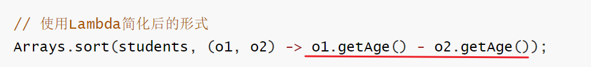

准备另外一个类CompareByData类，用于封装Lambda表达式的方法体代码；

```java
public class CompareByData {
    public static int compareByAge(Student o1, Student o2){
        return o1.getAge() - o2.getAge(); // 升序排序的规则
    }
}
```

现在我们就可以把Lambda表达式的方法体代码，改为下面的样子

```java
Arrays.sort(students, (o1, o2) -> CompareByData.compareByAge(o1, o2));
```

Java为了简化上面Lambda表达式的写法，利用方法引用可以改进为下面的样子。**实际上就是用类名调用方法，但是把参数给省略了。**这就是静态方法引用

```java
//静态方法引用：类名::方法名
Arrays.sort(students, CompareByData::compareByAge);
```

### 3.2 实例方法引用

还是基于上面的案例，我们现在来学习一下实例方法的引用。现在，我想要把下图中Lambda表达式的方法体，用一个实例方法代替。


在CompareByData类中，再添加一个实例方法，用于封装Lambda表达式的方法体

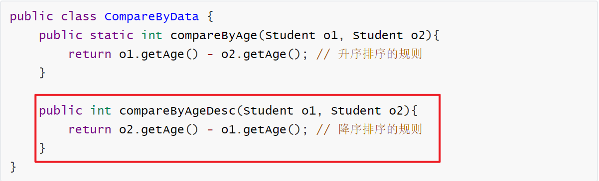

接下来，我们把Lambda表达式的方法体，改用对象调用方法

```java
CompareByData compare = new CompareByData();
Arrays.sort(students, (o1, o2) -> compare.compareByAgeDesc(o1, o2)); // 降序
```

最后，再将Lambda表达式的方法体，直接改成方法引用写法。**实际上就是用类名调用方法，但是省略的参数**。这就是实例方法引用

```java
CompareByData compare = new CompareByData();
Arrays.sort(students, compare::compareByAgeDesc); // 降序
```

> 给小伙伴的寄语：一定要按照老师写的步骤，一步一步来做，你一定能学会的！！！ 


### 3.2 特定类型的方法引用

各位小伙伴，我们继续学习特定类型的方法引用。在学习之前还是需要给大家说明一下，这种特定类型的方法引用是没有什么道理的，只是语法的一种约定，遇到这种场景，就可以这样用。

```java
Java约定：
    如果某个Lambda表达式里只是调用一个实例方法，并且前面参数列表中的第一个参数作为方法的主调，	后面的所有参数都是作为该实例方法的入参时，则就可以使用特定类型的方法引用。
格式：
	类型::方法名
```

```java
public class Test2 {
    public static void main(String[] args) {
        String[] names = {"boby", "angela", "Andy" ,"dlei", "caocao", "Babo", "jack", "Cici"};
        
        // 要求忽略首字符大小写进行排序。
        Arrays.sort(names, new Comparator<String>() {
            @Override
            public int compare(String o1, String o2) {
                // 制定比较规则。o1 = "Andy"  o2 = "angela"
                return o1.compareToIgnoreCase(o2);
            }
        });
		
        //lambda表达式写法
        Arrays.sort(names, ( o1,  o2) -> o1.compareToIgnoreCase(o2) );
        //特定类型的方法引用！
        Arrays.sort(names, String::compareToIgnoreCase);

        System.out.println(Arrays.toString(names));
    }
}
```


### 3.3 构造器引用

各位小伙伴，我们学习最后一种方法引用的形式，叫做构造器引用。还是先说明一下，构造器引用在实际开发中应用的并不多，目前还没有找到构造器的应用场景。所以大家在学习的时候，也只是关注语法就可以了。

现在，我们准备一个JavaBean类，Car类

```java
public class Car {
    private String name;
    private double price;

    public Car() {

    }

    public Car(String name, double price) {
        this.name = name;
        this.price = price;
    }

    public String getName() {
        return name;
    }

    public void setName(String name) {
        this.name = name;
    }

    public double getPrice() {
        return price;
    }

    public void setPrice(double price) {
        this.price = price;
    }

    @Override
    public String toString() {
        return "Car{" +
                "name='" + name + '\'' +
                ", price=" + price +
                '}';
    }
}
```

因为方法引用是基于Lamdba表达式简化的，所以也要按照Lamdba表达式的使用前提来用，需要一个函数式接口，接口中代码的返回值类型是Car类型

```java
interface CreateCar{
    Car create(String name, double price);
}
```

最后，再准备一个测试类，在测试类中创建CreateCar接口的实现类对象，先用匿名内部类创建、再用Lambda表达式创建，最后改用方法引用创建。同学们只关注格式就可以，不要去想为什么（语法就是这么设计的）。

```java
public class Test3 {
    public static void main(String[] args) {
        // 1、创建这个接口的匿名内部类对象。
        CreateCar cc1 = new CreateCar(){
            @Override
            public Car create(String name, double price) {
                return new Car(name, price);
            }
        };
		//2、使用匿名内部类改进
        CreateCar cc2 = (name,  price) -> new Car(name, price);

        //3、使用方法引用改进：构造器引用
        CreateCar cc3 = Car::new;
        
        //注意：以上是创建CreateCar接口实现类对象的几种形式而已，语法一步一步简化。
        
        //4、对象调用方法
        Car car = cc3.create("奔驰", 49.9);
        System.out.println(car);
    }
}
```


## 四、常见算法

### 1.1 认识算法

接下来，我们认识一下什么是算法。算法其实是解决某个实际问题的过程和方法。比如百度地图给你规划路径，计算最优路径的过程就需要用到算法。再比如你在抖音上刷视频时，它会根据你的喜好给你推荐你喜欢看的视频，这里也需要用到算法。

我们为什么要学习算法呢？主要目的是训练我们的编程思维，还有就是面试的时候，面试官也喜欢问一下算法的问题来考察你的技术水平。最后一点，学习算法是成为一个高级程序员的必经之路。

当然我们现在并不会学习非常复杂的算法，万丈高楼平地起，我们现在只需要学习几种常见的基础算法就可以了。而且Java语言本身就内置了一些基础算法给我们使用，实际上自己也不会去写这些算法。


### 1.2 冒泡排序

接下来，我们学习一种算法叫排序算法，它可以价格无序的整数，排列成从小到大的形式（升序），或者从大到小的形式（降序）

排序算法有很多种，我们这里只学习比较简单的两种，一种是冒泡排序，一种是选择排序。学习算法我们先要搞清楚算法的流程，然后再去“推敲“如何写代码。（**注意，我这里用的次是推敲，也就是说算法这样的代码并不是一次成型的，是需要反复修改才能写好的**）。

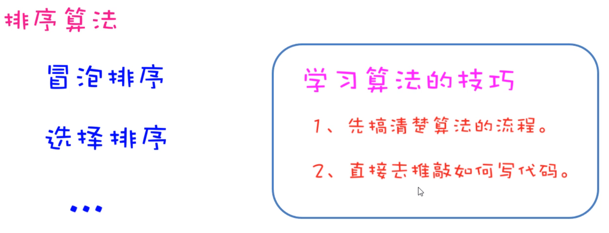


先来学习冒泡排序，先来介绍一下，冒泡排序的流程

```java
冒泡排序核心思路：每次将相邻的两个元素继续比较
如下图所示：
   第一轮比较 3次
   第二轮比较 2次
   第三轮比较 1次
```

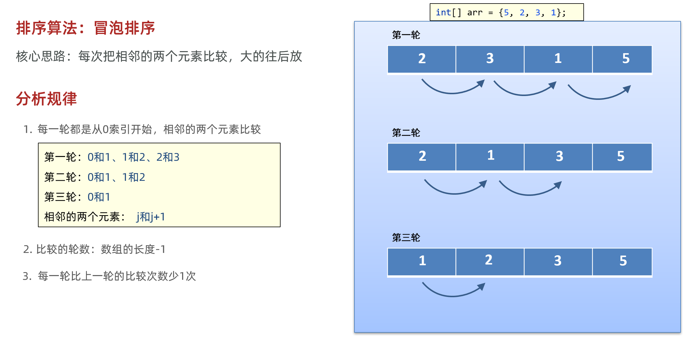

```java
public class Test1 {
    public static void main(String[] args) {
        // 1、准备一个数组
        int[] arr = {5, 2, 3, 1};

        // 2、定义一个循环控制排几轮
        for (int i = 0; i < arr.length - 1; i++) {
            // i = 0  1  2           【5， 2， 3， 1】    次数
            // i = 0 第一轮            0   1   2         3
            // i = 1 第二轮            0   1             2
            // i = 2 第三轮            0                 1

            // 3、定义一个循环控制每轮比较几次。
            for (int j = 0; j < arr.length - i - 1; j++) {
                // 判断当前位置的元素值，是否大于后一个位置处的元素值，如果大则交换。
                if(arr[j] > arr[j+1]){
                    int temp = arr[j + 1];
                    arr[j + 1] = arr[j];
                    arr[j] = temp;
                }
            }
        }
        System.out.println(Arrays.toString(arr));
    }
}
```


### 1.2 选择排序

刚才我们学习了冒泡排序，接下来我们学习了另一种排序方法，叫做选择排序。按照我们刚才给大家介绍的算法的学习方式。先要搞清楚算法的流程，再去推敲代码怎么写。

所以我们先分析选择排序算法的流程：选择排序的核心思路是，每一轮选定一个固定的元素，和其他的每一个元素进行比较；经过几轮比较之后，每一个元素都能比较到了。

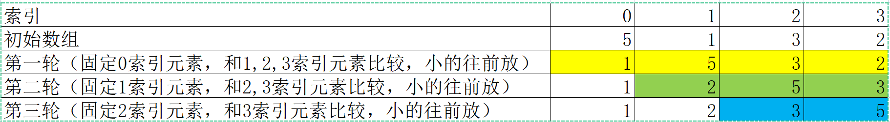

接下来，按照选择排序的流程编写代码

```java
ublic class Test2 {
    public static void main(String[] args) {
        // 1、准备好一个数组
        int[] arr = {5, 1, 3, 2};
        //           0  1  2  3

        // 2、控制选择几轮
        for (int i = 0; i < arr.length - 1; i++) {
            // i = 0 第一轮    j = 1 2 3
            // i = 1 第二轮    j = 2 3
            // i = 2 第三轮    j = 3
            // 3、控制每轮选择几次。
            for (int j = i + 1; j < arr.length; j++) {
                // 判断当前位置是否大于后面位置处的元素值，若大于则交换。
                if(arr[i] > arr[j]){
                    int temp = arr[i];
                    arr[i] = arr[j];
                    arr[j] = temp;
                }
            }
        }
        System.out.println(Arrays.toString(arr));
    }
}
```


### 1.3 查找算法

接下来，我们学习一个查找算法叫做二分查找。在学习二分查找之前，我们先来说一下基本查找，从基本查找的弊端，我们再引入二分查找，这样我们的学习也会更加丝滑一下。

**先聊一聊基本查找：**假设我们要查找的元素是81，如果是基本查找的话，只能从0索引开始一个一个往后找，但是如果元素比较多，你要查找的元素比较靠后的话，这样查找的此处就比较多。性能比较差。

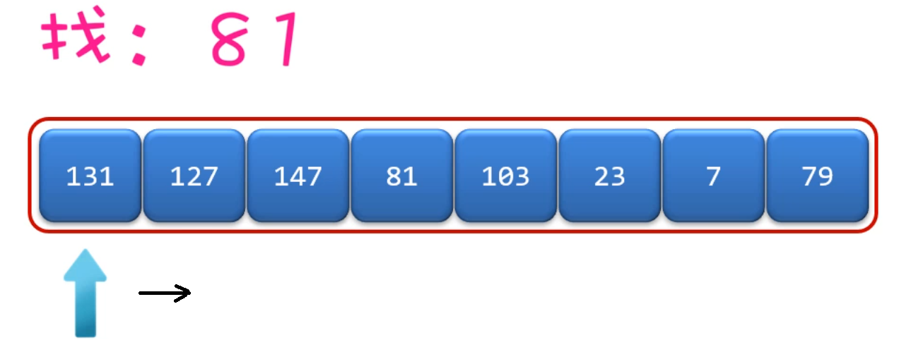

**再讲二分查找**：二分查找的主要特点是，每次查找能排除一般元素，这样效率明显提高。**但是二分查找要求比较苛刻，它要求元素必须是有序的，否则不能进行二分查找。**

- 二分查找的核心思路

```java
第1步：先定义两个变量，分别记录开始索引(left)和结束索引(right)
第2步：计算中间位置的索引，mid = (left+right)/2;
第3步：每次查找中间mid位置的元素，和目标元素key进行比较
		如果中间位置元素比目标元素小，那就说明mid前面的元素都比目标元素小
			此时：left = mid+1
    	如果中间位置元素比目标元素大，那说明mid后面的元素都比目标元素大
    		此时：right = mid-1
		如果中间位置元素和目标元素相等，那说明mid就是我们要找的位置
			此时：把mid返回		
注意：一搬查找一次肯定是不够的，所以需要把第1步和第2步循环来做，只到left>end就结束，如果最后还没有找到目标元素，就返回-1.
```

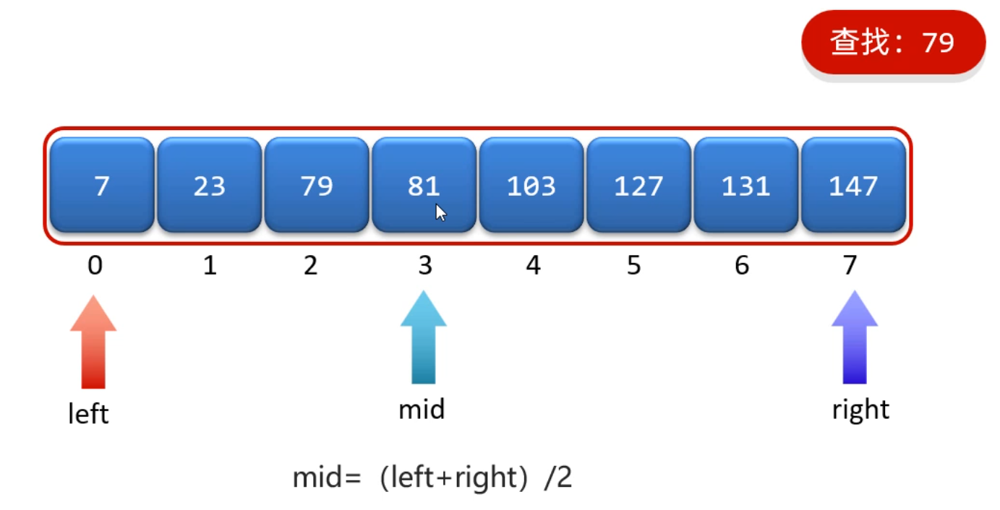

```java
/**
 * 目标：掌握二分查找算法。
 */
public class Test3 {
    public static void main(String[] args) {
        // 1、准备好一个数组。
        int[] arr = {7, 23, 79, 81, 103, 127, 131, 147};

        System.out.println(binarySearch(arr, 150));

        System.out.println(Arrays.binarySearch(arr, 81));
    }

    public static int binarySearch(int[] arr, int data){
        // 1、定义两个变量，一个站在左边位置，一个站在右边位置
        int left = 0;
        int right = arr.length - 1;

        // 2、定义一个循环控制折半。
        while (left <= right){
            // 3、每次折半，都算出中间位置处的索引
            int middle = (left + right) / 2;
            // 4、判断当前要找的元素值，与中间位置处的元素值的大小情况。
            if(data < arr[middle]){
                // 往左边找，截止位置（右边位置） = 中间位置 - 1
                right = middle - 1;
            }else if(data > arr[middle]){
                // 往右边找，起始位置（左边位置） = 中间位置 + 1
                left = middle + 1;
            }else {
                // 中间位置处的元素值，正好等于我们要找的元素值
                return middle;
            }
        }
        return -1; // -1特殊结果，就代表没有找到数据！数组中不存在该数据！
    }
}
```


## 五、正则表达式

接下来，我们学习一个全新的知识，叫做正则表达式。**正则表达式其实是由一些特殊的符号组成的，它代表的是某种规则。**

> 正则表达式的作用1：用来校验字符串数据是否合法
>
> 正则表达式的作用2：可以从一段文本中查找满足要求的内容

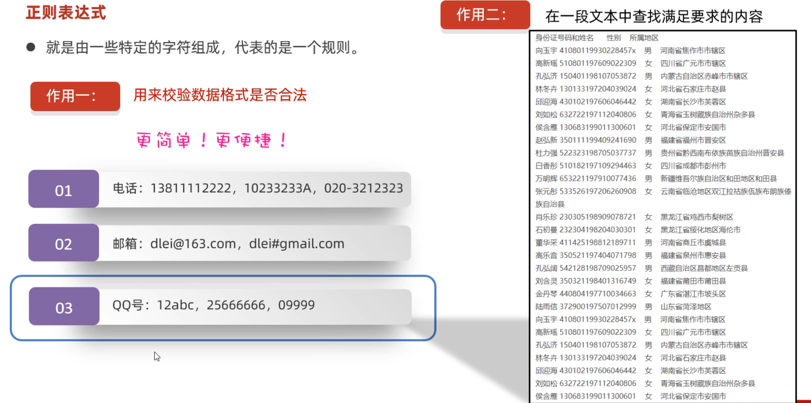

### 5.1 正则表达式初体验

现在，我们就以QQ号码为例，来体验一下正则表达式的用法。注意：现在仅仅只是体验而已，我们还没有讲正则表达式的具体写法。

- 不使用正则表达式，校验QQ号码代码是这样的

```java
public static boolean checkQQ(String qq){
        // 1、判断qq号码是否为null
        if(qq == null || qq.startsWith("0") || qq.length() < 6 || qq.length() > 20){
            return false;
        }

        // 2、qq至少是不是null,不是以0开头的，满足6-20之间的长度。
        // 判断qq号码中是否都是数字。
        // qq = 2514ghd234
        for (int i = 0; i < qq.length(); i++) {
            // 根据索引提取当前位置处的字符。
            char ch = qq.charAt(i);
            // 判断ch记住的字符，如果不是数字，qq号码不合法。
            if(ch < '0' || ch > '9'){
                return false;
            }
        }
        // 3、说明qq号码肯定是合法
        return true;
    }
```

- 用正则表达式代码是这样的

```java
public static boolean checkQQ1(String qq){
    return qq != null && qq.matches("[1-9]\\d{5,19}");
}
```

我们发现，使用正则表达式，大大简化的了代码的写法。这个代码现在不用写，体验到正则表达式的优势就可以了。


### 5.2 正则表达式书写规则

前面我们已经体验到了正则表达式，可以简化校验数据的代码书写。这里需要用到一个方法叫`matches(String regex)`。这个方法时属于String类的方法。

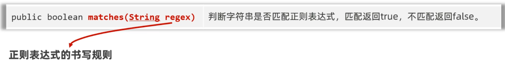

这个方法是用来匹配一个字符串是否匹配正则表达式的规则，参数需要调用者传递一个正则表达式。但是正则表达式不能乱写，是有特定的规则的。

下面我们就学习一下，正则表达式的规则。从哪里学呢？在API中有一个类叫做Pattern，我们可以到API文档中搜索，关于正则表达式的规则，这个类都告诉我们了。我这里把常用的已经给大家整理好了。


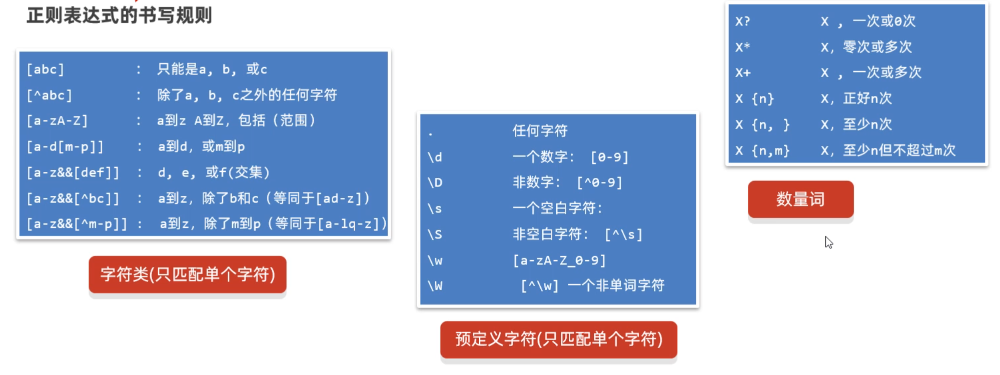

我们将这些规则，在代码中演示一下

```java
/**
 * 目标：掌握正则表达式的书写规则
 */
public class RegexTest2 {
    public static void main(String[] args) {
        // 1、字符类(只能匹配单个字符)
        System.out.println("a".matches("[abc]"));    // [abc]只能匹配a、b、c
        System.out.println("e".matches("[abcd]")); // false

        System.out.println("d".matches("[^abc]"));   // [^abc] 不能是abc
        System.out.println("a".matches("[^abc]"));  // false

        System.out.println("b".matches("[a-zA-Z]")); // [a-zA-Z] 只能是a-z A-Z的字符
        System.out.println("2".matches("[a-zA-Z]")); // false

        System.out.println("k".matches("[a-z&&[^bc]]")); // ： a到z，除了b和c
        System.out.println("b".matches("[a-z&&[^bc]]")); // false

        System.out.println("ab".matches("[a-zA-Z0-9]")); // false 注意：以上带 [内容] 的规则都只能用于匹配单个字符

        // 2、预定义字符(只能匹配单个字符)  .  \d  \D   \s  \S  \w  \W
        System.out.println("徐".matches(".")); // .可以匹配任意字符
        System.out.println("徐徐".matches(".")); // false

        // \转义
        System.out.println("\"");
        // \n \t
        System.out.println("3".matches("\\d"));  // \d: 0-9
        System.out.println("a".matches("\\d"));  //false

        System.out.println(" ".matches("\\s"));   // \s: 代表一个空白字符
        System.out.println("a".matches("\s")); // false

        System.out.println("a".matches("\\S"));  // \S: 代表一个非空白字符
        System.out.println(" ".matches("\\S")); // false

        System.out.println("a".matches("\\w"));  // \w: [a-zA-Z_0-9]
        System.out.println("_".matches("\\w")); // true
        System.out.println("徐".matches("\\w")); // false

        System.out.println("徐".matches("\\W"));  // [^\w]不能是a-zA-Z_0-9
        System.out.println("a".matches("\\W"));  // false

        System.out.println("23232".matches("\\d")); // false 注意：以上预定义字符都只能匹配单个字符。

        // 3、数量词： ?   *   +   {n}   {n, }  {n, m}
        System.out.println("a".matches("\\w?"));   // ? 代表0次或1次
        System.out.println("".matches("\\w?"));    // true
        System.out.println("abc".matches("\\w?")); // false

        System.out.println("abc12".matches("\\w*"));   // * 代表0次或多次
        System.out.println("".matches("\\w*"));        // true
        System.out.println("abc12张".matches("\\w*")); // false

        System.out.println("abc12".matches("\\w+"));   // + 代表1次或多次
        System.out.println("".matches("\\w+"));       // false
        System.out.println("abc12张".matches("\\w+")); // false

        System.out.println("a3c".matches("\\w{3}"));   // {3} 代表要正好是n次
        System.out.println("abcd".matches("\\w{3}"));  // false
        System.out.println("abcd".matches("\\w{3,}"));     // {3,} 代表是>=3次
        System.out.println("ab".matches("\\w{3,}"));     // false
        System.out.println("abcde徐".matches("\\w{3,}"));     // false
        System.out.println("abc232d".matches("\\w{3,9}"));     // {3, 9} 代表是  大于等于3次，小于等于9次

        // 4、其他几个常用的符号：(?i)忽略大小写 、 或：| 、  分组：()
        System.out.println("abc".matches("(?i)abc")); // true
        System.out.println("ABC".matches("(?i)abc")); // true
        System.out.println("aBc".matches("a((?i)b)c")); // true
        System.out.println("ABc".matches("a((?i)b)c")); // false

        // 需求1：要求要么是3个小写字母，要么是3个数字。
        System.out.println("abc".matches("[a-z]{3}|\\d{3}")); // true
        System.out.println("ABC".matches("[a-z]{3}|\\d{3}")); // false
        System.out.println("123".matches("[a-z]{3}|\\d{3}")); // true
        System.out.println("A12".matches("[a-z]{3}|\\d{3}")); // false

        // 需求2：必须是”我爱“开头，中间可以是至少一个”编程“，最后至少是1个”666“
        System.out.println("我爱编程编程666666".matches("我爱(编程)+(666)+"));
        System.out.println("我爱编程编程66666".matches("我爱(编程)+(666)+"));
    }
}
```


### 5.3 正则表达式应用案例

学习完正则表达式的规则之后，接下来我们再利用正则表达式，去校验几个实际案例。

- 正则表达式校验手机号码

```java
/**
 * 目标：校验用户输入的电话、邮箱、时间是否合法。
 */
public class RegexTest3 {
    public static void main(String[] args) {
        checkPhone();
    }

    public static void checkPhone(){
        while (true) {
            System.out.println("请您输入您的电话号码(手机|座机): ");
            Scanner sc = new Scanner(System.in);
            String phone = sc.nextLine();
            // 18676769999  010-3424242424 0104644535
            if(phone.matches("(1[3-9]\\d{9})|(0\\d{2,7}-?[1-9]\\d{4,19})")){
                System.out.println("您输入的号码格式正确~~~");
                break;
            }else {
                System.out.println("您输入的号码格式不正确~~~");
            }
        }
    }
}
```

- 使用正则表达式校验邮箱是否正确

```java
public class RegexTest3 {
    public static void main(String[] args) {
        checkEmail();
    }

    public static void checkEmail(){
        while (true) {
            System.out.println("请您输入您的邮箱： ");
            Scanner sc = new Scanner(System.in);
            String email = sc.nextLine();
            /**
             * dlei0009@163.com
             * 25143242@qq.com
             * itheima@itcast.com.cn
             */
            if(email.matches("\\w{2,}@\\w{2,20}(\\.\\w{2,10}){1,2}")){
                System.out.println("您输入的邮箱格式正确~~~");
                break;
            }else {
                System.out.println("您输入的邮箱格式不正确~~~");
            }
        }
    }
}

```


### 5.4 正则表达式信息爬取

各位小伙伴，在前面的课程中，我们学习了正则表达式的作用之一，用来校验数据格式的正确性。接下来我们学习**正则表达式的第二个作用：在一段文本中查找满足要求的内容**

我们还是通过一个案例给大家做演示：案例需求如下

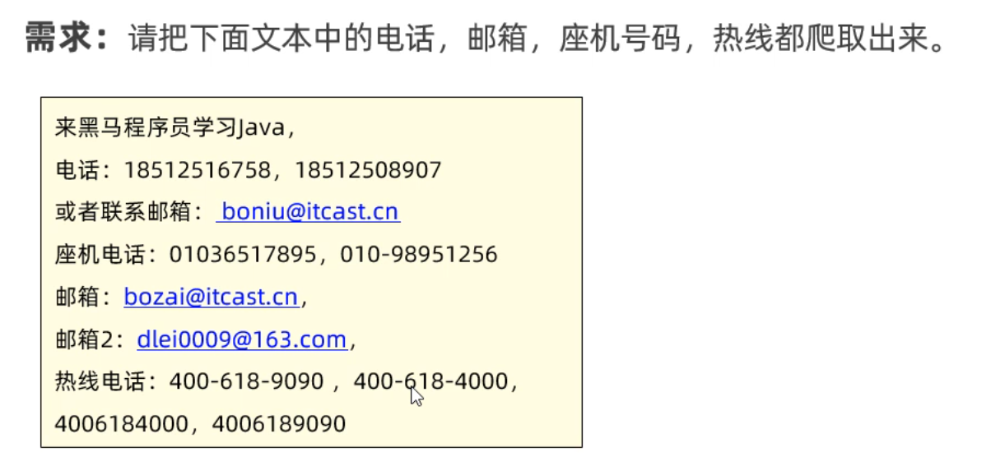

```java
/**
 * 目标：掌握使用正则表达式查找内容。
 */
public class RegexTest4 {
    public static void main(String[] args) {
        method1();
    }

    // 需求1：从以下内容中爬取出，手机，邮箱，座机、400电话等信息。
    public static void method1(){
        String data = " 来黑马程序员学习Java，\n" +
                "        电话：1866668888，18699997777\n" +
                "        或者联系邮箱：boniu@itcast.cn，\n" +
                "        座机电话：01036517895，010-98951256\n" +
                "        邮箱：bozai@itcast.cn，\n" +
                "        邮箱：dlei0009@163.com，\n" +
                "        热线电话：400-618-9090 ，400-618-4000，4006184000，4006189090";
        // 1、定义爬取规则
        String regex = "(1[3-9]\\d{9})|(0\\d{2,7}-?[1-9]\\d{4,19})|(\\w{2,}@\\w{2,20}(\\.\\w{2,10}){1,2})"
                + "|(400-?\\d{3,7}-?\\d{3,7})";
        // 2、把正则表达式封装成一个Pattern对象
        Pattern pattern = Pattern.compile(regex);
        // 3、通过pattern对象去获取查找内容的匹配器对象。
        Matcher matcher = pattern.matcher(data);
        // 4、定义一个循环开始爬取信息
        while (matcher.find()){
            String rs = matcher.group(); // 获取到了找到的内容了。
            System.out.println(rs);
        }
    }
}
```


### 5.5 正则表达式搜索、替换

接下来，我们学习一下正则表达式的另外两个功能，替换、分割的功能。需要注意的是这几个功能需要用到Stirng类中的方法。这两个方法其实我们之前学过，只是当时没有学正则表达式而已。

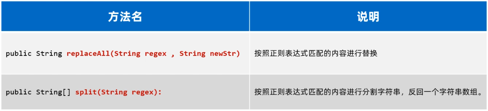

```java
/**
 * 目标：掌握使用正则表达式做搜索替换，内容分割。
 */
public class RegexTest5 {
    public static void main(String[] args) {
        // 1、public String replaceAll(String regex , String newStr)：按照正则表达式匹配的内容进行替换
        // 需求1：请把下面字符串中的不是汉字的部分替换为 “-”
        String s1 = "古力娜扎ai8888迪丽热巴999aa5566马尔扎哈fbbfsfs42425卡尔扎巴";
        System.out.println(s1.replaceAll("\\w+", "-"));
        
        // 需求2(拓展)：某语音系统，收到一个口吃的人说的“我我我喜欢编编编编编编编编编编编编程程程！”，需要优化成“我喜欢编程！”。
        String s2 = "我我我喜欢编编编编编编编编编编编编程程程";
        System.out.println(s2.replaceAll("(.)\\1+", "$1"));

        // 2、public String[] split(String regex)：按照正则表达式匹配的内容进行分割字符串，反回一个字符串数组。
        // 需求1：请把下面字符串中的人名取出来，使用切割来做
        String s3 = "古力娜扎ai8888迪丽热巴999aa5566马尔扎哈fbbfsfs42425卡尔扎巴";
        String[] names = s3.split("\\w+");
        System.out.println(Arrays.toString(names));
    }
}
```


