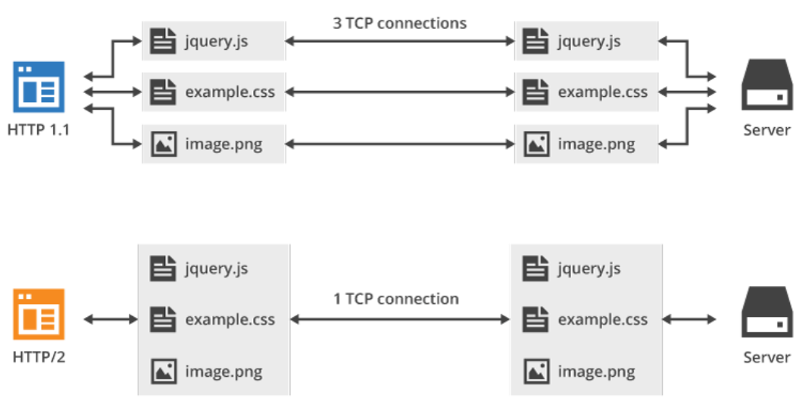
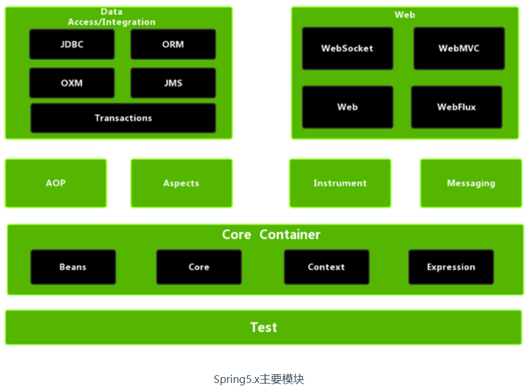
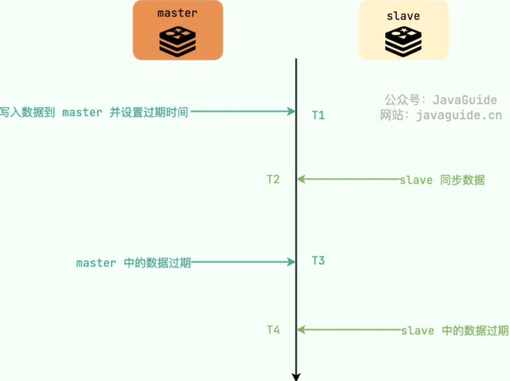
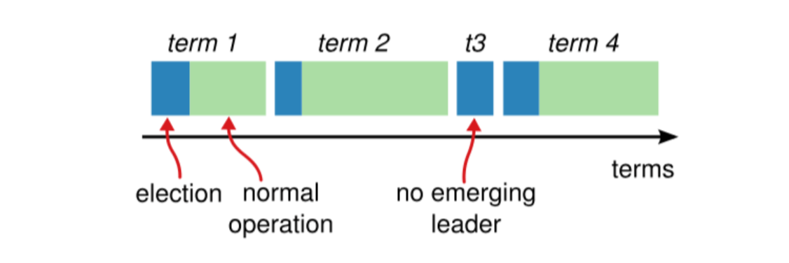

# 第01章_计算机网络

## 1. 基础知识

### 1.1 OSI七层模型是什么

**OSI七层模型**是国际标准化组织提出一个网络分层模型，自上至下分别是：

- 应用层：为计算机用户提供服务
- 表示层：数据处理（编解码、加密解密、压缩解压缩）
- 会话层：管理（建立/维护/重连）应用程序之间的会话
- 传输层：为两台主机进程之间的通信提供通用的数据传输服务
- 网络层：路由和寻址（决定数据在网络中的游走路径）
- 数据链路层：帧编码和误差纠正控制
- 物理层：透明地传输比特流

每一层都**专注做一件事情**，并且每一层都需要使用下一层提供的功能，比如传输层需要使用网络层提供的路由和寻址功能，这样传输层才知道把数据传输到哪里去。

> 说明：OSI七层模型理论很完整，但是较为复杂、不实用。所以更常用的是TCP/IP四层模型。

### 1.2 TCP/IP四层模型是什么

**TCP/IP四层模型**是目前被广泛采用的一种模型，可以看作是OSI七层模型的精简版本，自上至下分别是：

- 应用层：对应于OSI模型的应用层、表示层、会话层。主要提供两个终端设备上的应用程序之间信息交换的服务。应用层的信息分组称为**报文(message)**。
- 传输层：对应于OSI模型的传输层。主要负责向两台终端设备进程之间的通信提供通用的数据传输服务。传输层的信息分组称为**报文段(segment)**。
- 网络层：对应于OSI模型的网络层。负责为分组交换网上的不同主机提供通信服务，主要进行IP寻址和路由选择。网络层的信息分组称为**数据报(datagram)**。
- 网络接口层：对应于OSI模型的数据链路层、物理层。数据链路层的信息分组称为**帧(frame)**，作用是在两个相邻节点间的链路上传送帧。物理层主要定义物理设备的标准，其作用是实现相邻节点之间比特流的透明传输，尽可能屏蔽掉具体传输介质和物理设备的差异。

> 说明：TCP/IP模型并不能与OSI模型精确匹配起来，但是可以像上述一样进行简单对应。

**注意**：数据从发送主机的协议栈向下，沿着中间的链路层交换机和路由器的协议栈上上下下，最终达到接收主机的协议栈向上交付数据。其中链路层交换机只有物理层和链路层，而路由器只有物理层、链路层和网络层。在每一层，一个分组具有两种类型的字段：首部字段和有效载荷字段，有效载荷通常是来自上一层的分组。

### 1.3 应用层的主要协议有哪些

- **HTTP（Hypertext Transfer Protocol，超文本传输协议）**：基于 TCP 协议，主要是为 Web 浏览器与 Web 服务器之间的通信而设计的
- **SMTP（Simple Mail Transfer Protocol，简单邮件发送协议）**：基于 TCP 协议，是一种用于发送电子邮件的协议。注意：SMTP 协议只负责邮件的发送，而不是接收。要从邮件服务器接收邮件，需要使用 POP3 或 IMAP 或 HTTP 协议。
- **POP3/IMAP（邮件接收协议）**：基于 TCP 协议，两者都是负责邮件接收的协议。IMAP 协议是比 POP3 更新的协议，它在功能和性能上都更加强大，几乎所有现代电子邮件客户端和服务器都支持 IMAP。
- **FTP（File Transfer Protocol，文件传输协议）** : 基于 TCP 协议，是一种用于在计算机之间传输文件的协议。注意：FTP 是一种不安全的协议，因为它在传输过程中不会对数据进行加密。建议在传输敏感数据时使用更安全的协议，如 SFTP。
- **Telnet（远程登陆协议）**：基于 TCP 协议，用于通过一个终端登陆到其他服务器。Telnet 协议的最大缺点之一是所有数据（包括密码）均以明文形式发送，这有潜在的安全风险。所以如今很少使用 Telnet，而是使用 SSH 。
- **SSH（Secure Shell Protocol，安全的网络传输协议）**：基于 TCP 协议，通过加密和认证机制实现安全的访问和文件传输等业务。SSH 的经典用途是登录到远程电脑中执行命令，它使用C/S架构，默认端口是 22。
- **RTP（Real-time Transport Protocol，实时传输协议）**：通常基于 UDP 协议，但也支持 TCP 协议。它提供了端到端的实时传输数据的功能，但不保证实时传输质量。
- **DNS（Domain Name System，域名管理系统）**：基于 UDP 协议，用于解决域名和 IP 地址的映射问题。

### 1.4 传输层的主要协议有哪些

- **TCP（Transmission Control Protocol，传输控制协议 ）**：提供面向连接的可靠数据传输服务
- **UDP（User Datagram Protocol，用户数据协议）**：提供无连接的，尽最大努力的数据传输服务

### 1.5 网络层的主要协议有哪些

- **IP（Internet Protocol，网际协议）**：主要作用是定义数据包的格式、对数据包进行路由和寻址，以便它们可以跨网络传播并到达正确的目的地。目前 IP 协议主要分为两种，一种是过去的 IPv4，另一种是较新的 IPv6，目前这两种协议都在使用，但后者已经被提议来取代前者。
- **ARP（Address Resolution Protocol，地址解析协议）**：ARP 协议解决的是网络层地址和链路层地址之间的转换问题。
- **ICMP（Internet Control Message Protocol，互联网控制报文协议）**：一种用于传输网络状态和错误消息的协议，常用于网络诊断和故障排除。例如，Ping 工具就使用了 ICMP 协议来测试网络连通性。
- **NAT（Network Address Translation，网络地址转换协议）**：应用于内部网到外部网的地址转换过程中。

注意，以下三个协议与网络层密切相关，但并不属于网络层协议：

- **OSPF（Open Shortest Path First，开放式最短路径优先）** ：一种内部网关协议，也是广泛使用的一种动态路由协议，基于链路状态算法，考虑了链路的带宽、延迟等因素来选择最佳路径。它是传输层协议，基于IP。
- **RIP（Routing Information Protocol，路由信息协议）**：一种内部网关协议，也是一种动态路由协议，基于距离向量算法，使用固定的跳数作为度量标准，选择跳数最少的路径作为最佳路径。它是应用层协议，基于UDP。
- **BGP（Border Gateway Protocol，边界网关协议）**：一种用来在路由选择域之间交换网络层可达性信息的路由选择协议。它是应用层协议，基于TCP。

## 2. HTTP

### 2.1 从输入URL到页面展示的过程

1. 在浏览器中输入指定网页的 URL。
2. 浏览器通过 DNS 协议，获取域名对应的 IP 地址。
3. 浏览器根据 IP 地址和端口号，向目标服务器发起一个 TCP 连接请求。
4. 浏览器在 TCP 连接上，向服务器发送一个 HTTP 请求报文，请求获取网页的内容。
5. 服务器收到 HTTP 请求报文后，处理请求，并返回 HTTP 响应报文给浏览器。
6. 浏览器收到 HTTP 响应报文后，解析响应体中的 HTML 代码，渲染网页的结构和样式，同时根据 HTML 中的其他资源的 URL（如图片、CSS、JS 等），再次发起 HTTP 请求，获取这些资源的内容，直到网页完全加载显示。
7. 浏览器在不需要和服务器通信时，可以主动关闭 TCP 连接，或者等待服务器的关闭请求。

### 2.2 HTTP状态码有哪些

（1）`1XX`是**信息性状态码**

（2）`2XX`是**成功状态码**

- `200 OK`：请求被成功处理
- `201 Created`：请求被成功处理并且在服务端创建了一个新的资源。比如我们通过POST请求创建一个新的用户。
- `202 Accepted`：服务端已经接收到了请求，但是还未处理
- `204 No Content`：服务端已成功处理了请求，但是没有返回任何内容

（3）`3XX`是**重定向状态码**

- `301 Moved Permanently`：资源被永久重定向了。比如网站的网址更换了。
- `302 Found`：资源被临时重定向了。比如网站的某些资源被暂时转移到另外一个网址。

（4）`4XX`是**客户端错误状态码**

- `400 Bad Request`：请求参数不合法
- `401 Unauthorized`：未认证却请求需要认证之后才能访问的资源。
- `403 Forbidden`：直接拒绝 HTTP 请求，不处理。一般用来针对非法、无权限的请求。
- `404 Not Found`：请求的资源未在服务端找到。
- `405 Method Not Allowed`：请求方式和服务器端对应的处理方式不一致
- `406 Not Acceptable`：请求扩展名和实际返回的响应体类型不一致
- `409 Conflict`：表示请求的资源与服务端当前的状态存在冲突，请求无法被处理。

（5）`5XX`是**服务器错误状态码**

- `500 Internal Server Error`：服务端出问题了。比如服务端处理请求的时候突然抛出异常，但是异常并未在服务端被正确处理。
- `502 Bad Gateway`：网关将请求转发到服务端，但是服务端返回的却是一个错误的响应。

### 2.3 HTTP请求头中的常见字段有哪些

- Accept: 告诉服务器，客户端可以接收的响应数据类型（例如`Accept: text/plain`）
- Accept-Charset: 告诉服务器，客户端可以接收的字符集（例如`Accept-Charset: utf-8`）
- Accept-Encoding: 告诉服务器，客户端可以接收的数据压缩格式（例如`Accept-Encoding: gzip`）
- Accept-Language: 告诉服务器，客户端可以接收的语言类型。zh-CN表示中文中国，en-US表示英文美国。
- Authorization: 用于超文本传输协议认证的认证信息
- Connection: 告诉服务器是否使用持续连接（长连接）。keep-alive表示使用持续连接（默认），closed表示使用非持续连接。
- Host: 表示请求的服务器域名和端口号
- User-Agent: 表示客户端浏览器的信息
- Cookie: 浏览器访问服务器时携带的Cookie数据
- Referer: 表示从哪个网址来访问的
- Cache-Control: 表示如何控制缓存

除此以外，对于含有请求体的请求（如POST、PUT），还会有以下常用字段：

- Content-Type: 表示发送的数据的类型，常见的有：
  - application/x-www-form-urlencoded: 表示提交的数据格式为`key=value&key=value`，并对其进行url编码(url编码就是把非英文内容转换为`%xx%xx`的形式)
  - multipart/form-data: 表示以多段的形式提交数据给服务器（以流的形式提交，一般用于文件上传）
  - application/json: 使用json格式数据，在前后端分离项目中使用的最多
- Content-Length: 请求体内数据的长度（单位是字节）

### 2.4 HTTP响应头中的常见字段有哪些

- Content-Type: 表示响应体的数据类型
- Content-Length: 表示响应体的长度
- Set-Cookie: 服务器返回新的Cookie信息给浏览器
- Location: 在重定向的情况下，告诉浏览器访问下一个资源的地址

### 2.5 HTTP和HTTPS的区别

- **端口号**：HTTP 默认是 80，HTTPS 默认是 443。
- **安全性和资源消耗**：HTTP 协议运行在 TCP 之上，所有传输的内容都是明文，客户端和服务器端都无法验证对方的身份。HTTPS 是运行在 SSL/TLS 之上的 HTTP 协议，SSL/TLS 运行在 TCP 之上，所有传输的内容都经过加密，加密采用对称加密，但对称加密的密钥用服务器方的证书进行了非对称加密。所以说，HTTP 安全性没有 HTTPS 高，但是 HTTPS 比 HTTP 耗费更多服务器资源。
- **SEO（搜索引擎优化）**：搜索引擎通常会更青睐使用 HTTPS 协议的网站，因为 HTTPS 能够提供更高的安全性和用户隐私保护。使用 HTTPS 协议的网站在搜索结果中可能会被优先显示，从而对 SEO 产生影响。

### 2.6 HTTP/1.0和HTTP/1.1的区别

- **连接方式** : HTTP/1.0 为短连接，HTTP/1.1 默认使用长连接。
- **状态响应码** : HTTP/1.1 中新加入了大量的状态码
- **缓存机制** : 在 HTTP/1.0 中主要使用 Header 里的 If-Modified-Since,Expires 来做为缓存判断的标准，HTTP/1.1 则引入了更多的缓存控制策略例如 Entity tag，If-Unmodified-Since, If-Match, If-None-Match 等更多可供选择的缓存头来控制缓存策略。
- **带宽**：HTTP/1.0 中，存在一些浪费带宽的现象，例如客户端只是需要某个对象的一部分，而服务器却将整个对象送过来了，并且不支持断点续传功能。HTTP/1.1 则在请求头引入了 range 头域，它允许只请求资源的某个部分，即返回码是 206（Partial Content），这样就方便了开发者自由的选择以便于充分利用带宽和连接。
- **Host 头处理** : HTTP/1.1 引入了 Host 头字段，允许在同一 IP 地址上托管多个域名，从而支持虚拟主机的功能。而 HTTP/1.0 没有 Host 头字段，无法实现虚拟主机。

### 2.7 HTTP/1.1和HTTP/2.0的区别

- **多路复用**：HTTP/2.0 在**同一连接上可以同时传输多个请求和响应**（可以看作是 HTTP/1.1 中长连接的升级版本），互不干扰。HTTP/1.1 则使用串行方式，每个请求和响应都需要独立的连接，而浏览器为了控制资源会有 6-8 个 TCP 连接的限制。这使得 HTTP/2.0 在处理多个请求时更加高效，减少了网络延迟和提高了性能。
- **二进制帧**：HTTP/2.0 使用二进制帧进行数据传输，而 HTTP/1.1 则使用文本格式的报文。二进制帧更加紧凑和高效，减少了传输的数据量和带宽消耗。
- **头部压缩**：HTTP/1.1 支持`Body`压缩，而`Header`不支持压缩。HTTP/2.0 支持对`Header`压缩，使用了专门为`Header`压缩而设计的 HPACK 算法，减少了网络开销。
- **服务器推送**：HTTP/2.0 支持服务器推送，可以在客户端请求一个资源时，将其他相关资源一并推送给客户端，从而减少了客户端的请求次数和延迟。而 HTTP/1.1 需要客户端自己发送请求来获取相关资源。



### 2.8 HTTP/2.0和HTTP/3.0的区别

- **传输协议**：HTTP/2.0 是基于 TCP 协议实现的，HTTP/3.0 新增了 QUIC（Quick UDP Internet Connections） 协议来实现可靠的传输，提供与 TLS/SSL 相当的安全性，具有较低的连接和传输延迟。可以将 QUIC 看作是 UDP 的升级版本，在其基础上新增了很多功能比如加密、重传等等。HTTP/3.0 之前名为 HTTP-over-QUIC，从这个名字中我们也可以发现，HTTP/3 最大的改造就是使用了 QUIC。
- **连接建立**：HTTP/2.0 需要经过经典的 TCP 三次握手过程（由于安全的 HTTPS 连接建立还需要 TLS 握手，共需要大约 3 个 RTT）。由于 QUIC 协议的特性（TLS 1.3，TLS 1.3 除了支持 1 个 RTT 的握手，还支持 0 个 RTT 的握手）连接建立仅需 0-RTT 或者 1-RTT。这意味着 QUIC 在最佳情况下不需要任何的额外往返时间就可以建立新连接。
- **队头阻塞**：HTTP/2.0 多请求复用一个 TCP 连接，一旦发生丢包，就会阻塞住所有的 HTTP 请求。由于 QUIC 协议的特性，HTTP/3.0 在一定程度上解决了队头阻塞（Head-of-Line blocking, 简写：HOL blocking）问题，一个连接建立多个不同的数据流，这些数据流之间独立互不影响，某个数据流发生丢包了，其数据流不受影响（本质上是多路复用+轮询）。
- **错误恢复**：HTTP/3.0 具有更好的错误恢复机制，当出现丢包、延迟等网络问题时，可以更快地进行恢复和重传。而 HTTP/2.0 则需要依赖于 TCP 的错误恢复机制。
- **安全性**：HTTP/2.0 和 HTTP/3.0 在安全性上都有较高的要求，支持加密通信，但在实现上有所不同。HTTP/2.0 使用 TLS 协议进行加密，而 HTTP/3.0 基于 QUIC 协议，包含了内置的加密和身份验证机制，可以提供更强的安全性。


### 2.9 HTTP是无状态协议，该如何保存用户状态

HTTP 是无状态（stateless）协议，也就是说 HTTP 协议自身不对请求和响应之间的通信状态进行保存。要想保存用户状态，可以使用Session机制，它的主要作用就是通过服务端记录用户的状态。在服务端保存 Session 的方法很多，最常用的就是内存和Redis数据库。

注意：Session存放在服务端，所以想要实现Session跟踪，一般可以通过在 Cookie 中附加一个 Session ID 的方式来跟踪。如果Cookie被禁用，则可以利用URL重写把 Session ID 直接附加在 URL 路径的后面。

### 2.10 URI和URL的区别

- URI(Uniform Resource Identifier) 是统一资源标志符，可以唯一标识一个资源。
- URL(Uniform Resource Locator) 是统一资源定位符，可以提供该资源的路径。它是一种具体的URI，不仅可以唯一标识资源，而且还提供了定位该资源的信息。

> URI 的作用像身份证号一样，URL 的作用更像家庭住址一样

### 2.11 SSL/TLS协议是什么

HTTPS 之所以能达到较高的安全性要求，就是结合了 SSL/TLS 和 TCP 协议，对通信数据进行加密。

> 说明：SSL和TLS并没有太大区别。SSL指安全套接字协议（Secure Sockets Layer），SSL 3.0 进一步升级后的新版本就被命名为TLS 1.0，所以由于习惯叫法，通常就把HTTPS中的核心加密协议混称为 SSL/TLS。

使用 SSL/TLS 进行通信的双方使用**对称加密**（双方使用相同的密钥）来对通信数据进行加密，因为如果采用非对称加密（双方分别持有公钥和私钥）来加密所有通信数据的话，计算的成本代价太高。而对称加密的密钥，需要在双方通信前先进行交换，所以它使用了服务器方的证书进行了**非对称加密**，这样能够保证对称加密的密钥在网络信道中传输时无法被窃取，提高了安全性。

## 3. WebSocket

### 3.1 什么是WebSocket

WebSocket 是一种**基于 TCP 连接的全双工通信协议**，即客户端和服务器可以同时发送和接收数据。

WebSocket 协议在 2008 年诞生，2011 年成为国际标准，几乎所有主流较新版本的浏览器都支持该协议。不过，WebSocket 不仅能在基于浏览器的应用程序中使用，很多编程语言、框架和服务器都提供了 WebSocket 支持。

WebSocket 协议本质上是应用层的协议，用于弥补 HTTP 协议在持久通信能力上的不足。客户端和服务器仅需一次握手，两者之间就直接可以创建持久性的连接，并进行双向数据传输。

WebSocket 的常见应用场景：

- 视频弹幕
- 实时消息推送
- 实时游戏对战
- 多用户协同编辑
- 社交聊天

### 3.2 WebSocket和HTTP的区别

WebSocket 和 HTTP 两者都是基于 TCP 的应用层协议，都可以在网络中传输数据。下面是二者的主要区别：

- WebSocket 是一种**双向实时通信协议**，而 HTTP 是一种**单向通信协议**。并且，HTTP 协议下的通信只能由客户端发起，服务器无法主动通知客户端。
- WebSocket 使用 `ws://` 或 `wss://`（使用 SSL/TLS 加密后的协议，类似于 HTTP 和 HTTPS 的关系） 作为协议前缀，HTTP 使用 `http://` 或 `https://` 作为协议前缀。
- WebSocket 可以支持扩展，用户可以扩展协议，实现部分自定义的子协议，如支持压缩、加密等。
- WebSocket 通信数据格式比较轻量，用于协议控制的数据包头部相对较小，网络开销小，而 HTTP 通信每次都要携带完整的头部，网络开销较大（HTTP/2.0 使用二进制帧进行数据传输，还支持头部压缩，减少了网络开销）。


### 3.3 WebSocket的工作过程

1. 客户端向服务器发送一个 HTTP 请求，请求头中包含 `Upgrade: websocket` 和 `Sec-WebSocket-Key` 等字段，表示要求升级协议为 WebSocket；
2. 服务器收到这个请求后，会进行升级协议的操作，如果支持 WebSocket，它将回复一个 HTTP 101 状态码，响应头中包含 ，`Connection: Upgrade` 和 `Sec-WebSocket-Accept: xxx` 等字段、表示成功升级到 WebSocket 协议。
3. 客户端和服务器之间建立了一个 WebSocket 连接，可以进行双向的数据传输。数据以帧（frames）的形式进行传送，WebSocket 的每条消息可能会被切分成多个数据帧（最小单位）。发送端会将消息切割成多个帧发送给接收端，接收端接收消息帧，并将关联的帧重新组装成完整的消息。
4. 客户端或服务器可以主动发送一个关闭帧，表示要断开连接。另一方收到后，也会回复一个关闭帧，然后双方关闭 TCP 连接。

> 另外，建立 WebSocket 连接之后，会通过心跳机制来保持 WebSocket 连接的稳定性和活跃性。

## 4. DNS

### 4.1 DNS的作用是什么

DNS（Domain Name System）域名管理系统，用于解决**域名和 IP 地址的映射问题**。目前 DNS 的设计采用的是分布式、层次数据库结构，DNS 是应用层协议，它可以在 UDP 或 TCP 协议之上运行（一般是UDP），端口为53。

### 4.2 DNS服务器有哪些

### 4.3 DNS劫持是什么

DNS 劫持是一种网络攻击，它通过修改 DNS 服务器的解析结果，使用户访问的域名指向错误的 IP 地址，从而导致用户无法访问正常的网站，或者被引导到恶意的网站。DNS 劫持有时也被称为 DNS 重定向、DNS 欺骗或 DNS 污染。

### 4.4 DNS的工作流程

## 5. PING命令

### 5.1 PING命令的作用

PING 命令是一种常用的网络诊断工具，经常用来测试网络中主机之间的连通性和网络延迟。

```sh
C:\Users\wsy>ping www.baidu.com

正在 Ping www.a.shifen.com [182.61.200.7] 具有 32 字节的数据:
来自 182.61.200.7 的回复: 字节=32 时间=203ms TTL=51
来自 182.61.200.7 的回复: 字节=32 时间=23ms TTL=51
来自 182.61.200.7 的回复: 字节=32 时间=17ms TTL=51
来自 182.61.200.7 的回复: 字节=32 时间=23ms TTL=51

182.61.200.7 的 Ping 统计信息:
    数据包: 已发送 = 4，已接收 = 4，丢失 = 0 (0% 丢失)，
往返行程的估计时间(以毫秒为单位):
    最短 = 17ms，最长 = 203ms，平均 = 66ms
```

PING 命令的输出结果通常包括以下几部分信息：

1. **ICMP Echo Request（请求报文）信息**：序列号、TTL值。
2. **目标主机的域名或 IP 地址**：输出结果的第一行。
3. **往返时间（RTT）**：从发送 ICMP Echo Request（请求报文）到接收到 ICMP Echo Reply（响应报文）的总时间，用来衡量网络连接的延迟。
4. **统计结果（Statistics）**：包括发送的 ICMP 请求数据包数量、接收到的 ICMP 响应数据包数量、丢包率、往返时间（RTT）的最小、平均、最大值。

如果 PING 对应的目标主机无法得到正确的响应，则表明这两个主机之间的连通性存在问题（有些主机或网络管理员可能禁用了对 ICMP 请求的回复，这样也会导致无法得到正确的响应）。如果往返时间（RTT）过高，则表明网络延迟过高。

### 5.2 PING命令的工作原理

PING 基于网络层的 **ICMP**，其主要原理就是通过在网络上发送和接收 ICMP 报文实现的。ICMP 报文中包含了类型字段，用于标识 ICMP 报文类型。ICMP 报文的类型有很多种，但大致可以分为两类：

- **查询报文类型**：向目标主机发送请求并期望得到响应。
- **差错报文类型**：向源主机发送错误信息，用于报告网络中的错误情况。

PING 用到的 ICMP Echo Request（类型为 8 ） 和 ICMP Echo Reply（类型为 0） 属于查询报文类型 。

- PING 命令会向目标主机发送 ICMP Echo Request。
- 如果两个主机的连通性正常，目标主机会返回一个对应的 ICMP Echo Reply。

## 6. TCP与UDP

### 6.1 TCP与UDP的区别

|                    | TCP        | UDP        |
| ------------------ | ---------- | ---------- |
| 是否面向连接       | 是         | 否         |
| 是否可靠           | 是         | 否         |
| 是否有状态         | 是         | 否         |
| 传输效率           | 较慢       | 较快       |
| 传输形式           | 字节流     | 数据报文段 |
| 首部开销           | 20到60字节 | 8字节      |
| 是否提供广播或多播 | 否         | 是         |

- **UDP一般用于即时通信**，比如：语音、 视频、直播等等。这些场景对传输数据的准确性要求不是特别高，比如你看视频即使少个一两帧，实际给人的感觉区别也不大。
- **TCP 用于对传输准确性要求特别高的场景**，比如文件传输、发送和接收邮件、远程登录等等。

### 6.2 HTTP基于TCP还是UDP

HTTP/3.0之前是基于TCP协议的，而HTTP/3.0将弃用 TCP，改用**基于UDP的QUIC协议**

### 6.3 TCP三次握手

- **一次握手**: 客户端发送带有 `SYN（seq=x）` 标志的数据包给服务端，然后客户端进入 `SYN_SENT` 状态，等待服务器的确认；
- **二次握手**: 服务端发送带有 `SYN+ACK（seq=y, ack=x+1）` 标志的数据包给客户端，然后服务端进入 `SYN_RCVD` 状态
- **三次握手**: 客户端发送带有 `ACK（ack=y+1）` 标志的数据包给服务端，然后客户端和服务器端都进入`ESTABLISHED` 状态，完成 TCP 三次握手。

#### 1、三次握手的目的是什么

三次握手的目的是建立可靠的通信信道，简单来说就是双方确认自己与对方的发送与接收是正常的。

1. **第一次握手**：Client 什么都不能确认；Server 确认了对方发送正常，自己接收正常
2. **第二次握手**：Client 确认了：自己发送、接收正常，对方发送、接收正常
3. **第三次握手**：Server 确认了：自己发送正常，对方接收正常

#### 2、只有两次握手会有什么问题

假如只采用两次握手，可能发生以下情况：

1. 客户端第一次发送SYN报文段，但因为网络堵塞迟迟没有到服务端
2. 客户端迟迟没有等到服务端的响应，于是超时重试，重新又发了SYN报文段
3. 服务端收到了SYN报文段，于是响应SYNACK报文段。由于是两次握手，服务端就直接进入了`ESTABLISHED`状态准备通信。
4. 客户端接下来与服务端通信，通信完成后关闭TCP连接
5. 此时客户端第一次发送的SYN报文段终于到达了服务端
6. 服务端收到了SYN报文段，于是响应SYNACK报文段，并再次进入`ESTABLISHED`状态准备通信
7. 而客户端早已进入`CLOSED`状态，所以服务端只能在那一直等待通信，浪费连接资源。

### 6.4 TCP四次挥手

- **第一次挥手**：客户端发送一个 `FIN（seq=x）` 标志的数据包给服务端，用来关闭客户端到服务器的数据传送。然后客户端进入 `FIN_WAIT_1` 状态。
- **第二次挥手**：服务器收到上述数据包，就发送一个 `ACK（ack=x+1）` 标志的数据包给客户端。然后服务端进入 `CLOSE_WAIT` 状态，客户端进入 `FIN_WAIT_2` 状态。之后服务端还可以继续给客户端发数据。
- **第三次挥手**：服务端发送一个 `FIN（seq=y）` 标志的数据包给客户端，请求关闭连接，然后服务端进入 `LAST_ACK` 状态。
- **第四次挥手**：客户端发送 `ACK（ACK=y+1）` 标志的数据包给服务端，然后客户端进入`TIME_WAIT`状态，该状态会持续**2MSL**(两个最长报文段寿命)时间，约30秒，若该时间段内没有收到服务端发来的新请求，则客户端就最终进入了`CLOSED`状态。服务端在收到上述数据包后直接进入 `CLOSED` 状态。

#### 1、四次挥手的目的是什么

TCP 是全双工通信，可以双向传输数据。任何一方都可以在数据传送结束后发出连接释放的通知，待对方确认后进入半关闭状态。当另一方也没有数据再发送的时候，则发出连接释放通知，对方确认后就完全关闭了 TCP 连接。

举个例子：A 和 B 打电话，通话即将结束后。

1. **第一次挥手**：A 说“我没啥要说的了”
2. **第二次挥手**：B 回答“我知道了”，但是 B 可能还会有要说的话，A 不能要求 B 跟着自己的节奏结束通话
3. **第三次挥手**：于是 B 可能又巴拉巴拉说了一通，最后 B 说“我说完了”
4. **第四次挥手**：A 回答“知道了”，这样通话才算结束。

#### 2、为什么不能把服务器发送的ACK和FIN合并起来，变成三次挥手

因为服务器收到客户端断开连接的请求时，可能还有一些数据没有发完，这时先回复 ACK，表示接收到了断开连接的请求。等到数据发完之后再发 FIN，断开服务器到客户端的数据传送。

#### 3、如果第二次挥手时服务器的ACK没有送达客户端，会怎样

客户端没有收到ACK确认，会重新发送FIN请求

#### 4、为什么第四次挥手客户端需要等待2MSL后才进入CLOSED状态

第四次挥手时，客户端发送给服务器的 ACK 有可能丢失，如果服务端因为某些原因而没有收到 ACK 的话，服务端就会重发 FIN，如果客户端在 2MSL 的时间内收到了 FIN，就会重新发送 ACK 并再次等待 2MSL，防止 Server 没有收到 ACK 而不断重发 FIN。

> **MSL(Maximum Segment Lifetime)** : 一个片段在网络中最大的存活时间，2MSL 就是一个发送和一个回复所需的最大时间。如果直到 2MSL，Client 都没有再次收到 FIN，那么 Client 推断 ACK 已经被成功接收，则结束 TCP 连接。

### 6.5 TCP如何保证数据传输的可靠性

1. 每个TCP报文段都具有序号，可以根据序号进行排序和去重
2. 校验和
3. 超时重传机制
4. 流量控制
5. 拥塞控制

### 6.6 TCP中的缓存（发送缓存和接收缓存）有什么作用

### 6.7 ARQ协议是什么

**自动重传请求**（Automatic Repeat-reQuest，ARQ）是 OSI 模型中数据链路层和传输层的错误纠正协议之一。它通过使用确认和超时这两个机制，在不可靠服务的基础上实现可靠的信息传输。如果发送方在发送后一段时间之内没有收到确认信息（Acknowledgements，ACK），它通常会重新发送，直到收到确认或者重试超过一定的次数。

ARQ包括停止等待ARQ协议和连续ARQ协议：

- 停止等待ARQ协议的基本原理就是每发完一个分组就停止发送，等待对方确认（回复 ACK）。如果过了一段时间后（利用超时计时器），还是没有收到 ACK 确认，就需要重新发送，直到收到确认后再发下一个分组
- 连续ARQ协议可提高信道利用率。发送方维持一个发送窗口，凡位于发送窗口内的分组可以连续发送出去，而不需要等待对方确认。接收方一般采用累计确认，对按序到达的最后一个分组发送确认，表明到这个分组为止的所有分组都已经正确收到了。

> 注意：重传超时时间一般会根据实际的网络情况进行动态调整，而不是简单地直接使用RTT作为超时时间。

## 7. IP

### 7.1 IP寻址如何工作

每个连入互联网的设备（如计算机、服务器、路由器等）都被分配一个 **IP 地址**作为唯一标识符。当网络设备发送 IP 数据包时，数据包中包含了 **源 IP 地址** 和 **目的 IP 地址** 。网络设备根据目的 IP 地址来判断数据包的目的地，并将数据包转发到正确的目的地网络或子网络，从而实现了设备间的通信。

### 7.2 什么是IP地址过滤

**IP 地址过滤**就是限制或阻止特定 IP 地址范围的访问。例如，你有一个图片服务突然被某一个 IP 地址攻击，那我们就可以禁止这个 IP 地址访问图片服务。

### 7.3 如何获取客户端的真实IP

获取客户端真实 IP 的方法有多种，主要分为应用层方法、传输层方法和网络层方法。

**应用层方法** ：

通过`X-Forwarded-For`请求头获取，简单方便。不过，这种方法无法保证获取到的是真实 IP，这是因为 `X-Forwarded-For` 字段可能会被伪造。如果经过多个代理服务器，`X-Forwarded-For` 字段可能会有多个值（附带了整个请求链中的所有代理服务器 IP 地址）。

**传输层方法**：

利用 TCP Options 字段承载真实源 IP 信息。这种方法适用于任何基于 TCP 的协议，不受应用层的限制。不过，这并非是 TCP 标准所支持的，所以需要通信双方都进行改造。也就是：对于发送方来说，需要有能力把真实源 IP 插入到 TCP Options 里面。对于接收方来说，需要有能力把 TCP Options 里面的 IP 地址读取出来。

也可以通过 Proxy Protocol 协议来传递客户端 IP 和 Port 信息。这种方法可以利用 Nginx 或者其他支持该协议的反向代理服务器来获取真实 IP 或者在业务服务器解析真实 IP。

**网络层方法**：

隧道 +DSR 模式。这种方法可以适用于任何协议，就是实施起来会比较麻烦，也存在一定限制，实际应用中一般不会使用这种方法。

### 7.4 NAT的作用是什么

**NAT（Network Address Translation，网络地址转换）** 允许将私有 IP 地址（如在局域网中使用的 IP 地址）映射为公有 IP 地址（在互联网中使用的 IP 地址）或者反向映射，从而实现局域网内的多个设备通过单一公有 IP 地址访问互联网。

NAT 不光可以缓解 IPv4 地址资源短缺的问题，还可以隐藏内部网络的实际拓扑结构，使得外部网络无法直接访问内部网络中的设备，从而提高了内部网络的安全性。

### 7.5 NAT的工作原理

### 7.6 IP分类有哪些

### 7.7 路由协议有哪些

## 8. ARP

### 8.1 什么是MAC地址

MAC 地址的全称是 **媒体访问控制地址（Media Access Control Address）**，长度为 6 字节（48 比特）。如果说，互联网中每一个资源都由 IP 地址唯一标识，那么一切网络设备都由 MAC 地址唯一标识。

可以理解为，MAC 地址是一个网络设备真正的身份证号，IP 地址只是一种不重复的定位方式（比如说住在某省某市某街道的张三，这种逻辑定位是 IP 地址，他的身份证号才是他的 MAC 地址）。

MAC 地址具有可携带性、永久性，就像身份证号永久地标识一个人的身份，不论他到哪里都不会改变。而 IP 地址不具有这些性质，当一台设备更换了网络，它的 IP 地址也就可能发生改变，也就是它在互联网中的定位发生了变化。

### 8.2 ARP协议的作用

ARP 协议，全称 **地址解析协议（Address Resolution Protocol）**，它解决的是网络层地址和链路层地址之间的转换问题。因为一个 IP 数据报在物理上传输的过程中，总是需要知道下一跳（物理上的下一个目的地）该去往何处，但 IP 地址属于逻辑地址，而 MAC 地址才是物理地址，ARP 协议解决了 IP 地址转 MAC 地址的一些问题。

### 8.3 ARP协议的工作原理

ARP表，广播问询，单播响应

# 第02章_操作系统

## 1. 基础知识

### 1.1 什么是操作系统

操作系统（Operating System，简称 OS）是管理计算机硬件与软件资源的一个软件程序。操作系统的内核（Kernel）是操作系统的核心部分，它是连接应用程序和硬件的桥梁，决定着系统的性能和稳定性。

> 操作系统存在屏蔽了硬件层的复杂性，它就像是硬件使用的负责人，统筹着各种相关事项。


### 1.2 操作系统的主要功能有哪些

- **进程和线程的管理**：进程的创建、撤销、阻塞、唤醒，进程间的通信等。
- **存储管理**：内存、外存的分配和管理。
- **文件管理**：文件的读、写、创建及删除等。
- **设备管理**：完成设备（输入输出设备和外部存储设备等）的请求或释放，以及设备启动等功能。
- **网络管理**：操作系统管理计算机网络的配置、连接、通信和安全等。
- **安全管理**：用户的身份认证、访问控制、文件加密等，以防止非法用户对系统资源的访问和操作。

### 1.3 什么是用户态和内核态

### 1.4 为什么不能只有内核态

### 1.5 用户态和内核态是如何切换的

### 1.6 什么是系统调用

### 1.7 系统调用的过程

## 2. 进程和线程

### 2.1 进程和线程的区别

**进程（Process）** 是指计算机中正在运行的一个程序实例。

**线程（Thread）** 也被称为轻量级进程，更加轻量，多个线程可以在同一个进程中同时执行，并且共享进程的资源比如内存空间、文件句柄、网络连接等。

**进程是操作系统资源分配的基本单位，而线程是处理器调度和执行的基本单位**。同一进程内的多个线程，会共享该进程的地址空间，并且共享本进程中的一些资源（初始化数据段、未初始化数据段、堆内存段等），但每个线程有自己独立的寄存器、程序计数器和栈（因此该进程的地址空间里会有多个栈，一般系统默认为每个线程分配8MB的栈空间）。

> **同一进程内的线程间进行上下文切换时开销很小**，因为地址空间保持不变，只需切换栈、寄存器、程序计数器等不共享的数据。多核计算机中，**各个线程可占用不同的CPU并行运行**，提升效率。

### 2.2 PCB是什么

### 2.3 进程有哪几种状态

### 2.4 什么是僵尸进程和孤儿进程

### 2.5 线程间同步的方式有哪些

### 2.6 进程间通信的方式有哪些

### 2.7 进程的调度算法有哪些

## 3. 死锁

### 3.1 什么是死锁

死锁（Deadlock）是一种常见的并发问题，它是指各线程互相等待对方手里的资源，导致各线程都阻塞，无法向前推进的现象。

### 3.2 产生死锁的必要条件

### 3.3 解决死锁的方法

## 4. 文件系统

### 4.1 常见的磁盘调度算法有哪些

### 4.2 文件系统的功能

### 4.3 硬链接和软链接有什么区别

### 4.4 硬链接为什么不能跨文件系统

### 4.5 提高文件系统性能的方式有哪些

## 5. 内存管理

### 5.1 内存管理主要做了什么

- **内存的分配与回收**
- **地址转换**：将程序中的虚拟地址转换成内存中的物理地址
- **内存扩充**：当系统没有足够的内存时，利用虚拟内存技术或自动覆盖技术，从逻辑上扩充内存。
- **内存映射**：将一个文件直接映射到进程的地址空间中，这样可以通过内存指针用读写内存的办法直接存取文件内容，速度更快。
- **内存优化**：通过调整内存分配策略和回收算法来优化内存使用效率。
- **内存安全**：保证进程之间使用内存互不干扰，避免一些恶意程序通过修改内存来破坏系统的安全性。

### 5.2 什么是内存碎片

### 5.3 内存管理方式有哪些

### 5.4 虚拟内存有什么用

### 5.5 什么是虚拟地址空间

### 5.6 分段机制是什么

### 5.7 分页机制是什么

### 5.8 分页和分段有哪些共同点和区别

**共同点**：

- 都是非连续内存管理的方式。
- 都采用了地址映射的方法，将虚拟地址映射到物理地址，以实现对内存的管理和保护。

**区别**：

- 分页机制以页面为单位进行内存管理，而分段机制以段为单位进行内存管理。页的大小是固定的，而段的大小不固定。
- 页是物理单位，其大小由操作系统决定。而段则是逻辑单位，是为了满足程序对内存空间的逻辑需求而设计的，通常根据程序中数据和代码的逻辑结构来划分。
- 分段机制容易出现外部碎片。分页机制可能出现内部碎片。
- 分页机制采用了页表来完成虚拟地址到物理地址的映射；而分段机制则采用了段表来完成虚拟地址到物理地址的映射。
- 分页机制对程序没有任何要求，程序只需要按照虚拟地址进行访问即可；而分段机制需要程序员将程序分为多个段，并且显式地使用段寄存器来访问不同的段。

### 5.9 局部性原理是什么


# 第03章_MySQL

## 1. 基础知识

### 1.1 数据库范式有哪些

### 1.2 SQL分类

SQL语言在功能上主要分为如下三大类：

- **DDL（Data Definition Language，数据定义语言）**：包括创建，删除，修改数据库、表、视图、索引等数据库对象。主要的语句关键字包括`CREATE`、`DROP`、`ALTER`等。
- **DML（Data Manipulation Language，数据操作语言）**：包括添加，删除，更新，查询数据库记录。主要的语句关键字包括`INSERT`、`DELETE`、`UPDATE`、`SELECT`等。
- **DCL（Data Control Language，数据控制语言）**：包括定义数据库、表、字段、用户的访问权限和安全级别。主要的语句关键字包括`GRANT`、`REVOKE`、`COMMIT`、`ROLLBACK`、`SAVEPOINT`等。

> 说明：由于查询语句使用的非常频繁，所以有时也将查询语句单独分为一类，称为**DQL（Data Query Language，数据查询语言）**。有时也会将`COMMIT`、`ROLLBACK`单独分为一类，称为**TCL（Transaction Control Language，事务控制语言）**。

### 1.3 MySQL的基础架构

### 1.4 MyISAM和InnoDB的区别

### 1.5 介绍一下数据库分页

### 1.6 介绍一下SQL中的聚合函数

### 1.7 表跟表是怎么关联的？

### 1.8 谈谈你对SQL注入的理解

### 1.9 WHERE和HAVING有什么区别？

## 2. 字段类型

### 2.1 整数类型的UNSIGNED属性有什么用

使用 UNSIGNED 属性可以将正整数的上限提高一倍，因为它不需要存储负数值。

### 2.2 CHAR和VARCHAR的区别

**CHAR 是定长字符串，VARCHAR 是变长字符串**，如`VARCHAR(100)`表示最多能存储100个字符

> CHAR 在存储时会在右边填充空格以达到指定的长度，检索时会去掉空格

### 2.3 DECIMAL和DOUBLE的区别

DECIMAL 是定点数，FLOAT/DOUBLE 是浮点数。DECIMAL 可以存储精确的小数值，FLOAT/DOUBLE 只能存储近似的小数值。

### 2.4DATETIME和TIMESTAMP的区别

DATETIME 类型没有时区信息，TIMESTAMP 和时区有关。TIMESTAMP 只需要使用 4 个字节的存储空间，但是 DATETIME 需要耗费 8 个字节的存储空间。所以 Timestamp 表示的时间范围更小。

## 3. 事务

### 3.1 MySQL事务的ACID特性分别是怎么实现的

### 3.2 并发事务会有哪些问题

### 3.3 MySQL的四种隔离级别是怎么实现的

### 3.4  MySQL锁的分类

### 3.5 当前读和快照读的区别

### 3.6 谈谈你对MVCC的了解

### 3.7 MySQL的RR隔离级别能否解决幻读问题

## 4. 索引

### 4.1 索引的优缺点

索引(Index)是存储引擎用于快速找到数据记录的一种数据结构。注意，索引是在存储引擎中实现的，所以每种存储引擎的索引不完全相同。

- 索引的优点：**提高数据查询的效率，减少磁盘I/O次数**
- 索引的缺点：维护索引要耗费时间，**会降低增、删、改的速度**；每个索引都对应一颗B+树，**会占用大量磁盘空间**

### 4.2 MySQL的索引为什么用B+树

不使用Hash表，原因在于：

- Hash索引只有在等值查询时效率很高，如果要进行范围查询，时间复杂度退化为`O(n)`
- Hash索引中数据的存储是无序的，所以对于`ORDER BY`查询，还需要重新排序
- 对于联合索引，Hash值是将联合索引键合并后一起来计算的，无法对单独的一个键进行查询
- 对于等值查询来说，通常Hash索引效率更高，但如果索引列的重复值很多，Hash索引效率就变低了，因为遇到Hash冲突时需要遍历桶中的单链表进行比较。

不使用AVL树，原因在于：

- AVL树在进行删除操作时，最坏需要进行`O(log n)`次旋转操作来维持树的平衡，这会增大磁盘IO次数

不使用红黑树，原因在于：

- 红黑树的高度虽然也是渐进`O(log n)`，但它的实际树高较高，所以同样会增大磁盘IO次数，查询效率变慢

不使用B树，是因为B+树是对B树的改进，B+树具有以下优势：

- 查询效率更加稳定：所有用户数据记录查询路径长度相同，都会查找到叶子结点。
- 磁盘读写代价更低：B+树的内节点中并没有保存数据记录，所以能存储的目录项记录就更多，因此结构上比B树更加矮胖，树高越小意味着IO次数越少。
- 在范围查询上B+树效率也更高：因为所有关键字都出现在B+树的叶子节点中，而叶子节点之间数据递增，且有指针连接，可以直接根据指针顺序读取。

### 4.3 索引的分类

- 按照物理实现方式，索引可以分为**聚簇索引**和**非聚簇索引**，其中非聚簇索引也称为二级索引。
- 按照作用字段个数，索引可以分为**单列索引**和**联合索引**
- 按照功能逻辑，索引可以分为**普通索引**、**唯一索引**、**主键索引**、**全文索引**、**空间索引**

### 4.4 什么是覆盖索引

### 4.5 什么是索引条件下推

### 4.6 联合索引的存储结构是什么，它的有效方式是什么

### 4.7 模糊查询语句中如何使用索引

### 4.8 索引的设计原则

### 4.9 索引失效的场景

## 5. MySQL调优

### 5.1 说一说你对MySQL优化的理解

### 5.2 EXPLAIN语句输出的各个列的作用，应该重点关注哪些列

### 5.3 该如何优化MySQL的查询

### 5.4 表中包含几千万条数据该怎么办

### 5.5 分库分表的缺点有什么

1. 不同数据库中的表，无法使用join操作
2. 如果涉及到多个数据库，则需要使用分布式事务
3. 主键往往需要使用分布式ID
4. GROUP BY和ORDER BY操作会变得非常复杂

### 5.6 深度分页如何优化

## 6. 主从复制

### 6.1 说一说你对redo log、undo log、binlog的了解

### 6.2 MySQL主从同步是如何实现的

### 6.3 如何实现读写分离

### 6.4 如何避免主从延迟时的数据不一致性

一般对于**实时性要求高的读操作，建议直接从master读取数据**。


# 第04章_Spring

## 1. IoC

### 1.1 Spring Framework包含的模块有哪些

**Spring Framework主要功能模块有**：

| 功能模块       | 功能介绍                                              |
| -------------- | ----------------------------------------------------- |
| Core Container | 核心容器，在Spring环境下使用任何功能都必须基于IOC容器 |
| AOP            | 面向切面编程                                          |
| Data Access    | 提供对ORM框架的支持，以及事务管理等功能               |
| Web            | 提供了面向Web应用程序的集成功能                       |
| Test           | 提供对测试框架的支持                                  |



### 1.2 什么是IoC

### 1.3 @Component和@Bean的区别

- `@Component` 注解作用于类，而`@Bean`注解作用于方法
- `@Component`注册的bean的id默认是类名首字母小写的名称，而`@Bean`注册的bean的id默认是方法名
- `@Component`通常是通过类路径扫描来自动侦测并自动装配到 Spring 容器中，`@Bean` 注解通常是我们在标有该注解的方法中定义产生这个 bean
- `@Bean` 注解比 `@Component` 注解的自定义性更强，当我们引用第三方库中的类需要装配到 `Spring` 容器时，只能通过 `@Bean` 来实现。

### 1.4 注入Bean的注解有哪些，它们的区别是什么

注入Bean的注解主要有`@Autowired`和`@Resource`，两者的主要区别如下：

**（1）提供者不同**

- `@Autowired` 是 Spring 提供的注解
- `@Resource` 是 JDK 提供的注解（是JSR-250系列注解）

**（2）注入方式不同**

`@Autowired`的注入方式为`byType`，也就是**根据类型进行匹配**，如果匹配不到则直接抛出异常。如果匹配到多个bean，则再根据名称进行匹配：

- 若没有标注`@Qualifier`注解，则根据变量名称作为bean的id进行匹配，匹配不到则抛出异常

- 若标注了`@Qualifier`注解，则根据该注解中指定的名称作为bean的id进行匹配，匹配不到则抛出异常
  ```java
  @Autowired
  @Qualifier("userServiceImpl")
  private UserService userService;
  ```

`@Resource`的注入方式为 `byName`，也就是**根据名称进行匹配**：

- 若指定了name属性，则根据name指定的名称作为bean的id进行匹配，匹配不到则直接抛出异常
  ```java
  @Resource(name = "userServiceImpl")
  private UserService userService;
  ```

- 若没有指定name属性，则根据变量名称作为bean的id进行匹配，如果匹配不到，则再根据类型进行匹配，最终匹配不到或者匹配到多个bean都会抛出异常。

**（3）标注位置不同**

- `@Autowired` 支持在成员变量、setter方法、有参构造器、参数上使用
- `@Resource` 支持在成员变量、setter方法上使用，但不支持在构造器、参数上使用

> 注1：注解标识在成员变量上，此时就无需设置该成员变量的setter方法
>
> 注2：如果类只有一个有参构造器，则该构造器和其形参上都可以不用标注`@Autowired`，只要该形参类型的bean在容器中，就会自动注入。

### 1.5 Bean的作用域有哪些

### 1.6 Bean的生命周期

### 1.7 Bean是线程安全的吗

### 1.8 Spring框架中用到了哪些设计模式

- **工厂设计模式** : Spring 使用工厂模式通过 `BeanFactory`、`ApplicationContext` 创建 bean 对象。
- **代理设计模式** : Spring AOP 功能的实现。
- **单例设计模式** : Spring 中的 Bean 默认都是单例的。
- **模板方法模式** : Spring 中 `jdbcTemplate`、`hibernateTemplate` 等以 Template 结尾的对数据库操作的类，它们就使用到了模板方法模式。
- **包装器设计模式** : 我们的项目需要连接多个数据库，而且不同的客户在每次访问中根据需要会去访问不同的数据库。这种模式让我们可以根据客户的需求能够动态切换不同的数据源。
- **观察者模式:** Spring事件驱动模型就是观察者模式很经典的一个应用。
- **适配器模式** : Spring AOP 的增强或通知(Advice)使用到了适配器模式，Spring MVC 中也是用到了适配器模式适配`Controller`。


## 2. AOP

### 2.1 什么是AOP

AOP（Aspect Oriented Programming）是一种设计思想，是软件设计领域中的**面向切面编程**，它是面向对象编程的一种补充和完善。它能够将那些与业务无关，却为业务模块所共同调用的逻辑（例如事务处理、日志管理、权限控制等）封装起来，便于减少系统的重复代码，降低模块间的耦合度，并有利于未来的可拓展性和可维护性。

Spring AOP是一个框架，底层使用**动态代理**来实现AOP思想，它采用的动态代理技术有以下两种：

- 如果要代理的对象实现了某个接口，那么Spring AOP就会使用**JDK动态代理**去创建代理对象。生成的代理类会和目标类实现相同的接口，且该代理类在`com.sun.proxy`包下，类名是`$proxy+数字`，如`$proxy4`
- 如果要代理的对象没有实现任何接口，那么Spring AOP就会使用**Cglib动态代理**去创建代理对象。生成的代理类会继承目标类，且该代理类和目标类在相同的包下

### 2.2 Spring AOP和AspectJ有什么区别

### 2.3 Spring AOP中通知的类型有哪些

### 2.4 多个切面的执行顺序如何控制

使用`@Order`注解标注在切面类上定义优先级，数值越小，优先级越高，该切面就套在越外面。

## 3. 事务

### 3.1 Spring管理事务的方式有哪几种

### 3.2 事务的回滚策略是什么

### 3.3 Spring事务中有哪几种隔离级别

### 3.4 Spring事务中有哪几种事务传播行为

## 4. MVC

### 4.1 Spring MVC的核心组件有哪些

### 4.2 Spring MVC的工作流程

### 4.3 统一异常处理怎么做

## 5. Spring Boot

### 5.1 什么是场景启动器

### 5.2 @SpringBootApplication注解的作用

### 5.3 Spring Boot自动配置原理

### 5.4 Spring Boot读取配置信息的方式

- `@Value`
- `@ConfigurationProperties`

### 5.5 Spring Boot加载配置文件的优先级

### 5.6 后端为何要做参数校验，如何做参数校验

后端做参数校验，是为了避免用户绕过浏览器直接通过一些HTTP工具向后端请求一些违法数据，并且，有时候有些业务逻辑（例如判断用户是否在数据库中）只能通过后端进行校验。

参数校验需要引入如下依赖：

```xml
<dependency>
    <groupId>org.springframework.boot</groupId>
    <artifactId>spring-boot-starter-validation</artifactId>
</dependency>
```

> 其中注解的使用方式与Spring MVC中的使用相同

### 5.7 Spring Boot的启动流程

## 6. Spring Security

### 6.1 Cookie和Session的区别

### 6.2 基于Session和基于Token的校验有什么区别

### 6.3 什么是JWT


# 第05章_Redis

## 1. 基础知识

### 1.1 Redis为什么这么快

### 1.2 什么是Redis Module

Redis 从 4.0 版本开始，支持通过 Module 来扩展其功能以满足特殊的需求。这些 Module 以动态链接库（so文件）的形式被加载到 Redis 中，这是一种非常灵活的动态扩展功能的实现方式，我们每个人都可以基于 Redis 去定制化开发自己的 Module。例如，RediSearch就是被Redis官方推荐的用于实现搜索引擎的模块。

### 1.3 Redis删除过期key的策略

### 1.4 Redis内存淘汰策略有哪些

### 1.5 导致Redis阻塞的原因可能有哪些

1. 使用了时间复杂度`O(n)`的命令，如`KEYS *`
2. AOF日志记录阻塞：AOF是在命令执行完之后再记录日志，所以可能会阻塞下一条的命令（AOF记录日志是在Redis主线程中执行的）
3. 访问BigKey会产生阻塞
4. Redis进行内存页面替换（Swap）时会发生阻塞，所以我们应该尽量保证Redis有充足的可用内存

### 1.6 如何利用Redis实现分布式Session

## 2. Redis数据类型

### 2.1 存储对象是用string好还是hash好

String存储的是序列化后的整个对象数据，而Hash是对对象的每个字段单独存储。因此，当要频繁修改对象中的某个字段时，使用Hash更好。而String存储更加节省内存，缓存相同的对象，String消耗的内存约是Hash的一半。

> 因此，在绝大部分情况下我们**建议使用String来存储对象数据**。

### 2.2 String的底层实现是什么

### 2.3 zset底层为什么要使用跳表，而不是平衡树、红黑树、B+树

**平衡树**的插入、删除、查询的时间复杂度和跳表一样都是`O(log n)`，对于范围查询来说，平衡树也可以通过中序遍历的方式达到和跳表一样的效果。但是它的每一次插入或者删除操作都需要保证整颗树左右节点的绝对平衡，只要不平衡就要通过旋转操作来保持平衡，除了红黑树以外，其他大多数平衡树（例如AVL树）最坏情况需要`O(log n)`次旋转才能维持平衡，耗时极高。而跳表使用概率平衡，并不是严格强制的平衡，因此，跳表中的插入和删除速度快得多。

**红黑树**虽然插入和删除时最坏情况只有`O(1)`次旋转、`O(log n)`次染色，但是红黑树的实现比跳表复杂得多。而且，如果按照区间来查找数据，红黑树的效率没有跳表高。

**B+树**更适合作为数据库和文件系统中常用的索引结构，它的核心思想是通过尽可能少的 IO 定位到尽可能多的索引来获得查询数据。而 Redis 作为内存数据库本身就不可能存储大量的数据，所以B+树的意义并不大。

### 2.4 五种基本数据类型的底层数据结构是什么

### 2.5 应用场景问题

#### 1、如何实现购物车

#### 2、如何实现排行榜

#### 3、如何实现抽奖系统

#### 4、如何统计活跃用户

#### 5、如何统计页面UV

## 3. 缓存

### 3.1 为什么要用缓存

- 高性能：从硬盘读取数据较慢，而如果用户访问的数据是高频数据且不经常改变，就可以放在Redis缓存中，直接操作内存速度更快
- 高并发：MySQL这类的数据库QPS大概只有1w左右（QPS，Query Per Second，服务器每秒可以执行的查询次数），而Redis的QPS很容易达到10w以上，将数据库中的部分数据保存到缓存中，用户的部分请求就会直接到缓存，进而提高了系统整体的并发。

### 3.2 为什么要给某些缓存数据设置过期时间

- Redis内存是有限的，给缓存数据设置过期时间有助于缓解内存的消耗
- 有些业务需求就要求有过期时间，例如短信验证码

注意：除了string类型有自己独有设置过期时间的命令`setex`外，其他类型都需要依靠`expire`命令来设置过期时间。使用`ttl`可以查看数据还有多久过期，使用`persist`可以将一个键设置为永不过期。

### 3.3 Redis如何判断数据是否过期

Redis通过过期字典（可以看作是 hash 表）来保存数据过期的时间。过期字典的键指向 Redis 数据库中的某个 key(键)，过期字典的值是一个 long long 类型的整数，这个整数保存了 key 所指向的数据库键的过期时间（毫秒精度的 UNIX 时间戳）。

### 3.4 缓存的高并发问题有哪些，如何解决

### 3.5 常用的缓存读写策略有哪些


## 4. 单线程模型

### 4.1 什么是Redis的单线程模型

### 4.2 Redis6之前为什么不使用多线程网络IO

### 4.3 Redis6及之后为什么支持多线程网络IO

## 5. Redis事务

### 5.1 什么是Redis事务

### 5.2 Redis事务的缺点

### 5.3 如何解决Redis事务的缺点

### 5.4 WATCH命令的作用

## 6. Redis性能优化

### 6.1 Redis有哪些批量操作

### 6.2 BigKey的危害

### 6.3 BigKey的处理方式

### 6.4 HotKey的危害

### 6.5 HotKey的处理方式

### 6.6 Redis内存碎片产生的原因

## 7. Redis持久化

### 7.1 什么是RDB

### 7.2 RDB创建快照时会阻塞主线程吗

### 7.3 什么是AOF

### 7.4 AOF的工作流程

### 7.5 AOF的写回策略有哪几种

### 7.6 AOF为什么是在执行完命令之后才记录日志

关系型数据库（如 MySQL）通常都是执行命令之前记录日志（方便故障恢复），而 Redis AOF 持久化机制则是在执行完命令之后再记录日志。原因是：

- 避免额外的检查开销：在执行完命令之后再记录日志，就无需在记录日志时再对命令进行语法检查
- 在命令执行完之后再记录，就不会阻塞当前的命令执行

不过这样也带来了风险：

- 如果刚执行完命令 Redis 就宕机会导致对应的修改丢失
- 可能会阻塞后续其他命令的执行（AOF 记录日志是在 Redis 主线程中进行的）

### 7.7 什么是AOF重写

### 7.8 什么是AOF校验机制

AOF 校验机制是 Redis 在启动时对 AOF 文件进行检查，以判断文件是否完整。这个机制的原理其实非常简单，就是通过使用一种叫做 **校验和** 的数字来验证 AOF 文件。这个校验和是通过对整个 AOF 文件内容进行 CRC64 算法计算得出的数字。如果文件内容发生了变化，那么校验和也会随之改变。因此，Redis 在启动时会比较计算出的校验和与文件末尾保存的校验和（计算的时候会把最后一行保存校验和的内容给忽略掉），从而判断 AOF 文件是否完整。如果发现文件有问题，Redis 就会拒绝启动并提供相应的错误信息。AOF 校验机制十分简单有效，可以提高 Redis 数据的可靠性。

> 类似地，RDB 文件也有类似的校验机制来保证 RDB 文件的正确性。

### 7.9 RDB和AOF混合持久化是什么

### 7.10 RDB和AOF的优劣对比

- 相同数据集而言，AOF文件要远大于RDB文件，且恢复速度慢于RDB
- RDB的数据安全性(实时性)不如AOF
- RDB文件是以特定的二进制格式保存的，而AOF以**文本协议格式**写入命令，兼容性更好，且便于修改和处理

## 8. Redis高可用

### 8.1 什么是Redis主从复制

### 8.2 主从复制下会读取到过期数据吗

如果采用`EXPIRE`或`PEXPIRE`设置过期时间，则表示执行这个命令开始往后TTL时间过期。由于从节点同步执行命令可能会有网络延迟，于是就会导致主节点中该数据已经过期，但从节点中该数据尚未过期，于是用户就可能读到理论上已经过期的数据，如下图所示（T3到T4之间的数据就是理论上已经过期的数据）。



我们可以考虑使用`EXPIREAT`和`PEXPIREAT`命令，它是用绝对的Unix时间戳来设置过期的时间点，这样就不会导致用户读取到过期的数据。

### 8.3 主从节点之间是如何同步数据的

### 8.4 为什么主从全量复制使用RDB而不是AOF

- RDB文件存储的内容是经过压缩的二进制数据，文件很小；而AOF文件存储的是每一次的写命令，文件很大。所以，传输RDB文件更节省带宽，速度也更快。
- 使用RDB文件恢复数据，直接解析还原数据节课，速度很快；而使用AOF文件恢复数据，需要依次执行每个写命令，速度很慢

### 8.5 主从复制的缺点有哪些

### 8.6 什么是Redis Sentinel

### 8.7 Redis Sentinel的工作原理

### 8.8 Sentinel可以防止脑裂吗

对于一主(M1)两从(S1、S2)的架构，如果M1所在的网络和S1、S2所在的网络被隔离，哨兵就会在S1和S2中选出一个master，这就意味着发生了脑裂。如果想防止脑裂，我们可以修改Redis配置文件中主从复制相关的配置，例如配置master至少要写入一个slave。

### 8.9 Redis Cluster是什么

### 8.10 Redis Cluster是怎么进行数据分片的

### 8.11 为什么Redis Cluster使用16384个哈希槽

1. 哈希槽太多会导致心跳包太大，消耗太多带宽
2. Redis Cluster的主节点通常不会太多，16384个哈希槽已经足够用了
3. 哈希槽总数越少，对存储哈希槽信息的bitmap压缩效果越好

## 9. 分布式锁

### 9.1 分布式锁应该具备哪些条件

### 9.2 分布式锁的常见实现方式有哪些

### 9.3 如何自己实现一个分布式锁

### 9.4 主从集群的锁丢失问题是什么

# 第06章_分布式基础

## 1. 基础知识

### 1.1 什么是CAP理论

CAP理论，又称为布鲁尔定理，它指出，对于一个分布式系统来说，当设计读写操作时，只能**同时满足以下三点中的两个**：

- Consistency(一致性)：所有节点访问同一份**最新的**数据副本
- Availability(可用性)：非故障的节点在合理的时间内**返回合理的响应**（不是错误或者超时的响应）
- Partition Tolerance(分区容错性)：分布式系统出现**网络分区**的时候，仍然能够对外提供服务

> **网络分区**：分布式系统中，多个节点之间的网络本来是连通的，但是因为某些故障（比如部分节点网络出了问题）某些节点之间不连通了，整个网络就分成了几块区域，这就叫**网络分区**。

事实上，在分布式系统中**分区容错性P是必须要满足的**，在此基础上，一致性C和可用性A只能二选一。而选择CP架构还是AP架构的关键在于当前的业务场景，没有定论，比如对于需要确保强一致性的场景（如银行）一般会选择CP架构。例如，常见注册中心选用的架构为：

- Eureka使用AP
- ZooKeeper使用CP
- Consul使用CP
- Nacos默认使用AP，但也支持切换为CP

**AP架构示例如下**：

当网络分区出现后，为了保证可用性，系统B可以返回旧值。它违背了一致性C的要求，只满足可用性和分区容错性，即AP。


**CP架构示例如下**：

当网络分区出现后，为了保证一致性，就必须拒接请求。它违背了可用性A的要求，只满足一致性和分区容错性，即CP。


### 1.2 什么是BASE理论

BASE是以下三个短语的缩写：

- Basically Available（基本可用）
- Soft-state（软状态）
- Eventually Consistent（最终一致性）

BASE理论指的是，即使无法做到强一致性，但每个应用都可以根据自身业务特点，采用适当的方式来使系统达到最终一致性。BASE理论本质上是对CAP的延伸和补充，更具体地说，是对CAP中AP方案的一个补充，也就是牺牲数据的强一致性来满足系统的高可用性，但要采取适当的方式来保证最终一致性。

> 说明：AP方案只是在系统发生分区的时候放弃一致性，而不应该永远放弃一致性。在分区故障恢复后，系统应该达到最终一致性，这一点其实就是BASE理论延伸的地方。

#### 1、基本可用

基本可用是指分布式系统在出现不可预知故障的时候，允许损失部分可用性。但是，这绝不等价于系统不可用。允许损失部分可用性，主要指：

- **响应时间上的损失**：正常情况下，处理用户请求需要 0.5s 返回结果，但是由于系统出现故障，处理用户请求的时间变为 3s
- **系统功能上的损失**：正常情况下，用户可以使用系统的全部功能，但是由于系统访问量突然剧增，系统的部分非核心功能无法使用

#### 2、软状态

软状态指允许系统中的数据存在中间状态（**CAP理论中的数据不一致**），并认为该中间状态的存在不会影响系统的整体可用性，即允许系统在不同节点的数据副本之间进行数据同步的过程存在延时。

#### 3、最终一致性

最终一致性强调的是系统中所有的数据副本，在经过一段时间的同步后，最终能够达到一个一致的状态。因此，最终一致性的本质是需要系统保证最终数据能够达到一致，而不需要实时保证系统数据的强一致性。

分布式一致性的3种级别为：

1. **强一致性**：系统写入了什么，读出来的就是什么。
2. **弱一致性**：不一定可以读取到最新写入的值，也不保证多少时间之后读取到的数据是最新的，只是会尽量保证某个时刻达到数据一致的状态。
3. **最终一致性**：弱一致性的升级版，系统会保证在一定时间内达到数据一致的状态。

> 业界比较推崇是**最终一致性**级别，但是某些对数据一致要求十分严格的场景比如银行转账还是要保证强一致性。

一般来说，实现最终一致性，主要有以下几种方式：

- **读时修复**: 在读取数据时，检测数据的不一致，进行修复。
- **写时修复**: 在写入数据时，检测数据的不一致，进行修复。
- **异步修复**: 这个是最常用的方式，通过定时对账检测副本数据的一致性，并修复。

> 比较推荐**写时修复**，这种方式对性能消耗比较低。

### 1.3 什么是Paxos算法

Paxos算法是兰伯特提出的一种**分布式系统共识算法**，也是第一个被证明完备的共识算法（前提是**不存在拜占庭将军问题，也就是没有恶意节点**）。共识算法的作用是让分布式系统中的多个节点之间对某个提案（Proposal）达成一致的看法。提案的含义在分布式系统中十分宽泛，像哪一个节点是 Leader 节点、多个事件发生的顺序等等都可以是一个提案。

兰伯特提出的 Paxos 算法主要包含 2 个部分:

- **Basic Paxos 算法**：描述的是多节点之间如何就某个值(提案 Value)达成共识。
- **Multi-Paxos 思想**：描述的是执行多个 Basic Paxos 实例，就一系列值达成共识。Multi-Paxos说白了就是执行多次 Basic Paxos 。

由于 Paxos 算法在国际上被公认的非常难以理解和实现，因此不断有人尝试简化这一算法：

- 针对没有恶意节点的情况，当前最常用的一些共识算法比如 **Raft算法**、**ZAB 协议**、 **Fast Paxos** 算法都是基于 Paxos 算法改进的。
- 针对存在恶意节点的情况，一般使用的是 **工作量证明（POW，Proof-of-Work）**、 **权益证明（PoS，Proof-of-Stake ）** 等共识算法。这类共识算法最典型的应用就是区块链，区块链系统使用的共识算法需要解决的核心问题是 **拜占庭将军问题** ，这和我们日常接触到的 ZooKeeper 等分布式中间件不太一样。

#### 1、Basic Paxos算法

Basic Paxos中存在 3 个重要的角色：

1. **提议者（Proposer）**：也可以叫做协调者，提议者负责接受客户端的请求并发起提案。提案信息通常包括提案编号和提议的值。
2. **接受者（Acceptor）**：也可以叫做投票员，负责对提议者的提案进行投票，同时需要记住自己的投票历史。
3. **学习者（Learner）**：如果有超过半数接受者就某个提议达成了共识，那么学习者就需要接受这个提议，并就该提议作出运算，然后将运算结果返回给客户端。

> 为了减少实现该算法所需的节点数，一个节点可以身兼多个角色。并且，一个提案被选定需要被半数以上的 Acceptor 接受。这样的话，Basic Paxos 算法还具备容错性，在少于一半的节点出现故障时，集群仍能正常工作。


#### 2、Multi-Paxos思想

Basic Paxos算法仅能就单个值达成共识，为了能够对一系列的值达成共识，我们需要用到Multi-Paxos思想。这种思想的核心就是通过多个 Basic Paxos 实例就一系列值达成共识。也就是说，Basic Paxos 是 Multi-Paxos 思想的核心，Multi-Paxos 就是多执行几次 Basic Paxos。

由于兰伯特提到的 Multi-Paxos 思想缺少代码实现的必要细节(比如怎么选举领导者)，所以在理解和实现上比较困难。像 Raft 算法就是 Multi-Paxos 的一个变种，其简化了 Multi-Paxos 的思想，变得更容易被理解以及实现，实际项目中可以优先考虑 Raft 算法。

### 1.4 什么是Raft算法

#### 1、拜占庭将军

在介绍共识算法之前，先介绍一个简化版拜占庭将军的例子来帮助理解共识算法。

> 假设多位拜占庭将军中没有叛军，信使的信息可靠但有可能被暗杀的情况下，将军们如何达成是否要进攻的一致性决定？

解决方案大致可以理解成：先在所有的将军中选出一个大将军，用来做出所有的决定。

举例如下：假如现在一共有 3 个将军 A，B 和 C，每个将军都有一个随机时间的倒计时器，倒计时一结束，这个将军就把自己当成大将军候选人，然后派信使传递选举投票的信息给将军 B 和 C，如果将军 B 和 C 还没有把自己当作候选人（自己的倒计时还没有结束），并且没有把选举票投给其他人，它们就会把票投给将军 A，信使回到将军 A 时，将军 A 知道自己收到了足够的票数，成为大将军。在有了大将军之后，是否需要进攻就由大将军 A 决定，然后再去派信使通知另外两个将军，自己已经成为了大将军。如果一段时间还没收到将军 B 和 C 的回复（信使可能会被暗杀），那就再重派一个信使，直到收到回复。

#### 2、共识算法

共识是可容错系统中的一个基本问题：即使面对故障，服务器也可以在共享状态上达成一致。

共识算法允许一组节点像一个整体一样一起工作，即使其中的一些节点出现故障也能够继续工作下去，其正确性主要是源于复制状态机的性质：一组`Server`的状态机计算相同状态的副本，即使有一部分的`Server`宕机了它们仍然能够继续运行。


一般通过使用复制日志来实现复制状态机。每个`Server`存储着一份包括命令序列的日志文件，状态机会按顺序执行这些命令。因为每个日志包含相同的命令，并且顺序也相同，所以每个状态机处理相同的命令序列。由于状态机是确定性的，所以处理相同的状态，得到相同的输出。

因此共识算法的工作就是保持复制日志的一致性。服务器上的共识模块从客户端接收命令并将它们添加到日志中。它与其他服务器上的共识模块通信，以确保即使某些服务器发生故障。每个日志最终包含相同顺序的请求。一旦命令被正确地复制，它们就被称为已提交。每个服务器的状态机按照日志顺序处理已提交的命令，并将输出返回给客户端，因此，这些服务器形成了一个单一的、高度可靠的状态机。

适用于实际系统的共识算法通常具有以下特性：

- 安全。确保在非拜占庭条件（也就是上文中提到的简易版拜占庭）下的安全性，包括网络延迟、分区、包丢失、复制和重新排序。
- 高可用。只要大多数服务器都是可操作的，并且可以相互通信，也可以与客户端进行通信，那么这些服务器就可以看作完全功能可用的。因此，一个典型的由五台服务器组成的集群可以容忍任何两台服务器端故障。假设服务器因停止而发生故障，它们稍后可能会从稳定存储上的状态中恢复并重新加入集群。
- 一致性不依赖时序。错误的时钟和极端的消息延迟，在最坏的情况下也只会造成可用性问题，而不会产生一致性问题。
- 在集群中大多数服务器响应，命令就可以完成，不会被少数运行缓慢的服务器来影响整体系统性能。

#### 3、基本概念

**（1）节点类型**

一个 Raft 集群包括若干服务器，以典型的 5 服务器集群举例。在任意的时间，每个服务器一定会处于以下三个状态中的一个：

- `Leader`：负责发起心跳，响应客户端，创建日志，同步日志。
- `Candidate`：Leader 选举过程中的临时角色，由 Follower 转化而来，发起投票参与竞选。
- `Follower`：接受 Leader 的心跳和日志同步数据，投票给 Candidate。

在正常的情况下，只有一个服务器是 Leader，剩下的服务器是 Follower。Follower 是被动的，它们不会发送任何请求，只是响应来自 Leader 和 Candidate 的请求。

**（2）任期**

如图所示，raft 算法将时间划分为任意长度的任期（term），任期用连续的数字表示，看作当前 term 号。每一个任期的开始都是一次选举，在选举开始时，一个或多个 Candidate 会尝试成为 Leader。如果一个 Candidate 赢得了选举，它就会在该任期内担任 Leader。如果没有选出 Leader，将会开启另一个任期，并立刻开始下一次选举。raft 算法保证在给定的一个任期最少要有一个 Leader。

每个节点都会存储当前的 term 号，当服务器之间进行通信时会交换当前的 term 号；如果有服务器发现自己的 term 号比其他人小，那么他会更新到较大的 term 值。如果一个 Candidate 或者 Leader 发现自己的 term 过期了，他会立即退回成 Follower。如果一台服务器收到的请求的 term 号是过期的，那么它会拒绝此次请求。



**（3）日志**

- `entry`：每一个事件称为 entry，只有 Leader 可以创建 entry。entry 的内容为`<term,index,cmd>`其中 cmd 是可以应用到状态机的操作。
- `log`：由 entry 构成的数组，每一个 entry 都有一个表明自己在 log 中的 index。只有 Leader 才可以改变其他节点的 log。entry 总是先被 Leader 添加到自己的 log 数组中，然后再发起共识请求，获得同意后才会被 Leader 提交给状态机。Follower 只能从 Leader 获取新日志和当前的 commitIndex，然后把对应的 entry 应用到自己的状态机中。

#### 4、领导人选举

raft 使用心跳机制来触发 Leader 的选举。

如果一台服务器能够收到来自 Leader 或者 Candidate 的有效信息，那么它会一直保持为 Follower 状态，并且刷新自己的 electionElapsed，重新计时。

Leader 会向所有的 Follower 周期性发送心跳来保证自己的 Leader 地位。如果一个 Follower 在一个周期内没有收到心跳信息，就叫做选举超时，然后它就会认为此时没有可用的 Leader，并且开始进行一次选举以选出一个新的 Leader。

为了开始新的选举，Follower 会自增自己的 term 号并且转换状态为 Candidate。然后他会向所有节点发起 RequestVoteRPC 请求， Candidate 的状态会持续到以下情况发生：

- 赢得选举
- 其他节点赢得选举
- 一轮选举结束，无人胜出

赢得选举的条件是：一个 Candidate 在一个任期内收到了来自集群内的多数选票`（N/2+1）`，就可以成为 Leader。

在 Candidate 等待选票的时候，它可能收到其他节点声明自己是 Leader 的心跳，此时有两种情况：

- 该 Leader 的 term 号大于等于自己的 term 号，说明对方已经成为 Leader，则自己回退为 Follower。
- 该 Leader 的 term 号小于自己的 term 号，那么会拒绝该请求并让该节点更新 term。

由于可能同一时刻出现多个 Candidate，导致没有 Candidate 获得大多数选票，如果没有其他手段来重新分配选票的话，那么可能会无限重复下去。

raft 使用了随机的选举超时时间来避免上述情况。每一个 Candidate 在发起选举后，都会随机化一个新的选举超时时间，这种机制使得各个服务器能够分散开来，在大多数情况下只有一个服务器会率先超时；它会在其他服务器超时之前赢得选举。

#### 5、日志复制

一旦选出了 Leader，它就开始接受客户端的请求。每一个客户端的请求都包含一条需要被复制状态机（`Replicated State Machine`）执行的命令。

Leader 收到客户端请求后，会生成一个 entry，包含`<index,term,cmd>`，再将这个 entry 添加到自己的日志末尾后，向所有的节点广播该 entry，要求其他服务器复制这条 entry。

如果 Follower 接受该 entry，则会将 entry 添加到自己的日志后面，同时返回给 Leader 同意。

如果 Leader 收到了多数的成功响应，Leader 会将这个 entry 应用到自己的状态机中，之后可以成为这个 entry 是 committed 的，并且向客户端返回执行结果。

raft 保证以下两个性质：

- 在两个日志里，有两个 entry 拥有相同的 index 和 term，那么它们一定有相同的 cmd
- 在两个日志里，有两个 entry 拥有相同的 index 和 term，那么它们前面的 entry 也一定相同

通过“仅有 Leader 可以生成 entry”来保证第一个性质，第二个性质需要一致性检查来进行保证。

一般情况下，Leader 和 Follower 的日志保持一致，然后，Leader 的崩溃会导致日志不一样，这样一致性检查会产生失败。Leader 通过强制 Follower 复制自己的日志来处理日志的不一致。这就意味着，在 Follower 上的冲突日志会被领导者的日志覆盖。

为了使得 Follower 的日志和自己的日志一致，Leader 需要找到 Follower 与它日志一致的地方，然后删除 Follower 在该位置之后的日志，接着把这之后的日志发送给 Follower。

`Leader` 给每一个`Follower` 维护了一个 `nextIndex`，它表示 `Leader` 将要发送给该追随者的下一条日志条目的索引。当一个 `Leader` 开始掌权时，它会将 `nextIndex` 初始化为它的最新的日志条目索引数+1。如果一个 `Follower` 的日志和 `Leader` 的不一致，`AppendEntries` 一致性检查会在下一次 `AppendEntries RPC` 时返回失败。在失败之后，`Leader` 会将 `nextIndex` 递减然后重试 `AppendEntries RPC`。最终 `nextIndex` 会达到一个 `Leader` 和 `Follower` 日志一致的地方。这时，`AppendEntries` 会返回成功，`Follower` 中冲突的日志条目都被移除了，并且添加所缺少的上了 `Leader` 的日志条目。一旦 `AppendEntries` 返回成功，`Follower` 和 `Leader` 的日志就一致了，这样的状态会保持到该任期结束。

#### 6、安全性

**（1）选举限制**

Leader 需要保证自己存储全部已经提交的日志条目。这样才可以使日志条目只有一个流向：从 Leader 流向 Follower，Leader 永远不会覆盖已经存在的日志条目。

每个 Candidate 发送 RequestVoteRPC 时，都会带上最后一个 entry 的信息。所有节点收到投票信息时，会对该 entry 进行比较，如果发现自己的更新，则拒绝投票给该 Candidate。

判断日志新旧的方式：如果两个日志的 term 不同，term 大的更新；如果 term 相同，更长的 index 更新。

**（2）节点崩溃**

如果 Leader 崩溃，集群中的节点在 electionTimeout 时间内没有收到 Leader 的心跳信息就会触发新一轮的选主，在选主期间整个集群对外是不可用的。

如果 Follower 和 Candidate 崩溃，处理方式会简单很多。之后发送给它的 RequestVoteRPC 和 AppendEntriesRPC 会失败。由于 raft 的所有请求都是幂等的，所以失败的话会无限的重试。如果崩溃恢复后，就可以收到新的请求，然后选择追加或者拒绝 entry。

**（3）时间与可用性**

raft 的要求之一就是安全性不依赖于时间：系统不能仅仅因为一些事件发生的比预想的快一些或者慢一些就产生错误。为了保证上述要求，最好能满足以下的时间条件：

```
broadcastTime << electionTimeout << MTBF
```

- `broadcastTime`：向其他节点并发发送消息的平均响应时间；
- `electionTimeout`：选举超时时间；
- `MTBF(mean time between failures)`：单台机器的平均健康时间；

`broadcastTime`应该比`electionTimeout`小一个数量级，为的是使`Leader`能够持续发送心跳信息（heartbeat）来阻止`Follower`开始选举；

`electionTimeout`也要比`MTBF`小几个数量级，为的是使得系统稳定运行。当`Leader`崩溃时，大约会在整个`electionTimeout`的时间内不可用；我们希望这种情况仅占全部时间的很小一部分。

由于`broadcastTime`和`MTBF`是由系统决定的属性，因此需要决定`electionTimeout`的时间。

一般来说，broadcastTime 一般为 `0.5～20ms`，electionTimeout 可以设置为 `10～500ms`，MTBF 一般为一两个月。

### 1.5 什么是Gossip协议

Gossip协议是一种允许在分布式系统中共享状态的**去中心化通信协议**，通过这种通信协议，我们可以将信息传播给网络或集群中的所有成员。在 Gossip 协议下，没有所谓的中心节点，每个节点周期性地随机找一个节点互相同步彼此的信息，理论上来说，各个节点的状态最终会保持一致。

> Redis Cluster 就是基于 Gossip 协议来实现集群中各个节点数据的最终一致性。

Gossip协议中有两种消息传播模式：

- 反熵（Anti-Entropy）：会传播节点的所有数据
- 谣言传播（Rumor-Mongering）：只会传播节点新增的数据。比较适合节点数量比较多或者节点动态变化的场景。

**Gossip协议的优势**：

1. 相比于其他分布式协议/算法来说，Gossip 协议理解起来非常简单。
2. 能够容忍网络上节点随意地增加或者减少、宕机或者重启，因为 Gossip 协议下这些节点都是平等的，去中心化的。新增加或者重启的节点在理想情况下最终是一定会和其他节点的状态达到一致。
3. 速度相对较快。节点数量比较多的情况下，扩散速度比一个主节点向其他节点传播信息要更快。

**Gossip协议的缺陷**:

1. 消息需要通过多个传播的轮次才能传播到整个网络中，因此，必然会出现各节点状态不一致的情况。毕竟，Gossip 协议强调的是最终一致，至于达到各个节点的状态一致需要多长时间，谁也无从得知。
2. 由于拜占庭将军问题，不允许存在恶意节点。
3. 可能会出现消息冗余的问题。由于消息传播的随机性，同一个节点可能会重复收到相同的消息。

### 1.6 如何设计分布式ID

一个最基本的分布式 ID 需要满足下面这些要求：

- **全局唯一**
- **高性能**：分布式 ID 的生成速度要快，对本地资源消耗要小。
- **高可用**：生成分布式 ID 的服务要保证可用性无限接近于 100%。

除了这些之外，一个比较好的分布式 ID 还应保证：

- **安全**：ID 中不包含敏感信息。
- **有序递增**：如果要把 ID 存放在数据库的话，ID 的有序性可以提升数据库写入速度。并且，很多时候 ，我们还很有可能会直接通过 ID 来进行排序。
- **有具体的业务含义**：生成的 ID 如果能有具体的业务含义，可以让定位问题以及开发更透明化（通过 ID 就能确定是哪个业务）。
- **独立部署**：也就是分布式系统单独有一个发号器服务，专门用来生成分布式 ID。这样生成 ID 的服务就可以和业务相关的服务解耦。不过，这样同样带来了网络调用消耗增加的问题。总的来说，如果需要用到分布式 ID 的场景比较多的话，独立部署的发号器服务还是很有必要的。

通常情况下，我们会使用**雪花算法**来生成分布式ID。雪花算法（Snowflake Algorithm）由Twitter公司提出，它能够在分布式系统中生成**全局的唯一ID**，并且在同一个节点的表中能保证主键的**有序性**。

雪花算法生成的ID是一个64位的整数，由以下几个部分组成：

1. 符号位：1bit，正数是0，负数是1。一般id都是正数，所以该位通常都是0
2. 时间戳：41bit，精确到毫秒级
3. 节点ID：10bit，用于标识分布式系统中的不同节点
4. 序列号：12bit，表示在同一毫秒内生成的不同ID的序号，从0开始自增

**注意：雪花算法生成的数，需要使用Long或者String类型保存**

> 在实际项目中，我们一般也会对 Snowflake 算法进行改造，最常见的就是在 Snowflake 算法生成的 ID 中加入业务类型信息。

### 1.7 什么是负载均衡

### 1.8 什么是CDN

**CDN**全称是Content Delivery Network，即**内容分发网络**，也就是将**静态资源**分发到多个不同的地方以实现**就近访问**，进而加快静态资源的访问速度，减轻服务器以及带宽的负担。一般像阿里云、腾讯云等云厂商都会提供开箱即用的CDN服务。

静态资源缓存到CDN节点中有以下方式：

- 可以通过**预热**的方式将源站的资源同步到CDN节点中。这样的话，用户首次请求资源可以直接从CDN节点中取，无需回源。
- 如果不预热的话，那么访问的资源可能不在CDN节点中，这个时候CDN节点就会请求源站获取资源，这个过程称为**回源**。
- 如果资源有更新的话，可以对其**刷新**，也就是删除CDN节点上缓存的旧资源，并强制CDN节点回源获取最新资源。

> **命中率**和**回源率**是衡量CDN服务质量的两个重要指标。命中率越高越好，回源率越低越好。

找到最合适的CDN节点，主要是通过GSLB（Global Server Load Balance，全局负载均衡），具体流程如下：

1. 浏览器向 DNS 服务器发送域名请求；
2. DNS 服务器根据 CNAME( Canonical Name ) 别名记录向 GSLB 发送请求；
3. GSLB 返回性能最好（通常距离请求地址最近）的 CDN 节点的地址给浏览器；
4. 浏览器直接访问指定的 CDN 节点。

如果我们的资源被其他用户或者网站非法盗刷的话，将会是一笔不小的开支。解决这个问题最简单的办法就是设置 **Referer 防盗链**，具体来说就是根据 HTTP 请求头里面的 Referer 字段对请求进行限制。我们可以通过 Referer 字段获取到当前请求页面的来源页面的网站地址，这样我们就能确定请求是否来自合法的网站。CDN 服务提供商几乎都提供了这种比较基础的**防盗链机制**。

## 2. API网关

### 2.1 API网关的作用是什么

微服务背景下，一个系统被拆分为多个服务，但是像安全认证、流量控制、日志、监控等功能是每个服务都需要的，没有API网关的话，我们就需要在每个服务中单独实现，这使得我们做了很多重复的事情。

API网关最主要的作用是**请求转发**和**请求过滤**，常见的API网关有Spring Cloud Gateway。

### 2.2 Gateway的工作流程是怎样的

### 2.3 Gateway中路由和断言是什么关系

- 一个路由规则可以包含多个断言
- 如果一个路由规则中有多个断言，则需要同时满足才能匹配
- 如果一个请求可以匹配多个路由，则映射第一个匹配成功的路由

### 2.4 Gateway如何实现动态路由

一般是通过Nacos配置中心，动态修改配置，就能动态修改路由。

### 2.5 Gateway支持限流吗

从 Sentinel 1.6.0 版本开始，Sentinel 引入了 Spring Cloud Gateway 的适配模块，可以提供两种资源维度的限流：route 维度和自定义 API 维度。也就是说，Spring Cloud Gateway 可以结合 Sentinel 实现更强大的网关流量控制。

### 2.6 Gateway如何自定义全局异常处理

在 SpringBoot 项目中，我们捕获全局异常只需要在项目中配置 `@RestControllerAdvice`和 `@ExceptionHandler`就可以了。不过，这种方式在 Spring Cloud Gateway 下不适用。

Spring Cloud Gateway 提供了多种全局处理的方式，比较常用的一种是实现`ErrorWebExceptionHandler`并重写其中的`handle`方法：

```java
@Order(-1)
@Component
@RequiredArgsConstructor
public class GlobalErrorWebExceptionHandler implements ErrorWebExceptionHandler {
    private final ObjectMapper objectMapper;

    @Override
    public Mono<Void> handle(ServerWebExchange exchange, Throwable ex) {
    // ...
    }
}
```

## 3. RPC

### 3.1 什么是RPC

**RPC（Remote Procedure Call）** 即远程过程调用。

**为什么要 RPC ？** 因为，两个不同的服务器上的服务提供的方法不在一个内存空间，所以，需要通过网络编程才能传递方法调用所需要的参数。并且，方法调用的结果也需要通过网络编程来接收。但是，如果我们自己手动网络编程来实现这个调用过程的话工作量是非常大的，因为我们需要考虑底层传输方式、序列化方式等等方面。

> 总结：**RPC 的出现就是为了让我们调用远程方法像调用本地方法一样简单**

### 3.2 RPC的底层原理是什么

整个 RPC 的核心功能是由下面 5 个部分实现的：

1. **客户端（服务消费端）**：调用远程方法的一端。
2. **客户端 Stub（桩）**：这其实就是一个代理类。代理类主要做的事情很简单，就是把你调用方法、类、方法参数等信息传递到服务端。
3. **网络传输**：网络传输就是把你调用的方法的信息（比如参数）传输到服务端，然后服务端执行完之后再把返回结果通过网络传输传输回来。网络传输的实现方式有很多种，比如最基本的 Socket ，或者性能以及封装更加优秀的 Netty（推荐）。
4. **服务端 Stub（桩）**：这个桩就不是代理类了。这里的服务端 Stub 实际指的就是接收到客户端执行方法的请求后，去执行对应的方法然后返回结果给客户端的类。
5. **服务端（服务提供端）**：提供远程方法的一端。


RPC底层原理如下：

1. 服务消费端（client）以本地调用的方式调用远程服务；
2. 客户端 Stub（client stub） 接收到调用后负责将方法、参数等组装成能够进行网络传输的消息体（序列化）：`RpcRequest`；
3. 客户端 Stub（client stub） 找到远程服务的地址，并将消息发送到服务提供端；
4. 服务端 Stub（桩）收到消息将消息反序列化为 Java 对象: `RpcRequest`；
5. 服务端 Stub（桩）根据`RpcRequest`中的类、方法、方法参数等信息调用本地的方法；
6. 服务端 Stub（桩）得到方法执行结果并将组装成能够进行网络传输的消息体：`RpcResponse`（序列化）发送至消费方；
7. 客户端 Stub（client stub）接收到消息并将消息反序列化为 Java 对象:`RpcResponse` ，这样也就得到了最终结果。

### 3.3 常用的RPC框架有哪些

RPC框架指的是可以让客户端直接调用服务端方法，就像调用本地方法一样简单的框架，比如下面介绍的 **Dubbo、gRPC**。如果需要和 HTTP 协议打交道，解析和封装 HTTP 请求和响应，这类框架并不能算是“RPC 框架”，比如 **OpenFeign**。

**Dubbo**

Dubbo 是由阿里开源，后来加入了 Apache，它是一款微服务框架，为大规模微服务实践提供高性能 RPC 通信、流量治理、可观测性等解决方案，涵盖 Java、Golang 等多种语言 SDK 实现。

Dubbo 提供了从服务定义、服务发现、服务通信到流量管控等几乎所有的服务治理能力，支持 Triple 协议（基于 HTTP/2 之上定义的下一代 RPC 通信协议）、应用级服务发现、Dubbo Mesh （Dubbo3 赋予了很多云原生友好的新特性）等特性。

**gRPC**

gRPC 是 Google 开源的一个高性能、通用的 RPC 框架，它主要面向移动应用开发并基于 HTTP/2 协议标准而设计（支持双向流、消息头压缩等功能，更加节省带宽），基于 ProtoBuf 序列化协议开发，并且支持众多开发语言。

不过，gRPC 的设计导致其几乎没有服务治理能力。如果你想要解决这个问题的话，就需要依赖其他组件比如腾讯的 PolarisMesh（北极星）了。

### 3.4 有了HTTP协议，为什么还要有RPC

HTTP是一种应用层协议，而RPC本身并不是一种协议，而是一种调用方式。RPC和主流的HTTP/1.1协议主要有以下区别：

- HTTP一般是通过DNS来进行服务发现；而RPC一般会有专门的中间服务来保存服务名和IP信息
- HTTP/1.1默认在建立底层 TCP 连接之后会一直保持这个连接（**keep alive**），之后的请求和响应都会复用这条连接；而RPC一般会再建个 **TCP连接池**，在请求量大的时候，建立多条连接放在池内，便于复用
- HTTP/1.1的Header中的信息十分冗余，导致请求头很大，传输效率低；而RPC则采用体积更小的 Protobuf 或其他序列化协议去保存结构体数据，因此**性能更高**

**总结**：由于HTTP/2.0是2015年才出来的，所以在早期，很多公司由于RPC的**性能更高**，选择使用RPC而非HTTP/1.1。但是HTTP/2.0出来后，做了很多改进，所以**HTTP/2.0的性能比RPC还要高**，因此像现在的RPC框架**gRPC**，其底层也是基于HTTP/2.0的。

## 4. 分布式事务


# 第07章_消息队列

## 1. RabbitMQ

### 1.1 RabbitMQ中交换机有哪些类型

### 1.2 AMQP协议是什么

AMQP，即 Advanced Message Queuing Protocol，一个提供统一消息服务的应用层标准 **高级消息队列协议**（二进制应用层协议），是应用层协议的一个开放标准，为面向消息的中间件设计。基于此协议的客户端与消息中间件可传递消息，并不受客户端/中间件同产品，不同的开发语言等条件的限制。

RabbitMQ 就是 AMQP 协议的 `Erlang` 的实现(当然 RabbitMQ 还支持 `STOMP2`、 `MQTT3` 等协议 ) 。AMQP 的模型架构和 RabbitMQ 的模型架构是一样的，生产者将消息发送给交换器，交换器和队列绑定。

> RabbitMQ 中的交换器、交换器类型、队列、绑定、路由键等都是遵循的 AMQP 协议中相应的概念。

**AMQP协议的三层**：

- **Module Layer**: 协议最高层，主要定义了一些客户端调用的命令，客户端可以用这些命令实现自己的业务逻辑。
- **Session Layer**: 中间层，主要负责客户端命令发送给服务器，再将服务端应答返回客户端，提供可靠性同步机制和错误处理。
- **TransportLayer**: 最底层，主要传输二进制数据流，提供帧的处理、信道服用、错误检测和数据表示等。

**AMQP 模型的三大组件**：

- **交换器 (Exchange)**：消息代理服务器中用于把消息路由到队列的组件。
- **队列 (Queue)**：用来存储消息的数据结构。
- **绑定 (Binding)**：一套规则，告知交换器消息应该将消息投递给哪个队列。

### 1.3 说说RabbitMQ的工作模型

### 1.4 死信队列是什么，死信是如何产生的

DLX，全称为 `Dead-Letter-Exchange`，死信交换器。当消息在一个队列中变成死信 (`dead message`) 之后，如果该队列设置了对应的DLX，那么该消息就能被重新发送到这个DLX中，然后再由DLX将消息路由到对应的队列中（称之为死信队列）。

**产生死信的情况**：

- 消息TTL过期(TTL即Time To Live，生存时间)
- 队列达到最大长度（即队列已满）
- 消息被拒绝(否定确认)，即`channel.basicReject()`或`channel.basicNack()`，并且没有重新入队(`requeue=false`)

### 1.5 优先级队列是什么

### 1.6 延迟队列是什么

延迟队列用于存放需要在指定时间被处理的消息（延迟消息）。例如，让订单在十分钟之内未支付则自动取消，就可以使用延迟队列来实现。

AMQP协议以及RabbitMQ本身没有直接支持延迟队列的功能，但是我们可以通过**基于TTL的死信机制**来实现延迟队列。也就是给消息设置TTL、或给队列设置TTL，这样该队列就是一个延迟队列，当队列中的消息达到超时时间后，就变成死信，转发给死信交换机处理。

注意，上述方式实现的延迟队列会有一个问题：如果第一个消息的TTL很长，而第二个消息的TTL很短，那么第二个消息并不会优先被丢弃（成为死信），而是会等到第一个消息被丢弃后，才会立即丢弃。（当然，如果是基于队列的TTL，而不是基于消息的TTL，就不会有这一问题）。

因此，RabbitMQ还提供了**基于插件**实现的延迟队列。延迟队列插件直接在交换机处就实现延迟，然后再发送给队列，让消费者进行消费即可，流程上简单得多。

### 1.7 RabbitMQ有哪些工作模式

### 1.8 生产者和消费者是怎么传输消息的

信道（Channel）是生产者、消费者与 RabbitMQ 通信的渠道，发送和接收消息都是通过信道进行的。信道是建立在 TCP 连接上的虚拟连接，每条 TCP 连接上的信道数量没有限制。就是说 RabbitMQ 在一条 TCP 连接上建立成百上千个信道来达到多个线程处理，这个 TCP 被多个线程共享，每个信道在 RabbitMQ 都有唯一的 ID，保证了信道私有性，每个信道对应一个线程使用。**Channel是轻量级的，能大幅减少操作系统建立TCP连接的开销**。

### 1.9 如何保证消息的可靠性

消息的可靠性投递，指的就是要保证消息投递过程中每一个环节都要成功。所以要保证可靠性，必然会牺牲一点性能。保证消息的完全可靠投递，有以下四个环节：

1. 保证消息从生产者正确投递到交换机。一般使用消息的Confirm模式来保证该环节的可靠性。
2. 保证消息从交换机正确路由到队列。一般使用消息的Returns模式，或者使用备用交换机，来保证该环节的可靠性。
3. 保证消息在队列中持久存储。一般让交换机、队列、消息都进行持久化，就能保证该环节的可靠性。
4. 保证消息从队列中正确被消费者消费。一般使用消息的手动确认，就能保证该环节的可靠性。

### 1.10 如何保证RabbitMQ的高可用


# 第08章_JVM

## 1. 运行时数据区

### 1.1 介绍一下JVM的运行时数据区

### 1.2 创建对象的过程是怎样的

###  1.3 对象的内存布局是怎样的

### 1.4 对象的访问定位方式是什么

### 1.5 对象分配的原则有哪些

### 1.6 什么是空间分配担保

### 1.7 HotSpot为什么要分新生代和老年代

## 2. 类加载器子系统

### 2.1 介绍一下类的加载过程

### 2.2 类加载器有哪些

### 2.3 什么是双亲委派模型

## 3. 执行引擎

### 3.1 标记算法有哪些

### 3.2 垃圾收集算法有哪些

### 3.3 Java的引用类型有哪些

### 3.4 垃圾收集器有哪些

### 3.5 G1的工作流程是怎样的

### 3.6 什么是解释器和JIT编译器


# 第09章_JUC

## 1. 基础知识

### 1.1 创建线程的方式有哪些

### 1.2 可以直接调用Thread类的run()方法启动线程吗

### 1.3 说说线程的生命周期

### 1.4 synchronized和ReentrantLock有什么区别

### 1.5 等待唤醒机制怎么实现

### 1.6 sleep()和wait()有什么区别

### 1.7 synchronized锁升级是什么

### 1.8 如何实现子线程先执行，主线程再执行

调用Thread类的`join()`方法

### 1.9 如果不使用锁，如何保证线程安全

原子类、ThreadLocal、不可变对象（final修饰）等

## 2. 锁

### 2.1 什么是悲观锁和乐观锁

### 2.2 什么是读写锁

### 2.3 读写锁的锁降级是什么

### 2.4 什么是邮戳锁

## 3. JMM

### 3.1 什么是JMM

### 3.2 什么是happens-before原则

### 3.3 如何保证原子性、可见性、有序性

### 3.4 volatile有什么特性，底层是怎么实现的

## 4. 原子类

### 4.1 什么是CAS

### 4.2 CAS有什么缺点

### 4.3 整型原子类的底层原理

### 4.4 LongAdder解决了什么问题，它是如何实现的？

## 5. AQS和并发容器

### 5.1 什么是AQS

### 5.2 说说常用的同步工具类及其原理

### 5.3 有哪些并发容器，底层原理是什么

## 6. 线程池

### 6.1 什么是线程池

### 6.2 为什么不推荐使用Executors的内置线程池

### 6.3 线程池的常见参数有哪些

### 6.4 线程池的拒绝策略有哪些

### 6.5 如何设定线程池的大小

### 6.6 线程池的API有哪些

## 7. CompletableFuture

### 7.1 Future和CompletableFuture的区别

### 7.2 CompletableFuture的常用API有哪些

### 7.3 Callable和Future有什么关系

## 8. ThreadLocal

### 8.1 什么是ThreadLocal

### 8.2 ThreadLocal的底层原理

### 8.3 ThreadLocal为什么会有内存泄漏问题

