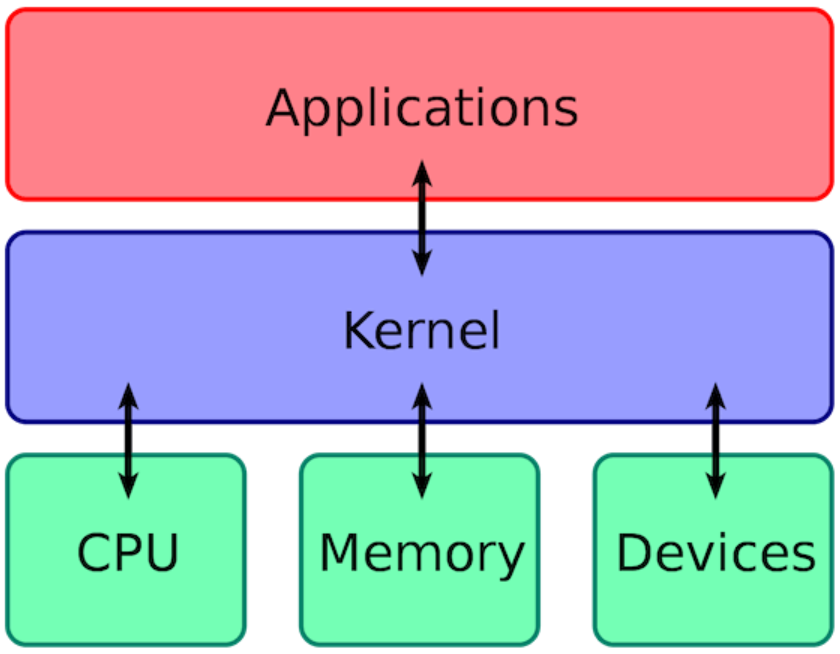
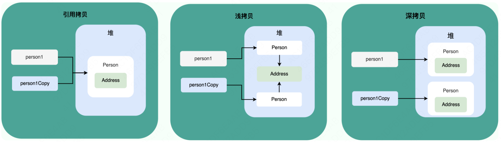

# 第01章_计算机网络

## 1. 基础知识

### 1.1 OSI七层模型是什么

### 1.2 TCP/IP四层模型是什么

### 1.3 应用层的主要协议有哪些

- **HTTP（Hypertext Transfer Protocol，超文本传输协议）**：基于 TCP 协议，主要是为 Web 浏览器与 Web 服务器之间的通信而设计的
- **SMTP（Simple Mail Transfer Protocol，简单邮件发送协议）**：基于 TCP 协议，是一种用于发送电子邮件的协议。注意：SMTP 协议只负责邮件的发送，而不是接收。要从邮件服务器接收邮件，需要使用 POP3 或 IMAP 或 HTTP 协议。
- **POP3/IMAP（邮件接收协议）**：基于 TCP 协议，两者都是负责邮件接收的协议。IMAP 协议是比 POP3 更新的协议，它在功能和性能上都更加强大，几乎所有现代电子邮件客户端和服务器都支持 IMAP。
- **FTP（File Transfer Protocol，文件传输协议）** : 基于 TCP 协议，是一种用于在计算机之间传输文件的协议。注意：FTP 是一种不安全的协议，因为它在传输过程中不会对数据进行加密。建议在传输敏感数据时使用更安全的协议，如 SFTP。
- **Telnet（远程登陆协议）**：基于 TCP 协议，用于通过一个终端登陆到其他服务器。Telnet 协议的最大缺点之一是所有数据（包括密码）均以明文形式发送，这有潜在的安全风险。所以如今很少使用 Telnet，而是使用 SSH 。
- **SSH（Secure Shell Protocol，安全的网络传输协议）**：基于 TCP 协议，通过加密和认证机制实现安全的访问和文件传输等业务。SSH 的经典用途是登录到远程电脑中执行命令，它使用C/S架构，默认端口是 22。
- **RTP（Real-time Transport Protocol，实时传输协议）**：通常基于 UDP 协议，但也支持 TCP 协议。它提供了端到端的实时传输数据的功能，但不保证实时传输质量。
- **DNS（Domain Name System，域名管理系统）**：基于 UDP 协议，用于解决域名和 IP 地址的映射问题。

### 1.4 传输层的主要协议有哪些

- **TCP（Transmission Control Protocol，传输控制协议 ）**：提供面向连接的可靠数据传输服务
- **UDP（User Datagram Protocol，用户数据协议）**：提供无连接的，尽最大努力的数据传输服务

### 1.5 网络层的主要协议有哪些

- **IP（Internet Protocol，网际协议）**：主要作用是定义数据包的格式、对数据包进行路由和寻址，以便它们可以跨网络传播并到达正确的目的地。目前 IP 协议主要分为两种，一种是过去的 IPv4，另一种是较新的 IPv6，目前这两种协议都在使用，但后者已经被提议来取代前者。
- **ARP（Address Resolution Protocol，地址解析协议）**：ARP 协议解决的是网络层地址和链路层地址之间的转换问题。
- **ICMP（Internet Control Message Protocol，互联网控制报文协议）**：一种用于传输网络状态和错误消息的协议，常用于网络诊断和故障排除。例如，Ping 工具就使用了 ICMP 协议来测试网络连通性。
- **NAT（Network Address Translation，网络地址转换协议）**：应用于内部网到外部网的地址转换过程中。

注意，以下三个协议与网络层密切相关，但并不属于网络层协议：

- **OSPF（Open Shortest Path First，开放式最短路径优先）** ：一种内部网关协议，也是广泛使用的一种动态路由协议，基于链路状态算法，考虑了链路的带宽、延迟等因素来选择最佳路径。它是传输层协议，基于IP。
- **RIP（Routing Information Protocol，路由信息协议）**：一种内部网关协议，也是一种动态路由协议，基于距离向量算法，使用固定的跳数作为度量标准，选择跳数最少的路径作为最佳路径。它是应用层协议，基于UDP。
- **BGP（Border Gateway Protocol，边界网关协议）**：一种用来在路由选择域之间交换网络层可达性信息的路由选择协议。它是应用层协议，基于TCP。

## 2. HTTP

### 2.1 从输入URL到页面展示的过程

1. 在浏览器中输入指定网页的 URL。
2. 浏览器通过 DNS 协议，获取域名对应的 IP 地址。
3. 浏览器根据 IP 地址和端口号，向目标服务器发起一个 TCP 连接请求。
4. 浏览器在 TCP 连接上，向服务器发送一个 HTTP 请求报文，请求获取网页的内容。
5. 服务器收到 HTTP 请求报文后，处理请求，并返回 HTTP 响应报文给浏览器。
6. 浏览器收到 HTTP 响应报文后，解析响应体中的 HTML 代码，渲染网页的结构和样式，同时根据 HTML 中的其他资源的 URL（如图片、CSS、JS 等），再次发起 HTTP 请求，获取这些资源的内容，直到网页完全加载显示。
7. 浏览器在不需要和服务器通信时，可以主动关闭 TCP 连接，或者等待服务器的关闭请求。

### 2.2 HTTP状态码有哪些

### 2.3 HTTP和HTTPS的区别

### 2.4 HTTP是无状态协议，该如何保存用户状态

HTTP 是无状态（stateless）协议，也就是说 HTTP 协议自身不对请求和响应之间的通信状态进行保存。要想保存用户状态，可以使用Session机制，它的主要作用就是通过服务端记录用户的状态。在服务端保存 Session 的方法很多，最常用的就是内存和Redis数据库。

### 2.5 URI和URL的区别

- URI(Uniform Resource Identifier) 是统一资源标志符，可以唯一标识一个资源。
- URL(Uniform Resource Locator) 是统一资源定位符，可以提供该资源的路径。它是一种具体的URI，不仅可以唯一标识资源，而且还提供了定位该资源的信息。

> URI 的作用像身份证号一样，URL 的作用更像家庭住址一样

## 3. DNS

### 3.1 DNS的作用是什么

DNS（Domain Name System）域名管理系统，用于解决**域名和IP地址的映射问题**。目前 DNS 的设计采用的是分布式、层次数据库结构，DNS 是应用层协议，它可以在 UDP 或 TCP 协议之上运行（一般是UDP），端口为53。

### 3.2 DNS服务器有哪些

### 3.3 DNS劫持是什么

DNS 劫持是一种网络攻击，它通过修改 DNS 服务器的解析结果，使用户访问的域名指向错误的 IP 地址，从而导致用户无法访问正常的网站，或者被引导到恶意的网站。DNS 劫持有时也被称为 DNS 重定向、DNS 欺骗或 DNS 污染。

### 3.4 DNS的工作流程

## 4. TCP与UDP

### 4.1 TCP与UDP的区别

|                    | TCP        | UDP        |
| ------------------ | ---------- | ---------- |
| 是否面向连接       | 是         | 否         |
| 是否可靠           | 是         | 否         |
| 传输效率           | 较慢       | 较快       |
| 传输形式           | 字节流     | 数据报文段 |
| 首部开销           | 20到60字节 | 8字节      |
| 是否提供广播或多播 | 否         | 是         |

- **UDP一般用于即时通信**，比如：语音、 视频、直播等等。这些场景对传输数据的准确性要求不是特别高，比如你看视频即使少个一两帧，实际给人的感觉区别也不大。
- **TCP用于对传输准确性要求特别高的场景**，比如文件传输、发送和接收邮件、远程登录等等。

### 4.2 HTTP基于TCP还是UDP

HTTP/3.0之前是基于TCP协议的，而HTTP/3.0将弃用TCP，改用**基于UDP的QUIC协议**

### 4.3 TCP三次握手

- **一次握手**: 客户端发送带有 `SYN（seq=x）` 标志的数据包给服务端，然后客户端进入 `SYN_SENT` 状态，等待服务器的确认；
- **二次握手**: 服务端发送带有 `SYN+ACK（seq=y, ack=x+1）` 标志的数据包给客户端，然后服务端进入 `SYN_RCVD` 状态
- **三次握手**: 客户端发送带有 `ACK（ack=y+1）` 标志的数据包给服务端，然后客户端和服务器端都进入`ESTABLISHED` 状态，完成 TCP 三次握手。

#### 1、三次握手的目的是什么

三次握手的目的是建立可靠的通信信道，简单来说就是双方确认自己与对方的发送与接收是正常的。

1. **第一次握手**：Client 什么都不能确认；Server 确认了对方发送正常，自己接收正常
2. **第二次握手**：Client 确认了：自己发送、接收正常，对方发送、接收正常
3. **第三次握手**：Server 确认了：自己发送正常，对方接收正常

#### 2、只有两次握手会有什么问题

假如只采用两次握手，可能发生以下情况：

1. 客户端第一次发送SYN报文段，但因为网络堵塞迟迟没有到服务端
2. 客户端迟迟没有等到服务端的响应，于是超时重试，重新又发了SYN报文段
3. 服务端收到了SYN报文段，于是响应SYNACK报文段。由于是两次握手，服务端就直接进入了`ESTABLISHED`状态准备通信。
4. 客户端接下来与服务端通信，通信完成后关闭TCP连接
5. 此时客户端第一次发送的SYN报文段终于到达了服务端
6. 服务端收到了SYN报文段，于是响应SYNACK报文段，并再次进入`ESTABLISHED`状态准备通信
7. 而客户端早已进入`CLOSED`状态，所以服务端只能在那一直等待通信，浪费连接资源。

### 4.4 TCP四次挥手

- **第一次挥手**：客户端发送一个 `FIN（seq=x）` 标志的数据包给服务端，用来关闭客户端到服务器的数据传送。然后客户端进入 `FIN_WAIT_1` 状态。
- **第二次挥手**：服务器收到上述数据包，就发送一个 `ACK（ack=x+1）` 标志的数据包给客户端。然后服务端进入 `CLOSE_WAIT` 状态，客户端进入 `FIN_WAIT_2` 状态。之后服务端还可以继续给客户端发数据。
- **第三次挥手**：服务端发送一个 `FIN（seq=y）` 标志的数据包给客户端，请求关闭连接，然后服务端进入 `LAST_ACK` 状态。
- **第四次挥手**：客户端发送 `ACK（ACK=y+1）` 标志的数据包给服务端，然后客户端进入`TIME_WAIT`状态，该状态会持续**2MSL**(两个最长报文段寿命)时间，约30秒，若该时间段内没有收到服务端发来的新请求，则客户端就最终进入了`CLOSED`状态。服务端在收到上述数据包后直接进入 `CLOSED` 状态。

#### 1、四次挥手的目的是什么

TCP 是全双工通信，可以双向传输数据。任何一方都可以在数据传送结束后发出连接释放的通知，待对方确认后进入半关闭状态。当另一方也没有数据再发送的时候，则发出连接释放通知，对方确认后就完全关闭了 TCP 连接。

#### 2、为什么不能把服务器发送的ACK和FIN合并起来，变成三次挥手

因为服务器收到客户端断开连接的请求时，可能还有一些数据没有发完，这时先回复 ACK，表示接收到了断开连接的请求。等到数据发完之后再发 FIN，断开服务器到客户端的数据传送。

#### 3、如果第二次挥手时服务器的ACK没有送达客户端，会怎样

客户端没有收到ACK确认，会重新发送FIN请求

#### 4、为什么第四次挥手客户端需要等待2MSL后才进入CLOSED状态

第四次挥手时，客户端发送给服务器的 ACK 有可能丢失，如果服务端因为某些原因而没有收到 ACK 的话，服务端就会重发 FIN，如果客户端在 2MSL 的时间内收到了 FIN，就会重新发送 ACK 并再次等待 2MSL，防止 Server 没有收到 ACK 而不断重发 FIN。

> **MSL(Maximum Segment Lifetime)** : 一个片段在网络中最大的存活时间，2MSL 就是一个发送和一个回复所需的最大时间。如果直到 2MSL，Client 都没有再次收到 FIN，那么 Client 推断 ACK 已经被成功接收，则结束 TCP 连接。

### 4.5 TCP如何保证数据传输的可靠性

1. 每个TCP报文段都具有序号，可以根据序号进行排序和去重
2. 校验和
3. 超时重传机制
4. 流量控制
5. 拥塞控制

### 4.6 TCP中的缓存（发送缓存和接收缓存）有什么作用

### 4.7 ARQ协议是什么

**自动重传请求**（Automatic Repeat-reQuest，ARQ）是 OSI 模型中数据链路层和传输层的错误纠正协议之一。它通过使用确认和超时这两个机制，在不可靠服务的基础上实现可靠的信息传输。如果发送方在发送后一段时间之内没有收到确认信息（Acknowledgements，ACK），它通常会重新发送，直到收到确认或者重试超过一定的次数。

ARQ包括停止等待ARQ协议和连续ARQ协议：

- 停止等待ARQ协议的基本原理就是每发完一个分组就停止发送，等待对方确认（回复 ACK）。如果过了一段时间后（利用超时计时器），还是没有收到 ACK 确认，就需要重新发送，直到收到确认后再发下一个分组
- 连续ARQ协议可提高信道利用率。发送方维持一个发送窗口，凡位于发送窗口内的分组可以连续发送出去，而不需要等待对方确认。接收方一般采用累计确认，对按序到达的最后一个分组发送确认，表明到这个分组为止的所有分组都已经正确收到了。

> 注意：重传超时时间一般会根据实际的网络情况进行动态调整，而不是简单地直接使用RTT作为超时时间。

## 5. IP

### 5.1 IP寻址如何工作

### 5.2 什么是IP地址过滤

**IP 地址过滤**就是限制或阻止特定 IP 地址范围的访问。例如，你有一个图片服务突然被某一个 IP 地址攻击，那我们就可以禁止这个 IP 地址访问图片服务。

### 5.3 NAT的作用是什么

**NAT（Network Address Translation，网络地址转换）** 允许将私有 IP 地址（如在局域网中使用的 IP 地址）映射为公有 IP 地址（在互联网中使用的 IP 地址）或者反向映射，从而实现局域网内的多个设备通过单一公有 IP 地址访问互联网。

NAT 不光可以缓解 IPv4 地址资源短缺的问题，还可以隐藏内部网络的实际拓扑结构，使得外部网络无法直接访问内部网络中的设备，从而提高了内部网络的安全性。

### 5.4 路由协议有哪些

## 6. ARP

### 6.1 什么是MAC地址

### 6.2 ARP协议的作用

### 6.3 ARP协议的工作原理

ARP表，广播问询，单播响应

# 第02章_操作系统

## 1. 基础知识

### 1.1 什么是操作系统

操作系统（Operating System，简称 OS）是管理计算机硬件与软件资源的一个软件程序。操作系统的内核（Kernel）是操作系统的核心部分，它是连接应用程序和硬件的桥梁，决定着系统的性能和稳定性。

> 操作系统存在屏蔽了硬件层的复杂性，它就像是硬件使用的负责人，统筹着各种相关事项。

### 1.2 操作系统的主要功能有哪些

- **进程和线程的管理**：进程的创建、撤销、阻塞、唤醒，进程间的通信等。
- **存储管理**：内存、外存的分配和管理。
- **文件管理**：文件的读、写、创建及删除等。
- **设备管理**：完成设备（输入输出设备和外部存储设备等）的请求或释放，以及设备启动等功能。
- **网络管理**：操作系统管理计算机网络的配置、连接、通信和安全等。
- **安全管理**：用户的身份认证、访问控制、文件加密等，以防止非法用户对系统资源的访问和操作。

### 1.3 什么是用户态和内核态

### 1.4 为什么不能只有内核态

### 1.5 用户态和内核态是如何切换的

### 1.6 什么是系统调用

### 1.7 系统调用的过程

## 2. 进程和线程

### 2.1 进程和线程的区别

**进程（Process）** 是指计算机中正在运行的一个程序实例。

**线程（Thread）** 也被称为轻量级进程，更加轻量，多个线程可以在同一个进程中同时执行，并且共享进程的资源比如内存空间、文件句柄、网络连接等。

**进程是操作系统资源分配的基本单位，而线程是处理器调度和执行的基本单位**。同一进程内的多个线程，会共享该进程的地址空间，并且共享本进程中的一些资源（初始化数据段、未初始化数据段、堆内存段等），但每个线程有自己独立的寄存器、程序计数器和栈（因此该进程的地址空间里会有多个栈，一般系统默认为每个线程分配8MB的栈空间）。

> **同一进程内的线程间进行上下文切换时开销很小**，因为地址空间保持不变，只需切换栈、寄存器、程序计数器等不共享的数据。多核计算机中，**各个线程可占用不同的CPU并行运行**，提升效率。

### 2.2 PCB是什么

### 2.3 进程有哪几种状态

### 2.4 什么是僵尸进程和孤儿进程

### 2.5 线程间同步的方式有哪些

### 2.6 进程间通信的方式有哪些

### 2.7 进程的调度算法有哪些

## 3. 死锁

### 3.1 什么是死锁

死锁（Deadlock）是一种常见的并发问题，它是指各线程互相等待对方手里的资源，导致各线程都阻塞，无法向前推进的现象。

### 3.2 产生死锁的必要条件

### 3.3 解决死锁的方法

## 4. 文件系统

### 4.1 常见的磁盘调度算法有哪些

### 4.2 文件系统的功能

### 4.3 硬链接和软链接有什么区别

### 4.4 硬链接为什么不能跨文件系统

### 4.5 提高文件系统性能的方式有哪些

## 5. 内存管理

### 5.1 内存管理主要做了什么

- **内存的分配与回收**
- **地址转换**：将程序中的虚拟地址转换成内存中的物理地址
- **内存扩充**：当系统没有足够的内存时，利用虚拟内存技术或自动覆盖技术，从逻辑上扩充内存。
- **内存映射**：将一个文件直接映射到进程的地址空间中，这样可以通过内存指针用读写内存的办法直接存取文件内容，速度更快。
- **内存优化**：通过调整内存分配策略和回收算法来优化内存使用效率。
- **内存安全**：保证进程之间使用内存互不干扰，避免一些恶意程序通过修改内存来破坏系统的安全性。

### 5.2 什么是内存碎片

### 5.3 内存管理方式有哪些

### 5.4 虚拟内存有什么用

### 5.5 什么是虚拟地址空间

### 5.6 分段机制是什么

### 5.7 分页机制是什么

### 5.8 分页和分段有哪些共同点和区别

**共同点**：

- 都是非连续内存管理的方式。
- 都采用了地址映射的方法，将虚拟地址映射到物理地址，以实现对内存的管理和保护。

**区别**：

- 分页机制以页面为单位进行内存管理，而分段机制以段为单位进行内存管理。页的大小是固定的，而段的大小不固定。
- 页是物理单位，其大小由操作系统决定。而段则是逻辑单位，是为了满足程序对内存空间的逻辑需求而设计的，通常根据程序中数据和代码的逻辑结构来划分。
- 分段机制容易出现外部碎片。分页机制可能出现内部碎片。
- 分页机制采用了页表来完成虚拟地址到物理地址的映射；而分段机制则采用了段表来完成虚拟地址到物理地址的映射。
- 分页机制对程序没有任何要求，程序只需要按照虚拟地址进行访问即可；而分段机制需要程序员将程序分为多个段，并且显式地使用段寄存器来访问不同的段。

### 5.9 局部性原理是什么

# 第03章_JavaSE

## 1. 基础知识

### 1.1 为什么Java代码可以实现一次编写、到处运行

### 1.2 一个Java文件里可以有多个类吗（不含内部类）

### 1.3 什么是泛型擦除

### 1.4 说一说你对Java反射机制的理解

## 2. 包装类

### 2.1 包装类的缓存机制是什么

### 2.2 自动装箱和自动拆箱是什么

### 2.3 如何对Integer和Double类型判断相等

转化为基本数据类型，再进行比较

## 3. 面向对象编程

### 3.1 成员变量和局部变量的区别

### 3.2 方法重写有哪些要求

### 3.3 可变长参数有哪些特点

### 3.4 面向对象的三大特征是什么

### 3.5 接口和抽象类有什么共同点和区别

共同点：

- 都不能被实例化
- 都可以包含抽象方法
- 都可以有默认实现的方法

区别：

- 接口主要用于对类的行为进行约束，是一种规范；而抽象类主要用于代码复用，强调的是所属关系
- 一个类只能继承一个类，但可以实现多个接口

### 3.6 引用拷贝、浅拷贝、深拷贝的区别

### 3.7 Object类的常用方法有哪些

### 3.8 为什么重写equals()时还必须重写hashCode()

因为要遵守规定：两个相等的对象的hashCode值必须相等。

## 4. String

### 4.1 String、StringBuilder、StringBuffer的区别

### 4.2 String为什么是不可变的

### 4.3 创建字符串时，new和`""`推荐使用哪种方式

### 4.4 两个字符串拼接的底层是如何实现的

### 4.5 String的intern()方法的作用

## 5. 异常处理

### 5.1 说一说Java的异常机制

### 5.2 finally是必然执行的吗

### 5.3 在finally中return会发生什么

在finally中进行return或throw，会导致try块和catch块中的return和throw失效，最终执行的是finally中的。

## 6. IO

### 6.1 什么是序列化和反序列化

### 6.2 Serializable接口为什么需要定义serialVersionUID变量

### 6.3 介绍一下Java中的IO流

### 6.4 UNIX的五大IO模型

### 6.5 Java的三大IO模型

## 7. 集合

### 7.1 介绍一下HashMap底层的实现原理

### 7.2 如何得到一个线程安全的Map

### 7.3 请介绍LinkedHashMap的底层原理

### 7.4 请介绍TreeMap的底层原理

### 7.5 请介绍ArrayList的底层原理

# 第04章_MySQL

## 1. 基础知识

### 1.1 数据库范式有哪些

### 1.2 SQL分类

SQL语言在功能上主要分为如下三大类：

- **DDL（Data Definition Language，数据定义语言）**：包括创建，删除，修改数据库、表、视图、索引等数据库对象。主要的语句关键字包括`CREATE`、`DROP`、`ALTER`等。
- **DML（Data Manipulation Language，数据操作语言）**：包括添加，删除，更新，查询数据库记录。主要的语句关键字包括`INSERT`、`DELETE`、`UPDATE`、`SELECT`等。
- **DCL（Data Control Language，数据控制语言）**：包括定义数据库、表、字段、用户的访问权限和安全级别。主要的语句关键字包括`GRANT`、`REVOKE`、`COMMIT`、`ROLLBACK`、`SAVEPOINT`等。

> 说明：由于查询语句使用的非常频繁，所以有时也将查询语句单独分为一类，称为**DQL（Data Query Language，数据查询语言）**。有时也会将`COMMIT`、`ROLLBACK`单独分为一类，称为**TCL（Transaction Control Language，事务控制语言）**。

### 1.3 MySQL的基础架构

### 1.4 MyISAM和InnoDB的区别

### 1.5 介绍一下数据库分页

### 1.6 介绍一下SQL中的聚合函数

### 1.7 表跟表是怎么关联的？

### 1.8 谈谈你对SQL注入的理解

### 1.9 WHERE和HAVING有什么区别？

## 2. 字段类型

### 2.1 整数类型的UNSIGNED属性有什么用

使用 UNSIGNED 属性可以将正整数的上限提高一倍，因为它不需要存储负数值。

### 2.2 CHAR和VARCHAR的区别

**CHAR 是定长字符串，VARCHAR 是变长字符串**，如`VARCHAR(100)`表示最多能存储100个字符

> CHAR 在存储时会在右边填充空格以达到指定的长度，检索时会去掉空格

### 2.3 DECIMAL和DOUBLE的区别

DECIMAL 是定点数，FLOAT/DOUBLE 是浮点数。DECIMAL 可以存储精确的小数值，FLOAT/DOUBLE 只能存储近似的小数值。

### 2.4 DATETIME和TIMESTAMP的区别

DATETIME 类型没有时区信息，TIMESTAMP 和时区有关。TIMESTAMP 只需要使用 4 个字节的存储空间，但是 DATETIME 需要耗费 8 个字节的存储空间。所以 Timestamp 表示的时间范围更小。

## 3. 事务

### 3.1 MySQL事务的ACID特性分别是怎么实现的

### 3.2 并发事务会有哪些问题

### 3.3 MySQL的四种隔离级别是怎么实现的

### 3.4 MySQL锁的分类

### 3.5 当前读和快照读的区别

### 3.6 谈谈你对MVCC的了解

### 3.7 MySQL的RR隔离级别能否解决幻读问题

## 4. 索引

### 4.1 索引的优缺点

索引(Index)是存储引擎用于快速找到数据记录的一种数据结构。注意，索引是在存储引擎中实现的，所以每种存储引擎的索引不完全相同。

- 索引的优点：**提高数据查询的效率，减少磁盘I/O次数**
- 索引的缺点：维护索引要耗费时间，**会降低增、删、改的速度**；每个索引都对应一颗B+树，**会占用大量磁盘空间**

### 4.2 MySQL的索引为什么用B+树

不使用Hash表，原因在于：

- Hash索引只有在等值查询时效率很高，如果要进行范围查询，时间复杂度退化为`O(n)`
- Hash索引中数据的存储是无序的，所以对于`ORDER BY`查询，还需要重新排序
- 对于联合索引，Hash值是将联合索引键合并后一起来计算的，无法对单独的一个键进行查询
- 对于等值查询来说，通常Hash索引效率更高，但如果索引列的重复值很多，Hash索引效率就变低了，因为遇到Hash冲突时需要遍历桶中的单链表进行比较。

不使用AVL树，原因在于：

- AVL树在进行删除操作时，最坏需要进行`O(log n)`次旋转操作来维持树的平衡，这会增大磁盘IO次数

不使用红黑树，原因在于：

- 红黑树的高度虽然也是渐进`O(log n)`，但它的实际树高较高，所以同样会增大磁盘IO次数，查询效率变慢

不使用B树，是因为B+树是对B树的改进，B+树具有以下优势：

- 查询效率更加稳定：所有用户数据记录查询路径长度相同，都会查找到叶子结点。
- 磁盘读写代价更低：B+树的内节点中并没有保存数据记录，所以能存储的目录项记录就更多，因此结构上比B树更加矮胖，树高越小意味着IO次数越少。
- 在范围查询上B+树效率也更高：因为所有关键字都出现在B+树的叶子节点中，而叶子节点之间数据递增，且有指针连接，可以直接根据指针顺序读取。

### 4.3 索引的分类

- 按照物理实现方式，索引可以分为**聚簇索引**和**非聚簇索引**，其中非聚簇索引也称为二级索引。
- 按照作用字段个数，索引可以分为**单列索引**和**联合索引**
- 按照功能逻辑，索引可以分为**普通索引**、**唯一索引**、**主键索引**、**全文索引**、**空间索引**

### 4.4 什么是覆盖索引

### 4.5 什么是索引条件下推

### 4.6 联合索引的存储结构是什么，它的有效方式是什么

### 4.7 模糊查询语句中如何使用索引

### 4.8 索引的设计原则

### 4.9 索引失效的场景

## 5. MySQL调优

### 5.1 说一说你对MySQL优化的理解

### 5.2 EXPLAIN语句输出的各个列的作用，应该重点关注哪些列

### 5.3 该如何优化MySQL的查询

### 5.4 表中包含几千万条数据该怎么办

### 5.5 分库分表的缺点有什么

1. 不同数据库中的表，无法使用join操作
2. 如果涉及到多个数据库，则需要使用分布式事务
3. 主键往往需要使用分布式的全局唯一ID
4. GROUP BY和ORDER BY操作会变得非常复杂

### 5.6 深度分页如何优化

## 6. 主从复制

### 6.1 说一说你对redo log、undo log、binlog的了解

### 6.2 MySQL主从同步是如何实现的

### 6.3 如何实现读写分离

### 6.4 如何避免主从延迟时的数据不一致性

一般对于**实时性要求高的读操作，建议直接从master读取数据**。

# 第05章_JVM

## 1. 运行时数据区

### 1.1 介绍一下JVM的运行时数据区

### 1.2 创建对象的过程是怎样的

###  1.3 对象的内存布局是怎样的

### 1.4 对象的访问定位方式是什么

### 1.5 对象分配的原则有哪些

### 1.6 什么是空间分配担保

### 1.7 HotSpot为什么要分新生代和老年代

## 2. 类加载器子系统

### 2.1 介绍一下类的加载过程

### 2.2 类加载器有哪些

### 2.3 什么是双亲委派模型

## 3. 执行引擎

### 3.1 标记算法有哪些

### 3.2 垃圾收集算法有哪些

### 3.3 Java的引用类型有哪些

### 3.4 垃圾收集器有哪些

### 3.5 G1的工作流程是怎样的

### 3.6 什么是解释器和JIT编译器

### 3.7 什么是AOT

# 第06章_JUC

## 1. 基础知识

### 1.1 创建线程的方式有哪些

### 1.2 可以直接调用Thread类的run()方法启动线程吗

### 1.3 说说线程的生命周期

### 1.4 synchronized和ReentrantLock有什么区别

### 1.5 等待唤醒机制怎么实现

### 1.6 sleep()和wait()有什么区别

### 1.7 synchronized锁升级是什么

### 1.8 如何实现子线程先执行，主线程再执行

调用Thread类的`join()`方法

### 1.9 如果不使用锁，如何保证线程安全

原子类、ThreadLocal、不可变对象（final修饰）等

## 2. 锁

### 2.1 什么是悲观锁和乐观锁

### 2.2 什么是读写锁

### 2.3 读写锁的锁降级是什么

### 2.4 什么是邮戳锁

## 3. JMM

### 3.1 什么是JMM

### 3.2 什么是happens-before原则

### 3.3 如何保证原子性、可见性、有序性

### 3.4 volatile有什么特性，底层是怎么实现的

## 4. 原子类

### 4.1 什么是CAS

### 4.2 CAS有什么缺点

### 4.3 整型原子类的底层原理

### 4.4 LongAdder解决了什么问题，它是如何实现的？

## 5. AQS和并发容器

### 5.1 什么是AQS

### 5.2 说说常用的同步工具类及其原理

### 5.3 有哪些并发容器，底层原理是什么

## 6. 线程池

### 6.1 什么是线程池

### 6.2 为什么不推荐使用Executors的内置线程池

### 6.3 线程池的常见参数有哪些

### 6.4 线程池的拒绝策略有哪些

### 6.5 如何设定线程池的大小

### 6.6 线程池的API有哪些

## 7. CompletableFuture

### 7.1 Future和CompletableFuture的区别

### 7.2 CompletableFuture的常用API有哪些

### 7.3 Callable和Future有什么关系

## 8. ThreadLocal

### 8.1 什么是ThreadLocal

### 8.2 ThreadLocal的底层原理

### 8.3 ThreadLocal为什么会有内存泄漏问题

# 第07章_Java框架

## 1. Spring

### 1.1 介绍一下IoC和AOP

### 1.2 Bean的生命周期

### 1.3 Bean的作用域

### 1.4 Bean是否线程安全

### 1.5 @Component和@Bean的区别

- `@Component`注解作用于类，而`@Bean`注解作用于方法
- `@Component`注册的bean的id默认是类名首字母小写的名称，而`@Bean`注册的bean的id默认是方法名
- `@Component`通常是通过类路径扫描来自动侦测并自动装配到IoC容器中，`@Bean`注解通常是我们在标有该注解的方法中自己定义创建对象
- `@Bean` 注解比 `@Component` 注解的自定义性更强，当我们引用第三方库中的类需要装配到IoC容器时，只能通过 `@Bean` 来实现。

### 1.6 @Autowired和@Resource的区别

### 1.7 声明式事务的默认回滚策略、传播行为

### 1.8 Spring如何解决循环依赖

### 1.9 Spring框架中用到了哪些设计模式

- **工厂设计模式** : Spring 使用工厂模式通过 `BeanFactory` 创建 bean 对象。
- **代理设计模式** : Spring AOP 功能使用动态代理。
- **单例设计模式** : Spring 中的 Bean 默认都是单例的。
- **模板方法模式** : Spring 中 `JdbcTemplate` 等以 Template 结尾的类，都使用了模板方法模式。
- **包装器设计模式** : 我们的项目需要连接多个数据库，而且不同的用户在每次访问中根据需要会去访问不同的数据库。这种模式让我们可以根据用户的需求来动态切换不同的数据源。
- **观察者模式** : Spring事件驱动模型就是观察者模式很经典的一个应用。
- **适配器模式** : Spring MVC 中用到了适配器模式来适配`Controller`。

## 2. SpringMVC

### 2.1 MVC是什么

### 2.2 Spring MVC的核心组件有哪些

### 2.3 Spring MVC的工作流程

### 2.4 统一异常处理怎么做

### 2.5 Spring MVC的拦截器和过滤器的区别

### 2.6 后端为何要做参数校验

后端做参数校验，是为了避免用户绕过浏览器直接通过一些HTTP工具向后端请求一些违法数据，并且，有时候有些业务逻辑（例如判断用户是否在数据库中）只能通过后端进行校验。

## 3. MyBatis

### 3.1 MyBatis的工作原理是什么

### 3.2 `#{}`和`${}`的区别

### 3.3 MyBatis的插件机制是什么

### 3.4 什么是resultMap

### 3.5 MyBatis的动态SQL是什么

## 4. SpringBoot

### 4.1 SpringBoot自动配置原理

### 4.2 SpringBoot读取配置项信息的方式

- `@Value`
- `@ConfigurationProperties`

### 4.3 SpringBoot加载配置文件的优先级

## 5. SpringSecurity

### 5.1 Cookie和Session的区别

### 5.2 基于Session和基于Token的校验有什么区别

### 5.3 什么是JWT

### 5.4 什么是OAuth2.0

# 第08章_Redis

## 1. 基础知识

### 1.1 Redis为什么这么快

### 1.2 Redis删除过期key的策略

### 1.3 Redis内存淘汰策略有哪些

### 1.4 Redis是单线程的吗

### 1.5 Redis事务有什么缺陷

### 1.6 导致Redis阻塞的原因可能有哪些

1. 执行了耗时较久的命令，如`KEYS *`
2. 访问BigKey会产生阻塞
3. Redis进行内存页面替换（Swap）时会发生阻塞，所以我们应该尽量保证Redis有充足的可用内存

### 1.7 如何处理BigKey、HotKey

## 2. Redis数据类型

### 2.1 存储对象是用string好还是hash好

### 2.2 zset底层为什么要使用跳表，而不是平衡树、红黑树、B+树

### 2.3 五种基本数据类型的底层数据结构是什么

## 3. Redis持久化

### 3.1 介绍一下RDB和AOF，它们各自有何优劣

### 3.2 RDB创建快照时会阻塞主线程吗

### 3.3 AOF为什么是在执行完命令之后才记录日志

关系型数据库（如MySQL）通常都是执行命令之前记录日志（方便故障恢复），而Redis AOF持久化机制则是在执行完命令之后再记录日志。原因是：

- 避免额外的检查开销：在执行完命令之后再记录日志，就无需在记录日志时再对命令进行语法检查
- 在命令执行完之后再记录，就不会阻塞当前的命令执行

### 3.4 什么是AOF重写

## 4. Redis集群架构

### 4.1 Redis主从复制架构

### 4.2 主从节点之间是如何同步数据的

### 4.3 为什么主从全量复制使用RDB而不是AOF

- RDB文件存储的内容是经过压缩的二进制数据，文件很小；而AOF文件存储的是每一次的写命令，文件很大。所以，传输RDB文件更节省带宽，速度也更快。
- 使用RDB文件恢复数据，可以直接解析还原数据，速度很快；而使用AOF文件恢复数据，需要依次执行每个写命令，速度很慢。

### 4.4 Redis哨兵的工作原理

### 4.5 Sentinel可以防止脑裂吗

对于一主(M1)两从(S1、S2)的架构，如果M1所在的网络和S1、S2所在的网络被隔离，哨兵就会在S1和S2中选出一个master，这就意味着发生了脑裂。如果想防止脑裂，我们可以修改Redis配置文件中主从复制相关的配置，例如配置master至少要写入一个slave。

### 4.6 Redis分片集群架构

## 5. 缓存

### 5.1 为什么要使用缓存

- 高性能：从硬盘读取数据较慢，而如果用户访问的数据是高频数据且不经常改变，就可以放在Redis缓存中，直接操作内存速度更快
- 高并发：MySQL数据库QPS大概只有1w左右，而Redis的QPS达到10w以上，将数据库中的部分数据保存到缓存中，用户的部分请求就会直接查询缓存，进而提高了系统整体的并发。

### 5.2 为什么要给某些缓存数据设置过期时间

### 5.3 Redis如何判断数据是否过期

Redis通过过期字典来保存数据过期的时间。过期字典的键指向Redis数据库中的某个key，过期字典的值是一个long long类型的整数，这个整数保存了该key的过期时刻（毫秒精度的UNIX时间戳）。

### 5.4 缓存的高并发问题有哪些，如何解决

### 5.5 常用的缓存读写策略有哪些

## 6. 分布式锁

### 6.1 分布式锁应该具备哪些条件

### 6.2 分布式锁的常见实现方式有哪些

### 6.3 如何自己实现一个分布式锁

### 6.4 主从集群的锁丢失问题是什么

# 第09章_分布式

## 1. 基础知识

### 1.1 什么是CAP理论和BASE理论

### 1.2 什么是Paxos算法和Raft算法

### 1.3 如何设计分布式ID

一个最基本的分布式 ID 需要满足下面这些要求：

- **全局唯一**
- **高性能**：分布式 ID 的生成速度要快，对本地资源消耗要小。
- **高可用**：生成分布式 ID 的服务要保证可用性无限接近于 100%。

除了这些之外，一个比较好的分布式 ID 还应保证：

- **安全**：ID 中不包含敏感信息。
- **有序递增**：如果要把 ID 存放在数据库的话，ID 的有序性可以提升数据库写入速度。并且，很多时候 ，我们还很有可能会直接通过 ID 来进行排序。
- **有具体的业务含义**：生成的 ID 如果能有具体的业务含义，可以让定位问题以及开发更透明化（通过 ID 就能确定是哪个业务）。
- **独立部署**：也就是分布式系统单独有一个发号器服务，专门用来生成分布式 ID。这样生成 ID 的服务就可以和业务相关的服务解耦。不过，这样同样带来了网络调用消耗增加的问题。总的来说，如果需要用到分布式 ID 的场景比较多的话，独立部署的发号器服务还是很有必要的。

通常情况下，我们会使用**雪花算法**来生成分布式ID。雪花算法（Snowflake Algorithm）由Twitter公司提出，它能够在分布式系统中生成**全局的唯一ID**，并且在同一个节点的表中能保证主键的**有序性**。

雪花算法生成的ID是一个64位的整数，由以下几个部分组成：

1. 符号位：1bit，正数是0，负数是1。一般id都是正数，所以该位通常都是0
2. 时间戳：41bit，精确到毫秒级
3. 节点ID：10bit，用于标识分布式系统中的不同节点
4. 序列号：12bit，表示在同一毫秒内生成的不同ID的序号，从0开始自增

**注意：雪花算法生成的数，需要使用Long或者String类型保存**

> 在实际项目中，我们一般也会对 Snowflake 算法进行改造，最常见的就是在 Snowflake 算法生成的 ID 中加入业务类型信息。

### 1.4 客户端负载均衡和服务端负载均衡的区别

### 1.5 什么是CDN

**CDN**全称是Content Delivery Network，即**内容分发网络**，也就是将**静态资源**分发到多个不同的地方以实现**就近访问**，进而加快静态资源的访问速度，减轻服务器以及带宽的负担。一般像阿里云、腾讯云等云厂商都会提供开箱即用的CDN服务。

静态资源缓存到CDN节点中有以下方式：

- 可以通过**预热**的方式将源站的资源同步到CDN节点中。这样的话，用户首次请求资源可以直接从CDN节点中取，无需回源。
- 如果不预热的话，那么访问的资源可能不在CDN节点中，这个时候CDN节点就会请求源站获取资源，这个过程称为**回源**。
- 如果资源有更新的话，可以对其**刷新**，也就是删除CDN节点上缓存的旧资源，并强制CDN节点回源获取最新资源。

> **命中率**和**回源率**是衡量CDN服务质量的两个重要指标。命中率越高越好，回源率越低越好。

找到最合适的CDN节点，主要是通过GSLB（Global Server Load Balance，全局负载均衡），具体流程如下：

1. 浏览器向 DNS 服务器发送域名请求；
2. DNS 服务器根据 CNAME( Canonical Name ) 别名记录向 GSLB 发送请求；
3. GSLB 返回性能最好（通常距离请求地址最近）的 CDN 节点的地址给浏览器；
4. 浏览器直接访问指定的 CDN 节点。

如果我们的资源被其他用户或者网站非法盗刷的话，将会是一笔不小的开支。解决这个问题最简单的办法就是设置 **Referer 防盗链**，具体来说就是根据 HTTP 请求头里面的 Referer 字段对请求进行限制。我们可以通过 Referer 字段获取到当前请求页面的来源页面的网站地址，这样我们就能确定请求是否来自合法的网站。CDN 服务提供商几乎都提供了这种比较基础的**防盗链机制**。

### 1.6 RPC的底层原理是什么

### 1.7 常用的RPC框架有哪些

### 1.8 有了HTTP协议，为什么还要有RPC

## 2. API网关

### 2.1 API网关的作用是什么

微服务背景下，一个系统被拆分为多个服务，但是像安全认证、流量控制、日志、监控等功能是每个服务都需要的，没有API网关的话，我们就需要在每个服务中单独实现，这使得我们做了很多重复的事情。

API网关最主要的作用是**请求转发**和**请求过滤**，常见的API网关有Spring Cloud Gateway。

### 2.2 Gateway的工作流程是怎样的

### 2.3 Gateway中路由和断言是什么关系

- 一个路由规则可以包含多个断言
- 如果一个路由规则中有多个断言，则需要同时满足才能匹配
- 如果一个请求可以匹配多个路由，则映射第一个匹配成功的路由

### 2.4 Gateway如何实现动态路由

一般是通过Nacos配置中心，动态修改配置，就能动态修改路由。

### 2.5 Gateway支持限流吗

从 Sentinel 1.6.0 版本开始，Sentinel 引入了 Spring Cloud Gateway 的适配模块，可以提供两种资源维度的限流：route 维度和自定义 API 维度。也就是说，Spring Cloud Gateway 可以结合 Sentinel 实现更强大的网关流量控制。

## 3. ZooKeeper

### 3.1 简单介绍下ZooKeeper

### 3.2 ZooKeeper的Leader选举过程

### 3.3 ZooKeeper集群为什么最好是奇数台

### 3.4 ZooKeeper集群是否会发生脑裂

### 3.5 ZAB协议是什么

### 3.6 如何基于ZooKeeper实现分布式锁

# 第10章_消息队列

## 1. 消息队列经典问题

### 1.1 如何保证消息顺序消费

### 1.2 如何防止消息丢失

### 1.3 如何防止消息重复消费

### 1.4 如何防止消息积压

### 1.5 消息队列有哪些作用

### 1.6 消费者推模式和拉模式的区别

## 2. RabbitMQ

### 2.1 RabbitMQ中交换机有哪些类型

### 2.2 说说RabbitMQ的工作模型

### 2.3 说说死信队列、延迟队列、优先级队列

### 2.4 如何保证RabbitMQ的高可用

## 3. Kafka

### 3.1 Kafka为何性能极高

### 3.2 说说Kafka的核心概念

### 3.3 ZooKeeper和Kafka的关系

### 3.4 Kafka的多副本机制是什么

### 3.5 说一说Kafka的重试机制

