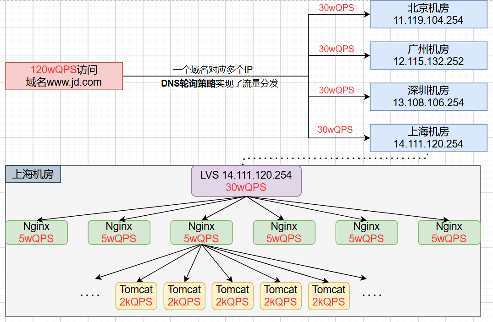

# 第01章_高并发场景

## 1. 秒杀业务解决方案

### 1.1 简介

秒杀业务具有瞬时高并发的特点，针对这一特点，必须要做好限流、异步、缓存、独立部署。秒杀（高并发）系统关注的核心问题有：

1. **服务单一职责+独立部署**：秒杀业务必须抽取成一个单一的服务并进行独立部署。这样即使秒杀服务承受不住压力而崩溃，也不会影响别的服务。
2. **动静分离**：通过Nginx做好动静分离，保证只有秒杀的动态请求才会打到后端的服务集群。
3. **限流、降级、熔断**
4. **秒杀链接加密+恶意请求拦截**：防止恶意脚本模拟秒杀请求。
5. **库存预热+快速扣减**：提前将库存预热保存到Redis中，从而实现在Redis中快速扣减库存。
6. **队列削峰**：秒杀成功的请求直接保存到MQ，然后通过监听MQ再慢慢进行扣减DB库存、创建订单等耗时操作。
7. **流量分发**

### 1.2 整体架构

#### 硬件架构

假设一个网站的用户量为1000w，那么它的日活量在20w到50w左右，而在秒杀活动时的峰值QPS可能会达到100w左右。而硬件能承载的QPS总是有限的，即便是LVS也至多承受30w的并发，所以高并发业务最关键的思想就是进行**流量分发**：



> 说明：SpringBoot中Tomcat默认的最大线程数为200，假设秒杀接口的处理时间为50ms左右（主要都是IO操作），那么该Tomcat理论上每秒能处理的请求数为4000，但由于线程上下文切换等因素不可能达到理论值4000QPS，实际上只能达到约2000QPS左右。

#### 软件架构

根据上述分析，当我们的接口性能越好，处理时间越短，不仅能给用户带来更好的体验，还能提高Tomcat可承载的QPS。因此，设计一个优秀的软件架构是极其重要的。

优化接口性能可以采用以下多种思路：

1. 能进行异步处理的地方尽量异步
2. 减少IO次数，尽量批量读取和批量写入
3. 优先进行数据校验，不合法的请求直接return
4. 加锁粒度尽可能小
5. 事务控制粒度尽可能小

秒杀业务的核心软件架构为：


### 1.3 缓存预热

数据库表：

```sql
DROP TABLE IF EXISTS `goods`;
CREATE TABLE `goods`  (
  `goods_id` bigint UNSIGNED NOT NULL AUTO_INCREMENT,
  `goods_name` varchar(255) CHARACTER SET utf8mb4 COLLATE utf8mb4_0900_ai_ci NOT NULL,
  `price` decimal(10, 2) NOT NULL,
  `stock` int NOT NULL DEFAULT 0,
  `start_time` datetime NOT NULL,
  `end_time` datetime NOT NULL,
  PRIMARY KEY (`goods_id`) USING BTREE
) ENGINE = InnoDB AUTO_INCREMENT = 124 CHARACTER SET = utf8mb4 COLLATE = utf8mb4_0900_ai_ci ROW_FORMAT = DYNAMIC;

INSERT INTO `goods` VALUES (108, '苹果16promax', 9999.00, 1000, '2024-10-22 00:00:00', '2090-01-01 00:00:00');
INSERT INTO `goods` VALUES (123, '华为mate50', 6999.00, 200, '2024-10-22 00:00:00', '2090-01-01 00:00:00');

DROP TABLE IF EXISTS `order_record`;
CREATE TABLE `order_record`  (
  `id` bigint UNSIGNED NOT NULL AUTO_INCREMENT,
  `user_id` bigint NOT NULL,
  `goods_id` bigint NOT NULL,
  `order_sn` varchar(255) CHARACTER SET utf8mb4 COLLATE utf8mb4_0900_ai_ci NOT NULL,
  PRIMARY KEY (`id`) USING BTREE,
  UNIQUE INDEX `uk_goods_user`(`goods_id` ASC, `user_id` ASC) USING BTREE
) ENGINE = InnoDB AUTO_INCREMENT = 1001 CHARACTER SET = utf8mb4 COLLATE = utf8mb4_0900_ai_ci ROW_FORMAT = DYNAMIC;
```

秒杀开始前需要通过定时任务进行**缓存预热**，将DB中秒杀商品的信息同步到Redis中，包括商品的详细信息（用于合法性校验）以及库存（用于快速扣减库存）：

```java
@XxlJob("syncGoodsInfoJobHandler")
public void syncGoodsInfo() {
    List<Goods> goodsList = goodsMapper.selectList();
    for (Goods goods : goodsList) {
        String detailKey = "seckill:goods:detail:" + goods.getGoodsId();
        String detailValue = JSON.toJSONString(goods);
        redisTemplate.opsForValue().set(detailKey, detailValue);
        String stockKey = "seckill:goods:stock:" + goods.getGoodsId();
        String stockValue = goods.getStock().toString();
        redisTemplate.opsForValue().set(stockKey, stockValue);
    }
}
```

**说明**：我们在秒杀业务中将用到的key-value定义如下

| key                              | value            | Redis数据类型 |
| :------------------------------- | ---------------- | ------------- |
| `seckill:goods:detail:{goodsId}` | goods的详细信息  | string        |
| `seckill:goods:stock:{goodsId}`  | goods的库存      | string        |
| `seckill:joinedUsers:{goodsId}`  | 秒杀成功的userId | set           |
| `lock:seckill:goods:{goodsId}`   | 分布式锁         | 分布式锁      |

### 1.4 seckill-web

```java
@RestController
@Slf4j
public class SeckillController {
    @Autowired
    private StringRedisTemplate redisTemplate;
    @Autowired
    private RocketMQTemplate rocketMQTemplate;

    @GetMapping("/seckill")
    public String doSeckill(SeckillInfo info) {
        // 1. 合法性校验，例如校验是否在秒杀时间内
        if (!checkBasicSeckillInfo(info)) {
            return "不在秒杀活动时间范围内";
        }

        // 2. 一人一单校验和库存预扣减，通过Lua脚本保证原子性
        Long result = checkAndDecreaseStock(info);
        if (!result.equals(0L)) {
            return result.equals(1L) ? "该商品已被抢完" : "您已抢购过该商品";
        }

        // 3. 秒杀成功，发送MQ消息
        String orderSn = UUID.randomUUID().toString();
        info.setOrderSn(orderSn);
        rocketMQTemplate.asyncSend("seckill-topic", JSON.toJSONString(info), new SendCallback() {
            @Override
            public void onSuccess(SendResult sendResult) {
                log.info("消息发送成功，内容:{}", JSON.toJSONString(info));
            }
            @Override
            public void onException(Throwable throwable) {
                log.error("消息发送失败，内容:{}", JSON.toJSONString(info), throwable);
            }
        });
        return "抢购成功，请稍后前往订单中心查看，订单号" + orderSn;
    }

    private boolean checkBasicSeckillInfo(SeckillInfo info) {
        String detailKey = "seckill:goods:detail:" + info.getGoodsId();
        String detailValue = redisTemplate.opsForValue().get(detailKey);
        Goods goods = JSONObject.parseObject(detailValue, Goods.class);
        long startTime = goods.getStartTime().getTime();
        long endTime = goods.getEndTime().getTime();
        long currentTime = System.currentTimeMillis();
        return startTime <= currentTime && currentTime <= endTime;
    }

    private Long checkAndDecreaseStock(SeckillInfo info) {
        String script = """
                local goodsId = ARGV[1]
                local userId = ARGV[2]
                local stockKey = 'seckill:goods:stock:' .. goodsId
                local joinedUsersKey = 'seckill:joinedUsers:' .. goodsId
                if (tonumber(redis.call('get', stockKey)) <= 0) then
                    return 1
                end
                if (redis.call('sismember', joinedUsersKey, userId) == 1) then
                    return 2
                end
                redis.call('incrby', stockKey, -1)
                redis.call('sadd', joinedUsersKey, userId)
                return 0
                """;
        return redisTemplate.execute(
                new DefaultRedisScript<>(script, Long.class),
                Collections.emptyList(),
                info.getGoodsId().toString(),
                info.getUserId().toString());
    }
}
```

### 1.5 seckill-service

seckill-service主要负责监听MQ的消息，然后真正执行业务（DB中扣减库存、创建订单）。注意，这里一定要做好幂等性处理（可以用数据库订单表的唯一索引`(goods_id,user_id)`来保证），并且要防止并发修改问题。可以采取以下两种方式：

#### 方式一

利用MySQL锁机制，防止并发修改，也就是如下SQL语句：

```sql
update goods set stock = stock - 1 where goods_id = #{goodsId} and stock > 0
```

> 说明：这种方式虽然实现简单，但是当并发量高时DB压力会很大；而且，对于一些复杂业务，仅使用MySQL锁机制未必能控制并发。

```java
@Component
@RocketMQMessageListener(topic = "seckill-topic", consumerGroup = "seckill-topic-consumer")
public class SeckillListener implements RocketMQListener<MessageExt> {
    @Autowired
    private SeckillService seckillService;

    @Override
    public void onMessage(MessageExt messageExt) {
        String message = new String(messageExt.getBody());
        SeckillInfo info = JSONObject.parseObject(message, SeckillInfo.class);
        seckillService.handleSeckillInfo(info);
    }
}
```

```java
@Service
public class SeckillService {
    @Autowired
    private GoodsMapper goodsMapper;
    @Autowired
    private OrderRecordMapper orderRecordMapper;

    @Transactional
    public void handleSeckillInfo(SeckillInfo info) {
        // update goods set stock=stock-1 where goods_id = #{goodsId} and stock > 0
        int row = goodsMapper.updateGoodsStock(info.getGoodsId());
        if (row <= 0) {
            return;
        }
        OrderRecord orderRecord = new OrderRecord();
        orderRecord.setUserId(info.getUserId());
        orderRecord.setGoodsId(info.getGoodsId());
        orderRecord.setOrderSn(info.getOrderSn());
        orderRecordMapper.insert(orderRecord);
    }
}
```

#### 方式二

利用Redis作分布式锁，防止并发修改。注意，**获取和释放锁的代码一定要包在事务方法之外**；如果反过来，那么会出现以下问题：

```
1. 线程A开启事务，获取锁，读取到库存为1000，修改为999，释放锁
2. 线程B开启事务，获取锁，此时由于A尚未提交事务，所以读取到库存仍为1000，修改为999，释放锁
3. 线程A和B提交事务后，数据库中的库存值为999
```

```java
@Slf4j
@Component
@RocketMQMessageListener(topic = "seckill-topic", consumerGroup = "seckill-topic-consumer")
public class SeckillListener implements RocketMQListener<MessageExt> {
    @Autowired
    private SeckillService seckillService;
    @Autowired
    private RedissonClient redissonClient;

    @Override
    public void onMessage(MessageExt messageExt) {
        String message = new String(messageExt.getBody());
        SeckillInfo info = JSONObject.parseObject(message, SeckillInfo.class);

        RLock lock = redissonClient.getLock("lock:seckill:goods:" + info.getGoodsId());
        lock.lock();
        try {
            seckillService.handleSeckillInfo(info);
        } catch (Exception e) {
            log.error("消费消息异常", e);
            throw new RuntimeException(e);
        } finally {
            lock.unlock();
        }
    }
}
```

```java
@Service
public class SeckillService {
    @Autowired
    private GoodsMapper goodsMapper;
    @Autowired
    private OrderRecordMapper orderRecordMapper;

    @Transactional
    public void handleSeckillInfo(SeckillInfo info) {
        Goods goods = goodsMapper.selectByPrimaryKey(info.getGoodsId());
        Integer oldStock = goods.getStock();
        if (oldStock <= 0) {
            throw new RuntimeException("库存不足");
        }
        goods.setStock(oldStock - 1);
        goodsMapper.updateByPrimaryKey(goods);
        
        OrderRecord orderRecord = new OrderRecord();
        orderRecord.setUserId(info.getUserId());
        orderRecord.setGoodsId(info.getGoodsId());
        orderRecord.setOrderSn(info.getOrderSn());
        orderRecordMapper.insert(orderRecord);
    }
}
```


# 第02章_Redis常见业务场景

## 1. 对象的存储方案

当我们使用Redis存储对象时，一般会考虑使用String类型或者Hash类型。String存储的是序列化后的整个对象数据，而Hash是将对象的每个字段单独存储。

String存储更加**节省内存**，缓存相同的对象，String占用的内存约是Hash的一半。因此，在绝大部分情况下我们**建议使用String来存储对象数据**。

但是，如果要**频繁修改对象中的某个字段时，使用Hash更好**。例如，购物车信息就推荐使用Hash存储（key为用户id，field为商品id，value为商品数量），因为购物车中的商品会频繁修改和变动。

## 2. 点赞功能

点赞功能的核心要点是：对于同一个商品，一个用户只能点赞一次，再次点击则视为取消点赞。因此我们推荐使用的架构为：

- 使用Redis的set数据类型，用于保存给该商品**点过赞的用户id集合**
- 在数据库中只保存该商品的**点赞数量**

示例代码如下：

```java
@Service
public class GoodsServiceImpl implements GoodsService {
    @Autowired
    private StringRedisTemplate redisTemplate;
    @Autowired
    private GoodsMapper goodsMapper;

    @Transactional
    @Override
    public void starGoods(Long userId, Long goodsId) {
        // 1. 判断当前用户是否已经点过赞
        String key = "goods:stars:" + goodsId;
        Boolean hasStar = redisTemplate.opsForSet().isMember(key, userId.toString());

        if (Boolean.TRUE.equals(hasStar)) {
            // 2. 如果已点过赞，则取消点赞
            // update goods set stars = stars - 1 where id = #{goodsId}
            goodsMapper.decreaseStars(goodsId);
            redisTemplate.opsForSet().remove(key, userId.toString());
        } else {
            // 3. 如果未点过赞，则进行点赞
            // update goods set stars = stars + 1 where id = #{goodsId}
            goodsMapper.increaseStars(goodsId);
            redisTemplate.opsForSet().add(key, userId.toString());
        }
    }
}
```

## 3. 签到功能

可以使用Bitmap实现签到功能，能极大**节省存储空间**。通常使用`用户id`和`年月`的组合作为key，而value的每个二进制位表示每日是否签到。

示例代码如下：

```java
@Service
public class SignServiceImpl implements SignService {
    // 说明：需要使用opsForValue()来操作Bitmap
    @Autowired
    private StringRedisTemplate redisTemplate;

    /**
     * 用户签到
     */
    @Override
    public void sign(Long userId) {
        LocalDateTime currentTime = LocalDateTime.now();
        String key = String.format("sign:%d:%s", userId, currentTime.format(DateTimeFormatter.ofPattern("yyyyMM")));
        int dayOfMonth = currentTime.getDayOfMonth(); // 1到31
        redisTemplate.opsForValue().setBit(key, dayOfMonth - 1, true);
    }

    /**
     * 查询用户在本月的签到数
     */
    @Override
    public int getSignCount(Long userId) {
        LocalDateTime currentTime = LocalDateTime.now();
        String key = String.format("sign:%d:%s", userId, currentTime.format(DateTimeFormatter.ofPattern("yyyyMM")));
        Long count = redisTemplate.execute((RedisCallback<Long>) connection -> connection.bitCount(key.getBytes()));
        return count.intValue();
    }
}
```

## 4. UV统计

- UV（Unique Visitor）：独立访客量，是指通过互联网访问这个网页的自然人。一天内同一个用户多次访问该网站，只记录1次。
- PV（Page View）：页面访问量，也称为点击量。用户多次打开页面，则记录多次PV，所以PV往往用来衡量网站的流量。

我们可以使用HyperLogLog来进行UV统计。测试代码如下：

```java
@Test
public void testHyperLogLog() {
    String[] userIds = new String[1000];
    int index = 0;
    for (int i = 1; i <= 1000000; i++) {
        userIds[index++] = "userId_" + i;
        if (index == 1000) {
            index = 0;
            redisTemplate.opsForHyperLogLog().add("uv:20241111", userIds);
        }
    }
    // 统计UV，HyperLogLog底层算法保证误差不会超过0.81%
    Long count = redisTemplate.opsForHyperLogLog().size("uv:20241111");
    System.out.println("count = " + count);
}
```

## 5. 排行榜功能

zset（有序集合）数据类型可以用于做排行榜，用到的命令有：

- `ZRANGE`：从小到大排序
- `ZREVRANGE`：从大到小排序
- `ZREVRANK`：指定元素排名

## 6. 抽奖功能

set数据类型可以实现一个简单的抽奖系统，用到的命令有：

- `SADD`：向指定集合添加元素
- `SPOP`：随机移除并获取指定集合中一个或多个元素，适用于不允许重复中奖的场景
- `SRANDMEMBER`：随机获取指定集合中一个或多个元素，适用于允许重复中奖的场景


